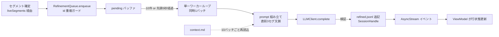

# 03. Haiku バッチ整形（RefinementQueue）詳細設計

対象読者: Kikimi 実装者（Claude Code 自身）。実装前に必ず読むこと。

参照元: `kikimi.md` 7 章（LLM 整形パイプライン）, 5 章（refined.jsonl データモデル）, 8.5 章（バックプレッシャ）,
`docs/design/12-llm-client.md`（LLM 呼び出しの単一窓口）, `docs/design/04-summary-updater.md`
（セッション寿命 actor・直列化・イベント push の先行パターン）, `docs/design/06-ui-panels.md` 6.3 節
（`TranscriptRowState`）, `docs/design/07-session-store.md`（`appendRefinedSegment` / JSONL 追記規約）。

**前提（実装済みの下地。本設計では作らない）**:

- `RefinedSegment` モデル（`id/startMs/endMs/speaker/rawText/refinedText?/error?/refinedAt/model/batchId`）と
  `SessionHandle.appendRefinedSegment(_:)` / `readRefinedSegments()`（`meta.refinedCount` インクリメント込み）
- `TranscriptRowState` の `.refining` / `.refined(String)` / `.refinedFailed(String)`
  （`Kikimi/ViewModels/TranscriptRowList.swift`）。**描画も実装済み**: `TranscriptTabView.swift` の
  `displayText`/`textColor` が 🔄 マーカー・refinedFailed の raw フォールバック・色分けまで持っている。
  本フェーズで UI ビュー側の追加作業は不要
- `LLMClient` / `LLMCompleting` / `KIKIMI_STUB_LLM` スタブ（`docs/design/12-llm-client.md`）
- セッション専用 `context.md` の読み書き（`SessionHandle+Prep.swift` の `readContext()`。欠落時 warning + 空文字）

## 1. 目的とスコープ

確定済み transcript セグメントを **10 件 or 5 秒のバッチ**で Haiku に渡してフィラー除去・句読点補正し、
`refined.jsonl` に追記して UI 行を整形済み表示に切り替える。kikimi.md 7 章の実装。

**スコープ内**: バッチ化・トリガ判定・キュー管理・prompt 組み立て・応答検証・refined.jsonl 追記・
UI への差分イベント・context.md のキャッシュ更新戦略・未整形バックログの追い付き。

**スコープ外**:

| 関心事 | 担当 |
|---|---|
| CLI 起動・構造化出力・スタブ機構 | `12-llm-client.md`（実装済み。9 章の組み込み既定応答の追加のみ本フェーズで行う） |
| サマリ更新（refined の消費はしない。10 章参照） | `04-summary-updater.md` |
| Wiki export の refined 優先 + raw フォールバック | 将来 `08-wiki-export.md` |
| Ended セッションの遡り一括整形 UI | 将来検討（12 章 Open Questions） |

## 2. 全体フロー



- **enqueue 受理の瞬間に UI 行は `.refining`**（kikimi.md 10 章の「整形待ちは 🔄」）
- バッチ処理は**単一ワーカーループのみ**が行う（3.1 節。kikimi.md 7 章「文脈順序を確実に保つ」）
- どの失敗も**録音・書き起こし・保存をブロックしない**（kikimi.md 6 章「録音は絶対に止めない」）

## 3. コンポーネントと公開 API

`SummaryUpdater` と同型の actor。ただしライフサイクルは `RealtimeDiarizationCoordinator` と同じ
「**ViewModel 生存期間中 1 インスタンス**」型（7 章）。`MeetingWorkspaceViewModel` が
`diarizationCoordinatorIfEnabled()` と同型のガード付き遅延生成（factory 注入）で保持する。

```swift
actor RefinementQueue {
    init(
        sessionHandle: SessionHandle,
        llm: LLMCompleting,
        config: RefinementConfig,
        now: @Sendable () -> Date = Date.init
    )

    /// UI 反映用イベント（5.3 節）。ViewModel が for await で購読する。
    nonisolated var events: AsyncStream<RefinementEvent> { get }

    /// 録音区間の開始ごとに呼ぶ。冪等（ワーカーループは最初の 1 回だけ起動し、以降の呼び出しは
    /// 停止フラグの解除 + バックログ再スキャンのみ行う。7 章）。
    func start() async

    /// 確定セグメントを 1 件投入する。既に pending / in-flight / 整形済みの id は無視する（3.2 節）。
    func enqueue(_ segment: TranscriptSegment)

    /// pending を件数に関わらずバッチ化対象にする（Paused / Ended のフラッシュ用）。
    /// ワーカーに flush 要求を出すだけで、自らバッチ処理はしない（3.1 節）。
    func flush()

    /// pending が空になり、かつ in-flight のバッチが無くなるまで待つ（Ended 時のドレイン。7 章）。
    func drain() async

    /// context.md を次バッチから再読込する（「今すぐ反映」ボタン用。4.3 節）。
    func refreshContextNow()
}
```

### 3.1 直列化（単一ワーカーループ）

kikimi.md 7 章の「バッチ処理は直列（同時に走る Haiku 呼び出しは 1 つ）」を、
`SummaryUpdater.runSerialized`（04 §4.1.1）に相当する**単一の実行ゲート**として明文化する:

- バッチの「確定 → prompt → LLM → 追記 → イベント」を実行するのは、`start()` が一度だけ起動する
  **単一のワーカーループ `Task`** のみ。`enqueue()`/`flush()`/`drain()` は絶対に自分でバッチ処理をしない
- `enqueue()` は pending に積んでワーカーを起こすだけ。`flush()` は「タイムアウト・件数を無視して
  今の pending をバッチ化してよい」フラグを立ててワーカーを起こすだけ
- `drain()` は「pending が空 **かつ** in-flight バッチなし」（= idle）になるまで待つ。
  実装は actor 内の待機者リスト（`CheckedContinuation` の配列）にぶら下がり、ワーカーが idle に
  達したときに全員 resume する。**LLM 呼び出し中（pending が空でも in-flight あり）を「完了」と
  誤認してはならない**
- ワーカーループは actor メソッドを await で呼びながら回る通常の `Task`。actor 再入により
  enqueue は処理中も受け付けられる（pending への追加は actor 直列化で安全）

### 3.2 id 重複ガード（不変条件）

**`refined.jsonl` に同一 id の行を二度追記しない**ことをこのコンポーネントの不変条件とする。
根拠: `SummaryUpdater.loadPendingInput()` は `Dictionary(uniqueKeysWithValues:)` で refined を
id 引きしており（`SummaryUpdater.swift:398` 付近）、**同一 id が 2 行あるとクラッシュする**。
7 章のバックログ追い付きとライブ enqueue は並行し得るため、順序保証ではなく**集合による冪等化**で守る:

- actor 内に `knownIds: Set<String>` を持つ。内容 = 「refined.jsonl に追記済みの id」∪「pending 中の id」∪
  「in-flight バッチ中の id」
- `start()` のバックログスキャン時に `readRefinedSegments()` の id で初期化（追記のたびに追加）
- `enqueue()`（ライブ経路）もバックログスキャン（`start()` 経路）も、`knownIds` に含まれる id は黙って
  スキップする。これで両経路の実行順序に依存せず二重追記が構造的に起きない
- 5.2 節の停止で pending を破棄したときは、破棄した id を `knownIds` から取り除く
  （次の `start()` のバックログスキャンで再挑戦できるように）

**防御の二重化（実装タスク）**: 上記不変条件とは独立に、`SummaryUpdater.loadPendingInput()` の
`Dictionary(uniqueKeysWithValues:)` を `Dictionary(_:uniquingKeysWith: { _, last in last })` に置き換えて
「万一重複しても後勝ちで継続」に堅牢化する（手編集されたファイル等への防御。1 行の修正 + テスト）。

### 3.3 enqueue の呼び出し位置

`MeetingWorkspaceViewModel+RecordingInternals.swift` の `startLiveSegmentSubscription(pipeline:)` の
ループ内、`summaryUpdater?.noteSegmentAppended()` と同じ場所に `refinementQueue?.enqueue(segment)` を
足す。この `segment` は `TranscriptPipeline.appendOrLog` が **`appendTranscriptSegment` に成功した後に**
`liveSegments` へ yield したものなので（書き込み失敗時は yield されない）、enqueue 対象が
永続化済みセグメントのみであることは既存構造が保証している。

## 4. バッチ化と prompt

### 4.1 フラッシュ条件（kikimi.md 7 章）

- pending が `batch_size`（既定 10）件に達した、**または**最初の pending 投入から `batch_timeout_ms`
  （既定 5000ms）経過した、のいずれか早い方。`flush()` フラグ（3.1 節）はどちらより優先
- タイマーは「pending が空 → 1 件目が入った」タイミングで武装し、バッチ確定で解除
  （`SummaryUpdater.armTimeTrigger` と同じ帰着）
- バッチ処理中に届いたセグメントは次バッチに積まれる。処理完了時点で pending ≥ batch_size なら
  即座に次バッチ、未満ならタイマー待ち

### 4.2 prompt 構成

**System prompt**（バッチ間で固定。4.3 節の更新戦略に従う）: kikimi.md 7 章の文面をそのまま使う。
`{{事前知識}}` にはセッションの `context.md` 全文を埋め込む（32KB 超は warning + 先頭 32KB に切り詰め。
kikimi.md 7 章「Context ファイルの読み込み規則」）。

トップレベルの共通 `glossary` 設定（用語集）が空でなければ、`{{事前知識}}` ブロックの直後に別ブロックとして
差し込む。用語集の schema・レンダリング・注入経路の詳細は `docs/design/28-glossary.md` を参照
（`RefinementPromptBuilder.buildSystemPrompt(context:glossaryBlock:dedupSystemLeakSegments:)`
の `glossaryBlock` 引数）。ディクテーション（`docs/design/25-dictation-mode.md`）と同じ
`GlossaryRenderer` を再利用しており、独自の描画ロジックは持たない。

**User prompt**（毎バッチ）: kikimi.md 7 章の形式。

- 【直前の文脈】: バッチ先頭セグメントより前の直近 `context_segments`（既定 3）件。
  **refined があれば refined_text、なければ raw**。`start_ms` 昇順。
  refined_text が空文字（意味なしと判定され削除されたセグメント。5.1 節）は文脈行に含めない
- 【今回整形する対象】: バッチ内全セグメントを `start_ms` 昇順で `seg_XXXXX (speaker): text` 形式
- 文脈用にキューが**確定セグメントと整形結果の in-memory 履歴**（直近 50 件。上限超は古い方から破棄）を
  保持する。履歴はライブ enqueue とバッチ完了で更新し、`start()` のバックログスキャン時に
  transcript / refined の読み取り結果から種を播く（このとき以外ファイルは読み直さない）

**構造化出力 schema**（`LLMRequest.schema`。12-llm-client 6.2 節のとおり snake_case）:

```json
{
  "type": "object",
  "properties": {
    "segments": {
      "type": "array",
      "items": {
        "type": "object",
        "properties": {
          "id": { "type": "string" },
          "refined_text": { "type": "string" }
        },
        "required": ["id", "refined_text"]
      }
    }
  },
  "required": ["segments"]
}
```

デコード先は `struct RefinementResponse { var segments: [Item] }`, `struct Item { var id: String;
var refinedText: String }`（12-llm-client 6.2 節のキー戦略により明示 CodingKeys なし）。

### 4.3 context.md のキャッシュ更新戦略（kikimi.md 7 章）

- system prompt は **`context_refresh_batches`（既定 10）バッチごと**に context.md を再読込して組み直す。
  それ以外のバッチでは前回組んだ文字列をそのまま使う
- `refreshContextNow()` が呼ばれたら次バッチで必ず再読込
- `start()` 時に初回読込。読込失敗は warning + 空文字扱いで継続
- prompt caching が CLI 経由で効くかは未確定（12-llm-client 2.2 節）。**効かなくても機能は正しい**
  （固定化は kikimi.md の設計意図の遵守であり、効けばコスト減のボーナス）。Phase 4 で
  `LLMUsage.cacheReadInputTokens` を実測して判断する

## 5. 応答検証・失敗処理・イベント

### 5.1 検証（バッチ内の各セグメント）

照合の向きは常に「**バッチ内セグメント → 応答を id で検索**」（応答起点にしない）:

| 応答の状態 | 書き込む `RefinedSegment` |
|---|---|
| id が応答にあり `refined_text` が非空 | `refinedText: 応答値, error: nil` |
| id が応答にない | `refinedText: nil, error: "missing from LLM response"` |
| `refined_text` が空文字 | `refinedText: "", error: nil`（**意図的な削除**。prompt がフィラーのみ等の意味なしセグメントに空文字を返すよう指示している — kikimi.md 7 章。下流は raw フォールバックせず、Transcript 表示・サマリ入力・整形文脈から除外する） |
| 同一 id が応答に複数回ある | 最初の 1 件を採用し warning ログ |
| 応答に未知の id がある | 無視して warning ログ（書き込みなし） |

全ケースで `refinedAt: now()` / `model: config.model` / `batchId: "batch_" + 5桁連番` を付与し、
**バッチ内セグメントの数だけ必ず追記する**（kikimi.md 5 章「整形失敗時: null + error を追記して次に進む」）。
バッチ連番は `start()` のバックログスキャンで読んだ `readRefinedSegments()` の結果から最大値 + 1 を
復元する（バックログ用の読み取りと同じ 1 回で済ませる。追加の全行スキャンはしない）。

### 5.2 LLM 呼び出し失敗

| 失敗 | 振る舞い |
|---|---|
| `timedOut` / `processFailed` / `invalidJSON` / `missingStructuredOutput` / `decodeFailed` | 2 秒待って**同一バッチを 1 回だけリトライ**。再失敗ならバッチ全件を `refinedText: nil, error: <LLMClientError の説明文字列>` で追記して次バッチへ（失敗理由を refined.jsonl から追跡できるよう、固定文言ではなく実際のエラーを書く） |
| `cliNotFound` / `notAuthenticated` | リトライ無意味。**停止**: warning ログ 1 回 + `.disabled` イベント。pending と in-flight を破棄（破棄 id は `knownIds` から除去。3.2 節）し、以降の enqueue も受けない。refined.jsonl には何も書かない。**次の `start()`（= 次の録音区間開始）で停止フラグを解除して再挑戦**する（バックログスキャンが破棄分を回収する。「恒久」ではなくインスタンスを跨がず回復できる） |
| `appendRefinedSegment` の I/O エラー | error ログ + そのバッチのイベントは出さずに次へ（UI は `.refining` のまま残るが、行表示は raw テキストを出し続けるので実害は色と 🔄 のみ。id は `knownIds` に残し二重追記より欠落を選ぶ — 次回 `start()` のバックログスキャンは refined.jsonl を正とするので自然に再挑戦される） |

### 5.3 イベント

```swift
enum RefinementEvent: Sendable {
    /// enqueue / バックログスキャンで受理。ViewModel は該当行を `.refining` にする。
    case queued(segmentIds: [String])
    /// 1 バッチ分の確定結果。ViewModel は refinedText の有無で `.refined` / `.refinedFailed` にする。
    case batchCompleted([RefinedSegment])
    /// 5.2 の停止。ViewModel は `.refining` の行を `.raw` に戻す。
    case disabled(reason: String)
}
```

- バックログとして積んだ id 群にも `queued` を発火する（再オープン直後の行が `.raw` のまま
  「整形待ち」に見えない、を防ぐ。kikimi.md 10 章の表示規約との整合）

## 6. UI 反映（ViewModel）

- `MeetingWorkspaceViewModel` は `RefinementQueue.events` を購読し、`transcriptRows` の該当行
  （id 一致）の `state` を差し替える（`@MainActor`。既存の diarization イベント購読と同型）
- **再オープン時のバックフィル**: `MeetingWorkspaceViewModel.onAppear()` 内の transcript 読み込み
  ブロック（`readTranscriptSegments()` → `transcriptRows` へのマッピング。関数として独立していない）を
  拡張し、`readRefinedSegments()` も読んで id マージで初期 `state` を決める
  （`refinedText` あり → `.refined` / `refinedText: nil` → `.refinedFailed` / refined 行なし → `.raw`）
- `TranscriptTabView` は変更不要（前提節参照: 描画は実装済み）

## 7. ライフサイクルとバックログ追い付き

インスタンスは **ViewModel 生存期間中 1 つ**（`RealtimeDiarizationCoordinator` と同型の
ガード付き遅延生成）。`start()` は録音区間の開始ごとに呼ばれる冪等な「起動/再開」操作とする。

| 契機 | 振る舞い |
|---|---|
| 録音開始（Draft/Paused/Ended → Recording） | ViewModel が（未生成なら）factory で生成し `start()`。`start()` は: ①（初回のみ）ワーカーループ起動 ② 停止フラグ解除（5.2） ③ **未整形バックログ**（`readTranscriptSegments()` − `readRefinedSegments()` の id 差分、`start_ms` 昇順、`knownIds` で冪等）を pending に積み `queued` イベント発火 ④ context.md 初回読込。バックログ追い付きがクラッシュ・強制終了・停止後の回収経路（kikimi.md 8.5） |
| セグメント確定 | `enqueue`（3.3 節の位置。`knownIds` ガード付き） |
| 一時停止（Recording → Paused） | `flush()`（端数バッチをワーカーに出させる）。**インスタンスは破棄しない**（Paused 中もワーカーは残りを処理し続ける。in-memory 文脈履歴も維持される） |
| 再開（Paused → Recording） | 同一インスタンスに `start()`（冪等。②③のみ実質動作） |
| 会議終了（→ Ended） | `flush()` を呼び、`drain()` は**待たずに** fire-and-forget で開始する。`on_session_end`（最終タイトル等）は従来どおり即実行（整形の遅延が終了処理をブロックしない。kikimi.md 8.5「会議終了後に自然にバッチ処理が追いつく」）。drain 完了後もインスタンスはウィンドウが閉じるまで残ってよい（再開 = reopen に備える） |
| ウィンドウを閉じる | drain 中でも即破棄してよい（未整形分は次回 Recording 時のバックログ追い付きで回収） |
| 録音していない Ended セッションを開いただけ | キューは作らない（勝手に LLM コストを発生させない。遡り整形は 12 章） |

- **バックプレッシャ**: pending は無制限に伸ばす（kikimi.md 8.5「キューは伸ばし続け、遅延だけ伸びる」）。
  UI のキュー長インジケータは `transcriptRows` の `.refining` 件数で代用する

## 8. config

`AppConfig` に `refinement` セクションを追加する。**`DiarizationConfig` と同水準の防御実装が必要**
（プロパティ既定値だけでは足りない）:

- `RefinementConfig: Codable, Equatable, Sendable` — フィールドと既定値は kikimi.md 12 章のとおり:
  `model`（`claude-haiku-4-5-20251001`）/ `batchSize` 10 / `batchTimeoutMs` 5000 / `contextSegments` 3 /
  `contextRefreshBatches` 10
- snake_case の明示 `CodingKeys`（`batch_size` 等）+ **部分指定を許容するカスタム `init(from:)`**
  （`decodeIfPresent(...) ?? Self.default.xxx`。`DiarizationConfig` L75-83 と同パターン）
- `KikimiConfigData` に `var refinement: RefinementConfig` を追加し、`init(from:)` で
  `decodeIfPresent(RefinementConfig.self, ...) ?? .default`（セクション欠落耐性。既存 config.yaml は
  `refinement:` キーを持たないのでこれが既定経路）
- 値の妥当性ガード: `batchSize < 1` / `batchTimeoutMs < 0` 等は warning + 既定値に丸める
- `SummaryConfig`（ハードコード既定。AppConfig 未配線）の移行は**本設計のスコープ外**のまま。
  refinement を config.yaml 対応で先行させるのは、「AppConfig 整備後に作るコンポーネントは
  config.yaml 読みで作る」（diarization で確立した現行パターン）に従う判断であり、summary は
  後追いで揃える（12 章 Open Questions）

## 9. 並行度・コスト・スタブ

- キュー内は直列（同時 1 バッチ）。ただし **SummaryUpdater と合わせて CLI プロセスは最大 2 本**同時に
  走り得る。12-llm-client 9 章の方針どおり MVP はこれを許容し、Phase 4 の実測で問題があれば
  `LLMClient` 側にセマフォを入れる
- `LLMRequest.timeout` は既定 60 秒のまま。`stubKey: "refinement"`
- **スタブモード（`KIKIMI_STUB_LLM=1`）**: `LLMStubProvider` は `refinement` stubKey に対して
  **id echo スタブ**を組み込み既定応答として返す（`KIKIMI_STUB_LLM_FILE` の外部 JSON マップの方が
  優先されるのは従来どおり）。挙動:
  - リクエストの user prompt から 【今回整形する対象】ブロックのみをパースし（【直前の文脈（整形済み）】
    ブロックは無視）、対象セグメントそれぞれについて `{"id": <id>, "refined_text": "[stub] " + rawText}`
    を返す
  - **DROP マーカー**: `rawText` に「えーと」が含まれる、または trim 後が空文字のセグメントは
    `refined_text: ""` を返す（`RefinementValidator` の「意図的な削除」成功パスを決定的に踏める）
  - 決定論的（乱数・`Date()` なし）。実装は `Kikimi/LLM/LLMStubProvider.swift` の `RefinementEchoStub`
  - 結果: **LLM なしで「追記・イベント・整形済み表示」の SUCCESS パスと「意図的削除」の DROP パスの
    両方が end-to-end で決定的に検証できる**。旧来の「バッチ全件が id 不在で raw フォールバック」パスを
    ピンポイントで検証したいテストは、`KIKIMI_STUB_LLM_FILE` に `"refinement": "{\"segments\":[]}"` を
    明示登録すれば従来どおり再現できる（id を含む正常系の追加検証は `FakeLLM` を使う単体テストの担当）

## 10. 他コンポーネントとの境界

| 相手 | 契約 |
|---|---|
| `LLMClient` | `complete(LLMRequest)` のみ。エラーは 5.2 の表に従い消費側で処理。`LLMStubProvider` への組み込み既定応答の追加（9 章）だけ LLM 層に触る |
| `SessionHandle` | `appendRefinedSegment` / `readRefinedSegments` / `readTranscriptSegments` / `readContext` のみ。refined.jsonl のフォーマット・カウンタ管理は既存実装に従う |
| `SummaryUpdater` | サマリ入力は raw transcript のまま（変えない）。ただし `loadPendingInput()` の重複 id クラッシュ堅牢化（3.2 節の防御の二重化）だけ本フェーズで直す |
| `MeetingWorkspaceViewModel` | ガード付き遅延生成・events 購読・確定パスでの enqueue・状態遷移時の start/flush/drain 呼び出し・onAppear の refined マージ |

## 11. 失敗モード（要約）

原則: **整形は全経路で best-effort**。いかなる失敗も録音・書き起こし・セッション確定処理をブロックしない。
表示は常に raw テキストで成立し、整形は「上書きで良くなる」だけの層である。個別の失敗は 5.2 の表・
7 章の表に定義済み。未定義の失敗に出会ったら「そのバッチを null+error で確定して次へ」に倒す。

## 12. Open Questions（実戦・Phase 4 で判断）

- CLI 経由の prompt caching が効くか（`cacheReadInputTokens` 実測。4.3 節）
- Ended セッションの遡り一括整形（手動ボタン）を付けるか
- サマリ入力を refined 優先に切り替えるか（現行は raw）
- `SummaryConfig` の config.yaml 移行（8 章）
- キュー長インジケータの専用 UI（現状は `.refining` 件数で代用）
- バッチサイズ・タイムアウトの実戦チューニング
- 再セグメント化 段階2（バッチ境界跨ぎ merge = pending tail）を入れるか（15.2.3 の info ログで測る
  「バッチ末尾 `joins_next=true` 頻度」が判断材料）
- 再セグメント化 段階3（split。13-design R3 のトークンタイムスタンプと統合）を入れるか

## 13. テスト

- **単体（swift-testing）**
  - フラッシュ条件: 10 件到達 / 5 秒経過 / flush() 強制、の各トリガとタイマー武装・解除
  - 直列化（3.1）: バッチ処理中の flush()/enqueue が並行 LLM 呼び出しを起こさないこと、
    drain() が in-flight バッチ完了まで待つこと（pending 空 + in-flight ありを完了と誤認しない）
  - id 重複ガード（3.2）: バックログスキャンとライブ enqueue の同一 id 競合、停止 → 再 start での
    回収、refined.jsonl に同一 id が二度書かれないこと
  - prompt 組み立て（pure に切り出す）: 文脈 3 件の選択（refined 優先・start_ms 昇順）・バッチ本体の
    整列・context.md の埋め込みと 32KB 切り詰め
  - 応答検証: 全一致 / 欠落 id / 空文字 / 応答内重複 id / 未知 id / デコード失敗（5.1 の表）
  - リトライ: 1 回目失敗 → 成功、2 回連続失敗 → 実エラー文字列付き null 追記、
    `cliNotFound` → 停止 + `.disabled` + 次回 start() で再挑戦
  - バックログ検出: transcript − refined の差分 enqueue、`batchId` 連番の復元、`queued` イベント発火
  - context 更新戦略: N バッチごとの再読込・`refreshContextNow()`・読込失敗の空文字継続
  - ViewModel: `queued`/`batchCompleted`/`disabled` イベント → `transcriptRows` の状態遷移、
    onAppear の refined マージ（`.refined`/`.refinedFailed`/`.raw` の初期化）
  - `SummaryUpdater.loadPendingInput` の重複 id 堅牢化（後勝ちで継続）
  - `RefinementConfig` の部分指定 decode・セクション欠落・不正値の丸め
  - すべて `FakeLLM`（`LLMCompleting` のフェイク）で実 CLI なし
- **統合（kikimi-verify）**: `KIKIMI_STUB_LLM=1` + ダミー音源 → 録音 → 停止 → `refined.jsonl` に
  transcript と同数の行が追記されていること（9 章の id echo スタブにより、通常のセグメントは
  `refinedText: "[stub] " + rawText`、DROP マーカー該当セグメントは `refinedText: ""` になる）・
  UI がクラッシュしないこと

## 14. kikimi.md からの逸脱

| 箇所 | 現行記述 | 本設計 |
|---|---|---|
| 7 章 事前知識 | 「config.yaml から注入。1セッション中は固定」（古い記述） | セッションの `context.md` を注入し、`context_refresh_batches` ごとに再読込（同章の後段・4 章の記述と整合させる方を採用） |
| 5 章 refined.jsonl | 記述どおり | `source_seg_ids` を追加し「派生単位」化（15 章。`transcript.jsonl` は不変のまま。旧ファイルは `[id]` に防御的読み替え） |
| 7 章 整形出力 | `{id, refined_text}` の 1:1 | `joins_next` を追加。LLM はヒントのみ返し、merge は Kikimi 側で決定論的に実施（15 章） |
| 8.5 章 | 「会議終了後に自然にバッチ処理が追いつく」 | drain の fire-and-forget + 次回録音時バックログ追い付きとして具体化 |

## 15. LLM 再セグメント化（segment re-cutting）

STT の確定ヒューリスティック（`docs/design/11-streaming-stt.md` 3.3 節。文末句読点 / idle 2.0s /
120 文字）は意味境界を見ないため、Transcript セグメントの区切りが中途半端になる（文の途中で切れる／
120 文字でぶつ切りになる）。整形層で「意味単位に切り直す」ことを目的に、以下を
**段階0 → 段階1 → 段階2 → 段階3** の順で導入する。本節は段階0・段階1のみを確定仕様とし、
段階2・3は将来判断（12 章 Open Questions に接続）。

**設計の芯**:

- refined.jsonl を **`source_seg_ids` を持つ「派生単位」**に統一する（大半は 1:1、たまに N:1）。
  `transcript.jsonl` は**不変のまま**（生セグメント・`seg_id` は原単位）。切り直しは refined 層の再解決
- LLM には **`joins_next: bool` の 1 個だけ**返させ、**merge の実施は Kikimi 側で決定論的に行う**
  （LLM の hallucination 面積を最小化。時刻・自由再分割を LLM に返させない）
- **split（1 セグメントを 2 つに割る）は段階1に入れない**。分割位置が音声時刻に写像できず playback・
  diarization occupancy を壊すため、`docs/design/13-speaker-diarization.md` の **R3
  （トークンタイムスタンプ）と統合して段階3で判断**する

### 15.1 段階0: STT 文字数上限の soft/hard 2 段階化（LLM 以前）

`docs/design/11-streaming-stt.md` 3.3 節 route 3（`maxSegmentCharacters` 超過の暴走ガード）が
pending 全体を一括確定して単語の途中で切る問題を、**soft boundary への後退**で緩和する。LLM を使わず
コストゼロ・不変条件に一切触れないので、どの段階を採るにせよ先に入れる。

- route 1（文末句読点 `。？！?!`）が eager に消費した**後**の pending には文末句読点が残らない。
  そこで route 3 発火時に、pending の先頭 `maxSegmentCharacters` 文字の範囲内で最後に現れる
  **soft boundary 文字**（読点 `、` `，`、中黒 `・`、句読点相当の閉じ括弧 `」` `』` `）` `】`、空白）
  まで戻って、そこまでを 1 セグメントとして確定し、**残りを pending に残す**
- soft boundary が範囲内に 1 つも無ければ**従来どおり pending 全体を確定**する（暴走ガードは維持。
  URL・長い英数字列などで無限に伸ばさない）
- 新規 config は追加しない（`maxSegmentCharacters` を hard 上限として流用）。純粋関数
  `SttEngine+PureHelpers` に `splitPendingTextAtSoftBoundary(_:maxSegmentCharacters:softBoundaryCharacters:)`
  を新設し、`SttEngineConfig.softBoundaryCharacters`（静的既定集合）を置く。`shouldForceConfirmOnMaxCharacters`
  の呼び出し側（`SttEngine.swift` §3.3 の route 3 分岐）で、一括確定を「soft 後退確定 + 残り pending」に差し替える
- **タイムスタンプ**: 後退確定したセグメントの `endMs` は「後退位置に対応する chunk 末尾時刻」を正確には
  持てないため、既存の chunk 粒度近似（3.4 節）に従い `pendingSegmentEndElapsed`（当該 chunk 末尾）を使う。
  残った pending の `startMs` は次回 `confirmSegment` が `pendingSegmentStartElapsed` から解決する
  （後退確定後も pending が残るので `pendingSegmentStartElapsed` を `nil` にしない分岐が要る）
- テスト（pure）: soft boundary あり（読点で後退）／範囲内に soft boundary なし（全体確定にフォールバック）／
  soft boundary が上限位置ちょうど／複数の soft boundary（最後を選ぶ）／後退後の残り pending の startMs 継続

### 15.2 段階1: refined.jsonl の派生単位化 + `joins_next` による merge

#### 15.2.1 データモデル変更

`RefinedSegment`（`Kikimi/SessionStore/SessionModels.swift`）に `sourceSegIds: [String]` を追加する:

- **`id`** は「この派生単位の ID」＝ **先頭 source セグメントの `seg_id`**（後方互換のキーとして機能）
- **`sourceSegIds`** はこの単位がカバーする生 `seg_id` のリスト（`start_ms` 昇順）。1:1 の行は `[id]`
- 旧ファイル（`source_seg_ids` キー無し）は `DiarizationConfig` と同流儀の**防御的 decode** で
  `sourceSegIds = [id]` に読み替える（移行処理不要）。`SessionJSONCoding`（snake_case）準拠
- `startMs`/`endMs`/`speaker`/`rawText`/`refinedText`/`error`/`refinedAt`/`model`/`batchId` は既存のまま。
  merge 済み単位では `startMs = min(source starts)`, `endMs = max(source ends)`,
  `rawText = source rawText を「」なしで連結`, `refinedText = source refinedText を連結`, `speaker` は共通値

#### 15.2.2 LLM 出力スキーマ

4.2 節の構造化出力 schema の各 item に `joins_next: bool`（optional・既定 false）を追加する:

```json
{ "id": "seg_00043", "refined_text": "...", "joins_next": false }
```

- `joins_next: true` は「このセグメントは**次のセグメント**（`start_ms` 昇順で直後）と同一発話の続きで、
  1 単位に繋げてよい」の**ヒントのみ**。実際に繋ぐかは 15.2.3 の決定論的ゲートが判断する
- System prompt に 1 文追加（kikimi.md 7 章の文面に「文が不自然に途切れて次のセグメントに続いている
  場合は `joins_next: true` を付ける。意味的に独立していれば false」）。System prompt は 4.3 節の
  キャッシュ更新戦略に乗るので固定文面に組み込む
- `RefinementResponse.Item` に `var joinsNext: Bool`（`decodeIfPresent ?? false`）を追加

#### 15.2.3 決定論的 merge ゲート（Kikimi 側・検証後 / 追記前）

`RefinementValidator` が 1:1 の `RefinedSegment` 群を作った後、追記の直前に merge を適用する純粋関数
`mergeRefinedSegments(_:recordingIndexOf:)` を新設する。**先頭から走査し、隣接ペア (A, B) を A に畳み込む**。
merge するのは A の `joinsNext == true` **かつ以下の全ガードを満たす**ときのみ:

| ガード | 理由 |
|---|---|
| A と B が同一 `speaker`（mic/system） | ソース跨ぎ結合は時系列マージ表示を壊す。バッチは mic/system 混在（4.2 節） |
| A と B が同一 **recording index** | 区間跨ぎ merge は playback（`SegmentPlaybackResolver`, 15-design）を壊す。区間境界で STT は flush + fresh start（kikimi.md 6 章）しており意味論的にも別発話。index は `meta.recordings[]` の `start_ms_offset` から `startMs` で解決（`recordingIndexOf` クロージャで注入） |
| A と B の間に**他ストリームの非空セグメントが挟まらない**（`start_ms` 昇順で A の直後が B） | mic/system 交互発話（質問→相槌→回答）で「回答の前に質問の続きが繋がる」不自然を防ぐ |
| A が空文字（`refinedText == ""`, 意味なし削除。5.1 節）でない | 削除済みは merge の prev 候補にしない。B が空文字の場合も同様に skip して繋げない |

- merge 成立時: B を A に畳み込み、`A.sourceSegIds += B.sourceSegIds`, `refinedText`/`rawText` 連結、
  `endMs = B.endMs`。B は結果配列に出さない。畳み込み後の A に対して次の候補（元の C）を続けて評価する
  （3 連結以上も可）
- **バッチ境界跨ぎ merge は段階1では行わない**（pending tail を導入しない）。バッチ**最後**のセグメントが
  `joinsNext == true` でも単独確定する。ただし**頻度を計測**するため
  `RefinementEvent` とは別に info ログ（`"batch-boundary joins_next dropped: <segId>"`）を出す
  （段階2の pending tail 導入判断の材料。12 章）
- 追記は「merge 後の派生単位の数だけ」`appendRefinedSegment`。5.1 節の検証表はセグメント単位のまま
  適用し、merge はその後段

#### 15.2.4 カバレッジ不変条件（1:1 件数チェックの置き換え）

merge でセグメント数が可変になるため、「入力 N 個 → 出力 N 個」の件数一致チェックは使えない。代わりに
**「バッチの全入力 `seg_id` が、追記される派生単位のいずれかの `sourceSegIds` にちょうど 1 回現れる
（or 5.1 節の欠落 error 行として明示追記される）」というカバレッジ検証**を merge の後・追記の前に行う。
違反時は warning ログ + **そのバッチを merge せず 1:1 にフォールバック**（安全側）。

- 3.2 節 `knownIds` と 7 章バックログの id 集合を**「covered seg id 集合」に一般化**する:
  `knownIds` へは追記時に派生単位の `sourceSegIds` を**展開して**追加。バックログ差分は
  `readTranscriptSegments()` の id − (`readRefinedSegments()` の全行の `sourceSegIds` 展開) で計算
- `batchId` 連番の復元（5.1 節）は変更なし

#### 15.2.5 consumer の一般化（読み手）

refined の主キーが「1 行 = 1 seg_id」から「1 行 = source_seg_ids 集合」に変わるため、以下を直す:

| consumer | 変更 |
|---|---|
| `SummaryUpdater.loadPendingInput()` / `SummaryUpdater+Regeneration.swift` | `Dictionary(uniqueKeysWithValues: refined.map{($0.id,$0)})` を **`sourceSegIds` 展開**（各 source seg id → その派生単位）に置換。`uniquingKeysWith: {_,last in last}` で堅牢化（3.2 節の防御の二重化と統合）。空文字削除の扱いは既存規則のまま |
| `WikiExportRenderer` / `WikiExporter` | refined 単位でそのまま 1 行に描画（merge 済みなら 1 単位＝1 行）。raw フォールバック（refinedText==nil）は `sourceSegIds` の rawText 連結。空文字削除単位は export しない（kikimi.md 11 章） |
| `WatcherRunner`（`full_refined` scope） | refined 単位のテキストをそのまま渡す（`source_seg_ids` は将来のトレーサビリティ用に保持） |
| `MeetingWorkspaceViewModel`（UI 行マッピング・onAppear バックフィル・events） | 下記 15.2.6 |
| diarization occupancy（`SessionHandle+Diarization.swift`）・`segment_overrides` | **raw `seg_id` 基準を維持**（変更しない）。占有計算・「この発言だけ変更」は生セグメント時間で行う。13-design の不変条件を壊さない |

#### 15.2.6 UI 表示（Transcript タブ）

`transcriptRows` は `transcript.jsonl`（生セグメント）でキーされたままにする（不変条件維持）。merge 済み
派生単位の表示は「**先頭 source 行に merge 済み `refinedText` を出し、後続の covered 行を畳む**」で表現:

- refined 単位 → 先頭 `sourceSegIds.first` の行を `.refined(mergedText)` にする
- 後続 covered 行（`sourceSegIds` の 2 件目以降）は新状態 `.mergedInto(leaderId: String)` にし、
  `TranscriptTabView` は**その行を描画しない**（先頭行に吸収済み）。行の物理削除はしない（transcript.jsonl
  由来の行リストは不変）
- seg ID ジャンプ（diarization の `source_seg_id` 記法クリック等）先が covered 行なら、**先頭行へ解決して
  スクロール**する（`leaderId` 経由）
- onAppear バックフィル（6 章）: `readRefinedSegments()` を読み、各派生単位について先頭行 → `.refined`/
  `.refinedFailed`、covered 行 → `.mergedInto`、refined 行に現れない生 seg → `.raw`
- playback（`SegmentPlaybackResolver`, 15-design）: merge 済み単位は先頭行から再生し、範囲は単位の
  `[startMs, endMs]`（同一 recording index 保証済みなので単一 WAV で解決可能）

#### 15.2.7 スタブ（`KIKIMI_STUB_LLM=1`）

9 章の `RefinementEchoStub` に `joins_next` を出力させる決定的ルールを足す: **rawText が文末句読点
（`。？！?!`）で終わらないセグメントは `joins_next: true`**、終わるものは false。これで「途中で切れた行が
次と繋がる」success パスを LLM なしで決定的に検証できる（DROP マーカーの既存挙動は維持）。

#### 15.2.8 テスト追加

- `mergeRefinedSegments` pure 関数: 単純 2 連結／3 連結／speaker 跨ぎ拒否／recording index 跨ぎ拒否／
  間に他ストリーム非空セグメント挟み拒否／空文字 prev 拒否／`joinsNext=false` は非結合／
  バッチ末尾 `joinsNext=true` の単独確定 + info ログ
- カバレッジ検証: 全 seg_id ちょうど 1 回 covered／欠落時の 1:1 フォールバック
- `RefinedSegment` の `source_seg_ids` round-trip・旧ファイル（キー欠落）の `[id]` 読み替え
- `knownIds`/バックログの `sourceSegIds` 展開（merge 済み refined がある状態でバックログ差分が正しい）
- `SummaryUpdater.loadPendingInput` の source_seg_ids 展開マッピング
- スタブの `joins_next` 出力ルール
- 統合（kikimi-verify）: ダミー音源 → 録音 → 停止 → refined.jsonl の `source_seg_ids` が全 transcript
  seg_id をちょうど 1 回カバーすること・UI がクラッシュしないこと
