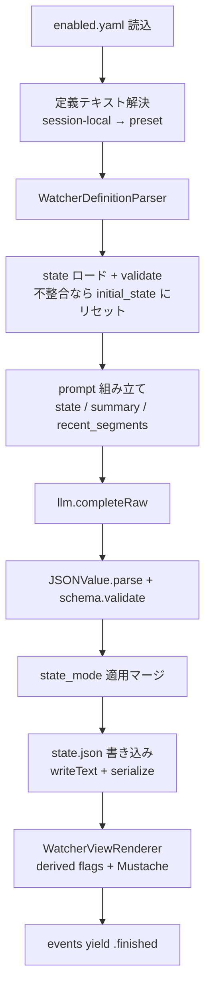

# 05. Watcher Runner 詳細設計

対象読者: Kikimi 実装者（Claude Code 自身）。実装前に必ず読むこと。

参照元: `kikimi.md` 9章（Watchers 全体仕様）, 4章（セッションフォルダの `watchers/`）,
10章（Watchers タブ / Prep タブの Watchers セクション）, 12章（`config.yaml` の `watchers.*`）。
依存: `docs/design/12-llm-client.md`（`LLMCompleting`。本設計で raw 経路を追加する）,
`docs/design/07-session-store.md`（`SessionHandle+GenericStorage` の watcher 用ファイル API）,
`docs/design/04-summary-updater.md`（`SummaryUpdater.events` / Mustache レンダリングの流儀）,
`docs/design/06-ui-panels.md` 6.4章（Watchers タブの枠）。
関連: `docs/design/34-simple-watchers.md`（本設計の上に乗る簡易 Watcher 糖衣層。`input_scope` 拡張は本設計側の変更として実装する）。

## 1. 目的とスコープ

このドキュメントが担当するのは **Watcher 実行系の全体**。すなわち:

- Watcher 定義ファイル（frontmatter + `# System` / `# User`）のパース
- schema 型宣言（YAML）→ JSON Schema 文字列への変換と、LLM 出力/保存 state の検証
- Preset / Session-local の二層解決（`WatcherLibrary`: 解決・一覧・fork・昇格・新規・削除）
- `WatcherRunner`（actor）: トリガ別実行、state_mode 適用、state 永続化、並列実行と直列化
- view template（Mustache）レンダリングと derived flags（`is_<value>`）注入
- UI: Watchers タブ（サブタブ・バッジ・今すぐ実行・seg ID ジャンプ）、Prep タブの Watchers 管理セクション
- config: `watchers.*` セクションの追加、新規セッション作成時の `default_watchers.yaml` コピー
- LLM 層への `completeRaw`（生 JSON 経路）追加

**スコープ外**（他ドキュメントに委譲）:

| 関心事 | 担当 |
|---|---|
| LLM の起動・認証・stub 分岐 | `12-llm-client.md`（本設計は `completeRaw` の契約追加のみ） |
| `watchers/` 配下のファイル読み書きプリミティブ | `07-session-store.md`（`readText`/`writeText`/`readEnabledWatchers`/`writeEnabledWatchers`/`listSessionLocalWatcherIds`） |
| Wiki export への Watcher 結果埋め込み | 将来 `08-wiki-export.md`（`WatcherViewRenderer` を再利用する前提） |
| LLM 使用量記録 | `16-llm-usage-stats.md`（`UsageRecordingLLM` デコレータをそのまま通す。purpose は `stubKey`） |

## 2. データモデル

### 2.1 `WatcherDefinition`

`.md` ファイル 1 つのパース結果。**キャッシュしない**（毎実行時に再読み込み。kikimi.md 9章
「Recording 中の .md 編集は次回発火から即反映」を最も単純に満たす）。

```swift
struct WatcherDefinition: Sendable, Equatable {
    var id: String                    // frontmatter の id。ファイル名 <id>.md と一致必須
    var name: String                  // UI 表示名
    var model: String?                // nil なら config watchers.default_model
    var trigger: WatcherTrigger
    var stateMode: WatcherStateMode
    var inputScope: WatcherInputScope
    var schema: WatcherSchema         // 2.3
    var view: String                  // Mustache テンプレート（そのまま保持）
    var initialState: JSONValue?      // frontmatter の initial_state（JSON 文字列をパース済み）
    var systemPrompt: String          // 「# System」セクション本文
    var userPromptTemplate: String    // 「# User」セクション本文（{{state}} 等のプレースホルダ入り）
}

enum WatcherTrigger: Sendable, Equatable {
    case onSummaryUpdate
    case onSessionEnd
    case onManual
    case onInterval(seconds: Int)     // 下限 10 秒にクランプ（下回ったら warning ログ + 10 秒）
}

enum WatcherStateMode: String, Sendable { case cumulative, snapshot, appendOnly = "append_only" }

enum WatcherInputScope: String, Sendable {
    case summary, summaryAndRecent = "summary_and_recent", fullRefined = "full_refined"
}
```

### 2.2 `JSONValue`（動的 JSON 値）

Watcher の state / LLM 出力は schema がユーザー定義（動的）なので、固定 `Codable` 型に落とせない。
順序保持つきの汎用 JSON 値型を新設する。

```swift
indirect enum JSONValue: Sendable, Equatable {
    case string(String)
    case int(Int)
    case double(Double)
    case bool(Bool)
    case null
    case array([JSONValue])
    case object([Member])                 // 挿入順を保持

    struct Member: Sendable, Equatable {  // タプルは Equatable 合成不可のため struct
        var key: String
        var value: JSONValue
    }
}
```

- **`Codable` にはしない**。パース/シリアライズは `JSONSerialization` ベース（または手書き）の
  `JSONValue.parse(data:)` / `serialize(pretty:)` を実装する。理由:
  - `LLMClient.runAndDecode` は `.convertFromSnakeCase`、`SessionHandle.writeJSON` は
    `SessionJSONCoding`（snake_case 変換）を通す。**JSONDecoder/Encoder の key strategy は
    `[String: T]` 辞書のキーにも適用される**ため、ユーザー定義キー（`source_seg_id` 等）が
    `sourceSegId` に化けて view の変数参照が壊れる。動的キーは変換経路に一切乗せない
- object の挿入順保持は、prompt に注入する `{{state}}` の文字列を安定させるため
  （バッチ間で並びが揺れると LLM への入力が無意味に変わる）
- `JSONSerialization` パース時は順序が失われるため、順序が必要な入口（schema 検証済みの LLM 出力・
  保存 state）では **schema のフィールド宣言順に並べ直す**（`WatcherSchema.canonicalize(_:)`）

### 2.3 `WatcherSchema`（型宣言モデル）

kikimi.md 9章「schema の型記法」を Swift 型に落とす。

```swift
struct WatcherSchema: Sendable, Equatable {
    var fields: [Field]                        // トップレベルは常に object

    struct Field: Sendable, Equatable {
        var name: String
        var type: FieldType
        var nullable: Bool                     // 末尾 `?`。scalar / enum のみ許可
    }

    indirect enum FieldType: Sendable, Equatable {
        case string, int, float, bool
        case enumeration([String])             // enum[a, b, c]
        case array(FieldType)                  // 要素型（object 含む）
        case object([Field])
    }
}
```

YAML からの解釈規則（`Yams.compose` で `Node` を得て手動で歩く。frontmatter 全体を Codable に
しないのは schema / initial_state / view が自由形式のため）:

| YAML の形 | 解釈 |
|---|---|
| scalar（`string` `int?` `enum[a, b]` など） | scalar 型宣言。末尾 `?` で nullable |
| mapping | object（フィールド宣言順を保持。Yams の mapping は順序を保持する） |
| sequence | 配列。**要素はちょうど 1 個**（その要素が配列要素の型宣言）。0 個 or 2 個以上はパースエラー |

- scalar 名は `string` / `int` / `float` / `bool` / `enum[...]` のみ。未知はパースエラー
- `?` は scalar / enum のみ（mapping / sequence の値位置に `?` を書く構文が YAML に無いため）
- enum 値は `enum[` と `]` の間をカンマ区切り、各値 trim。空はパースエラー

### 2.4 JSON Schema への変換

`WatcherSchema.jsonSchemaString()` が `LLMRequest.schema` に渡す文字列を生成する。
`SummaryJSONSchema`（`SummaryPatch.swift`）と同じ方針: `additionalProperties: false` +
全フィールド `required`（LLM に完全なオブジェクトを返させ、部分出力の曖昧さを排除）。

| 宣言 | JSON Schema |
|---|---|
| `string` / `int` / `float` / `bool` | `{"type":"string"}` / `"integer"` / `"number"` / `"boolean"` |
| nullable scalar（`string?` 等） | `{"type":["string","null"]}` |
| `enum[a, b]` | `{"type":"string","enum":["a","b"]}` |
| `enum[a, b]?` | `{"type":["string","null"],"enum":["a","b",null]}` |
| 配列 | `{"type":"array","items":{...}}` |
| object | `{"type":"object","properties":{...},"required":[全フィールド],"additionalProperties":false}` |

- properties の出力順はフィールド宣言順（prompt キャッシュと diff 安定性のため決定論的に）
- `WatcherSchema.validate(_ value: JSONValue) -> [String]`（エラーメッセージ配列、空なら合格）も
  同じ型情報から実装する。LLM 出力（backend が schema 強制するが防御的に再検証）と、
  起動時にロードした既存 state の検証（schema 編集後の不整合検出）の両方で使う。
  int は小数部のない number も許容、float は int も許容

### 2.5 実行時ステータス（UI 用）

```swift
struct WatcherPanelItem: Sendable, Identifiable, Equatable {
    var id: String                    // watcher id
    var name: String
    var origin: WatcherOrigin         // Prep タブの表示・操作分岐に使う
    var renderedMarkdown: String?     // 最新の view レンダリング結果（nil = 未実行）
    var status: Status
    var lastRunAt: Date?
    enum Status: Sendable, Equatable { case idle, running, error(String) }
}

/// 定義の出所。`WatcherLibrary.resolveDefinitionText` の戻り値と `WatcherPanelItem` で共用する
enum WatcherOrigin: Sendable, Equatable { case preset, sessionLocal, missing }  // missing = enabled だが実体なし
```

## 3. ファイルレイアウトと ID 解決（`WatcherLibrary`）

パスと解決順序は kikimi.md 9章のとおり。**session-local が preset より優先**。

```swift
struct WatcherLibrary: Sendable {
    var presetsDirectory: URL         // config watchers.presets_dir（チルダ展開済み）

    func resolveDefinitionText(id: String, sessionHandle: SessionHandle) async throws -> (text: String, origin: WatcherOrigin)?
    func listPresetIds() -> [String]                       // presets_dir の *.md（ソート済み）
    func presetText(id: String) -> String?
    func fork(id: String, into sessionHandle: SessionHandle) async throws     // preset → session-local コピー
    func promote(id: String, from sessionHandle: SessionHandle) async throws  // session-local → preset 書き出し（上書き）
}
```

- id のバリデーションは既存の `SessionFile` の watcher id 検証（ASCII 英数字とハイフンのみ）を
  唯一の正とする。preset 側のファイル列挙でも同じ規則で不正名は無視（warning）
- `resolveDefinitionText` は session-local（`sessionHandle.readText(.watcherDefinition(id:))`）→
  preset の順。どちらにも無ければ `nil`（呼び出し側が「missing」として扱う）
- 昇格（promote）の上書き確認は UI 層（ViewModel）の責務。`WatcherLibrary` は無条件で書く

### 3.1 enabled リストと新規セッション時の既定コピー

- 有効化リストは既存 API `readEnabledWatchers()` / `writeEnabledWatchers(_:)`（`enabled.yaml`）を使う
- **既定コピーは実装済み**: `SessionStore.createDraftSession`（`SessionStore.swift:131` の
  `writeEnabledWatchers(loadInitialEnabledWatchers())`）が `default_watchers.yaml` を既に読んでいる。
  ただしパスは `SessionStore.defaultEnabledWatchersFileURL` のハードコード。**残作業は config 配線**:
  `SessionStore` に `watchers.default_enabled_file` の解決値を渡す（`AppConfig.shared` から。
  `SessionStore.swift:11-14` の「AppConfig 未存在」コメントは stale なので合わせて更新）
- `default_watchers.yaml` のフォーマットは `enabled.yaml` と同一（`EnabledWatchersFile`）

### 3.2 生成責務

- `WatcherLibrary` / `WatcherRunner` の生成は `MeetingWorkspaceViewModel+Factories.swift` の
  既存 factory 群と同じ場所で行う（`AppConfig.shared.data.watchers` を読んでチルダ展開し inject）
- config パスのチルダ展開ヘルパは**新設**する（既存に共通ヘルパは無く、ad-hoc な
  `NSString.expandingTildeInPath` が散在。`FileManager.realHomeDirectory` 基準の展開関数を 1 つ作り
  そこに寄せる）
- `presets_dir` が無ければ factory 時点で作成する（空ディレクトリ。preset 保存の受け皿）

## 4. 定義ファイルのパース（`WatcherDefinitionParser`）

入力はファイル全文の `String`。出力は `WatcherDefinition` または `WatcherParseError`。

1. **frontmatter 分離**: 先頭行が `---` であること。次に単独行 `---` が現れるまでが YAML、それ以降が本文。
   先頭が `---` でない / 閉じ `---` が無い → エラー
2. **frontmatter パース**: `Yams.compose` で `Node.mapping` を取得し、キーごとに取り出す
   - 必須: `id` `name` `trigger` `state_mode` `input_scope` `schema` `view`
   - 任意: `model` `initial_state`
   - `trigger` の `on_interval:<秒>` は `:` で分割し Int パース。不正はエラー
   - `state_mode` / `input_scope` の未知値はエラー（config のようなレニエントにしない。
     Watcher はユーザーが能動的に書くファイルなので、黙って既定値に落とすより早く失敗させる）
   - `initial_state` は文字列として取り出し `JSONValue.parse` → `schema.validate` に通す。
     不合格はエラー（定義ファイル自体の矛盾なので実行前に検出する）
3. **本文セクション抽出**: H1 見出し `# System` と `# User` で分割。両方必須（どちらか欠け → エラー）。
   見出し行の後から次の H1（または EOF）までを trim して各プロンプトにする
4. `id` がファイル名（拡張子除く）と不一致の場合はエラー（enabled.yaml の参照キーと定義の自己申告が
   食い違う事故を防ぐ）

`WatcherParseError` はケースごとに日本語で表示可能なメッセージを持ち、UI のエラーバッジにそのまま出す。

## 5. LLM 呼び出し（raw 経路の追加）

### 5.1 `LLMCompleting.completeRaw`

`complete<T>` の共有デコードは `.convertFromSnakeCase` を通すため動的キーに使えない（2.2 参照）。
protocol に raw 経路を追加する:

```swift
protocol LLMCompleting: Sendable {
    func complete<T: Decodable & Sendable>(_ request: LLMRequest) async throws -> LLMResult<T>
    /// structured_output の生 JSON バイト列をデコードせずに返す。キー変換を一切行わない。
    /// 動的 schema の consumer（WatcherRunner）用。
    func completeRaw(_ request: LLMRequest) async throws -> LLMResult<Data>
}
```

- `LLMClient.completeRaw`: stub 分岐（`LLMStubProvider` に raw 変種 `stubRawResult(for:)` を追加。
  応答 JSON 文字列を UTF-8 Data で返すだけ）→ 非 stub は `backend.complete(request)` の
  `structuredJSON` をそのまま `LLMResult<Data>` に包む
- `UsageRecordingLLM.completeRaw`: `complete` と同じく base に委譲 + 成功時に usage 記録 + 通知
- 既存テストの `FakeLLM` 群には `responses[stubKey]` の文字列を Data にして返す実装を足す
- `docs/design/12-llm-client.md` に §「raw 経路」を追記する（実装時に同時更新）

### 5.2 リクエストの組み立て

- `system` = 定義の `# System` セクション（**完全固定**。プレースホルダ展開しない。
  同一 Watcher の全実行でキャッシュヒットさせる）
- `user` = `# User` セクションのプレースホルダ展開結果（6章）
- `schema` = `WatcherSchema.jsonSchemaString()`
- `model` = 定義の `model` ?? `config.watchers.defaultModel`
- `stubKey` = `"watcher_<id>"`（usage 記録の purpose を兼ねる。kikimi-verify では
  `KIKIMI_STUB_LLM_FILE` でこのキーに応答を注入する）
- `timeout` = 60 秒（`LLMRequest` の既定値）

## 6. Prompt プレースホルダと input_scope

`# User` セクション内の以下の 3 トークンを**単純文字列置換**する（Mustache は使わない。
state の JSON に `{{` が含まれた場合の誤展開を避けるため、置換は 1 パスで行う）。

| トークン | 内容 |
|---|---|
| `{{state}}` | 現在 state の JSON（pretty print、フィールドは schema 宣言順）。`snapshot` モードでは空文字。state 未初期化（ファイル無し + initial_state 無し）は `{}` |
| `{{summary}}` | `sessionHandle.readText(.summaryMarkdown)`。未存在は空文字 |
| `{{recent_segments}}` | input_scope に応じたセグメント列（下表） |

| input_scope | `{{recent_segments}}` |
|---|---|
| `summary` | 空文字（summary だけで判断する Watcher） |
| `summary_and_recent[:<n>]` | **直近 n セグメント**（無印は `WatcherInputScope.defaultRecentCount` = 30、1〜200 にクランプ。`docs/design/34-simple-watchers.md` §5）を `start_ms` 昇順で整形（refined 優先・無ければ raw・refined が空文字のセグメントは除外） |
| `full_refined` | 全セグメント（同上の優先規則） |

- セグメント行の整形は `SummaryPromptBuilder` の既存フォーマット（`seg_XXXXX (speaker): text`）を
  共通ヘルパに切り出して共用する
- 窓サイズはステートレスな固定窓（既定 30、`:<n>` で指定可）。前回実行カーソルを
  state ファイルに混ぜると「state.json は schema に沿った JSON」という 9章の契約を壊すため、
  MVP ではステートレスな固定窓にする。cumulative Watcher はプロンプト側の
  「一度 answered になったものを戻さない」等のルールで重複入力に耐える設計が前提

## 7. state_mode の適用

LLM 出力（`JSONValue`、schema 検証済み）を現在 state にどう反映するか。

| state_mode | `{{state}}` 注入 | 反映 |
|---|---|---|
| `cumulative` | 現 state 全文 | **全置換**（LLM が更新後の完全な state を返す） |
| `snapshot` | 空文字 | **全置換**（毎回作り直し） |
| `append_only` | 現 state 全文 | **配列 append マージ**: トップレベルの配列フィールドは既存配列の末尾に LLM の返した要素を追加。非配列フィールドは LLM が非 null を返した場合のみ置換 |

- `append_only` の重複排除は MVP ではしない（プロンプト側で「新規分のみ返せ」を強制する前提）
- マージ結果も `schema.validate` に通し、不合格なら反映せずエラー扱い（前回 state 維持 + バッジ）

### 7.1 state の永続化

- 保存先: `sessions/<id>/watchers/<id>.state.json`（`SessionFile.watcherState(id:)`）
- **`readText` / `writeText` を使う**（`readJSON`/`writeJSON` は `SessionJSONCoding` の
  snake_case 変換が動的キーを壊すため使用禁止）。書き込みは `JSONValue.serialize(pretty: true)`
- ロード時に `schema.validate` に通し、不合格（= 定義の schema が編集された等）は
  **`initial_state` にリセットして warning バッジ**（kikimi.md 9章「schema 変更で既存 state の
  バリデーションが落ちた場合は initial_state にリセットしてバッジ表示」）。initial_state が無い
  Watcher は state 無し（`{}`）から再開
- state ファイル未存在は正常系（初回実行前）: `initialState` ?? `{}` を使う

## 8. view レンダリング（`WatcherViewRenderer`）

`SummaryRenderer` と同じ GRMustache.swift を使うが、context 構築が動的な点だけ異なる。

1. `JSONValue` → Mustache box（`[String: Any]` / `[Any]` / `String` / `Int` / `Double` / `Bool` /
   `NSNull`）へ再帰変換
2. **derived flags の注入**: object を変換する際、その object の schema 上の enum フィールド
   （`FieldType.enumeration`）それぞれについて、宣言された全値 v に対し `is_<v>: Bool` を注入する
   （現在値と一致した v だけ true。null は全 false）。宣言済みフィールド名と衝突する場合は
   注入しない（宣言が勝つ）＋ warning ログ
3. `Template(string: view).render(context)` でレンダリング。失敗は `nil` を返し、呼び出し側が
   エラーバッジ + 前回のレンダリング結果を維持（初回失敗は「表示できません」プレースホルダ）

### 8.1 seg ID リンク化とジャンプ

- レンダリング後の Markdown に対し、seg ID をリンクに変換する後処理を行う。**優先順に**:
  1. `` `seg_XXXXX` ``（バッククォート込み）→ `[seg_XXXXX](kikimi-seg:seg_XXXXX)`。
     kikimi.md 9章の正典プリセット例（pre-check）は seg ID をコードスパンで囲っており、
     コードスパン内はリンク化されないため、**バッククォートごと**リンクに置き換える
  2. 裸の `seg_[0-9]{5}` → 同上（既にリンク内にある場合を壊さないよう、`](` 直後や
     `(kikimi-seg:` 直後の出現はスキップする素朴なガードで足りる）
- `WatchersTabView` 側で `.environment(\.openURL, OpenURLAction { ... })` を仕込み、
  `kikimi-seg:` スキームを受けたら `viewModel.jumpToTranscriptSegment(id)` を呼んで
  `.handled` を返す（アプリ全体の URL scheme `KikimiURLRoute` には乗せない。ビュー内で完結する）

## 9. `WatcherRunner`（actor）

セッションワークスペース単位で 1 個。**`MeetingWorkspaceViewModel` と同寿命**
（`SummaryUpdater` と違い Recording 中に限定しない。Ended セッションでも `on_manual` を
実行できるようにするため）。

```swift
actor WatcherRunner {
    init(sessionHandle: SessionHandle, llm: any LLMCompleting,
         library: WatcherLibrary, defaultModel: String,
         sleep: @Sendable (Duration) async throws -> Void = { try await Task.sleep(for: $0) })
         // sleep 注入は interval のテスト容易性のため（SummaryUpdater の now 注入と同じ流儀）

    nonisolated var events: AsyncStream<WatcherEvent>   // SummaryUpdater.events と同じ vend 方式

    func run(trigger: WatcherTriggerKind) async // enabled かつ trigger 一致の Watcher を並列実行
    func runManually(id: String) async          // trigger を問わず単発実行（「今すぐ実行」）
    func startIntervalWatchers()                // Recording 開始/再開時に呼ぶ
    func stopIntervalWatchers()                 // Paused / Ended / ウィンドウクローズ時に呼ぶ
    func shutdown()                             // events 終了 + interval 停止
}

/// トリガ照合用の連想値なし enum（`WatcherTrigger` は interval 秒の連想値を持つため別に定義）
enum WatcherTriggerKind: Sendable { case onSummaryUpdate, onSessionEnd, onManual, onInterval }

struct WatcherEvent: Sendable {
    var watcherId: String
    var kind: Kind
    enum Kind: Sendable {
        case started
        case finished(renderedMarkdown: String, at: Date)
        case failed(message: String)            // パース/LLM/検証/レンダのどこで落ちても一本化
        case stateReset(message: String)        // schema 不整合による initial_state リセット通知
    }
}
```

### 9.1 1 Watcher の実行フロー



どの段で失敗しても `.failed(message:)` を yield して**そのWatcher の state は書き換えない**
（LLM 失敗・検証失敗時は前回 state 維持、が kikimi.md 9章のエラーフォールバック）。

### 9.2 並列実行と直列化

- 同一トリガで複数 Watcher が発火する場合は **`withTaskGroup` で並列**（9章「並列実行」。
  各 Watcher の state は独立なので相互依存なし）
- **同一 Watcher の多重実行は抑止**: watcher id ごとの in-flight フラグを actor 内に持ち、
  実行中に再発火したら**スキップ**（`SummaryUpdater.runSerialized` の coalesce より単純な
  drop 方式。on_summary_update は次の更新でまた発火するので取りこぼしても追いつく。
  スキップは debug ログ）
- `runManually` も同じフラグを見る（実行中ならスキップし UI は running バッジのまま）

### 9.3 `on_interval` のライフサイクル

- `startIntervalWatchers()` で enabled の `on_interval` Watcher ごとに `Task` ループ
  （`Task.sleep(for:)` → 実行 → 繰り返し）を張る。`stopIntervalWatchers()` で全キャンセル
- **Recording 中のみ発火**（kikimi.md 9章）。呼び出し場所は 10.2 の表を正とする
- interval 秒数は毎ループで定義を再読込した値を使う（.md 編集の即反映と整合）。
  再読込失敗時はループを止めて `.failed` を yield

### 9.4 トリガ配線（ViewModel 側）

| トリガ | 配線場所 |
|---|---|
| `on_summary_update` | `MeetingWorkspaceViewModel+Summary` の `for await event in updater.events` ループ内から `Task { await watcherRunner.run(.onSummaryUpdate) }`（fire-and-forget。サマリ更新をブロックしない）。**`event.summaryMarkdown != nil` のイベントに限定**（title-only 提案イベントでは発火させない） |
| `on_session_end` | `endMeeting()` の live/transient updater の if-else **合流後の 1 箇所**で `await watcherRunner.run(.onSessionEnd)`（Ended 確定処理の一部として await する。Paused では呼ばない。実行中はヘッダの `.ending` 状態が延びる — final title 生成と同じ扱い） |
| `on_manual` | Watchers タブの「今すぐ実行」→ `runManually(id:)` |
| `on_interval` | Recording 開始/再開（`startSummaryUpdaterIfNeeded` と同じ地点）で `startIntervalWatchers()`、`pauseRecording()` / `endMeeting()` / クローズで `stopIntervalWatchers()` |

- 既知の非対称（許容）: Ended 後の「サマリ全文再生成」は transient updater で行われ events 購読が
  無いため、再生成では `on_summary_update` Watcher は発火しない。必要なら「今すぐ実行」で補える

## 10. ViewModel / UI 統合

### 10.1 `MeetingWorkspaceViewModel+Watchers.swift`

公開する状態と操作（SwiftUI からの契約）。**stored property（`@Published` と `watcherRunner` 参照・
events 購読 Task）は extension に置けないため `MeetingWorkspaceViewModel.swift` 本体に宣言**し、
`+Watchers.swift` にはメソッドのみを置く（`+Summary.swift` と同じ分割方針）:

```swift
// 状態（本体ファイルに宣言）
@Published var watcherItems: [WatcherPanelItem]        // enabled 順
@Published var selectedWatcherId: String?              // Watchers タブのサブタブ選択
@Published var pendingTranscriptScrollTarget: String?  // seg ジャンプ要求（Transcript 側が消費）

// Watchers タブ
func runWatcherNow(id: String)
func jumpToTranscriptSegment(_ segId: String)   // activeTab = .transcript + scroll target 設定

// Prep タブ（管理）
func setWatcherEnabled(id: String, enabled: Bool)      // enabled.yaml 更新 + items 再構築
func forkPresetWatcher(id: String) async
func presetExists(id: String) -> Bool                  // 昇格前の上書き確認判定（UI が alert を出す）
func promoteWatcherToPreset(id: String) async          // 確認済み前提で無条件上書き
func createLocalWatcher(id: String) async throws       // テンプレ雛形を書いて enabled に追加
func deleteLocalWatcher(id: String) async
func availablePresets() -> [String]                    // 「+ preset から追加」用
func watcherDefinitionText(id: String) async -> String?    // 編集シート用
func saveLocalWatcherText(id: String, text: String) async  // 保存前に parse を試し、エラーは警告表示（保存自体は許す）
```

- kikimi.md 9章の第 3 経路「他セッションからコピー」は **MVP スコープ外として明示的に落とす**
  （セッションピッカー UI のコストに対し、fork + 手コピペで代替可能なため。Phase 4 実戦後に再検討）

- `watcherItems` は enabled.yaml + WatcherRunner イベントから構築。実体が見つからない id は
  `origin: .missing` + error バッジで並べる（黙って消さない）
- ViewModel は `watcherRunner.events` を `for await` して該当 item の
  `renderedMarkdown` / `status` / `lastRunAt` を更新する
- ワークスペースを開いた時点で、各 enabled Watcher の既存 `state.json` + 定義から
  **初期レンダリングを 1 回行う**（LLM は呼ばない。前回セッションの結果を再表示するため）

### 10.2 Watchers タブ（`WatchersTabView` スタブの置き換え）

- 上部にサブタブバー（enabled Watcher の name を横並びボタン。選択中を強調、
  status に応じて 🔄（running）/ ⚠（error）バッジを名前に添える）
- 本文: `Markdown(item.renderedMarkdown)` を `.markdownTheme(.summary)` で表示
  （`SummaryTabView` のテーマを流用）+ `kikimi-seg:` の `OpenURLAction`
- フッタ: 「N 分前更新」（`lastRunAt` の相対表示）+ `[今すぐ実行]` ボタン
  （running 中は disabled）。error 時はメッセージを 1 行表示
- enabled が空: 「有効な Watcher がありません。Prep タブで追加してください」

### 10.3 Watchers 管理 UI の部品仕様

管理 UI の設置場所（**Watchers タブ**。Draft 中は準備専用画面の DisclosureGroup）は
`docs/design/17-session-window-redesign.md` §5.4 を参照。以下は `WatcherManagementSection` の
行構成・シート・確認ダイアログの部品仕様。

kikimi.md 10章のレイアウトどおり、Context / Summary Template エディタの下に追加:

- 行 = チェックボックス（enabled）+ name + `(preset)` / `(local)` / `(見つかりません)` ラベル +
  `[編集]`（preset は read-only プレビュー、local は編集可）+ preset なら `[fork]`、
  local なら `[削除]` `[プリセットとして保存]`
- 下部に `[+ 新規 local watcher]`（id 入力シート → 雛形作成 → 編集シートを開く）と
  `[+ preset から追加]`（未 enabled の preset 一覧から選択）
- 編集シートは既存 `PlainTextEditor` を流用したモーダル。保存時に parse を試し、エラーがあれば
  シート内に警告表示（保存は妨げない — 書きかけ保存を許す。実行時に `.failed` バッジで再度知らせる）
- 削除・上書き昇格は `NSAlert` / SwiftUI alert で確認

### 10.4 seg ジャンプ（Transcript 側）

- `TranscriptTabView` は ViewModel 非依存（素のパラメータで構成）なので、
  `pendingTranscriptScrollTarget` は **`MeetingWorkspaceView` からパラメータ + 消費コールバック**
  （`scrollTarget: String?` + `onScrollTargetConsumed: () -> Void`）で渡す
- `onChange` で非 nil なら `proxy.scrollTo(segId, anchor: .center)` → コールバックで nil に戻す。
  自動追従はボトムアンカーの `onDisappear` で暗黙に解除される（既存機構。明示操作は不要）
- 注意: refinement で削除された行（`isDroppedByRefinement`）は rows から除外済み、また LazyVStack の
  未実体化行への `scrollTo` は不発になり得る。ジャンプ前に rows に対象 id があるか照合し、
  無ければ何もしない（warning ログ）。遠距離ジャンプの信頼性は kikimi-verify で検証する

## 11. config（`WatchersConfig`）

`KikimiConfigData` に `watchers` セクションを追加。既存の `DiarizationConfig` と同じ
レニエントデコードパターン（`decodeIfPresent ?? default`、snake_case CodingKeys）。

```swift
struct WatchersConfig: Codable, Sendable, Equatable {
    var presetsDir: String          // 既定 "~/.config/kikimi/watchers/"
    var defaultEnabledFile: String  // 既定 "~/.config/kikimi/default_watchers.yaml"
    var defaultModel: String        // 既定 "claude-haiku-4-5-20251001"
}
```

- パスのチルダ展開ヘルパは 3.2 で新設するものを使う（既存に共通ヘルパは無い）
- presets_dir の作成は 3.2（factory 時点）

## 12. 失敗モード一覧

| 失敗 | 挙動 |
|---|---|
| enabled.yaml の id に実体なし | item を `missing` + error バッジで表示。実行はスキップ |
| enabled.yaml のパース失敗（`readEnabledWatchers` が throw） | そのトリガの全 Watcher をスキップ + error ログ。UI は既存 items を維持 |
| 定義ファイルのパースエラー | `.failed(パースエラーメッセージ)`。state は触らない |
| initial_state が schema 不合格 | パースエラー扱い（定義自体の矛盾） |
| LLM 呼び出し失敗（`LLMClientError`） | `.failed(localizedDescription)`。前回 state / 表示維持 |
| LLM 出力が schema 検証不合格 | `.failed("出力が schema に一致しません")`。前回 state 維持 |
| 保存済み state が schema 検証不合格 | `initial_state`（無ければ `{}`）にリセットし `.stateReset` バッジ。その後の実行は続行 |
| view の Mustache コンパイル/レンダ失敗 | `.failed`。**state は更新済みのまま**（次回 view 修正で直せる）、表示は前回結果維持 |
| interval Watcher の定義再読込失敗 | ループ停止 + `.failed`。次の Recording 再開で再始動 |
| presets_dir が読めない | preset 一覧空 + warning ログ。session-local だけで動作 |

## 13. テスト計画

### 13.1 レイヤ 1（swift-testing・純粋関数中心）

- `WatcherDefinitionParserTests`: frontmatter 分離 / 必須キー欠落 / trigger 各種（interval の
  クランプ含む）/ System・User セクション抽出 / id・ファイル名不一致
- `WatcherSchemaTests`: 型記法パース（nullable / enum / ネスト / 配列の 1 要素制約違反）、
  JSON Schema 文字列生成（宣言順・additionalProperties）、validate の合格/不合格
- `JSONValueTests`: parse/serialize round-trip、**snake_case キーがそのまま保持されること**、
  canonicalize の宣言順並べ替え
- `WatcherViewRendererTests`: derived flags（enum 全値の is_* 生成・null で全 false・宣言衝突時
  非注入）、レンダ失敗時 nil、seg ID リンク化（既リンクの二重置換ガード）
- `WatcherStateMergeTests`: cumulative / snapshot 全置換、append_only の配列 append と
  非配列 null スキップ
- `WatcherRunnerTests`（`FakeLLM` + temp `SessionHandle`、`SummaryUpdaterTests` の流儀）:
  トリガ一致実行 / state.json のキー無変換保存 / LLM 失敗時の前回 state 維持 /
  schema 編集後のリセット / 多重発火スキップ / 並列独立性
- `WatcherLibraryTests`: 解決順序（local 優先）、fork、promote、preset 列挙
- `AppConfigTests` 追記: watchers セクションのレニエントデコード
- LLM 層: `completeRaw` の stub 経路 / `UsageRecordingLLM` の raw 記録

### 13.2 レイヤ 2（kikimi-verify）

- `KIKIMI_STUB_LLM=1` + `KIKIMI_STUB_LLM_FILE` に `watcher_<id>` キーの応答を注入
- サンプル Watcher（pre-check 相当）を session-local に置き、enabled にして録音 →
  ダミー音源 → サマリ更新発火 → Watchers タブに結果が出る / `watchers/<id>.state.json` が
  期待 JSON になることを確認

## 14. 実装モジュール一覧

新規（`Kikimi/Watchers/`）:

| ファイル | 内容 |
|---|---|
| `JSONValue.swift` | 2.2 |
| `WatcherSchema.swift` | 2.3 / 2.4（パース・JSON Schema 生成・validate・canonicalize） |
| `WatcherDefinition.swift` | 2.1 の型 + `WatcherDefinitionParser`（4章） |
| `WatcherPromptBuilder.swift` | 6章（プレースホルダ展開・セグメント整形） |
| `WatcherStateMerge.swift` | 7章 |
| `WatcherViewRenderer.swift` | 8章 |
| `WatcherLibrary.swift` | 3章 |
| `WatcherRunner.swift` | 9章 |

変更:

| ファイル | 変更 |
|---|---|
| `Kikimi/LLM/LLMTypes.swift` `LLMClient.swift` `UsageRecordingLLM.swift` `LLMStubProvider.swift` | `completeRaw` 追加（5.1） |
| `Kikimi/Config/AppConfig.swift` | `WatchersConfig` 追加（11章） |
| `Kikimi/SessionStore/SessionStore.swift` | `default_watchers.yaml` パスの config 配線（3.1。コピー自体は実装済み） |
| `Kikimi/ViewModels/MeetingWorkspaceViewModel*.swift` | `WatcherRunner` 保持・トリガ配線（9.4）・`+Watchers.swift` 新設（10.1） |
| `Kikimi/Views/MeetingWorkspace/WatchersTabView.swift` | スタブ置き換え（10.2） |
| `Kikimi/Views/MeetingWorkspace/PrepTabView.swift` | Watchers セクション追加（10.3） |
| `Kikimi/Views/MeetingWorkspace/TranscriptTabView.swift` | seg ジャンプ（10.4） |
| `docs/design/12-llm-client.md` | raw 経路の追記 |
