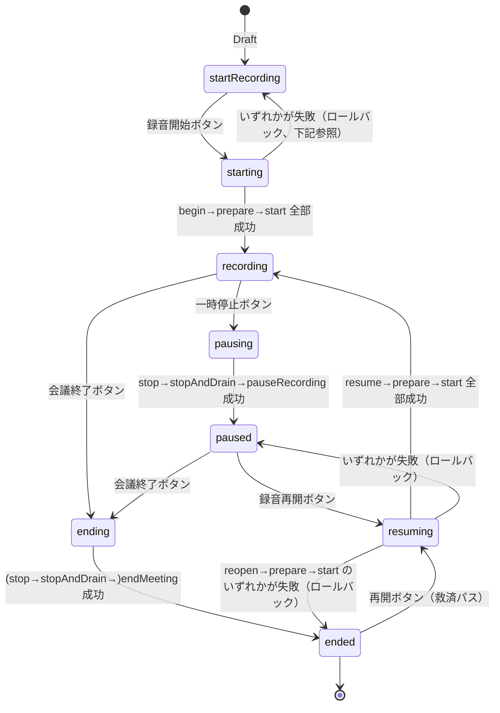
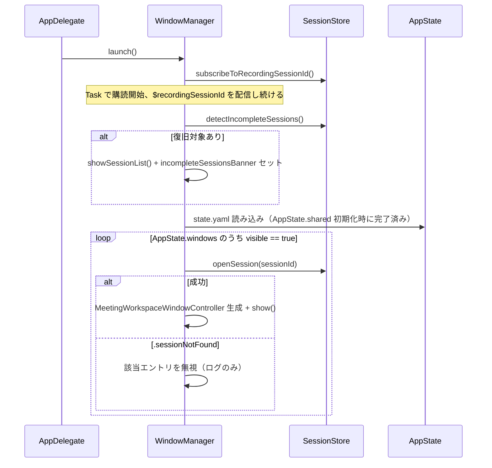
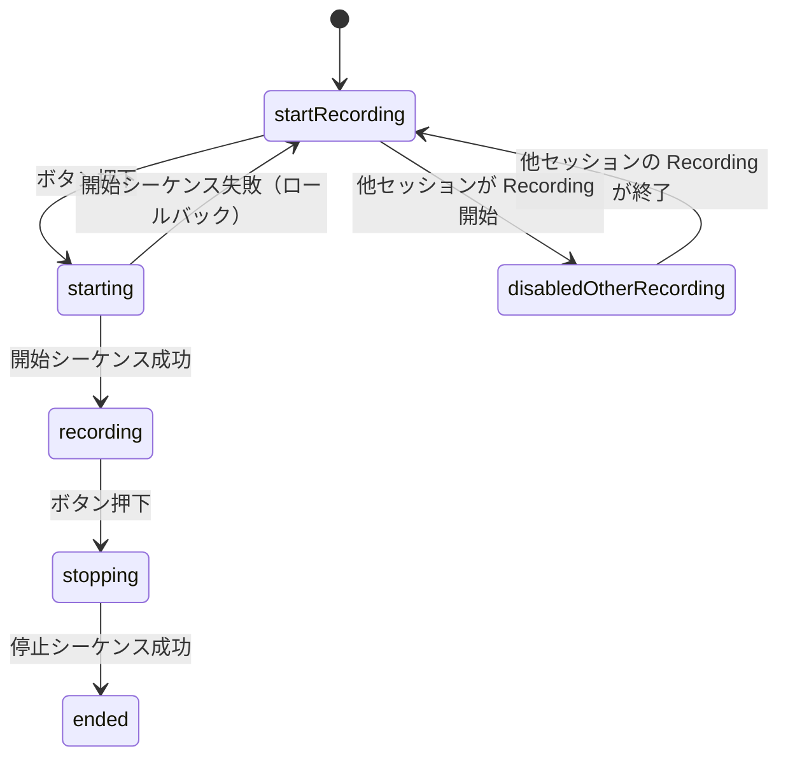
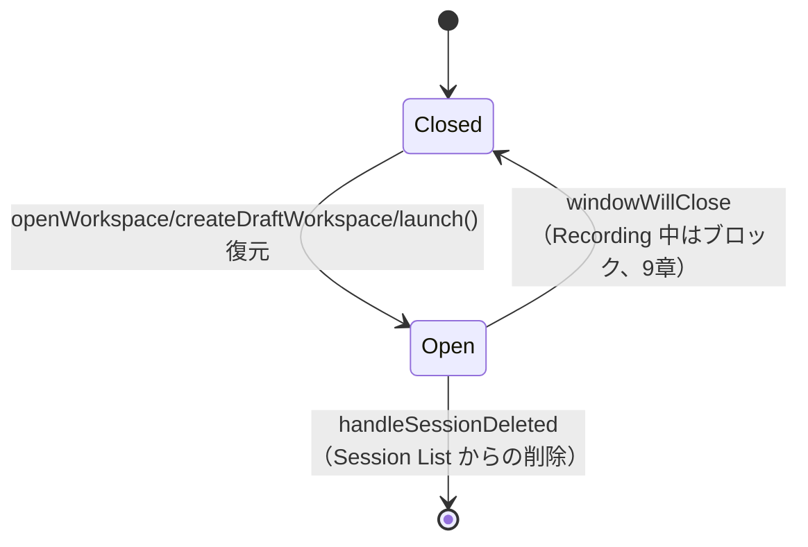

# 06. UI Panels 詳細設計

対象読者: Kikimi 実装者（Claude Code 自身）。実装前に必ず読むこと。

> Session Window の画面構成（タブ構成、Prep タブ、Summary/Watchers タブ）は
> `docs/design/17-session-window-redesign.md` が正（該当セクションに個別のポインタあり）。
> ヘッダ（§6.1）・ウィンドウライフサイクル（§6.1.1, §9, §10）・Session List（§7）・Settings（§8）は
> 引き続き本ドキュメントが正。

参照元: `kikimi.md` 4章（セッションウィンドウ）, 8章（サマリ表示との関係）, 9章（Watchers 表示との関係）,
10章（UI/UX 全体）, 12章（`state.yaml`）, 13章（アーキテクチャ）, 15章（クラッシュ復旧 Open Question）。
`docs/development-process.md` 1章（Phase ロードマップ）, 2.7/2.9（`kikimi-verify` / テスト方式）。
Chirami 参照実装: `docs/references/chirami-map.md` 3章（NSPanel）・4章（Yams config）・8章（メニューバー常駐）。
`AudioCapture` との契約: `docs/design/01-audio-capture.md` 12章。
`SessionStore`/`SessionHandle` との契約: `docs/design/07-session-store.md` 15章。
`TranscriptPipeline` との契約: `docs/design/02-stt-pipeline.md` 5.2章・12章（本ドキュメントで拡張を追加する）。

## 1. 目的とスコープ

このドキュメントが担当するのは kikimi.md 13章の component 表にある **`WindowManager.shared`**
（「フローティングパネルの管理」）と、kikimi.md 10章が規定する **3種のウィンドウ**
（Session Window / Session List / Settings）の UI レイアウト・状態・失敗モードである。

- `WindowManager.shared`: ウィンドウの生成・表示・復元・破棄、Recording 排他状態のアプリ全体への配信
- `AppState.shared`: `~/.local/state/kikimi/state.yaml`（ウィンドウ位置・可視状態）の読み書き
  （kikimi.md 13章の component 表では `WindowManager` と別コンポーネントとして列挙されているが、
  「state.yaml の中身はウィンドウ位置・可視状態のみ」という 12章の記述の通り本質的に UI 専用の関心事であり、
  他のどの設計ドキュメントも所有していないため、本ドキュメントが定義する。4章参照）
- Session Window: ヘッダ（録音ボタン・タイトル・経過時間）+ Draft 専用画面 / 3 タブ（準備/会議/Watchers、
  詳細は `docs/design/17-session-window-redesign.md`）
- Session List: セッション一覧・検索・複製・削除
- Settings: Phase 1 では最小スコープ（8章）
- 録音開始・停止のシーケンス制御（`SessionStore`/`AudioCapture`/`TranscriptPipeline` の呼び出し順序を
  実際にオーケストレーションする ViewModel 層はここが担当。各コンポーネント自体の内部実装は他ドキュメント）
- Transcript タブのライブ更新のための `TranscriptPipeline` への追加インターフェース（6.3章）

**スコープ外**（他ドキュメントに委譲、または未着手のため forward reference のみ）:

| 関心事 | 担当ドキュメント |
|---|---|
| マイク/システム音声キャプチャ、WAV 保存 | `01-audio-capture.md` |
| 書き起こし確定（セグメント確定ロジック） | `11-streaming-stt.md` §3.3 |
| `transcript.jsonl` への実際の書き込み（`TranscriptPipeline`） | `02-stt-pipeline.md` §5.2 |
| セッションフォルダのファイル I/O 全般 | `07-session-store.md` |
| Haiku バッチ整形・`refined.jsonl` | `03-refinement-batch.md`（**未着手**。6.4章で forward reference のみ） |
| サマリ patch 更新・タイトル自動命名の実処理 | `04-summary-updater.md`（**未着手**。6.4章で forward reference のみ） |
| Watcher 実行・schema バリデーション | `05-watcher-runner.md`（**未着手**。6.4章で forward reference のみ） |
| `config.yaml` のパース・型定義（`AppConfig.shared`） | **未着手**（`00-architecture.md` 相当）。本ドキュメントは `AppConfig.shared` を
  必要とする箇所（Settings ウィンドウの一部、Watcher preset 一覧）を明示的に「ブロックされている」として扱う（4章・8章） |
| LLM Wiki export・Raycast URL scheme のルーティング処理そのもの | `08-wiki-export.md` / `09-raycast-integration.md`（未着手）。
  本ドキュメントはこれらが呼び出す `WindowManager` の入口 API までを定義する（5.2章・14章） |

`WindowManager`/`AppState` は「画面に何を出すか・どこに置くか」を扱う層であり、データの永続化ロジックそのものは
`SessionHandle`（07章）に委譲する。UI 層が `FileManager`/`URL` を直接操作することはない。

## 2. Chirami実装との差分サマリ

Chirami の `NoteWindowController`/`NotePanel`/`WindowManager`（`chirami-map.md` 3章）は「常駐ノート」という
全く異なるドメインモデル（ノート=ウィンドウが恒常的に存在し、pin・透過・warp キー移動・periodic rollover を持つ）
を前提にしている。Kikimi の「セッションウィンドウ」はタスク指向（Draft→Recording→Ended の一方向ライフサイクル）
であり、多くの Chirami 機能がそもそも不要になる。

| 項目 | Chirami | Kikimi（本設計） | 理由 |
|---|---|---|---|
| ウィンドウ管理の粒度 | `WindowManager` が `noteId` をキーに常駐ウィンドウを管理。ノートは削除されない限りアプリ生存中ずっと存在しうる | `WindowManager` は `sessionId` をキーに管理。ウィンドウは閉じられれば破棄され（コントローラも解放）、フォルダは削除されない限り Session List から再オープン可能（5.2章） | kikimi.md 4章「セッションウィンドウ」の定義通り、ウィンドウの生存期間はノートより短命でよい |
| Pin / 常時最前面切替 | `NotePanel.setupPinButton`、`note.alwaysOnTop` による `panel.level` 切替 | **持たない**。すべて `.nonactivatingPanel` で常時最前面（kikimi.md 10章「NSPanel `.nonactivatingPanel` で常時最前面」に pin 切替の記載なし） | kikimi.md にピン留め UI の記載がなく、セッションウィンドウは会議中は常に見えていてほしいという前提と矛盾しない |
| 透過度・テーマ・warp キー移動 | `note.transparency`、`AppConfig.shared.data.warpModifierFlags` による hjkl 移動、フォントサイズ変更ショートカット | **持たない** | ノート用の生産性機能であり kikimi.md 10章に対応する記載がない。Settings（8章）の Phase 1 スコープからも除外 |
| Periodic rollover（日付が変わったら別ノートへ切替） | `WindowManager.checkRollover()` が毎分タイマーでチェック | **持たない**（概念自体が存在しない。会議は日付を跨いで自動更新されるものではない） | ドメインの違い |
| ファイル監視による自動リロード | `YAMLStore` の `watchForChanges: true`（`AppConfig`/`AppState` 双方がこのオプションを持つが、`AppState` 自体は実際には `false` で使われている） | `AppState.shared` も `watchForChanges: false` を踏襲。`07-session-store.md` 2章が `context.md`/`summary_template.md` について同じ判断（UI 内蔵エディタからの保存のみ想定）をしており、`state.yaml` も同じ単一プロセス前提で一貫させる | 実装コスト削減。外部プロセスが `state.yaml` を書き換える運用は想定していない |
| メニューバー | `NSStatusItem` + ノート一覧ポップオーバー（`NoteListPopover`）、フル機能の状況メニュー | `MenuBarExtra`（Kikimi は既に `KikimiApp.swift` に骨格あり）。項目は「新規セッション」「セッション一覧」「設定」「終了」程度の最小メニュー | kikimi.md 3章「メニューバー常駐（LSUIElement）+ フローティング NSPanel」の記載に沿う最小実装。ノート一覧に相当する機能は Session List ウィンドウが担う |
| Markdown/リッチテキスト表示 | WKWebView + CodeMirror（`editor-web`） | **表示は WKWebView + `markdown-it`**（`docs/design/39-webview-markdown.md`。サマリは実装済み、Watchers/チャットは Phase B/C）。**編集は `NSTextView` のまま**（Prep タブ・Watcher 定義、kikimi.md 10章）。CodeMirror は使わない | MVP では実装コスト削減のため SwiftUI の Markdown レンダリング（MarkdownUI）を使っていたが、mermaid が描けずコードブロックのハイライトも無いため、**表示に限って** design 39 で覆した |
| Recording の排他制御 | 該当概念なし | `SessionStore.shared.recordingSessionId`（07章 9章）を全ウィンドウが購読し、自分以外が Recording 中なら録音ボタンを disabled にする。**Chirami に前例のない新規要件**であり、購読機構自体を本ドキュメントで新規設計する（5.2章・6.1章） | kikimi.md 10章「Recording は1つだけ」の実装 |
| クラッシュ復旧ダイアログ | 該当概念なし | 起動時に `SessionStore.detectIncompleteSessions()` を確認し、あれば復旧ダイアログを出す（9章） | kikimi.md 15章 Open Question への対応（`07-session-store.md` 10章が API を用意済み） |

## 3. 全体構成

```mermaid
flowchart TB
    subgraph Menu["MenuBarExtra (KikimiApp)"]
        MB["新規セッション / セッション一覧 / 設定 / 終了"]
    end

    subgraph WM["WindowManager.shared (@MainActor)"]
        REC["recordingSessionId 購読・配信"]
        CTRLS["workspaceControllers: [sessionId: MeetingWorkspaceWindowController]"]
        SL["sessionListController"]
        SET["settingsController"]
    end

    subgraph AS["AppState.shared"]
        STY["state.yaml (windows[], sessionListWindow)"]
    end

    subgraph MW["MeetingWorkspaceWindowController x N"]
        VM["MeetingWorkspaceViewModel"]
        HDR["Header: タイトル/録音ボタン/経過時間"]
        SCREENS["Draft専用画面 / 3タブ(準備・会議・Watchers)<br/>詳細: 17-session-window-redesign.md"]
    end

    MB -->|createDraftWorkspace / showSessionList / showSettings| WM
    WM -->|vends / restores| MW
    WM <-->|window frame/visible 永続化| AS
    VM -->|beginRecording/pauseRecording/resumeRecording/endMeeting/reopenForRecording/cancelRecordingStart| SessionStore["SessionStore.shared<br/>(07-session-store.md)"]
    VM -->|start/stop| AudioCapture["AudioCapture<br/>(01-audio-capture.md)"]
    VM -->|prepare/stopAndDrain/liveSegments| TranscriptPipeline["TranscriptPipeline<br/>(02-stt-pipeline.md + 6.3章の追加)"]
    VM -->|read/write| SessionHandle["SessionHandle<br/>(07-session-store.md)"]
    WM -->|subscribeToRecordingSessionId (追加API)| SessionStore
```

- `WindowManager` は `@MainActor` の単一 `final class`（Chirami の `WindowManager` と同じく `ObservableObject`）
- `MeetingWorkspaceViewModel` は開いているセッションごとに1インスタンス。自分の `AudioCapture`/`TranscriptPipeline`
  インスタンスを Recording 中だけ保持する（6.1章）
- `AppState.shared` は `WindowManager` からのみ読み書きされる（他コンポーネントは触らない。
  `lastAudioInput` に限る例外は `10-audio-input-selection.md` 3章参照）
- Session Window の画面構成（Draft 専用画面・タブ構成）は `docs/design/17-session-window-redesign.md` §3
  が正。`WindowManager`/`MeetingWorkspaceViewModel` の型定義は本ドキュメント §5.2・§5.3 を参照

## 4. 実装前提条件

`07-session-store.md` 1.1章が `AppConfig.shared`（`config.yaml`）を `00-architecture.md` 相当の
未着手ドキュメントへ委譲したのと同じ構造の問題が、本ドキュメントにも一部存在する。

- **`AppState.shared` と、その基盤となる `YAMLStore<T>` の Swift への移植は本ドキュメントが担当する**
  （`AppConfig.shared` とは異なり、`state.yaml` の中身がウィンドウ状態のみで他コンポーネントから
  参照されないため、所有者を本ドキュメントに固定してよいと判断した）。`YAMLStore<T>`
  （`chirami/Chirami/Config/YAMLStore.swift`）はジェネリックな基盤クラスであり、Chirami の実装を
  ほぼそのまま移植する（`watchForChanges` パラメータも含めて維持するが、`AppState.shared` の生成時は
  常に `false` で使う。2章参照）
- **`AppConfig.shared`（`config.yaml`）はブロックされたまま**。本ドキュメントで `AppConfig.shared` の
  値を参照する箇所（Settings ウィンドウの一部、Watcher preset 一覧の取得、`export.target_dir` の表示）は
  明示的に「`AppConfig.shared` 実装後に着手」と注記する（8章・6.4章）。Phase 1 の実装対象からは除外してよい
- `SessionStore`/`SessionHandle`（07章）・`AudioCapture`（01章）・`TranscriptPipeline`/`SttEngine`（02章）は
  実装済み。本ドキュメントはこれらへ以下の**追加**を要求する（実装時に該当ドキュメントへの追記も行うこと）:
  1. `SessionStore` に `subscribeToRecordingSessionId()`（5.2章）
  2. `TranscriptPipeline` に `liveSegments`（6.3章）
  3. `SessionStore` に `pauseRecording(_:)`/`resumeRecording(_:)`/`endMeeting(_:)`/`reopenForRecording(_:)`/
     `cancelRecordingStart(_:revertingTo:)`（6.1章、kikimi.md 4章「「停止」と「終了」を分離する」の
     一時停止/再開/会議終了モデル。`cancelRecordingStart` は録音区間の開始シーケンスが `prepare()`/
     `start()` で失敗した場合に、実質空の Paused/Ended セッションを残さず呼び出し前の状態へ巻き戻すための
     専用 API）

## 5. 型定義（公開API）

### 5.1 `AppState`（`state.yaml`）

kikimi.md 12章のスキーマをそのまま `Codable` に写像する。

```swift
struct KikimiStateData: Codable, Equatable {
    var windows: [WorkspaceWindowState] = []
    var sessionListWindow: FloatingWindowState = .default
}

struct WorkspaceWindowState: Codable, Equatable, Identifiable {
    var id: String { sessionId }   // Identifiable 準拠のための計算プロパティ（JSON/YAML には出力しない）
    var sessionId: String
    var x: Double
    var y: Double
    var width: Double
    var height: Double
    var visible: Bool
    var activeTab: MeetingWorkspaceTab
}

struct FloatingWindowState: Codable, Equatable {
    var x: Double
    var y: Double
    var width: Double
    var height: Double
    var visible: Bool

    static let `default` = FloatingWindowState(x: 100, y: 750, width: 500, height: 400, visible: false)
}

enum MeetingWorkspaceTab: String, Codable, CaseIterable, Sendable {
    case prep
    case transcript
    case summary
    case watchers
}

final class AppState: YAMLStore<KikimiStateData> {
    static let shared = AppState()
    static let defaultStateDirectory = FileManager.realHomeDirectory
        .appendingPathComponent(".local/state/kikimi", isDirectory: true)

    private convenience init() {
        self.init(directory: Self.defaultStateDirectory)
    }

    /// テスト用に一時ディレクトリを注入できる designated initializer（Chirami の `AppState` と同じパターン）。
    init(directory: URL) {
        super.init(directory: directory, fileName: "state.yaml", label: "State",
                    defaultValue: KikimiStateData(), watchForChanges: false)
    }

    func windowState(for sessionId: String) -> WorkspaceWindowState?
    func upsertWindowState(_ state: WorkspaceWindowState)
    /// ウィンドウが閉じられた際に呼ぶ。エントリ自体は削除しない（次回同じセッションを開いたときに
    /// 位置・サイズを復元するため）。`visible` だけ `false` に更新する。
    func markWindowHidden(sessionId: String)
    /// `deleteSession` された場合など、エントリ自体を消す必要があるときに呼ぶ。
    func removeWindowState(sessionId: String)
    func updateSessionListWindow(_ mutate: (inout FloatingWindowState) -> Void)
}
```

- `WorkspaceWindowState` は `sessionId` をキーにした実質的な辞書だが、kikimi.md 12章のサンプルが
  配列（`windows:` の YAML リスト）で示しているため、そのままの形（配列）を保持する。`AppState` 内部の
  検索・更新は線形探索で行う（想定件数は高々数十件で、`state.yaml` の読み書き自体が高頻度操作ではないため
  問題にならない）
- `visible: false` のエントリは「過去に開いたことがあるが今は閉じている」ことを表す。**Draft のまま
  閉じられたセッションのフォルダ自体は kikimi.md 4章の通り残置される**ため、`WorkspaceWindowState` の
  エントリを消す必要はない。エントリが消えるのは `deleteSession` 時のみ（`WindowManager` が
  `removeWindowState` を呼ぶ、9章）

### 5.2 `WindowManager`

```swift
@MainActor
final class WindowManager: ObservableObject {
    static let shared = WindowManager()

    /// 現在 Recording 中のセッション ID。`SessionStore.shared.subscribeToRecordingSessionId()`
    /// （下記追記参照）を購読して同期する。全 `MeetingWorkspaceViewModel` はこの値を
    /// 直接ではなく `WindowManager.shared.$recordingSessionId` 経由で観測する
    /// （`SessionStore` は actor でありメインスレッドの `@Published` を持てないため、
    /// `WindowManager` が Main Actor 側の唯一の配信ハブになる）。
    @Published private(set) var recordingSessionId: String?

    private var workspaceControllers: [String: MeetingWorkspaceWindowController] = [:]
    private var sessionListController: SessionListWindowController?
    private var settingsController: SettingsWindowController?
    private var recordingSubscriptionTask: Task<Void, Never>?

    private init() {}

    // MARK: 起動時

    /// `AppDelegate.applicationDidFinishLaunching` から1回だけ呼ぶ。
    /// 1. `recordingSessionId` 購読を開始
    /// 2. `SessionStore.detectIncompleteSessions()` を確認し、あれば Session List を開いて復旧バナーを表示
    /// 3. `AppState.shared` の `windows` のうち `visible == true` のものを順にウィンドウ復元
    /// 手順の詳細・失敗時の扱いは 9章。
    func launch() async

    // MARK: Meeting Workspace

    /// 既存セッションを開く。既に当該セッションのウィンドウが開いていればそれを前面化するだけ
    /// （Chirami の `openWindow(for:)` と同じ「既存があれば showWindow」パターン）。
    @discardableResult
    func openWorkspace(sessionId: String) async throws -> MeetingWorkspaceWindowController

    /// 新規 Draft ウィンドウを作成して開く。kikimi.md 10章「+ 新規」/「複製して新規セッション」/
    /// `kikimi://window/new[?based_on=]`（09-raycast-integration.md からの入口）が使う。
    @discardableResult
    func createDraftWorkspace(basedOn sourceSessionId: String? = nil) async throws -> MeetingWorkspaceWindowController

    /// `kikimi://record/quick`（09-raycast-integration.md からの入口）。デフォルト context で
    /// 新規 Draft を作り即座に録音開始する。既に別セッションが Recording 中なら
    /// `.anotherSessionRecording` を throw し、**新規ウィンドウ自体を作らない**
    /// （kikimi.md 10章「既存 Recording を優先し、意図しない切断を防ぐ」）。
    @discardableResult
    func quickRecord() async throws -> MeetingWorkspaceWindowController

    /// ウィンドウが閉じられた（`windowWillClose`）際に呼ぶ。`AppState` の該当エントリを
    /// `visible = false` に更新するのみで、セッションフォルダやエントリ自体は消さない。
    func workspaceWindowDidClose(sessionId: String)

    // MARK: Session List / Settings

    func showSessionList()
    func showSettings()

    /// Session List から「削除」された際に呼ぶ。開いていれば当該セッションウィンドウも閉じ、
    /// `AppState` のエントリも消す。
    func handleSessionDeleted(sessionId: String)

    // MARK: アプリ終了シーケンス（9章）

    /// `AppDelegate.applicationShouldTerminate` から呼ぶ。Recording 中セッションがあれば
    /// そのウィンドウの `stopRecording()` を待ってから、開いている全ウィンドウの
    /// `SessionHandle.flush()` を呼ぶ。呼び出し側は本メソッドの完了（またはタイムアウト、9章）を
    /// 待ってから `NSApp.reply(toApplicationShouldTerminate:)` を呼ぶこと。
    func prepareForTermination() async
}
```

```swift
extension SessionStore {
    /// `06-ui-panels.md` からの追加要請（07-session-store.md 9章には未記載）。
    /// 呼び出した瞬間の `recordingSessionId` を最初の要素として即座に yield し、
    /// 以後 `beginRecording`/`pauseRecording`/`resumeRecording`/`endMeeting`/`reopenForRecording` のたびに新しい値を yield し続ける
    /// （actor 外の任意コンテキストから「現在値 + 変更」の両方を取りこぼしなく購読できるようにするため）。
    /// stream の `onTermination` で購読者リストから自動的に取り除かれる。
    func subscribeToRecordingSessionId() -> AsyncStream<String?>
}
```

- `WindowManager.launch()` は起動時に1回、`Task { let stream = await SessionStore.shared.subscribeToRecordingSessionId()
  for await value in stream { recordingSessionId = value } }` のような形で購読を張り、以後
  `@Published var recordingSessionId` を更新し続ける。各 `MeetingWorkspaceViewModel` は
  `WindowManager.shared.$recordingSessionId` を Combine で購読し、自分の `sessionId` と比較して
  ヘッダの録音ボタン状態（6.1章）を再計算する
- `workspaceControllers` は `sessionId` をキーにした辞書（Chirami の `noteId` キーと同型）。
  同一セッションに対して二重にウィンドウが開くことはない

### 5.3 Session Window

```swift
enum RecordingButtonState: Equatable {
    /// Draft。ボタン活性、「● 録音開始」
    case startRecording
    /// `beginRecording`/`TranscriptPipeline.prepare`/`AudioCapture.start` の非同期処理中。ボタン非活性、スピナー表示
    case starting
    /// このウィンドウが Recording 中。ボタン活性、「■ 一時停止」「⏹ 会議終了」の2つ、累積経過時間表示
    case recording(elapsedSeconds: Int)
    /// 一時停止処理中（`AudioCapture.stop`/`TranscriptPipeline.stopAndDrain`/`pauseRecording`）。ボタン非活性
    case pausing
    /// Recording を止めているが会議は継続中（kikimi.md 4章「一時停止」）。ボタン活性、「● 録音再開」
    /// 「⏹ 会議終了」の2つ、累積経過時間表示（停止中なのでカウントアップしない）
    case paused(elapsedSeconds: Int)
    /// `.paused` と同じだが、別ウィンドウが Recording 中のため「● 録音再開」だけが非活性
    /// （「⏹ 会議終了」は排他フラグと無関係なので活性のまま）
    case pausedDisabledOtherRecording(elapsedSeconds: Int, otherSessionId: String)
    /// 再開処理中（`resumeRecording`/`reopenForRecording`/`TranscriptPipeline.prepare`/`AudioCapture.start`）。
    /// ボタン非活性、スピナー表示
    case resuming
    /// 会議終了処理中（`endMeeting`、Recording から呼ばれた場合は先に `AudioCapture.stop`/
    /// `TranscriptPipeline.stopAndDrain` も行う）。ボタン非活性
    case ending
    /// 他ウィンドウが Recording 中。ボタン非活性
    case disabledOtherRecording(otherSessionId: String)
    /// Ended。「↩ 再開」ボタンのみ表示（ヘッダは総時間のテキスト表示も併記）
    case ended

    /// 進行中/Recording・Paused 系の状態すべてで `true`。
    /// `windowShouldClose`（6.1.1章）・アプリ終了確認（9章）の両方がこの1箇所を参照する。`.paused`/
    /// `.pausedDisabledOtherRecording` も含める（kikimi.md 10章「Paused も「会議終了しますか」確認の対象
    /// にする」）: 音声リソースは解放済みでも会議自体はまだ確定していないため。
    var blocksWindowClose: Bool {
        switch self {
        case .recording, .starting, .pausing, .paused, .pausedDisabledOtherRecording, .resuming, .ending:
            return true
        case .startRecording, .disabledOtherRecording, .ended:
            return false
        }
    }
}

enum WorkspaceBanner: Equatable, Identifiable {
    case systemAudioUnavailable
    case fileWriteFailed(source: AudioSourceKind)
    case transcriptWriteFailed
    case sttModelDownloading(source: AudioSourceKind, progress: Double)
    case sttModelDownloadFailed(source: AudioSourceKind, message: String)
    case recordingStartFailed(message: String)

    var id: String { String(describing: self) }
}

@MainActor
final class MeetingWorkspaceViewModel: ObservableObject {
    let sessionId: String

    @Published private(set) var meta: SessionMeta
    @Published var activeTab: MeetingWorkspaceTab
    @Published private(set) var recordingButtonState: RecordingButtonState = .startRecording
    @Published var banners: [WorkspaceBanner] = []

    // Prep タブ
    @Published var contextText: String = ""
    @Published var summaryTemplateText: String = ""

    // Transcript タブ（6.3章）
    @Published private(set) var transcriptRows: [TranscriptRowViewModel] = []

    private let sessionHandle: SessionHandle
    private var audioCapture: AudioCapture?
    private var transcriptPipeline: TranscriptPipeline?
    private var elapsedTimerTask: Task<Void, Never>?
    private var liveSegmentTask: Task<Void, Never>?
    private var recordingSessionIdCancellable: AnyCancellable?

    init(sessionHandle: SessionHandle) { /* meta/contextText/summaryTemplateText を初期ロード */ }

    func onAppear() async   // readTranscriptSegments() でバックフィル、WindowManager.$recordingSessionId 購読開始
    func onDisappear()      // 購読解除（ウィンドウを閉じても Recording 自体は止めない、6.1章）

    // 5つの録音操作エントリポイント（kikimi.md 4章「「停止」と「終了」を分離する」）。
    // startRecording/resumeRecording/reopenRecording は「区間を開く」系で `runRecordingSegmentStart`
    // 相当の共通後処理（prepare→start→購読開始）を経る。pauseRecording/endMeeting は「区間を閉じる」系。
    func startRecording() async     // Draft -> Recording
    func pauseRecording() async     // Recording -> Paused（on_session_end は走らない）
    func resumeRecording() async    // Paused -> Recording
    func endMeeting() async         // Recording/Paused -> Ended（唯一の確定操作）
    func reopenRecording() async    // Ended -> Recording（救済パス）

    func saveContext(_ text: String) async
    func saveSummaryTemplate(_ text: String) async
    func duplicatePrepFiles(from sourceSessionId: String, scope: PrepCopyScope) async

    func renameTitle(_ newTitle: String) async   // title_auto_generated = false に固定（8章）

    /// `WindowManager.prepareForTermination()`（9章）専用。`sessionHandle.flush()`（`07-session-store.md`
    /// 5.2章、`throws`）を呼ぶが、アプリ終了シーケンス中に例外で処理を止めたくないため、失敗しても
    /// ここで catch して `.error` ログのみに留め、呼び出し元へは再送出しない（`async` であって
    /// `async throws` ではないのはこのため）。
    func flushSessionHandle() async
}
```

### 5.4 Session List

```swift
@MainActor
final class SessionListViewModel: ObservableObject {
    @Published private(set) var sessions: [SessionMeta] = []
    @Published var searchText: String = ""
    @Published var stateFilter: SessionStateFilter = .all
    @Published var incompleteSessionsBanner: [SessionMeta] = []

    enum SessionStateFilter: CaseIterable { case all, draftOnly, endedOnly }

    func refresh() async   // SessionStore.listSessions()
    func open(sessionId: String) async throws
    func createNew() async throws
    func duplicate(sessionId: String) async throws   // → WindowManager.createDraftWorkspace(basedOn:)
    func delete(sessionId: String) async throws
    /// グルーピング済みの表示用データ（月別、10章）。pure function としてテスト可能にする。
    func groupedByMonth() -> [(month: String, sessions: [SessionMeta])]
}
```

- `delete(sessionId:)` は `SessionStore.deleteSession(_:)` を呼んだ後、成功したら
  `WindowManager.shared.handleSessionDeleted(sessionId:)` を呼んでウィンドウ・`AppState` エントリも
  合わせて片付ける
- `groupedByMonth()`/`stateFilter` の適用ロジックは `SessionMeta` の配列に対する純粋関数として実装し、
  ネットワーク/ファイル I/O から独立させる（12章のレイヤ1テスト対象）

### 5.5 Settings（Phase 1 最小スコープ）

```swift
@MainActor
final class SettingsViewModel: ObservableObject {
    /// Phase 1 では表示専用のプレースホルダ。`AppConfig.shared` 実装後に編集可能にする（8章）。
    @Published private(set) var isConfigAvailable = false
}
```

Phase 1 の Settings ウィンドウはタブ枠のみ用意し、中身は「設定機能は準備中です」のプレースホルダを表示する
（8章）。

## 6. Session Window 詳細設計

### 6.1 録音状態遷移とヘッダ

kikimi.md 4章「「停止」と「終了」を分離する」に従い、旧 `startRecording()`/`stopRecording()` の2操作を
**5つのエントリポイント**に分解する。`SessionStore` 側の対応 API は `07-session-store.md` 5.1/9章。

| VM メソッド | `SessionStore` 呼び出し | 遷移 |
|---|---|---|
| `startRecording()` | `beginRecording(_:)` | Draft → Recording（区間0開始） |
| `pauseRecording()` | `pauseRecording(_:)` | Recording → Paused（区間クローズ、`on_session_end` は走らない） |
| `resumeRecording()` | `resumeRecording(_:)` | Paused → Recording（新区間開始） |
| `endMeeting()` | `endMeeting(_:)` | Recording/Paused → Ended（**唯一の確定操作**） |
| `reopenRecording()` | `reopenForRecording(_:)` | Ended → Recording（救済パス、新区間開始） |

`startRecording()`/`resumeRecording()`/`reopenRecording()` はいずれも「区間を新しく開く」操作なので、
`SessionStore` 呼び出し後の後処理（STT 準備・録音開始・購読開始）を共通のプライベートヘルパー
（`runRecordingSegmentStart(previousStateOnFailure:)`）に切り出す。

```
SessionStore の区間開始メソッド（beginRecording / resumeRecording / reopenForRecording）
  → TranscriptPipeline(sessionHandle:startMsOffset:).prepare(...)
  → AudioCapture(sessionDirectory:selection:recordingIndex:).start()
  → …録音中…
  → AudioCapture.stop()
  → TranscriptPipeline.stopAndDrain()
  → SessionStore の区間終了メソッド（pauseRecording / endMeeting）
```

`recordingIndex`/`startMsOffset` は `SessionStore` が返した `SessionHandle.meta.recordings.last`
（区間開始メソッドが追加した直後の要素）から取り出す。`AudioCapture` は区間ごとに
`audio/mic_NNN.wav`/`audio/system_NNN.wav`（`NNN` = `recordingIndex`）を開き（`01-audio-capture.md`）、
`TranscriptPipeline` は `SttFinalizedSegment.startMs`/`endMs`（この区間の `AudioCapture.start()` からの
相対時刻）に `startMsOffset` を足してから `transcript.jsonl` に追記する（`02-stt-pipeline.md`／
`11-streaming-stt.md`）。



**区間開始シーケンス（`startRecording()`/`resumeRecording()`/`reopenRecording()` 共通）**:

1. ボタン状態を `.starting`（`startRecording()`）または `.resuming`（`resumeRecording()`/
   `reopenRecording()`）にする
2. 対応する `SessionStore` の区間開始メソッドを呼ぶ。`.anotherSessionRecording` を throw されたら
   `.recordingStartFailed` バナーを出し呼び出し前の状態（`.startRecording`/`.paused`/`.ended`）に戻す
   （通常はボタンが disabled のため到達しない想定だが、複数ウィンドウでのほぼ同時クリックという
   レースに対する防御）
3. 成功したら、返ってきた `SessionHandle.meta.recordings.last` から `recordingIndex`/`startMsOffset` を
   取り出し、`TranscriptPipeline(sessionHandle:startMsOffset:)` を生成して `prepare(downloadProgress:)`
   を呼ぶ。ダウンロード進捗は `.sttModelDownloading` バナーで表示する
4. 成功したら `AudioCapture(sessionDirectory:selection:recordingIndex:)` を生成し `start()` を呼ぶ
5. **手順3または4が失敗した場合のロールバック**: `SessionStore.shared.cancelRecordingStart(sessionId,
   revertingTo: previousState)`（`previousState` は手順1の直前の状態: `.draft`/`.paused`/`.ended`）を
   呼び、直前に追加された未クローズの区間を破棄して呼び出し前の状態へ巻き戻す。この時点では
   `AudioCapture.start()` が一度も成功していない（＝音声データは1バイトも書かれていない）ため、
   Paused/Ended セッションを不要に汚す必要がなく安全に完結する。ユーザーには
   `.recordingStartFailed(message:)` バナー（またはダイアログ）で「録音を開始できませんでした」を明示する
6. **`meta` の再読込（実装上必須。手順4成功直後・手順7の前に行う）**: `await sessionHandle.meta`
   （actor プロパティ）を読み、`self.meta` をこの最新値で上書きする。省略すると手順7で起動する
   `elapsedTimerTask` が「開いている区間」を見つけられずタイマーを起動できない
7. すべて成功したら `recordingButtonState = .recording(elapsedSeconds:)`（累積経過時間、下記参照）、
   1秒間隔の `elapsedTimerTask` を起動する。あわせて `TranscriptPipeline.liveSegments`（6.3章）の購読を
   開始する

**区間終了シーケンス（`pauseRecording()`/`endMeeting()` 共通）**:

1. ボタン状態を `.pausing`（`pauseRecording()`）または `.ending`（`endMeeting()`）にする
2. まだ Recording であれば `AudioCapture.stop()` → `TranscriptPipeline.stopAndDrain()` の順に `await`
   する（07章9章の順序契約。`stopAndDrain()` を `SessionStore` の区間終了メソッドより前に呼ばないと
   `segmentCount` と実ファイル行数が一瞬ずれるため、この順序は厳守する）。既に Paused から
   `endMeeting()` を呼んだ場合はこの手順は不要（既に停止済み）
3. `SessionStore.shared.pauseRecording(sessionId)`/`endMeeting(sessionId)` を呼ぶ
4. 成功したら `elapsedTimerTask`/`liveSegmentTask`/`volatileTranscriptTask` をキャンセルし、
   `audioCapture`/`transcriptPipeline` を `nil` に戻す。`recordingButtonState` を `.paused(elapsedSeconds:)`
   （`pauseRecording()`）または `.ended`（`endMeeting()`）にし、`meta` を再読込する
5. 手順3が失敗した場合（`07-session-store.md` 12章 #4）: `AudioCapture`/`TranscriptPipeline` は既に
   停止済みなので**録音データの追加損失はない**。`recordingButtonState` は `.pausing`/`.ending` のまま
   留まって再試行できるようにする（手順2は再試行時にスキップされる — 既に停止済みのため）

**ウィンドウを閉じても Recording は止めない**: `MeetingWorkspaceViewModel.onDisappear()`
（ウィンドウが閉じられた際）は `recordingSessionIdCancellable`/UI 購読だけを止め、
`audioCapture`/`transcriptPipeline` の停止は行わない。すなわち **Recording 中のウィンドウを閉じる操作は
禁止する**（Paused 中は音声リソースが既に無いため禁止する必要はないが、会議未確定を確認する目的で
同様に扱う）。具体的な非同期確認フローの実装は 6.1.1章で定義する。

**ヘッダの経過時間表示（累積）**: kikimi.md 10章「表示は常に累積」。`elapsedSeconds` は
「閉じている区間の合計長（`meta.durationMs`）＋（開いている区間があれば）その区間の経過秒」として
計算する。`.recording(elapsedSeconds:)` は1秒ごとにこの値を再計算する `Task`
（`Task.sleep(for: .seconds(1))` ループ）で更新し、`.paused(elapsedSeconds:)` は一時停止時点の
`meta.durationMs` を固定値として表示する（カウントアップしない）。`AsyncTimerSequence` 等の外部依存は
使わず、`Task` のキャンセルで簡潔に停止できる形にする。

### 6.1.1 ウィンドウクローズ = しまう（`windowShouldClose`）

kikimi.md 10章「ウィンドウを閉じるとき」: Recording / Paused 中のクローズ操作（close ボタン / ⌘W）は
確認ダイアログを出さず、**「しまう」（`orderOut` によるメニューバー退避・録音継続）に振り替える**。
close は常に非破壊で、確定処理（`on_session_end`）の経路はヘッダの `⏹ 会議終了` とメニューバーの
「会議を終了」（確認あり）だけになる。挙動の詳細は
`docs/design/18-recording-window-stow-and-compact.md` §3.2/§3.3 が正。

判定は pure な 3 値テーブル `WindowCloseDecision` に委譲する:

```swift
enum WindowCloseDecision: Equatable {
    /// Draft / Ended（blocksWindowClose == false）: 従来どおり破棄 close を許可。
    case allowClose
    /// .recording / .paused / .pausedDisabledOtherRecording: close を拒否し stow() に振り替える。
    case stowInsteadOfClose
    /// .starting / .pausing / .resuming / .ending の遷移中: 何もしない（数秒で抜ける遷移中に
    /// hidden ウィンドウを作らない。18章 R2）。
    case denyTransient
}

func windowShouldClose(_ sender: NSWindow) -> Bool {
    switch WindowCloseDecision.evaluate(
        isStowable: viewModel.recordingButtonState.showsStowControls,
        blocksClose: viewModel.recordingButtonState.blocksWindowClose
    ) {
    case .allowClose: return true
    case .stowInsteadOfClose: stow(); return false
    case .denyTransient: return false
    }
}
```

- `evaluate` のロジック: `isStowable` なら `.stowInsteadOfClose`、そうでなく `blocksClose` なら
  `.denyTransient`、どちらでもなければ `.allowClose`
- `RecordingButtonState.blocksWindowClose`（進行中/Recording・Paused 系すべてで `true`）は
  アプリ終了確認（9章）と共用の判定として残す。`showsStowControls`
  （`.recording` / `.paused` / `.pausedDisabledOtherRecording` のみ `true`）は 18章 §3.1 で定義
- 旧設計の 3 択確認ダイアログ（`RecordingCloseChoice`・`isConfirmingClose` /
  `closeApprovedAfterStop` の二段フラグ・`presentRecordingCloseConfirmationAlert`）は**廃止**
- **Paused 放置は無害**（kikimi.md 10章）: `on_session_end` が走らないだけで、いつでもメニューバー・
  Session List から再オープンして再開・終了できる。押し忘れ対策の能動的な自動終了はしない

### 6.2 Prep タブ

本セクションの内容は `docs/design/17-session-window-redesign.md` §5.2（`PrepContentView`）に
置き換えられた。

### 6.3 Transcript タブ

kikimi.md 10章「セグメントリスト（時系列）」を実現するための設計。kikimi.md 6章は
「`id` は投入順に採番されるので時系列とはズレる可能性がある（時系列参照は必ず `start_ms` を使う）」
と明記しており、mic/system 2つの独立した `SttEngine` が非同期にセグメントを確定させる以上、
**確定順（`id` 順）と時系列順（`start_ms` 順）は一致しない場合がある**。本タブは kikimi.md 10章の
文言通り「時系列」表示を採用し、単純な末尾追記ではなく `start_ms` でのソート挿入を行う。

```swift
struct TranscriptRowViewModel: Identifiable, Equatable {
    var id: String            // TranscriptSegment.id
    var startMs: Int
    var endMs: Int
    var speaker: AudioSourceKind
    var rawText: String
    var state: TranscriptRowState
}

enum TranscriptRowState: Equatable {
    case raw                      // Phase 1: 常にこの状態。生書き起こし色（薄いグレー）
    case refining                  // Phase 2 以降: 整形待ち「🔄」
    case refined(String)           // Phase 2 以降: 整形完了、通常色
    case refinedFailed(String)     // Phase 2 以降: 整形失敗、raw_text にフォールバック表示
}

/// 純粋関数として切り出し、単体テスト対象にする（12章）。
enum TranscriptRowList {
    /// `start_ms` 昇順・タイ時は `id` 昇順で安定ソートした位置に `row` を挿入する。
    static func inserted(_ row: TranscriptRowViewModel, into rows: [TranscriptRowViewModel]) -> [TranscriptRowViewModel]
}
```

- **初期表示**: `onAppear()` で `sessionHandle.readTranscriptSegments()`（07章 5.2章）を全件取得し、
  `start_ms` でソートして `transcriptRows` の初期値にする
- **ライブ更新（Recording 中のみ）**: `TranscriptPipeline` に以下を追加する

```swift
extension TranscriptPipeline {
    /// UI（本ドキュメント）向けのライブ配信。`transcript.jsonl` への追記が実際に成功した
    /// （= `id` が確定した）セグメントのみを、`SessionHandle.appendTranscriptSegment` の
    /// 戻り値を使って追記成功の直後に yield する。追記が失敗した場合はここにも流れない
    /// （kikimi.md 8.5章「リアルタイム表示は生 JSONL の内容で行われる」の通り、UI は
    /// 「ファイルに実際に残ったもの」だけを表示する、という一貫性を優先した設計判断。
    /// 書き込み失敗自体は `didDegrade` 相当の別経路（`WorkspaceBanner.transcriptWriteFailed`）
    /// でユーザーに通知されるため、表示上の欠落と失敗通知は別々に担保される）。
    nonisolated var liveSegments: AsyncStream<TranscriptSegment> { get }
}
```

  `MeetingWorkspaceViewModel` は `startRecording()` 成功後にこのストリームを購読し、
  `for await segment in transcriptPipeline.liveSegments { transcriptRows = TranscriptRowList.inserted(.init(...), into: transcriptRows) }`
  で反映する

- **自動追従スクロールの挙動**: 「上スクロールで一時停止」（kikimi.md 10章）を、`isPinnedToBottom: Bool`
  という UI 側の状態変数で表現する。ユーザーが手動でスクロール位置を最下部以外へ動かしたら
  `isPinnedToBottom = false` にし、以後の `liveSegments` 到着では自動スクロールしない。ユーザーが
  再度スクロールして最下部に到達したら `isPinnedToBottom = true` に戻す
- **ソート挿入と自動スクロールの相互作用（実装上の注意）**: `start_ms` 順ソートのため、新しく到着した
  セグメントが必ずしもリストの**視覚的な最後尾**に挿入されるとは限らない（mic/system の 2 ストリームは
  それぞれ独立にセグメント確定ロジック（文末句読点・idle timeout・文字数上限のいずれか、
  `11-streaming-stt.md` §3.3）を評価しており確定タイミングが非同期なため、片方のストリームがまだ
  未確定バッファを溜めている間に、もう片方のストリームの後続セグメントが先に確定する場合など）。
  この場合、`isPinnedToBottom == true` であっても
  **挿入位置がリストの末尾（`rows.last?.id`）と一致した場合のみ**自動スクロールを実行し、
  途中への挿入では自動スクロールしない。理由: 読んでいる最中のユーザーの視点を、画面外の過去位置へ
  突然ジャンプさせないため（ユーザー体験上の判断であり kikimi.md に明記はない。15章 Open Questions）
- **Phase 1 の色分け**: `TranscriptRowState` は `.raw` 以外に到達しない（`03-refinement-batch.md` が
  実装されるまで整形結果自体が存在しないため）。UI は `.raw` を「薄いグレー」で描画するのみでよい。
  `.refining`/`.refined`/`.refinedFailed` への遷移ロジックは Phase 2 で `03-refinement-batch.md` が
  同様の `AsyncStream<RefinedSegment>` を公開することを期待して用意した拡張点であり、本ドキュメントは
  その具体的な配線までは行わない
- **座標系の注意**: `start_ms`/`end_ms` は「セッション開始からの経過ミリ秒」（kikimi.md 5章）。
  表示は `HH:MM:SS` にフォーマットする際、`meta.startedAt` を基準に変換する必要はなく、`startMs` を
  そのまま `HH:MM:SS` 表記に変換すればよい（`01-audio-capture.md` 7章の座標系と一致）

### 6.4 Summary / Watchers タブ

本セクションの内容は `docs/design/17-session-window-redesign.md` §5.3（`MeetingTabView`）・
§5.4（`WatcherManagementSection` / `WatchersTabView`）・§5.6（`SummaryTabView`）に置き換えられた。

## 7. Session List ウィンドウ詳細

kikimi.md 10章のレイアウトをそのまま実装する。

- `SessionListWindowController` は `WindowManager.showSessionList()` から常に単一インスタンスとして
  生成・再利用される（Chirami に類似ウィンドウはないが、単一シングルトンウィンドウという点では
  `NotePanel` 個々のインスタンスより Chirami の `DisplayPanel`（`chirami-map.md` 3章）に近い）
- 月別グルーピング・Draft/Ended フィルタ・タイトル検索は `SessionListViewModel.groupedByMonth()`/
  `searchText`/`stateFilter` の組み合わせで実現する、いずれも純粋関数（5.4章）
- **複数選択**: リストは `List(selection: Set<String>)` によるネイティブ複数選択
  （Shift クリックで範囲選択、Command クリックでトグル）に対応する。選択の駆動は `List` に
  完全に任せ、**行には TapGesture を一切付けない**（`.simultaneousGesture` であっても、行に
  TapGesture を付けるとダブルクリック判定待ちがネイティブなシングルクリック選択を奪い、
  ほとんどのクリックで選択できなくなる。2026-07-04 に実際に踏んだ）。ダブルクリックでの
  オープンは `List` に付けた `.contextMenu(forSelectionType:primaryAction:)` の `primaryAction`
  で実現する（AppKit ネイティブのダブルクリック処理に乗るため選択と競合しない。選択が
  ちょうど 1 件のときのみ開く）。副次的に右クリックメニューからも「開く / 複製して新規
  セッション / 削除」を実行できる（有効条件はフッタのボタンと同一）
- 「開く」→ `WindowManager.openWorkspace(sessionId:)`。選択がちょうど 1 件のときのみ有効
- 「複製して新規セッション」→ `WindowManager.createDraftWorkspace(basedOn: sessionId)`。
  選択がちょうど 1 件のときのみ有効
- 「+ 新規」→ `WindowManager.createDraftWorkspace(basedOn: nil)`
- 「削除」→ 選択が 1 件以上あれば有効。一括削除では選択中の各セッションについて
  `SessionListViewModel.delete(sessionId:)` を順に呼び、1 件が失敗しても残りは継続する
  （失敗はトーストで通知）。確認ダイアログのタイトルは複数選択時「N件のセッションを削除しますか？」
  と件数を出す。対象が Recording 中の場合 `SessionStore.deleteSession` が
  `.cannotDeleteActiveRecording` を throw する（07章）ため、選択に Recording 中のセッションが
  含まれる間は削除ボタン自体を disabled にしておく（`WindowManager.shared.recordingSessionId`
  と突き合わせて判定）
- フッタ左の「選択中: xxx」ラベルは置かない（リストのハイライトで選択状態は十分伝わるため）。
  代わりにフッタ左端には、呼び出しが 1 件以上あるときだけ全セッション・全期間合計の LLM コストバッジ
  （`LLMUsageBadge`、`docs/design/16-llm-usage-stats.md` 5 章）を表示する
- **起動時のクラッシュ復旧バナー**（9章）: `WindowManager.launch()` が `detectIncompleteSessions()` の
  結果を `SessionListViewModel.incompleteSessionsBanner` にセットし、Session List ウィンドウを自動的に
  開く。ユーザーは各セッションについて「復旧する」（`SessionStore.finalizeCrashedSession(_:)`）または
  「後で」（バナーを閉じるだけ、`state: recording` のまま残る）を選べる

## 8. Settings ウィンドウ（Phase 1 最小スコープ）

4章の通り `AppConfig.shared` がブロックされているため、Phase 1 の Settings ウィンドウは**ウィンドウの
枠組みのみ**を用意する。

- ウィンドウを開く・閉じるという骨格（`WindowManager.showSettings()`）と、空のタブ構造
  （「一般」「モデル」「Watchers」を見出しだけ用意し中身は「準備中」）を実装する
- ウィンドウ位置は `AppState.shared` には永続化しない（kikimi.md 12章の `state.yaml` サンプルに
  `settings_window` 相当のキーが無いため、仕様に無い項目を追加しない判断。毎回中央に表示する）。
  これは kikimi.md からの逸脱ではなく、明記されていない項目を追加しないという保守的な選択である
- `AppConfig.shared`（00-architecture.md 相当）が実装された後、以下を追加で実装する（本ドキュメントの
  スコープ外、Phase 2/3 で `00-architecture.md`/`05-watcher-runner.md` と合わせて再設計する）:
  - 既定 context / summary_template の編集
  - モデル選択（`refinement.model`/`summary.model`/`stt.model`）
  - Watcher preset 管理（一覧・新規作成・編集・削除）
  - `export.target_dir`/`export.enabled` の設定

## 9. フローティング挙動・起動時の復元

kikimi.md 10章「フローティング挙動」の実装詳細。



- **ウィンドウの表示条件**: Chirami の `showIfNeeded()`（`noteStore.isVisible` を見て可視なら表示）と
  同じパターンで、`AppState.shared.windowState(for:)?.visible == true` の場合のみウィンドウを実際に
  表示する。`visible == false` のエントリは位置・サイズ・`activeTab` の記憶だけを保持し、
  ウィンドウは生成しない（メモリ・起動時間の節約）
- **座標・サイズの永続化**: `NSWindowDelegate.windowDidMove`/`windowDidResize`
  （Chirami の `NoteWindowController` と同じ delegate メソッド）で `AppState.shared.upsertWindowState(...)`
  を呼ぶ。デバウンス（例: 300ms）してから保存し、ドラッグ中に大量の書き込みが発生しないようにする
  （Chirami の `NoteWindowController.saveWindowState()` の呼び出し頻度制御パターンを踏襲）
- **`windowWillClose`**: `WindowManager.workspaceWindowDidClose(sessionId:)` を呼ぶ。
  `AppState.shared.markWindowHidden(sessionId:)`（`visible = false` に更新するのみ）と
  `workspaceControllers` からの除去を行う。Recording / Paused 中のユーザー操作による close は
  6.1.1章で「しまう」に振り替えられ `windowWillClose` に到達しないため、ここに到達するのは
  Draft / Ended の close と、削除経路の `close()` 直呼び（`windowShouldClose` を経由しない）のみ
- **アプリ終了時（`applicationShouldTerminate`/`terminateLater` パターン）**: `applicationWillTerminate`
  は**同期コールバック**であり、`SessionHandle.flush()`（`async`）や Recording 停止の `await` を
  その場で待機できない。本設計では AppKit の非同期終了パターンである
  `NSApplication.TerminateReply.terminateLater` + `NSApp.reply(toApplicationShouldTerminate:)` を使う
  （`applicationWillTerminate` 自体は使わない）。

  ```swift
  func applicationShouldTerminate(_ sender: NSApplication) -> NSApplication.TerminateReply {
      // Recording 中の場合のみ、同期的な NSAlert.runModal() で確認する
      // （NSAlert のモーダル表示自体は同期 API であり、Task を起動する前に完結してよい）。
      if WindowManager.shared.recordingSessionId != nil {
          let alert = NSAlert()
          alert.messageText = "録音中です"
          alert.informativeText = "会議の録音を停止してからアプリを終了します。よろしいですか？"
          alert.addButton(withTitle: "終了する")
          alert.addButton(withTitle: "キャンセル")
          guard alert.runModal() == .alertFirstButtonReturn else {
              return .terminateCancel
          }
      }

      Task { @MainActor in
          // WindowManager.prepareForTermination()（5.2章）が pauseRecording() の完了を待ってから
          // 開いている全 SessionHandle.flush() を呼ぶ。pauseRecording() 内部で
          // AudioCapture.stop() → TranscriptPipeline.stopAndDrain() → SessionStore.pauseRecording(_:)
          // を待つため、WAV ヘッダの最終書き戻し（01-audio-capture.md 7章）が完了してから
          // プロセス終了に進むことが保証される。会議を終了する（endMeeting）のではなく一時停止に
          // 留める理由: アプリ終了はユーザーが「会議終了」を決めたことを意味しないため、
          // on_session_end を勝手に走らせない（kikimi.md 4章）。セッションは次回起動時
          // Paused のまま Session List に残り、いつでも再開・終了できる。
          //
          // タイムアウト（5秒）: flush()/pauseRecording() が何らかの理由でハングした場合でも
          // アプリが完全に kill 不能になることを避けるための保守的なフォールバック。
          // タイムアウトした場合はデータが完全には確定していない可能性があるが、
          // 「アプリがフリーズして強制終了以外に手段がなくなる」よりはましという判断。
          await withTaskGroup(of: Void.self) { group in
              group.addTask { await WindowManager.shared.prepareForTermination() }
              group.addTask { try? await Task.sleep(for: .seconds(5)) }
              await group.next()
              group.cancelAll()
          }
          NSApp.reply(toApplicationShouldTerminate: true)
      }
      return .terminateLater
  }
  ```

  - Recording 中でなければ（`recordingSessionId == nil`）確認ダイアログはスキップされるが、開いている
    ウィンドウの `SessionHandle.flush()` はそれでも `prepareForTermination()` 内で呼ばれる
    （Draft/Paused/Ended ウィンドウにも間引かれた `segmentCount`/`refinedCount` の未書き戻し分がありうる
    ため）
  - `WindowManager.prepareForTermination()`（5.2章）は Recording 中セッションがあればその
    `MeetingWorkspaceViewModel.pauseRecording()` を待ち、続けて開いている全ウィンドウの
    `flushSessionHandle()`（5.3章）を並列に呼ぶ
  - `applicationWillTerminate` は本設計では使用しない（`terminateLater` を使う場合、実際の終了は
    `NSApp.reply(toApplicationShouldTerminate:)` 呼び出し後に AppKit が処理するため、そちらで
    `applicationWillTerminate` 相当のクリーンアップが必要になった場合も本メソッド内に統合する）

## 10. 状態遷移

### 10.1 `RecordingButtonState`（1ウィンドウ内、6.1章と対応）



- `disabledOtherRecording`/`startRecording` の相互遷移は `WindowManager.shared.$recordingSessionId` の
  変化を受けて自セッション以外の全ウィンドウの ViewModel が再計算する（5.2章）
- `ended` からの遷移は無い（新しい録音には「複製して新規セッション」で別セッションを作る、
  kikimi.md 4章）

### 10.2 ウィンドウのライフサイクル



## 11. 失敗モード一覧

| # | 状況 | UI の挙動 | ログレベル | ユーザー可視性 |
|---|---|---|---|---|
| 1 | `beginRecording`/`resumeRecording`/`reopenForRecording` 成功後、`TranscriptPipeline.prepare()`（モデルダウンロード）が失敗 | 6.1章のロールバック（`SessionStore.cancelRecordingStart(_:revertingTo:)` で呼び出し前の状態に巻き戻す）。`.recordingStartFailed` バナー | `.error` | 「録音を開始できませんでした（モデルの準備に失敗）」ダイアログ |
| 2 | 同上、`AudioCapture.start()` が失敗（マイク権限拒否等） | 同上のロールバック（`cancelRecordingStart`） | `.error` | 「録音を開始できませんでした」ダイアログ（`01-audio-capture.md` 9章のエラー内容をそのまま表示） |
| 3 | 区間終了シーケンス中に `pauseRecording`/`endMeeting` が失敗 | `AudioCapture`/`TranscriptPipeline` は既に停止済みのため録音データの追加損失はない。UI は再試行ボタン付きダイアログを表示し `.pausing`/`.ending` に留まる | `.error` | 「録音は停止しましたが保存の確定に失敗しました」ダイアログ + 再試行ボタン |
| 4 | 2つのウィンドウでほぼ同時に録音開始ボタンが押される（レース） | 後着側が `.anotherSessionRecording` を受け取り `.recordingStartFailed` バナーの上 `.startRecording` に戻る | `.warning` | 「既に別の会議を録音中です」トースト |
| 5 | Recording 中のセッションを Session List から削除しようとする | `SessionStore.deleteSession` が `.cannotDeleteActiveRecording` を throw。削除ボタン自体を事前に disabled にしているため通常到達しないが、レース対策として catch してトースト表示 | `.warning` | 「録音中のセッションは削除できません」トースト |
| 6 | `openWorkspace`/起動時復元で対象セッションフォルダが存在しない（手動削除等） | `.sessionNotFound` を catch し、Session List の該当行を消してリスト再読込を促す。起動時復元では該当エントリを無視するのみ（9章） | `.error`（起動時復元は `.warning`） | 「セッションが見つかりません。一覧を更新してください」トースト |
| 7 | 起動時に `detectIncompleteSessions()` が1件以上検出 | Session List を自動的に開き、バナーで復旧/後回しの選択を提示（7章） | `.warning` | 復旧ダイアログ（複数件対応） |
| 8 | `AudioCapture.didDegrade(.system, ...)` を受信（システム音声縮退） | `.systemAudioUnavailable` バナーを表示。録音・Transcript タブの更新は継続 | `.warning`（`01-audio-capture.md` 側） | 「システム音声を取得できません。マイクのみで記録します」バナー |
| 9 | `SessionHandle.appendTranscriptSegment` が失敗し続ける（ディスクフル等） | `.transcriptWriteFailed` バナーを表示し続ける。`liveSegments` にはそれ以降新規イベントが来なくなるため Transcript タブの更新も止まる（6.3章、書き込み失敗＝表示もされない設計） | `.error`（`07-session-store.md` 側） | 「書き起こしの保存に失敗しました」バナー |
| 10 | Prep タブの `context.md`/`summary_template.md` がサイズ上限超過 | 文字数カウンタを赤字表示。保存自体は成功として継続 | `.warning`（`07-session-store.md` 側） | 控えめな警告表示（6.2章） |
| 11 | Recording/Paused 中にウィンドウを閉じようとする | `windowShouldClose` が `false` を返し「しまう」に振り替える（6.1.1章）。録音は継続し、メニューバーが録音インジケータ化する（18章） | — | ダイアログなし（非破壊操作） |
| 12 | Summary/Watchers タブを開く（Phase 1） | プレースホルダ表示のみ。エラー扱いしない（6.4章） | — | 「準備中です」表示 |
| 13 | Raycast の `kikimi://record/quick` が Recording 中に呼ばれる | `WindowManager.quickRecord()` が `.anotherSessionRecording` を throw し、新規ウィンドウを作らない（kikimi.md 10章の明記通り） | `.warning` | エラー通知（`09-raycast-integration.md` 側の実装に委ねるが、本ドキュメントは throw までを保証する） |
| 14 | Recording 中にアプリを終了しようとする（`⌘Q`・メニューバー「終了」等） | `applicationShouldTerminate` が同期 `NSAlert.runModal()` で確認し、承諾されれば `.terminateLater` を返して `WindowManager.prepareForTermination()`（`pauseRecording()` → 全ウィンドウ `flush()`）を待ってから `NSApp.reply(toApplicationShouldTerminate: true)`（9章）。会議は終了させず Paused のまま残す。5秒のタイムアウトあり | `.warning` | 「録音中です。一時停止してから終了します」確認ダイアログ |
| 15 | `WindowManager.prepareForTermination()` が5秒のタイムアウトに達する（`flush()`/`pauseRecording()` のハング） | タイムアウト後も `NSApp.reply(toApplicationShouldTerminate: true)` を呼びプロセス終了は継続する（アプリが kill 不能になることを避ける保守的フォールバック）。データが完全に確定していない可能性を許容する（次回起動時のクラッシュ復旧が `.paused` へ着地させる、`07-session-store.md` 10章） | `.error` | 通知なし（アプリは終了するため。ログにのみ記録） |

## 12. テスト容易性

### レイヤ1（単体テスト, swift-testing）で狙う対象

- `TranscriptRowList.inserted(_:into:)`（6.3章）が `start_ms` 昇順・`id` タイブレークで正しく挿入されること。
  純粋関数であり実際のファイル I/O・actor を経由せずテストできる
- `SessionListViewModel.groupedByMonth()`/検索・フィルタ処理が `SessionMeta` の配列に対して正しく動作すること
  （純粋関数、fixture データで検証）
- `KikimiStateData`（`state.yaml`）の Codable 往復一致、`AppState.upsertWindowState`/`markWindowHidden`/
  `removeWindowState` の等冪性（`07-session-store.md` 13章と同じ考え方）
- `MeetingWorkspaceViewModel` の5つの録音操作（`startRecording`/`pauseRecording`/`resumeRecording`/
  `endMeeting`/`reopenRecording`）を、`SessionStore`/`AudioCapture`/`TranscriptPipeline` のフェイク実装
  （プロトコル越しの DI、`01-audio-capture.md` 10章 `AudioSourceCapturing` と同じ DI パターンを流用）で
  検証する。begin→pause→resume→pause→end→reopen の一連のサイクルを1テストで通し、各段階の
  `recordingButtonState`/`meta.recordings`/`meta.durationMs` を確認する。特に 6.1章のロールバック分岐
  （`prepare()` 失敗時・`start()` 失敗時にどちらも `cancelRecordingStart` が呼ばれ、`pauseRecording`/
  `endMeeting` は呼ばれないこと）を明示的にテストする
- 6.1章手順6の `meta` 再読込が確実に行われること（フェイク `SessionHandle.meta` に開いている
  `RecordingSegment` をセットしておき、各区間開始操作の成功後の `viewModel.meta.recordings.last` が
  それと一致することを検証する。これを外すと実機では `elapsedTimerTask` がタイマーを起動できないが、
  フェイク経由のテストでは素通りしてしまう可能性があるため、明示的なアサーションを書くこと）
- `RecordingButtonState.blocksWindowClose`（6.1.1章）が進行中/Recording・Paused 系の状態でのみ
  `true` を返すこと（純粋関数、network/actor 不要）
- `RecordingButtonState` の遷移ロジックを、`WindowManager.recordingSessionId` の変化を模したフェイク値
  （AsyncStream の代わりに単純な `@Published` 差し替え）で検証する。`.paused` <->
  `.pausedDisabledOtherRecording` の往復も対象に含める

### レイヤ2（`kikimi-verify` skill）で狙う対象

- 起動 → Draft ウィンドウを2つ以上同時に開けること（kikimi.md 4章）
- 一方で録音開始 → もう一方の録音ボタンが disabled になっていることをスクリーンショットで確認
- 録音開始 → `KIKIMI_TEST_INPUT` のダミー音源投入 → Transcript タブに行が増えていくことを
  スクリーンショット差分（複数時点のキャプチャ比較）で確認
- 停止 → セッションフォルダの構造確認（既存の `verify_session.py`、07章 13章）に加え、
  ウィンドウヘッダが「Ended」相当の表示（録音ボタン非表示、総時間表示）になっていることを確認
- Session List を開き、複製・削除の導線が動作すること
- 録音開始 → 意図的に `AudioCapture.start()`（または `TranscriptPipeline.prepare()`）を失敗させる
  （`KIKIMI_TEST_INPUT` に不正パスを渡す等）→ `.startRecording` に戻り、Session List に Paused/Ended
  セッションが**増えていない**ことを確認する（`cancelRecordingStart` の実地検証、6.1章）
- 一時停止 → 録音再開 → もう一度一時停止 → 会議終了、という一連の操作でセッションフォルダの
  `audio/mic_000.wav`/`mic_001.wav`（区間ごとの音声ファイル）が両方生成されていることを確認する
- 録音中に `⌘W`（ウィンドウを閉じる）を押す → ダイアログが出ず、ウィンドウが非表示になり
  録音が継続する（`transcript.jsonl` が増え続ける）こと、メニューバーの「〜 を表示」で
  復帰できることを確認する（6.1.1章・18章 §7）
- **本ドキュメント実装時に `kikimi-verify` skill 側へ追加が必要なスクリプト**: 複数ウィンドウの
  同時操作（クリック対象ウィンドウの明示的な切り替え）、Transcript タブのテキスト内容を
  スクリーンショットではなく Accessibility API 等で直接読み取る検証（可能であれば。無理なら
  スクリーンショット目視確認に留める）

## 13. 設定との対応

`WindowManager`/`AppState` は `config.yaml` を直接パースしない。`AppConfig.shared` がブロックされている
Phase 1 では、以下のキーは**未使用**として扱う（実装せず、値を必要とする機能自体を無効化する）。

| `config.yaml` キー | 用途 | Phase 1 の扱い |
|---|---|---|
| `defaults.context_file` / `defaults.summary_template_file` | Prep タブ「初期値に戻す」ボタン | ボタンを disabled または非表示（6.2章） |
| `watchers.presets_dir` / `watchers.default_enabled_file` | Prep タブ Watcher セクション、Settings | セクション自体を非表示（6.2章・8章） |
| `export.target_dir` / `export.enabled` | Settings の export 設定 | 非表示（8章） |
| `appearance.*` | Settings の外観設定 | 非表示（8章） |

`state.yaml`（本ドキュメントが所有）は 5.1章で定義した `KikimiStateData` がそのままスキーマである。

## 14. 他ドキュメントとの境界（インターフェース契約まとめ）

| 相手 | 契約 |
|---|---|
| `01-audio-capture.md` | `MeetingWorkspaceViewModel` が `AudioCapture(sessionDirectory:)` を生成し `start()`/`stop()` を呼ぶ。`didDegrade`/`didUpdateLevel`/`audioCaptureDidStop` を購読してバナー・レベルメーター・状態表示を更新する。コールバックは `eventQueue` 上（メインスレッドでない）ため、ViewModel 側で `@MainActor` へのホップを自分で行う |
| `02-stt-pipeline.md` | `TranscriptPipeline.prepare()`/`stopAndDrain()` を 6.1章の順序契約通り呼ぶ。本ドキュメントが要求した `TranscriptPipeline.liveSegments`（6.3章）は `02-stt-pipeline.md` §5.2 に反映済み |
| `07-session-store.md` | `SessionStore`/`SessionHandle` の既存 API（`beginRecording`/`pauseRecording`/`resumeRecording`/`endMeeting`/`reopenForRecording`/`cancelRecordingStart`/`openSession`/`listSessions`/`createDraftSession`/`deleteSession`/`detectIncompleteSessions`/`finalizeCrashedSession`/`readContext`/`writeContext`/`readSummaryTemplate`/`writeSummaryTemplate`/`copyPrepFiles`/`readTranscriptSegments`/`readText`）をそのまま利用する。**本ドキュメントが `SessionStore.subscribeToRecordingSessionId()`（5.2章）の追加を要求する**。ウィンドウを閉じる・アプリ終了時に `SessionHandle.flush()` を呼ぶ責務は本ドキュメント（`WindowManager.prepareForTermination()`）が担う（9章） |
| `03-refinement-batch.md`（未着手） | Transcript タブの整形色分け（`.refining`/`.refined`/`.refinedFailed`）は、`03` が `TranscriptPipeline.liveSegments` と同型の `AsyncStream<RefinedSegment>` を公開することを前提に配線する（6.3章）。`03` 設計時に本ドキュメントを参照し、この期待するインターフェース形状との整合を確認すること |
| `04-summary-updater.md`（未着手） | Summary タブは `summary.md` の内容表示・全文再生成ボタンを持つ想定（6.4章）。`04` はライブ更新通知の要否を検討する際に本ドキュメント 6.4章の期待を参照すること。タイトル自動命名（8章）の提案バッジ表示も `04` 実装後にヘッダへ追加する |
| `05-watcher-runner.md`（未着手） | Watchers タブ・Prep タブの Watcher セクションは `05` が `WatcherResult` 相当の型と実行 API を提供することを前提に配線する（6.4章）。Prep タブの enabled/disabled 切り替え自体は `07-session-store.md` の `readEnabledWatchers`/`writeEnabledWatchers` で既に実装可能だが、preset 一覧の取得に `AppConfig.shared` が必要なため Phase 1 では未実装（6.2章） |
| `08-wiki-export.md`（未着手） | 本ドキュメントの範囲外。Settings の export 設定 UI（8章）は `08` 実装後に追加する |
| `09-raycast-integration.md`（未着手） | `kikimi://window/new[?based_on=]`/`kikimi://record/quick` の URL ルーティング自体は `09` の責務。本ドキュメントは `WindowManager.createDraftWorkspace(basedOn:)`/`quickRecord()`（5.2章）という呼び出し先 API までを提供する |
| `kikimi-verify` skill | `verify_session.py` に加え、Transcript タブのライブ更新・複数ウィンドウ操作・録音排他 UI を検証するスクリプトを追加する（12章） |

## 15. Open Questions（実装着手前に確認したい事項）

- **Recording/Paused 中のウィンドウクローズの扱い（UX観点、6.1.1章・9章）**: 旧設計の
  「毎回3択確認ダイアログを出す」は UX 上の疑問（本当に毎回出すべきか）が残っていたが、
  18章の改定で「close = しまう（非破壊・確認なし）」に解消した。アプリ終了時
  （`applicationShouldTerminate` の `terminateLater`）の確認は引き続き 9章のとおり
- **`cancelRecordingStart(_:revertingTo:)` の削除範囲（6.1章）**: 現行設計では「呼び出し前の状態
  （Draft/Paused/Ended）に戻すがセッションフォルダは削除しない」とした（ユーザーがそのまま続けて
  録音を試せるように）。一方で「録音開始に一度失敗した Draft」が Session List にわずかに残ること自体は
  起こりうる（ただし `ended` にはならないため kikimi.md 4章の通常の Draft ライフサイクルと区別がつかず、
  実質的な問題はないと判断している）。ユーザーが「毎回失敗する Draft が積み上がる」と感じた場合、
  `context.md`/`summary_template.md` ごとフォルダごと削除する選択肢を追加するかは Phase 1 実戦後に判断する
- **`liveSegments` の「書き込み失敗時は表示もしない」という一貫性の是非（6.3章・失敗モード#9）**:
  kikimi.md 8.5章の精神（生 JSONL の内容がそのまま表示される）に沿った判断だが、「STT は確定できたのに
  画面に何も出ない」状態がユーザーに分かりにくい可能性がある。将来的に「未保存だが確定はしている」
  ことを示す第3の表示状態（例: 薄い赤字）を追加する余地がある
- **Transcript タブのソート挿入とスクロール位置の相互作用（6.3章）**: 「末尾一致のときのみ自動スクロール」
  という判断は本ドキュメントでの独自案であり、実際の会議での mic/system 確定タイミングのズレ幅を
  実戦テスト（`docs/development-process.md` 2.9章レイヤ3）で観測してから微調整が必要になる可能性が高い
- **`SessionStore` への `subscribeToRecordingSessionId()`/`cancelRecordingStart(_:revertingTo:)` 追加の
  実装コスト**: 07章はこの購読機構の設計を明示的に「06 に委ねる」としていたが、実装時に `SessionStore`
  actor 内へ複数購読者管理（`[UUID: AsyncStream.Continuation]`）と `cancelRecordingStart(_:revertingTo:)`
  の新規追加が必要になり、07 のテスト（13章）にも新規テストケースの追加が必要になる。07 の実装済み
  コード・テストへの影響範囲を実装前に確認したい
- **Settings ウィンドウ位置の非永続化（8章）**: kikimi.md 12章のサンプルに `settings_window` が
  無いことから「追加しない」と判断したが、単に記載漏れの可能性もある。ユーザー（uphy）に確認したい
- **`quickRecord()`（5.2章）の「新規ウィンドウ自体を作らない」契約と実際のガードのズレ**: `quickRecord()`
  はその場で `WindowManager.recordingSessionId`（`SessionStore.subscribeToRecordingSessionId()` からの
  非同期配信で追従する Main Actor 側キャッシュ）を読んで即座にガードしているが、実際の排他制御は
  `SessionStore.beginRecording(_:)` 内でのみ保証される。`kikimi://record/quick` がほぼ同時に2回発火
  すると、両方がこのキャッシュの同じ `nil` を読んでガードを通過しうる。片方は Draft を新規作成した上で
  `startRecording()` が実際には `.anotherSessionRecording` で失敗してロールバックされ（`cancelRecording`
  経由で Draft のまま残る）、結果的に「新規ウィンドウ自体を作らない」契約から外れて空の Draft ウィンドウ
  が1つ残りうる。発生頻度は低く（同一ユーザーが同一トリガをミリ秒単位で二重発火させる必要がある）、
  実害も「一度限り空の Draft ウィンドウが残る」程度だが、根本的に直すには `SessionStore` 側に
  「Draft 作成と `beginRecording` をまとめて行う atomic な API」を新設する必要があり、Phase 1 の
  スコープでは見送る。Phase 1 実戦（`docs/development-process.md` 2.9章）で実際に発生するようであれば `quickRecord()` 側で
  `startRecording()` 失敗時（`anotherSessionRecording` 起因のときに限る）にウィンドウを自動で閉じる
  対症療法を追加するか、上記 atomic API の新設を検討する
