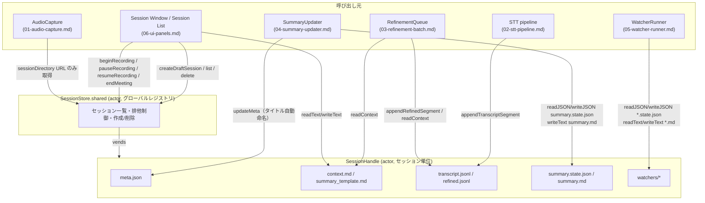
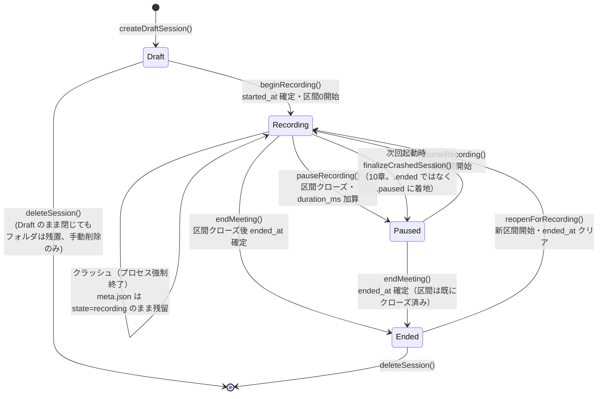

# 07. Session Store 詳細設計

対象読者: Kikimi 実装者（Claude Code 自身）。実装前に必ず読むこと。

参照元: `kikimi.md` 4章（ディレクトリ構造とデータ保存）, 5章（データモデル）, 6章（録音・書き起こしパイプライン）,
7章（context.md ライフサイクル）, 8章（サマリ state/patch）, 9章（Watchers ファイルレイアウト）,
10章（Session List / Session Window の録音排他）, 12章（`config.yaml`）, 13章（アーキテクチャ）,
15章（クラッシュ復旧）。`docs/development-process.md` 2.9（テスト方式）。
Chirami 参照実装: `docs/references/chirami-map.md` 4章・7章。
`AudioCapture` との契約: `docs/design/01-audio-capture.md` 12章。

## 1. 目的とスコープ

このドキュメントが担当するのは **`SessionStore` / `SessionHandle` コンポーネント**、すなわち
`~/.local/state/kikimi/sessions/<id>/` 配下の**すべてのファイル I/O の単一の窓口**という責務。

- セッションフォルダの作成・命名・列挙・削除
- `meta.json` の読み書き（状態遷移: Draft / Recording / Ended）
- `transcript.jsonl` / `refined.jsonl` の追記専用書き込みと読み出し
- `context.md` / `summary_template.md` の初期値コピー・読み書き・サイズ上限警告（ライフサイクルは kikimi.md 4章）
- `summary.state.json` / `summary.md` / `watchers/*` への汎用的な読み書きプリミティブの提供
  （中身の生成ロジック自体は `04-summary-updater.md` / `05-watcher-runner.md` の責務。本ドキュメントは
  「その結果をどう永続化するか」だけを担当する）
- **アプリ全体で Recording は同時に1つ**という排他制御（`01-audio-capture.md` 12章がこのドキュメントに委譲）
- 起動時の未完了セッション（クラッシュ）検出とリカバリ支援

**スコープ外**（他ドキュメントに委譲）:

| 関心事 | 担当ドキュメント |
|---|---|
| マイク/システム音声の実際のキャプチャ・`audio/mic.wav` `audio/system.wav` の生成 | `01-audio-capture.md`（`audio/` サブフォルダ自体の作成も `AudioCapture` 側） |
| セグメント確定ロジック・整形バッチのスケジューリング | `02-stt-pipeline.md` / `03-refinement-batch.md` |
| `summary.state.json` への patch 適用ロジック・view レンダリング | `04-summary-updater.md` |
| Watcher の実行スケジューリング・schema バリデーション | `05-watcher-runner.md` |
| Session List / Session Window の UI 表示・録音ボタンの disabled 制御 | `06-ui-panels.md` |
| `~/.config/kikimi/config.yaml` 自体のパース・監視・型定義（`AppConfig.shared`、`Kikimi/Config/AppConfig.swift`） | `AppConfig.shared` が担当。本ドキュメントは `AppConfig.shared` を**消費するだけ**（詳細は 1.1章） |
| `~/.local/state/kikimi/state.yaml`（ウィンドウ位置等） | `AppState.shared`（本ドキュメントの範囲外） |

`SessionStore` は「セッションフォルダの中で何が起きるかを知っている唯一のコンポーネント」であり、
STT・整形・サマリ・Watcher の各コンポーネントは自分でファイルパスを組み立てて `FileManager` に直接触れず、
必ず `SessionHandle` 経由でファイルにアクセスする（3章）。

### 1.1 `AppConfig.shared` との契約

14章が示す通り、`SessionStore`/`SessionHandle` は `config.yaml` を自分でパースせず、`AppConfig.shared`
（`Kikimi/Config/AppConfig.swift`）から既にデコード済みの値（`storage.session_dir` / `defaults.context_file` /
`defaults.summary_template_file` / `watchers.default_enabled_file` 等）を受け取る。`~` 展開・デフォルト値解決は
`AppConfig.shared` 側で完了させた上で `SessionStore`/`SessionHandle` に渡す。

## 2. Chirami 実装との差分サマリ

Chirami には「セッションフォルダ」という概念自体が存在しない（`TranscriptSession` は音声を永続化せず、
書き起こし結果もノートの `.md` に直接インライン挿入する。`chirami-map.md` 4章参照）。したがって本コンポーネントは
**Chirami に前例のない完全新規コンポーネント**であり、差分表ではなく「何を参考に流用したか」を示す。

| 項目 | Chirami | Kikimi（本設計） | 参考にした部分 |
|---|---|---|---|
| 設定ファイルの atomic 書き込み | `YAMLStore<T>`（`Chirami/Config/YAMLStore.swift`）が `String.write(to:atomically:encoding:)` で YAML を atomic 保存 | `meta.json` / `summary.state.json` など JSON ファイルに対して `Data.write(to:options:.atomic)` で同じ atomic 保存パターンを踏襲（7章） | atomic 書き込みの考え方はそのまま流用。JSON/YAML の違いのみ |
| read-modify-write の更新 API | `YAMLStore.update(_ block: (inout T) -> Void)` | `SessionHandle.updateMeta(_ mutate: (inout SessionMeta) throws -> Void) async throws` として同じ形を踏襲（5.2章） | API 形状を流用。エラー伝播（`throws`）を追加している点が差分 |
| ホームディレクトリ解決 | `FileManager.realHomeDirectory`（`getpwuid` 経由、sudo 環境対応） | 同じ実装をそのまま利用（`SessionStore` のルートパス解決に使う） | そのまま流用 |
| ファイル監視による自動リロード | `YAMLStore` は `FileWatcher` でファイル変更を監視し自動リロードする | **持たない**。`context.md` / `summary_template.md` の外部エディタ編集は UI 内蔵エディタ前提（`06-ui-panels.md` 10章 Prep タブの NSTextView）のため、ファイルシステム監視は不要と判断 | 意図的に不採用（Open Questions 16章で再検討の余地を残す） |
| JSONL のような追記専用ログ | 該当なし（Chirami に追記専用ログはない） | `transcript.jsonl` / `refined.jsonl` は `FileHandle` を開きっぱなしにして `seekToEndOfFile` せず追記し続ける方式。`01-audio-capture.md` 8章の `WavFileWriter`（「起動時にヘッダを書き、以降は追記のみ、seek しない」）と同じ設計思想を JSONL に適用 | `WavFileWriter` の設計思想を流用（実装対象は別） |

## 3. 全体構成



- `SessionStore.shared` は **1インスタンスのみ**（アプリ全体のグローバルレジストリ）。
  セッションの作成・列挙・削除・Recording 排他制御という「複数セッションをまたぐ関心事」を持つ
- `SessionHandle` は **開かれているセッションごとに1インスタンス**。実際のファイル I/O はすべてここに閉じる。
  1つの `SessionHandle` 内の処理は `actor` により直列化されるが、**別セッションの `SessionHandle` とは
  完全に独立**（4節で詳述）。これにより「Draft ウィンドウで `context.md` を高速に打鍵編集している」ことが
  「Recording 中の別ウィンドウで `transcript.jsonl` に毎秒何十行も追記している」ことをブロックしない
- `AudioCapture` は `SessionHandle` を経由せず、`SessionStore.shared` から取得した `sessionDirectory: URL` を
  直接受け取って自分で `audio/` サブフォルダを作る（`01-audio-capture.md` 12章の契約通り）。これは
  「音声ファイル I/O はリアルタイム性が最優先で `actor` のホップコストすら避けたい」という
  `01-audio-capture.md` 5.1章の設計判断（`AudioCapture` は `actor` ではなく plain class）と整合させるための
  意図的な例外である

## 4. 並行性モデル（なぜ「グローバル actor 1つ」ではなく「セッション単位 actor」か）

`SessionStore` を単一の `actor` にして全セッションのファイル I/O をそこに集約する設計も検討したが、
以下の理由で**採用しない**。

- 単一 actor では、ある1つの `await` 呼び出し（例: Draft ウィンドウでの `context.md` 保存）が完了するまで、
  他のすべての呼び出し（例: Recording 中のセッションへの `transcript.jsonl` 追記）が**同一 actor のシリアル
  実行キューで待たされる**。ディスクが遅い環境（ネットワークボリューム等）では、これが
  kikimi.md 8.5章「録音は絶対に止めない」に反するボトルネックになり得る
- `01-audio-capture.md` 3章・8章が「`eventQueue` と `writerQueue(mic)` / `writerQueue(system)` を独立させる」
  ことで同じ問題を回避した設計判断と一貫性を取るため、`SessionStore` でも**セッション単位で I/O を分離**する

そのため以下の2層構成にする。

- **`SessionStore`（actor）**: セッション一覧・作成・削除・Recording 排他フラグのみを保持する軽量なレジストリ。
  ここに滞留するのは高々ミリ秒オーダーのメタデータ操作のみで、ディスク上の大きな I/O（JSONL 追記等）は行わない
- **`SessionHandle`（actor）**: 1セッション分のファイル I/O をすべて引き受ける。**セッションごとに別インスタンス**
  なので、あるセッションの `actor` 内での待機は他セッションの `SessionHandle` に一切波及しない

同一セッション内では `meta.json` 更新・`transcript.jsonl` 追記・`context.md` 保存等が単一 `actor`
（同一 `SessionHandle`）上で直列化されるが、これらはいずれも小さく速い操作（数KB以下のファイル）であるため、
セッション単位のシリアル化それ自体が録音を止めるレベルのボトルネックになるとは考えていない
（`transcript.jsonl` の追記頻度は最大でも数セグメント/秒オーダー。16章 Open Questions で高頻度化した場合の
再検討余地を記載）。

## 5. 型定義（公開 API）

### 5.1 `SessionStore`（グローバルレジストリ）

```swift
enum SessionState: String, Codable, Sendable {
    case draft
    case recording
    /// 録音は止まっているが会議は継続中・再開できる（kikimi.md 4章「「停止」と「終了」を分離する」）。
    /// `on_session_end` は走らない。音声リソースは解放され、Recording の排他フラグも解放される。
    case paused
    case ended
}

enum SessionStoreError: LocalizedError, Equatable, Sendable {
    case sessionNotFound(String)
    /// 既に別セッションが Recording 中（kikimi.md 10章「Recording は同時に1つだけ」）
    case anotherSessionRecording(activeSessionId: String)
    case sessionNotInDraftState(String)
    /// `pauseRecording(_:)`（Recording 前提）、または `finalizeCrashedSession(_:)` の対象が `.recording` でない
    case sessionNotInRecordingState(String)
    /// `resumeRecording(_:)` の対象が `.paused` でない
    case sessionNotInPausedState(String)
    /// `endMeeting(_:)` の対象が `.recording`/`.paused` のいずれでもない
    case sessionNotRecordingOrPaused(String)
    /// `reopenForRecording(_:)` の対象が `.ended` でない
    case sessionNotInEndedState(String)
    case directoryCreationFailed(String)
    case directoryDeletionFailed(String)
    /// Recording 中・直近整形反映待ちのセッションは削除できない（10章の Session List 仕様に対する安全策）
    case cannotDeleteActiveRecording(String)
}

actor SessionStore {
    static let shared = SessionStore()

    /// `config.yaml` の `storage.session_dir`（展開済み絶対パス）。`AppConfig.shared` から注入される。
    private let sessionsRootDirectory: URL

    // MARK: セッションのライフサイクル

    /// 新規 Draft セッションを作成する。フォルダ作成・`meta.json` 初期化・`context.md`/`summary_template.md`
    /// の初期値コピー・`watchers/enabled.yaml` の初期値コピーまでを1トランザクションとして行う（8章参照）。
    /// `basedOn` を指定すると、そのセッションの `context.md`/`summary_template.md` を初期値としてコピーする
    /// （kikimi.md 10章「複製して新規セッション」。`based_on_session` に記録される）。
    func createDraftSession(basedOn sourceSessionId: String? = nil) async throws -> SessionMeta

    /// 既存セッションを開き、`SessionHandle` を返す（フォルダが存在しない場合は `.sessionNotFound`）。
    /// 同一セッションに対して複数回呼ばれても同一の `SessionHandle` インスタンスを返す（内部でキャッシュ）。
    func openSession(_ sessionId: String) async throws -> SessionHandle

    /// `sessions/` 配下を走査し、`meta.json` を読める全セッションのサマリを返す（Session List 用）。
    /// 破損した `meta.json`（デコード失敗）は結果から除外し `.error` ログを出す（14章）。
    func listSessions() async -> [SessionMeta]

    /// Draft または Ended のセッションのみ削除可能。フォルダを再帰的に削除する。
    func deleteSession(_ sessionId: String) async throws

    // MARK: Recording 排他制御・録音区間（9章）

    /// 現在 Recording 中のセッション ID（無ければ nil）。UI の録音ボタン disabled 判定に使う。Paused
    /// の間は常に nil（音声リソースが解放されているため、他セッションが Recording を開始できる）。
    private(set) var recordingSessionId: String?

    /// Draft → Recording。`meta.json.started_at`（最初の録音開始時刻・不変）を確定させ、
    /// `recordings[0]`（`index: 0`, `startMsOffset: 0`）を追加する。
    func beginRecording(_ sessionId: String) async throws -> SessionHandle

    /// Recording → Paused。現在開いている `recordings[]` の最終要素を閉じ（`endedAt` 確定）、その長さを
    /// `durationMs` に加算する。排他フラグ（`recordingSessionId`）を解放する。`on_session_end` は走らない。
    func pauseRecording(_ sessionId: String) async throws

    /// Paused → Recording。新しい録音区間（`index: recordings.count`, `startMsOffset: durationMs`）を
    /// `recordings[]` に追加する。`beginRecording(_:)` と同じ排他チェックを行う。
    func resumeRecording(_ sessionId: String) async throws -> SessionHandle

    /// Recording または Paused → Ended。会議終了の確定操作（唯一の `on_session_end` トリガ）。まだ
    /// Recording であれば `pauseRecording(_:)` と同じ要領で現在の区間を閉じてから `endedAt` を確定する。
    func endMeeting(_ sessionId: String) async throws

    /// Ended → Recording（救済パス、kikimi.md 4章「Ended も可逆」）。`resumeRecording(_:)` と同じ要領で
    /// 新しい録音区間を追加し、`endedAt` を `nil` に戻す。
    func reopenForRecording(_ sessionId: String) async throws -> SessionHandle

    /// `06-ui-panels.md` 4章/6.1章からの追加要請。`beginRecording`/`resumeRecording`/`reopenForRecording`
    /// のいずれかで開いた録音区間の開始シーケンスが `TranscriptPipeline.prepare(...)`/`AudioCapture.start()`
    /// で失敗した場合の巻き戻し専用 API（`AudioCapture.start()` が一度も成功していない、＝音声データが1バイトも
    /// 書かれていない時点でのみ呼んでよい）。直前に追加された未クローズの `recordings[]` 要素を破棄し、
    /// `meta.state` を `revertingTo`（`.draft`/`.paused`/`.ended` のいずれか、呼び出し元がどの遷移から来たかで
    /// 決まる）に戻し、排他フラグも解放する。`revertingTo == .ended` の場合は `endedAt` を
    /// 「破棄後の最終区間の `endedAt`」から復元する（`endMeeting(_:)` は両者を同一時刻で確定させるため）。
    /// `pauseRecording(_:)`/`endMeeting(_:)` と異なりセッションフォルダは削除しない。
    func cancelRecordingStart(_ sessionId: String, revertingTo previousState: SessionState) async throws

    /// `06-ui-panels.md` 5.2章からの追加要請。呼び出した瞬間の `recordingSessionId` を最初の要素として
    /// 即座に yield し、以後この節の各遷移メソッドのたびに新しい値を yield し続ける（actor 外の任意
    /// コンテキストから「現在値 + 変更」の両方を取りこぼしなく購読できるようにするため）。複数購読者に
    /// 同じ値のシーケンスをブロードキャストする。stream の `onTermination` で購読者リストから自動的に
    /// 取り除かれる。
    func subscribeToRecordingSessionId() -> AsyncStream<String?>

    // MARK: クラッシュ復旧（10章）

    /// 起動時に1回呼ぶ。`meta.json.state == "recording"` のまま残っているセッション（＝前回起動時に
    /// クラッシュした可能性が高い）を検出して返す。UI 側（`06-ui-panels.md`）が復旧ダイアログを出す。
    func detectIncompleteSessions() async -> [SessionMeta]

    /// 復旧ダイアログでユーザーが「復旧する」を選んだ場合に呼ぶ。開いたままの録音区間を、その区間に属する
    /// 最終セグメントの `end_ms` から長さを推定して閉じ、`durationMs` に加算した上で `state` を **`.paused`**
    /// に確定する（`.ended` ではない — クラッシュはユーザーが会議終了を決めたわけではないため、10章参照）。
    func finalizeCrashedSession(_ sessionId: String) async throws -> SessionMeta
}
```

### 5.2 `SessionHandle`（セッション単位アクタ）

```swift
/// セッションフォルダ配下の既知ファイルの相対パスを型で表現する。
/// 生の `String`/`URL` を各コンポーネントが個別に組み立てることを禁止するための唯一の正。
/// **この enum 自体は外部に公開しない**（`fileprivate` 相当。`SessionHandle` の内部パス解決専用）。
/// 外部からファイルを指定する API は、専用メソッド（`updateMeta`/`appendTranscriptSegment`/`writeContext`
/// 等）か、5.2.1 の `GenericAccessibleFile`（汎用プリミティブ専用の部分集合型）のいずれかを経由する。
enum SessionFile: Sendable {
    case meta
    case context
    case summaryTemplate
    case transcriptJSONL
    case refinedJSONL
    case summaryState
    case summaryMarkdown
    case watchersEnabled
    /// `watchers/<id>.md` / `watchers/<id>.state.json` / `watchers/<id>.run.json`。
    /// id はファイル名の英数字・ハイフンのみ許容（5-watcher-runner.md 側のバリデーションと合わせる）。
    case watcherDefinition(id: String)
    case watcherState(id: String)
    case watcherRunRecord(id: String)
}

### 5.2.1 `GenericAccessibleFile`（汎用プリミティブの誤用防止）

`readJSON`/`writeJSON`/`readText`/`writeText`（11章）は「`summary.state.json` / `summary.md` /
`watchers/*` 用」とスコープを限定しているが、これらのメソッドの引数型を `SessionFile` のままにすると
`.transcriptJSONL`（追記専用ログ）や `.context`（32KB 上限警告ロジック付きの専用 API を持つファイル）も
コンパイルエラーなく渡せてしまい、`writeText(garbage, to: .transcriptJSONL)` で追記専用ログを上書き破壊
できたり、`writeText(_:to: .context)` で `writeContext()` のサイズ上限警告をバイパスできたりする。

これを型システムで防ぐため、**汎用プリミティブは `SessionFile` 全体ではなく、専用メソッドを持たない
ケースだけを列挙した部分集合の型 `GenericAccessibleFile` を受け取る**。

```swift
/// `readJSON`/`writeJSON`/`readText`/`writeText`（汎用プリミティブ）が受け付けるファイル種別。
/// `SessionFile` のケースのうち、専用の読み書き API（`updateMeta`/`appendTranscriptSegment`/
/// `appendRefinedSegment`/`readContext`/`writeContext`/`readSummaryTemplate`/`writeSummaryTemplate`/
/// `readEnabledWatchers`/`writeEnabledWatchers`）を**持たない**ものだけを含む。
/// `.meta` `.context` `.summaryTemplate` `.transcriptJSONL` `.refinedJSONL` `.watchersEnabled` は
/// 意図的に含めない（専用 API を経由しない誤用をコンパイル時に禁止するため）。
enum GenericAccessibleFile: Sendable {
    case summaryState
    case summaryMarkdown
    case watcherDefinition(id: String)
    case watcherState(id: String)

    /// `SessionHandle` 内部でのみ使う変換。外部には公開しない。
    fileprivate var asSessionFile: SessionFile {
        switch self {
        case .summaryState: .summaryState
        case .summaryMarkdown: .summaryMarkdown
        case .watcherDefinition(let id): .watcherDefinition(id: id)
        case .watcherState(let id): .watcherState(id: id)
        }
    }
}
```

```swift
actor SessionHandle {
    let sessionId: String
    let directoryURL: URL

    // MARK: meta.json

    private(set) var meta: SessionMeta

    /// read-modify-write。呼び出しごとに atomic write する（7章）。
    /// 高頻度に呼ばれる想定のフィールド（`segment_count` 等）は 7章のフラッシュ間引き戦略に従う。
    /// 呼び出し元が `meta.segmentCount`/`meta.refinedCount` を直接インクリメントすることも可能だが、
    /// 通常は `appendTranscriptSegment`/`appendRefinedSegment` が内部でこのカウンタ更新を代行するため
    /// （直下の注記参照）、呼び出し元が二重にカウントしないよう注意する。
    func updateMeta(_ mutate: (inout SessionMeta) throws -> Void) async throws

    /// メモリ上に間引かれた状態で保持している `meta.json` の変更（7章の `metaFlushInterval` 間引き対象の
    /// フィールド、主に `segmentCount`/`refinedCount`）を即座にディスクへ atomic write する。
    /// ウィンドウを閉じる・アプリを終了する際に呼び出し元（`WindowManager`/`AppDelegate` 相当）が
    /// **必ず呼ぶ**必要がある（7章「明示的フラッシュ」の実体 API）。`state` 遷移（`updateMeta` 経由で
    /// `state`/`startedAt`/`endedAt`/`durationMs` を変更した場合）は 9章の通りこの `flush()` を待たずに
    /// 常に即時書き込みされるため、`flush()` が主に対象とするのは `segmentCount`/`refinedCount` の
    /// 間引かれた増分のみである。保留中の変更が無ければ何もせず即座に返る（冪等）。
    func flush() async throws

    // MARK: transcript.jsonl / refined.jsonl（追記専用、6章）

    /// 次の `seg_id`（`seg_` + 5桁ゼロ埋め連番）を払い出し、`transcript.jsonl` に1行追記する。
    /// id の採番と書き込み順序は必ず一致する（kikimi.md 5章「id は投入順に採番される」の実装保証）。
    /// **内部で `meta.segmentCount` を1つインクリメントする**（7章のフラッシュ間引き戦略に従いメモリ上で
    /// まず反映し、ディスクへの書き戻しは間引かれる）。呼び出し元（`02-stt-pipeline.md`）が別途
    /// `updateMeta` でカウンタを更新する必要はない。
    /// `sttSource` は design 33（会議二段デコード）の供給元マーカー: バッチ再デコード由来のとき
    /// `"batch"`、ストリーミング確定（フォールバック・二段デコード OFF）は `nil` でキーごと省略
    /// （旧セッションはキー不在 → `nil` で後方互換）。
    @discardableResult
    func appendTranscriptSegment(
        source: AudioSourceKind,
        startMs: Int,
        endMs: Int,
        text: String,
        confidence: Double,
        sttSource: String? = nil
    ) async throws -> TranscriptSegment

    /// 既に採番済みの `seg_id` に対する整形結果を `refined.jsonl` に1行追記する（Phase 2）。
    /// **内部で `meta.refinedCount` を1つインクリメントする**（`appendTranscriptSegment` と同じ間引き戦略。
    /// 整形失敗（`refinedText == nil`）の場合も「整形処理を試行した件数」としてカウントする）。
    func appendRefinedSegment(_ segment: RefinedSegment) async throws

    /// 全件読み出し（サマリ全文再生成・Wiki export・クラッシュ復旧の duration 推定などバッチ用途）。
    /// 末尾行が壊れている場合（クラッシュによる書き込み途中断）は `.warning` ログを出して当該行のみ
    /// 読み飛ばす。末尾以外の行が壊れている場合はより深刻な破損とみなし `.error` ログを出しつつ、
    /// それでも残りの行は読み続ける（8.5章「データは絶対に失わない」の精神をログ読み出し側にも適用）。
    func readTranscriptSegments() async throws -> [TranscriptSegment]
    func readRefinedSegments() async throws -> [RefinedSegment]

    // MARK: context.md / summary_template.md（7章）

    func readContext() async -> String
    /// 32KB 上限。超過時は `.warning` ログを出すが、内容はそのまま書き込む（kikimi.md 7章）。
    func writeContext(_ text: String) async throws

    func readSummaryTemplate() async -> String
    /// 16KB 上限。超過時は `.warning` ログを出すが、内容はそのまま書き込む（kikimi.md 8章）。
    func writeSummaryTemplate(_ text: String) async throws

    /// Prep タブ「他セッションから複製」用。コピー元セッションの `context.md`/`summary_template.md` を
    /// 指定スコープでこのセッションに上書きコピーする。
    func copyPrepFiles(from sourceSessionId: String, scope: PrepCopyScope) async throws

    // MARK: 汎用プリミティブ（summary.state.json / summary.md / watchers/* 用、11章）
    // 引数型は `SessionFile` ではなく 5.2.1 の `GenericAccessibleFile`。専用 API を持つファイル
    // （meta / context / summaryTemplate / transcriptJSONL / refinedJSONL / watchersEnabled）は
    // コンパイル時にここへ渡せない。

    /// 存在しなければ nil を返す（初回実行前の Watcher 等、正常系として扱う）。
    func readJSON<T: Decodable>(_ file: GenericAccessibleFile, as type: T.Type) async throws -> T?
    /// atomic 上書き保存（追記ではない）。
    func writeJSON<T: Encodable>(_ value: T, to file: GenericAccessibleFile) async throws

    func readText(_ file: GenericAccessibleFile) async throws -> String?
    func writeText(_ text: String, to file: GenericAccessibleFile) async throws

    /// `watchers/` 配下の session-local Watcher 定義ファイル一覧（`enabled.yaml` を除く `*.md`）。
    func listSessionLocalWatcherIds() async throws -> [String]
}

enum PrepCopyScope: Sendable {
    case contextOnly
    case templateOnly
    case both
}
```

### 5.3 データモデル

kikimi.md 5章の JSON スキーマをそのまま `Codable` に写像する。フィールド名は
`JSONDecoder.keyDecodingStrategy = .convertFromSnakeCase` / `JSONEncoder.keyEncodingStrategy = .convertToSnakeCase`
を使い camelCase ↔ snake_case を自動変換する（`meta.json` 側は例外があるため 5.3.1 で個別に注記）。

**Date フィールドのエンコード/デコード戦略**: `SessionMeta`（`createdAt`/`startedAt`/`endedAt`）と
`RefinedSegment`（`refinedAt`）はいずれも `Date` 型フィールドを持つが、kikimi.md 5章のサンプル JSON は
`"created_at": "2026-07-01T14:28:12Z"` のように **ISO 8601 文字列**でシリアライズされている。
`JSONEncoder`/`JSONDecoder` の既定戦略（`.deferredToDate`、Unix epoch 秒の `Double`）のままではこの
フォーマットと一致せず、`meta.json`/`refined.jsonl` が非可読な数値になってしまう
（11章 Wiki export の frontmatter `date` フィールド生成にも影響する）。そのため、
`meta.json`/`transcript.jsonl`/`refined.jsonl` を読み書きするすべての `JSONEncoder`/`JSONDecoder` インスタンスに
**`dateEncodingStrategy = .iso8601` / `dateDecodingStrategy = .iso8601` を明示的に設定する**
（`SessionHandle` 内部でこれらのエンコーダ/デコーダをキャッシュして使い回す想定。呼び出し元が独自に
`JSONEncoder()`/`JSONDecoder()` を生成することは無い）。Chirami には Date を JSON へ永続化した前例が無く
（`NoteWebViewBridge.swift`/`ContextHandler.swift` の既存 `JSONEncoder`/`JSONDecoder` 使用箇所はいずれも
`Date` を扱わない）、参照できる既存パターンが無いため本ドキュメントで明示的に規定する。

```swift
struct TranscriptSegment: Codable, Sendable, Equatable {
    var id: String              // "seg_00042"
    var startMs: Int
    var endMs: Int
    var speaker: AudioSourceKind
    var text: String
    var confidence: Double
    var sttSource: String?      // "batch" のときのみキーが存在。design 33 MT9
}

struct RefinedSegment: Codable, Sendable, Equatable {
    var id: String
    var startMs: Int
    var endMs: Int
    var speaker: AudioSourceKind
    var rawText: String
    var refinedText: String?    // 整形失敗時は nil
    var error: String?          // 整形失敗時のメッセージ
    var refinedAt: Date
    var model: String
    var batchId: String
}

/// 1つの録音区間（kikimi.md 4/5章）。Recording になるたびに新しい要素が追加され、Paused/Ended で
/// その要素が閉じる（`endedAt` 確定）。音声ファイルは `audio/mic_NNN.wav`/`audio/system_NNN.wav`
/// （`NNN` = `index` をゼロ埋め3桁）として区間ごとに分けて書く（`01-audio-capture.md` 参照）。
struct RecordingSegment: Codable, Sendable, Equatable {
    var index: Int              // 0始まり連番。mic_NNN.wav/system_NNN.wav と対応
    var startedAt: Date         // 区間の実開始時刻
    var endedAt: Date?          // 区間を閉じた実時刻。進行中の区間は nil
    var startMsOffset: Int      // この区間開始時点の累積 durationMs
}

struct SessionMeta: Codable, Sendable, Equatable {
    var id: String
    var title: String
    var titleAutoGenerated: Bool
    var titleAutoNamedOnce: Bool
    var titleProposal: String?
    var state: SessionState
    var createdAt: Date
    var startedAt: Date?        // 最初の録音開始時刻（不変）。Draft の間は nil
    var endedAt: Date?          // 会議終了（Ended）時刻。Recording/Paused の間は nil
    var durationMs: Int         // 録音アクティブ時間の累積（閉じた区間の合計）。未録音なら 0
    var recordings: [RecordingSegment]
    var basedOnSession: String?
    var segmentCount: Int
    var refinedCount: Int
    var appVersion: String
}
```

`durationMs` は Phase 1 実装（一時停止/再開機能追加前）では `Int?` だったが、常に意味のある値
（未録音なら `0`）を持つため `Int` に変更した。`recordings` は互換データが存在しないため後方互換の
移行ロジックは不要だが、デコード時に欠落していても空配列にフォールバックする防御的 `init(from:)` を
実装する（壊れた/手書きの fixture への耐性）。

**5.3.1 `meta.json` の `id` フィールドと実際のフォルダ名の関係（重要な解釈）**

kikimi.md 4章の例 `2026-07-01T14-30-00_a1b2c3d4/` と5章の `meta.json` 例（`id` が `14-30-00` を含む一方で
`created_at` は `14:28:12`）を字面通りに読むと、フォルダ名（＝ `id`）は `created_at`（Draft 作成時刻）ではなく
`started_at`（録音開始時刻）から生成されているように見える。しかし4章は同時に「ウィンドウ作成時（Draft）に
セッションフォルダを即座に作る」とも書いており、**Draft 作成時点ではまだ `started_at` が存在しない**ため、
両者は字面上矛盾している。

本設計では **フォルダ名 / `id` は `createdAt`（Draft 作成時刻）で確定し、以後リネームしない**方針を採用する。
理由:

- Draft → Recording 遷移時にフォルダをリネームする案も検討したが、`AudioCapture` が `sessionDirectory`
  として受け取った `URL` を内部に保持し続ける設計（`01-audio-capture.md` 5章）のため、リネームのタイミングを
  「`AudioCapture.start()` が実際にファイルを開く前」に厳密に間に合わせる必要があり、`WindowManager`/`state.yaml`
  側のキャッシュ更新も含めて実装・検証コストの割に得られる価値が小さいと判断した
- Session List が Draft 状態のセッションも表示する（10章）以上、`id` は Draft 作成の瞬間から安定して存在する
  必要があり、後から変わる仕様は「他セッションから複製」時の参照や `based_on_session` の記録とも相性が悪い

この判断は kikimi.md の記述を字面通りには満たさない（5章の例とは不一致）ため、**16章 Open Questions
および本レポートの `deviations_from_kikimi_md` として明示する**。

## 6. 状態遷移



- `Draft → Recording` は `SessionStore.beginRecording(_:)` のみが行う。この関数は
  `.sessionNotInDraftState` チェックと `.anotherSessionRecording` チェックの両方を行った上で
  `SessionHandle.updateMeta` を呼ぶ（Recording 排他制御は 9章）
- `Recording → Paused`（`pauseRecording(_:)`）と `Paused → Recording`（`resumeRecording(_:)`）が
  「停止」と「再開」を表す。`on_session_end` はどちらの遷移でも走らない（kikimi.md 4章）
- `Recording/Paused → Ended`（`endMeeting(_:)`）が**唯一の確定操作**。ここで初めて（Phase 2/3 実装後は）
  `on_session_end`（Wiki export・最終タイトル生成・session-end Watcher）が発火する
- `Ended → Recording`（`reopenForRecording(_:)`）は救済パス（kikimi.md 4章「Ended も可逆」）。
  `on_session_end` の副作用は冪等（上書き）である前提で、録り足して再終了しても壊れない
- Draft のまま閉じたセッションはフォルダが残る（4章）。`deleteSession` はユーザーが Session List から
  明示的に呼んだ場合のみ実行される
- クラッシュ復旧経路（`Recording → クラッシュ → 次回起動時 finalizeCrashedSession` → `Paused`）は 10章参照

## 7. atomic 書き込み・整合性保証

- **`meta.json` / `summary.state.json` / `watchers/<id>.state.json`（JSON, 上書き型）**:
  `JSONEncoder` でエンコードした `Data` を `Data.write(to:options:[.atomic])` で書き込む。
  `.atomic` オプションは一時ファイルへ書いてから `rename(2)` する Foundation 標準の実装で、
  書き込み中のクラッシュでもファイルが半端な状態で残ることはない（Chirami の `YAMLStore.save()` が
  `String.write(to:atomically:true,encoding:)` で行っているのと同じ保証をJSONに適用したもの）
- **`context.md` / `summary_template.md` / `summary.md`（プレインテキスト, 上書き型）**:
  同様に `String.write(to:atomically:true,encoding:.utf8)` を使う
- **`transcript.jsonl` / `refined.jsonl`（追記専用）**: atomic write は使わない（追記のたびに一時ファイル＋
  rename するのは行単位の追記という用途に対してオーバーヘッドが大きい）。代わりに `SessionHandle` が
  セッションを開いた時点で `FileHandle` を1つ開きっぱなしにし、`seekToEndOfFile()` の後は `write(_:)` を
  呼ぶだけにする（`01-audio-capture.md` 8章 `WavFileWriter` と同じ「開いたら追記のみ、seek しない」方針）。
  1行 = 1回の `write(_:)` 呼び出しとし、JSON 本体の末尾に改行 `\n` を付けて書き込む。`write(_:)` 自体は
  POSIX の `write(2)` に対して単一呼び出しなので、行の途中で別の書き込みが割り込むことはない
  （同一 `SessionHandle` actor 内でシリアル化されているため、そもそも並行呼び出し自体が起こらない）
- **`meta.json` の更新頻度に対する間引き（フラッシュ戦略）**: `segment_count`/`refined_count` は
  `appendTranscriptSegment`/`appendRefinedSegment`（5.2章）が呼ばれるたびに内部で加算対象になるが、
  セグメントごとに毎回 `meta.json` を atomic write するのは長時間会議で数百〜数千回のディスク書き込みに
  なり無駄が大きい。`01-audio-capture.md` の `headerFlushInterval`（WAV ヘッダの書き戻し間引き）と
  同じ考え方で、`SessionHandle` は `segmentCount`/`refinedCount` の増分を**メモリ上でまず反映**し、
  実ディスクへの `meta.json` 書き戻しは **「前回書き戻しから `metaFlushInterval`（既定 5 秒）経過」または
  「`state` が変化した（Draft/Recording/Ended 遷移、`updateMeta` 経由）」のいずれか早い方**で行う。
  `state`/`startedAt`/`endedAt`/`durationMs` の変更は常にこの間引きの**対象外**（＝即時フラッシュ）で、
  間引きの対象になるのは `segmentCount`/`refinedCount` の増分のみである。
  ウィンドウを閉じる・アプリを終了する際は、`WindowManager`/`AppDelegate` 相当が
  **`SessionHandle.flush() async throws`（5.2章で公開 API として定義）を明示的に呼ぶ**ことで、
  保留中の `segmentCount`/`refinedCount` の増分を即座にディスクへ書き戻す。`actor` の `deinit` は
  `async` 処理を実行できないため「`SessionHandle` の `deinit` 相当処理」には依拠せず、**呼び出し元による
  明示的な `flush()` 呼び出しのみ**を正式な契約とする（15章の `06-ui-panels.md` との境界にも明記）
- **末尾行破損への耐性（読み出し側）**: `readTranscriptSegments()` / `readRefinedSegments()` は行単位で
  `JSONDecoder` デコードを試み、失敗した行が**末尾1行のみ**であれば「クラッシュ等による書き込み途中断」と
  みなし `.warning` ログのみで読み飛ばす。末尾以外の行が壊れている場合はより深刻なファイル破損の兆候として
  `.error` ログを出しつつ、それでも当該行だけスキップして残りの行の読み出しは継続する
  （8.5章「データは絶対に失わない」の精神を読み出し側にも適用し、1行の破損でセッション全体を読めなくしない）

## 8. context.md / summary_template.md ライフサイクル実装

kikimi.md 4章の表をそのまま実装契約に落とす。

| 段階 | `SessionHandle` の挙動 |
|---|---|
| `createDraftSession()`（`basedOn` なし） | `AppConfig.shared.defaults.contextFile`（既定 `~/.config/kikimi/context/common.md`）と `defaults.summaryTemplateFile`（既定 `~/.config/kikimi/templates/summary.md`）を読み、`context.md`/`summary_template.md` として書き込む。**コピー元ファイルが存在しない場合**: `context.md` は空文字列で初期化し `.warning` ログ（kikimi.md 7章の「削除された場合」の扱いを初回コピー時にも拡張適用）。`summary_template.md` は内蔵デフォルトテンプレート文字列（8章の既定 view template と同一内容をコード内定数として持つ）で初期化し `.warning` ログ（kikimi.md 8章の「ファイル未存在時は内蔵デフォルトにフォールバック」を初回コピー時にも拡張適用） |
| `createDraftSession(basedOn: sourceId)` | コピー元セッションの `context.md`/`summary_template.md` を両方コピーする（kikimi.md 10章「複製して新規セッション」）。コピー元自体が読み取れない場合は上記のグローバルデフォルトにフォールバックする |
| Draft/Recording/Ended 中の UI 編集 | `writeContext(_:)` / `writeSummaryTemplate(_:)` を呼ぶたびに即座に atomic 上書き保存（7章） |
| Recording 中の反映タイミング | **`SessionHandle` はこれを関知しない**。ファイルへの保存自体は常に即時だが、その内容を「いつ LLM の system prompt / view template に取り込むか」は `03-refinement-batch.md`（最大 `context_refresh_batches` バッチ後）と `04-summary-updater.md`（次回サマリ更新から即時）の責務であり、両者は `readContext()`/`readSummaryTemplate()` を自分のタイミングで呼び出すだけ |
| Ended 後の「サマリ全文再生成」 | `04-summary-updater.md` が `readSummaryTemplate()` で最新テンプレートを取得し、`readRefinedSegments()` で全件を取得して state を作り直す。`SessionHandle` 側の追加対応は不要 |
| Prep タブ「他セッションから複製」 | `copyPrepFiles(from:scope:)` を呼ぶ。対象セッションが `basedOn` と異なる点に注意（`createDraftSession(basedOn:)` は新規作成時の初期値コピー、`copyPrepFiles` は既存の開いているセッションへの後からの上書きコピー） |

## 9. Recording 排他制御

kikimi.md 10章「Recording は同時に1つだけ（音声リソースは単一。他ウィンドウの録音ボタンは Recording 中は
disabled）」の実装をどのコンポーネントが持つかは kikimi.md 13章の表にも `01-audio-capture.md` 12章にも
明記が無い。`01-audio-capture.md` 12章は「`AudioCapture` 自身は同一インスタンスの二重 `start()` だけを防ぐ。
アプリ全体での排他制御は `07-session-store.md` 側の責務」と明示的に本ドキュメントへ委譲しているため、
**`SessionStore.shared` が単一の真実 (`recordingSessionId: String?`) を保持する**設計とする。

- `beginRecording(_:)` は以下を**この順**で行う: ①現在 `recordingSessionId != nil` かつ対象セッションと
  異なれば `.anotherSessionRecording` を throw して終了 ②対象セッションが `.draft` でなければ
  `.sessionNotInDraftState` を throw ③`recordingSessionId` をこのセッション ID に設定 ④`SessionHandle.updateMeta`
  で `state = .recording`, `startedAt = Date()`, `recordings = [RecordingSegment(index: 0, ...)]` を
  確定・即時フラッシュ（7章の間引きの例外）
- `resumeRecording(_:)`/`reopenForRecording(_:)` も同じ①③の排他チェック・フラグ設定を行い、④の代わりに
  新しい `RecordingSegment`（`index: recordings.count`, `startMsOffset: durationMs`）を `recordings` に
  追加して `state = .recording` にする（`reopenForRecording(_:)` はさらに `endedAt = nil` にする）
- `pauseRecording(_:)` は現在開いている `recordings` の最終要素を閉じ（`endedAt = Date()`）、その長さを
  `durationMs` に加算し、`state = .paused` にしてから **`recordingSessionId = nil` に戻す**（音声リソースが
  解放されるため、他セッションが録音を開始できるようになる）
- `endMeeting(_:)` は `state == .recording` であれば `pauseRecording(_:)` と同じ要領で現在の区間を閉じてから
  `state = .ended`, `endedAt = Date()` を確定・即時フラッシュする。`state == .paused` から呼ばれた場合は
  区間は既にすべて閉じているので `state`/`endedAt` のみ更新する。`recordingSessionId` は「Recording から
  呼ばれた場合のみ」`nil` に戻す（Paused から呼ばれた場合は既に `nil` のはず）
- `cancelRecordingStart(_:revertingTo:)` はこれら「区間を開く」系3メソッド（`beginRecording`/
  `resumeRecording`/`reopenForRecording`）のいずれかが `AudioCapture.start()` 成功前に失敗した場合の
  ロールバック専用 API。直前に追加された未クローズの `recordings` 要素を破棄し、`recordingSessionId` を
  `nil` に戻す
- `06-ui-panels.md` 側は `SessionStore.shared.recordingSessionId` を購読し、`nil` でなく自分のセッション ID と
  異なる場合に録音ボタン（`● 録音開始`/`● 録音再開`）を disabled にする（実際の購読機構 = Combine/AsyncStream
  のどちらにするかは `06-ui-panels.md` の実装判断に委ねる。本ドキュメントは「真実の値がどこにあるか」までを
  定義する）。`⏹ 会議終了` ボタンは Paused の間はこの排他フラグに関与しないため、常に enabled のままでよい
- `AudioCapture` 自体の `start()`/`stop()` はこの排他制御を**知らない**。呼び出し順序として
  「`SessionStore` の区間開始メソッドが成功して初めて `AudioCapture(sessionDirectory:recordingIndex:).start()`
  を呼ぶ」というシーケンスを呼び出し元（Session Window の ViewModel）が守る契約とする

## 10. クラッシュ復旧

kikimi.md 15章 Open Questions「セッション中のクラッシュ復旧: JSONL 追記なので `transcript.jsonl` は残るが、
`meta.json` の `ended_at` が欠ける。次回起動時に『未完了セッションを検出しました』ダイアログでリカバリ」への
実装方針。

- アプリ起動時（`KikimiApp` の初期化パス、ウィンドウ復元より前）に `SessionStore.shared.detectIncompleteSessions()`
  を1回呼ぶ。これは全セッションフォルダの `meta.json` を走査し、`state == .recording` のものを収集する
  （**このチェック時点で `recordingSessionId` はまだ `nil`** ＝ 起動直後は誰も Recording していないはずなので、
  `state == .recording` が残っていること自体が「正常終了しなかった」ことの証跡になる）
- 該当セッションがあれば `06-ui-panels.md` 側が「未完了セッションを検出しました」ダイアログを表示する
  （複数ある場合は全件リストする。通常は高々1件のはずだが、複数回クラッシュした場合に備えて配列で返す設計とする）
- ユーザーが「復旧する」を選ぶと `finalizeCrashedSession(_:)` を呼ぶ。これは `recordings` の最終要素
  （開いたままの区間）に属するセグメント（`start_ms >= その区間の startMsOffset`）のうち**最後に書き込まれた
  行**（`start_ms`/`end_ms` の最大値ではなく、`transcript.jsonl` の append 順で最後の行。mic/system 2ストリーム
  が混在するため両者は一致しないことがある）の `end_ms` からその区間の長さを推定し（該当セグメントが1件も
  無ければ長さ 0）、その区間を閉じて `durationMs` に加算した上で **`state = .paused`** に確定する
  （**`.ended` にはしない** — クラッシュはユーザーが「会議終了」を決めたことを意味しないため、`endedAt` も
  `nil` のままにする）。この際 `.warning` ログで「クラッシュ復旧により推定値を使用した」ことを明示する
- ユーザーが「破棄する」を選んだ場合の挙動は `06-ui-panels.md` 側の判断に委ねる（`deleteSession` を呼ぶか、
  単に `state == .recording` のまま Session List に残し続けるか）。本ドキュメントは
  `finalizeCrashedSession` という復旧専用 API のみ提供し、破棄経路は通常の `deleteSession` を流用できる
  ため追加 API は設けない

## 11. summary.state.json / watchers ファイルとの境界

`SessionStore`/`SessionHandle` は **Phase 2（サマリ）・Phase 3（Watcher）が使う汎用永続化プリミティブ
（`readJSON`/`writeJSON`/`readText`/`writeText`）だけを提供し、中身のスキーマ・patch 適用・view
レンダリングには一切関与しない**。これは kikimi.md 13章の component 表が `SummaryUpdater`/`WatcherRunner` を
`SessionStore` とは独立のコンポーネントとして列挙していることと整合させるための意図的な境界線であり、
「`SessionStore` は『セッションのファイル I/O』を担当する」という同じ13章の記述をどこまで広く解釈するかの
判断でもある。本設計では **「ファイルシステムに触れるコードは `SessionHandle` 経由のみ」を徹底する**ため
最も広く解釈し、`SummaryUpdater`/`WatcherRunner` は自前で `FileManager`/`URL` を組み立てない契約とする。

- `summary.state.json` の Codable 型（8章の schema）は `04-summary-updater.md` 側で定義する。
  `SessionHandle.readJSON(.summaryState, as: SummaryState.self)` / `writeJSON(_:to: .summaryState)` を使う
- `summary.md` は `SessionHandle.writeText(_:to: .summaryMarkdown)` で上書き保存（追記ではない、kikimi.md 5章）
- `watchers/enabled.yaml` は他の JSON 系ファイルと異なり **YAML**（`config.yaml`/`default_watchers.yaml` と
  同じ形式に揃える必要があるため）。`SessionHandle` は `readJSON`/`writeJSON` とは別に
  `readEnabledWatchers() async throws -> [String]` / `writeEnabledWatchers(_ ids: [String]) async throws` を
  個別に提供し、内部で Yams を使ってエンコード/デコードする（`enabled: [...]` の1キーのみを持つ薄い構造体）
- `watchers/<id>.md`（frontmatter + `# System`/`# User`）はテキストファイルとして
  `readText(.watcherDefinition(id:))`/`writeText(_:to:.watcherDefinition(id:))` で扱う。frontmatter の
  パース（YAML）・schema の JSON Schema 変換は `05-watcher-runner.md` 側の責務
- `watchers/<id>.state.json` は通常の JSON 系ファイルとして `readJSON`/`writeJSON` を使う
- `watchers/<id>.run.json`（`WatcherRunRecord`、`05-watcher-runner.md` §7.2）も同様に
  `readJSON`/`writeJSON`。動的キーを含まないので `SessionJSONCoding` の snake_case 変換で壊れない
- `modificationDate(of:)` はこの `run.json` が無い旧セッション向けのフォールバック専用
  （`state.json` の mtime を最終実行時刻の代理に使う）
- `createDraftSession()` は `AppConfig.shared.watchers.defaultEnabledFile`（既定
  `~/.config/kikimi/default_watchers.yaml`）を読み、`watchers/enabled.yaml` の初期値としてコピーする
  （kikimi.md 9章「新規ウィンドウ作成時は `~/.config/kikimi/default_watchers.yaml` をコピー」）。
  コピー元が存在しない場合は空リスト `enabled: []` で初期化し `.warning` ログ

## 12. 失敗モード一覧

| # | 状況 | `SessionStore`/`SessionHandle` の挙動 | ログレベル | ユーザー可視性 |
|---|---|---|---|---|
| 1 | `createDraftSession()` 時にセッションルートディレクトリが作成できない（権限・ディスクフル） | `.directoryCreationFailed` を throw。ウィンドウは開かれない | `.error` | エラーダイアログ（`06-ui-panels.md`） |
| 2 | `context.md`/`summary_template.md` のコピー元（グローバルデフォルトまたは複製元セッション）が読めない | 8章の通り空文字列/内蔵デフォルトにフォールバックし処理は継続（Draft 作成自体は失敗させない） | `.warning` | 非表示（デフォルト内容が使われるだけ） |
| 3 | `beginRecording(_:)` 呼び出し時に既に別セッションが Recording 中 | `.anotherSessionRecording` を throw。状態は変化しない | `.warning` | 「既に別の会議を録音中です」トースト |
| 4 | `meta.json` の atomic write が失敗（ディスクフル等） | throw して呼び出し元に伝播。`state` 遷移系（`beginRecording`/`pauseRecording`/`resumeRecording`/`endMeeting`/`reopenForRecording`）はこの場合ロールバックし、`recordingSessionId` 等のメモリ上の状態も元に戻す | `.error` | エラーダイアログ（特に `endMeeting` 失敗時は「録音は停止したが会議の確定に失敗した」ことを明示する必要がある） |
| 5 | `transcript.jsonl`/`refined.jsonl` への `write(_:)` が失敗（ディスクフル等） | `.error` ログを出し、以後そのセッションへの追記は諦める旨を `didDegrade` 相当の通知で呼び出し元（`02-stt-pipeline.md`）に伝える。**録音自体（`AudioCapture`/WAV）は独立しているため止まらない**（`01-audio-capture.md` 8.5章と同じ「録音は絶対に止めない」原則をここにも適用） | `.error` | 「書き起こしの保存に失敗しました」バナー |
| 6 | `transcript.jsonl`/`refined.jsonl` の読み出し時に末尾行が壊れている | 7章の通り当該行のみ読み飛ばして継続 | `.warning` | 非表示 |
| 7 | `transcript.jsonl`/`refined.jsonl` の読み出し時に末尾以外の行が壊れている | 7章の通り当該行のみ読み飛ばして継続（より深刻な兆候として扱う） | `.error` | 非表示（頻発時は将来 UI 検討） |
| 8 | `listSessions()` 実行時に一部セッションの `meta.json` がデコードできない | そのセッションを結果配列から除外し処理継続（他の正常なセッションの一覧表示は妨げない） | `.error` | Session List に表示されない（データは残っているため手動でのファイル復旧は可能） |
| 9 | `deleteSession(_:)` の対象が Recording 中 | `.cannotDeleteActiveRecording` を throw。削除しない | `.warning` | 「録音中のセッションは削除できません」トースト |
| 10 | `deleteSession(_:)` のディレクトリ削除自体が失敗（他プロセスがファイルを開いている等） | `.directoryDeletionFailed` を throw | `.error` | エラーダイアログ |
| 11 | `openSession(_:)` の対象フォルダが存在しない（Session List の項目と実ファイルシステムの不整合） | `.sessionNotFound` を throw | `.error` | 「セッションが見つかりません。一覧を更新してください」トースト |
| 12 | `context.md`/`summary_template.md` がサイズ上限（32KB/16KB）を超過して保存される | 7・8章の通り警告のみで保存自体は継続する（内容は使う） | `.warning` | Prep タブに控えめな警告表示（`06-ui-panels.md` 判断） |
| 13 | アプリ起動時に `detectIncompleteSessions()` が複数のクラッシュ済みセッションを検出 | 全件返す（配列）。特別なフォールバックはしない | `.warning` | 復旧ダイアログに複数件表示 |
| 14 | `finalizeCrashedSession(_:)` 実行時に、開いたままの区間に属する `transcript.jsonl` セグメントが1件も読めない（空 or 全損） | その区間の長さを `0`（`endedAt = startedAt`）として確定し `.paused` に処理継続（セッション自体は救済する） | `.warning` | 「復旧しましたが記録が見つかりませんでした」表示 |

**共通原則**: 書き起こし・録音の継続性（`AudioCapture`/`02-stt-pipeline.md` の責務）は `SessionStore` 側の
障害から常に独立させる。`SessionStore` 側での障害は「保存・管理」機能の劣化として扱い、書き起こしパイプライン
自体を止める理由にはしない（kikimi.md 8.5章の原則をファイル管理層にも適用）。

## 13. テスト容易性

### レイヤ1（単体テスト, swift-testing）で狙う対象

- `SessionMeta`/`TranscriptSegment`/`RefinedSegment` の JSON エンコード/デコードの往復一致
  （kikimi.md 5章のサンプル JSON をそのままデコードできること、フィールド名の snake_case 変換含む）。
  **`createdAt`/`startedAt`/`endedAt`/`refinedAt` は 5.3章で規定した `.iso8601` 戦略で
  `"2026-07-01T14:28:12Z"` のような文字列としてエンコード/デコードされること**を明示的に検証する
  （デフォルトの `.deferredToDate` のままだと epoch 秒の数値になり kikimi.md 5章の例と一致しない）
- `meta.json` の read-modify-write が等冪であること（`updateMeta` を同じ内容で2回呼んでも結果が変わらない）。
  `docs/development-process.md` 2.9 の「Config YAML の読み書きが等冪」と同じ考え方を JSON 側にも適用
- `transcript.jsonl` への連続 `appendTranscriptSegment` 呼び出しで、`id` が投入順に単調増加すること
- **`appendTranscriptSegment`/`appendRefinedSegment` を N 回呼んだ後、`meta.segmentCount`/`meta.refinedCount`
  （`flush()` 後にディスクへ書き戻された値）が `transcript.jsonl`/`refined.jsonl` の実際の行数と一致すること**
  （`kikimi-verify` の `verify_session.py` がレイヤ2で検証する不変条件の、レイヤ1での事前検証）
- `flush()` を呼ぶと、`metaFlushInterval` の間引き中でも保留中のカウンタ変更が即座にディスクへ反映されること。
  保留中の変更が無い状態で `flush()` を呼んでも副作用がない（冪等）こと
- `transcript.jsonl` の末尾行を意図的に壊した状態からの `readTranscriptSegments()` が、正常な行を
  失わずに読み出せること（7章のクラッシュ耐性の直接検証）
- `SessionStore.beginRecording`/`pauseRecording`/`resumeRecording`/`endMeeting`/`reopenForRecording` の
  排他制御（2つ目のセッションで `beginRecording` を呼ぶと `.anotherSessionRecording` になること、
  `pauseRecording`/`endMeeting`（Recording から）後は別セッションで `beginRecording` が成功すること）と、
  begin→pause→resume→pause→end→reopen の一連のサイクルで `recordings[]`/`durationMs`/`startMsOffset` が
  正しく積み上がること
- `createDraftSession(basedOn:)` が `context.md`/`summary_template.md` を正しくコピーし、
  `basedOnSession` フィールドが設定されること
- `detectIncompleteSessions()`/`finalizeCrashedSession()` を、一時ディレクトリ上に
  `state: recording` の `meta.json` を手動で用意した fixture で検証
- `SessionFile`/`GenericAccessibleFile` の相対パス解決（例: `.watcherState(id: "pre-check")` →
  `watchers/pre-check.state.json`）。なお `readJSON(.transcriptJSONL, ...)` のような専用ファイルへの
  汎用プリミティブ誤用はそもそも**コンパイルが通らない**ため単体テストの対象外（5.2.1章の型制約で担保）

### レイヤ2（`kikimi-verify` skill）向け

- `kikimi-verify` の `verify_session.py`（`~/.claude/skills/kikimi-verify/scripts/`）は、録音開始 → 停止後の
  セッションフォルダが本ドキュメント4章のレイアウト・5章の `meta.json` スキーマを満たしているかを検証する
  契約先として本ドキュメントを参照する。具体的な検証項目（`state == "ended"` であること、
  `transcript.jsonl` の行数が `segment_count` と一致すること等）は `kikimi-verify` skill 側のスクリプトで実装する

## 14. 設定との対応

`SessionStore`/`SessionHandle` は `config.yaml` を自分でパースしない。すべて **`AppConfig.shared`
（13章）から既にデコード済みの値として受け取る**。

| `config.yaml` キー | 用途 |
|---|---|
| `storage.session_dir` | `SessionStore.sessionsRootDirectory` の初期化に使用（`~` 展開は `AppConfig.shared` 側で解決済みの絶対パスを渡される前提） |
| `defaults.context_file` / `defaults.summary_template_file` | `createDraftSession()` の初期値コピー元（8章） |
| `watchers.default_enabled_file` | `createDraftSession()` の `watchers/enabled.yaml` 初期値コピー元（11章） |

**`01-audio-capture.md` 11章が「`audio.format` の検証・フォールバックは設定読み込み層（`07-session-store.md`）の
責務」と本ドキュメントを名指ししている点について**: これは字面上 `SessionStore` 自体が `config.yaml` を
パースするようにも読めるが、13章の component 表が `AppConfig.shared` を config.yaml の唯一の所有者としている
こととは矛盾する。本設計での解釈は、**`AppConfig.shared` が `config.yaml` のロード・型変換・`audio.format`
バリデーション（`wav` 以外は `.warning` ログの上 `wav` にフォールバック）を行い**、`SessionStore.beginRecording(_:)`
（＝ `AudioCapture` を実際にインスタンス化する呼び出し元）が、その**検証済みの値**を読んで
`AudioCaptureConfig(sampleRate:channels:)` を組み立てる、という役割分担にする。「設定読み込み層」という
`01-audio-capture.md` の表現は「`AudioCaptureConfig` を組み立てるコード」を指しているのであって、
YAML パース処理そのものを指しているわけではない、と解釈して両ドキュメントの整合を取った。

## 15. 他ドキュメントとの境界（インターフェース契約まとめ）

| 相手 | 契約 |
|---|---|
| `01-audio-capture.md` | `SessionStore.beginRecording(_:)` が成功した後、呼び出し元が `AudioCapture(sessionDirectory: handle.directoryURL)` を生成し `start()` を呼ぶ。`AudioCapture` は `SessionHandle` を経由せず `sessionDirectory` の `URL` のみを使う。Recording 排他制御は `SessionStore` 側（9章）で担保済みという前提で `AudioCapture` 側は二重 `start()` の防止のみ行えばよい |
| `02-stt-pipeline.md` | セグメント確定のたびに `SessionHandle.appendTranscriptSegment(source:startMs:endMs:text:confidence:)` を呼ぶ。戻り値の `TranscriptSegment.id` を UI へのリアルタイム通知に使ってよい（採番は `SessionHandle` 内部で行われる）。**録音開始・停止の呼び出し順序契約（`02-stt-pipeline.md` 9.2章）**: `SessionStore` の区間開始メソッド（`beginRecording(_:)`/`resumeRecording(_:)`/`reopenForRecording(_:)`）→ `TranscriptPipeline.prepare(...)` → `AudioCapture.start()` → …録音中… → `AudioCapture.stop()` → `TranscriptPipeline.stopAndDrain()` → `SessionStore` の区間終了メソッド（`pauseRecording(_:)`/`endMeeting(_:)`）。特に `stopAndDrain()` を先に呼ばないと、`meta.json.state` が確定した後で `transcript.jsonl` に行が追記され、`segmentCount` と実ファイルの行数が一瞬ずれ得る。この順序を守る責務は呼び出し元（Session Window ViewModel、`06-ui-panels.md`）にある |
| `03-refinement-batch.md` | バッチ整形の入力として `readTranscriptSegments()`（直近3件の文脈取得含む）、出力として `appendRefinedSegment(_:)` を使う。`context.md` の内容取得は `readContext()`（キャッシュ更新間隔の管理は `03-refinement-batch.md` 側の責務） |
| `04-summary-updater.md` | `readJSON(.summaryState, as:)`/`writeJSON(_:to:.summaryState)` で state を読み書きし、`writeText(_:to:.summaryMarkdown)` でレンダリング結果を保存する。タイトル自動命名は `updateMeta` 経由で `meta.title`/`titleProposal`/`titleAutoNamedOnce` を更新する |
| `05-watcher-runner.md` | `readEnabledWatchers()`/`writeEnabledWatchers(_:)` で有効化リストを、`readText`/`writeText` で Watcher 定義 `.md` を、`readJSON`/`writeJSON` で `.state.json` を扱う。session-local Watcher の一覧は `listSessionLocalWatcherIds()` |
| `06-ui-panels.md` | Session List: `listSessions()`/`createDraftSession(basedOn:)`/`deleteSession(_:)`。Session Window ヘッダ: `SessionStore.shared.recordingSessionId` の購読、`beginRecording(_:)`/`pauseRecording(_:)`/`resumeRecording(_:)`/`endMeeting(_:)`/`reopenForRecording(_:)` の呼び出し。Prep タブ: `readContext`/`writeContext`/`readSummaryTemplate`/`writeSummaryTemplate`/`copyPrepFiles`。起動時: `detectIncompleteSessions()`/`finalizeCrashedSession(_:)`。**ウィンドウを閉じる・アプリ終了時: `WindowManager`（または `AppDelegate`）が開いている全セッションの `SessionHandle.flush()` を必ず呼ぶ**（7章。呼ばないと間引かれた `segmentCount`/`refinedCount` の増分が失われ得る） |
| `kikimi-verify` skill | `verify_session.py` が本ドキュメント4章のレイアウトを検証契約として参照する（13章） |

## 16. Open Questions（実装着手前に確認したい事項）

- **`meta.json` の `id`/フォルダ名を `createdAt` 基準にした判断の妥当性（5.3.1章）**: kikimi.md 5章の
  `meta.json` 例は `id` が `started_at` と一致する値になっており、本設計の `createdAt` 基準とは字面上
  食い違う。フォルダのリネームを避けるための実装都合の判断であり、ユーザー（uphy）に意図を確認したい
- **`context.md`/`summary_template.md` のファイル監視（外部エディタ編集）の要否（2章）**: 本設計では
  Chirami の `YAMLStore` にある `FileWatcher` 相当の仕組みを持たない前提にした（UI 内蔵エディタからの
  保存のみを想定）。もしユーザーが Finder 経由で `context.md` を直接編集したいニーズがあれば、
  `06-ui-panels.md` 側にファイル監視・自動リロードを追加検討する必要がある
- **`meta.json` の `metaFlushInterval` 間引き戦略（7章）の妥当性**: `segment_count` のような高頻度更新
  フィールドに対して 5 秒間引きを提案したが、この値の根拠は `01-audio-capture.md` の `headerFlushInterval`
  からの類推であり kikimi.md に明記された数値ではない。実戦テスト（Phase 4）でリアルタイム性を損なわないか
  要検証
- **`finalizeCrashedSession` 後のユーザー選択肢**: 「破棄する」を選んだ場合に自動で `deleteSession` すべきか、
  `state: recording` のまま Session List に「異常終了」バッジ付きで残すべきかは `06-ui-panels.md` 側の
  UX 判断に委ねた。本ドキュメントは API として `deleteSession` の流用可能性のみ示している
- **`SessionHandle` のキャッシュ寿命**: `openSession(_:)` が返す `SessionHandle` を `SessionStore` が
  いつまで保持し続けるか（ウィンドウが閉じられたら即破棄するか、LRU で一定数保持するか）は
  `06-ui-panels.md`（`WindowManager`）とのライフサイクル連携次第であり、本ドキュメントでは明記していない
