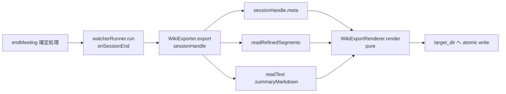

# 08. LLM Wiki raw export（WikiExporter）詳細設計

対象読者: Kikimi 実装者（Claude Code 自身）。実装前に必ず読むこと。

参照元: `kikimi.md` 11 章（LLM Wiki raw export）, 4 章（`on_session_end` の副作用は冪等）, 5 章
（`meta.json`/`refined.jsonl` データモデル）, 7 章（`refined_text` が空文字＝意図的削除）,
8.5 章（バックプレッシャ・整形失敗時の raw フォールバック）, `docs/design/07-session-store.md`
（`SessionHandle` の読み取り API）, `docs/design/03-refinement-batch.md` §7（`endMeeting()` 内の
`RefinementQueue.flush()`/`drain()` の非同期タイミング）。

**前提（実装済みの下地。本設計では作らない）**:

- `SessionHandle.readRefinedSegments()` / `readTranscriptSegments()`（`SessionHandle+Transcript.swift`）
- `SessionHandle.readText(.summaryMarkdown)`（`SessionHandle+GenericStorage.swift`）
- `SessionMeta`/`RecordingSegment`/`RefinedSegment`（`SessionModels.swift`）
- `FileManager.expandingTildePath(_:)`（`SessionStoreTypes.swift`）
- `MeetingWorkspaceViewModel.endMeeting()`（`MeetingWorkspaceViewModel+Recording.swift`）の
  `on_session_end` 確定処理（`watcherRunner.run(trigger: .onSessionEnd)` の直後に本機能を差し込む）

## 1. 目的とスコープ

会議終了（`on_session_end`）時に、セッションを LLM Wiki の `_raw/` ステージング領域へそのまま流し込める
1 ファイルの Markdown として自動 export する。kikimi.md 11 章の実装。

**スコープ内**: `export:` config セクション・Markdown レンダリング（frontmatter・サマリ埋め込み・
書き起こし整形）・ファイル名（日付 + タイトル slug）・書き出し（ディレクトリ作成 + atomic write）・
`endMeeting()` への配線・失敗時の非中断。

**スコープ外**:

| 関心事 | 担当 |
|---|---|
| サマリ本文の生成（`summary.md` をそのまま埋め込むだけ） | `04-summary-updater.md` |
| refined セグメントの整形自体（本機能は refined.jsonl を読むだけ） | `03-refinement-batch.md` |
| Wiki 側の取り込み（`_raw/` 以降の処理） | Kikimi のスコープ外（kikimi.md 11 章） |
| 手動 export ボタン・再 export UI | 将来検討（12 章 Open Questions） |

## 2. 全体フロー



- `endMeeting()` から `watcherRunner.run(trigger: .onSessionEnd)` の直後で 1 回呼ぶ（一時停止では
  呼ばない。kikimi.md 4 章「`on_session_end` は Paused では走らない」）
- 失敗しても `endMeeting()` の残り（`RefinementQueue` の flush/drain・`recordingButtonState = .ended`
  への遷移）を一切ブロックしない（3 章）
- 冪等: 同じセッションに対して複数回呼ばれても（`reopenRecording()` → 再 `endMeeting()`）、同じ
  ファイル名を同じ内容で上書きするだけ（kikimi.md 4 章「`on_session_end` の副作用は冪等（上書き）」）

## 3. コンポーネントと公開 API

`SummaryUpdater`/`RefinementQueue`/`WatcherRunner`と異なり、**セッション横断のライフサイクルを持たない
ステートレスな 1 回限りの動作**なので、actor でも session-scoped ファクトリでもなく、
`MeetingWorkspaceViewModel` に直接注入する 1 個の値として設計する（`voiceprintStore`/
`inputEnumerator` と同じ「依存そのものを注入する」形。詳細は §7）。

```swift
protocol WikiExporting: Sendable {
    /// `sessionHandle` の Wiki raw export Markdown ファイルをレンダリング・書き出す。
    /// `ExportConfig.enabled == false` なら何もしない。
    func export(sessionHandle: SessionHandle) async throws
}

struct WikiExporter: WikiExporting {
    var config: ExportConfig  // `defaultWikiExporter()` が構築時に AppConfig.shared.data.export の値を捕捉する
    func export(sessionHandle: SessionHandle) async throws
}
```

`WikiExporting: Sendable` を要求するため（他の DI protocol と同様）、`AppConfig`（`Sendable` に準拠しない
`ObservableObject` クラス）への生参照は保持できない。そのため `RefinementQueue`/`WatcherRunner` が
`AppConfig.shared.data.X` を**値として構築時に捕捉する**のと同じ流儀に倣い、`WikiExporter` も
`ExportConfig` を値として保持する（`AppConfig` への参照そのものではなく）。

pure なレンダリングロジックは別型 `WikiExportRenderer`（enum、static メソッドのみ）に分離する:

```swift
enum WikiExportRenderer {
    struct Input {
        var meta: SessionMeta
        var summaryMarkdown: String       // "" if summary.md doesn't exist yet
        var refinedSegments: [RefinedSegment]
    }

    static func render(_ input: Input) -> String
    static func fileName(for meta: SessionMeta) -> String
    static func slug(from title: String) -> String
    static func displayText(for segment: RefinedSegment) -> String?
    static func wallClockDate(startMs: Int, recordings: [RecordingSegment], fallback: Date) -> Date
    static func durationLabel(durationMs: Int) -> String
}
```

`WikiExporter.export(sessionHandle:)` は I/O のみを担う: `config.enabled` を確認 → `sessionHandle.meta`
/`readRefinedSegments()`/`readText(.summaryMarkdown)` を読む → `WikiExportRenderer.render(_:)`/
`fileName(for:)` を呼ぶ → `target_dir` をチルダ展開してディレクトリ作成 → atomic write。

## 4. レンダリング仕様

kikimi.md 11 章のサンプルと同じ形（frontmatter → `# title` → `## サマリ` → `## 書き起こし`）を
決定論的に生成する。

### 4.1 Frontmatter（export 側が正）

```yaml
---
date: 2026-07-01
duration: 45m
source: kikimi
session_id: 2026-07-01T14-30-00_a1b2c3d4
tags: [meeting, transcript]
---
```

- `date`: `meta.startedAt`（最初の録音開始。無ければ `meta.createdAt`）の日付部分、システムのローカル
  タイムゾーンで `yyyy-MM-dd`
- `duration`: `meta.durationMs` をまるめた分数 + `"m"`（四捨五入。`2_722_000ms` → `"45m"`）
- `source`: 固定値 `"kikimi"`
- `session_id`: `meta.id`
- `tags`: 固定値 `[meeting, transcript]`（現状 config 化しない）

`summary.md` 側は frontmatter を含まない前提（kikimi.md 5 章）なので二重にはならない。

### 4.2 タイトル・サマリ

- `# {meta.title}`（`meta.title` をそのまま、= "最終タイトル"。`title_proposal` は未採用のうちは
  反映しない — kikimi.md 8 章の提案バッジと同じ「ユーザーが採用するまで確定しない」原則に従う）
- `## サマリ` の直後に `summary.md` の内容をそのまま埋め込む（`summary.md` が存在しない/空の
  Draft-only セッションは空文字のまま埋め込む。空 export 自体は許容する）

### 4.3 書き起こし

1 セグメント = `**HH:MM:SS (mic|system)** text` の 1 行、行間 1 空行。

- **時刻は実時刻（wall-clock）**: `RefinedSegment.startMs`（録音アクティブ時間の累積タイムライン）を
  `meta.recordings[]` で実時刻に変換する。`startMs` が属する区間 = `startMsOffset <= startMs` を満たす
  最後の `RecordingSegment`（`recordings` は `startMsOffset` 昇順なので "offset <= startMs を満たす
  最後の要素" が正しい所有区間）。`wallClock = 区間.startedAt + (startMs - 区間.startMsOffset) / 1000` 秒。
  `recordings` が空（防御的フォールバックのみ。実運用では起こらない）なら `meta.startedAt ??
  meta.createdAt` を起点に `startMs` をそのまま秒に変換する
- **テキスト選択**（kikimi.md 11 章 / 7 章）:
  - `refinedText` が非 nil・非空文字 → そのまま使う
  - `refinedText == nil`（整形失敗）→ `rawText` + `" *(raw)*"` マーカーでフォールバック
    （トレーサビリティのため、整形版とraw版の区別が本文から分かるようにする）
  - `refinedText == ""`（意図的な削除。7 章）→ **行ごと除外**。フォールバックしない
- **並び順**: `startMs` 昇順（同値は `id` 昇順でタイブレーク）
- **入力データソース**: `refined.jsonl`（`readRefinedSegments()`）のみを使う。`transcript.jsonl` は
  読まない — §6 の失敗モードで詳述する既知の制約とトレードオフになっている

### 4.4 ファイル名

`{date}-{slug}.md`（`date` は §4.1 と同じ値・書式）。

`slug(from:)`（`meta.title` から生成）:

- 空白文字・パス上不安全な文字（`/ \ : * ? " < > |`）を `-` に置換
- それ以外の文字（日本語含む）はそのまま保持（macOS/APFS のファイル名は UTF-8 で日本語可）
- 連続する `-` を 1 つに畳み込み、先頭・末尾の `-` を除去
- 結果が空文字（タイトル未設定 or 不安全文字のみ）なら `"untitled"` にフォールバック
- 80 文字を超える場合は先頭 80 文字に切り詰める（過度に長いファイル名を防ぐ）

## 5. config

`AppConfig` に `export` セクションを追加する（`ExportConfig`, `Kikimi/Config/AppConfig.swift`）:

```yaml
export:
  enabled: true
  target_dir: ~/Documents/Kikimi/export/
```

- `ExportConfig: Codable, Equatable, Sendable` — `enabled`（既定 `true`）/ `targetDir`（既定
  `"~/Documents/Kikimi/export/"`)
- snake_case の明示 `CodingKeys`（`target_dir`）+ 部分指定を許容するカスタム `init(from:)`
  （`decodeIfPresent(...) ?? Self.default.xxx`。`DiarizationConfig`/`WatchersConfig` と同パターン）
- `KikimiConfigData` に `var export: ExportConfig` を追加し、`init(from:)` で
  `decodeIfPresent(ExportConfig.self, ...) ?? .default`（セクション欠落耐性）
- `targetDir` は `FileManager.expandingTildePath(_:)` で `WikiExporter` が消費時に展開する
  （`WatchersConfig.presetsDir` と同じ「保存時は生文字列、消費時に展開」方針）

## 6. 失敗モード

| 状況 | 挙動 |
|---|---|
| `export.enabled == false` | `WikiExporter.export(sessionHandle:)` は何もせず正常終了（throw しない） |
| `target_dir` の作成に失敗（権限・ディスクフル等） | throw。`endMeeting()` は `try?` 相当で受け止め、`.error` ログのみ出して確定処理を継続する |
| ファイル書き込みに失敗 | 同上 |
| `summary.md` が存在しない（Draft のまま一度も録音していない、または一度も summary 更新が走らなかった Ended） | 空文字として `## サマリ` セクションに埋め込む（欠落ではなく空扱い） |
| `readRefinedSegments()` が読み取りエラー | throw され `endMeeting()` 側でログのみ。書き起こしセクションが丸ごと欠けた export になり得る（次回 export（=同一セッションの再終了）で回復し得る） |
| **末尾の未整形分（`RefinementQueue.flush()`/`drain()` が `endMeeting()` 内で fire-and-forget のため、export 実行時点でまだ `refined.jsonl` に反映されていない seg）** | **既知の制約**: 本 export は `transcript.jsonl` にフォールバックしない（§4.3 の設計判断）。そのため `on_session_end` の一瞬後に drain が完了する最後の数セグメントが export から漏れる場合がある。再度セッションを終了させれば（`reopenRecording()` → `endMeeting()`、冪等に上書き）そのときまでに `refined.jsonl` へ追記された分を含めて再生成できる。将来 Ended セッションの手動再 export ボタン（12 章 Open Questions）で緩和し得る |
| タイトルが空文字 | `slug(from:)` が `"untitled"` にフォールバックするので、ファイル名は必ず一意な形になる（`# ` 見出し自体は空のまま出力される） |

## 7. `endMeeting()` への配線

`MeetingWorkspaceViewModel`:

- `wikiExporter: WikiExporting` を通常のプロパティとして注入する（`SummaryUpdaterFactory`等の
  session-scoped コレクター用ファクトリとは異なり、`WikiExporter` はセッションをまたぐ状態を持たない
  ため、`voiceprintStore`/`inputEnumerator` と同じ「依存そのものを注入する」形にする）
- 本番既定値は `MeetingWorkspaceViewModel.defaultWikiExporter()`（`+Factories.swift`）:
  `WikiExporter(config: AppConfig.shared.data.export)`。`defaultWatcherLibrary()` と同じ
  `nonisolated static func`（呼び出しごとに評価される、default 引数値としての関数呼び出し）
- `endMeeting()`（`+Recording.swift`）内、`watcherRunner.run(trigger: .onSessionEnd)` の直後に:

  ```swift
  do {
      try await wikiExporter.export(sessionHandle: sessionHandle)
  } catch {
      logger.error("Wiki export failed for session \(sessionId, ...): \(error)")
  }
  ```

- **テスト容易性**: 単体テストの `makeViewModel(...)` ヘルパは既定で `FakeWikiExporter`
  （記録専用の actor フェイク）を注入する。これをしないと、`wikiExporter` 未指定のテストが
  `MeetingWorkspaceViewModel.init` の既定引数経由で本番の `defaultWikiExporter()`
  （`AppConfig.shared.data.export`、= `ExportConfig.default` の固定パス）を拾ってしまい、
  `endMeeting()` を呼ぶ既存テスト全部が実際に `~/Documents/Kikimi/export/` へ
  書き込もうとしてしまう。この事故を防ぐため、`makeViewModel(...)` は `wikiExporter` を明示的に
  フェイクへ差し替える

## 8. テスト

- **`ExportConfig`（`KikimiTests/Config/AppConfigTests.swift`）**: 既定値・`export:` キー欠落時の
  フォールバック・部分指定（`enabled` のみ等）の残りフィールド既定値埋め・round-trip 永続化・
  保存 YAML の snake_case キー
- **`WikiExportRenderer`（pure, `KikimiTests/WikiExport/WikiExportRendererTests.swift`）**:
  - frontmatter の各フィールド（date/duration/source/session_id/tags）
  - `slug(from:)`: 日本語タイトル・記号混じり・空タイトルのフォールバック・80 文字切り詰め・
    連続ハイフンの畳み込み
  - `displayText(for:)`: refined 優先・`nil` → raw + マーカー・空文字 → 除外（`nil` を返す）
  - `wallClockDate(startMs:recordings:fallback:)`: 単一区間・複数区間・区間境界ちょうど・
    `recordings` 空のフォールバック
  - `durationLabel(durationMs:)`: 四捨五入
  - `render(_:)`: 複数セグメントを含む end-to-end のレンダリング結果が期待する Markdown と一致すること
- **`WikiExporter`（I/O, 同ファイルまたは隣接ファイル）**: `enabled == false` で何もしない・
  実際に一時ディレクトリへファイルが書かれること・ファイル名が `fileName(for:)` と一致すること
- **`MeetingWorkspaceViewModel.endMeeting()`**: `wikiExporter.export(sessionHandle:)` が 1 回呼ばれる
  こと・`wikiExporter` が throw しても `endMeeting()` が `.ended` まで到達すること（非中断の担保）

## 9. Open Questions（実戦・Phase 4 で判断）

- Ended セッションの手動再 export ボタン（末尾未整形分の取りこぼし §6 を後から埋め合わせる経路）
- `tags`/`source` の config 化（現状固定値）
- 大量セッションでの `target_dir` 直下のファイル数増加に対する整理（サブディレクトリ化等）
