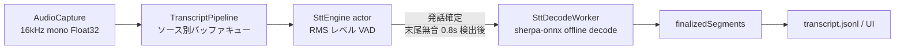
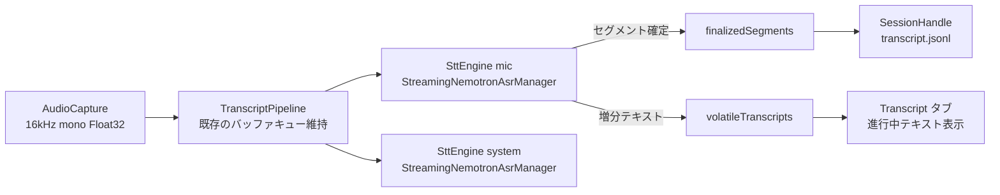

# 11. Streaming STT 詳細設計

対象読者: Kikimi 実装者（Claude Code 自身）。実装前に必ず読むこと。

参照元: `kikimi.md` 1章（Why: リアルタイム書き起こし）, 6章（録音・書き起こしパイプライン）, 12章（config.yaml）。
`SttEngine` 内部（streaming 認識・モデル選定・タイムスタンプ算出・confidence 算出）の正はこのドキュメント。
`TranscriptPipeline`（接着層）の詳細設計は `docs/design/02-stt-pipeline.md` を参照。

Kikimi の STT は streaming 方式（cache-aware streaming Conformer + RNN-T によるトークン単位の逐次確定）を
採用する。バッチ方式（VAD + オフラインデコード）の実装は持たない。モデルは **NVIDIA Nemotron 3.5 ASR
Streaming 0.6B** を採用し、実行基盤は **FluidAudio（Swift SDK + CoreML 版 Nemotron）**を用いる。

## 1. streaming 方式を採用する理由

バッチ方式（自前 VAD + オフライン認識器による発話単位のデコード）は、以下の構造的な遅延を持つ。



- 認識器: sherpa-onnx の **オフライン API**（既定 SenseVoice 多言語、代替 NeMo CTC Parakeet 日本語）
- VAD: RMS レベル閾値による自前実装（`SttEngine.processFeed`）。発話は
  「有音 ≥ 2.0秒（auto 言語検出時）かつ 末尾無音 ≥ 0.8秒」で初めて確定し、確定後にまとめて 1 回デコードされる
- **部分結果（ライブプレビュー）は存在しない**。`previewCleared` は「クリア合図」のみで、テキストを一切運ばない

**遅延の内訳（ユーザー体感）**:

| 要因 | 遅延 |
|---|---|
| 最小発話長（auto 検出時） | 2.0 秒（この長さに達するまで絶対に確定しない） |
| 末尾無音の検出待ち | 0.8 秒 |
| オフラインデコード自体 | 数百 ms〜数秒 |
| 長い発話（説明・独白） | 発話が終わるか 20 秒強制カットまで **1 文字も表示されない** |

会議での説明・提案は 20 秒を超える発話が普通にあり、その間 Transcript タブが無反応になる。
kikimi.md 1章が中核価値とする「リアルタイム書き起こし」に対して、この方式は構造的に不利。

## 2. モデルと実行基盤の選定

### 2.1 検討した選択肢

| 案 | 内容 | 評価 |
|---|---|---|
| A | Apple SpeechAnalyzer / SpeechTranscriber（macOS 26+） | 真の streaming・ja_JP 対応・統合コスト最小だが、日本語精度が非公表で検証不可・カスタム語彙不可。**リアルタイムモードで音声の拾い感度が悪いという実測報告**（Sansan Tech Blog 2026-02）があり、Kikimi の中核ユースケースに直撃するため見送り |
| B | sherpa-onnx 疑似ストリーミング（発話進行中の周期再デコード） | 既存資産は活きるが確定は依然 VAD 境界。バッチ実装を残さない方針に反するため見送り |
| C | sherpa-onnx online recognizer | **日本語の公式 streaming モデルが存在しない**（2026-07 時点）ため不成立。Nemotron 3.5 対応の feature request（k2-fsa/sherpa-onnx#3664）は open のまま |
| D | transcribe.cpp（ggml/GGUF, Metal）+ Nemotron 3.5 | 真の streaming・ユーザー実測で精度良好。ただし Handy 用に開発された若いライブラリで API 変動リスクが高い。**次点（フォールバック先）** |
| E | **FluidAudio（Swift SDK + CoreML/ANE）+ Nemotron 3.5** | 同一モデルを Swift Package として統合できる。**採用** |
| — | NeMo checkpoint の自前 ONNX 統合 | encoder cache 状態管理・TDT デコード・言語プロンプト条件付けの再実装が必要で、個人開発のスコープを超える。不採用 |

### 2.2 採用モデル: Nemotron 3.5 ASR Streaming 0.6B

- cache-aware streaming Conformer + RNN-T。トークンを chunk ごとに逐次確定し、句読点も自動付与する
- **日本語（ja-JP）は最上位の Transcription-ready ティア**。公表 CER は chunk 560ms 時 11.9%、1.12s 時 11.5%
  （自発日本語での Whisper large-v3 の CER 16〜18% と比べ、streaming モデルとして十分競争力がある。評価セットは異なる）
- 多言語 40 locale を単一チェックポイントで扱う（`prompt_index` による言語条件付け。auto 検出も可能）
- base モデルのライセンスは OpenMDW-1.1
- ユーザーが Handy（transcribe.cpp）経由で日本語実試用し、精度良好と確認済み（2026-07-02）

### 2.3 採用基盤: FluidAudio

[FluidInference/FluidAudio](https://github.com/FluidInference/FluidAudio)。Apache-2.0 の Swift SDK で、
CoreML 変換済み Nemotron 3.5 Streaming（`FluidInference/Nemotron-3.5-ASR-Streaming-Multilingual-0.6b-CoreML`,
多言語 vocab 13,087 トークンに ja 含む）を公式サポートする。

transcribe.cpp ではなくこちらを第一候補とする理由:

- **Swift Package そのもの**。現行の sherpa-onnx 統合（cmake prebuilt + `systemLibrary` + リンカフラグ 14 本 +
  mise ビルドタスク）が SPM 依存 1 行に置き換わる
- **Apple Neural Engine で推論**（`.cpuAndNeuralEngine`）。Zoom/Meet と同時に走る会議アプリとして、
  Metal（GPU）実行の transcribe.cpp より CPU/GPU 競合が小さい
- **macOS 14 対応**で deployment target を上げなくてよい（案A の唯一の構造的弱点を回避）
- 特定アプリの内部ライブラリではなく汎用 SDK であり、Handy のリリース都合で API が振り回される構造ではない
- 音声入力要件が **16kHz mono Float32** で、現行 `AudioCapture` の出力フォーマットと完全一致（変換層が不要）

FluidAudio も若いプロジェクトである点は transcribe.cpp と変わらないため、本質的なヘッジは
**`SttEngine` の背後にエンジンを完全隔離し、`feed()` → `SttFinalizedSegment` の契約だけを固定する**こと
（3.1節）。これが守られていれば FluidAudio → transcribe.cpp → 将来の sherpa-onnx 対応版のどれに
差し替えても `TranscriptPipeline` 以降は無傷で済む。

### 2.4 FluidAudio の既知 API（実装スパイクで要確認）

ドキュメントから判明している範囲:

- `StreamingNemotronAsrManager(chunkSize:configuration:)` — chunk 長の選択肢あり（`.ms160`/`.ms320`/`.ms1600`。
  CoreML モデル配布側のティアは 0.56s/1s/2s/4s 表記であり、**対応関係の確認が必要**）
- `loadModels(modelDir:)` — encoder/decoder/joint/vocab の CoreML モデルをロード。モデルは初回使用時に
  `~/.cache/fluidaudio/Models/` へ自動ダウンロードされる
- `transcribe(_ samples:) async throws -> String` — 16kHz mono Float32 サンプルを渡してテキストを得る
- `reset() async` — encoder cache と decoder state をリセット（次の発話単位へ）

**公開ドキュメントに書かれていない点**（3.11 の実装スパイク項目）: 増分テキストの返り方（累積全文か差分か）、
多言語版での言語指定 API（CLI には `--language` があるが Swift API 側は未確認）、タイムスタンプの有無、
ダウンロード進捗コールバック、複数インスタンス同時実行の可否。

## 3. 実装方式

### 3.1 全体構成

`TranscriptPipeline` の外形（`AudioCaptureDelegate` 準拠、ソース別バッファキュー、`SessionHandle` への
フォワーディング、`stopAndDrain()` 契約）は**そのまま維持**し、`SttEngine` の中身だけを差し替える。



- mic / system で `StreamingNemotronAsrManager` を 1 つずつ（計 2 つ）持つ。
  kikimi.md 6章「2ストリーム独立処理」の不変条件は変わらない
- RMS ベースの自前 VAD・発話区間検出・デコードキューは削除する。モデルが chunk ごとにトークンを
  逐次確定するため、「発話終了を待ってからデコード」という構造自体がなくなる

### 3.2 SttEngine の新しい形

```swift
actor SttEngine {
    nonisolated let source: AudioSourceKind

    init(source: AudioSourceKind, config: SttEngineConfig = SttEngineConfig())

    /// FluidAudio のモデル自動ダウンロード（初回のみ）→ loadModels → ready、まで行う。
    /// 進捗コールバックの形は現行 SttModelDownloadProgress を流用する。
    func prepare(downloadProgress: (@Sendable (SttModelDownloadProgress) -> Void)?) async throws

    /// AudioCapture からの PCM バッファ（16kHz mono Float32）を内部の chunk バッファに蓄積し、
    /// manager の chunk 長に達するたびに transcribe() を呼んで増分テキストを得る。
    func feed(buffer: AVAudioPCMBuffer, elapsedAtBufferStart: TimeInterval) async

    /// 残余バッファを（無音パディングの上）最後の chunk として flush し、
    /// 未確定セグメントを強制確定してから各 AsyncStream を finish する（現行の drain 契約と同じ意味論）。
    func stop() async

    /// 確定セグメント。型は現行と同一（startMs / endMs / text / confidence）。
    /// 注: design 33（会議二段デコード）で `confirmedWindows: AsyncStream<SttConfirmedWindow>`
    /// （確定 piece 群 + 再デコード窓サンプル）に置き換えられた。確定ロジック（3.3節の routes）は
    /// 不変で、two-pass ON のときのみ design 33 MT13 の「残余の消費」が加わる。
    nonisolated var finalizedSegments: AsyncStream<SttFinalizedSegment> { get }

    /// 進行中（未確定セグメント）のテキスト。毎回「現時点の未確定部分の全文」で置き換え。
    /// 空文字はクリア（＝直前の内容がセグメント確定した）を意味する。
    /// 現行の previewCleared: AsyncStream<Void> はこれに置き換えて廃止する。
    nonisolated var volatileTranscripts: AsyncStream<String> { get }

    nonisolated var failures: AsyncStream<SttEngineError> { get }
}
```

- `SttFinalizedSegment` は**型ごと維持**。`TranscriptPipeline` 以降
  （`SessionHandle.appendTranscriptSegment` → `transcript.jsonl` → 整形・サマリ）への影響をゼロにする
- CoreML 推論（`transcribe()` 呼び出し）は現行の `SttDecodeWorker` と同様、`SttEngine` actor 本体とは
  別 actor に隔離し、推論中も `feed()` の受付（chunk バッファへの蓄積）を塞がない

### 3.3 セグメント確定ロジック（本設計の新規部分）

cache-aware streaming はトークンを逐次確定して返すだけで、「セグメント」の概念を持たない。
`transcript.jsonl` の 1 行（= 1 セグメント）への区切りは Kikimi 側で行う。

- 増分テキストを未確定バッファに蓄積し、以下のいずれかでセグメント確定して `finalizedSegments` へ流す
  1. **文末句読点**（`。` `？` `！` `?` `!`）が現れた（Nemotron は句読点を自動付与するため主経路はこれ）
  2. 新しいテキスト増分が **`segmentIdleTimeout`（既定 2.0 秒）** 途絶えた（句読点が付かない発話の回収）
  3. 未確定バッファが **`maxSegmentCharacters`（既定 120 文字）** を超えた（暴走ガード）
  4. `stop()` が呼ばれた（残余の強制確定）
- 確定時に未確定バッファをクリアし、`volatileTranscripts` に空文字を流す

### 3.4 タイムスタンプ（start_ms / end_ms）

モデル/SDK がトークン単位タイムスタンプを返さない前提で設計する（返す場合はスパイクで確認の上そちらを優先）。

- `feed()` が受け取る `elapsedAtBufferStart` と蓄積サンプル数から「現在フィード済み位置の経過時刻」を常時追跡する
- `SttFinalizedSegment.startMs`/`endMs` は**この `SttEngine`/`TranscriptPipeline` インスタンス自身の
  `AudioCapture.start()` からの相対時刻**（＝録音区間内での経過時刻）である。セグメントの `startMs` = その
  セグメントの最初のテキスト増分を生んだ chunk の先頭時刻、`endMs` = 最後のテキスト増分を生んだ chunk の
  末尾時刻
- 精度は chunk 粒度（既定 1.6 秒なら ±1.6 秒）。現行方式もバッファ/VAD 粒度の近似だったため、
  用途（Transcript タブのジャンプ・整形の時系列マージ）に対して許容とする。chunk 長を短くすれば精度は上がる
  （トレードオフは CER。2.2 の CER 表を参照）
- **録音区間をまたぐ累積タイムライン（kikimi.md 5/6章、一時停止/再開機能）**: `TranscriptPipeline` は
  区間開始時に `startMsOffset`（`RecordingSegment.startMsOffset`。区間開始時点の累積 `duration_ms`）を
  受け取り、`transcript.jsonl` へ追記する直前に `startMs`/`endMs` へこの値を加算する
  （`TranscriptPipeline.appendOrLog(_:source:startMsOffset:to:logger:liveSegmentsContinuation:)`）。
  `SttEngine` 自身は常に「このインスタンスが開始してからの経過時刻」（＝区間先頭からの相対時刻、常に `0`
  始まり）だけを扱い、区間をまたぐオフセットの計算には一切関知しない。一時停止のたびに `SttEngine`/
  `TranscriptPipeline` は新しいインスタンスとして生成し直される（3.7章の cache-aware streaming リセットと
  同じ理由: 休憩ギャップを跨いだ内部状態の持ち越しを避けるため）ので、この「常に 0 始まり」の前提は常に成立する

### 3.5 confidence

streaming RNN-T の per-token confidence は SDK から取得できない前提で、**`confidence` は 1.0 固定**とする。
現行実装も SenseVoice が `ys_log_probs` を populate しない場合は 1.0 フォールバックであり、実質的な後退はない。
`transcript.jsonl` のスキーマ（kikimi.md 5章）は変更しない。

### 3.6 UI への volatile 表示

`06-ui-panels.md` の Transcript タブに、ソースごとの「進行中の 1 行」を追加する。

- リスト末尾に volatile テキストを薄色 + イタリックで表示（mic / system で最大 2 行）
- セグメント確定時に該当ソースの volatile 行をクリアし、確定行として通常描画に切り替える
- `MeetingWorkspaceViewModel` は `volatileTranscripts` を購読する（既存の `liveSegments` 購読と並列）

### 3.7 モデル準備

`SttModelStore`（カタログ・tar.bz2 ダウンロード・single-flight）は削除し、FluidAudio の自動ダウンロード
（`~/.cache/fluidaudio/Models/`）に委ねる。

- `prepare()` は FluidAudio のモデル取得 API を呼び、進捗を `downloadProgress` へ転送する
  （進捗コールバックが SDK に無い場合は `.downloading` 開始と `.installing` 完了の 2 点通知に簡略化する）
- mic/system の 2 エンジンが並行に `prepare()` した場合の合流挙動は SDK 側の実装に依存するため、
  スパイクで確認する（問題があれば Kikimi 側で `prepare()` を直列化する。現行 4.1章の
  DownloadCoordinator よりも粗い「先に mic、次に system」の直列で十分）

### 3.8 削除するもの / 残すもの

| 対象 | 扱い |
|---|---|
| `SttEngine.swift` の VAD・発話確定・デコードキュー | 削除（3.2 の形へ書き換え） |
| `SttDecodeWorker.swift` | CoreML 推論の隔離 actor として改造（recognizer → StreamingNemotronAsrManager） |
| `SherpaOnnxSupport.swift` / `SherpaOnnxOfflineRecognitionResult+Confidence.swift` | 削除 |
| `SttModelStore.swift` | 削除（3.7 の FluidAudio 呼び出しへ置換） |
| `SttEngine+PureHelpers.swift` | RMS/dedup/anchor 探索は削除。3.3/3.4 の純粋ロジック（セグメント確定判定・時刻追跡）を同じ流儀で新設 |
| `CSherpaOnnx` systemLibrary / Package.swift のリンカフラグ / prebuilt cmake / mise の sherpa-onnx ビルド手順 | 削除し、`FluidAudio` の SPM 依存 1 行に置換 |
| `~/.local/state/kikimi/models/sherpa-onnx/` | 新規ダウンロードは行わない。既存ディレクトリは残置（ユーザーに手動削除を促す） |
| `TranscriptPipeline.swift`（バッファキュー・フォワーディング・stopAndDrain） | 維持（`previewCleared` 購読箇所のみ `volatileTranscripts` へ差し替え） |
| `SessionHandle` 以降のデータモデル・整形・サマリ設計 | 無変更 |
| deployment target | **14.2 のまま維持**（FluidAudio は macOS 14+。Swift 6.0+ 要件は既に満たしている） |

### 3.9 config.yaml

```yaml
stt:
  engine: nemotron-streaming        # 既定値。将来のエンジン差し替え口として名前を残す
  language: ja-JP                   # Nemotron の言語条件付け。auto も指定可
  chunk_ms: 2240                    # streaming chunk 長。560/1120/2240/4480 のいずれか。既定 2240（2.2/3.11 参照）
  segment_idle_timeout: 2.0         # セグメント確定ロジック（3.3 route 2）の秒数。既定 2.0
  max_segment_characters: 120       # セグメント確定ロジック（3.3 route 3）の文字数上限。既定 120
```

- `stt.model` は廃止（読み込み時に旧キーが残っていたら `.warning` ログの上で無視）
- 未知の値は `.warning` ログの上で既定値にフォールバック（既存パターンを踏襲）
- `segment_idle_timeout`/`max_segment_characters` は `SttEngineConfig`（`Kikimi/Stt/SttTypes.swift`）の同名
  フィールドへそのまま流れ、3.3 節のセグメント確定ロジックの route 2/3 の閾値を調整する。不正値
  （`segment_idle_timeout <= 0` または `max_segment_characters < 1`）は `.warning` ログの上で既定値にフォールバック

### 3.10 失敗モード

| # | 状況 | 挙動 | ログ |
|---|---|---|---|
| 1 | モデル自動ダウンロード失敗（ネットワーク不通） | `prepare()` が throw。録音を開始できない（現行 #1 と同じ） | `.error` |
| 2 | CoreML モデルのロード失敗（アーキテクチャ非対応等） | `prepare()` で throw し、エラーダイアログで案内 | `.error` |
| 3 | `transcribe()` が throw（推論エラー） | 当該 chunk をスキップして次へ。`failures` へ yield。**録音（WAV 保存）は継続**（8.5章「録音は絶対に止めない」） | `.error` |
| 4 | 増分テキストが長時間空（完全無音の会議） | volatile も final も出ない。`transcript.jsonl` 空のまま正常終了（現行 #9 と同じ） | — |
| 5 | フォーマット不一致バッファ（Float32/16kHz/mono 以外） | 当該バッファを破棄し `failures` へ yield（現行 #7 と同じ） | `.error` |
| 6 | 推論が chunk 実時間より遅い（RTF > 1、旧 Mac 等） | chunk バッファに滞留し遅延が伸びるがデータは失わない（8.5章 Best-effort catch-up と同じ思想）。キュー長は UI のインジケータに出す | `.warning`（初回のみ） |

### 3.11 実装スパイク（実装フェーズの最初に行う検証）

設計の未確定点を、本実装前に最小コードで潰す。

1. **増分テキストの返り方**: `transcribe()` が累積全文を返すのか chunk の差分を返すのか。差分計算の要否
2. **多言語版の言語指定**: Swift API での `ja-JP` 指定方法（CLI の `--language` 相当）と、
   multilingual バンドル（full vocab）のロード方法
3. **2 インスタンス同時実行**: mic/system 同時ストリーミング時の ANE 競合・レイテンシ・メモリ
4. **chunk 長ティアの対応関係**: API の `.ms160/.ms320/.ms1600` と CoreML 配布側 0.56s/1s/2s/4s の整合
5. **タイムスタンプ**: SDK がトークン/チャンク時刻を返すなら 3.4 の自前追跡より優先して採用
6. **CoreML 版モデルのライセンス**: 配布ページに「NVIDIA Software and Model Evaluation License 由来」の
   記載があり base の OpenMDW-1.1 と食い違う。個人利用の範囲で問題ないことを確認
7. **`reset()` の運用**: セグメント確定ごとに reset すべきか（精度と文脈維持のトレードオフ）、
   連続フィードで cache を維持すべきか

スパイクで FluidAudio に致命的な問題（増分が取れない・2 インスタンス不可・日本語指定不可など）が
見つかった場合は、**同一モデルのまま transcribe.cpp（案D）へ切り替える**。その場合も 3.1〜3.6 の設計
（SttEngine 契約・セグメント確定・時刻追跡）はそのまま適用でき、変わるのは推論呼び出し層と
ビルド統合（prebuilt 方式の踏襲）のみ。

### 3.12 テスト

- **レイヤ1（swift-testing）**: VAD テストは対象ごと削除。新設の純粋ロジックを検証する
  - セグメント確定判定（3.3）: 句読点・idle timeout・最大文字数・stop 強制確定の 4 経路
  - 時刻追跡（3.4）: 固定の `elapsedAtBufferStart` 系列に対する startMs/endMs の算出
  - 増分差分計算（スパイク結果次第）
  - `StreamingNemotronAsrManager` はプロトコルで抽象化し、フェイク注入で `SttEngine` の状態遷移を検証する
- **レイヤ2（kikimi-verify）**: `KIKIMI_TEST_INPUT` のダミー音源フィードはそのまま機能する（feed 経路は不変）。
  検証項目に「録音中に volatile テキストが表示されること」を追加する。
  モデル出力の文字列一致は検証しない（非空・時刻の単調性・JSONL スキーマ適合のみ）
- モデル未ダウンロード環境での初回 `prepare()` はネットワークダウンロードを伴う（0.6B、CoreML バンドル）。
  kikimi-verify に「初回のみダウンロード待ちが発生する」旨を明記する

## 4. kikimi.md からの逸脱（deviations_from_kikimi_md）

本設計の確定時に kikimi.md 側も更新する。

- 6章「sherpa-onnx によるオンデバイス STT」「chirami と同一の日本語 streaming zipformer」→
  **FluidAudio（CoreML）+ Nemotron 3.5 ASR Streaming 0.6B（ja-JP）**。
  「STT モデル」節のダウンロード記述を FluidAudio の自動ダウンロード（`~/.cache/fluidaudio/Models/`）に書き換え
- 4章 `models/sherpa-onnx/` ディレクトリ → 廃止（残置ポリシーのみ記載）
- 6章 全体フロー図の `[Ring Buffer] → [sherpa-onnx#N]` → `[chunk buffer] → [Nemotron streaming #N]` に更新。
  「2ストリーム独立処理」「録音は絶対に止めない」は不変条件として維持
- 12章 `stt.model` → `stt.engine` / `stt.language` / `stt.chunk_ms`（3.9 参照）
- 13章 依存ライブラリ表: sherpa-onnx (SPM) を削除し FluidAudio (SPM) を追加
- 3章 プラットフォーム: **macOS 14.2+ のまま変更なし**（案A と異なり要件引き上げは不要）

## 5. Open Questions（スパイク後・実戦テストで確認する事項）

- **日英 code-switching**: 日本語会議中の英語固有名詞・製品名の認識品質。multilingual vocab + ja 条件付けで
  どこまで拾えるかは Phase 4 実戦で確認（劣化が大きければ context.md + 整形での補正に期待を移す）
- **セグメント粒度の体感**: 3.3 の確定ルール（句読点 + idle 2.0s + 120 文字）が Transcript タブ・整形バッチ・
  サマリの粒度として適切か。実戦で `segmentIdleTimeout` / `maxSegmentCharacters` をチューニング
- **長時間安定性**: cache-aware streaming を 1 時間以上連続フィードした際の cache/メモリの挙動と精度ドリフト。
  問題があればセグメント確定時 `reset()` 運用（3.11 #7）に切り替える
- **FluidAudio の追従性**: Nemotron の後継モデルや SDK 更新への追従。SttEngine 契約（3.1）による隔離が
  ヘッジであることを維持する（エンジン差し替えが `Stt/` 配下で完結すること）
- **旧セッションとの互換**: 既存セッションの `transcript.jsonl` はスキーマ不変のため再生成不要。互換確認のみ
