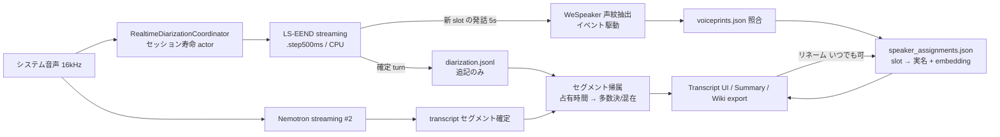

# 13. 話者分離（Speaker Diarization）詳細設計

対象読者: Kikimi 実装者（Claude Code 自身）。実装前に必ず読むこと。

参照元: `kikimi.md` 5 章（データモデル）, 6 章（録音・書き起こしパイプライン）, 8 章（サマリ）, 11 章（Wiki export）,
`docs/design/11-streaming-stt.md`（FluidAudio 統合）, `docs/design/07-session-store.md`（ファイル I/O）,
`docs/design/10-audio-input-selection.md`（区間ごとの入力選択）。

本設計の要点は以下のとおり。

- **リアルタイム一本の単層構成を採用する**（オフライン分離との二層構成は採用しない）。理由:
  (a) 会議中に見て・直したものがそのまま成果物になる（WYSIWYG）、(b) ユーザーの手動調整が
  後段処理で無効化される問題が構造ごと消える、(c) 書き起こし本体と同じ「リアルタイムに一度だけ
  確定し、追記する」アーキテクチャに揃う。精度の上積み（オフライン DER 13.9〜15% vs リアルタイム
  26%）は捨てるが、WAV を全保持しているため、将来必要ならオフライン再分離を明示的な救済操作として
  追加する退路は残る（14 章）
- **diarizer インスタンスは区間境界（Paused / Ended を問わず）で毎回再作成する**。
  `LSEENDDiarizer.finalizeSession()` には finalize 後に同一世代へ安全に戻れる resume API が
  存在しないため、5.1 節の「区間ごとに意図的に再作成する運用」を全区間境界の標準動作として
  採用している
- **variant は callhome を採用する**: 実際の Zoom 圧縮日本語会議録音に対する
  `fluidaudiocli lseend` の比較で、dihard3 はほぼ全発話を 1 話者に併合（376s vs 1.1s）、ami も
  同様（424s vs 16s）だったのに対し、callhome は 2 話者を明確に分離した（365s vs 68s。
  電話会話ドメインがコーデック圧縮されたオンライン会議音声に最も近いため）。config
  `diarization.variant` で切替可能にし、既定を `callhome` にしている。なお同一音声で
  Sortformer は 4 話者を検出（372s/37s/6s/1.8s）しており、4 話者以下の会議では Sortformer
  backend の追加が将来の改善候補（14 章）。
  【2026-08-01 追記】実会議 WAV 3 本でのオフライン再計測（design 21 §9）で callhome 採用を
  再確認した: ami / dihard2 は確定 2 話者の会議を 1 話者に併合し、onset/offset を 0.4 / 0.3 に
  下げても検出話者数は増えず、Sortformer はトラック数こそ増やすがユーザー確定済みの 2 話者を
  同一トラックに併合した（話者数カウントだけでは優劣を判定できない教訓を含め design 21 §9 参照）
- **混在セグメントのトークンタイムスタンプ分割を R3 として計画している**: 「Speaker 1 +
  Speaker 2」の混在表示（5.3 節規則 2）を、発話境界で複数セグメントに分割した表示・export に
  進化させる（5.4 節「順次交代」ケース。同時発話は対象外のまま）。着手は **R2 完了後**（表示解決・
  Wiki export の最終形と `segment_overrides` との優先順位が R2 で確定してから載せるため）。
  前提のスパイク 3 のみ R2 と独立に先行実施してよい。なお FluidAudio
  `StreamingNemotronAsrManager` が `getTokenTimings()` / `finishWithTokenTimings()`
  （`TokenTiming { token, startTime, endTime, confidence }`）を公開していることはソース確認済みで、
  未検証なのは実会議音声での時刻精度のみ（12 章）
- **複数声紋方式（multi-template enrollment）を Phase 4 実測後の対応として計画している**:
  単一 embedding + EMA は声紋分布が単峰であることを暗黙に仮定しており、同一人物がデバイス・媒体・
  声の調子でクラスタを分けると EMA が中間点に収束してどの環境ともマッチしなくなり得る
  （モード崩壊）。1 speaker に複数プリントを持たせて解消する。設計要点は 14 章、go/no-go の
  実測材料（auto マッチ失敗時の距離ログ）は 15 章参照
- **セグメント単位の話者上書き（「この発言だけ変更」）を用意する**: リネームを「すべての発言に
  適用」（slot 全体）と「この発言だけ」（1 セグメント）の 2 択にしている。後者は
  `speaker_assignments.json` の `segment_overrides` に保存され、slot が無い行（Speaker ?）にも
  名前を付けられる。この人手ラベルは将来のセグメント単位声紋分類（14 章）の教師データを兼ねる
- **声紋の更新はユーザーの明示的なフィードバック（既存話者ピッカーでの割り当て・訂正、または
  セグメント override）があった場合のみ行う**: `.auto`（自動判定のみ・ユーザー未訂正）の slot は
  Ended を迎えても声紋更新の対象に**含めない**。訂正されなかったことを「正しかった」とはみなさず、
  ユーザーが明示的に確認・訂正した signal だけを学習に使う。`.user` slot 由来の更新には
  `VoiceprintStore.userCorrectionAlpha`（既定 0.3）を用いる（4.4 節・8 章）

## 1. 背景 — 現状は物理ソース分離のみ

現行の `speaker` フィールド（`TranscriptSegment.speaker: AudioSourceKind`）は mic / system の
物理ソース由来で、**システム音声内の複数の会議参加者は全員 "system" に潰れる**。
リモート参加者が誰の発言かを Transcript・サマリ・Wiki export で区別できるようにするのが本設計の目的。

採用済みの FluidAudio が ASR とは独立に diarization モジュール（pyannote / LS-EEND / Sortformer,
CoreML）を公式サポートしており、**依存の追加なし**（同一 SPM package）で実現できる。

## 2. モデル選定

### 2.1 検討した選択肢

| 案 | 内容 | DER | 話者上限 | 評価 |
|---|---|---|---|---|
| A | **LS-EEND streaming（callhome variant）** | 26% 前後 | 10（callhome は 7） | レイテンシ床 100〜500ms・streaming 一本で完結。内部 8kHz（自動リサンプル）で忠実度は落ちる。**採用** |
| B | Sortformer streaming（balanced v2.1） | 20.6% | **4（ハード制限。5 人以上は取りこぼし/併合）** | レイテンシ 1.0〜1.5s・16kHz native・enrollment API ありと精度面では最良候補だったが、リモート 4 人超の会議が実際にあるため**不採用** |
| C | オフライン pipeline（pyannote powerset + VBx）を終了時に実行 | 13.9〜15% | なし | 最高精度だが、リアルタイム結果・手動調整との整合性管理が設計を支配的に複雑化する。**不採用**（将来の救済オプションとしてのみ検討。14 章） |
| D | 音源分離（speech separation）で overlap を復元 | — | — | 別分野のモデルが必要。**スコープ外**（5.4 節） |

- DER（Diarization Error Rate）= 全発話時間のうち話者帰属を誤った時間の割合。小さいほど良い。
  26% は「1 時間の会議で約 15 分ぶんの帰属が誤る」水準であり、**誤りは前提**。リネーム・訂正 UI
  （6.1 節）で人間が安く直せること、直した結果が最終成果物にそのまま生きることを設計の柱にする
- LS-EEND の弱点「enrollment（声紋登録）の信頼性が低い」は、実名化を diarizer 自身にやらせず
  WeSpeaker 声紋 DB の別レイヤ（4.3 節）で行う本構成では致命傷にならない。
  セッション内でスロット ID が一貫していれば足りる

### 2.2 実名化: WeSpeaker 声紋 embedding

- 話者の声を 256 次元ベクトル（voice embedding）に変換し、既知話者と cosine 距離で照合する
- FluidAudio の `SpeakerManager` 相当の仕組み。`Speaker` は Codable なので独自永続化が可能
- 照合閾値は既定 0.65（クリーン音声）。Zoom/Meet のコーデック圧縮で声紋がブレるため
  config で調整可能にし、誤マッチは UI で訂正 → 割り当てを付け替えられる導線を必須とする（4.3 節・6.1 節）
- 閾値に加えて**マージン判定**（最近傍と、異なる名前の次点話者との距離差が
  `speaker_match_margin` 未満なら曖昧として棄却）を行う。全判定は距離込みで info ログされる
  （詳細は `docs/design/20-voiceprint-misassignment-mitigation.md` 3 章）
- 本設計は「cosine **距離**（小さいほど近い）」前提で閾値の向きを記述している。FluidAudio の API が
  類似度（大きいほど近い）を返す場合は比較方向が全て逆転するため、スパイクで確認する（10 章）

## 3. 全体構成



- **分離は録音中に一度だけ行い、確定した turn を `diarization.jsonl` に追記する**。transcript.jsonl と
  同じ流儀（追記のみ・rewrite しない・クラッシュしても追記済み分は残る）。後段でこれを置き換える
  処理は存在しない
- **slot はセッション内で一度採番されたら不変**。リネーム・声紋照合の結果は slot をキーに
  `speaker_assignments.json` に保存され、無効化されることがない
- Summary・Wiki export・Transcript 表示はすべてこの単一の結果を参照する（WYSIWYG）

## 4. データモデル

### 4.1 不変条件の維持と参照解決

`transcript.jsonl` は**一切変更しない**（追記のみ・rewrite 禁止・スキーマ据え置き）。
話者情報は sidecar ファイルに分離し、表示時に参照解決する:

```
transcript.jsonl のセグメント（speaker: "system"）
  └─ diarization.jsonl の turn と時間重複 → slot 占有リスト（spk_1: 80%, spk_2: 20%）
       └─ speaker_assignments.json で slot → 表示名解決（spk_1 → "田中さん"）
```

この 3 層参照により、声紋照合の完了・ユーザーのリネームの瞬間に**過去セグメントの表示も一括で
切り替わる**（データ書き換えなし・再描画のみ）。

ファイル I/O は 07-session-store の規約に従う:

- 2 ファイルとも `SessionFile` enum にケースを追加し `SessionHandle` 経由で読み書きする
- `diarization.jsonl` は**追記専用**。汎用の上書きプリミティブ（`GenericAccessibleFile`）には
  含めず、`appendTranscriptSegment` と同型の専用 append API を `SessionHandle` に追加する
  （末尾行破損の読み飛ばし耐性も transcript と同じ扱い）
- `speaker_assignments.json` は auto（coordinator actor）と user（UI リネーム）の書き込みが
  並行し得るため、素朴な read-modify-write を禁止し `updateMeta` と同型の
  mutate クロージャ形式（`updateSpeakerAssignments(_ mutate:)`）で提供する
- グローバル声紋 DB は SessionStore 管轄外なので、専用の atomic store（actor・単一 writer）を
  新設する。複数セッション・複数ウィンドウからの書き込みは必ずこの actor を経由する

### 4.2 `sessions/<id>/diarization.jsonl`（追記のみ）

1 行 = 1 turn（話者の連続発話区間）。LS-EEND が確定を返すたびに追記する。

```json
{"slot": "spk_1", "start_ms": 0, "end_ms": 12300}
{"slot": "spk_2", "start_ms": 11800, "end_ms": 15400}
```

- 時間軸は transcript と同じ**録音アクティブ時間の累積タイムライン**（`start_ms` 基準）。
  diarizer インスタンスの世代に関わらず、5.1 節の基点オフセット規則でこのタイムラインに揃えて
  記録する
- turn は重複し得る（overlap 検出時は複数 slot の区間が重なる）。追記順は `start_ms` 昇順を
  保証しない（slot ごとに確定タイミングが異なる）。読み手は必ず時刻でソートする
- `slot` はセッション内 ID（`spk_1` 起点の連番）。採番規則は 5.1 節。
  **一度使われた slot 番号は再利用しない**

### 4.3 `sessions/<id>/speaker_assignments.json`（slot → 実名マッピング・上書き）

```json
{
  "assignments": {
    "spk_1": {
      "global_speaker_id": "b3f1...",
      "display_name": "田中さん",
      "assigned_by": "auto",
      "embedding": [0.012, -0.34]
    },
    "spk_2": { "global_speaker_id": null, "display_name": null, "assigned_by": null, "embedding": null }
  }
}
```

- `assigned_by`: `"auto"`（声紋照合でマッチ）/ `"user"`（UI で手動割り当て・訂正）。
  **user 割り当ては auto で上書きしない**
- `display_name == null` の slot は UI で「Speaker 2」と表示
- `embedding`: coordinator が声紋抽出に成功した時点で保存する（**メモリ保持契約にしない**。
  Paused でウィンドウを閉じて別プロセス起動後に会議終了しても、Ended 時の移動平均更新・
  リネーム時の新規登録がファイルから復元できる）。未抽出（発話が `min_enroll_speech_ms` 未満・抽出失敗）は `null`
- slot は不変（4.2 節）なので、このファイルの割り当てが後から無効化されることはない。
  リネームはいつでも可能（Recording 中を含む。6.1 節）
- 同一人物が複数 slot に分裂した場合（diarizer 再作成後の続番採番。5.1 節）は、両方の slot に
  同じ `global_speaker_id` / `display_name` を割り当てることで表示上は 1 人に見える
  （slot の統合はしない。追記済み diarization.jsonl と矛盾しないため）
- **`segment_overrides`**（トップレベルの追加キー。キーはセグメント ID）: 「この発言だけ変更」の
  保存先。`{"segment_overrides": {"seg_00042": {"display_name": "佐藤さん", "global_speaker_id": "b3f1..."}}}`
  の形（`global_speaker_id` は任意。既知話者ピッカー選択・名前正規化・Ended 時 enrollment の
  write-back でセットされる）。表示解決では slot 由来ラベルより優先され、稼働範囲の前提条件よりも
  優先される（ユーザーの明示指定が最強）。キー削除で slot 由来ラベルに戻る。常に user 起源。
  キー欠落の旧ファイルは「上書きなし」として読む（防御的 decode）。
  **Ended 時の声紋学習（enrollment フィードバック）の教師データとして実際に使われる**
  （詳細は `docs/design/20-voiceprint-misassignment-mitigation.md` 5 章）

### 4.4 `~/.local/state/kikimi/voiceprints.json`（グローバル声紋 DB）

```json
{
  "speakers": [
    {
      "id": "b3f1...",
      "name": "田中さん",
      "embedding": [0.012, -0.34],
      "created_at": "2026-07-01T10:00:00Z",
      "updated_at": "2026-07-03T15:20:11Z",
      "last_matched_session_id": "2026-07-03T14-00-00_a1b2c3d4"
    }
  ]
}
```

- セッション横断の「この声 = この人」マッピング。1 人あたり約 50KB（embedding 込み）。
  セッション内の `speaker_assignments.json` と役割が紛れないよう `voiceprints.json` と命名する
- **登録経路はユーザーの明示操作のみ**。自動では増やさない（誤登録の増殖を防ぐ）。
  リネーム操作に加え、**参加者ヒントの suggest box からの空 embedding 登録**
  （`docs/design/22-participant-hints.md`。名前だけ先に登録し、最初のユーザー割り当て後の
  Ended 時学習で声紋が入る）もこの原則の内側にある。
  リネームには slot 単位（「すべての発言に適用」）に加え、**per-segment の「この発言だけ」
  （segment override）経由の登録**も含む — 新規名の override は Ended 時に対象セグメント音声から
  声紋を抽出して登録される（design 20 の 5 章。「ユーザー操作起点のみ」の原則は維持）。
  なおフリーテキスト名が既知話者名と完全一致（1 人）した場合は新規登録ではなく既存話者への
  割り当てに正規化される（design 20 の 4 章）:
  - リネームで新しい名前を入力 → 当該 slot の `embedding`（4.3 節）で新規 speaker を登録。
    **slot の embedding が `null` の場合はセッション内の `display_name` 保存のみ行い、
    グローバル登録はスキップする**（次回セッションでの自動実名化は効かないが、表示は正しい）
  - リネームで既存話者を選択（訂正を含む）→ その時点では割り当てのみ変更し、embedding は
    更新しない。ただし **Ended 時の移動平均更新（下記）の対象には含める**。ユーザーの明示的な
    選択・訂正は auto マッチより信頼度の高いラベル付きサンプルであり、slot に保存済みの
    embedding（4.3 節）を後から訂正先 speaker の学習に活かす

「slot の embedding が `null` の場合はグローバル登録をスキップする」carve-out に対しては、
**オンデマンド WAV フォールバック**を用意している。`embedding` が `null` なのは (a) R2 実装前に
録音されたセッション、または (b) 録音中のライブ抽出（5 章「声紋照合（イベント駆動）」）が一度も
`min_enroll_speech_ms` の閾値に達しなかった slot のいずれかだが、セッションフォルダには
`diarization.jsonl`（slot ごとの turn 区間）と `audio/system_NNN.wav`（区間ごとの生音声）が完全に
残っているため、リネーム時にオンデマンドで声紋を抽出し直せる。

- `.newName` リネームで対象 slot の `embedding` が `null` のとき、表示名は（従来どおり）
  即座にセッションローカル保存した上で、**fire-and-forget** の背景タスクとして以下を試みる
  （表示名の保存・UI・録音は一切ブロックしない）:
  1. `VoiceprintEnrollmentSampleResolver.resolveSampleSlices(...)`（pure function,
     `Kikimi/Diarization/VoiceprintEnrollmentSampleResolver.swift`）で対象 slot の
     `diarization.jsonl` turn を `meta.json` の `recordings[]`（`index`/`start_ms_offset`）を
     使って各録音区間の `system_NNN.wav` 内サンプル範囲に変換する。turn が区間境界をまたぐ場合は
     区間ごとに分割し、時系列順に累計 `VoiceprintExtractor.maxSampleCount`
     （FluidAudio の抽出窓固定値、10 秒 @16kHz = 160,000 samples）で打ち切る。累積発話が
     `min_enroll_speech_ms`（既定 10000ms。7 章の 2026-08-01 追記）未満なら抽出自体を行わない（従来どおり local-only）
  2. `AVAudioFileSampleReader`（`Kikimi/Diarization/SessionAudioSampleReader.swift`）で該当区間の
     WAV から実サンプルを読み出す。`AVAudioFile` を再利用（`TestFileAudioSource` と同じ経路）
     することで独自の `fmt `/`data` チャンクパーサや Int16→Float32 正規化を新設せずに済ませて
     いる。サンプル範囲がファイル実長を超える場合はこの層でクランプする
  3. 抽出できたサンプルを `VoiceprintExtractor.extractEmbedding(from:)` に渡して embedding を得る
  4. 成功したら slot の `embedding` を `speaker_assignments.json` に永続化し、
     `VoiceprintStore.registerSpeaker` で新規グローバル登録、slot の `global_speaker_id` を
     書き戻す（`assigned_by: "user"` のまま）。抽出中に他経路（ライブ抽出・別のリネーム）が
     同じ slot を先に解決していた場合は上書きしない
- オーケストレーションは `Kikimi/Diarization/VoiceprintWavFallbackExtractor.swift`
  （`VoiceprintWavFallbackExtracting` プロトコル経由でテスト注入可能）が担い、
  `MeetingWorkspaceViewModel+Diarization.swift` の
  `scheduleVoiceprintWavFallbackEnrollment(slot:displayName:)` から起動される
- 初回抽出時は WeSpeaker モデルのダウンロードが走り得る（数十秒）が、上記の通り
  fire-and-forget のため UI・録音はブロックされない
- 失敗（turn 不足・WAV 欠損・抽出失敗）はすべて best-effort（warning/info ログのみ、表示名は
  維持）。既存話者選択（`.existingSpeaker`）経路はこのフォールバックの対象外（embedding を
  一切触らない、4.4 節の記述どおり）

- **embedding の移動平均更新は Ended 時に 1 回だけ**行う。**ユーザーの明示的なフィードバック
  （既知話者ピッカーでの割り当て・訂正、またはセグメント override）があった speaker だけが対象**で、
  speaker ごとの代表サンプルの優先順位は **`.user` slot > segment override 集約**。`assigned_by:
  "auto"` のまま Ended を迎えた（＝ユーザーが一度も訂正・確認していない）割り当ては、**声紋更新の
  候補に一切含めない**（「訂正されなかった＝正しい」という推定は採用しない。かつての「不信任
  （disputed）でない `.auto` slot へのフォールバック」は廃止した。design 20 の 5.4 節・6 章参照）:
  - `assigned_by: "user"`（ユーザーが既知話者ピッカーで明示的に割り当て・訂正した）→
    **α = 0.3**（`VoiceprintStore.userCorrectionAlpha`）
  - `.user` slot も override もない speaker は、この会議での声紋更新を単純にスキップする
    （info ログのみ、エラーではない）
  - 同一 speaker（同じ `global_speaker_id`）に複数 slot が該当する場合（slot 分裂・4.3 節）は、
    `embedding` を持つ `.user` slot の中から**1 speaker あたり 1 回だけ**適用する。同順位内は
    slot ID 昇順で決定的に選ぶ
  - slot の embedding は `speaker_assignments.json` から読む。候補 slot がいずれも
    `embedding: null` なら warning ログを出してその speaker をスキップする
  - `last_matched_session_id` で同一セッションからの重複適用を防ぐ（従来どおり）
  - ユーザーが誤って別人を選んでしまった場合でも α = 0.3 が上限であり、以降の正しいセッションの
    更新で自己回復する（EMA の性質）。auto のみの誤マッチはそもそも声紋を一切書き換えないため、
    ここでの汚染経路は発生しない

#### 声紋リセット（誤マッピング汚染からの修復経路）

EMA の自己回復は汚染が軽いときの話で、誤った割り当てが繰り返されて embedding が別人の声に
寄ってしまうと、誤マッチ → さらなる汚染の悪循環に入り得る。従来の唯一の修復手段だった
「話者の削除」は過去セッションの `global_speaker_id` 参照を宙に浮かせ、名前も失う。そこで
**embedding だけを捨てて話者（id・名前・過去参照）は残す「声紋リセット」**を用意する。

- **操作**: Settings 話者タブの行アクション「声紋をリセット」。確認ダイアログなし
  （削除ですら確認なしの「最小限」方針と整合。削除より破壊度が低い）
- **効果**: `embedding: []`（空配列）+ `last_matched_session_id: null` + `updated_at` 更新。
  `VoiceprintStore.resetSpeakerEmbedding(id:)` が担う（未知 id は `renameSpeaker` と同じ no-op）
- **リセット後の意味論** — 空 embedding は既存の「比較不能」規約にそのまま乗る:
  - `cosineDistance` が `.infinity` を返す規約により、`findBestMatch` は**絶対にマッチしない**
    （= 自動実名化の対象から外れる。コード変更不要で成立する不変条件）
  - リネームの既知話者ピッカー（`KnownSpeakerSort`）では距離 `.infinity` として**末尾に並ぶが
    選択は可能**（「選択肢には出るが自動では選ばれない」）
  - 話者マップ（design 19）には表示されない（比較する声がないため）。**意図的な状態なので
    warning ログは出さない**（19 §7 の除外理由 `empty` は正常系として扱う）
  - UI の行には「声紋未登録 — 次に手動で割り当てると再学習されます」バッジを出す
    （マップから消えたことが故障に見えないように）
- **再登録（re-enrollment）**: `applyMovingAverageUpdate` は保存済み embedding が**空のとき、
  EMA ではなく新しい embedding を丸ごと採用する**（実質 α = 1.0。空ベクトルとの加重平均は
  無意味なため）。これにより「リセット → 次にその人が話す会議でユーザーが手動割り当て →
  会議終了時に自動で声紋が再学習される」というライフサイクルが、新規登録経路を増やさずに完成する。
  非空同士の長さ不一致 guard は従来どおり維持する
- **スコープ**: リセットは**前向きの修復のみ**。過去セッションの誤った割り当て
  （`speaker_assignments.json`）の巻き戻しや、汚染前 embedding への部分 undo（履歴を持たない）は
  やらない。Recording 中にリセットした場合、進行中セッションで既に付いたスロット割り当ては
  そのまま残り、以後の新しい照合にだけ効く

### 4.5 mic 側の表示名

mic セグメントは diarization 対象外。表示名は config `diarization.self_name`（既定 `"自分"`）。

## 5. リアルタイム分離の実装

**所有者**: `RealtimeDiarizationCoordinator`（actor）。`MeetingWorkspaceViewModel` がセッション単位で
保持する。`TranscriptPipeline` は録音区間ごとに使い捨てられる設計（11-streaming-stt 3.4 節）のため
diarizer を持たせられない。pipeline は system 音声の 16kHz Float32 チャンクを coordinator へ
**転送するだけ**の関係にする。

coordinator が LS-EEND（`variant: .dihard3` / `.step500ms`）を駆動する:

```swift
try diarizer.addAudio(samples, sourceSampleRate: 16_000)
if let update = try diarizer.process() {
    // update.finalizedSegments → 基点オフセット適用 → slot ID 解決 → diarization.jsonl に追記
}
```

**声紋照合（イベント駆動）**: 新しい slot の発話が累計 `min_enroll_speech_ms`（既定 10000ms。7 章の 2026-08-01 追記）に
達した時点で WeSpeaker embedding を 1 回抽出し、`speaker_assignments.json` の当該 slot に保存した
うえでグローバル DB と照合。マッチしたら `assigned_by: "auto"` で実名を書く（user 割り当てが
あれば触らない）。

**enroll 音声からの同時発話区間の除外（2026-08-01 追記）**: turn の時間範囲をそのまま切り出すのを
やめ、**他 slot の turn と重なる区間を差し引いた残りだけ**を enroll 音声に積む。

- LS-EEND は同時発話を「時間的に重なる 2 本の turn」として出す。素直に切り出すと重なり区間の音声が
  両方の slot の声紋に入り、2 人の embedding が互いに（さらに第三者へも）引き寄せられる。閾値を
  どう調整しても直らない種類の汚染なので、入力の側で断つ
- 全区間が他 slot と重なる turn は enroll に一切寄与しない（0 サンプル）。「重なりの少ない発話だけで
  声紋を作る」ほうが、量を稼いで混ざるより常に良い
- 判定は**同一バッチ内の turn も対象**にする。同時発話はまさに同じ `finalizedSegments` で確定するため、
  「slot を確定してサンプル範囲を記録する」パスと「enroll に積む」パスの 2 パスに分けて実装する
  （1 パスだと配列で先に来た側からしか差し引けない）
- 区間差分は純関数（`RealtimeDiarizationCoordinator.subtractingOverlaps(from:excluding:)`）に切り出し、
  単体テストで担保する

**匿名 slot の声紋再抽出（2026-08-01 追記）**: 「slot ごとに 1 回だけ抽出」の one-shot 契約をやめ、
累計発話量のマイルストーン方式（`min_enroll_speech_ms` の **1 倍 / 3 倍 / 6 倍**、最大 3 回）にする。

- 実データでは、会議冒頭の 10 秒で作った embedding が `speaker_match_threshold` をわずかに超えられず、
  以後どれだけ長く話しても匿名のままで終わる slot が多発した。one-shot 契約には「もっと良い音声が
  溜まった時点でやり直す」機会が構造的に存在しない
- 2 回目以降は**その slot がまだ匿名（`display_name == null` かつ `assigned_by != "user"`）のときだけ**
  実行する。判定は抽出タスクの中で `speaker_assignments.json` を読み直して行い、命名済みなら
  **embedding も上書きせず**中止する（命名済み slot の embedding は 4.4 節の Ended 時 EMA / リネーム時
  登録の入力になるため、時間だけで選んだ音声で置き換えると登録済み話者を劣化させ得る）
- 試行回数はマイルストーン到達時点で先に加算する。抽出が失敗しても同じマイルストーンでは再試行せず、
  次のマイルストーンまで待つ（8 章の「抽出失敗 → その slot は匿名のまま」を維持したまま、失敗が
  ループにならないようにする）
- 初回抽出後も enroll 音声の蓄積は続けるが、保持するのは抽出窓（`VoiceprintExtractor.maxSampleCount`
  = 10 秒）の直近サフィックスだけに切り詰める。マイルストーン進捗は別カウンタ（累計サンプル数）で
  追跡するので、バッファを切り詰めても判定は狂わない
- 名簿再照合（design 22 §3）は永続化された embedding を読むだけなので、再抽出で新しくなった embedding に
  自動で追随する（再抽出は照合の再実行を必要としない）

### 5.1 diarizer の（再）作成と区間境界の共通規則

diarizer インスタンスは「初回録音開始〜Ended を 1 個で生きる」のが**当初想定した主経路**だったが、
それが成立しない経路が複数ある。以下を全経路共通の規則とする。

`LSEENDDiarizer.finalizeSession()` の実装（`Kikimi/Diarization/DiarizationBackend.swift` の
`LSEENDDiarizationBackend.finalizeSession()` doc comment参照）では、finalize 後に同一世代へ安全に
`addAudio` を再開できる resume API が存在しない。そのため下表の「Paused 跨ぎ品質劣化時の
フォールバック（スパイク 4）」をフォールバックとしてではなく、**全区間境界（Paused/Ended を
問わずすべて）の標準動作**として採用する。`RealtimeDiarizationCoordinator.beginSegment` は常に
`initialize()`（初回のみ）または `reset()`（以降毎回）で新しい世代を開始し、「同一インスタンスを
Paused 跨ぎで維持する」経路は実装しない。結果として、一時停止のたびに同一人物が別 slot に分裂し
得る（4.3 節が元々許容していた挙動どおり）。声紋照合（R2）または 6.1 節の手動リネームで同じ
表示名に揃えることで吸収する。

**（再）作成の契機**（すべて同じ規則で扱う）:

| 契機 | 備考 |
|---|---|
| 初回録音開始 | 起点 |
| 一時停止からの再開（同一プロセス内） | 上記追記のとおり、R1 実装では毎回再作成する |
| Paused でウィンドウを閉じ、開き直して再開 | kikimi.md 10 章の正常系主要経路。ViewModel ごと coordinator が破棄されている |
| クラッシュ復旧セッションの再開 | 復旧処理（`finalizeCrashedSession`）で区間が閉じられた後 |
| reopen（Ended → 再 Recording） | |
| 区間の途中入力変更で system が有効化された再開区間 | 下記「入力選択との関係」 |

**基点オフセット**: diarizer インスタンス作成時点の累積タイムライン位置
（= その録音区間の `start_ms_offset`。クラッシュ復旧後は復旧処理で再計算された `duration_ms`）を
**基点**とし、turn の時刻 = 基点 + インスタンス内の累積フィード時間、として記録する。
同一インスタンス継続中（主経路の Paused 跨ぎ）は休憩の無音を `addAudio` に流さないため、
インスタンス内フィード時間と録音アクティブ時間が一致し続け、基点の付け直しは不要。
**「オフセット加算不要」が成り立つのは同一インスタンス継続中だけ**であり、（再）作成時に基点を
取り直さないと過去区間の turn と時刻が衝突してセグメント帰属が全面的に壊れる。

**タイムスタンプのアンカー補正（2026-08-01 追記）**: 上の「turn の時刻 = 基点 + インスタンス内の累積
フィード時間」には、**capture クロックとのズレ**という前提の穴があった。実装では次のように補正する。

- transcript のセグメント時刻は AudioCapture の capture クロック（`AudioCapture.start()` からの経過秒。
  `SttEngine.feed(samples:elapsedAtBufferStart:)` の引数）由来。一方 diarization の turn 時刻は
  「coordinator にフィードした累計サンプル数」由来だった。システム音声 tap は aggregate device の
  作成等で `AudioCapture.start()` から**数百 ms 遅れて**最初のバッファを出すため、turn 全体がその
  ぶん一貫して早くなり、5.2 節の帰属が turn 境界付近のセグメントで誤る
- 対策: pipeline → coordinator の転送で `elapsed_at_buffer_start` も渡し（`onSystemAudio` の第 2 引数）、
  世代ごとに `anchor = elapsed − 累計フィード時間` を持つ。turn 時刻 = **基点 + anchor + フレーム時刻**、
  稼働時間範囲の `end_ms` も同様に anchor を加算する
- anchor は**世代ごとに取り直す**（`beginSegment` で null に戻す）。区間ごとに `AudioCapture` が
  作り直されて capture クロックも 0 から始まるため、前世代の anchor を持ち越すと丸ごとずれる
- **ドリフト再アンカー**: 以降のバッファで `drift = elapsed − (anchor + 累計フィード時間)` を監視し、
  +1000ms を超えたら anchor を drift ぶん進める（warning ログ）。正のドリフトは「バッファが欠落して
  backend に届かなかった」ことを意味し、放置するとその区間の残り全部が早くなる。負方向は補正しない
  （丸め・バッファ境界のゆらぎでしか出ず、補正すると正当な再アンカーを巻き戻す）。閾値未満のゆらぎも
  無視する（毎バッファ anchor が揺れるほうが turn 同士の時刻の一貫性を壊す）
- **声紋スライスには anchor を適用しない**。スライス対象の生サンプルバッファは backend と同じ
  `feed` で埋まるので backend のフレームカーソルと同じ index 空間にあり、ここで anchor を足すと
  tap 起動遅延ぶん**ずれた位置の音声**を切り出すことになる。適用箇所は turn の永続化と稼働時間範囲の
  終端の 2 箇所だけ

**slot 採番**: coordinator が LS-EEND 内部の slot index → セッション slot ID（`spk_1` 起点の連番）の
マッピングを保持する。新しい内部 index が現れたら次の連番を割り当てる。（再）作成後は内部 index が
0 から始まるため、`diarization.jsonl` と `speaker_assignments.json` **両方**の最大 slot 番号を
復元して続番から採番する（未確定 turn しか持たない slot が assignments にだけ存在するケースを
安全側に含める）。同一人物が世代を跨いで別 slot になり得るが、声紋照合 or リネームで同じ表示名に
揃えられる（4.3 節）。

**区間終了時のドレインと flush**: 録音区間を閉じるとき（Paused / Ended）、
① pipeline から coordinator への転送分をドレインし切る → ② diarizer を flush して未確定 turn を
確定・追記する、を STT の flush（kikimi.md 6 章）と対で行う。これを怠るとレイテンシ床
（500ms + step 周期）ぶんの末尾発話が恒久的に無帰属になり、転送の取りこぼしは累積フィード時間の
ドリフト（基点オフセットの破壊）に直結する。LS-EEND に flush 相当の API があるかはスパイク 2 で
確認し、無ければ「無音を step 長ぶん注入して確定を押し出す」等の代替をスパイクで決める。

**入力選択との関係**: coordinator の diarizer 起動判定は**録音区間の開始ごと**に行う
（10-audio-input-selection により区間ごとに入力構成が変わり得るため）。

- 区間に system 入力が無い → その区間は diarizer を起動しない（turn は増えない。
  該当区間のセグメントは 5.3 節の適用外として従来どおり「system」表示）
- 途中の区間から system が現れた → 上記の（再）作成規則で途中起動（それ以前のセグメントは
  無帰属のまま）

### 5.2 セグメント帰属ロジック

セグメントと話者の対応は「単一ラベル」ではなく**話者ごとの占有時間**として導出する
（後からトークン分割方式へ進化してもデータを作り直さない）:

```
seg_00042 (start 125300 / end 128100)
  × diarization.jsonl の turns → [spk_1: 2240ms, spk_2: 560ms]
```

- **占有率の分母は「いずれかの turn と重複した時間の合計」**とする（セグメント長ではない）。
  STT セグメントの時刻は chunk 粒度（既定 2240ms）の近似で実発話より前後に広がるため、
  セグメント長を分母にすると境界の無音・パディングがノイズになる。turn 重複合計を分母に
  すれば境界誤差の大部分が自然に除外される
- それでも短いセグメント（相槌等）は隣接話者の turn を巻き込みやすい。**主要な緩和策は
  トークンタイムスタンプ**（スパイク 3。streaming ASR からトークン単位の時刻が取れれば、
  セグメントの実発話範囲を正確に切り出して帰属できる）。取れない場合の代替として、
  セグメントの先頭・末尾 15% を除いた中央部で占有を計算する
- pure function として実装（`(segment, turns) -> [SlotOccupancy]`）。単体テストの主対象
- Recording 中のセグメント確定時点では、対応する turn がまだ確定していないことがある
  （diarizer のレイテンシ床 500ms + step 周期）。帰属は「セグメント確定時に一度計算し、
  以降その時間範囲に新しい turn が追記されたら再計算する」リアクティブな導出とする
  （表示専用の導出値であり、どこにも永続化しないので再計算は自由）

### 5.3 表示への導出規則（MVP）

**前提条件**: 本規則は「そのセグメントの時間範囲で diarization が稼働していた」セグメントにのみ
適用する。diarizer 未起動・停止後（8 章）・system 入力の無い区間のセグメントは規則の外で、
従来どおり「system」と表示する（稼働判定は coordinator が保持する稼働時間範囲による）。

以下を**上から順に評価し、最初に成立した規則で表示する**（排他）:

| 順 | 条件 | 表示 |
|---|---|---|
| 1 | どの turn とも重複しない | 「(認識中…)」→ セグメント確定から `unattributed_grace_ms`（定数・既定 3000ms）経過後も無帰属なら「Speaker ?」（BGM・通知音等） |
| 2 | 2 番目の slot の占有が 30% 以上 | 「田中さん + 佐藤さん」（混在表示。誤帰属を隠さない） |
| 3 | それ以外 | 最大占有 slot の話者名のみ |

- **⚠（同時発話マーカー）は上記と直交する付加マーカー**: overlap 区間（同時刻に複数 slot の turn が
  重なる）がセグメントの 30% 以上なら、どの表示にも ⚠ を付ける
- turns は overlap し得るため占有率の合計は 100% を超え得る（spk_1 90% + spk_2 40% なども正常。
  この例は規則 2 で混在表示になる）
- 閾値（30% / 先頭末尾 15% / `unattributed_grace_ms` 3000ms）はハードコードせず定数化
  （config には出さない。実戦で調整してから公開を判断）

**最低カバレッジ要件（2026-08-01 追記・規則 1b）**: 規則 1 と規則 2 の間に「turn の裏付けが薄すぎる
セグメントは名前を出さない」ゲートを挟む。占有率の分母（＝いずれかの turn と重複した時間の合計、
5.2 節）が `min_attribution_union_ms`（定数・既定 300ms）未満**かつ**中央部の長さに対する比が
`short_segment_coverage_ratio`（定数・既定 0.5）未満なら、規則 1 と同じ無帰属として扱う。

- **AND 条件である理由**: 「はい」「なるほど」のような短い相槌セグメントは、中央部が turn で
  ほぼ埋まっていても分母が 300ms に届かない。絶対値の下限だけで切ると相槌が丸ごと無帰属になる。
  このゲートが狙うのは「長いセグメント × turn の切れ端」であって「短いセグメント」ではない
- **境界は両方とも排他**: 分母がちょうど 300ms、または比がちょうど 0.5 のときは帰属する
- `occupancies` と ⚠ マーカーは従来どおり計算して返す（表示・デバッグ用の生データは維持し、
  伏せるのはラベルだけ）。`singleDominantSlot`（design 20 の 6.1 節の M2 サンプル採用規則）も
  `attribute` 経由なので同じゲートが効き、偽 turn が声紋サンプルの種になることはない

### 5.4 限界の明示

- **順次交代**（1 セグメント内で話者が入れ替わる）: 混在表示で対応。トークンタイムスタンプが
  取れれば発話境界でテキストを分割できる（スパイク 3）。取れたら 5.3 より優先して採用し、
  Wiki export では分割済みで出力する。**R3 として計画済み**（12 章。着手は R2 完了後）
- **同時発話（クロストーク）**: 誰が話していたかは検出できるが、ASR は混ざった波形を 1 本の
  テキストにしか起こせない。それぞれの発言の復元は音源分離が必要でスコープ外。
  ⚠ マーカーで「この部分は信頼度が低い」ことだけ伝える

## 6. UI / UX

### 6.1 Transcript タブ

- system セグメントの話者ラベルが段階遷移する:
  **(認識中…) → Speaker 1 → 田中さん**
  （turn 確定で Speaker N、声紋 auto 照合 or リネームで実名）
- **リネームはいつでも可能**（Recording 中を含む）。ラベルクリックでリネームポップオーバー:
  自由入力 + グローバル DB の既知話者から選択。リネームは同一 slot（および同じ
  `global_speaker_id` を持つ全 slot）の全セグメント表示に即時反映される
- 「この発言だけ」欄にも既知話者ピッカーがあり、当該行の slot が auto 割り当てのときは
  「すべての発言に適用が学習される正しい経路」であるヒント caption を表示する（design 20 の
  5.2 節・6.3 節）
- 混在セグメントは「田中さん + 佐藤さん」、同時発話は ⚠ を付ける（5.3 節）
- diarization が無効・未稼働範囲のセグメントは従来どおり「system」表示（5.3 節の前提条件）

### 6.2 participants への自動反映

- **タイミング**: Ended 時に 1 回、および Ended 後のリネーム時。Recording 中は反映しない
  （Recording 中の participants はサマリ更新の LLM patch に任せる。kikimi.md 8 章のまま）
- **経路**: `summary.state.json` を直接 read-modify-write **しない**。SummaryUpdater の
  state 更新口を通して participants をマージする（最終タイトル生成等と時間的に近接するため、
  独立書き込みは lost update を起こす）。マージ後に `summary.md` を再レンダリングする
- **重複排除**: 完全一致のみ（「田中」と「田中さん」は別エントリとして残る。名寄せは LLM に
  やらせず、ユーザーがリネームで表記を揃えることで解消する）。声紋由来の実名は LLM patch の
  append_only 追加と併存し、上書きはしない

### 6.3 Wiki export（kikimi.md 11 章の拡張）

書き起こしセクションの話者表記を実名化する。表記は 5.3 節の表示規則をそのまま使う
（混在は「田中さん + 佐藤さん」、同時発話は ⚠ を付与、未実名は Speaker N）:

```markdown
**14:30:05 (田中さん)** 次のスプリントで対応します。
**14:30:08 (自分)** 了解しました。
**14:30:15 (Speaker 3)** ⚠ ...
```

**Ended 後のリネームに連動して自動で再 export する**（6.2 節の participants 反映と同じトリガ。
export は冪等上書きなので安全）。

## 7. config.yaml

```yaml
diarization:
  enabled: true                     # false で本機能を丸ごと無効化（従来どおり mic/system 表示）
  self_name: 自分                    # mic セグメントの表示名
  step_ms: 500                      # LS-EEND step（100/500）
  variant: callhome                 # LS-EEND variant（callhome/dihard3/dihard2/ami）
  min_enroll_speech_ms: 10000       # 声紋抽出に必要な最低発話量（2026-08-01 に 5000 から変更。下記）
  speaker_match_threshold: 0.45     # 声紋照合の cosine 距離閾値（実測データにより 0.65 から引き下げ。design 20 参照）
  speaker_match_margin: 0.05        # 異名の次点話者との距離差がこれ未満なら曖昧として棄却（design 20）。0 で無効
  onset_threshold: 0.5              # LS-EEND の発話開始判定の事後確率閾値（0 < x < 1）
  offset_threshold: 0.5             # LS-EEND の発話終了判定の事後確率閾値（0 < x < 1）
  min_duration_on_ms: 250           # これ未満の turn は捨てる（0 で FluidAudio 既定の素通し）
  min_duration_off_ms: 250          # これ未満の無音は閉じて前後の turn を連結する（0 で素通し）
```

- グローバル声紋 DB のパスは `storage` 系と同じ規約で `~/.local/state/kikimi/voiceprints.json` 固定

**LS-EEND timeline 後処理の公開（2026-08-01 追記）**: `onset_threshold` / `offset_threshold` /
`min_duration_on_ms` / `min_duration_off_ms` の 4 キーを追加した。FluidAudio の
`DiarizerTimelineConfig` は既定が**完全な素通し**（閾値 0.5・フレーム数はすべて 0）で、Kikimi はこれまで
`timelineConfig` を渡していなかったため、実セッションで 0.2 秒の偽 turn が出ていた。

- 閾値は `0 < x < 1` の範囲外なら warning ログを出して既定へフォールバックする（`step_ms` / `variant`
  と同じ扱い）。`0` は全フレームを発話、`1` は全フレームを無音にしてしまい「調整」ではなく破壊になるため
- ms は負値なら warning ログ + `0` にクランプする（`speaker_match_margin` と同じ流儀。`0` は FluidAudio
  自身の「後処理なし」の値なので、負値の唯一の合理的な解釈は「このゲートを切りたい」）
- ms → フレーム数の換算は**モデルをロードして `metadata.frameDurationSeconds` を読んだ後**に行う。
  `DiarizerTimelineConfig` の秒アクセサは代入時点の `frameDurationSeconds` でフレーム数を確定させる一方、
  `LSEENDDiarizer.init(model:timelineConfig:)` は `frameDurationSeconds` だけを metadata で上書きして
  フレーム数を再計算しないため、ロード前に組み立てた config はプレースホルダのフレーム長で換算された
  ゲートを持つことになる（`LSEENDDiarizationBackend.initialize()` が convenience init を使わない理由）

**`min_enroll_speech_ms` の既定変更（2026-08-01）**: 5000 → 10000。WeSpeaker 声紋抽出の入力窓は
固定 10 秒（`waveformShape = [3, 160_000]`）で、5 秒だと半分がゼロ埋めになり embedding が不安定になる
（＝ 照合・統合のすべての判断の土台である cosine 距離が不安定になる）。代償は「slot の enroll が少し
遅くなる」だけ。

## 8. 失敗モード

| 失敗 | 振る舞い |
|---|---|
| diarization モデルのダウンロード失敗 | warning ログ + 機能を無効化して継続。**録音・STT は影響を受けない** |
| diarizer のクラッシュ/エラー | error ログ + そのセッションの分離を停止。停止時点以降のセグメントは 5.3 節の前提条件から外れ「system」表示。追記済み diarization.jsonl と稼働中セグメントの帰属はそのまま有効。録音・STT は継続 |
| WeSpeaker 抽出/照合の失敗 | warning ログ + その slot は匿名（Speaker N）のまま・`embedding: null`。リネームは可能（グローバル登録はスキップ。4.4 節） |
| 区間に system 音声が無い（入力選択で無効） | その区間は diarizer を起動しない（5.1 節「入力選択との関係」） |
| アプリクラッシュ | diarization.jsonl の追記済み分は残る。復旧再開後は 5.1 節の（再）作成規則で継続。同一人物が slot 分裂し得るが表示名の統一で吸収 |
| Ended 時に slot の embedding が無い | 移動平均更新をスキップ（warning ログ。4.4 節） |
| 話者が 10 人を超える | LS-EEND の上限。取りこぼし・併合が起きる（誤帰属としてリネーム・訂正で対処。構造的な救済はスコープ外） |
| 声紋の誤マッチ | UI リネームで訂正（4.4 節）。誤マッチされた speaker は移動平均更新の対象から外れ、訂正先 speaker が Ended 時に α = 0.3（userCorrectionAlpha）で更新対象になる（訂正 = 信頼度の高いサンプルとして活用） |
| ユーザーの誤訂正（間違った既知話者を選択） | 適用は Ended 時に speaker あたり 1 回だけなので、Ended までに再訂正すれば最終状態のみが反映される。誤って反映されても α = 0.3 が上限で、以降の正しいセッションの更新で自己回復する（4.4 節） |
| voiceprints.json（グローバル DB）破損 | warning + 空 DB として再スタート（照合が全滅するだけで会議は記録できる） |

原則: **diarization は全経路で best-effort**。kikimi.md 6 章「録音は絶対に止めない」を厳守し、
本機能のいかなる失敗も録音・書き起こし・セッション確定処理をブロックしない。

## 9. 負荷評価（確認済み）

FluidAudio 公式ベンチマークは開発機と同一構成（MacBook Pro / M4 Pro / 48GB）での実測。

| コンポーネント | 実行先 | RTFx | リアルタイム時の占有 |
|---|---|---|---|
| Nemotron ASR streaming ×2（既存） | ANE | 〜120x | ANE 計 2% 程度 |
| LS-EEND streaming（追加） | CPU | 53.9〜74.5x | 1 コアの 2% 弱 |
| WeSpeaker 声紋抽出（追加） | ANE/CPU | — | イベント駆動（会議序盤に数回）。ほぼゼロ |

- メモリ追加分は合計 100MB 前後（LS-EEND 数十 MB + WeSpeaker 数十 MB + 声紋 50KB/人）
- 実行ユニットの棲み分けが良い: ASR = ANE、LS-EEND = CPU（公式に CPU 実行最速と明記）、
  GPU は Zoom/Meet に空けたまま
- 要求スペック下限は M1 無印 + 16GB 水準。ボトルネックにならない

## 10. 実装スパイク（実装フェーズの最初に行う検証）

1. **実効精度の確認（最優先・go/no-go 条件）**: 実際の日本語会議音声（Zoom/Meet 経由のシステム
   音声録音）で LS-EEND dihard3 の話者分離品質を目視評価する。公称 DER 26% はシミュレーション
   データ由来で、ドメインミスマッチにより悪化し得る。**体感で使い物にならないレベルなら、
   本設計ごと再検討**（オフライン方式への撤退を含む。14 章）
2. **FluidAudio API の実在確認**: 現行バージョンで `LSEENDDiarizer`（dihard3 variant）・
   WeSpeaker embedding 抽出 API が公開されているか。モデルの自動 DL 先。
   **照合スコアが cosine 距離か類似度か**（2.2 節）。**flush 相当の API の有無**
   （無ければ無音注入等の代替を決める。5.1 節）
3. **トークンタイムスタンプ**: streaming ASR の結果からトークン単位の時刻が取れるか。
   取れれば 5.2 の帰属精度緩和と 5.4 の順次交代分割の両方に使う（帰属精度の主要変数）
4. **Paused 跨ぎの LS-EEND**: 無音ギャップを詰めて `addAudio` し続けたとき slot 一貫性が保たれるか。
   崩れるなら区間ごと reset（5.1 節の（再）作成規則で吸収）にフォールバック
5. **Zoom/Meet 圧縮音声での声紋品質**: WeSpeaker embedding の同一人物再現性を確認し、
   `speaker_match_threshold` の初期値を決める
6. **複数話者ダミー音源**: kikimi-verify の `KIKIMI_TEST_INPUT` 用に 2 話者以上の決定的な
   テスト音源（フリーの会話コーパス or TTS 生成）を用意し、帰属の統合テストを再現可能にする

## 11. テスト

- **単体（XCTest）**
  - セグメント帰属の pure function（5.2）: 単独 / 交代 / overlap / 無帰属 / 短セグメント（中央部
    計算）/ turn 未確定 → 追記後の再計算、の各パターン
  - 表示導出規則（5.3）: 前提条件（未稼働範囲の除外）、排他評価の順序、占有合計が 100% を
    超えるケース、⚠ の直交性、`unattributed_grace_ms` の境界
  - 基点オフセット（5.1）: 同一インスタンス継続（Paused 跨ぎ）で基点不変、（再）作成時の
    基点取り直し、クラッシュ復旧後の `duration_ms` 基点
  - slot 採番（5.1）: 内部 index → セッション slot ID のマッピング、（再）作成後の続番、
    両ファイルからの最大番号復元
  - 区間終了時の flush（5.1）: 未確定 turn が区間クローズで確定・追記されること（取りこぼしなし）
  - 声紋照合（4.4）: 閾値境界・空 DB・複数候補・user 割り当ての保護・移動平均の Ended 時
    speaker あたり 1 回制限（`last_matched_session_id`）・auto/user それぞれの α・
    slot 分裂時の user 優先とフォールバック・候補 slot 全てが embedding null 時のスキップ
  - `diarization.jsonl` / `speaker_assignments.json` / `voiceprints.json` の Codable round-trip
    （snake_case / ISO8601、`SessionJSONCoding` 準拠）、assignments の mutate クロージャ更新
- **統合（kikimi-verify）**
  - 複数話者ダミー音源 → 録音 → 停止 → `diarization.jsonl` / `speaker_assignments.json` の構造検証
  - リネーム操作 → グローバル DB への登録 → 別セッションで自動実名化の確認
  - 一時停止 → 再開、および Paused でウィンドウを閉じて開き直し → 再開 → 終了、の両経路で
    turn の時刻が衝突せず表示名が維持されることの確認
- **実戦（Phase 4 相当）**: リアル会議で帰属品質の体感確認、閾値チューニング

## 12. 実装フェーズ分割

| フェーズ | 内容 | 依存 |
|---|---|---|
| **R1** | 分離コア: スパイク 1〜4 + `RealtimeDiarizationCoordinator`（5.1 節の共通規則を含む） + `diarization.jsonl` + セグメント帰属 + 段階表示（Speaker N）+ リネーム UI（セッション内のみ。`speaker_assignments.json` に `display_name` 保存） | なし（現行の streaming STT 基盤の上に載る） |
| **R2** | 声紋実名化: `voiceprints.json` + atomic store actor + イベント駆動照合 + セッション横断の自動実名化 + Ended 時の移動平均更新 + participants 反映（SummaryUpdater 経由）+ Wiki export 実名化 | R1。Wiki export への反映は WikiExporter（Phase 3）と合流 |
| **R3** | 混在セグメントの分割: スパイク 3（トークンタイムスタンプの実会議音声での時刻精度確認。go/no-go）+ トークン時刻の配管（`SttFinalizedSegment` への追加・区間基点オフセット変換は 5.1 節の規則を流用）+ 分割 pure function + Transcript / Wiki export の分割出力（まず raw_text ベース。`transcript.jsonl` は不変のまま表示・export レイヤで分割）。refined への統合（分割後単位の整形）と `segment_overrides` の分割行への適用規則は実戦評価後に判断 | R2（表示解決・export の最終形の上に載せる）。スパイク 3 のみ先行可 |

R1 単独でも「会議中に Speaker N で分かれて見え、手でリネームすれば実名になる」価値が出る。
R2 で「前回の会議で名前を付けた人が今回は自動で実名になる」体験が加わる。
R3 で混在セグメント（「田中さん + 佐藤さん」）が発話境界で別々の行に分かれる。

## 13. kikimi.md からの逸脱（deviations_from_kikimi_md）

| 箇所 | 現行記述 | 本設計 |
|---|---|---|
| 6 章「2ストリーム独立処理」 | 「diarization は不要（物理ソースで話者が確定するため）」 | システム音声内の複数話者を分離する。mic 側は従来どおり |
| 5 章 transcript.jsonl | `speaker` は `"mic"` \| `"system"` | **変更なし**（話者情報は sidecar に分離。JSONL のスキーマ・不変条件は据え置き） |
| 4 章 ディレクトリ構造 | — | `diarization.jsonl` / `speaker_assignments.json`（セッション内）、`~/.local/state/kikimi/voiceprints.json`（グローバル）を追加 |
| 4 章 / 10 章 `on_session_end` の構成 | Wiki export・最終タイトル生成・session-end Watcher | participants 反映（声紋由来）と voiceprints の移動平均更新を追加（6.2 節・4.4 節） |
| 8 章 participants の更新 | LLM patch（append_only）のみ | Ended 時に声紋由来の実名を SummaryUpdater 経由でマージする経路を追加（6.2 節） |
| 10 章 Transcript タブ | 「各行: HH:MM:SS 話者アイコン テキスト」 | 話者ラベルの段階遷移表示・リネームポップオーバー・混在/⚠ 表示を追加（6.1 節） |
| 11 章 Wiki export | `**14:30:05 (mic)**` | 実名 / Speaker N / 自分 に置換（6.3 節）。Ended 後リネームで自動再 export |
| 12 章 config.yaml | — | `diarization` セクション追加（7 章） |
| 13 章 コンポーネント表 | — | `RealtimeDiarizationCoordinator`（セッション寿命）+ グローバル声紋 store を追加 |

本設計の確定後、kikimi.md 該当章に反映する。

## 14. 将来検討（明示的に今はやらないこと）

- **オフライン再分離（救済オプション）**: WAV を全保持しているため、pyannote + VBx による
  高精度再分離（DER 13.9〜15%）を「実行すると現在の slot・手動調整が作り直される」と明示警告する
  破壊的操作として将来追加できる。リアルタイム分離の実戦品質（スパイク 1・Phase 4）が不十分と
  判明した場合の撤退先でもある。自動パイプラインには決して組み込まない（整合性管理の複雑さが
  再発するため）
- **複数声紋（multi-template enrollment）**（着手は Phase 4 で声紋分裂の実測を確認してから。
  15 章の距離ログが go/no-go 材料）:
  現行の単一 embedding + EMA（`VoiceprintStore.applyMovingAverageUpdate`）は声紋分布が単峰である
  ことを暗黙に仮定しており、同一人物がヘッドセット / スマホ / 圧縮音声でクラスタを分けると EMA が
  クラスタ間の中間点に収束し、どの環境ともマッチしなくなり得る（モード崩壊）。また現行フローでは
  チャネル違いで auto マッチが外れた場合、ユーザーが既知話者ピッカーで訂正しても α = 0.3 の EMA で
  少しずつ寄るだけなので、同じデバイスの次回会議でも再びマッチせず訂正が数セッション続く。
  複数プリント方式なら訂正の瞬間に「そのチャネル用のプリント」が立ち、次回から即 auto マッチする。
  設計要点:
  - **スキーマ**: `VoiceprintSpeaker.embedding: [Float]` →
    `embeddings: [{embedding, created_at, last_matched_at}]`。旧形式（単一 embedding）は
    `VoiceprintStore` が既に徹底している防御的 decode の流儀で 1 要素配列に読み替える（移行処理不要）
  - **照合**: speaker 内の全プリントとの最小距離（最近傍）。`findBestMatch` の意味論は
    「speaker 単位の最良スコア」のまま
  - **プリント追加の条件**: 「auto マッチに失敗（全プリントが `speaker_match_threshold` 超）した
    のに、ユーザーが既知話者ピッカーで同一人物だと明示した」とき。**追加専用の閾値は設けない**
    （マッチ閾値そのものが成立条件。閾値内のサンプルは従来どおり最近傍プリントへ EMA）。
    追加はユーザーフィードバック起点に限るため、4.4 節「自動では増やさない」原則は維持される
  - **上限**: 3 本程度に抑える（プリント数が増えるほど「どれかが偶然閾値を下回る」他人誤マッチ
    確率が微増するため）。到達時は **LRU 置き換え**（`last_matched_at` が最も古いプリントを捨てて
    新規追加）。「最近傍プリントにマージ」は遠いサンプルの平均化＝モード崩壊の再発なので採らない。
    風邪声など一時的な声の調子のプリントは LRU で自然に追い出される
  - **Ended 時の移動平均更新**: 更新先を「その speaker の最近傍プリント」にする以外は 4.4 節の
    規則（speaker 単位グルーピング・user/auto の 2 段階 α・`last_matched_session_id` の
    重複適用ガード）をそのまま流用する。ガードは speaker 単位のままでよい
    （1 セッションは通常 1 チャネルなので、更新先プリントが 1 本でも意味が通る）
- 会議冒頭の自己紹介を使った半自動 enrollment（「私は田中です」の検出）
- 声紋 DB の管理 UI の拡充（R2 では Settings に一覧 + 削除の最小限のみ。リネームは
  `docs/design/23-speaker-settings-rename.md` で追加済み。マージは引き続き未着手）

## 15. Open Questions（スパイク後・実戦テストで確認する事項）

- LS-EEND dihard3 の日本語 Zoom 音声での実効品質（スパイク 1 が go/no-go）
- 混在表示の閾値（30%）・中央部計算（先頭末尾 15% 除外）・`unattributed_grace_ms`（3000ms）の実戦調整
- `min_enroll_speech_ms`（10 秒。当初 5 秒）で声紋の同一人物再現性が足りるか（スパイク 5）
- Recording 中のリネームが LS-EEND の slot 揺れ（同一人物の slot 分裂）とぶつかったときの
  体感（リネーム直後に別 slot で Speaker N が再出現する等）。声紋照合が吸収できるか実戦で確認
- **複数デバイス・媒体起因の声紋分裂（同一人物の auto マッチ失敗）が実際に起きる頻度**（Phase 4）:
  観測されたら 14 章の複数声紋方式（multi-template enrollment）を実装する。
  **前提として、auto マッチ失敗時の距離ログ（最近傍 speaker の名前と cosine 距離を info で記録）を
  Phase 4 開始前に仕込むこと** — この失敗モードはユーザーには「なぜか実名にならない」としか見えず、
  ログなしでは実戦で検出できない。判断基準の目安: 同一人物への訂正が 2 セッション以上続き、
  そのときの距離が閾値を明確に超えている（閾値調整では救えない）ケースが観測されたら go。
  **【実装済み】** design 20 の M1 で成功・マージン棄却・閾値棄却の全ケースの距離ログを前倒し実装した
