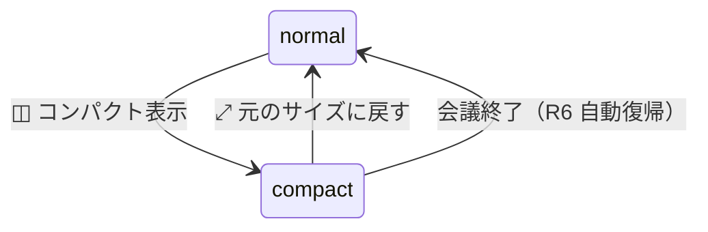

# 18. 録音中ウィンドウの退避（しまう / コンパクトモード）詳細設計

録音中に Session Window が常時最前面で居座り会議の邪魔になる問題への対策 2 機能の詳細設計。

- **機能 A「しまう」**: **ウィンドウを閉じる操作（close ボタン / ⌘W）**で、録音を続けたまま
  ウィンドウを非表示にし、メニューバーを録音インジケータにする。メニューバーからは「会議を終了」
  （確認あり）もできる
- **機能 B「コンパクトモード」**: ウィンドウを経過時間 + 操作ボタン + 書き起こしティッカーだけのピル型ミニバーに折りたたむ

本ドキュメントは kikimi.md 10 章「フローティング挙動」「録音の開始・一時停止・終了」の
**close 挙動を改定**する: Recording / Paused 中のウィンドウクローズは、旧設計の
「3 択確認ダイアログ（終了して閉じる / 終了せず閉じる / キャンセル）」を**廃止**し、
確認なしの「しまう」に振り替える。`06-ui-panels.md` §5.2（WindowManager）・§6.1.1（close フロー。
本改定を反映済み）・§9（位置永続化・復元）、`17-session-window-redesign.md` §3（ヘッダ/タブ構成）と
併読すること。

## 1. 目的と背景

`FloatingPanel` は `level = .floating` + `collectionBehavior = [.canJoinAllSpaces, .fullScreenAuxiliary]`
+ `hidesOnDeactivate = false` で「全 Space・フルスクリーン会議アプリの上にも常時表示」
（`Kikimi/Window/FloatingPanel.swift`）。そのままでは会議中（特に画面共有中）に 800×600 の
ウィンドウが最前面に固定される。「録音は続けたいがウィンドウは見たくない」を表現する操作が必要になる。

その操作を「閉じる」に割り当てる。macOS のメニューバー常駐アプリでは「ウィンドウを閉じても
処理は続き、メニューバーから戻す」が定番のイディオムであり、独自ボタンより発見しやすい。
閉じる操作を常に非破壊（しまうだけ）にすることで、誤操作しても何も失わない。確定処理
（`on_session_end`）の経路はヘッダの `⏹ 会議終了` とメニューバーの「会議を終了」（確認あり）の
2 つだけになり、「停止と終了の分離」（kikimi.md 4 章）がより純粋になる。

「録音は絶対に止めない」（kikimi.md 6 章）の不変条件から、両機能とも**録音パイプラインには一切触らない**。
ウィンドウの見え方だけを変える。

## 2. 決定事項

| # | 決定 |
|---|---|
| R1 | 「しまう」は `NSWindow.orderOut(_:)` によるウィンドウ非表示。**コントローラ・ViewModel・録音パイプラインは破棄しない**（`workspaceControllers` に残す）。トリガは**ウィンドウを閉じる操作**（close ボタン / ⌘W）: `windowShouldClose` が Recording / Paused 系状態のとき close を拒否して代わりに `stow()` を実行する。ヘッダに「しまう」専用ボタンは**置かない** |
| R2 | close の意味は状態で決まる: `.recording` / `.paused` / `.pausedDisabledOtherRecording` → しまう。Draft / Ended → 従来どおり破棄 close。遷移中（`.starting` / `.pausing` / `.resuming` / `.ending`）→ 何もしない（deny。数秒で抜ける遷移中に hidden ウィンドウを作らない — 「`.starting` 中にしまう → 開始失敗ロールバック → hidden な Draft」を構造的に防ぐ）。「コンパクト表示」ボタンは Recording / Paused のときだけヘッダに出す |
| R3 | メニューバーアイコンを状態表示に使う: 録音中は録音アイコン + 経過時間（MM:SS）、警告バナー保有中は警告アイコン。メニューには「しまってあるウィンドウを表示」項目と、Recording 中のみ「会議を終了…」項目（確認アラートつき、§3.3）を出す |
| R4 | コンパクトモードは**同一 NSPanel のコンテンツ・フレーム切替**（別ウィンドウは作らない）。モードは**永続化しない**（アプリ再起動後は常に通常表示。Recording はそもそも再起動を跨がないため） |
| R5 | コンパクト中はウィンドウフレームを `state.yaml` に**保存しない**（保存されるのは常に展開時のフレーム）。展開時フレームはコントローラがメモリ上に保持し、展開で復元する |
| R6 | 会議終了（Ended 遷移）時: コンパクトなら通常表示へ自動復帰する（確定処理の結果＝サマリをユーザーに見せる。17-session-window-redesign.md R4 の自動切替と同じ「状態遷移の瞬間のみ介入」原則）。**発動するのは「コンパクト中かつしまっていない」ときだけ**（通常表示中のウィンドウはそもそも復帰不要）。**しまってある（`orderOut` 済み）ウィンドウは再表示しない**（改定。理由は下記） |
| R6' | R6 の当初仕様は「しまってあれば自動再表示（しまったまま終了してもサマリが見える）」だったが**廃止**した。再表示が起きるのは確定処理（STT ドレイン・最終サマリパス・`on_session_end` Watcher・wiki export）が終わった瞬間 — ユーザーが会議終了を押してから数十秒後、既に別の作業に移っている任意のタイミングになる。Session Window は `level = .floating` かつ `canBecomeKey == true` なので、そこで全アプリの手前に飛び出してキーボードフォーカスを奪う。**ユーザーが明示的にしまったウィンドウはしまったまま**にし、サマリはメニューバー / Session List から開いたときに見せる |
| R7 | 旧 close 確認フロー（3 択ダイアログ・`RecordingCloseChoice`・`isConfirmingClose` / `closeApprovedAfterStop` の二段フラグ）は**廃止**する。`WindowCloseDecision` は R2 の 3 値（allow / stow / deny）テーブルに改定する（06-ui-panels.md §6.1.1 が正）。「Recording は同時に 1 つ」排他と、アプリ終了確認（06-ui-panels.md §9 の `applicationShouldTerminate`）は**変更しない** |
| R8 | 新設ボタンはすべて既存の AX contract（`.help` + `.accessibilityLabel` を可視ラベルと同期）に従う（kikimi-verify での自動操作のため） |

## 3. UX 仕様

### 3.1 ヘッダの追加ボタン

Recording / Paused のとき、ヘッダ右端（録音操作ボタン群の左）に「コンパクト表示」ボタンを 1 つ追加する。
「しまう」の専用ボタンは置かない（しまうはウィンドウを閉じる操作で発動する。§3.2）。

```
┌────────────────────────────────────────────────────────────────┐
│ デイリースクラム ✎          [◫]  [■ 一時停止] [⏹ 会議終了] 25:12 │
└────────────────────────────────────────────────────────────────┘
        [◫] = コンパクト表示に切替（rectangle.compress.vertical）
```

- `[◫] コンパクト表示`: help/AX ラベル「コンパクト表示」。押すとウィンドウがピル型ミニバーに切り替わる
- Draft / Ended / starting / ending などの遷移中状態では非表示。表示条件は
  **`recordingButtonState` が `.recording` / `.paused` / `.pausedDisabledOtherRecording` の
  いずれかであること**（§5.3 の専用 computed `showsStowControls`）。
  `blocksWindowClose` は流用**しない** — あちらは `.starting`/`.pausing`/`.resuming`/`.ending` の
  遷移中も `true` を返すため、流用すると遷移中にボタンが出てしまう

### 3.2 機能 A: しまう（close の振り替え）

**トリガ**: ウィンドウを閉じる操作（close ボタン / ⌘W → `windowShouldClose`）。
`recordingButtonState` が `.recording` / `.paused` / `.pausedDisabledOtherRecording` のとき、
close を拒否（`false` を返す）して代わりに以下を実行する。確認ダイアログは出さない
（破壊的でない・いつでもメニューバーから戻せるため）。判定は `WindowCloseDecision`
（06-ui-panels.md §6.1.1 の 3 値テーブル）に委譲する。

**挙動**

0. コンパクト中なら、まず `.normal` へ展開する（フレーム・クローム復元。§5.2 の
   `applyWindowMode(.normal)` と同一処理）。orderOut 直前の同一 runloop 内なので視覚上の
   ちらつきは実質ない。これにより「しまってある間はモード不変・再表示は常に通常表示」の
   不変条件を保つ
1. ウィンドウを `orderOut(nil)` で非表示にする（`close()` / `performClose(_:)` は使わない。
   `windowWillClose` → `workspaceWindowDidClose`（破棄）を通らないことが本質）
2. `AppState.markWindowHidden(sessionId:)` で `visible = false` を書く（close と同じ扱い。
   §4.3 参照）
3. 進行中の move/resize デバウンス保存タスクをキャンセルする（stale な `visible: true` の
   書き戻し競合を防ぐ。`windowWillClose` と同じ処置）
4. `WindowManager` が「しまってあるウィンドウ一覧」を更新し、メニューバーモデルに反映する

**再表示の経路**（すべて同じ `WindowManager.showWorkspaceWindow(sessionId:)` に集約）

| 経路 | 動線 |
|---|---|
| メニューバー | メニュー項目「<タイトル> を表示」をクリック |
| Session List | 該当セッションの「開く」（既存の `openWorkspace` が hidden なコントローラを `showWindow` でフロントに出す。**既存コードで既に動く経路**だが、`visible = true` の書き戻しを追加する） |

（会議終了は再表示の経路では**ない** — R6' のとおり、しまってあるウィンドウは終了しても出てこない。
コンパクト中の通常サイズ復帰だけが `showWorkspaceWindow` を通る）

**しまっている間の挙動**

- 録音・書き起こし・整形・サマリ・Watcher はすべて通常どおり継続する（ViewModel は生きている）
- 新しい `WorkspaceBanner`（システム音声停止・ファイル書き込み失敗など）が積まれたら、
  メニューバーアイコンが警告表示に変わる（§3.3）。バナー自体は再表示時にウィンドウ内で見える

### 3.3 メニューバー（インジケータ + メニュー）

現行の `MenuBarExtra`（固定 `waveform` アイコン + 静的メニュー、`KikimiApp.swift`）を動的にする。

**ラベル（アイコン部）** — 優先度順に 1 つを表示:

| 状態 | 表示 |
|---|---|
| 録音中セッションの ViewModel が警告バナーを 1 件以上保有 | `exclamationmark.triangle.fill` + 経過時間 |
| Recording 中 | `record.circle.fill` + 経過時間（`TimeFormatting.clock`、`monospacedDigit`） |
| それ以外（Paused でしまってあるだけ、を含む） | `waveform`（現行どおり） |

- 経過時間は Recording 中のみ表示（メニューバー占有幅を最小にする）。Paused は時間を出さない。
  形式は `TimeFormatting.clock` 準拠（1 時間未満 MM:SS、以降 H:MM:SS）
- 「Recording 中」の判定は `recordingSessionId` ではなく購読中 ViewModel の
  `recordingButtonState` を入力にする（`.ending` の数秒間に録音アイコンが出続けるのを防ぐ。
  遷移中状態は `idle` 扱いでよい）
- 警告判定は**録音中セッションのみ**を対象にする（しまってある Paused セッションのバナーまで
  メニューバーに昇格させると、どのウィンドウの警告か判別できず誤誘導になるため。
  Paused セッションのバナーは再表示時にウィンドウ内で見える）

**メニュー項目** — 上から:

```
録音中: デイリースクラム           ← Recording 中のみ。disabled な情報行（経過時間は出さない。下記）
会議を終了…                       ← Recording 中のみ。確認アラートつき（下記）
デイリースクラム を表示            ← しまってあるウィンドウごとに 1 項目（0 件なら非表示）
──────────────
新規セッション                    ← 以下は現行どおり
セッション一覧
設定
──────────────
終了
```

- 「〜 を表示」はしまってあるウィンドウごとに出す。Recording 中でしまってあるものが先頭。
  「しまってある」の判定は `window?.isVisible` の探査ではなく、`WindowManager` が stow / 表示 /
  close / delete のたびに維持する**明示的な stowed sessionId 集合**で行う（暗黙のプロパティ依存を
  避け、意図を固定する）
- **「会議を終了…」**: Recording 中のみ表示し、録音中セッションを対象にする。クリックで
  `NSApp.activate` + アプリモーダルの `NSAlert`（「会議を終了しますか？」/ informative:
  「サマリの確定と Wiki export が実行されます。」/ `[会議を終了]` `[キャンセル]`）を出す。
  ウィンドウの文脈が見えないメニューからの確定操作なので、この経路だけは確認を挟む
  （ヘッダの `⏹` はウィンドウ内で内容を見た上での操作なので従来どおり確認なし）。
  承諾されたら該当 ViewModel の `endMeeting()` を呼ぶ（`WindowManager` 経由でコントローラへ
  ディスパッチ）。承諾時点で既に Ended / 遷移中なら no-op。しまってあるウィンドウは終了後も
  しまったまま（R6'）で、サマリはメニューバーの「〜 を表示」から開いたときに見える。
  Paused セッションの終了はメニューには置かない（「〜 を表示」で
  開いてから `⏹`。露出を最小に保つ）
- メニューからの一時停止操作は MVP では**入れない**（§8 将来候補）
- **メニュー本体はタイマー tick で再描画してはならない（必須仕様）**: `MenuBarExtra(.menu)` の
  コンテンツが開いている間に再評価されると NSMenu の項目が作り直され、ホバーハイライトが
  先頭行にリセットされる。Recording 中は経過時間が毎秒更新されるため、メニュー本体が
  `MenuBarStatusModel`（`timerText` を含む）を `@ObservedObject` で購読すると毎秒この
  リセットが起きる。よってメニュー本体は `timerText` を含まない専用の射影
  `MenuBarMenuContent`（§4.2）だけを購読する。帰結として**情報行に経過時間は表示しない**
  （凍結された古い時刻を出すより出さない方が誤解がない。ライブの経過時間はすぐ隣の
  メニューバーラベル自体が表示している）

### 3.4 機能 B: コンパクトモード

**ピルの構成**（固定サイズ・幅 380 × 高さ 44 目安。実装時に ±20% の調整可）

```
┌──────────────────────────────────────────────────┐
│ ● 25:12  [⏸]   次のスプリントで対応します…      [⤢] │
└──────────────────────────────────────────────────┘
  ●        = 録音状態ドット（Recording: 赤 / Paused: グレー）
  25:12    = 経過時間（monospacedDigit）
  [⏸]/[▶]  = 一時停止 / 録音再開（recordingButtonState に追従）
  ティッカー = 最新の書き起こし 1 行（§5.3 CompactTicker）。truncationMode(.head)
  [⤢]      = 通常表示に戻す（help/AX「元のサイズに戻す」）
```

- **入れないもの**: `⏹ 会議終了`（確定操作を誤クリックしやすい小型 UI に置かない。終了は展開してから）、
  タブ・バナー一覧・タイトル編集・タイトル提案バッジ・`AudioInputPopoverButton`。
  提案タイトルは `meta.titleProposal` に残るので展開後に採用できる。音声入力の変更も展開してから。
  コンパクト化時に `AudioInputPopover` が開いていたら dismiss する
- バナーが 1 件以上あるときはティッカーの左に `⚠` を出す（クリックで展開）

**ウィンドウ機構**（§5.2）

- 同一 `FloatingPanel` のまま、(1) コンテンツを `CompactRecordingBarView` に差し替え、
  (2) フレームをピルサイズに変更、(3) クローム変更: `titleVisibility = .hidden` +
  `titlebarAppearsTransparent = true`（`.fullSizeContentView` は既に付与済み）、
  標準ボタン（close/miniaturize/zoom）を隠す、`isMovableByWindowBackground = true`、
  リサイズ不可（`styleMask` から `.resizable` を除去）。`contentMinSize` / `contentMaxSize` も
  ピル寸法に合わせて更新する（NSHostingView の最小サイズ制約との衝突を防ぐ）
- 展開時: 上記をすべて元に戻し、コンパクト化直前に保持した展開フレームへ復元する。
  ピルをドラッグ移動していた場合も、展開フレームは**コンパクト化直前の位置**に戻る
  （ピル位置への追従はしない。単純さ優先）。復元時はスクリーン構成変化に備えて
  `constrainFrameRect(_:to:)` 相当の画面内補正を通す
- コンパクト化時のピル位置は、直前の展開ウィンドウの**左上角に揃える**
- タブ状態・ペインモード（`activeTab` / `meetingPaneMode`）はコンパクト中も ViewModel に
  保たれ、展開でそのまま復元される（コンパクトはビューの差し替えにすぎない）

**モード遷移**



- 「しまう」との直交性: ピルには close ボタンを表示しないが、⌘W（`performClose`）は効く。
  その場合も §3.2 手順 0 のとおり**展開してからしまう**。しまってある間にモードが変わることは
  なく、再表示は常に通常表示になる
- Ended になったら（`⏹` は展開時のみ押せるが、`endMeeting` はメニュー外経路でも起こり得る
  防御として）ViewModel 側で `windowMode = .normal` に強制する

## 4. 型・状態の変更

### 4.1 `WorkspaceWindowMode`（新設・非永続）

```swift
/// Session Window の表示モード。ViewModel 上の @Published プロパティで、state.yaml には
/// 永続化しない（R4: Recording は再起動を跨がないため、再起動後は常に .normal で開く）。
enum WorkspaceWindowMode: Equatable, Sendable {
    case normal
    case compact
}
```

- `MeetingWorkspaceViewModel` に `@Published var windowMode: WorkspaceWindowMode = .normal` を追加
- `endMeeting()` 完了時（Ended 遷移確定後）に `.normal` へ戻す

### 4.2 `MenuBarStatus`（新設・pure）+ `MenuBarStatusModel`（新設・ObservableObject）

表示決定ロジックを pure に分離する（`WindowRestorationPlan` / `WindowCloseDecision` と同じ流儀。
06-ui-panels.md §12 のテスト方針）。

```swift
/// メニューバーの表示内容。pure な derive で決定し、ユニットテスト可能にする。
struct MenuBarStatus: Equatable {
    enum Icon: Equatable {
        case idle           // waveform
        case recording      // record.circle.fill
        case warning        // exclamationmark.triangle.fill
    }
    struct HiddenWindowItem: Equatable, Identifiable {
        var id: String      // sessionId
        var title: String   // 空タイトルは「無題の会議」に置換済み
    }

    var icon: Icon
    var timerText: String?              // Recording 中のみ非 nil（"25:12" 形式）
    var recordingTitle: String?         // Recording 中のみ非 nil（情報行用）
    var hiddenWindows: [HiddenWindowItem]

    static func derive(
        isRecording: Bool,
        elapsedSeconds: Int?,
        recordingTitle: String?,
        recordingHasWarning: Bool,
        hiddenWindows: [HiddenWindowItem]
    ) -> MenuBarStatus
}
```

```swift
/// WindowManager が保持・更新する @MainActor ObservableObject。KikimiApp の MenuBarExtra の
/// **ラベルだけ**が購読する（メニュー本体は購読しない。§3.3）。derive への入力を集めるだけで、
/// 判定は MenuBarStatus.derive に委譲する。
@MainActor
final class MenuBarStatusModel: ObservableObject {
    @Published private(set) var status: MenuBarStatus
}

/// メニュー本体（MenuBarMenuView）専用の射影。timerText を含まない Equatable 値。
/// MenuBarStatus から pure に導出する。
struct MenuBarMenuContent: Equatable {
    var recordingTitle: String?                          // Recording 中のみ非 nil（情報行 + 「会議を終了…」の表示条件）
    var hiddenWindows: [MenuBarStatus.HiddenWindowItem]

    static func derive(from status: MenuBarStatus) -> MenuBarMenuContent
}

/// メニュー本体が購読する @MainActor ObservableObject。MenuBarStatusModel とは**別インスタンス**に
/// する（ObservableObject の objectWillChange はどの @Published の変更でも発火するため、同居させると
/// タイマー tick がメニューを毎秒再描画し、開いているメニューのホバーハイライトが先頭行に
/// リセットされる。§3.3）。update は値が実際に変わったときだけ publish する:
/// `guard newValue != content else { return }`。
@MainActor
final class MenuBarMenuModel: ObservableObject {
    @Published private(set) var content: MenuBarMenuContent
}
```

**更新経路**（すべて `WindowManager` 起点）:

- `recordingSessionId` の変化（既存の購読）→ 録音中セッションの ViewModel の
  `$recordingButtonState`（経過秒・Recording 判定）・`$banners`（警告）・`$meta`（タイトル）を
  購読し直す
- **購読ライフサイクル（必須仕様）**: 録音セッション用の cancellable は専用の集合に持ち、
  `recordingSessionId` が変化するたびに**全破棄 → 再構築**する。`nil` になったら空にする。
  張り替え漏れは WindowManager（シングルトン）生存期間のリーク＝旧 ViewModel の
  強参照残留になるため、レイヤ 1 テストで検証する（§7）
- しまう / 表示 / close / delete のたびに `hiddenWindows` を再計算（§3.3 の stowed sessionId
  集合が正）。加えて、しまってあるセッションのタイトルが変わった場合（典型: しまっている間に
  初回サマリ更新の自動命名が走る — むしろ起きやすい）にメニュー項目が stale にならないよう、
  録音中セッションの `$meta` 変化でも `hiddenWindows` を再導出する
- `menuBarStatus.status` を更新した箇所で毎回 `MenuBarMenuContent.derive(from:)` を通して
  `MenuBarMenuModel` にも流す。publish するかどうかの間引き（値が同じなら何もしない）は
  `MenuBarMenuModel` 側の update メソッドが一元的に担う

### 4.3 `state.yaml`: スキーマ変更なし

- 「しまう」は既存の `visible: false` を再利用する（close と同じ意味論: 「次回起動時に
  ウィンドウを復元しない」）。**新フィールドは追加しない**
- 帰結として、しまったまま（または close したまま）アプリを終了した Recording セッションは、
  `prepareForTermination` で Paused に落ち、次回起動時はウィンドウ復元されず Session List に
  Paused として並ぶ — close の既存挙動と完全に同一で、新たな分岐を作らない
- **追加する書き戻し**: `showWorkspaceWindow` / `openWorkspace`（既存コントローラの再表示時）で
  `visible = true` を upsert する。現行は移動・リサイズ時にしか `visible` が書かれないため、
  「しまう → 表示」のあと一度も動かさず終了すると `visible: false` のままになる穴を塞ぐ。
  **エントリ未存在時の意味も定義する**: `markWindowHidden` 型の「無ければ no-op」では穴が
  塞がらない（エントリは move/resize 時にしか作られないため）。表示時の書き戻しは
  「エントリが無ければ現在の `window.frame` + `activeTab` / `meetingPaneMode` からフルエントリを
  新規作成する upsert」とする — 実装はコントローラの既存 `saveWindowState()` を 1 回呼ぶだけでよい
- コンパクトモードは永続化しない（R4）。コンパクト中のフレームも保存しない（R5、§5.2）

## 5. コンポーネント変更

### 5.1 `WindowManager`

```swift
// 新設
let menuBarStatus = MenuBarStatusModel()   // ラベル用（timerText を含む。毎秒更新）
let menuBarMenu = MenuBarMenuModel()       // メニュー本体用（timerText なし。実変更時のみ publish）

/// しまう。controller は workspaceControllers に残したまま orderOut + visible=false。
func stowWorkspaceWindow(sessionId: String)

/// 再表示（メニューバー・Session List・会議終了時自動再表示の共通経路）。
/// showWindow + visible=true 書き戻し + menuBarStatus 更新。
/// workspaceControllers に該当が無ければ warning ログのみで no-op（visible も書かない）。
func showWorkspaceWindow(sessionId: String)
```

- `stowWorkspaceWindow` の実体はコントローラ側の `stow()`（§5.2）呼び出し + `menuBarStatus` 更新
- `showWorkspaceWindow` の**コントローラ不在ガードは必須仕様**: ウィンドウ破棄後の遅延呼び出しや
  ユニットテスト経由の `endMeeting()` で、実ユーザーの `state.yaml` に書き込む事故を防ぐ
- `openWorkspace(sessionId:)` の既存分岐（`existing.showWindow(nil)`）を `showWorkspaceWindow`
  経由に変更（`visible = true` 書き戻しを一元化）
- `workspaceWindowDidClose` / `handleSessionDeleted` の末尾で `menuBarStatus` を更新
  （しまってあるウィンドウが close / delete された場合にメニュー項目を消す）
- 会議終了時の自動再表示（R6）: ViewModel からの `WindowManager.shared` **直呼びはしない**。
  既存の `$recordingSessionId` 参照は read-only だったのに対し、これは AppState 書き込みを伴う
  質的に新しい依存であり、既存の `MeetingWorkspaceViewModelTests`（`endMeeting()` を直接叩く）が
  実マシンの `state.yaml` を汚染する。代わりに ViewModel へ注入 closure
  `onMeetingEnded: ((String) -> Void)?` を追加し（`summaryUpdaterFactory` と同じ seam パターン）、
  `MeetingWorkspaceWindowController` の init で `WindowManager.showWorkspaceWindow` に配線する。
  テストでは未配線（nil）のまま副作用ゼロ。呼び出し条件は R6 / R6' のとおり
  「コンパクト中かつしまっていない」のみ（`MeetingEndReshowDecision.shouldReshow` で判定）
- メニューバーの「会議を終了…」（§3.3）: `WindowManager` に
  `endRecordingMeetingFromMenuBar()` を新設する。確認 `NSAlert`（アプリモーダル）を表示し、
  承諾されたら録音中セッションのコントローラを引いて ViewModel の `endMeeting()` を呼ぶ。
  該当コントローラ不在・既に Ended / 遷移中なら warning ログのみで no-op

### 5.2 `MeetingWorkspaceWindowController`

```swift
// 新設
/// orderOut + デバウンス保存キャンセル + AppState visible=false。破棄 close とは別の非破棄操作。
/// コンパクト中なら先に applyWindowMode(.normal) で展開してから orderOut する（§3.2 手順 0）。
func stow()

// コンパクトモード対応（viewModel.$windowMode を購読して適用）
private var expandedFrame: NSRect?          // コンパクト化直前の展開フレーム（メモリのみ）
private var isCompact = false               // フレーム永続化の抑止フラグ
private func applyWindowMode(_ mode: WorkspaceWindowMode)
```

- `windowShouldClose` は `WindowCloseDecision.evaluate(...)`（06-ui-panels.md §6.1.1 の 3 値
  テーブル）に委譲する: `.allowClose`（Draft / Ended）なら `true` を返して従来どおり破棄 close、
  `.stowInsteadOfClose`（Recording / Paused 系）なら `stow()` を呼んで `false`、
  `.denyTransient`（遷移中）なら何もせず `false`。旧 3 択ダイアログと `RecordingCloseChoice` /
  `isConfirmingClose` / `closeApprovedAfterStop` / `presentRecordingCloseConfirmationAlert` は
  削除する（R7）
- `applyWindowMode(.compact)` は**この順序が必須**: (1) `isCompact = true` を最初に立てる →
  (2) 進行中の `moveResizeDebounceTask` をキャンセル（`stow()` と同じ処置）→
  (3) `expandedFrame = window.frame` を保存 → (4) クローム変更（§3.4）→
  (5) ピルフレームへ `setFrame`。
  順序を誤り `setFrame` を `isCompact = true` より先に行うと、`setFrame` が同期発火させる
  `windowDidResize` → `scheduleWindowStateSave()` がガードを素通りし、300ms 後にピルフレーム
  （380×44）が `state.yaml` に永続化される — 次回起動時に 44pt 高の通常ウィンドウが復元される
  R5 違反バグになる
- `applyWindowMode(.normal)`: クローム復元 → `expandedFrame` へ `setFrame`（nil なら現状維持。
  画面内補正つき、§3.4）→ `isCompact = false` → `saveWindowState()` を 1 回呼ぶ
- ガードは二重に置く: `scheduleWindowStateSave()` の先頭に加えて、デバウンス発火側の
  `saveWindowState()` 先頭にも `guard !isCompact else { return }`（スケジュール時 true →
  発火時 compact のすり抜け防御）
- `viewModel.$windowMode` の購読は `.removeDuplicates()` + **実際にモードが変わったときだけ**
  `applyWindowMode` を適用する（`@Published` は購読直後に現在値を replay するため、素通しにすると
  init 直後 = `showWindow` 前に `.normal` 適用 → `saveWindowState()` が `visible: false` を
  upsert してしまい「移動・リサイズ時のみ保存」の既存意味論が壊れる）
- コンテンツの差し替えは行わない: `MeetingWorkspaceView` 自身が `viewModel.windowMode` で
  ルートを切り替える（§5.3）。コントローラはフレームとクロームだけを担当する
  （SwiftUI 側とAppKit 側の責務分離を保つ）

### 5.3 View 層

**`MeetingWorkspaceView`**

- `viewModel.windowMode` での分岐は、`.task { onAppear() }` / `.onDisappear` が付いた
  **安定した外側コンテナ（`Group` 等）の内側**で行う: `.compact` なら
  `CompactRecordingBarView`、`.normal` なら現行の VStack（ヘッダ + バナー + タブ）。
  外側にモディファイアを残すのは必須仕様 — 分岐をルートに置くと、コンパクト化のたびに
  `onDisappear()`（購読破棄）、展開のたびに `.task`（録音中の transcript 全件 backfill）が
  走り、live 追記と競合する
- ヘッダに §3.1 の「コンパクト表示」ボタンを追加。表示条件は新設の computed `showsStowControls`
  （`.recording` / `.paused` / `.pausedDisabledOtherRecording` のみ true。§3.1 の理由により
  `blocksWindowClose` は流用しない）
- 「コンパクト表示」のアクションは `viewModel.windowMode = .compact` を設定するだけ。
  「しまう」に View 側のボタンはない（close 操作 → `windowShouldClose` → `stow()`、§5.2）

**`CompactRecordingBarView`（新設、`Kikimi/Views/MeetingWorkspace/`）**

- §3.4 のピルレイアウト。`recordingButtonState` の `.recording` / `.paused` /
  `.pausedDisabledOtherRecording`（再開 disabled）/ 遷移中（ProgressView）に追従
- ティッカーは pure helper に切り出す:

```swift
/// コンパクトバーの 1 行ティッカー本文。優先順: 進行中 volatile テキスト（mic/system の
/// うち直近に更新された方）→ 最後の確定行（refined ?? raw、空文字=削除セグメントは除外）→
/// nil（プレースホルダ表示）。
/// 型は実装に合わせる: rows は TranscriptRowViewModel（TranscriptRowList.swift）、
/// volatile は非 optional String（空文字がクリアの合図、MeetingWorkspaceViewModel 準拠）。
enum CompactTicker {
    static func text(
        rows: [TranscriptRowViewModel],
        micVolatileText: String,
        systemVolatileText: String
    ) -> String?
}
```

**`KikimiApp`（MenuBarExtra）**

- `label:` を `MenuBarLabelView`（新設・`menuBarStatus.status` の icon + timerText を描画）に、
  メニュー本体を `MenuBarMenuView`（新設・§3.3 の項目構成）に差し替え
- `MenuBarLabelView` は `WindowManager.shared.menuBarStatus` を、`MenuBarMenuView` は
  `WindowManager.shared.menuBarMenu` を `@ObservedObject` で購読する。メニュー本体が
  `menuBarStatus` に触れてはならない（§3.3 のホバーリセット防止）

### 5.4 `MeetingWorkspaceViewModel`

- `@Published var windowMode: WorkspaceWindowMode = .normal`（§4.1）
- `var onMeetingEnded: ((String) -> Void)?` を追加（§5.1 の注入 seam。テストでは nil のまま）
- `endMeeting()` の Ended 確定後: `windowMode = .normal` に戻し、`onMeetingEnded?(sessionId)` を
  呼ぶ（R6。コンパクトの復帰をカバーする。しまってあった場合は再表示しない = R6'。発動条件の
  判定と close 進行中の抑止は配線側 = コントローラ/WindowManager の責務）
- 録音パイプライン・整形・サマリ・Watcher のコードには一切手を入れない

## 6. 失敗モード・エッジケース

| # | ケース | 挙動 |
|---|---|---|
| 1 | しまっている間に警告バナー追加（システム音声停止など） | Recording 中セッションならメニューバーが `warning` アイコンに変化。バナー自体は再表示時にウィンドウ内で見える。Paused セッションはアイコン変化なし（§3.3） |
| 2 | しまっている間に Session List から削除 | 既存の `handleSessionDeleted` → `close()` がそのまま動く（hidden window への `close()` は正常）。`menuBarStatus` から項目を除去 |
| 3 | しまったままアプリ終了 | `prepareForTermination` が録音を Paused に落とす（既存）。`visible: false` 済みなので次回起動でウィンドウ復元されず、Session List に Paused として並ぶ。**close の既存挙動と同一**（§4.3） |
| 4 | しまっている間にクラッシュ | 既存のクラッシュ復旧（kikimi.md 15 章)そのまま: 次回起動時に incomplete session として検出され Session List にバナー表示 |
| 5 | コンパクト中にピルをドラッグ移動 | `isCompact` 二重ガード（スケジュール側 + 発火側、§5.2）で `state.yaml` への保存を抑止（R5）。展開時はコンパクト化直前の位置に戻る |
| 6 | コンパクト中に ⌘W（Recording / Paused） | `stow()` が §3.2 手順 0 で `.normal` へ展開してから `orderOut`。再表示は通常表示になる。ダイアログは出ない |
| 7 | コンパクト中に会議終了が発生 | ViewModel が `.normal` へ強制（§3.4）。ウィンドウはサマリ可視状態で展開される（17-session-window-redesign.md R4 と連続した体験） |
| 8 | しまう直前の move/resize デバウンス保存が残っている | `stow()` がデバウンスタスクをキャンセルしてから `visible = false` を書く（`windowWillClose` と同じ競合対策） |
| 9 | メニューの「〜 を表示」を押した時点で既に表示済み（競合） | `showWorkspaceWindow` は `showWindow` + `visible=true` upsert の冪等操作なので無害 |
| 10 | Paused の hidden ウィンドウが複数 | メニューに全件並ぶ（Recording 中のものが先頭）。Recording は同時 1 つの不変条件（R7）は影響を受けない |
| 11 | 「しまう」と「新規 Draft の録音開始」が並ぶ | 排他は既存の `recordingSessionId` 購読のまま。hidden な Recording ウィンドウがあっても他ウィンドウの録音開始 disabled は現行どおり機能する |
| 12 | メニューバー「会議を終了…」の確認中に状態が変わる（表示して手動 `⏹` した等） | 承諾時点で録音中コントローラを引き直し、既に Ended / 遷移中なら no-op（§5.1）。二重 `endMeeting()` は走らない |
| 13 | `.starting` / `.ending` などの遷移中に close（⌘W 等） | `WindowCloseDecision` が `.denyTransient` を返し何も起きない（R2）。コンパクトボタンも非表示（§3.1 `showsStowControls`）。「`.starting` 中にしまう → 開始失敗 → hidden な Draft」は構造的に発生しない |
| 14 | しまっている間に自動タイトル命名が走る | 録音中セッションの `$meta` 購読（§4.2）で `hiddenWindows` を再導出し、メニュー項目「無題の会議 を表示」が stale にならない |
| 15 | Recording 中にメニューを開いたまま数秒経過 | タイマー tick は `menuBarStatus`（ラベル）のみを更新し、`MenuBarMenuModel` は publish しない。メニュー項目は再構築されず、ホバーハイライトが先頭行にリセットされない（§3.3/§4.2） |

## 7. テスト計画

**レイヤ 1（XCTest / swift-testing）**

- `MenuBarStatus.derive`: 全分岐（idle / recording / warning 優先・timerText の有無・
  hiddenWindows の並び・空タイトル置換）
- `MenuBarMenuContent.derive` / `MenuBarMenuModel`: timerText だけが異なる status の連続 update で
  publish されない（`objectWillChange` が発火しない）こと、`recordingTitle` / `hiddenWindows` の
  変化では publish されること（§6 #15 の回帰）
- `CompactTicker.text`: volatile 優先・確定行フォールバック（refined ?? raw・空文字削除セグメント
  除外）・全て空で nil
- `MeetingWorkspaceWindowController`: `stow()` 後に (a) `workspaceControllers` 相当の参照が
  生きている（ViewModel が破棄されない）、(b) `AppState` の `visible == false`、
  (c) デバウンス保存がキャンセルされる、(d) コンパクト中の `stow()` で `.normal` へ戻ってから
  非表示になる（§3.2 手順 0）
- `WindowCloseDecision.evaluate`: 新 3 値テーブルの全分岐（Draft / Ended → `.allowClose`、
  `.recording` / `.paused` / `.pausedDisabledOtherRecording` → `.stowInsteadOfClose`、
  `.starting` / `.pausing` / `.resuming` / `.ending` → `.denyTransient`）。
  旧 `RecordingCloseChoice` / 二段フラグのテストは削除する（R7）
- `applyWindowMode`: compact → normal 往復でフレームが復元される・compact 中は
  `scheduleWindowStateSave` / `saveWindowState` の両方が no-op（二重ガード）・
  **compact 化直後（デバウンス経過後）にピルフレームが保存されていない**こと（§5.2 B2 の回帰）・
  `$windowMode` 購読の初回 replay で `saveWindowState` が走らないこと
- `showWorkspaceWindow` の `visible = true` 書き戻し: エントリ既存なら `visible` のみ更新、
  未存在ならフルエントリ新規作成、コントローラ不在なら AppState に**何も書かれない**こと
- R6 経路: `onMeetingEnded` が (a) コンパクト中かつしまっていない endMeeting でだけ復帰を発火し、
  しまってある場合は発火しない（`MeetingEndReshowDecision.shouldReshow` の全分岐。R6'）、
  (b) 未配線（nil）なら副作用ゼロ
- `MenuBarStatusModel`: `recordingSessionId` 変化時に旧 ViewModel の購読が解除される
  （cancellable 集合が入れ替わり、旧 VM への強参照が残らない）

**レイヤ 2（kikimi-verify skill）**

1. `KIKIMI_TEST_INPUT` + `KIKIMI_STUB_LLM=1` で録音開始 → ウィンドウを閉じる（close ボタン
   クリックまたは ⌘W）→ OnScreenOnly でウィンドウ不可視を確認（破棄ではなくしまわれている）→
   `transcript.jsonl` の行数が増え続けることを確認（録音継続の実証）→
   メニューバーの「〜 を表示」→ 可視復帰を確認
1-b. 録音中にしまった状態でメニューバーの「会議を終了…」→ 確認アラートで承諾 →
   ウィンドウが自動再表示され Ended（サマリペイン可視）になることを確認。
   キャンセルなら録音継続・ウィンドウ非表示のままであることも確認
2. 録音中に「コンパクト表示」→ ウィンドウサイズがピル寸法であることを確認 →
   「元のサイズに戻す」→ 元サイズ・元位置に復元されることを確認
3. コンパクト中に「会議終了」相当の操作（展開 → ⏹）→ Ended で通常表示 + サマリペイン可視
4. コンパクト中にアプリ終了（⌘Q）→ 再起動 → ウィンドウが**展開フレーム・通常モード**で
   復元されること（R4/R5 の実機検証。ピルサイズが state.yaml に漏れていないことの確認）

## 8. スコープ外・将来候補

- メニューバーからの一時停止操作（会議終了は §3.3 でスコープ内になった。一時停止まで出すかは実戦後に判断）
- メニューバーからの Paused セッションの会議終了（現状は「〜 を表示」で開いてから `⏹`）
- 初回しまう時の通知/トースト「録音は続いています。メニューバーから戻せます」（メニューバーの
  録音インジケータで気づける前提だが、実戦で誤解が観測されたら追加）
- `kikimi://window/toggle` URL scheme（Raycast からの出し入れ。09-raycast-integration.md への追記）
- 「録音開始時に自動でコンパクトにする」config オプション（`appearance` セクション）
- ピルの横幅リサイズ許可・ティッカー表示の on/off 設定
- グローバルホットキーでの出し入れ（kikimi.md 10 章の MVP 見送り方針に従う）

kikimi.md 10 章「録音の開始・一時停止・終了」「しまう / コンパクト表示」が本ドキュメントの
要約（本ドキュメントへの参照つき）。両者は同期を保つこと。
