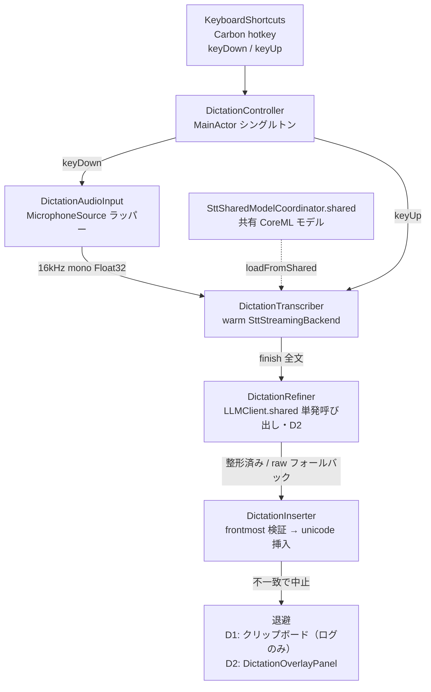
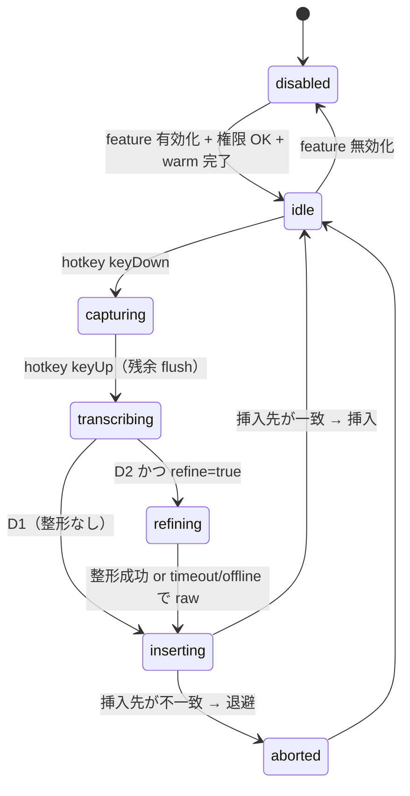

# 25. 音声文字入力（ディクテーション）詳細設計

ホットキー押下中だけマイクを録音し、離した瞬間に streaming STT を flush して確定、（任意で）LLM 整形を
かけてから、カーソル位置の他アプリへ整形済みテキストを挿入する Handy 型ディクテーションユーティリティの
詳細設計。

kikimi.md 2 章「将来的に検討し得る」の音声文字入力、および 15 章 Open Questions の同項目で列挙された
論点への回答をここで確定する。設計の前提となる実証結果は `_spike/dictation-paste/README.md`（グローバル
ホットキー + 他アプリへのテキスト挿入のスパイク）にあり、本設計はその知見を使う（コードは流用せず書き直す）。

要件は 3 段階に分かれる。

- **Phase D1（MVP・実装済み）**: ホットキー登録 UI + シンプルな STT のみ（LLM 後処理なし）。押している間録音 →
  離したら生テキストを挿入
- **Phase D2（実装済み）**: LLM による後処理（フィラー除去・句読点補完）。Kikimi の既存 LLM 設定
  （`llm.provider`）をそのまま使い、`refinement` とは別のモデルを指定できる。`DictationRefiner`・
  `DictationOverlayPanel` を新設
- **Phase D3（将来像）**: コンテキストの自動成長（学習モード / 活用モード）。設計として受け止めるが、実装は
  Phase 4 完了後の研究とする

## 1. 目的と背景

Kikimi のディクテーションは、既存の Handy（transcribe.cpp）や macOS 標準ディクテーションより高品質にできる
見込みがある。理由は、Kikimi が既に (1) FluidAudio の streaming STT、(2) `llm.provider` 抽象を持つ LLM
クライアント、(3) 安定した署名 identity（TCC 権限がビルドを跨いで保たれる、`_spike/dictation-paste/README.md`
「権限が再ビルドで失効する問題」）という 3 つの部品を持っているためである。ディクテーションはこれらを共有する
だけで成立する。

スパイクで判明した事実（再検証不要）:

- Carbon `RegisterEventHotKey` は key-up を取れる。押している間だけ録音する Handy 型ジェスチャは成立する
  （Input Monitoring 権限が不要）
- `⌥Space` は Raycast が CGEventTap で先取りするため、Carbon hotkey と**二重発火する**（登録は成功しエラーも
  出ない）。→ **ホットキーはユーザー設定可能にすること（必須）**
- テキスト挿入は Pasteboard + 合成 `⌘V` と CGEvent unicode 直接タイプの 2 方式が native / Chromium /
  Electron / ターミナルの**すべてで実挿入**を確認。単一方式で全アプリを賄えるのでアプリごとのフォールバックは不要
- AX（`kAXSelectedText` 書き込み）は Electron（VS Code）で効かない
- 挿入コストは 1〜15ms。体感レイテンシは**整形の LLM 往復時間がすべて**
- 挿入 API の戻り値は信用できない（`AXUIElementSetAttributeValue` は AXButton にすら `.success` を返す）
- アクセシビリティ権限が必須。安定した署名 identity がないとビルドのたびに失効する（`mise run signing-identity`
  で対処済み。`.mise/tasks/build/_default`）

ディクテーションは **セッションを持たないステートレスな道具**であり、kikimi.md 2 章の決定どおり **Kikimi の
セッションモデルには組み込まない**。`SttEngine` 相当の STT・`MicrophoneSource`・`LLMClient` を共有する
別モードとして本体に同居させる（別アプリ化はしない）。同居させる最大の理由は STT モデルの温存で、FluidAudio の
CoreML モデルは ANE へのロードに数秒かかる一方、ディクテーションは「押した瞬間に録り始める」道具だからである
（R3）。

不変条件として、この機能は kikimi.md 6 章「録音は絶対に止めない」「Recording は同時に 1 つ」と**衝突しない**
ように作る。ディクテーションは会議録音とは別の音声取込経路（別の `MicrophoneSource` インスタンス）を持ち、
会議録音中でも同一物理マイクを共有してそのまま動作する（R4）。

## 2. 決定事項

| # | 決定 |
|---|---|
| R1 | ディクテーションは Kikimi 本体に同居する別モード（別プロセス化・別アプリ化しない）。ステートレスでウィンドウを持たず、**`SessionStore` を一切呼ばない**。専用の `@MainActor` シングルトン `DictationController` が全体を統括し、`AppConfig.shared.data.dictation` を読んで有効/無効・ホットキー・モデルを解決する（**部分撤回・`docs/design/29-dictation-history.md` 参照**: 履歴機能（design 29）が config opt-out 付きで永続化とコスト記録を追加した。「`SessionStore` を呼ばない」は維持しつつ、「何も永続化しない」は `dictation.history.enabled`（既定 true）が ON の場合に限り撤回されている） |
| R2 | 音声取込は `AudioCapture`（`Kikimi/AudioCapture/AudioCapture.swift`）を**使わない**。`AudioCapture` は `sessionDirectory` 必須で WAV を書く前提のため。代わりに `MicrophoneSource`（`Kikimi/AudioCapture/MicrophoneSource.swift:85` の `init` / `start(bufferHandler:)`）を直接ラップした薄い `DictationAudioInput` を使う。WAV は書かず、一時ディレクトリも作らない |
| R3 | STT は `SttEngine`（`Kikimi/Stt/SttEngine.swift:21`）を**使わない**。`SttEngine` は `stop()` で AsyncStream を finish する一発使い切り設計で、セグメント確定ロジック（句読点/idle/文字数）もディクテーションには不要なため。代わりに warm な `SttStreamingBackend`（`Kikimi/Stt/SttStreamingBackend.swift:14`）を 1 つ保持し、`reset()` → `processChunk()` → `finish()` で「1 発話 = 1 ブロブ」を得る `DictationTranscriber` を新設する。モデル実体は `SttSharedModelCoordinator.shared`（`SttStreamingBackend.swift:84`）で会議用と共有する。**feature 有効時のみアプリ起動時に warm し、無効なら一切ロードしない**（**追補・`docs/design/31-dictation-two-pass-decode.md`**: ストリーミング出力はライブプレビュー HUD 表示専用に格下げされ、確定テキストは key-up 後のバッチ再デコード（warm な `DictationBatchTranscriber`、`two_pass_decode` 時のみ追加常駐）が供給する。バッチ不可時はストリーミング raw にフォールバック） |
| R4 | 会議録音中でもホットキーを**拒否しない。マイクを共有し、会議の書き起こしとディクテーションを両方同時に動かす**。当初案（拒否して通知）は「同じ発話が会議 transcript とディクテーションの両方に入る二重取り」を問題視していたが、ユーザー判断でこれを許容し、排他をなくす方が実用性が高いと確定した（D1 実装後の方針転換）。実装上は会議側 `AudioCapture` の `MicrophoneSource` とディクテーション側 `DictationAudioInput` の `MicrophoneSource` が同一物理デバイスに対し独立した `AVAudioEngine`/タップを同時に持つ形になる。CoreAudio は同一デバイスへの複数クライアント同時アクセスに対応しているため技術的には成立する見込みだが、**実機検証はまだ**（§7 既知ギャップ）。`WindowManager.shared.recordingSessionId` の読み取り自体は不要になったため `DictationController` から排除した。逆方向（ディクテーション保持中の会議録音開始）はそもそも排他の概念がなくなったため論点自体が消滅した |
| R5 | **誤爆対策（最重要）**: 合成 `⌘V` / unicode タイプは宛先を持たず「発行時点のフォーカス」に入るが、挿入が起きるのは整形が返った約 1 秒後である（§8）。よって挿入直前に挿入先を再確認し、key-release 時にキャプチャしたものと不一致なら**挿入を中止**する。判定は **AX focused element の一致を主・frontmost pid の一致を従**とする二段構え。pid だけでは同一アプリ内のフォーカス移動（Slack の入力欄→検索欄等）を見逃すため。中止したテキストは**絶対に失わない**。D1 では**クリップボードへ退避のみ**行う（`UNUserNotificationCenter` 通知は D1 実装後に省略した。人手検証でフォーカス切り替えタイミングを狙って再現するのが難しく、通知の到達自体を確認しづらいため。ログには残す）。D2 以降は `DictationOverlayPanel`（フォーカスを奪わないフローティング）に退避して `[挿入]` / `[コピー]` を出す。kikimi.md 15 章「整形完了を待って 1 回ペースト」は維持しつつ、「挿入直前の挿入先検証 + 退避」を追記改定する |
| R6 | 挿入方式は **Pasteboard + 合成 `⌘V` を既定**にする。当初は unicode 直接タイプ（CGEvent）を既定候補にしていたが、D1 実装時の検証環境（GUI 操作を伴う入力ソース切り替えがスクリプトから確実に自動化できない）では日本語 IME との相互作用を実機検証できなかったため、**安全側に倒して Pasteboard を既定**とする。config は `dictation.insert_method: unicode \| pasteboard` の 2 値のまま変更なし（**`auto` は設けない**。実行時に何を見て切り替えるかを定義できないため。IME の相互作用は挿入先アプリではなく入力ソースの状態に依存し、frontmost からは判定できない）。unicode 方式のコードパス自体は実装し config で選択可能にしておく。実機での IME 検証が取れ次第、既定値の切り替えを再検討する（§7 既知ギャップに追記） |
| R7 | ホットキーは SPM 依存 `KeyboardShortcuts`（sindresorhus）を追加して実現する。Carbon ベースで Input Monitoring 不要・key-up 対応・record-shortcut コントロール（`KeyboardShortcuts.Recorder`）付属のため、自前 Carbon glue + 自前レコーダを書くコストを避けられる。**ホットキーの source of truth は `KeyboardShortcuts` が使う UserDefaults とし、`config.yaml` には置かない**（Kikimi の「config.yaml が正」の流儀に対する明示的な例外。理由は §5）。key-up 対応が実装時に不十分と分かれば自前 Carbon ラッパーへフォールバック |
| R8 | アクセシビリティ（AX）権限とマイク権限は**遅延取得**する。アプリ起動時には要求せず、**feature を有効化した瞬間**にまとめて要求する。未許可時はホットキーは登録しつつ挿入を no-op にし、通知で案内する |
| R9 | D2 の整形は `LLMClient.shared`（`Kikimi/LLM/LLMClient.swift:19`）経由の**単発・低レイテンシ呼び出し**にする。`RefinementQueue`（バッチ直列）は使わない。`llm.provider` は自動継承され、`dictation.model` で明示指定できる。**空の場合のフォールバック先は `watchers.default_model`**（D2 実装後の改定: 当初は独自のハードコード値 `claude-haiku-4-5-20251001` にフォールバックしていたが、「設定していないのに勝手に使っている」という違和感をユーザーから指摘され、Kikimi に既にある「明示指定なしのデフォルトモデル」の枠組み（`watchers.default_model`、Watcher 実行の既定値）を再利用する形に改めた。`refinement.model`/`summary.model` は用途が異なる別セクションなのでそのまま独立を維持する）。タイムアウト（既定 3 秒）/ オフライン時は raw STT をそのまま挿入する（フォールバック） |
| R10 | `config.yaml` に `dictation:` セクションを新設する（§9）。既存セクションと同じ partial デコード + warning フォールバックの流儀に従う |
| R11 | D3（学習モード / 活用モード / コンテキスト自動成長）は Phase 4 完了後の研究とする。R5 の退避フローティングパネルが学習モードの UI 土台になり、D2 の整形 system prompt に「補正規則ブロック」を注入する余地が学習の受け皿になる。D1/D2 の設計はこれを妨げない（§10 で評価と批判を述べる） |

## 3. コンポーネント構成

ディクテーションは `Kikimi/Dictation/` 配下に新設する。会議パイプライン（`AudioCapture` / `SttEngine` /
`TranscriptPipeline` / `RefinementQueue`）には**一切手を入れない**。共有するのは `MicrophoneSource`・
`SttStreamingBackend` 系・`SttSharedModelCoordinator`・`SttEngineConfig`・`LLMClient`・`AppConfig` の型のみ。



### 3.1 `DictationController`（新設・`@MainActor` シングルトン）

全体のライフサイクルと状態機械（§4）を持つ統括役。`WindowManager` と同じ流儀で `.shared` を持ち、
`AppDelegate.applicationDidFinishLaunching` から `launch()` される。

- `AppConfig.shared` を購読し、`dictation.enabled` の変化に反応する
  （`AppConfig` は `watchForChanges: true`。`Kikimi/Config/AppConfig.swift:590`）。
  ホットキー自体は `KeyboardShortcuts` の UserDefaults が正なので config 監視の対象外（R7）
- 有効時: AX/mic 権限確認（R8）→ `DictationTranscriber` を warm（R3）→ `KeyboardShortcuts` にホットキーを配線
- ホットキー keyDown で録音開始、keyUp で停止 → STT flush → （D2 なら整形）→ 挿入、の順に駆動する
- **排他なし（R4）**: 会議録音中かどうかに関わらず同じ手順で録音を開始する。`WindowManager.shared
  .recordingSessionId` は読まない（当初案の排他判定を撤回したため、この依存自体が不要になった）

### 3.2 `DictationAudioInput`（新設・`MicrophoneSource` ラッパー）

R2。`AudioCapture` を避け、`MicrophoneSource` を直接使う薄いラッパー。

- `MicrophoneSource(deviceUID:targetSampleRate:16000,targetChannels:1,tapBufferSize:)` を構築
  （`MicrophoneSource.swift:85`）
- `start(bufferHandler:)` で 16kHz mono Float32 の `AVAudioPCMBuffer` を受け、`[Float]` を抽出して
  `DictationTranscriber.feed(samples:)` へ渡す（`AVAudioPCMBuffer` はスレッド非安全なので、会議側と同じく
  producer 側で `[Float]` を取り出してから値で渡す。`SttEngine.feed(buffer:)` の crash 注記
  `SttEngine.swift:164` と同じ理由）
- `stop()` でタップを外す
- **WAV は一切書かない。`sessionDirectory` も一時ディレクトリも作らない**（§7 論点 3 の回答: 引数 optional 化や
  temp ディレクトリではなく、そもそも `AudioCapture` を通さないのが最も単純）
- マイクデバイスは `dictation.mic_device_uid`（空なら既定入力）で選ぶ

### 3.3 `DictationTranscriber`（新設・warm STT）

R3。会議用 `SttEngine` を使わず、`SttStreamingBackend` を直接保持する。

- 構築時に `FluidAudioSttBackendFactory.makeBackend(config:downloadProgress:)`
  （`SttStreamingBackend.swift:139`）で warm な backend を得る。これは内部で
  `SttSharedModelCoordinator.shared.sharedModel(...)` を通るため、会議録音が同じ `(language, chunkMs)` で
  走っていれば**巨大 CoreML モデルは共有**され、追加ロードは per-stream の cache/LSTM だけになる
  （`SttStreamingBackend.swift:71`〜 の doc）
- `config` は `SttEngineConfig`（`Kikimi/Stt/SttTypes.swift:10`）を流用。`language` は
  `dictation.language`（空なら `stt.language`）、`chunkMs` は `stt.chunk_ms` を使う（同じ tier を使うほど
  会議とモデル共有が効く）
- **1 発話のサイクル**:
  1. keyDown: `await backend.reset()`（前発話の cache/state を消す。休憩ギャップ跨ぎ汚染回避と同じ思想、
     `SttStreamingBackend.swift:31`）、chunk アキュムレータをクリア
  2. keyDown〜keyUp: `feed(samples:)` で `chunkSampleCount`（`SttStreamingBackend.swift:19`）ごとに
     `processChunk()` を呼び、cumulative text を更新（`FluidAudioStreamingBackend.processChunk`
     `SttStreamingBackend.swift:57` と同じ「process → getPartialTranscript」）
  3. keyUp: 残余サンプルを（無音パディングして）最後の chunk として流し、`finish()`
     （`SttStreamingBackend.swift:29`）で最終 cumulative text を取る。**これが 1 発話の全文**
- セグメント分割（句読点/idle/max-char）は**行わない**。ディクテーションは発話全体を 1 塊で欲しいため
- **warm 維持**: backend は破棄せず保持し続け、次の発話は `reset()` だけで即再利用できる（per-utterance の
  モデルロードなし）。`DictationController` が feature 無効化 or 終了時にのみ破棄する

warming のタイミング（R3・§7 論点 5 の回答）:

- `dictation.enabled == false` のときは backend を**一切作らない**（~1.5GB の CoreML をロードしない）
- `dictation.enabled == true` のとき、`DictationController.launch()` がバックグラウンドで warm を開始する。
  初回ロードは数秒かかるが、その間 keyDown されたら no-op（ログのみ。通知は D1 実装後に省略した — 人手検証で
  warm 未完了のタイミングを狙って再現するのが難しいため。体感を守るため warm 自体は起動時に前倒しする）
- feature を後から有効化した場合も同様にその場で warm を始める。無効化で破棄
- メモリコスト: 会議と同時に走っても共有モデルは 1 束。増えるのは per-stream 分（軽量）のみ。ディクテーション
  単独で使う場合はディクテーション用の 1 束だけを保持する

### 3.4 `DictationRefiner`（新設・D2）

R9。D1 では存在しない（生テキストを直接挿入）。D2 で追加する。

- `LLMClient.shared`（`LLMClient.swift:19`。`llm.provider` を自動継承）を使い、`complete<T>` を**単発**で呼ぶ
- system prompt は固定（フィラー除去・句読点補完・意味を変えない）。schema は `{"refined_text": "..."}` の
  最小構造。`stubKey: "dictation"` を付け、`KIKIMI_STUB_LLM=1` 下で決定論応答を得られるようにする（§11）
- モデルは `dictation.model`（空なら `watchers.default_model` にフォールバック。R9 改定）
- **低レイテンシ経路**: `LLMRequest.timeout` を短め（既定 3 秒、`dictation.refine_timeout_ms`）に設定する。
  タイムアウト・オフライン・エラーのいずれでも**raw STT テキストをそのまま挿入**する（欠落を作らない。
  kikimi.md 8.5 章のフォールバック思想と同じ）
- **空の `refined_text` は refiner では特別扱いしない**（2026-07-10 追記）: 構造は正しくデコードできるが
  `refined_text` が空（trim 後に空となる空白のみを含む）という応答は、`DictationRefiner` は成功として
  そのまま返す。この場合の raw フォールバック（finalText は rawText、履歴は `.fallback` +
  `refine_error: "empty refinement"`、呼び出しは完了しておりトークン消費済みのため `llmUsage` は保持）は
  `DictationController.refineForHistory` が一元的に担う（`docs/design/29-dictation-history.md` §3.2）。
  refiner 側にもガードを置くと、この controller 側の記録（usage 保持・失敗理由の区別）を素通しの失敗で
  先取りして壊すため、二重に持たない
- コスト集計が要るなら会議側と同じく `UsageRecordingLLM` デコレータ（`Kikimi/LLM/UsageRecordingLLM.swift`）を
  通すが、MVP D2 は `LLMClient.shared` 直呼びで足りる（要否は Phase 4 で判断）
- **この保留への回答（`docs/design/29-dictation-history.md`）**: 履歴機能（design 29）が config opt-out 付きで
  永続化とコスト記録を追加した。ただし `UsageRecordingLLM`（`SessionHandle` 前提）は流用せず、履歴エントリの
  `entry.json` に `LLMUsageRecord` 互換の usage を直接埋め込む形で回答された（design 29 DH5）

### 3.5 `DictationInserter`（新設・挿入 + 誤爆ガード）

R5/R6。整形完了（D1 は STT flush 完了）後に 1 回だけ挿入する。

- keyUp 時に挿入先をキャプチャ: `NSWorkspace.shared.frontmostApplication`（bundleIdentifier + pid）と、
  system-wide の focused element（`AXUIElementCreateSystemWide` + `kAXFocusedUIElementAttribute`）。
  element は取得できないことがある（`kAXErrorNoValue` = その瞬間フォーカス要素が無い場合）。
  その場合は pid のみで判定する（§8）
- 挿入直前に両方を再取得し、`FrontmostGuard.decide`（§8。pure 関数、テスト可能）で判定する
  - 一致 → 挿入する
  - 不一致 → **挿入を中止**し、テキストをクリップボードへ退避する（D1: ログのみ。通知は省略。
    D2 以降: `DictationOverlayPanel`）
- 挿入方式（R6）:
  - **Pasteboard（既定）**: `NSPasteboard.general` の現内容を退避 → 文字列を書く → 合成 `⌘V`
    （`CGEvent`）→ 短い遅延後に復元。**復元の競合**（遅延中にユーザーがコピーすると壊れる）は spike が指摘した
    既知の弱点だが、日本語 IME との相互作用が未検証の unicode 方式より安全側（R6）
  - **unicode（選択可能）**: `CGEvent` の keyDown/keyUp に `keyboardSetUnicodeString` で UTF-16 を載せて合成タイプ。
    1 イベントに載せられる UTF-16 units には上限があるため**チャンクに分けて送る**（spike は 16 units 単位で
    実挿入を確認）。クリップボードを踏まないが、IME 実機検証が取れるまでは既定にしない
  - 切り替えは `insert_method` の明示指定のみ。実行時の自動判定（`auto`）は行わない（R6）
  - 合成イベントの注入先は **`.cghidEventTap`**（両方式共通）。物理キーと同じ入口なので WindowServer が
    通常のルーティングを行い、**アプリが非アクティブなままの key window（`.nonactivatingPanel`）にも届く**。
    spike が使っていた `.cgAnnotatedSessionEventTap` は「アクティブアプリへ直接配送」される経路のため、
    背面アプリの nonactivating panel をクリックしてフォーカスした状態で**別アプリへ挿入してしまう**
    （Chirami のノートウィンドウで再現。手打ちの `⌘V` はノートに入るのに、合成 `⌘V` は背後の端末に入る）。
    この誤配送は `FrontmostGuard` では検知できない（§8）
- 挿入 API の戻り値は信用しない（spike）。挿入の成否は best-effort とし、確認はしない（会議 transcript と違い
  永続化しないので readback 検証は不要）

### 3.6 `DictationOverlayPanel`（新設・非アクティブ化フローティング・**D2 から**）

R5 の退避先であり、R11（D3 学習モード）の UI 土台。

- `FloatingPanel`（`Kikimi/Window/FloatingPanel.swift:46` の `.nonactivatingPanel`）と同系で、
  **フォーカスを奪わない**小型パネル
- 中止/退避されたテキストを表示し、`[挿入]`（現 frontmost へ `DictationInserter` で挿入）/ `[コピー]` /
  `[閉じる]` を出す
- **D1 では作らない。** D1 の誤爆時の退避先はクリップボード（通知なし・ログのみ）で足りる（§8）。D1 は整形を挟まないため
  release から挿入までが数十〜数百 ms で、誤爆確率が低い。パネルの実装コストは、整形で約 1 秒待つ D2 で
  誤爆確率が跳ね上がってから払う。これはユーザーの MVP 要求（「ショートカット登録 UI + シンプルに STT」）を
  尊重した線引きでもある
- D3 ではここに「LLM 整形結果を出してユーザーが訂正 → 確定で挿入」の学習モード UI を載せる（§10）

## 4. 状態遷移

`DictationController` の状態機械。1 発話 = idle → capturing → transcribing →（refining）→ inserting or
aborted → idle。



- **会議録音中の keyDown も同じ `idle --> capturing` 遷移を通る**（R4）。会議録音中かどうかを分岐条件に
  含めない — 排他を撤廃したため、状態機械は会議側の状態を一切参照しない
- **warm 未完了で keyDown**: no-op で idle のまま（ログのみ。§3.3）
- 挿入・退避のいずれでも 1 発話は必ず idle に戻る（次の押下を受けられる）

## 5. ホットキー（R7）

`KeyboardShortcuts` SPM 依存を `Package.swift` に追加する（現状の依存は Yams / FluidAudio / GRMustache /
swift-markdown-ui のみ。`Package.swift:12`）。

依存追加の是非: 押している間録音する都合上 **key-up が取れること**が必須で、かつ Settings に
record-shortcut コントロールが要る。これを自前で作ると (1) Carbon `RegisterEventHotKey` の登録/解除、
(2) key-up ハンドリング、(3) 修飾キーを主キーより先に離したときの release 取りこぼし（spike の未確認項目）、
(4) SwiftUI レコーダ UI、を全部書くことになる。`KeyboardShortcuts` は Carbon ベース（Input Monitoring 不要、
spike の前提と一致）で `Recorder` コントロールと `onKeyUp` を提供するため、これを使う。

**source of truth は `KeyboardShortcuts` が使う UserDefaults とし、`config.yaml` には置かない**（R7）。
これは Kikimi の「config.yaml が正」（kikimi.md 12 章）に対する意図的な例外であり、理由は 2 つある。

- **双方向同期がループを招く**。`AppConfig` は `watchForChanges: true`（`AppConfig.swift:590`）で外部編集を
  拾う。config.yaml を正としつつ `KeyboardShortcuts.Recorder` の変更を書き戻すと、
  「Recorder 変更 → config 書き込み → ファイル変更検知 → UserDefaults 再設定」の循環を、
  エコー抑止フラグなしには止められない。ホットキー 1 個のためにこの複雑さを抱えるのは割に合わない
- **ホットキーはマシン固有の設定**である。キーボード配列や、同居する他のランチャ（Raycast 等）との衝突は
  マシンごとに違う。dotfiles で config.yaml を共有する用途（kikimi.md 4 章の XDG 準拠の動機）に照らしても、
  ホットキーは共有したい設定ではない

したがって `dictation.hotkey` という config キーは**設けない**。Settings の `Recorder` が唯一の設定経路になる。

- **既定値は決め打たない**（未設定で出荷する）。`⌥Space` 等を既定にすると Raycast と黙って二重発火する（spike）。
  ユーザーが Settings で明示設定するまでホットキーは無効
- 実装時確認: `KeyboardShortcuts` の key-up 発火が「修飾キーを主キーより先に離す」ケースでも安定するか
  （spike の未確認項目 A）。不安定なら自前 Carbon ラッパーへフォールバックする（R7 の逃げ道）

## 6. Settings UI

`SettingsView`（`Kikimi/Views/SettingsView.swift`）の現状は「一般 / モデル / Watchers / 話者」タブで、
最初の 3 つは "設定機能は準備中です" プレースホルダ。ディクテーション設定はここに載せる。

- **新規タブ「入力」**（または「一般」タブの実装と同時に、その中のセクション）に以下を置く:
  - `dictation.enabled` トグル
  - `KeyboardShortcuts.Recorder("ディクテーション")` — ホットキー登録コントロール（R7）
  - `insert_method`（unicode / pasteboard）ピッカー
  - **追補（マイクデバイス選択）**: 「マイク」ピッカー——「システムデフォルト」+
    `AudioInputEnumerator.inputDevices()`（会議側の入力選択 popover、design 10 §7.2 と同じ enumerator）
    の現在の入力デバイス一覧。`dictation.mic_device_uid` に保存する（空文字 = システムデフォルト）。
    保存済み UID が現在の列挙に無い場合は「（見つかりません）」付きの選択肢として表示だけ残し、
    config は書き換えない（design 10 §5.1 の hydrate 方針と同じ——実動作は `MicrophoneSource` が
    システムデフォルトへフォールバックする）
  - D2: `refine` トグル + `model` テキストフィールド
  - 権限状態の表示（AX 未許可なら「アクセシビリティ権限が必要です [システム設定を開く]」を出す。R8）
- トグル ON 時に AX/mic 権限を要求（`AXIsProcessTrustedWithOptions([kAXTrustedCheckOptionPrompt: true])` +
  `AVCaptureDevice.requestAccess(for: .audio)`）。未許可のままなら機能は登録されるが挿入は no-op（R8）
- Settings は AX 権限などプロセス全体の状態に触るが、ディクテーション以外のユーザーには一切要求が飛ばない
  （遅延取得。R8）

## 7. kikimi.md 15 章の改定と既知の割り切り

kikimi.md 15 章「音声文字入力」の Open Question に対する本設計の回答。食い違う判断は明記する。

- **録音排他との干渉**: 15 章は「マイク共有 / 拒否して通知 / 会議 transcript への混入防止」を並べていた。
  当初の本設計は「拒否して通知」を採っていたが、D1 実装後にユーザー判断で**「マイク共有」に転換した**（R4）。
  二重取り（同じ発話が会議 transcript とディクテーションの両方に入る）はリスクとして残るが、実用性を優先して
  許容する。排他判定（`WindowManager.shared.recordingSessionId` の読み取り）自体を撤去した
- **整形の低レイテンシ経路**: 15 章どおり `RefinementQueue`（バッチ直列）は使わず、単発・低レイテンシの
  `LLMClient.shared` 直呼び + timeout/offline で raw フォールバック（R9）
- **ペースト方式**: 15 章「整形完了を待ってから 1 回ペースト」を**維持**する。ただし 15 章が想定していなかった
  誤爆（整形の約 1 秒間にフォーカスが移る）に対し、**「挿入直前に frontmost を再確認し、不一致なら中止して退避」を
  追記改定**する（R5/§8）。「即 raw ペースト → 後から整形版に置換」は 15 章どおり採らない
- **新規権限**: グローバルホットキー（`KeyboardShortcuts` = Carbon、Input Monitoring 不要）とアクセシビリティ
  権限（他アプリへのテキスト挿入）が新たに必要。いずれも遅延取得（R8）
- **実装形態**: 15 章の「本体の別モード or 別アプリ」に対し、**本体の別モード**を採る（R1）。STT モデル温存の
  ため常駐プロセスが要るので、既に常駐している本体に同居するのが最も安い

**既知ギャップ（MVP 非対応）**:

- **マイク共有の実機検証（R4）**: 会議側 `AudioCapture`/`MicrophoneSource` とディクテーション側
  `DictationAudioInput`/`MicrophoneSource` が同一物理デバイスに独立した `AVAudioEngine` タップを同時に持つ
  構成は、CoreAudio の複数クライアント同時アクセスに支えられて動く見込みだが、D1 実装フェーズでは実機検証
  していない。会議側の録音品質・ディクテーション側の STT 精度の双方が同時キャプチャで劣化しないかは、
  レイヤー 3（実戦）で確認する
- **日本語 IME 相互作用（R6）**: unicode 挿入が IME の変換対象に横取りされないか、未確定文字列が残った状態で
  挿入したらどうなるかは spike でも未検証（E 項目）のまま D1 実装フェーズに入った。開発環境で GUI 操作
  （入力ソースの有効化・切り替え）をスクリプトから確実に自動化できず、実機検証を完了できなかった。
  そのため R6 は **Pasteboard 方式を既定**に倒して確定した。unicode 方式は config の選択肢として実装済みなので、
  人手で IME 検証が取れ次第、既定値の切り替えは設定変更のみで済む

## 8. 誤爆ガードの詳細（R5）

### なぜ挿入方式ではなくタイミングの問題なのか

`⌘V`（合成キー）も unicode 直接タイプも、**宛先を持たないシステム全体のイベント**である。「この要素に貼れ」と
指定できず、OS が発行時点のキーボードフォーカスへ配送する。一方、挿入が起きるのは key-release の瞬間ではなく
**LLM 整形が返った後**（D2 で約 1 秒後）である。

```
t=0.00  key-release          挿入先をキャプチャ
t=0.05  STT finish
t=1.05  整形が返る
t=1.05  ⌘V を送る            ← 文字はこの瞬間のフォーカスに入る
```

したがって「喋り終わって次の操作に手が動く」というごく自然な行動が誤爆を生む。

AX 方式（`AXUIElementSetAttributeValue`）だけが**宛先を指定できる**。キャプチャ済み element に直接書くので
フォーカスの現在地に依存しない。しかし spike の実測どおり Electron ではこの書き込みが効かない。
よって Electron を含む全アプリを 1 方式で賄うには、**宛先を直す**のではなく**宛先が変わったことを検出して
中止する**しかない。

### 二段構えの判定

**pid の一致だけでは足りない。** 同一アプリ内でフォーカスが移動するケース（Slack の入力欄 → 検索欄、
VS Code のエディタ → 統合ターミナル、Chrome の textarea → アドレスバー）は pid が変わらないので素通りする。
よって **AX focused element の一致を主判定**にし、element が取得できないときだけ pid にフォールバックする。

**重要な区別**: AX に「**書けない**」ことと AX から「**読めない**」ことは別である。ガードは読むだけなので、
AX 書き込みが効かない Electron でも機能する。

**実測で確認済み（spike の SIGUSR2 プローブ）**:

- Slack（Electron）は pid が同一のまま、UI 要素ごとに**異なる `AXUIElement`** を返す。メッセージ画面の
  フォーカス要素（`AXButton`）と `⌘K` の検索欄（`AXComboBox`）は `CFEqual` で区別できた
- 同一要素を 2 回読むと `CFEqual` は一致する（VS Code の `AXTextArea` を連続取得して確認）。
  比較の基準として安定している
- `AXError -25212` は 1 回だけ出たが、これは `kAXErrorNoValue`（その瞬間フォーカス要素が無い）であり、
  「アプリが element を隠している」ではない。起動直後にウィンドウがフォーカスを持っていなかっただけ

したがって **Electron でも element 比較は入力欄レベルで機能し、pid 判定への縮退は起きない**。
`element` が nil になるのはフォーカス要素が存在しない瞬間だけで、そのときは pid 判定にフォールバックする。

**残る未検証**: VS Code のエディタ ↔ 統合ターミナルの比較は、ワークスペース信頼ダイアログに阻まれて
測れていない。Slack で確認できた性質（Electron が要素ごとに別 element を返す）が VS Code の
エディタ内部にも当てはまるかは D1 実装時に確かめる（§11 レイヤ 3）。仮に当てはまらなくても、
アプリを跨ぐ誤爆は pid 判定で防げる。

pure な決定関数として切り出す:

```swift
/// key-release 時と挿入直前の挿入先を比較し、挿入してよいかを決める。pure なのでユニットテスト可能
/// (`WindowRestorationPlan`/`MenuBarStatus.derive` と同じ流儀)。
enum FrontmostGuard {
    /// `element` is nil when nothing was focused at capture time (kAXErrorNoValue).
    struct Target: Equatable {
        var bundleId: String?
        var pid: pid_t
        var element: AXUIElementBox?   // Equatable wrapper over CFEqual
    }
    enum Decision: Equatable { case insert; case abortAndStash }

    static func decide(captured: Target, current: Target) -> Decision {
        guard current.pid == captured.pid else { return .abortAndStash }

        // Same process. Prefer the focused element when both sides expose one —
        // it catches focus moving between fields inside a single app. Reading the
        // element works even where writing to it does not (Electron); only when a
        // side reports no focused element does this degrade to pid equality.
        if let a = captured.element, let b = current.element {
            return a == b ? .insert : .abortAndStash
        }
        return .insert
    }
}
```

- 中止時（`abortAndStash`）のテキストの行き先は Phase で異なる（R5）
  - **D1**: クリップボードへ退避する（通知は D1 実装後に省略。ログのみ）。パネルは作らない（MVP を軽く保つ）。
    クリップボードを踏むが、これは**誤爆した稀なケースに限られる**
  - **D2 以降**: `DictationOverlayPanel` に出す。整形で約 1 秒待つぶん誤爆確率が跳ね上がるので、
    そのときにパネルの実装コストが正当化される。ユーザーは `[挿入]` で「今の」frontmost へ入れ直せる
    （再度の検証は挟まない — ユーザーが明示的に押した瞬間の frontmost を意図とみなす）
- **テキストは絶対に失わない**。無言で消えるのが最悪
- D1（整形なし）でも同じガードを通す。`finish()` は CoreML 推論を含み数十〜数百 ms かかるため、
  その間のフォーカス移動はあり得る

## 9. config スキーマ（R10）

`~/.config/kikimi/config.yaml` に `dictation:` セクションを新設する。`KikimiConfigData`
（`Kikimi/Config/AppConfig.swift:520`）に `dictation: DictationConfig` を追加し、他セクション
（`RefinementConfig` 等）と同じ partial デコード + warning フォールバックの `init(from:)` を書く。

ホットキーはここに置かない（R7・§5）。UserDefaults が正で、Settings の `Recorder` が唯一の設定経路。

```yaml
dictation:
  enabled: false            # 既定 false。有効化して初めて STT を warm し権限を要求する（R3/R8）
  insert_method: pasteboard # unicode | pasteboard（R6）。IME 未検証のため pasteboard が既定。auto は設けない
  mic_device_uid: ""        # 空なら既定入力デバイス（R2）
  language: ""              # 空なら stt.language を使う（R3）

  # --- D2 以降 ---
  refine: false             # LLM 後処理の有効/無効（D1 は常に false 相当）
  model: ""                 # 空なら watchers.default_model にフォールバック（R9 改定）
  refine_timeout_ms: 3000   # 整形の単発呼び出しタイムアウト。超過で raw 挿入（R9）
```

既存セクションとの関係:

- **`llm:`**: `dictation.refine` の整形は `LLMClient.shared` を通るため、`llm.provider`（claude-cli / openai）を
  **そのまま継承**する。ディクテーション専用のプロバイダ設定は持たない（要件どおり）
- **`refinement:`**: 無関係。バッチ整形の `batch_size` / `context_refresh_batches` 等はディクテーションに
  一切効かない（単発呼び出しのため）。モデルも `refinement.model` は参照しない
- **`watchers:`**: `dictation.model` が空のときのフォールバック先が `watchers.default_model`（R9 改定）。
  Kikimi に既にある「明示指定なしの既定モデル」の枠組みをそのまま再利用し、ディクテーション専用の
  ハードコードされたデフォルト値は持たない
- **`stt:`**: `dictation.language` 空なら `stt.language`、chunk 長は `stt.chunk_ms` を共有する（会議とモデル
  共有を効かせるため。R3）

## 10. Phase D3（学習モード / 活用モード）の評価と批判（R11）

ユーザーの構想: 学習モードでは音声から直接挿入せず、いったんフォーカスを奪わないフローティングウィンドウに
LLM 整形結果を出し、ユーザーが訂正できる。「確定」で対象アプリに挿入する。訂正箇所を機械的に差分抽出して LLM に
認識させ、「この書き起こしはこう変換する」という知識を蓄積してコンテキストを自動成長させる。

**設計としての受け止め**: この構想は D1/D2 の部品でほぼ組める。

- 学習モードの UI は R5 の `DictationOverlayPanel`（非アクティブ化フローティング）をそのまま拡張すればよい。
  D2 で誤爆の退避先として作るので、D3 は新規ウィンドウを作らずに済む
- 「訂正箇所の差分」は、整形結果（LLM 出力）とユーザー確定テキストの diff を取るだけ。蓄積した補正規則は
  D2 の整形 system prompt に「補正規則ブロック」として注入する（事前知識と同じ位置づけ）
- したがって **D1/D2 の設計は D3 を妨げない**。特に (a) 退避/確認パネルの存在、(b) 整形が固定 system prompt +
  可変ブロックの構造であること、が土台になる

**設計者としての批判**（実装前に潰すべき論点）:

- **差分から一般化可能な規則を取り出せるか**: 単発の訂正はインスタンス単位の事実でしかない。「Kikimi→聞き耳」の
  ような固有名詞置換は一般化しやすいが、「この文脈でだけ丁寧語に」のような文脈依存の訂正は 1 例からは規則化できない。
  最低でも**同一パターンの複数回出現（頻度しきい値）**を条件にすべきで、1 例で規則を作ると過学習する
- **誤った規則の固着**: 一度作った誤変換規則が以後すべての発話を壊す。**規則には信頼度と出現回数を持たせ、
  ユーザーが一覧・無効化・削除できる**こと、および一定期間使われなければ減衰（LRU/頻度）することが必須。
  規則ストアが不可視なブラックボックスになると回復不能になる
- **コンテキスト単調増加とキャッシュ/コスト**: 補正規則を無制限に system prompt へ積むと、kikimi.md 7 章の
  「system prompt を固定してキャッシュヒットを狙う」前提が崩れ、トークンコストが発話ごとに膨らむ。
  **規則は有界（top-N）にして curated し、`context_refresh_batches` と同じく更新粒度を粗く**する規律が要る。
  ディクテーションは 1 発話 1 呼び出しなのでキャッシュの恩恵は会議より小さいが、プロンプト肥大は素直にコスト増になる
- **「学習した」の判定タイミング**: 「ユーザーが訂正しなかった = 暗黙の受理」はノイズが多い（面倒で直さなかった
  だけかもしれない）。**学習モードでの明示的な「確定」操作だけを学習シグナル**にすべきで、活用モード（直接挿入）
  では学習しない。学習と活用を分ける構想はこの点で妥当

**結論**: D3 は Phase 4（実戦 3 本）完了後の研究テーマとする。規則ストアの信頼度・減衰・可視化・有界化を
設計しない限り「誤った規則の固着」で機能全体が信頼を失うため、MVP には入れない。D1/D2 は上記の土台
（退避パネル・固定+可変プロンプト構造）だけ用意しておく。

## 11. テスト方針

kikimi.md のテスト方式（レイヤ 1: XCTest/swift-testing、レイヤ 2: kikimi-verify、レイヤ 3: 実戦）に沿う。
ディクテーションはグローバルホットキーと他アプリへの挿入という**自動化しづらい**要素を含むため、pure ロジックを
最大限切り出してレイヤ 1 に寄せ、実挿入はレイヤ 3 で人手検証する。

**レイヤ 1（XCTest / swift-testing）** — pure 関数を対象:

- `FrontmostGuard.decide`（§8）: pid 不一致 → abortAndStash / pid 一致 + element 両方あり + 一致 → insert /
  pid 一致 + element 両方あり + 不一致 → abortAndStash（同一アプリ内のフォーカス移動） /
  pid 一致 + どちらかの element が nil（Electron）→ insert（pid のみの保護に縮退することを明示的に検証する）
- 挿入方式選択ロジック（`insert_method` の unicode/pasteboard 解決）
- keyDown 判定: 状態が `idle` 以外なら無視、warm 未完了なら拒否、それ以外は開始（`DictationController` の
  判定を pure に切り出す。会議録音中かどうかは R4 で判定入力から除外済み）
- `DictationConfig` の partial デコード（欠落キー → default、不正値 → warning + default）。既存 config.yaml
  （`dictation:` なし）が従来どおり読めること
- `DictationTranscriber` の 1 発話サイクル: `SttStreamingBackend` をフェイク注入し、reset → feed → finish の
  順序と、finish の全文がそのまま返ることを検証（`SttEngine` のフェイク注入パターン、`SttStreamingBackend.swift:14`
  と同じ seam）
- D2: `DictationRefiner` が `KIKIMI_STUB_LLM=1` + `stubKey: "dictation"` で決定論応答を返すこと、timeout/
  エラーで raw フォールバックすること（`LLMStubProvider` の既存パターン）

**レイヤ 2（kikimi-verify skill）**:

- kikimi-verify は他アプリへの実挿入・グローバルホットキー合成が困難（MEMORY: 修飾キー付き合成クリック不達）。
  よってここでは **Settings UI の到達性**（「入力」タブ表示、Recorder 表示、トグル操作）と、
  **STT/整形の stub 経路**（`KIKIMI_STUB_LLM=1` で `DictationRefiner` が stub 応答を返す単体経路）に留める
- ホットキー発火・挿入そのものはレイヤ 2 では検証しない（環境制約を正直に明記）

**レイヤ 3（実戦）** — Phase 4 完了後、D1 実装時に人手で必ず確認:

- **日本語 IME 相互作用（R6・§7 未検証項目）**: ひらがな入力モードで unicode 挿入が変換対象に横取りされないか、
  未確定文字列がある状態で挿入したらどうなるか。D1 では未検証のまま Pasteboard を既定にして確定済み。この検証は
  unicode 方式を既定へ切り替えるための今後の前提条件として残る
- 挿入先アプリ横断（TextEdit / Chrome / VS Code / ターミナル / Slack）での実挿入（spike のマトリクス再現）
- **element 比較の粒度（§8）**: Slack では実測済み（要素ごとに別 element）。残りは VS Code の
  エディタ ↔ 統合ターミナルで `CFEqual` が区別できるか。区別できなければその組み合わせだけ
  pid 判定に縮退する（アプリ跨ぎの誤爆は依然防げる）
- 誤爆ガード: 整形中にアプリを切り替え → 退避パネルに出ること（毎回まっさらな空ターゲットで、spike D 項目の
  検証失敗を繰り返さない）
- ホットキーの Raycast 等との衝突が「ユーザー設定で回避できる」こと

この節の「未検証」「要実装時検証」項目は D1 実装フェーズの最初に spike で潰す（`docs/design/11-streaming-stt.md`
§3.11 の「実装スパイク」と同じ運用）。

## 12. スコープ外・将来候補

- 逆方向の排他（ディクテーション保持中の会議録音開始、§7 既知ギャップ）
- D3（学習モード / コンテキスト自動成長、§10）
- コスト集計（`UsageRecordingLLM` 経由。§3.4。要否は Phase 4 で判断）——**回答済み**: 履歴機能
  （`docs/design/29-dictation-history.md`）が config opt-out 付きで永続化とコスト記録を追加した（§3.4）
- 複数ホットキー（言語別・モデル別のプロファイル切り替え）
- **押している間のライブプレビュー表示（実装済み。§13 参照）**: 当初「D1 は finish 一括で足りる」としていたが、
  Handy 型 UX との比較で「押している間、書き起こし中の文字が見える」こと自体の体験価値が高いと判断し、D1/D2
  に依存しない独立の拡張として実装した（§13）
- AX 経路の採用（Electron 以外で誤爆を構造的に防ぐ第 2 経路）。単一 unicode 方式 + frontmost ガードで足りると
  判断し MVP では持たない
- **確定テキストの精度改善（実装済み・`docs/design/31-dictation-two-pass-decode.md`）**: ストリーミングモデルが
  ポーズ明けの語を決定的に取りこぼす事象への対策として、key-up 後に発話全体をバッチモデルで再デコードして
  確定テキストにする二段デコードを追加した（`dictation.two_pass_decode`、既定 ON）

kikimi.md 2 章「将来的に検討し得る」の音声文字入力、15 章 Open Questions の同項目が本ドキュメントの要約元。
本設計確定時に kikimi.md 15 章の該当項目へ「詳細は docs/design/25-dictation-mode.md」の参照を追記し、
「整形完了を待って 1 回ペースト」に §8 の frontmost ガード改定を併記して同期を保つこと。

## 13. ライブプレビューHUD

Handy（実物のスクリーンショット）を参考に、ホットキーを**押している間だけ**書き起こし中のテキストをリアルタイム
表示するフローティング HUD を追加する。D1/D2 のどちらの構成でも同じ形で動く独立した拡張であり、§12 が
「D1 は finish 一括で足りる」としていた当初判断を覆す（体験価値を優先）。

### 13.1 決定事項

| # | 決定 |
|---|------|
| H1 | **表示タイミングは `.capturing` 状態の間だけ**。key-up で `.transcribing` に遷移した瞬間、即座に非表示にする。D2 の `.refining`（LLM 整形待ち）・`.inserting`（AX 誤爆チェック待ち）の間は HUD を出さない。D1/D2 の整形有無に関わらず同じ挙動（**追補・`docs/design/32-dictation-hud-refining-visibility.md`**: refine 有効時は key-up 後も「整形中…」フェーズ表示のまま残し、テール終端で非表示にする改定が入った。refine 無効時は本決定のまま） |
| H2 | **閉じるボタンは実装しない**。HUD は表示専用（`ignoresMouseEvents = true`）で、ユーザー操作を一切受け付けない。会議側の退避パネル（`DictationOverlayPanel`）とは異なり、ここに `[挿入]`/`[コピー]`/`[閉じる]` のような能動的な役割はない |
| H3 | **フォーカスを奪わない**。`FloatingPanel` の新しい `.borderless` スタイル（§13.2）を使い、`orderFront`（`makeKeyAndOrderFront` ではない）で表示する。会議中の別アプリでの作業を一切妨げない |
| H4 | **見た目**: 画面下部中央に浮かぶ横長（420×104pt）の白い角丸パネル。上段に書き起こし中のテキスト（グレー、最大2行、あふれたら先頭を切り詰めて末尾を残す `truncationMode: .head`）、下段に録音インジケータ（ピンクの点滅ドット）・装飾的な波形アニメーション（実際の音声レベル解析はしない）・経過時間（`m:ss`）を横並びで表示する |
| H5 | **セグメント分割はしない**（既存方針を維持）。`DictationTranscriber` はディクテーションの文脈で句読点/idle/文字数による分割ロジックを持たないため、HUD に流すテキストも「今までに確定した累積テキストをそのまま」で、会議側 `SttEngine` のセグメント確定ロジックとは無関係 |

### 13.2 コンポーネント構成

```mermaid
flowchart LR
    DC[DictationController] -->|keyDown: state=.capturing| HUD[DictationLiveHUDPanelController<br/>show]
    MIC[mic feed callback] -->|feed(samples:) の戻り値| DC
    DC -->|updateText| HUD
    DC -->|keyUp: state=.transcribing| HUD2[DictationLiveHUDPanelController<br/>hide]
```

- **`DictationTranscriber.feed(samples:)` の戻り値を公開する**（既存実装からの変更点）。従来は
  `processChunk` の戻り値（累積テキスト、`SttStreamingBackend.processChunk` の "cumulative, not delta"
  契約）を握りつぶしていたが、`@discardableResult func feed(samples:) async throws -> String?` に変更し、
  「このバッチ呼び出し内で最後に確定した累積テキスト」を返すようにした（1 回の `feed` 呼び出しでチャンク境界を
  複数回跨いだ場合は最後の値、まだチャンクに満たない場合は `nil`）。`DictationController` はこれを
  `DictationLiveHUDPanelController.updateText(_:)` へそのまま転送する。セグメント分割ロジックの追加はしない
  （H5）
- **`DictationLiveHUDPanelController`**（新設・`Kikimi/Dictation/DictationLiveHUDPanel.swift`）: `NSWindowController`。
  `DictationOverlayPanelController` と同じ「`DictationController` が保持する遅延生成のシングルトン」パターン。
  `show()` でテキスト/経過時間をリセットし画面下部中央へ再配置、`hide()` でタイマーを止めて `orderOut`、
  `updateText(_:)` で書き起こし中テキストを更新する
- **`FloatingPanel` に `.borderless` スタイルを追加**（`Kikimi/Window/FloatingPanel.swift`）。既存の
  `.titled`（Session Window / Session List / Settings / `DictationOverlayPanel` が使う既定値。デフォルト引数で
  後方互換を保つ）に対し、タイトルバー・クローズボタン・リサイズハンドルを持たない表示専用パネル用のスタイルを
  追加した。`isOpaque = false` / `backgroundColor = .clear` / `hasShadow = true` にして、角丸背景は SwiftUI 側
  （`DictationLiveHUDView` の `RoundedRectangle` + `.fill`）で描く
- **経過時間の表示は既存の Task ベース ticker パターンを踏襲**（`MeetingWorkspaceViewModel.startElapsedTimer()`
  と同じ「1 秒間隔の `Task.sleep` ループ」。`Timer` は使わない）。フォーマットは純粋関数
  `DictationElapsedTimeFormatter.format(seconds:) -> String`（`m:ss`）に切り出し、レイヤ 1 で検証する
- **配置**: `NSScreen.main?.visibleFrame` から画面下部中央を算出し、`show()` のたびに再計算する（表示のたびに
  再配置するのは、直前のディクテーション以降にディスプレイ構成が変わっている可能性があるため）

### 13.3 状態遷移との統合

§4 の状態機械に新しい状態は追加しない。`DictationController` の遷移ハンドラに副作用として組み込む。

- `handleHotkeyDown()`: `state = .capturing` に設定した直後（`capturedTarget` のキャプチャ後）に
  `liveHUDPanelController().show()` を呼ぶ。マイク起動が失敗した場合（`DictationAudioInput.start` が throw）は
  `state = .idle` に戻すのと同じタイミングで HUD も `hide()` する
- mic フィードコールバック内（`state == .capturing` を再確認するガードの内側）で `transcriber.feed(samples:)`
  の戻り値を受け取り、`nil` でなければ `liveHUDPanel?.updateText(_:)` を呼ぶ
- `handleHotkeyUp()`: `state = .transcribing` に設定した直後、最初の行で `liveHUDPanel?.hide()` を呼ぶ（H1）。
  以降の整形・挿入処理より前に必ず非表示になる

### 13.4 テスト方針

- **レイヤ 1（swift-testing）**: `DictationTranscriber.feed(samples:)` がチャンク境界到達時に累積テキストを
  返すこと・境界未到達では `nil` を返すこと・1 回の呼び出しで複数チャンクを跨いだ場合は最後の値を返すこと
  （`KikimiTests/Dictation/DictationTranscriberTests.swift`）。`DictationElapsedTimeFormatter.format(seconds:)`
  の `m:ss` 変換（0 秒・分未満・分以上・負数のクランプ、`KikimiTests/Dictation/DictationElapsedTimeFormatterTests.swift`）
- **レイヤ 2（kikimi-verify）**: グローバルホットキーの実発火・実マイク入力による HUD 表示そのものは自動検証
  できない既知の制約（§11 既存の記述どおり）。ビルドの健全性と Settings UI の到達性確認に留める
- **レイヤ 3（実戦）**: 実際にホットキーを押しながら HUD が画面下部中央に表示され、書き起こし中のテキストが
  更新され、キーを離した瞬間に消えることを人手で確認する

## 14. アプリ別ディクテーションコンテキスト

D2 の整形（`DictationRefiner`）に、フォーカス中のアプリケーションに応じたコンテキストを注入する拡張。
「全アプリ共通のグローバルコンテキスト」と「アプリ単位のコンテキスト」を分けて設定し、実行時に動的解決・結合する。
**グローバルコンテキストの既定値は現行の整形ルール本文そのもの**にし、ユーザーが Settings 上で「今何が指示されて
いるか」を常に見ながら書き換えられるようにする（隠れたハードコード文言にしない）。

### 14.1 決定事項

| # | 決定 |
|---|------|
| R12 | config に `dictation.context.global`（常に適用される共通コンテキスト）と `dictation.context.apps`（`bundle_id` → `context` のリスト）を追加する。実行時は「global + 一致した app 限定コンテキスト」を**両方**注入する。app 側は global を上書きしない、あくまで追記専用 |
| R13 | 対象アプリの判定は **hotkey keyDown 時点**の frontmost bundle identifier を使う。既に `DictationInserter.captureTarget()`（§3.5）が誤爆ガード用に取得している `FrontmostGuard.Target.bundleId`（`DictationController.capturedTarget`）をそのまま再利用し、新しいキャプチャ処理は追加しない |
| R14 | マッチングは bundle identifier の完全一致のみ。ワイルドカード・親子関係は持たない。一致するエントリが複数あれば配列先頭を優先する（先勝ち）。UI 側は同一 bundle id の重複登録自体を防ぐ |
| R15 | コンテキストの解決は pure 関数 `DictationContextResolver.resolve(bundleID:config:)` に切り出す（`FrontmostGuard.decide` §8 と同じ流儀）。global・app 双方が空文字なら `nil` を返し、system prompt に「事前知識」ブロック自体を追加しない（global を既定値のまま使う限りこのケースには到達しないが、ユーザーが明示的に空にした場合の逃げ道として残す） |
| R16 | Settings の bundle id 入力は手入力させず、`NSWorkspace.shared.runningApplications` から選ぶピッカーにする。bundle id を手打ちさせる UX は非現実的という判断（会話で確定済み） |
| R17 | **「整形ルール」の実体を丸ごと `dictation.context.global` に格上げする**。従来 `DictationRefiner.systemPrompt` に固定文字列として埋め込んでいたルール本文（フィラー除去・句読点補完・欠落補完など）は、`DictationContextConfig.default.global` の初期値としてそのまま採用し、config.yaml 経由・Settings 経由の両方でユーザーが編集できるようにする。一方、LLM 応答の構造契約に関わる「あなたは音声入力を整形する専門家です。以下のルールに従ってください。」という前置き文と「【出力形式】schema の "refined_text" に…」という出力形式指示は、ユーザー編集の対象にせず `DictationRefiner` 側の固定文字列として残す（ユーザーの編集で structured output の契約が壊れないようにするため） |

### 14.2 config スキーマ

```yaml
dictation:
  # ...(既存フィールド)
  context:
    global: |
      【前提】
      - 入力は音声認識（ASR）の書き起こし結果である
      - 漢字変換・カタカナ表記・アルファベット表記は認識エンジンによる推測に過ぎず、誤っていることがある
      - 正しいのは「読み（発音）」であり、表記は前後の文脈から最も自然なものに再決定してよい

      【整形ルール】
      - フィラー（「えーと」「あの」など）を除去する
      - 句読点を補い、自然な日本語にする
      - 表記の置換は「読みが同じ・近い範囲」に限り自由に行ってよい。読みから離れた書き換えや新しい情報の追加は禁止する（ただし、アプリ向けの追加指示がある場合はそちらを優先する）
      - 同音・近音の誤変換は積極的に正しい表記へ修正する（例:「駅存」→「既存」、「支持」→「指示」）
      - 技術用語は文脈から判断できる場合、正式な表記に直す（例:「エルエルエム」→「LLM」、「ピーディエフ」→「PDF」）
      - 良い例:「駅存の実装」→「既存の実装」（読みが近く、文脈上「既存」が妥当）。悪い例:「ピーディf」→「prデータ」（読みが一致しない、ただの推測でしてはいけない）
      - 音声認識により助詞や単語が部分的に欠落し、文法的に不自然な箇所がある場合は、前後の文脈から自然に補って文法的に整った文章にする（例:「明日 会議 資料」→「明日の会議の資料」）
      - 欠落補完はあくまで文法的な穴埋めに留め、話者が言っていない新しい情報や結論を創作しない
      - 確信が持てない箇所（表記の候補に自信が持てない、または欠落補完で文意が推測できない場合など）は元の表現を残す
    apps: []      # [{bundle_id: "...", context: "..."}]
```

- `DictationConfig`（`Kikimi/Config/DictationConfig.swift`）に `var context: DictationContextConfig` を追加する
- `DictationContextConfig`: `global: String` + `apps: [DictationAppContext]`。`.default.global` は上記の整形ルール本文そのもの（`DictationRefiner` に埋め込まれていた文字列を config 側の定数に移設する）、`.default.apps` は `[]`
- `DictationAppContext`: `bundleID: String` + `context: String`（`CodingKeys` で `bundle_id`）
- decode は既存フィールド（`insertMethod` 等）と同じ「壊れていたら warning + 既定値にフォールバック」の流儀に従う。`apps` 配列は 1 エントリでもデコードに失敗したら**配列全体**を空にフォールバックする（個別エントリ単位の部分救済はしない。要素数が少なく、手入力ではなく Settings UI 経由でしか書かれない想定のため、部分救済ロジックを作るコストに見合わない）。`global` はどんな文字列でも常に受理する（バリデーション対象ではない）

### 14.3 解決ロジック

```swift
enum DictationContextResolver {
    /// R18 参照。app 別コンテキストの直前に付ける優先度ラベル。
    static let appContextHeader = "【このアプリ向けの追加指示(トーン・言い回しはこちらを優先)】"

    /// global 文字列と、bundleID に一致する app 別コンテキストを結合して返す。
    /// 両方空(または bundleID が nil か未一致)なら nil を返し、呼び出し側は
    /// 「事前知識」ブロックそのものを system prompt へ追加しない。
    static func resolve(bundleID: String?, config: DictationContextConfig) -> String? {
        var sections: [String] = []

        let global = config.global.trimmingCharacters(in: .whitespacesAndNewlines)
        if !global.isEmpty {
            sections.append(global)
        }

        if let bundleID, let match = config.apps.first(where: { $0.bundleID == bundleID }) {
            let appContext = match.context.trimmingCharacters(in: .whitespacesAndNewlines)
            if !appContext.isEmpty {
                sections.append("\(appContextHeader)\n\(appContext)")
            }
        }

        guard !sections.isEmpty else { return nil }
        return sections.joined(separator: "\n\n")
    }
}
```

pure 関数なので、レイヤ 1 で全パターン（両方空 / global のみ / app のみ / 両方 / bundleID 不一致 / bundleID nil）を
テーブル駆動で検証できる。

**R18（2026-07-09 実戦フィードバックによる追記）**: 当初は global と app 別コンテキストをただ `\n\n` で
連結するだけだった。実際に Slack へ「笑えるほどカジュアルに」という app 別コンテキストを設定して試したところ、
フィラー除去・句読点補完（global のルール）は効くのに、トーン変更の指示だけが効かないという報告があった。
原因は、global の「意味を変えない範囲での軽微な言い換えは可」という保守的な制約が先に来ており、LLM から見ると
app 別コンテキストが「そのルールに対する優先指示」ではなく脈絡のない弱い付け足しに見えていたこと。
対策として (1) app 別コンテキストの直前に `appContextHeader`（「このアプリ向けの追加指示、トーン・言い回しは
こちらを優先」）を付けて明示的に優先度を示す、(2) `DictationContextConfig.default.global` の当該ルールにも
「アプリ向けの追加指示がある場合はそちらを優先する」を追記する、の2点を行った。(2) は **`.default` の変更なので
既に config.yaml に書き出し済みのユーザーには自動反映されない**（Settings の「既定に戻す」を押すか、
`dictation.context.global` を手動編集する必要がある）。(1) はリゾルバ側のロジックなので保存済み設定でも
即座に効く。

**R20（2026-07-10 実戦フィードバックによる全面改訂）**: 「意味を変えない範囲での軽微な言い換えは可」という
ガードレールが緩すぎ、ASR の誤変換（読み違いではなく、読みそのものから離れた語への飛躍）を LLM が正当化して
しまう事例が観測された（「ピーディf」→「prデータ」など、読みが一致しない当て推量）。一方で「駅存」→「既存」の
ような同音・近音の誤変換は、明示的に許可しないと LLM が過度に保守的になり原文の誤変換をそのまま残してしまう。
この2つの要求（安全側の飛躍を禁止しつつ、同音誤変換の修正は積極的に行う）を両立するため、`.default.global` を
以下の方針で全面的に書き直した:

1. **前提の明示**: 入力が ASR 出力であり、表記（漢字変換・カタカナ・アルファベット）は認識エンジンの推測に
   過ぎず、正しいのは読み（発音）であることを明示する。これにより「表記を直す」判断の根拠を「意味」ではなく
   「読み」に置き換える
2. **ガードレールの張り替え**: 「意味を変えない範囲での軽微な言い換えは可」→「読みが同じ・近い範囲での表記
   置換は自由。読みから離れた書き換え・情報追加は禁止。確信が持てない箇所は原文を残す」。「意味」という曖昧な
   基準ではなく「読み」という機械的に判定しやすい基準に変えることで、上記のような読み不一致の誤推測を塞ぐ
3. **同音・近音誤変換の積極修正ルール**と、技術用語の正式表記化ルール（エルエルエム→LLM、ピーディエフ→PDF 等。
   few-shot 例も「読みが同じ・近い」の原則と矛盾しない読みのペアに揃える）を追加し、
   良い例・悪い例のペアを添えて「どこまでが許容範囲か」を LLM に具体的に示す

`.default` の変更なので、R18 と同様に**既に config.yaml に書き出し済みのユーザーには自動反映されない**。
ただし今回は当時使っていたユーザーの `dictation.context.global` が旧デフォルトと完全一致（カスタム編集なし）
だったため、そのユーザーの config.yaml は新デフォルトへ直接書き換えて即座に反映させた。

### 14.4 `DictationRefiner` への配線

`DictationRefiner.systemPrompt`（§3.4）は現状 `static let` の完全固定文字列（ルール本文込み）。R17 により
「ルール本文」は `DictationContextConfig.default.global` へ移設されるため、`DictationRefiner` 側に残るのは
前置き文と出力形式指示だけになる。

```swift
enum DictationRefiner {
    static let preamble = "あなたは音声入力を整形する専門家です。以下のルールに従ってください。"
    static let outputFormatSuffix = """
    【出力形式】
    schema の "refined_text" に整形結果の文字列を1つ返す。
    """

    /// `resolvedContext` は `DictationContextResolver.resolve(bundleID:config:)` の戻り値をそのまま渡す。
    /// `nil`（グローバル・アプリ双方が明示的に空にされたケース）でも前置き・出力形式は必ず送る。
    static func buildSystemPrompt(resolvedContext: String?) -> String {
        guard let resolvedContext, !resolvedContext.isEmpty else {
            return "\(preamble)\n\n\(outputFormatSuffix)"
        }
        return "\(preamble)\n\n\(resolvedContext)\n\n\(outputFormatSuffix)"
    }
}
```

- `refine(rawText:model:timeoutMs:)` に `resolvedContext: String?` 引数を追加する（呼び出し側で
  `DictationContextResolver.resolve` 済みの値を渡す。`DictationRefiner` 自身は `AppConfig` を読まない — 既存の
  DI 方針を踏襲し、解決済みの値だけを受け取る）
- `DictationController.handleHotkeyUp()` は既に `capturedTarget`（keyDown 時点でキャプチャ済み、R13 参照）を
  持っているので、`capturedTarget.bundleId` をそのまま `DictationContextResolver.resolve(bundleID:config:)` に
  渡すだけで済む。新しいキャプチャ処理は不要
- 会議側のキャッシュ戦略（7 章 `context_refresh_batches`）は無関係。ディクテーションは単発呼び出しであり、
  system prompt を毎回組み立て直してもキャッシュヒットの損失はもとより発生しない（R9 で確定済み）

### 14.5 Settings UI

「入力」タブ（`DictationSettingsTab`）に新しいセクション「アプリ別コンテキスト」を追加する。

- **グローバルコンテキスト**: 複数行 `TextEditor`（`dictation.context.global` にバインド）。**初期状態から
  空ではなく、既定の整形ルール本文がそのまま入っている**（R17）。ユーザーはここを直接編集して、ルールの削除・
  追記・言い回しの変更ができる。プレースホルダで隠すのではなく、常に「今 LLM に何を指示しているか」が読める
  状態にする
- **登録済みアプリの一覧**: 各行にアプリアイコン・表示名・コンテキストの先頭 1 行プレビュー + `[編集]` `[削除]`
- **`[+ アプリを追加]`**: `NSWorkspace.shared.runningApplications` のうち `.activationPolicy == .regular` かつ
  bundle identifier が既存エントリと未重複のものを列挙するシート/ポップオーバーを開く（R16）。選択するとその
  bundle id で空コンテキストのエントリが追加され、続けてテキスト編集に入る（app 側は「global への追記」なので、
  ここは空スタートで良い — 例:「Slack 向け: 絵文字は使わない」程度の差分だけを書けばよい）
- 表示名・アイコンは `NSRunningApplication.localizedName` / `.icon` から取得する。対象アプリが終了済みで一覧に
  現れない場合（前回登録時は起動していたが今は終了している等）は、アイコンなし + bundle id 生表示にフォールバック
  する
- 「既定に戻す」ボタン（グローバルコンテキストのみ）: `DictationContextConfig.default.global` を再セットする。
  ユーザーが編集で壊した場合の救済パス（会議の「サマリ全文再生成」ボタンと同じ思想の縮小版）

### 14.6 テスト方針

**レイヤ 1（swift-testing）**:

- `DictationContextResolver.resolve`: global 空+app 空 → nil / global のみ / app のみ（bundleID 一致） /
  両方（結合順序が global→app であること） / bundleID 不一致 → global のみ / bundleID が nil（キャプチャ失敗時） →
  global のみ
- `DictationRefiner.buildSystemPrompt(resolvedContext:)`: nil/空文字 → 前置き+出力形式のみ、非空 →
  前置き・本文・出力形式の順で結合されること
- `DictationContextConfig` の partial decode: `context` セクション欠落 → `.default`（`global` は既定ルール本文、
  `apps: []`）、`apps` 内の 1 エントリが壊れている → 配列全体が空にフォールバック + warning ログ、`global` は
  任意の文字列（空文字含む）をそのまま受理すること

**レイヤ 2（kikimi-verify）**:

- 「入力」タブに「アプリ別コンテキスト」セクションが表示され、グローバルコンテキストの欄に既定ルール本文が
  最初から入っていること、編集・保存ができること、`[+ アプリを追加]` ピッカーが起動中アプリ（kikimi-verify
  自身のプロセス等、確実に起動しているもの）を列挙すること、「既定に戻す」で元の文言に戻ること

**レイヤ 3（実戦）**:

- 実際に異なるアプリ（Slack / エディタ等）にディクテーションし、アプリ別コンテキストが整形結果に反映されること
- グローバルコンテキストを編集した場合に、その変更が次回以降のディクテーションに反映されること

## 15. 用語集（Glossary）は `docs/design/28-glossary.md` へ移設

用語集（STT の誤変換パターンを正しい表記に置換させる仕組み）は当初この章の続き（R19）として
ディクテーション専用機能で実装されたが、「会議の書き起こし整形でも使いたい」という実戦フィードバックに
より、機能非依存のトップレベル `glossary:` config セクションへ昇格した。設計の正は
`docs/design/28-glossary.md` に移した（`DictationContextConfig` はもう `glossary` フィールドを
持たない。`DictationContextResolver.resolve(bundleID:config:glossary:)` が別引数として受け取る形に
変わっている点に注意）。
