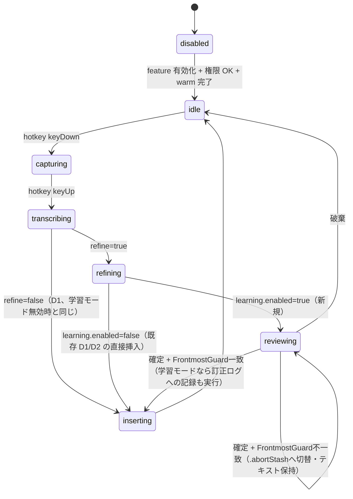

# 27. ディクテーション学習モード（D3）詳細設計

`docs/design/25-dictation-mode.md` §10（R11）が「Phase 4 完了後の研究テーマ」として保留した D3（学習モード /
活用モード / コンテキスト自動成長）の詳細設計。

**先行実装済みの型について**: 本文書 §5.1・§8.2 が要求する「`DictationRefiner` の戻り値から成功/フォールバック
を判別できるシグネチャ変更」は、`docs/design/29-dictation-history.md`（DH4・§4.3）の `DictationRefineOutcome`
がこの文書より先に導入した場合、そのまま流用する（`outcome.succeeded` で判別）。本文書の実装着手時は
`DictationRefineOutcome` が既に存在するか確認し、存在すれば新規に型を起こさずそれを使うこと。

**位置づけ**: 本文書はまだ Go/No-Go 前の詳細設計段階であり、実装はしていない。kikimi.md の開発方式
（`docs/development-process.md` 2 章）どおり、詳細設計 → セルフレビュー → ユーザーの Go/No-Go を経てから
実装フェーズに入る。

**方針転換（v2）**: 初版は Kikimi 自身が訂正の差分から規則を一般化し（頻度しきい値による昇格・信頼度・
減衰）、`DictationRefiner` の system prompt へ自動注入するところまでを担う設計だった。レビュー
（`kikimi-design-review` skill）でこの部分の実装難度・安全性リスクを複数指摘され、さらにユーザーから
「誤った書き起こしをコンテキストに落とし込む一般化は Kikimi 内部でやろうとすると非常に難しい」という
指摘を受けた。これを踏まえ、**Kikimi は訂正の事実（整形結果とユーザーの確定テキストの組）を JSONL に
記録するだけに留め、規則の一般化・信頼度判断・コンテキストへの反映は Kikimi の外（別のコーディング
エージェント等）に委ねる**方針へ転換した。これにより §10 が挙げた 4 つの論点のうち「一般化可能性」
「誤った規則の固着」「コンテキスト単調増加」の 3 つは、Kikimi 側で解こうとする対象そのものが無くなり
解消される（Kikimi は一般化・自動適用を一切行わないため）。残る「学習判定タイミング」（学習モードでの
明示的な「確定」操作のみを記録トリガにする）はそのまま踏襲する。

## 1. 目的とスコープ

`docs/design/25-dictation-mode.md` §10 に記録されたユーザーの構想（音声から直接挿入せず、いったん
フォーカスを奪わないフローティングウィンドウに LLM 整形結果を出し、ユーザーが訂正できる。「確定」で
対象アプリに挿入する）のうち、**レビュー UI と挿入のフロー**はそのまま実装する。一方「訂正箇所を機械的に
差分抽出して LLM に認識させ、コンテキストを自動成長させる」という後半部分は、上記の方針転換により
「**確定 = 整形結果と異なるなら、その発話をまるごと 1 レコードとして `corrections.jsonl` に追記する**」
という最小限の記録機能に置き換える。

対象は D2（`dictation.refine == true`）のみ。整形なし（D1 相当）では比較対象の `refined_text` が無いため
記録は成立しない。

**外部コンシューマとの分界**: `corrections.jsonl` を読んでパターンを一般化し、`context.md`（会議側）や
`dictation` の事前知識、あるいは Kikimi 自身のプロンプトを調整するのは、**Kikimi の外で動く別のツール
（コーディングエージェント等）の仕事**であり、本文書のスコープではない。Kikimi 側の責務は「訂正の事実を
欠落なく・改ざんなく記録すること」だけに絞る。

**Chirami に前例なし（UX 部分）**: `docs/references/chirami-map.md` にディクテーション・ホットキー・
AX ガードいずれの前例もない（Chirami はフローティングノートアプリで、ディクテーション機能自体を持たない）。
本文書のレビュー UI（`.reviewing` 状態・`DictationOverlayPanel` のレビューモード・key window 競合対応）は
Kikimi 固有の新規実装である。一方、**訂正ログの追記実装自体には Kikimi 内に直接の前例がある**（§5）。

## 2. 決定事項

| # | 決定 |
|---|------|
| L1 | 学習モードのトリガはホットキーを増やさず、**単一の設定トグル `dictation.learning.enabled`** にする。ON の間は既存の 1 つのホットキーによる発話すべてが「確認してから挿入」フローを通る。OFF なら D1/D2 と完全に同じ即挿入のまま。第 2 ホットキー案（発話ごとに学習/活用を切り替える）は複雑さに見合わないため見送る（§9） |
| L2 | 確認 UI は新規ウィンドウを作らず、既存の `DictationOverlayPanel`（`Kikimi/Dictation/DictationOverlayPanel.swift`）を拡張する。§10 の想定どおり、R5 の誤爆退避パネルがそのまま学習モードの土台になる |
| L3 | **（レビューで改定）** 「確定」時の挿入先の判定は、既存の退避パネルの `[挿入]`（`DictationOverlayPanel.swift:104` `handleInsert()`、無検証）とは**揃えない**。`.abortStash` の無検証は「押下から挿入までが短時間」という前提の上に成り立つラショナール（§8 既存記述）だが、`.reviewing` は §3 のとおり**任意時間**パークされ、その間にユーザーが別アプリへ切り替えて戻る可能性がある。よって確定操作は、D1/D2 の直接挿入経路と同じ**`FrontmostGuard` 再検証込みの `DictationInserter.insert(text:capturedTarget:method:)`**（無検証の `performInsert` ではない）を通す。不一致なら既存の `.abortStash` オーバーレイへ切り替えてテキストを保持したまま再確認を求める。その**2 回目**の `[挿入]` だけは無検証のままでよい（そこでは押下から `orderOut` までが再び短時間に戻るため、既存 R5 ラショナールがそのまま当てはまる）。**挿入の実行順序**（`handleInsert()` の「挿入 → `orderOut`」をそのまま踏襲せず「パネルを先に隠す → 一呼吸置く → 挿入する」に変更する点）は維持する（レビューは編集必須で自パネルが一時的に key window になり得るため。詳細は §4.1） |
| L4 | **（v2 で全面改定）** 差分のスパン抽出・正規化・一般化は一切行わない。確定時、`confirmed_text != refined_text` であれば、**発話単位でそのまま**（部分文字列に分解せず）1 レコードとして記録する。「どの部分が訂正パターンとして意味があるか」の判断は Kikimi 側では下さない——それこそが方針転換の理由（§ 冒頭）である |
| L5 | **（v2 で全面改定）** 記録は**無条件・即時**（頻度しきい値・昇格の概念を廃止）。1 回だけの訂正でもそのまま記録する。「過学習の防止」は Kikimi の関心事ではなくなる（Kikimi は規則化しないため過学習という概念自体が存在しない） |
| L6 | **（v2 で全面改定）** ログは`confidence`/`enabled`/減衰のいずれも持たない、**追記専用（append-only）のイミュータブルな JSONL**。1 レコード = 1 訂正。既存 `transcript.jsonl`/`refined.jsonl` と同じ「1 行 = 1 レコード、追記のみ、rewrite しない」の流儀（kikimi.md 5 章）にそのまま合わせる（§5） |
| L7 | **（v2 で削除）** system prompt への自動注入は行わない。`DictationRefiner` の system prompt（`DictationRefiner.swift:37`）は D2 のまま変更しない。記録したデータをどう活かすかは Kikimi の外側の仕事（§1） |
| L8 | 記録シグナルは学習モードでの明示的な「確定」操作のみ。活用モード（L1 が OFF、または D1 の整形なし経路）は `corrections.jsonl` に一切書き込まない。「訂正しなかった＝暗黙の受理」は記録トリガにしない（§10 論点 4 への回答） |
| L9 | ログは `~/.local/state/kikimi/dictation/corrections.jsonl`。ディクテーションはセッションを持たない（`docs/design/25-dictation-mode.md` R1）ため `sessions/` 配下には置かない |
| L10 | D2 の整形呼び出しがタイムアウト/エラーで raw STT にフォールバックした発話（R9、`DictationRefiner.swift:78-84`）は、レビューパネルには通常どおり表示する（「確認してから挿入」という UX 自体は refine の成否と無関係に保ちたいため）が、**記録の対象からは除外する**。フォールバック時の `refined_text` は LLM 整形結果ではなく raw STT そのものであり、これを「整形結果への訂正」として記録すると意味が変わってしまう |

## 3. UX フロー



- `.reviewing` は新規の `DictationState` ケース（既存は `disabled/idle/capturing/transcribing/refining/inserting`。
  `Kikimi/Dictation/DictationController.swift:22`）
- `.reviewing` の間、新しい keyDown は既存の再入防止（`DictationHotkeyDownDecision.decide`、状態が `.idle` 以外は
  `.ignore`）にそのまま従う。**確認待ちのまま次の発話は開始できない**。1 発話ずつ確定/破棄させる制約は
  意図的（同時に複数の確認パネルを持たない設計を単純に保つ）。実戦で窮屈さが出れば Phase 4 後に見直す
  （§9 既知の割り切り）
- **`.reviewing → .idle` の配線**: `refining → reviewing` の遷移は既存の `handleHotkeyUp()`
  （`DictationController.swift:286`）が担う。今日の実装は `insert(...)` を呼んだ直後に無条件で
  `self.state = .idle` を設定する（`DictationController.swift:347`）ため、`.reviewing` を挟む余地が無い。
  学習モードでは `handleHotkeyUp()` を `.reviewing` で止め（挿入を実行せずに）、`state` を `.reviewing` の
  まま任意時間（ユーザーがパネルを操作するまで）保持し、パネルの `[確定]`/`[破棄]` ボタンだけが
  `.idle` へ戻す。この配線の具体的な実装方式は §4.2 で規定する
- **確定時の frontmost 再検証（L3 改定・レビュー指摘対応）**: `.reviewing` は任意時間パークされるため、
  `[確定]` を押した瞬間の frontmost が、そのままユーザーが意図した挿入先だとは限らない（レビュー中に
  別アプリへ切り替えて戻ってきているかもしれない）。よって確定時は §4.1 で規定する
  `DictationInserter.insert(text:capturedTarget:method:)`（`FrontmostGuard` 再検証込み）を通す。
  一致すれば `inserting` へ進んで通常どおり挿入する。**不一致でもテキストは失わない**——
  `.reviewing` へ留まったまま（上のダイアグラムの `reviewing --> reviewing` 自己遷移）、既存の
  `.abortStash` オーバーレイ表示（`show(text:method:)`、無検証の `[挿入]`/`[コピー]`/`[閉じる]`）へ
  切り替えて `confirmedText` を再提示する。詳細な配線は §4.2
- 破棄時、テキストは失われる（**誤爆退避（R5）とは異なる**。誤爆は「ユーザーの意図に反してフォーカスが
  ずれた」事故なので失ってはいけないが、学習モードの「破棄」は「この発話は要らなかった」というユーザーの
  能動的な判断なので、クリップボードへの退避は行わない）
- **`.reviewing` 中に `dictation.enabled` が OFF にされた場合**: `DictationController` の既存の
  feature 無効化ハンドラ（`handleEnabledChanged(false)` 相当）は `state = .disabled` にして
  `transcriber` を破棄するだけだが、この遷移が `.reviewing`（パネルが開いていて確認待ち）の最中に
  起きるケースを明示的に扱う。R5 の「テキストは絶対に失わない」を学習モードにも一貫させ、**パネルを
  強制的に閉じて（`onComplete` は呼ばず）、表示中のテキストをクリップボードへ退避してからログを残す**
  （D1 の誤爆退避と同じ扱い。ユーザーが能動的に破棄したわけではなく、feature 無効化という別の操作に
  巻き込まれただけなので、破棄時とは異なりテキストを失わない）。`state` はそのまま `.disabled` に進める

## 4. `DictationOverlayPanel` の拡張（L2）

`DictationOverlayView`（`Kikimi/Dictation/DictationOverlayPanel.swift:19`）に表示モードを追加する。

- `enum DictationOverlayMode { case abortStash; case review }` を導入
  - `.abortStash`: 既存 D2 の挙動そのまま（読み取り専用 `Text` + `[挿入]`/`[コピー]`/`[閉じる]`）
  - `.review`: 編集可能（`TextEditor` に置き換え）+ `[確定]`/`[破棄]`/`[コピー]`。`[確定]` は
    `DictationInserter.performInsert` を**直接は呼ばない**。まずパネルを隠して key を手放し、
    `DictationController` へ確定を通知するコールバックを呼ぶだけにとどめる（挿入とログ記録は
    `DictationController` 側の責務にする）。詳細な順序とその理由は §4.1、コールバックの型は §4.2
- `DictationOverlayPanelController.show(text:method:)` に `show(review refinedText: String, method:, onComplete:)`
  を追加する形で、既存の `show(text:method:)`（誤爆退避用）とはシグネチャを分ける。内部状態
  `DictationOverlayState` に `mode` と、編集前の原文（記録の "before" 側）を保持するフィールドを足す。
  `onComplete` の型と `DictationController` 側の受け口は §4.2 で規定する
- パネルは単一インスタンス（既存どおり）。誤爆退避と学習レビューが同時に開くことはない（両者とも
  1 発話につき高々 1 回、`.reviewing`/`.inserting` の状態下でのみ発生するため排他）

### 4.1 key window 競合と挿入順序（L3 追補）

**問題**: 既存の誤爆退避（`.abortStash`）用途の `handleInsert()`（`DictationOverlayPanel.swift:104`）は、
`[挿入]` を押した瞬間に `performInsert()` → `window?.orderOut(nil)` の順で実行する。`.abortStash` は
読み取り専用 `Text` 表示 + ボタンのみで、パネル上でユーザーがキー入力を行う場面が本来ないため、この順序
でも実害が出にくかった。

`.review`（本文書の D3）は TextEditor での実編集が §4 の必須要件であり、キー入力を受け取るには
nonactivating panel であってもその瞬間だけは実際の system key window にならざるを得ない
（`FloatingPanel` は `canBecomeKey = true`・`FirstMouseHostingView` で明示的にそれを許容している）。
`handleInsert()` の順序をそのまま踏襲すると、`[確定]` を押した直後（まだ自パネルが key の可能性がある
タイミング）に合成挿入イベントを post することになり、挿入イベントが外部アプリではなく Kikimi 自身の
レビューパネルに入ってしまうリスクが構造的に存在する。`nonactivatingPanel` は
`NSWorkspace.frontmostApplication` を変えない設計だが、実際のキーボードイベントルーティングは system の
key window に従うため、`FrontmostGuard`（`NSWorkspace` pid + AX focused element ベース）はこの状態変化を
原理的に検知できない。`_spike/dictation-paste` の実証はこのシナリオ（自分の nonactivating panel が key を
持った直後の挿入）を検証しておらず、`handleInsert()` の順序はこのシナリオに関して未検証のまま踏襲されて
いた。

**対応**: `.review` モードの確定操作は、順序を反転する（Raycast/Alfred 等が採る定石）。

1. `[確定]` 押下時、まずパネルを `orderOut(nil)` で隠し、key を手放す
2. 短い遅延（既定 150ms、`DictationInserter.insertViaPasteboard` が使う
   `DispatchQueue.main.asyncAfter`（`DictationInserter.swift:134`）と同じ手段で実装し、system が
   key window を直前の frontmost アプリへ戻す時間を確保する。値は §4.1 の実機検証で調整する）
3. 遅延後に `DictationController` へ確定を通知し（§4.2 のコールバック経由）、`DictationController` 側で
   `performInsert()` ではなく **`DictationInserter.insert(text:capturedTarget:method:)`**（D1/D2 の直接挿入
   経路が使っているのと同じ、`FrontmostGuard` 再検証込みの関数）を実行する

**`FrontmostGuard` の再検証はする**（L3 改定・レビュー指摘対応。当初は「L3 の元の決定を維持」としていたが、
その決定は `.abortStash` のような**短時間で終わる**退避パネルの `[挿入]` を前提にした R5/§8 のラショナール
（`docs/design/25-dictation-mode.md` §8「ユーザーが明示的に押した瞬間の frontmost を意図とみなす」）を、
§3 で明記のとおり**任意時間パークされる** `.reviewing` にそのまま横流ししていた誤りだった。`.reviewing` 中に
ユーザーが別アプリへ切り替えて戻ってくると、確定ボタン押下時の実 frontmost は元の挿入先と無関係になり得るため、
検証なしに `performInsert` するのは R5 が防ごうとした誤爆をここで再導入することになる）。

再検証の基準は「確定ボタンを押した時点」ではなく、**hotkey keyDown/keyUp 時にキャプチャした `capturedTarget`**
（既存の `DictationController.capturedTarget`。D1/D2 の直接挿入経路が使っているものと同一）のままとする——
`.reviewing` に入る前後で `capturedTarget` を更新する必要はない。`DictationInserter.insert` は内部で
`captureTarget()` を再度呼んで「今」の frontmost/AX focused element を取り、`FrontmostGuard.decide` で
`capturedTarget` と突き合わせる。

- **一致**（`.insert`）: そのまま挿入する。以降の挙動は非学習モードの直接挿入経路と同じ
- **不一致**（`.abortAndStash`）: `DictationInserter.insert` は既にテキストをクリップボードへ退避する。
  `DictationController` はこれに加え、**`.reviewing` の状態から `.abortStash` オーバーレイ
  （`show(text:method:)`。既存の誤爆退避表示）を再表示**して `confirmedText` を保持したまま提示する
  （§3 の `reviewing --> reviewing` 自己遷移）。ここでのみ、`.abortStash` の `[挿入]`
  （無検証の `performInsert`）を押すユーザー操作が、押下から `orderOut` までの短い一呼吸で完結する
  **新しい単発の確定意思表示**になる——つまり R5 の元のラショナール（短時間パネルの `[挿入]` は無検証で
  よい）が本来当てはまるのはここであって、`.reviewing` の `[確定]` ではない、という整理になる

変わるのは「隠す/挿入の順序」だけでなく「判定するかどうか」も変わる点に注意——L3 の当初案からの改定である。

既存の `.abortStash` 用途は本文書のスコープ外（`docs/design/25-dictation-mode.md` 側）だが、同じ穴を
理論上抱えている。読み取り専用表示のみで実害の発生確率が低いため本文書ではその変更までは強制しないが、
一貫性のため同じ「隠す→遅延→挿入」順序へ揃えることは将来のフォローアップとして別途検討する。

**Go 条件**: この順序変更（隠す→遅延→挿入）を採用してもなお、「nonactivating panel が key を保持した
直後の挿入」という具体的シナリオは実機で検証されていない。**本文書の実装（Go/No-Go 後の実装フェーズ）着手前に、
この順序で小さな検証（Chromium 系 1 アプリ + ネイティブ 1 アプリ程度の最小構成でよい）を行い、挿入が
外部アプリへ正しく届くことを確認する**ことを本文書の Go/No-Go 条件に加える。検証で問題が見つかった場合は、
遅延時間の調整、または挿入直前に `NSApp` のアクティブ状態を再確認するなど、より強い key 委譲手段の検討に進む。

### 4.2 `.reviewing → .idle` の配線

`DictationController.state` は `private(set)`（`DictationController.swift:80`）であり、
`DictationOverlayPanelController` は現状 `DictationInserter` の参照しか持たない
（`DictationOverlayPanel.swift:65-83`）。学習レビューでは `handleHotkeyUp()`（`DictationController.swift:286`）
が `.reviewing` で止まり、任意時間（パネル操作待ち）その状態に留まる必要があるため、パネルからコント
ローラへ戻す具体的な経路をここで規定する。

```swift
/// The outcome `DictationOverlayPanelController` reports back to `DictationController` once the
/// user finishes the review step. The panel itself never performs the insert (§4.1) -- it only
/// hides itself, waits a beat, and hands the result back.
///
/// Carries only `confirmedText` (レビュー指摘対応: 以前の草案は `rawText`/`refinedText`/
/// `refinedSuccessfully` も `.confirmed` に載せていたが、`show(review:method:onComplete:)` はこれらを
/// 受け取っておらずパネル側に取得手段が無かった -- 実装不可能なシグネチャだった). Those three values
/// never leave `DictationController`'s own `Task` in the first place (they're already local to the
/// closure that calls `show(review:...)`), so the panel doesn't need to round-trip them back.
enum DictationReviewOutcome {
    case confirmed(confirmedText: String)
    case discarded
}

extension DictationOverlayPanelController {
    /// Learning review flow (D3). Unlike `show(text:method:)` (abort-stash, fire-and-forget),
    /// review must report back to `DictationController` because `handleHotkeyUp()` parks in
    /// `.reviewing` for an arbitrary, user-controlled duration and only this panel's 確定/破棄
    /// button knows when that duration ends.
    func show(
        review refinedText: String,
        method: DictationInsertMethod,
        onComplete: @escaping (DictationReviewOutcome) -> Void
    )
}
```

`DictationOverlayPanelController` 側の `[確定]`/`[破棄]` ハンドラは、§4.1 の順序に従ってパネルを隠して
から `onComplete` を呼ぶ（`onComplete` はハンドラ内で 1 回だけ呼び、以降 `nil` にする）。

`DictationController.handleHotkeyUp()` は、`config.refine && config.learning.enabled` のとき、既存の
「`self.state = .inserting; performInsert(...); self.state = .idle`」の直列実行をやめ、以下に置き換える。
`rawText`/`refinedText`/`refinedSuccessfully`/`model`/`capturedTarget` はいずれもこのクロージャの外側
（`handleHotkeyUp()` の `Task` 本体、既存コードのまま）で既に確定している値をキャプチャしたものであり、
`DictationReviewOutcome` からは受け取らない（上記のコメントのとおり）。

**挿入位置（スコープの注意）**: 下のコード例はこの分岐だけを単独で示しているが、実際には現行の
`handleHotkeyUp()`（`DictationController.swift:322-334`）が持つ**既存の `if config.refine { ... }`
ブロックの中**、`trimmedRefined`（＝ `refinedText`）と `model` を計算した**直後**に置く。この分岐は
新しい独立した if ではなく、既存ブロックの末尾（`self.state = .inserting; let outcome = ...` の 2 行）を
「`learning.enabled` なら以下のレビュー分岐、そうでなければ既存どおり」という条件で置き換える形になる。
`trimmedRefined`/`model` はこのブロックのローカル変数のままで、外へ持ち出す必要はない（新しいプロパティは
増やさない）。

```swift
if config.refine, config.learning.enabled {
    self.state = .reviewing
    self.overlayPanelController().show(
        review: trimmedRefined,
        method: config.insertMethod
    ) { [weak self] outcome in
        guard let self else { return }
        switch outcome {
        case .discarded:
            self.capturedTarget = nil
            self.state = .idle
        case let .confirmed(confirmedText):
            self.state = .inserting
            // L3 改定（§4.1）: `.reviewing` は任意時間パークされ得るため、確定時も D1/D2 の直接挿入経路と
            // 同じ `FrontmostGuard` 再検証込みの `insert(text:capturedTarget:method:)` を通す
            // （`performInsert` を直接は呼ばない）。`capturedTarget` は hotkey keyDown/keyUp 時点のまま
            // ——`.reviewing` に入る前後で更新しない。
            let insertOutcome = self.inserter.insert(
                text: confirmedText,
                capturedTarget: capturedTarget,
                method: config.insertMethod
            )
            if insertOutcome == .abortedAndStashed {
                // 不一致: テキストを失わず、既存の .abortStash 表示へ切り替えて再提示する（§4.1・§3の
                // reviewing --> reviewing 自己遷移に相当。DictationInserter.insert が既にクリップボード
                // へも退避済み）。ここでの再挿入は .abortStash の無検証 [挿入] に委ねる。
                self.overlayPanelController().show(text: confirmedText, method: config.insertMethod)
                self.capturedTarget = nil
                self.state = .idle
                return
            }
            self.capturedTarget = nil
            self.state = .idle
            // §5.2: DictationCorrectionLogger は actor（async throws）。書き込み失敗を握りつぶさず
            // 呼び出し元へ伝播させて `.error` ログを出すが、挿入は既に完了しているので待たない
            // （fire-and-forget な子 Task。state 遷移も log 書き込みの完了を待たない）。
            // record(...) 自身が refinedSuccessfully==false / confirmedText==refinedText の場合に
            // 記録しない判断を内部で行う（§5.1・§5.2。呼び出し側で `if` ガードしない）。
            Task { [weak self] in
                guard let self else { return }
                do {
                    try await self.correctionLogger.record(
                        rawText: rawText,
                        refinedText: refinedText,
                        confirmedText: confirmedText,
                        refinedSuccessfully: refinedSuccessfully,
                        model: model
                    )
                } catch {
                    self.logger.error("dictation correction log write failed: \(String(describing: error), privacy: .public)")
                }
            }
        }
    }
    return
}
// existing config.refine == false / learning.enabled == false path: unchanged direct insert
```

`refinedSuccessfully` は `DictationRefiner.refine` の呼び出し元（`handleHotkeyUp()` 内、既存の
`config.refine` ブロック）で判定する。現状の `refine(rawText:model:timeoutMs:)` はフォールバック時も
（例外を投げず）raw テキストをそのまま返す関数なので（R9）、呼び出し側で「返ってきた文字列が
`trimmedRaw` と一致するか」で判定するのではなく、**`DictationRefiner.refine` の戻り値を
`Result<String, DictationRefinerFailure>` 相当に変え、成功/フォールバックを呼び出し元が判別できるようにする**
（現状のシグネチャ変更が必要。`Kikimi/Dictation/DictationRefiner.swift:62` の doc コメントと合わせて
実装時に確定する）。

これにより `.reviewing` に入った Task は `onComplete` が呼ばれるまで完了せず（`Task` 自体は
`await` で止まらず即座にリターンする点に注意——状態遷移はコールバック経由で非同期に起きる）、
`DictationController` は `.reviewing` の間じゅう新しい keyDown を `DictationHotkeyDownDecision.decide`
の再入防止で弾き続ける（§3 と同じ）。`onComplete` が万一呼ばれないまま（パネルが強制終了されるなど）
残ると `.reviewing` に固着し以後のホットキーがすべて無視される事故になるため、`DictationOverlayPanelController`
はパネルの `windowWillClose` 相当のタイミングでも未消化の `onComplete` を `.discarded` として必ず一度は
呼ぶフォールバックを持つ（レイヤ 1 のテスト対象、§8）。

## 5. 訂正ログの記録（L4・L5・L6・L9・L10）

### 5.1 レコード形式

`~/.local/state/kikimi/dictation/corrections.jsonl`。1 行 = 1 訂正（JSON Lines）。**追記のみ、決して
rewrite しない**（kikimi.md 5 章の `transcript.jsonl`/`refined.jsonl` と同じ流儀）。

```json
{"id": "corr_00001", "recorded_at": "2026-07-09T10:15:32Z", "raw_text": "きき身について話しましょう", "refined_text": "きき身について話しましょう。", "confirmed_text": "Kikimiについて話しましょう。", "model": "claude-haiku-4-5-20251001"}
```

| フィールド | 型 | 説明 |
|-----------|-----|------|
| `id` | string | `corr_` + 5 桁ゼロ埋め連番（`transcript.jsonl` の `seg_NNNNN` と同じ書式）。**採番元は異なる**——詳細は本節末尾 |
| `recorded_at` | string | ISO8601。確定操作が行われた実時刻 |
| `raw_text` | string | STT の生出力。`DictationTranscriber.finishUtterance()` の戻り値そのものではなく、`handleHotkeyUp()` が前後の空白を除去した後の `trimmedRaw`（`DictationController.swift:313`）——実際に `DictationRefiner.refine` へ渡された値と一致させる |
| `refined_text` | string | `DictationRefiner.refine` の整形結果（フォールバックでない、L10 でフィルタ済み） |
| `confirmed_text` | string | ユーザーがレビューパネルで編集・確定した最終テキスト（実際に挿入された文字列） |
| `model` | string | `refined_text` を生成した実際のモデル名（`DictationRefiner.resolveModel` の解決後の値） |

`raw_text` まで含めるのは、外部コンシューマが「STT の誤認識」「LLM 整形の誤り」「ユーザーの好みによる
言い換え」を区別できるようにするため（3 者の関係が分かって初めて、どの段（STT の辞書・整形の system
prompt・ディクテーション用の事前知識等）を調整すべきかを外部ツールが判断できる。§1 の「原テキストを
調整させる」という利用意図に対応する）。

**記録条件（L4・L5・L10）**: `refinedSuccessfully == true`（フォールバックでない）かつ
`confirmed_text != refined_text`（実際に訂正があった）ときのみ、**無条件・即時**に 1 レコードを追記する。
スパン抽出・正規化・頻度しきい値・一般化は一切行わない（L4/L5）。「意味のある訂正か」の判断はしない
——それを Kikimi 内で判断しようとすること自体が §ヘッダの方針転換の理由である。この 2 条件を実際に
**どこが**判定するかは次段落（「責務の所在」）で規定する。

**責務の所在（レビュー指摘対応）**: この 2 条件の判定は `DictationCorrectionLogger.record(...)`
**自身**が持つ（§4.2 の呼び出し側では `if` ガードしない）。そのため `record(...)` のシグネチャは

```swift
func record(
    rawText: String,
    refinedText: String,
    confirmedText: String,
    refinedSuccessfully: Bool,
    model: String
) async throws
```

とし、`refinedSuccessfully == false` または `confirmedText == refinedText` のときは**書き込まずに正常
リターンする**（呼び出し元は毎回同じ形で呼べばよく、`DictationController` 側に判定ロジックを複製しない）。
以前の草案は `record(...)` が `rawText`/`refinedText`/`confirmedText`/`model` のみを受け取り、判定は
呼び出し側が行う前提と、`record(...)` 自身が判定する前提が §4.2/§8 で食い違っていた
（`refinedSuccessfully` を渡す経路が無いまま `record(...)` 単体のテストを書けと §8 が要求していた）。
上記シグネチャでこの矛盾を解消する。

**id 採番（レビュー指摘対応）**: `transcript.jsonl` の `seg_NNNNN` はセッションごとに `meta.json` の
`meta.segmentCount`（永続化されたカウンタ）から連番を復元する
（`Kikimi/SessionStore/SessionHandle+Transcript.swift:34-63`）。`corrections.jsonl` は §5.3 のとおり
専用のメタファイルを持たないため、同じ方式は使えない。素朴な in-memory カウンタ（0 から起動のたびに数える）
では、アプリ再起動のたびに `corr_00001` から採番し直し、既存行の `id` と重複してしまう。

`DictationCorrectionLogger` は、初期化時（`init`/`actor` の生成時、まだ 1 件も `record` が呼ばれる前）に
**`corrections.jsonl` の既存内容を読み、記録済みの最大 `id` 番号を求めて次の連番の起点にする**。

- ファイルが存在しない場合は 0 番から開始（最初の `record` が `corr_00001` を書く）
- ファイルが存在する場合は全行を読み、各行を JSON デコードして `id` の数値部分（`corr_` 接頭辞を除いた
  5 桁）を取り出し、**成功した行のうちの最大値**を採用する（末尾 1 行だけを見るのではなく全行から最大を
  取る。異常終了直後に追記が途中で切れた末尾行が壊れていても、それより前の正常な行から復元できるように
  するため——`corrections.jsonl` はセッションを持たず、`meta.json` 相当のクラッシュ復旧手続きが無い分、
  ファイル自体の内容から自己復元できる形にしておく）
- デコードに失敗した行（末尾の破損行など）は `.warning` ログを出して無視し、カウンタ復元には使わない
- この走査ロジックは pure 関数として切り出す（例:
  `DictationCorrectionLogger.nextSequence(afterParsingExistingLines: [Data]) -> Int`）ことで、レイヤ 1 の
  テストがファイル I/O なしに「空ファイル→1」「正常行 N 件→N+1」「末尾破損行→無視して復元」を検証できる
  ようにする（§8）

### 5.2 実装（既存 `AppendOnlyLogFile` パターンの流用）

`transcript.jsonl`/`refined.jsonl` への追記は、`Kikimi/SessionStore/SessionHandle+Transcript.swift` の
以下の実装で行われている。これをそのまま流用する。

- `private final class AppendOnlyLogFile`（`SessionHandle+Transcript.swift:231`）: `FileHandle` を
  **1 回だけ**開き（無ければ `FileManager.createFile` で作成後）、`init` 時に一度だけ `seekToEnd()`
  （`:247`）してそのまま保持する。以降の追記は `write(contentsOf:)`（`:252`）のみで、`seekToEndOfFile()`
  を毎回呼んだり全体を読み直したりしない（`WavFileWriter` と同じ「open once, append only, never seek
  back」設計）
- `private final class AppendOnlyLogFileRegistry`（`:264`）: パスをキーに `AppendOnlyLogFile` を
  キャッシュするシングルトン。キャッシュ辞書への同時アクセスのみ `NSLock` で保護する
- `private func appendLine<T: Encodable>(_ value: T, to fileURL: URL) throws`（`:131`）: 値を
  `SessionJSONCoding.makeEncoder()`（`.iso8601`/snake_case キー戦略）で `Data` にエンコード →
  末尾に改行 1 バイトを付加 → `AppendOnlyLogFileRegistry` 経由の writer で書き込む

**流用にあたっての違い**: 上記は `SessionHandle`（`actor`）のインスタンスメソッドとしてセッション
ディレクトリ内のファイルに書く前提だが、`corrections.jsonl` はセッションに紐付かない
（`~/.local/state/kikimi/dictation/` 配下）。`DictationCorrectionLogger`（新設）が
`AppendOnlyLogFile`/`AppendOnlyLogFileRegistry`/`appendLine` と同じ実装パターンをそのまま複製する形で
持つ（`SessionHandle` に依存させない独立実装。パスがセッション外である以上、`SessionHandle` の
actor 隔離の恩恵を受ける対象でもないため、`DictationCorrectionLogger` 自身を `actor` にして同じ
直列化を確保する）。

**親ディレクトリ作成（レビュー指摘対応）**: 複製元の `AppendOnlyLogFile.init`
（`SessionHandle+Transcript.swift:234-248`）は `fileExists` → `createFile` のみで、親ディレクトリの存在は
呼び出し元（`SessionStore`）が事前に作成済みという前提に依存している（`SessionStore.swift:115` で
`createDirectory` 済み）。`~/.local/state/kikimi/dictation/` は初回起動時には存在しない可能性が高く、
`SessionStore` 相当の「事前にディレクトリを掘る」処理をどこも担わないまま `AppendOnlyLogFile.init` を
複製すると、`FileManager.createFile` は親ディレクトリ不在時に例外を投げず**黙って失敗**する
（`createFile` の戻り値が `false` になるだけ）。したがって `DictationCorrectionLogger` は、
`AppendOnlyLogFile`/`AppendOnlyLogFileRegistry` 相当の初期化より**前に**、`corrections.jsonl` の親
ディレクトリ（`~/.local/state/kikimi/dictation/`）に対し明示的に

```swift
try FileManager.default.createDirectory(at: dictationDirectoryURL, withIntermediateDirectories: true)
```

を呼ぶ（`withIntermediateDirectories: true` なので既に存在していてもエラーにならない。冪等）。この呼び出しは
`DictationCorrectionLogger` の `init`（§5.1 の id 採番用ファイル読み込みとあわせて、最初の I/O として）で
1 回行う。

- エラーハンドリングは既存と同じ方針: 書き込み失敗は握りつぶさず呼び出し元（`DictationController`）へ
  伝播させ、`.error` ログを出す。ただし**訂正ログの書き込み失敗が挿入自体をブロックしてはいけない**
  （kikimi.md 8.5 章の「データは絶対に失わない」は transcript 側の話であり、訂正ログは付随的な記録に
  過ぎないため、優先度は逆になる）。`DictationController` 側は記録呼び出しを `insert(...)`（§4.1・§4.2）の
  **後**に、待たない子 `Task` として行い（§4.2 のコード例）、記録が失敗しても挿入は既に完了しているように
  し、`state = .idle` への遷移も記録の完了を待たない

### 5.3 読み出し・外部公開

- `corrections.jsonl` は**素の JSON Lines ファイル**として `~/.local/state/kikimi/dictation/` 直下に置く
  だけで、Kikimi 側に専用の読み出し API・エクスポート機能は用意しない。外部ツール（コーディングエージェント
  等）が直接ファイルを開いて読む前提（XDG 準拠の公開されたパスであること自体が「読める」ことの担保）
- Kikimi 自身がこのファイルを読み返すのは、Settings UI に件数を表示する用途のみ（§6）。**規則の解釈・
  適用は行わない**

## 6. Settings UI

`Kikimi/Views/SettingsView.swift` の「入力」タブ（`docs/design/25-dictation-mode.md` §6 で追加済み）に
「学習」セクションを追加する。v2 の方針転換により、規則の一覧・信頼度・有効化管理は不要になり、大幅に
軽量化される。

- `dictation.learning.enabled` トグル（説明文: 「ON にすると、整形結果を確認してから挿入します。訂正した
  内容は `corrections.jsonl` に記録されます」）
- 記録件数の表示（例: 「これまでに 42 件の訂正を記録しました」。§5.3 のとおり件数カウントのためだけに
  ファイルを読む）
- 「Finder で開く」ボタン（`corrections.jsonl` の親ディレクトリを `NSWorkspace.shared.activateFileViewerSelectingURL`
  等で開く。外部ツールへの受け渡しを想定した最小限の導線）
- 「ログを消去」ボタン（確認ダイアログ付き。プライバシー上、蓄積した訂正内容をまとめて削除したい場合の
  救済。ファイルを削除するだけで、Kikimi 側の状態には他に影響しない——規則の有効/無効やキャッシュを
  持たないため）

## 7. config スキーマ

`dictation.learning` セクションを新設する。既存の partial デコード + warning フォールバックの作法に従う。
v2 の方針転換により、しきい値・上限・減衰間隔といった規則エンジン向けのフィールドはすべて不要になった。

```yaml
dictation:
  # ...(既存フィールドは docs/design/25-dictation-mode.md §9 のまま)

  learning:
    enabled: false            # 既定 false。ON で学習モード（確認してから挿入 + 訂正ログ記録）が有効になる
```

- `dictation.refine == false` のとき `learning.enabled == true` は無効（レビュー画面を出す元になる
  `refined_text` が無いため）。Settings UI はこの場合トグルを disabled にし、理由を注記する。**`config.yaml`
  を手動編集して `refine: false` かつ `learning.enabled: true` を両立させた場合**も、§4.2 の
  `handleHotkeyUp()` が `if config.refine, config.learning.enabled { ... }` という 2 条件の AND で
  分岐しているため、`refine == false` なら黙って既存の直接挿入経路に流れるだけで、クラッシュや未定義動作
  にはならない

## 8. テスト方針

kikimi.md のテスト方式（レイヤ 1/2/3）に沿う。v2 の方針転換により、規則エンジン関連（昇格判定・
confidence 導出・減衰・system prompt 注入）のテストはすべて不要になり、テスト対象は「レビュー UX の
配線」と「ログ記録の正しさ」に絞られる。

**レイヤ 1（XCTest/swift-testing）**:

- `DictationCorrectionLogger.record(...)`（§5.1 のシグネチャ、`refinedSuccessfully` を引数に取る）:
  `confirmed_text == refined_text` のときは記録しないこと、`refinedSuccessfully == false` のときは
  記録しないこと（L10）——**この 2 条件の判定は `record(...)` 自身の内部ロジックとして検証する**
  （§5.1 の責務整理どおり。呼び出し元の `if` ガードは存在しない）。それ以外は無条件に 1 レコード追記する
  こと
- `DictationCorrectionLogger` の id 採番: 空ファイルから開始すると `corr_00001` になること、既存の
  正常な行が N 件あるファイルから再初期化すると `corr_(N+1)` から始まること、末尾に破損行があっても
  それより前の正常な行の最大値から復元すること（§5.1 の `nextSequence(afterParsingExistingLines:)`
  相当の pure 関数として、ファイル I/O なしに検証する）
- `DictationCorrectionLogger` の JSONL 追記が既存 `AppendOnlyLogFile`（§5.2）と同じ「1 回開いて
  seekToEnd、以後は write のみ」の実装になっていること（並行呼び出しでも行が混ざらないこと）。加えて、
  親ディレクトリが存在しない状態から初期化しても失敗しないこと（§5.2 の `createDirectory` 呼び出し）
- `DictationOverlayMode` 切り替え時の表示・ボタン構成（`.abortStash` と `.review` で異なるボタン集合が出る
  ことをスナップショットではなく状態ベースで検証）
- `DictationReviewOutcome` のコールバック配線: `[確定]`/`[破棄]` それぞれで `onComplete` が 1 回だけ
  呼ばれること、パネルが閉じられて `onComplete` が未消化のまま残った場合に `.discarded` で必ず 1 回
  呼ばれるフォールバック（§4.2）、`.reviewing` 中に別の keyDown が来ても無視されること。この一連の検証は
  `DictationController`/ホットキー/実マイクを一切経由せず、`DictationOverlayPanelController.show(review:
  method:onComplete:)` を直接呼んでボタン操作をシミュレートするだけで完結する（レイヤ 2 側の制約と切り
  離すため。下記レイヤ 2 の注記参照）
- **確定時の frontmost 再検証（L3 改定・§4.1/§4.2）**: `.confirmed(confirmedText:)` を受けた側の配線が
  `performInsert` ではなく `DictationInserter.insert(text:capturedTarget:method:)` を呼ぶこと、
  `FrontmostGuard.decide` が不一致を返すケースで `.abortStash` オーバーレイへ切り替わり（`state` は
  `.reviewing` を経て `.idle` に戻り）`confirmedText` が失われないこと。`FrontmostGuard.decide` 自体の
  分岐網羅は `docs/design/25-dictation-mode.md` §11 の既存テストで担保済みなので、ここでは「不一致の
  ときに呼ばれる経路」の配線だけを検証すればよい

**レイヤ 2（kikimi-verify skill）**:

- Settings UI の「学習」セクションの到達性（トグル・件数表示・Finder で開くボタンの表示）
- **`.reviewing` への遷移そのものはレイヤ 2 では検証しない**（レビュー指摘対応: 当初案は
  `KIKIMI_STUB_LLM=1` 下で実際にホットキー押下・マイク入力を経て `.reviewing` へ到達させる想定だったが、
  `DictationController`/`DictationAudioInput`/`DictationTranscriber` にはホットキー押下・マイク入力を
  スタブ化する経路（会議側 `KIKIMI_TEST_INPUT` に相当するもの）が無く、`handleHotkeyDown()`/
  `handleHotkeyUp()` は `KeyboardShortcuts` のコールバックからしか呼ばれない `private` メソッドで実機
  ホットキー無しに到達できない。`docs/design/25-dictation-mode.md` §11 が既に「ホットキー発火・挿入
  そのものはレイヤ 2 では検証しない」と明記している既存制約と矛盾させないため、本文書もこれに揃える。
  レビュー UI 自体の到達性・配線はレイヤ 1（`DictationOverlayPanelController` を直接駆動）で担保する
  （新しいスタブ注入フックの追加は §9 のスコープ外）
- §4.1 の Go 条件: `.review` パネル表示中に実際にテキストを編集し `[確定]` を押して、ネイティブアプリ
  および Chromium 系アプリの最低 1 つずつへ正しく挿入されること（自パネルへ挿入イベントが迷い込んで
  いないこと）を、本文書の実装着手前に確認する（§4.1 の Go 条件そのもの）。この確認は実機・人手で行う
  ため、上記の「`.reviewing` 到達の自動化不可」という制約とは別枠（レイヤ 3 に近い性質の確認だが、
  実装着手前の Go 条件として §4.1 に既に位置づけ済み）

**レイヤ 3（実戦・Phase 4 完了後）**:

- 実際に固有名詞・言い回しを訂正し続けて `corrections.jsonl` が育つこと、記録内容が想定どおり
  （raw/refined/confirmed の 3 者）であること
- `.reviewing` 中は次の発話を開始できない制約が実運用で窮屈でないか（§3 の既知の割り切り）
- 外部ツール（コーディングエージェント等）から実際に `corrections.jsonl` を読ませ、原テキスト調整に
  活かせる形式になっているかの実地確認（§1 の利用意図の検証。Kikimi 側の実装というより「フォーマットが
  十分か」の確認）

## 9. スコープ外・既知の割り切り

- **訂正の一般化・規則化・system prompt への自動適用**: v2 の方針転換そのもの。Kikimi は行わない。
  外部ツールの仕事とする（§1）
- **`corrections.jsonl` の解析・可視化 UI**: 件数表示以上のことはしない（§6）。傾向分析や規則抽出は
  外部ツール側の責務
- **第 2 ホットキーによる発話ごとの学習/活用切り替え**（L1）。設定トグルで足りると判断し、まずは作らない。
  Phase 4 の実戦で頻繁な切り替えが要ると分かれば追加検討する
- **`.reviewing` 中の次発話開始の禁止**（§3）。同時に複数の確認パネルを持つ設計は複雑さに見合わないため
  見送る
- **規則の複数マシン間同期**は行わない（他の Kikimi の設定・状態と同じくローカルファイルのみ）
- **レイヤ 2 でのホットキー/マイクのスタブ注入フック**は追加しない（§8）。`.reviewing` への到達を
  `KIKIMI_STUB_LLM=1` のような環境変数駆動で自動検証したくなったとしても、それは
  `docs/design/25-dictation-mode.md` 側のディクテーション全体のテスト基盤の拡張であり、本文書（学習
  モード固有の設計）のスコープを超える。必要になれば別途その文書側で検討する
- **`corrections.jsonl` のサイズ上限・保持期間・機密情報ガバナンス**は設けない。`context.md`（32KB）・
  `summary_template.md`（16KB）と異なり本ファイルにはサイズ上限を設定せず、自動削除・ローテーションも
  行わない（他の state ファイルと同じく「UI から手動削除のみ」の流儀に合わせ、§6 の「ログを消去」ボタンに
  委ねる）。この機能は既定 OFF（opt-in）だが、有効化すると発話の生テキスト（訂正前後）が無期限にプレーン
  テキストで蓄積され、かつ外部ツールに読ませる前提のファイルであることは Settings UI のトグル説明文
  （§6）でユーザーに伝える。暗号化・アクセス制御は行わない（他の Kikimi のローカルファイルと同じ扱い）

## 10. 既存文書との同期

Go/No-Go 後、実装着手時に以下を更新する（設計段階の本文書では変更しない）。

- `docs/design/25-dictation-mode.md` §10・§12・R11: 「詳細設計は `docs/design/27-dictation-learning-mode.md`
  を参照（v2 で訂正ログ記録方式に転換）」の一文を追記（§10 の評価・批判自体は歴史的記録として残す）
- `kikimi.md` 2 章・15 章: 音声文字入力の項目に本文書への参照を追記（`docs/design/25-dictation-mode.md` が
  確定時に行ったのと同じ作法）
