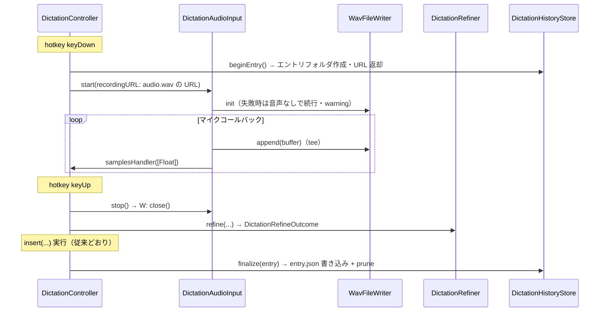

# 29. ディクテーション履歴（音声・テキスト・LLM cost の保存と履歴 UI）詳細設計

ディクテーションの発話ごとに音声（WAV）・raw STT テキスト・整形後テキスト・LLM usage を保存し、
専用ウィンドウで一覧・詳細（音声再生・raw/refined 比較・cost）を確認できるようにする。最大保持数で
ディスク使用量を有界化する。

**位置づけ**: 本文書はまだ Go/No-Go 前の詳細設計段階であり、実装はしていない。kikimi.md の開発方式
（`docs/development-process.md` 2 章）どおり、詳細設計 → セルフレビュー → ユーザーの Go/No-Go を経てから
実装フェーズに入る。

**経緯**: 2026-07-09 のディクテーション実運用で、refine が `missingAPIKey` → `timedOut` で全滅して
raw テキストがそのまま挿入され続けていたにもかかわらず、それに気づく手段が unified log のエラー行しか
なかった。発話・整形の結果と失敗理由を後から確認できる履歴が、デバッグ・品質確認・コスト把握の 3 点で
必要と判断した（ユーザー発案）。

## 1. 目的とスコープ

**やること**:

- 発話 1 回ごとに履歴エントリ（音声 WAV + メタ情報 JSON）を `~/.local/state/kikimi/dictation/history/`
  配下に保存する
- `DictationRefiner` が現状読み捨てている LLM usage（トークン数・cost）を履歴エントリに記録する
- 履歴ウィンドウ（リスト: 日時 + 最終テキスト / 詳細: 音声再生・raw・refined・refine 失敗理由・cost）を
  新設する
- **保持中履歴の合計 cost**（prune で削除済みのエントリは含まない。§6.3）を会議側と同じ
  `LLMUsageBadge` の見せ方で表示する
- config の最大保持数（既定 100 件）で古いエントリから自動削除する

**やらないこと（§10 も参照)**:

- `docs/design/27-dictation-learning-mode.md`（D3 訂正ログ）の変更・統合。`corrections.jsonl` は
  「追記専用・イミュータブル・外部ツールが読む学習データ」であり、「上限付きでローテーションする UI 用
  データ」である本履歴とはライフサイクルが正反対のため、**並存**させる（§8.2）
- 履歴からの再挿入・再整形などの操作系機能（表示・再生・削除のみ）

## 2. 決定事項

| # | 決定 |
|---|------|
| DH1 | 履歴の保存は **`dictation.history.enabled` トグル（既定 `true`）** で制御する。既定 ON にする理由: 本機能の直接の動機が「refine 全滅に気づけなかった」ことであり、opt-in では同じ事故が再発する。会議書き起こしが既定でローカル平文保存される製品性格とも整合する。プライバシー上の含意（発話の生テキスト・音声が平文で残る）は Settings の説明文で明示し、OFF で従来どおり完全ステートレスに戻せる（§7） |
| DH2 | 保存レイアウトはセッションと同じ流儀の**エントリ単位フォルダ** `~/.local/state/kikimi/dictation/history/{ISO8601開始時刻}_{短縮UUID}/`（`audio.wav` + `entry.json`）。JSONL 単一ファイル案は退けた——音声ファイルを持つ以上フォルダは必須で、最大保持数の削除（古いフォルダごと `removeItem`）もフォルダ単位が最も単純。追記専用 JSONL の不変条件（design 27）とローテーションが矛盾する問題も回避できる |
| DH3 | 音声は `DictationAudioInput` 内で `WavFileWriter` へ tee する。`MicrophoneSource` が渡す変換済みバッファ（16kHz mono Float32 standard format、`DictationAudioInput.swift:20-28`）は `WavFileWriter.append` の入力前提（`WavFileWriter.swift:69-71`）と完全一致するため、`SttEngine.extractSamples` の前で `append` するだけでよい（§4.2）。`AudioCapture` は経由しない（sessionDirectory 前提の facade は流用不能、既存コメントどおり） |
| DH4 | `DictationRefiner.refine` の戻り値を `String` から **`DictationRefineOutcome`（整形テキスト + `LLMUsage?` + respondedModel + 失敗理由）** に変える。usage は既に `LLMResult` に載っており（`LLMTypes.swift:50-58`）、現状は `result.value.refinedText` だけ取り出して捨てている（`DictationRefiner.swift:88-89`）。design 27 §5.1 が要求する「成功/フォールバックを呼び出し元が判別できるシグネチャ」もこの変更で同時に満たす（§4.3） |
| DH5 | usage の記録は `UsageRecordingLLM` を流用**しない**。同 decorator は `SessionHandle` 前提（`UsageRecordingLLM.swift:24-29`）で、dictation はセッションを持たない（design 25 R1）。代わりに履歴エントリの `entry.json` に `LLMUsageRecord` 互換の `llm_usage` オブジェクトを埋め込み、集計は既存の pure 関数 `LLMUsageAggregator.summarize(records:configPricing:)` をそのまま使う（§3・§6.3） |
| DH6 | 履歴の書き込み失敗・WAV 書き込み失敗は**挿入・STT を絶対にブロックしない**。WAV writer の失敗は `onFailure` で warning ログを出して以後無視（`WavFileWriter` の既存挙動）、`entry.json` の書き込み失敗は `.error` ログのみ。優先順位は design 27 §5.2 と同じ（履歴は付随的な記録であり、ディクテーションの主機能を止めてはいけない） |
| DH7 | 最大保持数は `dictation.history.max_entries`（既定 100）。**エントリ確定のたびに**古い順に超過分を削除する（prune）。16kHz mono 16bit WAV は約 32KB/秒なので、平均 15 秒発話 × 100 件 ≈ 48MB 程度に収まる |
| DH8 | 履歴 UI は Session List と同じ作法の**独立ウィンドウ**（`WindowManager` に単一キャッシュインスタンス + `showDictationHistory()`、メニューバーから起動）。ただし Session List の「行を開くと別ウィンドウ」方式は踏襲せず、**同一ウィンドウ内のリスト + 詳細ペイン**にする。1 エントリ = 1 発話で軽量なため別ウィンドウは過剰（§6）。コードベースに左右分割の前例は無いが、標準の `NavigationSplitView` で足りる |
| DH9 | 音声再生は既存 `SegmentAudioPlayer.play(segmentId:fileURL:localStartMs:durationMs:)`（`SegmentAudioPlayer.swift:37`）を `localStartMs: 0` で流用する。`SegmentPlaybackResolver` は不要（会議側の複数録音セグメント・累積タイムラインという概念が dictation には無い） |
| DH10 | raw テキストが空の発話（`trimmedRaw.isEmpty`、挿入もされない）はエントリを**残さない**（作りかけのフォルダを削除する）。押し間違いによる 0 秒発話でリストが埋まるのを防ぐ |
| DH11 | 挿入が `FrontmostGuard` 不一致で中止された発話（`.abortedAndStashed`、design 25 R5）も**記録する**。`insert_outcome` フィールドで区別する。「何を話したか」の履歴価値は挿入の成否と無関係 |
| DH12 | refine 無効（D1、`dictation.refine == false`）の発話も記録する。`refined_text` は `null`、`llm_usage` も `null`。リストには最終テキスト（= raw）を表示する |

## 3. データモデル

### 3.1 保存レイアウト

```
~/.local/state/kikimi/dictation/
  history/
    2026-07-10T09-15-32_a1b2c3d4/
      audio.wav        # 16kHz mono 16bit PCM（発話全体）。writer 初期化失敗時は不在もあり得る
      entry.json       # 下記スキーマ。エントリ確定の最後に書く（このファイルの存在 = エントリ有効）
  corrections.jsonl    # design 27（未実装）。本設計では触れない
```

- フォルダ名はセッションフォルダ（`SessionStore`）と同じ `{ISO8601開始時刻（コロンをハイフン化）}_{短縮UUID8桁}`。
  この名前がエントリ ID を兼ねる（連番採番は不要——design 27 §5.1 の id 復元問題そのものが発生しない）
- フォルダ名のタイムスタンプは **UTC**（セッション ID を作る `SessionStore.makeSessionId`
  （`SessionStore.swift:528-537`）と同じ規約）。同関数は `private` のため、命名ロジックを共有ヘルパに
  抽出して両者で使う（複製しない）。これにより §5.2 の「フォルダ名から `recorded_at` を復元」が
  `entry.json` の ISO8601（UTC）と整合する
- `entry.json` を**最後に**書くことで、クラッシュや途中失敗で `audio.wav` だけ残った不完全フォルダを
  「`entry.json` が無い = 無効」として列挙時にスキップ・削除できる（§5.2）

### 3.2 `entry.json` スキーマ

```json
{
  "recorded_at": "2026-07-10T09:15:32Z",
  "duration_ms": 4210,
  "target_bundle_id": "com.google.Chrome",
  "raw_text": "きき身の履歴機能について",
  "refined_text": "Kikimiの履歴機能について",
  "final_text": "Kikimiの履歴機能について",
  "refine_outcome": "success",
  "refine_error": null,
  "insert_outcome": "inserted",
  "llm_usage": {
    "timestamp": "2026-07-10T09:15:33Z",
    "purpose": "dictation",
    "model": "claude-haiku-4-5-20251001",
    "input_tokens": 412,
    "output_tokens": 18,
    "cache_read_input_tokens": 0,
    "cache_creation_input_tokens": 0,
    "reported_cost_usd": null
  },
  "mic_device_name": "MacBook Proのマイク",
  "mic_device_uid": null
}
```

| フィールド | 型 | 説明 |
|-----------|-----|------|
| `recorded_at` | string | ISO8601。hotkey keyDown（発話開始）の実時刻 |
| `duration_ms` | int | 発話長。取り込んだサンプル数の累積 × 1000 ÷ 16000 から算出（カウント位置は §4.2） |
| `target_bundle_id` | string? | keyDown 時の `capturedTarget.bundleId`（挿入先アプリ）。取得できなければ `null` |
| `raw_text` | string | 確定に使った STT 生出力の trim 後（`trimmedRaw`）。design 27 §5.1 の `raw_text` と同じ定義。**追補（`docs/design/31-dictation-two-pass-decode.md` TP7）**: 供給元は二段デコード導入後はバッチ再デコード（フォールバック時はストリーミング）。どちらが供給したかは `raw_source`（`"batch"` / `"streaming"`、旧エントリはキー不在 = streaming 扱い）に、バッチ確定時のストリーミング側テキストは `streaming_text`（診断用、string?）に記録する |
| `refined_text` | string? | 整形結果（成功時のみ）。フォールバック時・refine 無効時は `null` |
| `final_text` | string | 実際に挿入した（しようとした）テキスト。成功時は `refined_text`、それ以外は `raw_text` に一致 |
| `refine_outcome` | string | `"success"` / `"fallback"` / `"disabled"` |
| `refine_error` | string? | `fallback` 時の失敗理由（例: `"missingAPIKey"`, `"timedOut(3.0 seconds)"`）。他は `null` |
| `insert_outcome` | string | `"inserted"` / `"aborted_and_stashed"`（DH11） |
| `llm_usage` | object? | `LLMUsageRecord`（`LLMUsageModels.swift:8-52`）互換。LLM 呼び出しが成功したとき（`refine_outcome == "success"`、および後述の empty refinement フォールバック）のみ。`purpose` は固定値 `"dictation"`——`DictationRefiner` の既存 stubKey `"dictation"`（`DictationRefiner.swift:84`）と一致させる。`LLMUsageRecord.purpose` は「stubKey が purpose ラベルを兼ねる」規約（`LLMUsageModels.swift:10-13`）のため、別名 `"dictation_refine"` を導入して規約を二重化しない |
| `mic_device_name` | string? | **追補（マイクデバイス選択・記録）**: 実際に発話を捕捉したマイクのデバイス名。`dictation.mic_device_uid` が現在の `AudioInputEnumerator.inputDevices()` で解決できればその device の名前、空欄または解決できなければシステムデフォルト入力デバイスの名前（`MicrophoneSource` 自身のフォールバックと同じ挙動、`DictationMicDeviceResolver.resolve(configuredUID:enumerator:)` が `handleHotkeyDown()` 時点で解決する）。この追補より前に記録された `entry.json` には存在しないキーであり、`null` として decode される（後方互換） |
| `mic_device_uid` | string? | **追補**: 解決できた CoreAudio device UID。システムデフォルト入力デバイスを使った場合（`mic_device_uid` が空欄、または解決失敗によるフォールバック）は `null`——`MicrophoneSource.deviceUID == nil` が「システムデフォルト」を意味する規約と揃える |

- `llm_usage` を `LLMUsageRecord` 互換にするのは、集計を `LLMUsageAggregator.summarize` に無改造で
  渡すため（DH5）。encoder/decoder は `SessionJSONCoding` を流用する。`reportedCostUSD` ⇄
  `reported_cost_usd` の acronym 問題は `LLMUsageRecord` の手書き `CodingKeys`（`LLMUsageModels.swift:42-51`）
  が既に解決済みなので、型ごと再利用すれば罠を踏まない
- **`LLMUsage` → `LLMUsageRecord` のマッピング規則は `UsageRecordingLLM.recordUsage`
  （`UsageRecordingLLM.swift:73` 付近）と完全に同一にする**。特に `reportedCostUSD` は
  `usage.totalCostUSD > 0 ? usage.totalCostUSD : nil` の規則を踏襲する——`LLMUsage.totalCostUSD` は
  非 optional で、OpenAI 互換 backend やスタブでは 0 が入るため、これを `reported_cost_usd: 0` として
  書くと `LLMUsageAggregator` が「reported = 0 を確定コスト」として扱い、履歴ウィンドウの cost が
  恒久的に $0 表示になる（本機能の目的「コスト把握」を静かに損なう）。`model` も同様に
  `respondedModel ?? request.model` の優先順位を踏襲する。規則の重複実装を避けるため、
  **`LLMUsage` + `respondedModel` + requested model + purpose + timestamp → `LLMUsageRecord` を組み立てる
  共有 factory（例: `LLMUsageRecord.make(usage:respondedModel:requestedModel:purpose:timestamp:)`）を
  切り出し、`UsageRecordingLLM.recordUsage` と履歴側の両方から使う**（`UsageRecordingLLM` 側は
  リファクタのみで挙動不変）
- `refine_outcome == "fallback"` の場合、LLM は失敗しており usage は原理的に取れない（design 16 の
  「失敗した呼び出しは記録しない」と同じ扱い）。例外は **empty refinement**（LLM 呼び出しは成功したが
  trim 後が空文字で raw を採用した場合、`DictationController.swift:353-356` の既存挙動）: この場合は
  `refine_outcome: "fallback"`・`refine_error: "empty refinement"` として記録し、usage は取得できて
  いるので `llm_usage` に残す。「`success` 時は `final_text == refined_text`」という本表の不変条件を
  守るための整理（§4.4）

## 4. 記録パイプライン

### 4.1 全体フロー



- `history.enabled == false` のときは `beginEntry()` を呼ばず、`recordingURL` も渡さない——現行の
  完全ステートレス動作と 1 バイトも変わらない経路を残す（DH1）
- 図の `beginEntry()` → `start(...)` は、実際には既存の mic 起動 `Task` 内で `await` して直列に実行する
  （`handleHotkeyDown()` 本体は同期関数のため。詳細と競合時の挙動は §4.4）
- `finalize` は挿入完了**後**に、待たない子 `Task` で行う（design 27 §4.2 の訂正ログ書き込みと同じ
  fire-and-forget。`state = .idle` への遷移は履歴書き込みの完了を待たない。DH6）

### 4.2 `DictationAudioInput` の変更（DH3）

- `init(deviceUID:engine:)` に `recordingURL: URL?` を追加（`nil` なら現行どおり）
- `start(samplesHandler:)` 内の `source.start { buffer, _ in ... }` クロージャ（`DictationAudioInput.swift:41-45`）
  で、`SttEngine.extractSamples(from: buffer)` の**前に** `wavWriter?.append(buffer, onFailure:)` を呼ぶ。
  `MicrophoneSource` が渡す `buffer` は変換済み 16kHz mono Float32 standard format であり、
  `WavFileWriter.append` の入力前提と一致する（DH3 の根拠）
- `WavFileWriter` の生成は `start` 時に行い、`init` が throw したら warning ログを出して `wavWriter = nil`
  のまま続行（音声なしエントリになる。DH6）。親ディレクトリはエントリフォルダとして `beginEntry()` が
  作成済み（`WavFileWriter` は親ディレクトリを作らない——`WavFileWriter.swift:61-63` の前提を守る）
- `stop()` で `wavWriter?.close()`（`writerQueue.sync` で in-flight append を待つ既存実装のまま）
- `WavFileWriter.init` の必須引数 `headerFlushInterval` には会議側（`AudioCapture` の config 既定値）と
  同じ値を渡す。発話は短く `stop()` で必ず `close()`（最終ヘッダ書き直し）するため、周期 flush の値は
  実質影響しない——シグネチャ上必須なので値の出所だけ決めておく
- ファイル先頭のドキュメントコメント（"never persists audio to disk"）を「`recordingURL` が渡された
  場合のみ履歴用に WAV を書く（design 29）」へ更新する
- `duration_ms` のサンプル数カウントは **`DictationAudioInput` 内の `source.start` クロージャ
  （tap スレッド側）** でロック付きカウンタに加算し、`stop()` 後に読み出すプロパティとして公開する。
  `DictationController` の MainActor `Task` 内で数える案は採らない——keyUp 時点で in-flight の
  Task ホップ分だけ末尾を取りこぼして `audio.wav` の実長より短くなり、`SegmentAudioPlayer` の停止
  タイマーが `durationMs` で再生を打ち切るため（DH9）尻切れ再生になる

### 4.3 `DictationRefiner` の変更（DH4）

```swift
struct DictationRefineOutcome: Sendable {
    /// The text to insert. Falls back to `rawText` unchanged on any failure (R9 preserved).
    var text: String
    /// `nil` when refinement failed (fell back) -- usage is unobtainable for failed calls.
    var usage: LLMUsage?
    /// The model that actually responded (`LLMResult.respondedModel` ?? requested model).
    var model: String?
    /// Human-readable failure description when the call fell back; `nil` on success.
    var failure: String?

    var succeeded: Bool { failure == nil }
}

func refine(rawText: String, model: String, timeoutMs: Int, resolvedContext: String?) async
    -> DictationRefineOutcome
```

- フォールバック挙動（R9: どんな失敗でも `rawText` を返し、throw を外に伝播しない）は不変。変わるのは
  「成功か・usage は何か・失敗理由は何か」を呼び出し元が知れるようになる点のみ
- `failure` には既存の warning ログに出している `String(describing: error)` と同じ文字列を入れる
  （`refine_error` フィールドの供給源）
- design 27 §5.1 の「`refinedSuccessfully` を判別可能にするシグネチャ変更」はこの `succeeded` で充足
  される。design 27 実装時はこの型をそのまま使えばよい（本設計が先に入る前提。§8.2）

### 4.4 `DictationController` の変更

`handleHotkeyDown()`（`DictationController.swift:240-296`）:

- `beginEntry` は `DictationHistoryStore` が actor のため外部からは `await` が必要であり、
  `@MainActor` 同期関数である `handleHotkeyDown()` 本体からは呼べない。そこで**既存の mic 起動
  `Task`（`DictationController.swift:266` 付近、`DictationAudioInput` を生成して `start` する Task）の
  先頭で、`history.enabled` なら `DictationAudioInput` 生成前に
  `try? await historyStore.beginEntry(startedAt:)` を実行**する。得た `EntryHandle` を
  `self.historyEntryHandle` に保持しつつ `audioFileURL` を `recordingURL` として渡す。actor hop +
  ディレクトリ 1 つの作成分だけ capture 開始レイテンシが増えるが、mkdir はサブミリ秒オーダーであり
  **許容する**（`beginEntry` を nonisolated 同期ヘルパにする案は、store の I/O 直列化を actor 1 本に
  保つ方針を崩すため退けた）。`beginEntry` が throw したら warning ログを出して履歴なしで続行
- 超短押し（`pendingRelease`）経路との競合: keyUp が `beginEntry` / `WavFileWriter` 初期化の完了前に
  到着し、DH10 の空発話削除（`deleteEntry`）が先にフォルダを消した場合、直後の `WavFileWriter` 初期化は
  親ディレクトリ不在で失敗する。これは DH6 のとおり warning ログに縮退して続行する**意図した挙動**で
  あり、追加の同期は入れない（どのみち空発話でエントリは残らない）

`handleHotkeyUp()`（`DictationController.swift:298-372`）:

- keyUp 側の履歴処理のゲートは `history.enabled` の再読みではなく **`historyEntryHandle` の有無**に
  する。発話中に config をトグルされても、begin 済みのエントリは必ず finalize（または削除）まで到達し、
  `entry.json` 無しの残骸を作らない
- エントリを finalize しない早期 return 経路は DH10 の `trimmedRaw.isEmpty`（`:325-330`）だけではない:
  (1) `handleHotkeyDown` の mic start 失敗（`:279-285`）、(2) `handleHotkeyUp` の
  guard let transcriber/capturedTarget 失敗（`:308-311`）、(3) `finishUtterance()` の throw
  （`:317-323`）。個別に削除処理を撒くのではなく、**「`historyEntryHandle` を消費してフォルダを削除する
  単一のクリーンアップ関数」**（`discardActiveHistoryEntry()` 相当）に集約し、これら全経路から呼ぶ。
  超短押し（`pendingRelease`、`:290-294`）で `audioInput` 未代入のまま止まった場合も、keyUp 側は
  同じ経路（空 raw → クリーンアップ関数）に合流する
- refine 経路で `DictationRefineOutcome` を受け、`finalText` の決定は従来と同じ。**refine 成功だが
  trim 後空文字**（`:353-356` が raw を採用する既存挙動）のときは、履歴上は `refine_outcome: "fallback"`
  ・`refine_error: "empty refinement"` として記録する（§3.2 の不変条件「`success` 時は
  `final_text == refined_text`」を守る。usage は取れているので記録する）
- `inserter.insert(...)` の戻り値（`.inserted` / `.abortedAndStashed`）確定後、fire-and-forget な子
  `Task` で `historyStore.finalize(...)` を呼ぶ（§4.1）。渡すもの: エントリ handle、`recorded_at`、
  `duration_ms`、`capturedTarget?.bundleId`、`trimmedRaw`、refine outcome 一式、`finalText`、
  insert outcome。子 `Task` 内で catch して `.error` ログのみ（DH6）。finalize が失敗したフォルダは
  `entry.json` 無しの orphan として残り、後続の prune の orphan 掃除（§5.2）が回収する
- `.reviewing`（design 27、未実装）が将来入った場合の合流点は §8.2 に記す

## 5. `DictationHistoryStore`（新設）

`Kikimi/Dictation/DictationHistoryStore.swift`。`actor`（ファイル I/O の直列化。design 27 の
`DictationCorrectionLogger` と同じ理由）。

### 5.1 API

```swift
actor DictationHistoryStore {
    struct EntryHandle: Sendable {
        var id: String          // フォルダ名 = "{ISO8601(UTC)}_{短縮UUID}"
        var directoryURL: URL
        var audioFileURL: URL   // directoryURL/audio.wav
    }

    /// A row of the history list. Carries `llmUsage` so the footer summary (section 6.3) can be
    /// aggregated from the list without re-reading entry.json files.
    struct ListItem: Sendable {
        var id: String
        var recordedAt: Date
        var finalText: String
        var durationMs: Int
        var refineOutcome: String
        var insertOutcome: String
        var llmUsage: LLMUsageRecord?
    }

    /// Creates the entry directory (and `history/` parents, idempotent), marks it as the active
    /// entry (excluded from prune/deleteAll), and returns its handle.
    /// Actor-isolated: callers hop with `await` (called from the mic startup Task, see section 4.4).
    func beginEntry(startedAt: Date) throws -> EntryHandle

    /// Deletes a begun-but-empty entry (DH10) or an entry the user removed from the list UI.
    /// Best-effort: failures are logged as warnings, never thrown.
    func deleteEntry(id: String)

    /// Writes `entry.json` (making the entry valid), clears the active-entry mark, then prunes
    /// entries beyond `maxEntries` and sweeps orphan folders (section 5.2).
    func finalize(handle: EntryHandle, entry: DictationHistoryEntry, maxEntries: Int) throws

    /// Lists valid entries (has `entry.json`), newest first. Broken entries are logged and skipped.
    func listEntries() -> [ListItem]

    /// Reads one full entry for the detail pane.
    func readEntry(id: String) throws -> DictationHistoryEntry

    /// Deletes everything under `history/` except the active entry (Settings の「履歴をすべて削除」).
    func deleteAll() throws
}
```

- 親ディレクトリ作成は `beginEntry` の先頭で `createDirectory(withIntermediateDirectories: true)`
  （冪等）。design 27 §5.2 が指摘した「`FileManager.createFile` は親不在時に黙って失敗する」罠を
  同じ方法で回避する
- **アクティブエントリの保護**: actor は「`beginEntry` 済みでまだ `finalize`/`deleteEntry` されていない
  エントリ id」を保持し、prune・orphan 掃除・`deleteAll` の削除対象から**常に除外**する。`finalize` が
  fire-and-forget（§4.1）である以上、「直前発話の prune 実行時点で次の発話の begun フォルダ
  （`entry.json` 未作成・WAV 書き込み中）が存在する」「キャプチャ中に Settings の全削除が押される」
  という競合は普通に起こり、除外なしでは進行中の WAV が unlink されて当該発話の履歴が黙って消える
- **throws 方針**: `beginEntry`/`finalize` の失敗は呼び出し元（`DictationController`）が catch して
  warning/error ログのみ（DH6。UI には出さない）。`deleteEntry`/`listEntries` は non-throwing
  （best-effort、失敗は warning ログ）。`deleteAll` の失敗のみ Settings がアラートで表示する
  （ユーザーの明示操作への応答なので黙らない）
- テスト seam: `DictationController` への注入は既存のクロージャ provider 方式
  （`DictationController.swift:128-144`）に合わせ、**protocol（`DictationHistoryStoring`、actor 準拠）**
  として切る。`EntryHandle`/`ListItem` は protocol 側の関連型にせず具象型を共有する（テストスタブが
  同じ型を返せばよい）
- `finalize` 後に通知 `.kikimiDictationHistoryRecorded` を post し、履歴ウィンドウが開いていれば
  ViewModel が再読込する（会議側の `.kikimiLLMUsageRecorded` と同じ配線パターン、
  `MeetingWorkspaceViewModel+LLMUsage.swift:18-25` 参照。sessionId フィルタは不要）

### 5.2 列挙・prune・削除

- 列挙は `SessionStore.listSessions()`（`SessionStore.swift:189-223`）と同じ形: ディレクトリ直下を
  `contentsOfDirectory` → 各エントリの `entry.json` を decode → 壊れた/読めないエントリは個別に
  `.warning` ログしてスキップ → `recorded_at` 降順ソート。ルートが存在しない初回は
  `NSFileReadNoSuchFileError` を通常ケースとして空配列を返す（同 `:194-199` のガードを踏襲）
- **orphan 掃除**: `entry.json` が無いフォルダ（クラッシュ・finalize 失敗等の作りかけ）は列挙時に
  スキップし、prune 実行のたびに**件数と無関係に無条件削除**する（「maxEntries 超過分の削除」とは
  独立の掃除。件数が上限未満でも残骸を無期限に残さないため）。ただし**アクティブエントリは除外**する
  （§5.1——これが「無条件削除が進行中の発話を壊す」競合の防波堤）
- prune: `finalize` のたびに一覧を取り、`maxEntries` を超えた古い順の超過分をフォルダごと
  `removeItem`。1 件の削除失敗は warning ログを出して残りを続行（`SessionListView.performDelete` と
  同じ部分失敗許容）。prune の入力（id・recordedAt・entry.json の有無）はフォルダ名と直下ファイルの
  存在確認だけで導出できるため、`finalize` ごとに各エントリの `entry.json` を decode し直す必要はない
- prune の判定は pure 関数に切り出す（例:
  `DictationHistoryPruning.entriesToDelete(existing: [(id: String, recordedAt: Date, isComplete: Bool)],
  activeEntryId: String?, maxEntries: Int) -> [String]`）。前提条件は `maxEntries >= 1`（不正値の正規化は
  config decode 側の責務、§7.1）。レイヤ 1 テストがファイル I/O なしに境界（ちょうど上限・上限 +1・
  大幅超過・上限 1・orphan とアクティブエントリの混在）を検証できるようにする

## 6. 履歴 UI

### 6.1 ウィンドウ（DH8）

- `WindowManager` に `showDictationHistory()` を追加。Session List / Settings と同じ「単一キャッシュ
  インスタンスの遅延生成」（`WindowManager.swift:293-298` の `showSettings()` がテンプレート）
- `DictationHistoryWindowController` は `SessionListWindowController`（`:40-63`, `:100-131`）を範として
  `FloatingPanel` + `NSHostingView`、位置・サイズ・可視状態を `AppState` に永続化。**新フィールド
  `dictation_history_window` は `KikimiStateData.init(from:)` で `decodeIfPresent` + `.default` に
  する**——既存の `sessionListWindow` は throwing decode（`AppState.swift:218`）だが、同じ作法で足すと
  既存の `state.yaml`（新フィールドを持たない）の load が失敗し、YAMLStore が save 拒否に入る
- メニューバー（`MenuBarMenuView`）に「ディクテーション履歴」項目を追加（`showSessionList()` と同列）
- URL scheme への追加は行わない（必要になったら `KikimiURLRoute` に足す。§10）

### 6.2 リスト + 詳細（`NavigationSplitView`）

`.nonactivatingPanel` な `FloatingPanel` 上に `NavigationSplitView` を載せる前例は Kikimi にも Chirami
にも無く、サイドバー選択・フォーカス挙動に癖が出る可能性がある。実装フェーズの最初に `kikimi-verify` で
スパイクし、問題があれば `HSplitView` + 手組みの List/detail に切り替えてよい（本設計の意図は
「リスト + 詳細の 2 ペイン」であることのみで、実現手段は拘束しない）。

**リスト（左）**: 1 行 = 1 エントリ。`SessionRow`（`SessionListView.swift:382-431`）の 2 段構成を範に:

- 上段: `final_text` の先頭 1 行（省略記号つき）
- 下段: 日時（相対 + 絶対）・発話長・状態アイコン（`refine_outcome` が `fallback` なら警告色、
  `insert_outcome` が `aborted_and_stashed` なら中止アイコン——「refine 全滅」がリストを見るだけで分かる
  ことが本機能の主目的）
- コンテキストメニュー: 「Finder で開く」/「パスをコピー」（対象はエントリフォルダ。書き起こしの問題を
  コーディングエージェント等の外部ツールに調査してもらう受け渡し導線）/ 区切り / 削除（`deleteEntry`、
  破壊的操作なので最後に置く）

**詳細（右）**: 選択エントリの全情報:

- 再生ボタン（`SegmentAudioPlayer.play(segmentId: entry.id, fileURL: audio.wav, localStartMs: 0,
  durationMs: duration_ms)`。`audio.wav` 不在時はボタンを disabled にして「音声なし」注記）
- `raw_text` と `refined_text` の並記（refine 無効・フォールバック時は raw のみ + 理由バッジ:
  `refine_error` の文字列をそのまま表示）
- 挿入先アプリ（`target_bundle_id`）・挿入結果
- **追補**: マイク（`mic_device_name`）。`nil`（この追補より前の `entry.json`）なら行ごと非表示——
  `target_bundle_id` の「不明」表示とは違い、表示すべき情報が原理的に存在しないケースなので行自体を
  出さない
- この発話の cost とトークン内訳（`llm_usage` から `LLMPricing.estimatedCostUSD` で単発計算。
  入力・出力に加えキャッシュ読込/書込トークンも表示する——`LLMUsageRecord` が持つ 4 区分をそのまま
  出す。usage 不在なら非表示）

### 6.3 保持中履歴の合計 cost 表示（会議側と同じ見せ方）

- ウィンドウのフッターに `LLMUsageBadge(summary:)` をそのまま再利用（`LLMUsageBadge.swift:19-40`。
  component 側の変更は不要）。summary は `listEntries()` が返す各エントリの `llm_usage`
  （`LLMUsageRecord` 互換、DH5）を集めて
  `LLMUsageAggregator.summarize(records:configPricing:)` に渡すだけ
- これは**「全期間の累積」ではなく「保持中エントリ（最大 `max_entries` 件）の合計」**である。DH7 の
  prune が発動すると削除済みエントリ分の cost は合計から消える。全期間の累積を出すには履歴とは独立の
  累積カウンタの永続化が必要になるが、永続化面がもう 1 つ増える割に「refine 失敗への気づき・直近の
  コスト感の把握」という本機能の目的には保持中合計で足りるため、**採らない**（§10）。UI のフッター
  ラベルは「保持中の履歴 N 件の合計」であることが読み取れる文言にする（例: 「直近 N 件」を併記）
- `LLMUsageDetailView` の purpose 日本語ラベル表（`LLMUsageBadge.swift:111-121`）に
  `"dictation"` → 「音声入力整形」を 1 行追加する（共有 component への唯一の変更。未知キーは
  そのまま表示される仕様なので、追加しなくても壊れはしない）
- 更新トリガは `.kikimiDictationHistoryRecorded` 通知（§5.1）

## 7. config スキーマ / Settings UI

### 7.1 config（`DictationConfig` への追加）

```yaml
dictation:
  # ...(既存フィールドは docs/design/25-dictation-mode.md §9・§14.2 のまま)

  history:
    enabled: true        # 既定 true（DH1）。false で従来どおり完全ステートレス
    max_entries: 100     # 最大保持数（DH7）。1 未満・非数値は warning + 既定値 100 にフォールバック
```

- `DictationConfig`（`Kikimi/Config/DictationConfig.swift:120-231`）に `history: DictationHistoryConfig`
  を追加。`CodingKeys` は snake_case、`init(from:)` は既存の「欠落時は `.default` フォールバック +
  不正値は warning ログ + 既定値フォールバック」の作法（`refine_timeout_ms`、`:219-227`）に従う。
  clamp ではなくフォールバックに統一し、正規化の責務は config decode 側に一本化する（pruning pure 関数
  は `maxEntries >= 1` を前提条件とする、§5.2）

### 7.2 Settings UI（「入力」タブ）

`DictationSettingsTab`（`SettingsView.swift:500-588`）の `Form` 末尾に「履歴」`Section` を追加する。
配置は **`if appConfig.data.dictation.enabled { ... }` ブロック内・`if appConfig.data.dictation.refine
{ ... }` ブロックの外**（= refine ブロックを閉じた直後、`Form` の最後）。`DictationAppContextSection()`
は refine ブロックの内側にネストしているため、その「直後」に置くと refine OFF で履歴設定ごと非表示に
なり、DH12（refine 無効の発話も記録する）と矛盾する——履歴は refine の有無と独立に機能するので、
refine トグルの状態に関わらず表示されなければならない:

- `history.enabled` トグル。説明文: 「発話ごとの音声・テキスト・整形結果をローカルに保存し、履歴
  ウィンドウで確認できます。内容は平文で保存されます」（DH1 のプライバシー明示）
- 最大保持数の `TextField`（数値、既定 100）
- 「履歴を開く」ボタン（`WindowManager.shared.showDictationHistory()`）
- 「履歴をすべて削除」ボタン（確認ダイアログ付き。`DictationHistoryStore.deleteAll()`）
- バインディングは既存の `Binding` computed property パターン（`:548-573`）を踏襲

## 8. 既存設計との整合

### 8.1 design 25（dictation-mode）R1 の部分撤回

R1 の「ステートレスで `SessionStore` を一切呼ばない」のうち、**「`SessionStore` を呼ばない」は維持**
（履歴は `SessionStore`/`SessionHandle` に依存しない独立実装）、**「何も永続化しない」は
`history.enabled` が ON の場合に限り意図的に撤回**する。撤回は config で元に戻せる形でのみ行う（DH1）。
Go 後、design 25 §2 R1 と §12 に本文書への参照を追記する（§11）。

design 25 §3.4・§12 の「コスト集計（`UsageRecordingLLM` 経由。要否は Phase 4 で判断）」という保留は、
本設計で「`UsageRecordingLLM` は使わず履歴エントリへ記録する」（DH5）という形で回答されたことになる。

### 8.2 design 27（学習モード / corrections.jsonl）との関係

- **並存**。`corrections.jsonl` は追記専用・イミュータブル・外部ツール向けで、本履歴は上限付き
  ローテーション・UI 向け。統合しない（§1）。ディレクトリは同じ `~/.local/state/kikimi/dictation/` を
  共有するが、ファイル・フォルダは重ならない（§3.1）
- design 27 が要求する `DictationRefiner` のシグネチャ変更（`refinedSuccessfully` の判別）は本設計の
  `DictationRefineOutcome`（§4.3）が先に満たす。design 27 実装時は `outcome.succeeded` を使えばよい
- design 27 の `.reviewing` 状態が将来入った場合、履歴の `finalize` は「確定/破棄の後」に移る。
  破棄された発話をどう記録するか（`insert_outcome: "discarded"` を足す等）は design 27 実装時に
  同文書側で決める（本設計では先回りしない）

### 8.3 design 16（llm-usage-stats）との関係

design 16 は「セッション単位」の記録・集計であり dictation は元々スコープ外。本設計は同じ
`LLMUsageRecord` 型・`LLMUsageAggregator`・`LLMUsageBadge` を再利用するが、記録経路
（`UsageRecordingLLM` → `SessionHandle`）は流用しない（DH5）。Session List フッターの全体集計に
dictation 分を**合算しない**（会議のコストとディクテーションのコストは用途が別で、混ぜると両方の
見通しが悪くなる。dictation の累積は履歴ウィンドウのフッターで見る）。

## 9. テスト方針

kikimi.md のテスト方式（レイヤ 1/2/3）に沿う。

**レイヤ 1（XCTest / swift-testing）**:

- `DictationHistoryStore`: `beginEntry` → `finalize` の往復で `entry.json` が正しく読み戻せること
  （`llm_usage` の snake_case 往復含む）、`entry.json` 不在フォルダの列挙スキップ、壊れた JSON の
  スキップ + 継続、`deleteAll`、ルート不在時の空配列
- `DictationHistoryPruning.entriesToDelete`（pure 関数）: 上限ちょうど / +1 / 大幅超過 / 上限 1 /
  orphan（`isComplete == false`）の無条件削除 / アクティブエントリの除外（orphan・超過分の両方で）
- `LLMUsageRecord.make`（共有 factory、§3.2）: `totalCostUSD == 0` が `reportedCostUSD == nil` に
  写像されること、`respondedModel ?? requestedModel` の優先順位
- `DictationRefineOutcome`: 成功時に `usage`/`model` が入り `failure == nil`、フォールバック時に
  `text == rawText` かつ `failure` に理由が入ること（`LLMStubProvider` / スタブ `LLMCompleting` で
  タイムアウト・エラーを再現）
- `DictationController` 配線（`DictationHistoryStoring` のスタブ実装で検証、§5.1）:
  `history.enabled == false` で `beginEntry` が呼ばれないこと、`trimmedRaw` 空・mic start 失敗・
  `finishUtterance` throw の各早期 return 経路でクリーンアップ関数（`deleteEntry`）が呼ばれること、
  `.abortedAndStashed` でも `finalize` が呼ばれ `insert_outcome` が正しいこと、empty refinement が
  `refine_outcome: "fallback"` + `refine_error: "empty refinement"` になること
- `DictationAudioInput`: `recordingURL` 指定時に WAV が生成され 16kHz mono 16bit ヘッダを持つこと、
  writer 初期化失敗時（親ディレクトリ不在等）に `samplesHandler` が影響を受けないこと

**レイヤ 2（`kikimi-verify` skill）**:

- メニューバー →「ディクテーション履歴」でウィンドウが開くこと、空状態の表示
- Settings「入力」タブの「履歴」セクションの到達性（トグル・最大保持数・削除ボタン）
- ホットキー発火経由の実発話 → エントリ生成の end-to-end は**レイヤ 2 では検証しない**（design 25 §11・
  design 27 §8 と同じ既存制約: ホットキー・マイクのスタブ注入経路が無い）。代わりにテスト用に
  `DictationHistoryStore` へ直接エントリを書き込んでからウィンドウを開き、リスト・詳細・再生ボタンの
  表示を確認する（フィクスチャ注入。`KIKIMI_TEST_INPUT` と同系の発想だが新しい環境変数は増やさない——
  state ディレクトリへ直接ファイルを置くだけで足りる）
- 実機での手動確認（レイヤ 3 寄り）: 実ホットキーで 1 発話し、エントリが生成され音声が再生できること

**レイヤ 3（実戦）**:

- 日常のディクテーション運用で履歴が育ち、refine 失敗が起きた際にリストの警告表示から気づけること
- 100 件超えで prune が効き、`history/` のサイズが有界に保たれること

## 10. スコープ外・既知の割り切り

- **履歴からの再挿入・再整形・テキスト編集**: 表示・再生・削除のみ。操作系は実戦で必要になってから
- **`corrections.jsonl`（design 27）の実装・変更**: 並存方針の確認のみ（§8.2）
- **URL scheme（`kikimi://dictation/history` 等）**: 必要になったら `KikimiURLRoute` に追加
- **Session List フッターへの dictation cost 合算**: しない（§8.3）
- **全期間の累積 cost の永続化（prune 後も残る累積カウンタ）**: 持たない。フッターの cost は保持中
  エントリの合計のみ（§6.3）
- **音声の圧縮（AAC 等）**: WAV のまま。最大保持数で有界化されるため容量最適化は不要と判断
- **`history.save_audio` の分離トグル**: 設けない。「refine 全滅の検知」だけならテキスト + outcome で
  足りるが、音声再生はユーザー要件の中核であり、トグルを分けると config・UI・「音声なしエントリ」の
  表示分岐が増える。プライバシー配慮は `history.enabled` の一段で足りる（検討済み・棄却）
- **保持期間（日数）ベースの削除**: 件数ベースのみ。両方持つと設定が複雑になる
- **暗号化・アクセス制御**: 他の Kikimi ローカルファイルと同じ扱い（design 27 §9 と同じ整理）
- **リストのページング・検索**: 最大 100 件程度の全件読みで足りる。`max_entries` を大幅に増やす運用が
  現れたら再検討

## 11. 既存文書との同期

Go/No-Go 後、実装着手時に以下を更新する（設計段階の本文書では変更しない）。

- `docs/design/25-dictation-mode.md` §2 R1・§3.4・§12: 「履歴機能（`docs/design/29-dictation-history.md`）
  が config opt-out 付きで永続化とコスト記録を追加した」旨を追記
- `docs/design/27-dictation-learning-mode.md` §ヘッダ: `DictationRefineOutcome` が先行して入った場合の
  参照を追記
- `kikimi.md` 2 章（ディクテーションを「セッションを持たないステートレスな道具」とする記述）・4 章
  （`~/.local/state/kikimi/` レイアウトへの `dictation/history/` 追加と、「クリーンアップ: 自動削除
  なし」原則に対する履歴 prune の例外）・15 章（音声文字入力の項目）: 本文書への参照を追記
