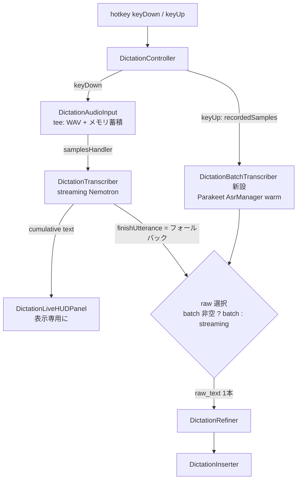

# 31. ディクテーション二段デコード（バッチ再デコードによる raw 品質改善）詳細設計

ディクテーションの確定テキスト（`raw_text`）を、ストリーミング STT（Nemotron 3.5 Streaming 0.6B）の
出力から、key-up 後に発話全体をバッチデコードした結果（Parakeet TDT ja 0.6B）へ差し替える。
ストリーミング出力はライブプレビュー HUD の表示専用に格下げし、バッチ側が使えないときのフォールバック
としてのみ確定テキストに使う。

**位置づけ**: 本文書はまだ Go/No-Go 前の詳細設計段階であり、実装はしていない。kikimi.md の開発方式
（`docs/development-process.md` 2 章）どおり、詳細設計 → セルフレビュー → ユーザーの Go/No-Go を経てから
実装フェーズに入る。

**経緯**: 2026-07-10、履歴エントリ `2026-07-09T23-20-03_58ee805a` で発話中の「今日は」が raw から
欠落する事象を調査した（ユーザー報告。「度々こういった現象に悩まされている」）。切り分けの結果:

- `audio.wav`（STT に渡すバッファと同一の tee、design 29 DH3）には欠落語が存在する
  （whisper large-v3-turbo で確認）。**マイク取り込み・音量・供給経路の問題ではない**
- 同じ WAV を同じ `FluidAudioSttBackendFactory` + `DictationTranscriber` に順序保証して食わせると、
  ライブの raw と一字一句同じ欠落が**決定的に再現**する。ゲイン 4 倍・全 chunk tier
  （560/1120/2240/4480ms）・chunk 境界シフト（7 通り）・直前ポーズの切除、いずれでも欠落は変わらない
- 発話後半（欠落語以降）だけを単体で食わせると正しく認識される。つまり**先行発話のデコーダ文脈が
  あるとポーズ明けの語を取りこぼす、ストリーミングモデル固有の認識抜け**であり、アプリ側の設定・
  経路では回避できない
- 同じ WAV を FluidAudio のバッチモデル `parakeet-tdt_ctc-0.6b-ja`（`AsrModelVersion.tdtJa`）で
  デコードすると欠落語が復元される（「…テスト中、**きょうは**レグ環境の構築を行います。」）。
  実測: デコード約 80ms（8.4 秒発話・Apple Silicon/ANE）、モデルロード約 0.24 秒（DL キャッシュ済み・
  プロセス初回）、初回ダウンロード 602MB

LLM 整形は失われた語を復元できないため、対策は ASR 段でしか打てない。ストリーミングの利点（ライブ
プレビュー）とバッチの利点（全文脈での精度）を両取りする二段デコードを採る。

## 1. 目的とスコープ

**やること**:

- key-up 後、キャプチャ済みサンプル全体を Parakeet バッチモデルで再デコードし、その結果を
  `raw_text`（= refinement への入力・refine 無効時の挿入テキスト）にする
- ストリーミング STT は現行のまま動かし、ライブプレビュー HUD の表示のみに使う
- バッチ側が使えない場合（モデル未ロード・デコード失敗・空文字）のストリーミング raw への
  フォールバック
- 履歴 `entry.json` への診断情報の追記（どちらのエンジンが raw を供給したか + ストリーミング側の
  テキスト）
- config トグル（`dictation.two_pass_decode`、既定 `true`）

**やらないこと（§9 も参照)**:

- 2 つの書き起こしを両方 LLM に渡すこと。**refinement への入力はバッチ（またはフォールバックした
  ストリーミング）の 1 本のみ**。LLM は音声を聞けず 2 案の正誤を判定できないため、混ぜると
  もっともらしい捏造マージのリスクだけが増える（ユーザーと合意済みの方針）
- 会議パイプライン（`SttEngine`/`TranscriptPipeline`）へのバッチ再デコード導入
  （当初はスコープ外としたが、後続の design 33（会議二段デコード）で導入した。§9 参照）
- 履歴 UI での streaming/batch の diff 表示（記録のみ。表示は将来必要になってから）

## 2. 決定事項

| # | 決定 |
|---|------|
| TP1 | バッチモデルは FluidAudio 0.15.4 に既に入っている Parakeet TDT（`AsrModels.downloadAndLoad(version:)` + `AsrManager`）を使う。**依存の追加・バージョン変更なし**。言語→variant の対応は、**`DictationController.resolveSttEngineConfig` で解決済みの言語**（`dictation.language` が空なら `stt.language` へフォールバックした後の値。既定構成では `"ja-JP"`、`"auto"` もあり得る）に対する **BCP-47 primary subtag 判定**で行う: 小文字化して `-`/`_` 区切りの最初の subtag が `"ja"`（`"ja"`/`"ja-JP"`/`"ja_JP"` など）→ `.tdtJa`、それ以外（`"auto"`・`"en"`・未知・空を含む）→ `.v3`（多言語 25 言語）。`"ja"` の exact match にすると既定構成（実効 `"ja-JP"`）で `.v3` が選ばれ、本設計の動機である欠落語復元（`.tdtJa` でのみ実証）が既定ユーザーで無効化される——しかもフォールバックではなく誤モデル選択なので検知できない——ため、prefix 判定を仕様とする。`.tdtJa` は日本語専用 600M ハイブリッド CTC/TDT で、経緯の実測どおり欠落語を復元できた |
| TP2 | 確定テキストの優先順位は **バッチ > ストリーミング**。バッチ結果（trim 後）が非空ならそれを raw とし、バッチ不可（未ロード・throw・空文字）ならストリーミング raw（現行の `finishUtterance()` 結果）へフォールバックする。**両方空なら現行どおりエントリを残さず終了**（design 29 DH10 不変） |
| TP3 | ストリーミング STT・HUD は**一切変更しない**。`DictationTranscriber.feed → HUD 更新`、key-up 時の `finishUtterance()` も従来どおり呼ぶ（バックエンドの蓄積状態クリアの責務があり、フォールバック値の供給源でもある） |
| TP4 | バッチ用サンプルは `DictationAudioInput` が**メモリ上に蓄積**する（既存の `recordedSampleCount` と同じロックで `[Float]` を保持）。`audio.wav`（design 29 の tee）から読み戻す案は退けた——履歴 OFF（DH1）だと WAV が無く、二段デコードが履歴機能に依存してしまう。メモリコストは 16kHz mono Float32 で約 64KB/秒、実用発話（≦数分）で高々数十 MB |
| TP5 | バッチモデルは `dictation.enabled`（かつ `two_pass_decode`）で **warm する**（ストリーミング warm と同じライフサイクル・同じ「有効時のみロード」原則、design 25 R3）。実測ロード 0.24 秒と軽いが、key-up 毎のロードは refine 無効時の挿入レイテンシ目標（整形なしなら即挿入）を毀損するため常駐させる。初回のみ 602MB のダウンロードが入る（ストリーミングモデルの初回 DL と同じく進捗はログのみ）。**warm 完了前の発話はストリーミング raw で確定**する（TP2 のフォールバックに自然合流。ホットキーを拒否しない——現行の「ストリーミング warm 完了前は拒否」より弱いゲートで足りる） |
| TP6 | key-up 後の実行順序は **`finishUtterance()` → バッチデコード → refine** の直列。並行化（`async let`)は 8 秒発話で高々 0.1 秒の短縮にしかならず、ANE を 2 モデルで取り合う挙動の検証コストに見合わない |
| TP7 | `entry.json` に `raw_source`（`"batch"` / `"streaming"`）と `streaming_text`（string?）を追記する。`raw_text` の定義は「refinement に渡した確定 raw」のまま不変（供給元がバッチに変わるだけ）。旧エントリはキー不在 → `raw_source` は表示上 `"streaming"` 扱い、`streaming_text` は `null` として decode（後方互換、design 29 §3.2 の mic_device 追補と同じ作法） |
| TP8 | バッチデコードに**追加のタイムアウトは設けない**。実測 80ms/8.4 秒発話で、現行の `finishUtterance()`（同じく無タイムアウトの ANE 呼び出し）と同じ信頼モデルに揃える。ハング耐性を上げるならストリーミング側と一緒に設計すべきで、本設計では踏み込まない |
| TP9 | config は `dictation.two_pass_decode: true`（既定 ON）。OFF で現行動作（ストリーミング raw 確定）に完全に戻る。トグルは**実行時に即反映**する（§3.3 の config 購読拡張）: ON への切り替えでバッチ warm を開始（完了までは TP5 どおりストリーミング raw で確定）、OFF への切り替えで `batchTranscriber` を即解放（常駐約 600MB を返す）。key-up 側も config を再読して OFF なら warm 済みインスタンスがあってもバッチ経路を通さない（§3.3）——「OFF ⇔ `batchTranscriber == nil`」の等置には依存しない。既定 ON の理由: 本機能の動機が「気づきにくい語の欠落」であり、opt-in では直らない。追加コストはメモリ（モデル約 600MB 常駐）と初回 DL のみで、レイテンシ・費用は増えない |
| TP10 | バッチ結果の表記ゆれ（実測: 「今日は」→「きょうは」のかな表記、句読点の自動付与）は**そのまま raw として受け入れる**。表記の正規化は refinement（glossary 込み、design 28）の既存責務であり、ASR 段では触らない。refine 無効（D1）のユーザーは句読点付き・かな交じりの raw が挿入されるようになるが、語が欠落するより良い、という優先順位judgment を取る |

## 3. コンポーネント構成



### 3.1 `DictationBatchTranscriber`（新設・`Kikimi/Dictation/`）

`DictationTranscriber` と対になる actor。warm な `AsrManager`（FluidAudio）を 1 つ保持し、
発話全体の `[Float]` を一括デコードする。

```swift
/// One warm batch (full-context) ASR decoder for the dictation two-pass design
/// (docs/design/31-dictation-two-pass-decode.md TP1/TP5). Counterpart of DictationTranscriber:
/// that one is chunk-fed for the live HUD, this one re-decodes the whole utterance at key-up.
actor DictationBatchTranscriber {
    private let manager: AsrManager
    private let decoderLayers: Int

    /// Maps the *resolved* dictation language -- DictationController.resolveSttEngineConfig's
    /// output (e.g. "ja-JP", "auto"), never the raw `dictation.language` -- to a batch model
    /// variant (TP1): BCP-47 primary subtag "ja" (case-insensitive; "ja"/"ja-JP"/"ja_JP")
    /// -> .tdtJa, anything else (incl. "auto") -> .v3.
    static func resolveModelVersion(language: String) -> AsrModelVersion

    /// Downloads (first time only) and loads the batch model. Mirrors DictationTranscriber.make.
    /// `language` is the resolved value (see resolveModelVersion above).
    static func make(language: String) async throws -> DictationBatchTranscriber

    /// Decodes one utterance. A fresh TdtDecoderState per call -- utterances are independent.
    func transcribe(samples: [Float]) async throws -> String
}
```

- `resolveModelVersion`/`make` に渡す `language` は生の `dictation.language`（既定 `""`）ではなく、
  **`DictationController.resolveSttEngineConfig(dictation:stt:)` が解決した `SttEngineConfig.language`**
  （ストリーミング warm と同一の値。`dictation.language` が空なら `stt.language`、その既定は
  `"ja-JP"`）。判定は BCP-47 primary subtag（TP1）: 小文字化し `-`/`_` 区切りの最初の subtag が
  `"ja"` なら `.tdtJa`、それ以外は `.v3`。`"auto"` は言語未確定なので多言語 `.v3` に対応付ける
  （`.v3` は言語ヒントなしで自己判別できる）。空文字は解決後の値としては現れないはずだが
  （`SttConfig` の decode が空を既定 `"ja-JP"` に置換する）、防御的に `.v3` へ落とす
- `make` は `AsrModels.downloadAndLoad(version:)` → `AsrManager(models:)`。ダウンロード進捗は
  ストリーミング側（`FluidAudioSttBackendFactory.makeBackend(config:downloadProgress: nil)`）と同じく
  ログのみ
- `transcribe` は呼び出しごとに `TdtDecoderState(decoderLayers:)` を新規生成して
  `manager.transcribe(_:decoderState:)` を呼び、`result.text` を返す。`language` ヒントは渡さない
  （`.tdtJa` では無視され、`.v3` の Latin/Cyrillic フィルタはディクテーションの主対象（ja）に無関係）
- テスト seam: `DictationController` へは protocol（`DictationBatchTranscribing`）として注入する
  （`DictationHistoryStoring` と同じ流儀、design 29 §5.1）。フェイクは FluidAudio に触らない

### 3.2 `DictationAudioInput` の変更（TP4）

- `recordedSampleCountStorage` を「カウント + サンプル本体」を持つ 1 つのロックに統合する
  （`OSAllocatedUnfairLock<(count: Int, samples: [Float])>` 相当。カウントは従来どおり
  `duration_ms` の供給源、design 29 §4.2 の「tap スレッド側で数える」根拠も不変）
- サンプル蓄積は **`two_pass_decode` が ON のときだけ**行う（init に `accumulateSamples: Bool` を
  追加）。OFF なら現行とメモリ挙動まで同一。フラグは key-down 時の config スナップショットで決まる
  （`DictationAudioInput` は発話ごとに生成）ため、発話中のトグル切り替えは次の発話から反映される。
  OFF→ON 切り替え直後の 1 発話は「warm 済みだが蓄積サンプルが空」になり得るが、§3.3 の
  空サンプルガードでストリーミング raw に落ちる（エラーにしない）
- `stop()` 後に読み出す `recordedSamples: [Float]` プロパティを公開する（`recordedSampleCount` と
  同じ「`stop()` が writer/tap を閉じた後にのみ読む」契約）

### 3.3 `DictationController` の変更

**config 購読の拡張（`launch()`）**: 現行の購読は `map(\.dictation.enabled).removeDuplicates()`
のみ（DictationController.swift の `launch()`）で、`enabled == true` のまま Settings で
`two_pass_decode` を切り替えてもハンドラが発火しない——このままでは ON 切り替え後も再起動まで
warm されず、OFF 切り替え後も約 600MB が解放されない。購読を
`map { ($0.dictation.enabled, $0.dictation.twoPassDecode) }.removeDuplicates(by: ==)` の
タプルに拡張し、ハンドラを `handleConfigChanged(enabled:twoPassDecode:)` に改名して両フラグを
受け取る（§4 の Settings トグルが即時反映である前提を成立させる）。

**warm（`handleConfigChanged`）**: ストリーミング warm と並行してバッチ warm を開始する。
実行時トグルの遷移規則:

- `enabled == false` → 現行どおり `.disabled` + `transcriber = nil`、加えて `batchTranscriber = nil`
  （メモリ解放）
- `enabled == true && twoPassDecode == true` → `transcriber` と同様に
  `batchTranscriber: (any DictationBatchTranscribing)?` を保持し、未ロードなら `Task` でロード
  （`isWarming` と同じ流儀の `isBatchWarming` フラグで多重 warm を抑止）。ロード失敗は
  `.error` ログ + `nil` のまま（以後の発話は TP2 のフォールバックでストリーミング raw になる。
  **機能全体は止めない**）。`make` に渡す言語は `resolveSttEngineConfig(dictation:stt:).language`
  （解決済み値、§3.1/TP1）
- `enabled == true && twoPassDecode == false` → `batchTranscriber = nil`（約 600MB を即解放）。
  warm `Task` の in-flight 中に OFF へ切り替わった場合は、ロード完了時に config を再確認して
  `twoPassDecode == false` なら結果を捨てる（ストリーミング warm の「多秒ロード中に disable
  され得る」チェックと同じ作法）
- ホットキー受理条件（`DictationHotkeyDownDecision`）は**変えない**（ストリーミング warm 完了のみを
  見る現行のまま。バッチ warm は TP5 のとおり非同期に追いつけばよい）

**key-up（`handleHotkeyUp` の `Task` 内、TP6）**:

```swift
// recordedSamples は handleHotkeyUp の同期部（audioInput?.stop() の後・audioInput = nil の前、
// recordedSampleCount と同じ位置）で束縛して Task に渡す（§3.2 の読み出し契約）
// 現行: rawText = try await transcriber.finishUtterance()
let streamingRaw = try await transcriber.finishUtterance()   // 失敗時の扱いは現行と同一（§9 の割り切り）
let batchText = await decodeBatchIfEnabled(samples: recordedSamples)  // 下記の選択関数へ

let selection = DictationRawSelection.select(
    batchText: batchText, streamingText: streamingRaw)
// selection.rawText: String（trim 済み・確定 raw）
// selection.source:  .batch / .streaming
// selection.streamingText: String?（診断用。source == .batch のときのみ非 nil で記録）
```

- 選択ロジックは pure 関数 `DictationRawSelection.select(batchText:streamingText:)` に切り出す
  （レイヤ 1 テスト対象。§7）。規則: batch の trim 後が非空 → `.batch`。それ以外（`nil`/空）→
  `.streaming`。両方空 → 現行の空発話経路（`discardActiveHistoryEntry`）へ
- `decodeBatchIfEnabled` が `nil`（= バッチ不使用、ストリーミングへフォールバック）を返す条件は
  3 つ。「OFF ⇔ `batchTranscriber == nil`」とは等置しない:
  - key-up 時点の config 再読で `two_pass_decode == false`。ON→OFF 切り替えの購読反映（§3.3 冒頭）
    と発話が競合しても OFF が必ず勝つ二重ガードで、TP9 の「OFF で現行動作に完全に戻る」を
    warm 済みインスタンスの残存有無によらず保証する
  - `batchTranscriber == nil`（warm 未完・ロード失敗・OFF で解放済み）
  - `samples.count < ASRConstants.minimumRequiredSamples(forSampleRate: 16_000)`（0.3 秒 =
    4,800 サンプル未満。空配列を含む）。FluidAudio の `AsrManager.transcribe` は 0.3 秒未満の入力で
    必ず `ASRError.invalidAudioData` を throw するため、日常的な短押しや「発話中に OFF→ON へ
    切り替わった直後の蓄積ゼロ発話」（`accumulateSamples` は key-down 時の config で決まる、§3.2）
    が毎回 error ログになる経路を呼び出し前に塞ぐ。このガードは**想定内の縮退**なので debug ログに
    留める（CLAUDE.md の Logging Rules と整合）
- `transcribe` の throw は `.error` ログ + `nil`（フォールバック）
- 以降（refine → insert → 履歴 finalize）は `selection.rawText` を従来の `trimmedRaw` として流すだけで
  無変更。**`DictationRefiner`・`DictationInserter`・HUD・overlay には一切手を入れない**

### 3.4 履歴への記録（TP7）

`DictationHistoryEntry` に追記:

| フィールド | 型 | 説明 |
|-----------|-----|------|
| `raw_source` | string | `"batch"` / `"streaming"`。旧エントリはキー不在 → decode 時 `"streaming"` 扱い |
| `streaming_text` | string? | `raw_source == "batch"` のときのストリーミング raw（診断用）。フォールバック時はバッチ由来の情報が無いので `null`（`raw_text` 自体がストリーミング） |

履歴詳細ペインは `streaming_text` が非 nil のとき「ストリーミング（参考）」として折りたたみ表示する
（リスト・フッター cost・prune には影響なし）。

## 4. config スキーマ / Settings UI

```yaml
dictation:
  # ...(既存フィールドは design 25 §9 / design 29 §7.1 のまま)
  two_pass_decode: true   # 既定 true（TP9）。false で現行のストリーミング確定に戻る
```

- `DictationConfig` に `twoPassDecode: Bool` を追加。`decodeIfPresent ?? true` の既存作法
- Settings「入力」タブ: `dictation.enabled` ブロック内（履歴セクションと同格）にトグルを 1 つ追加。
  切り替えは再起動なしで即反映される（§3.3 の購読拡張が前提。ON でバッチ warm 開始、OFF で
  モデル約 600MB を解放）。説明文: 「発話終了後に発話全体を高精度モデルで再認識して確定します
  （ライブ表示は従来どおり）。初回はモデルのダウンロードが入ります。オフにするとモデルの
  メモリを解放します」

## 5. 状態機械・レイテンシへの影響

- `DictationState` は**変更しない**。バッチデコードは `.transcribing` の中で完結する
  （実測 80ms/8.4 秒発話。ユーザー体感は「離してから挿入まで」に +0.1 秒未満）
- 発話が約 15 秒（`ASRConstants.maxModelSamples` = 240,000 サンプル）を超えると FluidAudio 内部で
  オーバーラップ付きのチャンク分割処理（`ChunkProcessor`）に切り替わり、レイテンシは発話長に
  ほぼ比例して伸びる（実測 80ms は 8.4 秒発話の値であり長発話には外挿できない）。それでも
  実時間よりは 2 桁速く、ディクテーションの発話長（高々数十秒）では体感を損なわない見込み
- refine 有効時は LLM 往復（約 1 秒〜）が支配的で、相対的な影響はさらに小さい
- 会議録音との同時動作（design 25 R4）: バッチデコードは key-up 後の単発 ANE 呼び出しであり、
  会議側ストリーミングと恒常的に競合しない

## 6. 既存設計との整合

- **design 25（dictation-mode）**: R3 の「warm な streaming backend を 1 つ保持」に「warm な batch
  decoder を 1 つ追加保持（`two_pass_decode` 時）」が加わる。R9（refine のフォールバック連鎖）は
  入力が変わるだけで規則は不変。Go 後に §2 R3・§12 へ本文書への参照を追記
- **design 29（dictation-history）**: `raw_text` の定義「STT 生出力の trim 後」は「確定に使った STT
  生出力の trim 後」と読み替え（§3.2 表の更新）。`entry.json` に 2 フィールド追記（TP7）。
  DH10（空発話はエントリを残さない）・DH6（履歴失敗は主機能を止めない）は不変
- **design 27（learning-mode、未実装）**: `corrections.jsonl` の `raw_text` も将来は確定 raw
  （= バッチ側）を指すことになる。学習データとしても「実際に refinement に入った raw」が正しい。
  design 27 実装時に同文書へ注記
- **design 28（glossary）**: 変更なし。TP10 の表記ゆれ正規化は既存の refinement プロンプトの責務

## 7. テスト方針

**レイヤ 1（swift-testing）**:

- `DictationRawSelection.select`（pure）: batch 非空 → `.batch`・`streamingText` 保持 / batch `nil`・
  空・空白のみ → `.streaming` / 両方空 → 空発話扱いの表明。trim 規則
- `DictationBatchTranscriber.resolveModelVersion`（渡すのは解決済み言語、TP1/§3.1）: `"ja"`・
  **`"ja-JP"`**・`"ja_JP"`・`"JA-jp"`（case-insensitive）→ `.tdtJa` / `"auto"`・`"en"`・`"en-US"`・
  未知・`""`（防御）→ `.v3`。加えて既定構成の合成を表明: `dictation.language == ""` +
  `stt.language == "ja-JP"` を `resolveSttEngineConfig` に通した結果が `"ja-JP"` → `.tdtJa` になる
  （exact match 回帰で既定ユーザーが `.v3` に落ちるのを検知する目的）
- `DictationController` 配線（`DictationBatchTranscribing` のスタブで検証、design 29 §9 の
  `DictationControllerHistoryTests` を拡張）: スタブが成功 → `raw_text` がバッチ値・
  `raw_source: "batch"`・`streaming_text` にストリーミング値 / スタブが throw・空 →
  ストリーミング raw で確定・`raw_source: "streaming"`・`streaming_text` は `null` /
  `two_pass_decode == false`（key-up 時の config 再読）→ warm 済みスタブが残っていてもバッチ経路が
  一切呼ばれない / バッチ未 warm（`nil`）→ フォールバック / 蓄積サンプルが 0.3 秒未満（0 件含む）→
  `transcribe` を呼ばずフォールバック（§3.3 の最小サンプルガード）
- config 購読の実行時トグル（§3.3 冒頭）: `enabled == true` のまま `two_pass_decode` を
  OFF→ON に変えるとバッチ warm が開始される / ON→OFF に変えると `batchTranscriber` が解放される
  （購読が `(enabled, twoPassDecode)` の両方に反応することの表明）
- `DictationAudioInput`: `accumulateSamples: true` で `handleCapturedBuffer` 後に `recordedSamples` が
  入力サンプルと一致、`false` で常に空。`recordedSampleCount` の既存テストは不変
- `DictationHistoryEntry`: 新 2 フィールドの snake_case 往復 + キー不在 JSON の後方互換 decode

**レイヤ 2（`kikimi-verify`）**: 実ホットキー経由の end-to-end は既存制約どおり対象外
（design 25 §11）。Settings のトグル到達性のみ

**レイヤ 3（実戦）**: 日常運用で「語の欠落」の再発頻度を履歴（`streaming_text` との比較）で観測する。
今回の repro WAV は回帰確認の固定素材として使える（スパイクの検証テスト一式は実装フェーズで
`KikimiTests` に正式化する。雛形: scratchpad の `BatchDecodeValidationTests.swift`）

## 8. 実装順序（実装フェーズへの指示）

1. `DictationRawSelection`（pure）+ テスト
2. `DictationBatchTranscriber` + `resolveModelVersion` + protocol seam
3. `DictationAudioInput` のサンプル蓄積 + テスト
4. `DictationConfig.twoPassDecode` + Settings トグル
5. `DictationController` 配線（config 購読の `(enabled, twoPassDecode)` 拡張・warm/解放遷移・
   key-up・履歴フィールド）+ 配線テスト
6. `DictationHistoryEntry`/詳細ペインの追記 + 往復テスト

## 9. スコープ外・既知の割り切り

- **2 案併記で LLM に渡す**: しない（§1）。将来やるなら「streaming/batch の diff で不安定発話を
  履歴 UI にマークする」診断用途のみ（`streaming_text` の記録はその布石を兼ねる）
- **会議パイプラインへの適用**: 本設計の当初はスコープ外としたが、後続の
  `docs/design/33-meeting-two-pass-decode.md` で導入した。design 33 に伴い、
  `resolveModelVersion` と warm な `AsrManager` の保持は `BatchAsrDecoder`/
  `BatchAsrDecoderPool`（`Kikimi/Stt/`、lease による refcount 管理）へ移り、
  `DictationBatchTranscriber` はそこへ委譲する薄い adapter になった
  （TP1/TP5/TP9 の決定内容は不変。解放は保持中 lease の `release()`）
- **バッチデコードのタイムアウト・ウォッチドッグ**: 設けない（TP8）
- **ストリーミング `finishUtterance()` throw 時のバッチによる救済**: しない（現行どおり発話全体を
  破棄）。サンプルは手元にあるためバッチ側だけで確定させることも技術的には可能だが、streaming
  finish の失敗はバックエンド異常のシグナルであり、その状態の切り分け（次発話への影響・reset の
  要否）を伴う。頻度実績が出てから再検討する
- **蓄積サンプルの上限**: 設けない。key-up 取りこぼしで `.capturing` が続くと約 230MB/時で成長する
  理論経路はあるが、押し続けている間しか起きず、既存の `audio.wav` tee（無上限）と同じ暴露。上限を
  入れるならストリーミング側の防御と合わせて別途設計する
- **モデルの遅延アンロード（メモリ節約）**: しない。`dictation.enabled` OFF または
  `two_pass_decode` OFF（§3.3 の実行時トグル）で解放されるのみ。常駐 +約 600MB が問題になったら
  再検討
- **ja 以外の言語での品質検証**: `.v3` への対応付けまで（実測は ja のみ）。多言語ユーザーが
  現れたら検証
- **かな表記・句読点の ASR 段での正規化**: しない（TP10）
- **`raw_text` 供給元の履歴 UI での diff 表示**: 記録のみ（TP7）

## 10. 既存文書との同期（Go 後）

- `docs/design/25-dictation-mode.md` §2 R3・§12: 二段デコードの追記と本文書への参照
- `docs/design/29-dictation-history.md` §3.2: `raw_text` 定義の読み替えと新 2 フィールドの追記参照
- `kikimi.md` 15 章（音声文字入力）: 確定テキストがバッチ再デコード由来になった旨を 1 行追記
