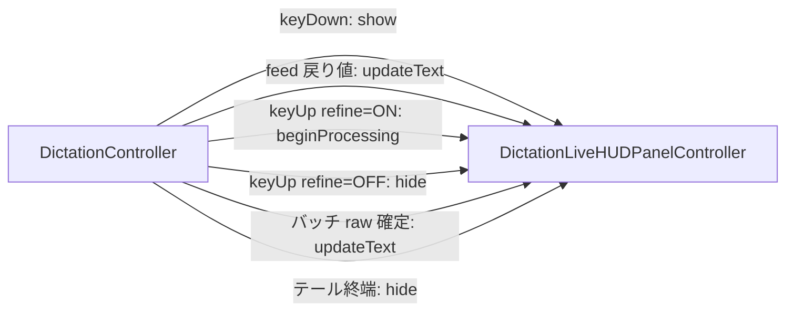

# 32. ディクテーション HUD の整形中表示（refine 有効時の key-up 後継続表示）

`docs/design/25-dictation-mode.md` §13（ライブプレビューHUD）の H1「表示は `.capturing` 中のみ」を、
refine 有効時に限って改定する。

## 1. 経緯・動機

現行の HUD は key-up の瞬間に即非表示になる（design 25 H1、`DictationController.handleHotkeyUp()` の先頭）。
その後のテール（バッチ再デコード → LLM refine → 挿入）は完全に無表示で走る。

- refine 無効（D1）ではテールは 0.2 秒未満で、無表示でも体感上の空白はない。H1 の判断は D1 前提では正しい
- refine 有効（D2）では LLM 往復（約 1 秒〜、`refine_timeout_ms` 既定 3,000ms が上限）が支配的で、
  **キーを離してからテキストが現れるまで 1〜3 秒の無反応時間**が生じる。design 31 §5 も「refine 有効時は
  LLM 往復が支配的」と明記している
- この空白の間にユーザーが別アプリへフォーカスを移すと `FrontmostGuard` が abort を検出し、
  クリップボード退避 + `DictationOverlayPanel` 表示という迂回フローに落ちる（R5/§3.6）。
  「まだ処理中」と見えていればユーザーが待つ確率が上がり、**abort 経路の発生率自体を下げる**効果が見込める。
  単なる進捗表示ではなく、誤爆ガードの発動率を下げる機能的な意味を持つ

## 2. 決定事項

| # | 決定 |
|---|------|
| HR1 | **refine 有効時（key-up 時の `dictation.refine` 再読で判定）は、key-up で HUD を消さず「整形中」フェーズ表示に切り替える**。テールの終端（挿入判定後、または各 early-return）で非表示にする。refine 無効時は現行どおり key-up で即非表示（H1 の挙動を維持） |
| HR2 | **「整形中」フェーズの見た目**: 上段のテキストはそのまま残す（バッチ再デコードの結果が出たら選択された raw テキストで差し替える——ユーザーは確定 raw を読みながら待てる）。下段は録音ドット・波形・経過時間を撤去し、スピナー（`ProgressView` 小サイズ）+「整形中…」ラベルに差し替える。経過時間 ticker は key-up で停止する。capturing 中と同じ見た目のまま残すと「まだ聞き取っている」と誤解されるため、フェーズの区別は必須。「整形中…」ラベルはバッチ再デコード〜refine だけでなく `.inserting`（AX 判定・挿入）までのテール全体を覆う——挿入は数十 ms で個別表示する価値がない（**追補・`docs/design/49-dictation-hud-slim.md`**: capturing 中のテキスト表示が廃止されたため、上段は「そのまま残す」ではなく「このフェーズで初めて出す」に変わった。確定 raw を読みながら待たせるという HR2 の意図は不変で、パネルはここで小型ピルから 420×104pt へ広がる） |
| HR3 | **状態機械（§4）に新しい状態は追加しない**。design 25 §13.3 と同じく、`DictationController` の遷移ハンドラへの副作用として組み込む。HUD 側は `capturing` / `processing` の 2 フェーズを持つ表示上の区別のみ |
| HR4 | **非表示はテールの全終了経路で保証する**。`handleHotkeyUp()` のテール `Task` の終了経路は 4 つ（transcriber/capturedTarget 消失・`finishUtterance()` throw・空発話・挿入完了）で、いずれも既に `discardActiveHistoryEntry()` ないし `state = .idle` へ収束する構造になっている。**`liveHUDPanel?.hide()` は各経路で `state = .idle` の直前（state リセット後の最初の suspension point より前）に置く**——`state = .idle` 以降は次の key-down が受理可能になるため、hide を `await discardActiveHistoryEntry()` の後に置くと「新発話の `show()` を前回テールの残 `hide()` が消す」競合が MainActor 上でも成立してしまう。`hide()` は冪等（`orderOut` は非表示ウィンドウに対して no-op）なので、refine 無効で既に非表示でも無条件に呼んでよい |
| HR5 | **居座り時間は有界**。`DictationRefiner.refine` は throw せず `refine_timeout_ms`（既定 3,000ms、負値は decode 時に既定へフォールバック済み）を尊重するため、HUD の追加表示時間は最悪でもタイムアウト + バッチデコード（実測 ~80ms）+ 挿入判定で数秒に収まる。既知の反例だった「`.capturing` 中に `dictation.enabled` が false になると key-up が `guard state == .capturing` で早期 return し HUD と ticker が永久に残る」経路（既存バグ）は、`handleConfigChanged` の disabled 分岐に `liveHUDPanel?.hide()` を追加して本設計のスコープ内で塞ぐ |
| HR6 | **abort 時は HUD を消してから overlay を出す**。`abortedAndStashed` で `DictationOverlayPanel` を表示する分岐では、HUD の hide を overlay の show より先に行い、2 枚のパネルが同時に見える瞬間を作らない |
| HR7 | **新しい config は追加しない**。ゲートは既存の `dictation.refine` のみ。「refine は使うが HUD は残したくない」という要望が実際に出るまで opt-out は持たない（YAGNI） |
| HR8 | **`ignoresMouseEvents = true`・`orderFront`（非アクティブ化）は維持**。整形中フェーズでも HUD は表示専用で、フォーカスも操作も奪わない（H2/H3 は不変） |

## 3. コンポーネント変更



### 3.1 `DictationLiveHUDPanel.swift`

- `DictationLiveHUDState` に `phase: Phase`（`case capturing, processing`）を追加。view の
  再描画トリガとして `@Published` にする。`show()` で `.capturing` にリセット、新設の
  `beginProcessing()` で `.processing` に遷移
- `beginProcessing()`: ticker を止め、phase を `.processing` にする。ウィンドウの表示状態は
  触らない（既に表示中のまま）。ticker 停止部分（`tickerTask`/`startDate` のクリア）は
  private ヘルパー `stopTicker()` に切り出して `hide()` と共有する——`hide()` はさらに
  `orderOut` も行うため、共通化できるのは ticker 停止のみ
- `DictationLiveHUDView`: `phase == .processing` のとき下段を
  `ProgressView().controlSize(.small)` + `Text("整形中…")` に差し替える。上段のテキスト表示・
  パネルサイズ（420×104pt）・角丸背景は不変
- **テスト seam**: `DictationLiveHUDPresenting` protocol（`show()` / `hide()` / `updateText(_:)` /
  `beginProcessing()`）を新設し、`DictationLiveHUDPanelController` が準拠する。
  `DictationController` は具象型ではなく protocol で保持し、factory を init 注入する
  （既存の `batchTranscriberFactory` などと同じ DI 流儀）。これにより layer-1 テストが
  NSPanel を生成せずに「どの経路で hide が呼ばれたか」を spy で検証できる
- **spy の実体化経路（factory 注入だけでは不十分）**: `liveHUDPanel` の実体化（factory 呼び出し）は
  `handleHotkeyDown()` 内の `liveHUDPanelController()`（現行 `DictationController.swift:304`）で
  しか起きない。一方 `handleHotkeyUp()` とテール `Task` は保持済みプロパティへの optional chaining
  （`liveHUDPanel?.beginProcessing()` / `liveHUDPanel?.hide()` / `liveHUDPanel?.updateText(_:)`）
  しか使わないため、§5 のように `simulateCapturing(...)` + `handleHotkeyUp()` で駆動するテストでは
  factory を注入しても spy は一度も生成されず、HUD 呼び出しはすべて `nil` に対する no-op になる。
  そこで **`simulateCapturing(...)` の末尾で `liveHUDPanelController().show()` を呼び、注入済み
  factory 経由で HUD を実体化する**。これは同メソッドの既存契約「`handleHotkeyUp()` 呼び出し時点で
  `handleHotkeyDown()` が残しているはずの状態をそのまま再現する」とも一致する（実経路では
  capturing 中の HUD は生成・表示済み）。`simulateCapturing` への引数追加は不要
  （factory は init 注入済みで、production 既定 factory は実 `DictationLiveHUDPanelController` を返す）

### 3.2 `DictationController.swift`

- `handleHotkeyUp()` の同期部: `config` の読み取りをテール `Task` 内から同期部へ移動する
  （`@MainActor` 上の読み取りであり意味上の変化はない。key-up 瞬間のスナップショットになる分、
  design 31 TP9 の「key-up 側も config を再読する」原則とも整合する）。そのうえで

  ```swift
  if config.refine {
      liveHUDPanel?.beginProcessing()
  } else {
      liveHUDPanel?.hide()   // 現行挙動（H1）
  }
  ```

- テール `Task` 内:
  - `DictationRawSelection.select` で raw が確定した直後に `liveHUDPanel?.updateText(trimmedRaw)`
    （HR2。refine 無効時は非表示ウィンドウへの state 更新になるだけで無害）
  - 4 つの終了経路すべてで `liveHUDPanel?.hide()`（HR4。配置は各経路の `state = .idle` の直前）。
    abort 分岐では overlay show の前に置く（HR6。順序は同期コードの並びで担保し、layer 1 では
    「abort 経路でも hide が呼ばれる」ことのみ検証する——overlay 側に protocol seam は切らない）
- `handleConfigChanged` の disabled 分岐に `liveHUDPanel?.hide()` を追加（HR5 の既存バグ修正）
- テスト seam `simulateCapturing(...)`: 末尾に `liveHUDPanelController().show()` を追加し、
  注入 factory 経由で HUD を実体化する（理由と契約整合性は §3.1「spy の実体化経路」）
- `handleHotkeyDown()` のマイク起動失敗経路は現行の `hide()` のまま（変更なし）。key-up 済みで
  `start` が throw する稀な競合では HUD が終端より早く消えるが、その発話は空で即終端するため無害
- 再入は既存の `DictationHotkeyDownDecision` が `state != .idle` を `.ignore` にするため、
  整形中に次の key-down が HUD を `show()` し直す競合は起きない（変更なし・確認のみ）
- **コード内ドキュメントの更新**: 「`.capturing`-only / key-up で即 hide」を明記している既存 doc
  コメント（`DictationLiveHUDPanelController` のクラス doc・`hide()` の doc・`DictationController`
  の `liveHUDPanel` プロパティ doc・`handleHotkeyUp()` 内コメント）を本設計の挙動に合わせて改める

### 3.3 design 25 への追補

design 25 §13.1 の H1 に「refine 有効時は本ドキュメントにより改定（`docs/design/32-...md`）」の
追補注記を付ける（design 31 が R3 に追補を付けたのと同じ流儀）。

## 4. 代替案と却下理由

- **常時（refine 無効でも）残す**: テール 0.2 秒未満では一瞬チラつくだけで情報量がない。却下
- **メニューバーアイコンの状態変化で代替**: 視線がテキスト挿入先にある文脈では気づけない。却下
- **overlay パネル（`DictationOverlayPanel`）に進捗表示を統合**: overlay は abort 後の能動的な
  リカバリ UI（ボタンあり・クリック可能）で、表示専用の HUD とは役割・入力透過性が異なる。混ぜない
- **新 config で opt-out 可能にする**: HR7 のとおり YAGNI

## 5. テスト方針（レイヤ 1）

`DictationControllerHistoryTests` の既存流儀（`simulateCapturing(...)` + `handleHotkeyUp()`）に
spy HUD（`DictationLiveHUDPresenting` 準拠）を注入して検証する。この駆動経路は
`handleHotkeyDown()` を通らないため、spy の実体化は §3.1 のとおり `simulateCapturing(...)` 内の
`liveHUDPanelController().show()` が担う（テストは init で spy factory を注入 →
`simulateCapturing(...)` が factory を呼んで spy を生成・保持 → `handleHotkeyUp()` 以降の
optional chaining がその spy に届く）。セットアップ由来の `show()` 1 回は前提呼び出しとして扱い、
各テストの assertion は key-up 以降に spy へ記録された呼び出しのみを対象にする:

1. refine 有効 + 正常挿入: key-up で `beginProcessing()` が呼ばれ `hide()` は呼ばれない →
   テール完了後に `hide()` が 1 回呼ばれる
2. refine 無効: key-up で `hide()` が呼ばれ、`beginProcessing()` は呼ばれない
3. 空発話（両デコーダが空文字）: refine 有効でもテール終端で `hide()` される
4. `finishUtterance()` throw: 同上
5. refine 有効の前提で、raw 確定後に `updateText(選択 raw)` が呼ばれる（バッチ優先の選択結果が
   HUD に反映される）
6. refine 有効 + 挿入 abort（`abortedAndStashed`）: テール終端で `hide()` が呼ばれる
   （HR6 の hide→overlay の順序自体はコード構造で担保、テストは hide の発生のみ検証）

`DictationLiveHUDView` の phase 別レイアウトは表示のみで純ロジックがないため layer 1 対象外
（design 25 §13.4 が波形/ドットを対象外とした判断と同じ）。UI の見た目確認はユーザーの動作確認に委ねる。
