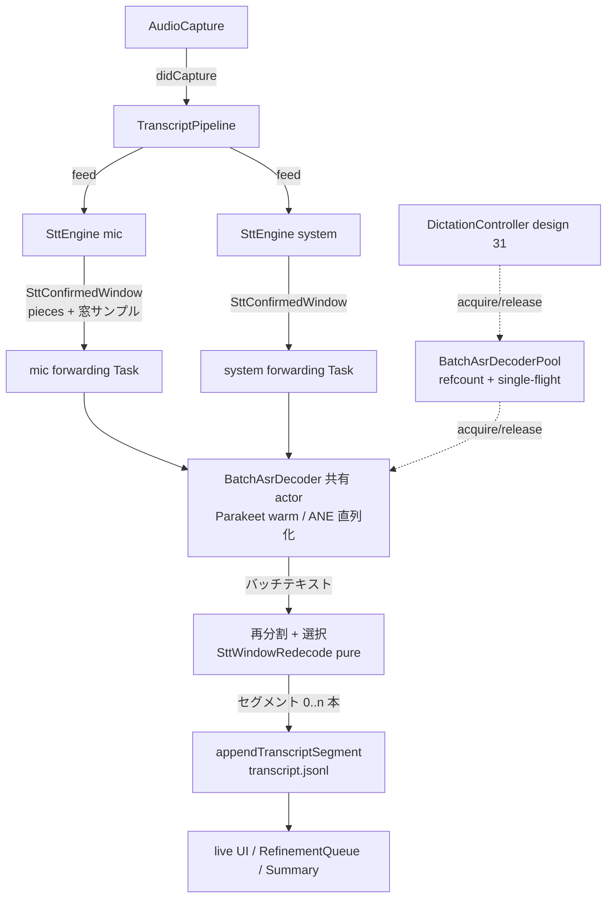

# 33. 会議二段デコード（セグメント確定時のバッチ再デコードによる raw 品質改善）詳細設計

会議書き起こしの確定セグメント（`transcript.jsonl` の `text`）を、ストリーミング STT
（Nemotron 3.5 Streaming 0.6B）の出力から、確定時に該当区間の音声をバッチデコードした結果
（Parakeet TDT）へ差し替える。ストリーミング出力は volatile 表示（進行中の 1 行）と、バッチ側が
使えないときのフォールバックとしてのみ使う。design 31（ディクテーション二段デコード）の
会議パイプライン版であり、確定テキストの優先順位（バッチ > ストリーミング）・失敗時の縮退・
モデル選択規則は design 31 の流儀を踏襲する。

**位置づけ**: 本文書はまだ Go/No-Go 前の詳細設計段階であり、実装はしていない。
`docs/development-process.md` 2 章のとおり、詳細設計 → セルフレビュー → ユーザーの Go/No-Go を
経てから実装フェーズに入る。

**経緯**: design 31 の調査で、語の欠落は「先行発話のデコーダ文脈があるとポーズ明けの語を
取りこぼす、ストリーミングモデル固有の認識抜け」であり、アプリ側の設定・経路では回避できないと
確定した（決定的に再現・バッチモデルで復元を実証）。会議パイプラインはこの条件を常に満たす:
backend の decoder 文脈は録音区間全体で連続し（`SttDecodeWorker` はセグメント確定でリセット
しない）、セグメント確定の主経路のひとつが「2 秒の成長途絶」（idle timeout、design 11 §3.3
route 2）＝ポーズそのものである。つまり **ポーズ明けの語欠落が構造的に起きやすいのは
ディクテーションより会議の方**である。LLM 整形は失われた語を復元できないため（design 31 と
同じ理由）、対策は ASR 段で打つ。

## 1. 目的とスコープ

**やること**:

- セグメント確定時に、そのセグメントに対応する音声サンプル窓を Parakeet バッチモデルで
  再デコードし、その結果を `transcript.jsonl` の `text`（= live UI 表示・整形・サマリ・export の
  入力）にする
- ストリーミング STT は現行のまま動かし、volatile 表示（進行中の 1 行）とフォールバックに使う
- バッチ側が使えない場合（モデル未ロード・デコード失敗・空文字・窓が短すぎる/切り詰められた）の
  ストリーミング確定テキストへのフォールバック
- Parakeet warm インスタンスのディクテーション（design 31）との共有（常駐メモリを 600MB × 1 に
  抑える）
- `transcript.jsonl` セグメントへの供給元マーカー（`stt_source`）の追記
- config トグル（`stt.two_pass_decode`、既定 `true`）+ Settings トグル

**やらないこと（§9 も参照）**:

- 2 つの書き起こしを両方 LLM に渡すこと。**整形への入力はバッチ（またはフォールバックした
  ストリーミング）の 1 本のみ**（design 31 §1 と同じ合意事項。LLM は音声を聞けず 2 案の正誤を
  判定できない）
- セグメント確定ロジック（design 11 §3.3 routes 1-4）自体の変更。routes の発火条件・確定タイミング・
  volatile 表示・タイムスタンプの決め方は不変で、確定後の**テキスト供給元だけ**が変わる。
  唯一の例外は two-pass ON 時の**残余の消費**（MT13。窓タイルと確定テキストを同期させるため、
  窓を切る確定イベントで pending の残余も同時に確定する）
- 話者分離・整形・サマリ・export の変更（`transcript.jsonl` の `text` が良くなるだけで、
  インターフェイスは全て不変）

## 2. 決定事項

| # | 決定 |
|---|------|
| MT1 | バッチモデルは design 31 TP1 と同一（FluidAudio 0.15.4 の `AsrModels` + `AsrManager`、依存追加なし）。モデル選択は `DictationBatchTranscriber.resolveModelVersion` と同じ BCP-47 primary subtag 規則を **`stt.language`**（会議側の解決済み言語。既定 `"ja-JP"`）に適用する: primary subtag `"ja"` → `.tdtJa`、それ以外（`"auto"` 含む）→ `.v3`。判定関数は共有化する（§3.1） |
| MT2 | **窓のタイル化**（本設計の核心）: 各確定イベントの再デコード窓は「**前の窓の終端チャンクの次のチャンク 〜 今回の最終成長チャンク**」（ソースごと・チャンク単位）。窓同士は重ならず隙間もないため、**同じ音声を二度デコードしない = 隣接セグメント間で語が重複しない**。境界チャンク内で次セグメントの語が前の窓に食い込む「語のずれ」は高々 1 チャンク（既定 2.24 秒）で、design 11 §3.4 が明記するタイムスタンプ精度（チャンク粒度）と同格の近似として受け入れる。ポーズ明けの欠落語の音声は、直前セグメントの最終成長チャンクより後（無音チャンク側）にあるため必ず**次の窓に含まれ**、フル文脈デコードで復元される。この構造上、窓の**先頭**には前回 cut 以降の無音チャンク（idle timeout 確定直後で約 2 秒、長ポーズでは MT6 (a) の無音リード保持分＝約 20 秒まで）が含まれるため、タイムスタンプ按分は無音リードを除外する起点クランプを行う（§3.4/MT11） |
| MT3 | 1 回の確定イベント（`processChunkResult` 1 回）で確定した全 piece は **1 つの窓として一括再デコード**し、バッチテキストを既存の `splitPendingTextOnPunctuation`（route 1 と同じ規則）で**再分割**して 0 個以上のセグメントとして emit する。piece 数はストリーミング確定時と一致しなくてよい（文の切れ目はバッチテキストの句読点が正）。再分割後の各セグメントの `startMs`/`endMs` は、按分起点を先頭 piece の `startMs` にクランプした範囲（窓先頭の無音リードを除外、§3.4）を**文字数比で按分**する（チャンク粒度精度の範囲内の近似） |
| MT4 | 確定テキストの優先順位は **バッチ > ストリーミング**（design 31 TP2 と同じ）。フォールバック条件は: 二段デコード無効 / decoder 未ロード（warm 失敗含む）/ 窓サンプルが 0.3 秒未満（`ASRConstants.minimumRequiredSamples`、呼び出し前ガード）/ 窓が保持上限で切り詰められた（MT6。頭が欠けた窓のバッチ結果はストリーミングより悪化し得るため使わない）/ `transcribe` の throw / バッチテキストが trim 後空。フォールバック時はストリーミング確定 piece（MT13 で消費した残余 piece を含む）をそのまま emit する。バッチ/フォールバックの選択は**確定イベント単位で独立**でよい: MT13 の残余消費により、すべての確定イベント後に pending が空で窓タイルと確定テキストが同期しているため、どのイベント境界で fallback⇄batch が遷移しても（MT8 のロード完了時にほぼ毎セッション起きる）欠落も重複も生じない。**テキストを失う経路は作らない** |
| MT5 | 再デコードは `SttEngine` の中ではなく、**`TranscriptPipeline` の per-source forwarding `Task`** で行う（§3.3）。`SttEngine` は確定 piece 群 + 窓サンプルを `SttConfirmedWindow` として yield するだけ（確定ロジックは同期のまま。ON 時の差分は MT13 の残余消費のみ）。mic/system の 2 つの forwarding `Task` は **1 つの共有 decoder actor** を await するため、ANE 呼び出しは自然に直列化される。per-source FIFO は forwarding `Task` が inline await する構造で維持される（`TranscriptPipeline` 既存の設計原則と同じ） |
| MT6 | 窓サンプルは `SttEngine` が**メモリ上にチャンク単位で保持**する（`two_pass_decode` ON のときだけ）。保持の規則は 2 段: **(a) 無音リードの切り詰め** — pending テキストが空の間（= 保持の中身が次窓の無音リードだけの間）は**末尾約 20 秒だけ残して**最古から捨てる。この切り詰めは想定内の動作で `truncated` に**しない**。ポーズ明けの欠落語の音声は最初の成長チャンクの直前（高々 1〜2 チャンク）にあり 20 秒のリードで十分カバーされるため、長ポーズ後の窓（本設計の動機である最高リスク区間）でも二段デコードは無効化されず、数十秒〜の無音を丸ごとデコーダに渡す無駄もない。**(b) 全体上限 120 秒/ソース**（16kHz mono Float32 で約 7.7MB/ソース）— 発話中（pending 非空）にこれを超えたら最古から捨てて窓を `truncated` とマークし、再デコードをスキップする（MT4。頭が欠けた窓のバッチ結果はストリーミングより悪化し得るため使わない。route 3 が 120 文字で強制確定するため実発話でここに達するのは異常系のみ）。WAV（`mic_NNN.wav`）からの読み戻しは退けた: 窓境界はチャンク粒度でしか分からず `startMs`/`endMs` ベースの切り出しは ±1 チャンクの取り違えを生むこと、書き込み中ファイルの flush タイミングへの依存が増えることによる |
| MT7 | Parakeet warm インスタンスは**プロセス内で共有**する（`BatchAsrDecoderPool`、§3.1）: `AsrModelVersion` ごとに refcount + single-flight ロード。`acquire` は release を束ねた **lease**（`BatchAsrDecoderLease`。`release()` は冪等）を返し、未 acquire での release や二重 release（unbalanced release）を型で不可能にする。会議は `TranscriptPipeline.prepare()` で acquire・`stopAndDrain()` で lease を release（順序規定は MT8/§3.3）、ディクテーション（design 31 TP5/TP9 の warm/解放遷移）は lease の保持/解放に置き換える。両機能同時有効でも常駐は 600MB × 1（会議の `stt.language` とディクテーションの解決言語が同じ `AsrModelVersion` に解決される場合。既定構成は双方 ja → `.tdtJa` でこれに当たる。ja / 非 ja に分かれる構成では `.tdtJa` と `.v3` の 2 モデルが並存する — pool は version 単位。エッジケースとして許容）。refcount 0 で即解放（遅延アンロードはしない、design 31 §9 と同じ割り切り） |
| MT8 | ロード失敗・未完了は**機能を止めない**: `prepare()` でのバッチ decoder acquire はストリーミング prepare と並行して行い、失敗したら `.error` ログ 1 回 + そのセッションはフォールバック（ストリーミング確定）で走る。録音開始をバッチモデルのために遅らせない（acquire は並行 `Task` で、完了前に確定した窓はフォールバック。design 31 TP5 の「warm 完了前はストリーミング raw で確定」と同じ）。ただし acquire `Task` は投げっぱなしにせずパイプラインが保持し、`stopAndDrain()` で **`cancel()` → `await` → lease が得られていた場合のみ・ちょうど 1 回 `release()`** する（§3.3）。ロード未完了のまま録音を停止しても（初回 DL 中の短時間録音等）、refcount が負になることも warm decoder（約 600MB）がリークすることもない。キャンセルされた acquire は pool 側で refcount を戻してから throw する（§3.1） |
| MT9 | `TranscriptSegment` に `stt_source`（string?、`"batch"` のときのみ書く）を追記する。フォールバック時・二段デコード OFF 時はキー自体を書かず、**OFF なら現行と 1 バイトも変わらない行**になる。ストリーミング側テキストの保存はしない（会議はセグメント数が多く恒常的な二重保存は肥大。診断はストリーミング piece とバッチ結果の対を debug ログに出すことで賄う。design 31 TP7 の `streaming_text` 相当は会議では見送り） |
| MT10 | config は `stt.two_pass_decode: true`（既定 ON。理由は design 31 TP9 と同じ: 動機が「気づけない語の欠落」であり opt-in では直らない。追加コストはメモリ常駐と初回 DL のみで、LLM 費用・体感レイテンシは増えない）。**録音開始時スナップショット**で固定し、録音中のトグル変更は次の録音から反映（`SttEngineConfig` の他フィールドと同じ扱い。ディクテーションのような常駐 warm 実行時トグルは持たない — 会議のモデル保持は録音中のみなので、反映点を録音境界に揃える方が単純） |
| MT11 | `confidence` は 1.0 固定のまま（design 11 §3.5 不変）。話者分離（design 13）・playback（design 15）・voiceprint 抽出はタイムスタンプベースなので、按分の起点クランプ（§3.4）により窓先頭の無音リード（最大で MT6 (a) の保持分）がセグメント `startMs` を実発話開始より早めないことを**前提として**、本設計の影響を受けない。クランプ後に残る誤差は ±1 チャンク程度で、既存のタイムスタンプ精度と同格（MT2） |
| MT12 | バッチ結果の表記ゆれ（かな表記・句読点の自動付与）はそのまま raw として受け入れる（design 31 TP10 と同じ。表記正規化は整形の既存責務であり、会議では整形が常に後段にいるためディクテーションより影響が小さい） |
| MT13 | **残余の消費**（窓タイルと確定テキストの同期）: two-pass ON のとき、窓を cut する確定イベント（= trim 後非空の piece を 1 つ以上 emit するイベント）では、route 1 の句読点後残余・route 3 の soft boundary 後残余（`splitPendingTextOnPunctuation`/`splitPendingTextAtSoftBoundary` の `remainingPendingText`）も**同イベントで追加確定し、`pieces` の最終要素として窓に含める**（volatile はクリア）。理由: 窓は `pendingSegmentEndElapsed`（= 残余の音声を含む最終成長チャンクの末尾）まで cut されるため、残余をストリーミング側 pending に残すと「音声は今回の窓・テキストは次イベント」に割れる。その非対称は、バッチ結果が空に縮退する次イベント（無音のみの窓等）でのフォールバックによる**同一テキストの二重 emit**、および fallback⇄batch 遷移での**恒久的な語の欠落/重複**を生む。消費によりすべての確定イベント後に pending が空となり、モード選択（MT4）が任意のイベント境界で安全になる。代償としてイベント境界をまたぐ文が 2 セグメントに割れ得る（§9）。OFF のときは現行どおり残余は pending に残る（確定挙動は現行と 1 バイトも変わらない、MT9/MT10 の互換保証） |

## 3. コンポーネント構成



### 3.1 `BatchAsrDecoderPool` / `BatchAsrDecoder`（新設・`Kikimi/Stt/`）

design 31 の `DictationBatchTranscriber` が今持っている「warm な `AsrManager` + 発話単位
`transcribe`」を機能非依存の共有部品に昇格し、会議・ディクテーションの両方から使う（MT1/MT7）。

```swift
/// One warm Parakeet batch decoder shared by every two-pass consumer in the process
/// (docs/design/33-meeting-two-pass-decode.md MT7). All transcribe calls are serialized by
/// actor isolation, which doubles as the ANE arbitration between the meeting's two sources
/// and dictation key-up decodes (MT5).
actor BatchAsrDecoder {
    /// BCP-47 primary subtag rule moved here verbatim from
    /// DictationBatchTranscriber.resolveModelVersion (design 31 TP1).
    static func resolveModelVersion(language: String) -> AsrModelVersion

    /// Fresh TdtDecoderState per call -- windows/utterances are independent by design.
    func transcribe(samples: [Float]) async throws -> String
}

/// Release-bearing handle returned by acquire (MT7/MT8). `release()` is idempotent -- the second
/// and later calls are no-ops -- so an unbalanced release (releasing without a successful acquire,
/// or releasing twice) is impossible by construction.
final class BatchAsrDecoderLease: Sendable {
    let decoder: BatchAsrDecoder
    func release()
}

/// Process-wide refcounted registry of warm decoders, one per AsrModelVersion.
/// acquire: increments the refcount on entry and single-flights downloadAndLoad on the first
/// holder; on load failure *or task cancellation* it decrements the refcount before throwing, so
/// a failed or cancelled acquire never leaves a count behind. The decoder is freed when the last
/// outstanding lease is released (refcount 0).
///
/// An instance (not enum + static state): production uses `.shared`, while pool tests construct
/// isolated instances with an injected loader -- swift-testing runs suites in parallel, and
/// process-global mutable state would leak between tests.
actor BatchAsrDecoderPool {
    static let shared = BatchAsrDecoderPool()

    /// `load` is injectable so tests never touch FluidAudio/network.
    init(load: @escaping @Sendable (AsrModelVersion) async throws -> BatchAsrDecoder = /* downloadAndLoad */)

    func acquire(version: AsrModelVersion) async throws -> BatchAsrDecoderLease
}
```

- acquire/release の競合規定（MT8）: release は必ず lease 経由なので「acquire 成功前の release」
  という順序自体が存在しない。呼び出し側（会議・ディクテーション）が acquire `Task` を停止時に
  `cancel()` した場合、pool は (a) ロード完了前なら refcount を戻して `CancellationError` を
  throw（single-flight のロード自体は他の holder がいれば続行）、(b) 既に lease を返す直前まで
  進んでいたなら lease を返す — 呼び出し側はその lease を release する（§3.3）。どちらの経路でも
  refcount は負にならず、warm decoder が refcount 1 のまま残るリークも起きない
- `DictationBatchTranscriber` は `DictationBatchTranscribing` protocol（design 31 §3.1 の seam）を
  保ったまま、内部を「pool から acquire した lease の `decoder` へ委譲」に置き換える。
  `DictationController` の解放遷移（design 31 §3.3 の `batchTranscriber = nil`）は保持中 lease の
  `release()` を呼ぶ形になる（挙動は不変: ディクテーションだけが有効なら refcount 0 → 解放。
  会議側の release がディクテーションの lease に影響することもない）
- テスト seam: 会議側は `TranscriptPipeline` に `BatchDecoding` 相当の protocol（
  `transcribe(samples:) async throws -> String`）として注入する。フェイクは FluidAudio に触らない

### 3.2 `SttEngine` の変更（窓の保持と yield、MT2/MT6/MT13）

確定ロジック（routes 1-4）の**発火条件・タイムスタンプの決め方は変更しない**。追加は
「チャンクの保持」「確定時に piece 群 + 窓を 1 つの値として yield する」「two-pass ON のときだけ、
窓を切るイベントで残余を追加確定する（MT13）」の 3 点。

- `finalizedSegments: AsyncStream<SttFinalizedSegment>` を
  `confirmedWindows: AsyncStream<SttConfirmedWindow>` に置き換える（消費者は
  `TranscriptPipeline` の forwarding `Task` とテストのみ）:

```swift
/// One confirmation event's output: the streaming-confirmed pieces (>= 1, in order) plus the
/// tiled sample window they came from (MT2/MT3). The last piece may be the pending remainder
/// consumed at the cut (MT13), so the pieces' text always covers exactly the window's audio.
/// `samples` is empty when two-pass is off.
struct SttConfirmedWindow: Sendable {
    var pieces: [SttFinalizedSegment]
    var samples: [Float]
    /// Window bounds at chunk granularity (seconds since AudioCapture.start(), before
    /// startMsOffset). Used for the character-count-proportional re-split (section 3.4).
    var startElapsed: TimeInterval
    var endElapsed: TimeInterval
    /// True when the retention cap dropped leading chunks (MT6) -- the consumer must fall
    /// back to `pieces` instead of re-decoding a beheaded window (MT4).
    var truncated: Bool
}
```

- 保持は pure 構造体 `SttWindowRetention`（`SttEngine+PureHelpers.swift`、レイヤ 1 テスト対象）:
  - `append(chunk: SttExtractedChunk)` — チャンクを到着順に保持。合計サンプル数が
    上限（120 秒相当、MT6 (b)）を超えたら最古から捨て、`truncatedSinceLastCut = true` を立てる
  - `trimLead(keepingSeconds: TimeInterval)` — 末尾 `keepingSeconds`（約 20 秒）を残して先頭から
    捨てる。**`truncated` は立てない**（MT6 (a)）。`SttEngine` が「チャンク処理後に pending
    テキストが空」のとき（= 保持の中身が次窓の無音リードだけのとき）に呼ぶ
  - `cut(throughEndElapsed: TimeInterval) -> (samples: [Float], startElapsed: TimeInterval, endElapsed: TimeInterval, truncated: Bool)`
    — `endElapsed <= throughEndElapsed` のチャンクを窓として取り出して保持から除去し、
    残り（それ以降のチャンク）を次の窓のために残す。これが MT2 のタイル化の実体
- `SttEngine` は `finishChunk` で、デコードの**成否に関わらず** `retention.append(chunk)` する
  （チャンクの transcribe 失敗は skip して継続する既存挙動（design 11 §3.10 #3）のままだが、
  音声そのものは窓タイルの一部であり、保持しないと窓に音声の穴が空いてタイル化の不変条件
  （隙間なし）が崩れる。ストリーミングが失敗したチャンクの語こそバッチで救える）。その後、
  成功経路で `processChunkResult` を呼ぶ。`processChunkResult` 内で trim 後非空の piece が 1 つ以上確定したら、
  従来の「piece ごとに `finalizedSegmentsContinuation.yield`」の代わりに、確定 piece をローカルに
  集め、残余（routes 1/3 の `remainingPendingText`）が非空なら `confirmSegment` で**追加確定して
  最終 piece に加え**（MT13。volatile には空を yield し、`confirmedCharacterCount` も残余分進む）、
  **1 回だけ** `retention.cut(throughEndElapsed: pendingSegmentEndElapsed)` し、
  `SttConfirmedWindow(pieces:samples:...)` を yield する（MT3）。trim 後非空の piece が 1 つも
  なければ残余消費も cut も yield もしない（音声は保持に残り、そのまま次の窓の先頭に入る）
- `two_pass_decode` OFF（`SttEngineConfig.twoPassDecode == false`）のときは `retention` に一切
  積まず、MT13 の残余消費もせず（残余は現行どおり pending に残る）、`samples: []`・
  `truncated: false` の窓を yield する（メモリ挙動・確定挙動とも現行と同一）
- `stop()` の残余確定（route 4）も同じ経路を通る。窓の終端は最後の flush チャンクまで

### 3.3 `TranscriptPipeline` の変更（再デコードと append、MT4/MT5/MT8）

- `init` に `SttEngineConfig.twoPassDecode`（§4）が渡り、ON なら `prepare()` で
  `BatchAsrDecoderPool.shared.acquire(version:)` を**ストリーミング prepare と並行の `Task`**
  として開始し、その `Task<BatchAsrDecoderLease, Error>` を保持する（MT8。取得できたら lease を
  格納、失敗は `.error` ログ 1 回）。`TranscriptPipeline` は actor ではない `final class`
  （TranscriptPipeline.swift）なので、acquire `Task` からの格納と 2 本の forwarding `Task` からの
  読み出しが交差する lease の保持は `onDegradeStorage` と同じ `OSAllocatedUnfairLock` の流儀で
  保護する（格納するのは actor/class 参照なので closure box は不要）
- `stopAndDrain()` は forwarding `Task` の drain 後、最後に **acquire `Task` を `cancel()` →
  `await`** し、lease が得られていた場合のみ・ちょうど 1 回 `release()` する（MT8）。ロード
  未完了のまま停止した場合はキャンセルが pool 内で refcount を戻す（§3.1）ので、「release が
  先行して refcount が負になる」「release 後に acquire が完了して warm decoder がリークする」の
  いずれも構造的に起きない
- forwarding `Task`（mic/system 各 1 本）のループを次に変える:

```swift
for await window in engine.confirmedWindows {
    let outcome = await Self.redecodeOrFallback(window, decoder: currentBatchDecoder())
    for segment in outcome.segments {
        await Self.appendOrLog(segment, source: source, sttSource: outcome.sttSource, ...)
    }
}
```

- `redecodeOrFallback` の規則（MT4。選択と再分割は pure 関数 `SttWindowRedecode` に切り出し、
  デコード呼び出しだけ actor 越し）:
  1. decoder が `nil` / `window.samples` が 0.3 秒未満 / `window.truncated` → フォールバック
     （`pieces` をそのまま、`stt_source` なし）。いずれも想定内の縮退なので debug ログ
  2. `decoder.transcribe(window.samples)` が throw → `.error` ログ + フォールバック
  3. バッチテキストの trim 後が空 → フォールバック（ストリーミングが非空 piece を持っている
     以上、空のバッチ結果は信用しない）
  4. 成功 → `SttWindowRedecode.resplit(batchText:window:)`（§3.4）の結果を `stt_source: "batch"`
     で append。ストリーミング piece 群とバッチテキストの対を debug ログに出す（MT9 の診断）
- two-pass OFF のときは forwarding ループが `redecodeOrFallback` を通さず `window.pieces` を
  素通しで append する（OFF はフォールバック（縮退）ではないので、セグメントごとの縮退 debug
  ログを出さない — MT9 の診断ログの S/N を保つ）
- inline await のため、per-source の append 順序は現行どおり保たれる。mic/system は同じ
  `BatchAsrDecoder` actor を await するので ANE 呼び出しは直列（MT5）。追加レイテンシは
  窓 5〜30 秒に対して実測ベース見込み 50〜300ms（§5）
- `appendOrLog` は `sttSource: String?` を透過するだけの変更。`SessionHandle
  .appendTranscriptSegment` に `sttSource: String? = nil` を追加し、`TranscriptSegment.sttSource`
  （`stt_source`、optional・synthesized Codable なので nil はキーごと省略）として永続化する

### 3.4 再分割とタイムスタンプ按分（`SttWindowRedecode`、pure・MT3）

```swift
enum SttWindowRedecode {
    /// Splits one window's batch text into segments by the same sentence-ending rule as
    /// streaming route 1, then distributes the window's time span across the pieces
    /// proportionally to character count (chunk-granularity approximation, MT2/MT3).
    /// The proration origin is clamped to `speechStartMs` (the first streaming piece's
    /// startMs) so the window's leading silence -- up to the retention cap after a long
    /// pause (MT6) -- never drags a segment's startMs before the actual speech (MT11).
    static func resplit(
        batchText: String,
        windowStartMs: Int,
        windowEndMs: Int,
        speechStartMs: Int,
        maxSegmentCharacters: Int
    ) -> [SttFinalizedSegment]
}
```

- 分割は `SttEngine.splitPendingTextOnPunctuation`（route 1 と同一の文字集合）を再利用し、
  句読点なしの残余も最後の piece として含める（対応するストリーミング側テキストは MT13 の
  残余消費により同イベントで確定済みなので、pending との二重管理は生じない）。分割後の piece が
  `maxSegmentCharacters` を超える場合は `splitPendingTextAtSoftBoundary`（route 3 と同一規則）を
  繰り返し適用してさらに切る — 句読点の乏しい長窓で、route 3 が担保してきたセグメント長上限
  （整形バッチ・UI 表示粒度の前提）が batch 供給時だけ破れないようにする。trim 後空の
  piece は捨てる
- 按分の対象区間は `[max(windowStartMs, speechStartMs), windowEndMs]`。`speechStartMs` は
  `window.pieces.first.startMs`（ストリーミングが発話を検知した最初のチャンク由来）で、
  呼び出し側が窓から渡す。窓の先頭には前回 cut 以降の無音リード（idle timeout 確定直後で
  約 2 秒、長ポーズでは MT6 (a) の保持分＝約 20 秒まで、MT2/MT6）が必ず入り得るため、
  `windowStartMs` 起点の按分ではポーズ明けセグメントの `startMs` が実発話開始より無音長ぶん
  早まり、
  transcript の `start_ms` ソート表示・segment-playback（design 15）・話者分離の時間重なり
  帰属（design 13）に実害が出る。クランプの副作用は、バッチが無音域から復元した語
  （ポーズ明けの欠落語）の `startMs` が実位置より高々 1 チャンク程度遅くなることだけで、
  MT11 の既存精度と同格
- 按分は文字数比・切り捨て・単調非減少を保証し、先頭 piece の `startMs` は按分起点、最後の
  piece の `endMs` は必ず `windowEndMs`。全 piece が同一チャンク由来のときの現行 fallback
  （同一時刻に潰れる）より悪化しない
- `startMsOffset` の加算は現行どおり `appendOrLog` 側（累積タイムラインへの写像は不変）

## 4. config スキーマ / Settings UI

```yaml
stt:
  # ...(既存フィールドは design 11 §3.9 のまま)
  two_pass_decode: true   # 既定 true（MT10）。false で現行のストリーミング確定に完全に戻る
```

- `SttConfig` に `twoPassDecode: Bool`（`two_pass_decode`、`decodeIfPresent ?? true`）を追加し、
  `MeetingWorkspaceViewModel.defaultTranscriptPipelineFactory` で `SttEngineConfig.twoPassDecode`
  へ写す（他フィールドと同じ録音開始時スナップショット、MT10）
- Settings「書き起こし」タブ（既存の STT 設定群と同じ場所）にトグルを 1 つ追加。説明文:
  「セグメント確定時に該当区間を高精度モデルで再認識します（進行中の表示は従来どおり）。
  初回はモデルのダウンロードが入ります。オフにすると次の録音から無効になります」
- ディクテーション側の `dictation.two_pass_decode`（design 31 TP9）とは独立のトグルのまま
  （モデル共有は pool が透過的に行う、MT7）

## 5. レイテンシ・リソースへの影響

- **確定表示の遅れ**: セグメントは再デコード完了後に append されるため、live UI への出現が
  窓デコード時間ぶん遅れる（実測 80ms/8.4 秒発話の外挿で、典型窓 5〜30 秒に対し約 50〜300ms）。
  確定の瞬間に volatile 行がクリアされてから確定行が現れるまでの空白がその分わずかに伸びるが、
  チャンク周期（既定 2.24 秒）より一桁小さく体感差は出ない見込み
  - **この見積もりは外れた（2026-08-03）**。既定モデルが Qwen3-ASR 1.7B/8bit になり
    （`45-qwen3-batch-decode.md`）、RTF は 0.0081 → 0.046 の約 6 倍。25 秒窓で約 1.15 秒あり、
    空白は目で見て分かる。テキストが消えて別の文言で戻るので表示が揺れる
  - 対策は表示側で行った。volatile イベントが確定テキストも運び、UI は確定行が届くまでそれを
    出し続ける（`11-streaming-stt.md` §3.6 の 2026-08-03 追記）。append 経路とレイテンシ自体は
    変えていない
- **ANE 競合**: 録音中はストリーミング 2 エンジン + 話者分離 embedding が常時 ANE を使う。
  バッチデコードの duty cycle は実時間比 1〜2% 見込みで、かつ全呼び出しが 1 actor に直列化
  される（MT5）。それでも in-situ の実測はしていないため、窓長とデコード所要時間を debug
  ログに出し、レイヤ 3 で「ストリーミング側の遅延（chunkQueue の滞留）が出ないか」を観測する
  （§7）
- **メモリ**: モデル常駐 +約 600MB（録音中のみ。ディクテーション有効時は共有で相殺、MT7）+
  窓保持 ≦ 約 7.7MB × 2 ソース（MT6）
- **録音終了**: `stopAndDrain()` は残余窓の再デコードを待ってから返るため、終了処理が
  最大数百 ms 伸びる。整形の flush（LLM 往復）より十分小さい
- **15 秒超の窓**: FluidAudio 内部の `ChunkProcessor` がオーバーラップ分割で処理する
  （design 31 §5 と同じ）。窓上限 120 秒でもデコードは実時間より 2 桁速い

## 6. 既存設計との整合

- **design 11（streaming-stt）**: §3.2 の `finalizedSegments` が `confirmedWindows` に置き換わる
  （piece 型 `SttFinalizedSegment` は不変）。確定ロジック（§3.3）は routes の発火条件不変・
  two-pass ON のときのみ MT13 の残余消費が加わる。タイムスタンプ（§3.4）・confidence（§3.5）・
  volatile（§3.6）は不変。Go 後に §3.2 へ本文書への参照を追記
- **design 31（dictation-two-pass-decode）**: §1/§9 の「会議パイプラインへの適用はしない」を
  本文書への参照に差し替え。`resolveModelVersion` と warm 管理が `BatchAsrDecoder`/
  `BatchAsrDecoderPool` へ移り、warm 保持/解放は lease（MT7）の保持/解放になる
  （TP1/TP5/TP9 の決定内容は不変、実装の置き場と解放 API の形が変わるだけ）
- **design 03（refinement-batch）**: 変更なし。整形は `transcript.jsonl` の `text` を読むだけで、
  入力の質が上がる。バッチ再分割（MT3）は route 1 と同じ文粒度なので §15.2.1 の derived unit
  前提も不変
- **design 13（speaker-diarization）/ design 15（segment-playback）/ design 19-21**: 変更なし
  （タイムスタンプベース、MT11）。按分起点のクランプ（§3.4）により窓先頭の無音リードが
  セグメント `startMs` を早めないため、playback がポーズの無音から再生を始めたり、話者分離の
  時間重なり投票が無音区間の別話者ターンと重なったりしない。残る ±1 チャンクの語のずれは
  既存精度と同格
- **design 07（session-store）**: `appendTranscriptSegment` に optional 引数 1 つ、
  `TranscriptSegment` に optional フィールド 1 つ（`stt_source`）。旧セッションの読み込みは
  キー不在 → `nil` で後方互換（design 29 §3.2 の mic_device 追補と同じ作法）
- **kikimi.md 8.5 章「録音は絶対に止めない」**: 再デコードのあらゆる失敗はフォールバックに
  縮退し、append を止めない（MT4/MT8）

## 7. テスト方針

**レイヤ 1（swift-testing / XCTest）**:

- `SttWindowRetention`（pure）: append/cut のタイル化（cut 後の残りが次の窓に入る・重複も
  隙間もない）/ 上限超過（MT6 (b)）で最古から捨て `truncated` が立つ / `trimLead`（MT6 (a)）は
  末尾 keepingSeconds を残して捨て **`truncated` を立てない** / cut 後に `truncated` がリセット
  される / OFF 時は積まれない
- `SttWindowRedecode.resplit`（pure）: 句読点分割が route 1 と同一集合 / `maxSegmentCharacters`
  超の piece が soft boundary（route 3 と同一規則）でさらに割れる / 按分の単調性・末尾
  `endMs == windowEndMs` / 先頭無音のクランプ（`speechStartMs > windowStartMs` の窓で先頭
  piece の `startMs` が `speechStartMs` になり `windowStartMs` まで戻らない・
  `speechStartMs <= windowStartMs` なら `windowStartMs` 起点）/ 句読点なし・全空白・1 文字
  などの縁
- 選択規則（MT4）: decoder なし / 0.3 秒未満 / truncated / throw / 空文字 → フォールバックで
  piece がそのまま・`stt_source` なし。成功 → 再分割結果・`stt_source: "batch"`
- `SttEngine`（フェイク backend、既存 `SttEngineTests` の流儀）: 確定イベントごとに窓が 1 つ
  yield される / 窓のサンプルがそのイベントまでのチャンクと一致し次の窓と重ならない /
  複数 piece 同時確定で窓が 1 つ / 残余消費（MT13）: route 1 で句読点後に残余が残るイベント・
  route 3 の soft boundary 後残余イベントで、残余が最終 piece として窓に含まれ volatile が
  空になり、続く idle timeout で同じテキストが再確定**されない** / OFF では残余が pending に
  残り確定挙動が現行と同一 / OFF で `samples` が空
- `TranscriptPipeline`（フェイク decoder 注入）: バッチ成功時に `transcript.jsonl` へバッチ
  テキストが載る / decoder 未取得・失敗時にストリーミング piece が載る / **モード遷移**:
  残余を含む確定イベントの直後にフェイク decoder を有効化（fallback→batch、MT8 のロード完了
  相当）・無効化（batch→fallback、transcribe throw 相当）しても、同一テキストが二重に
  載らず欠落もしない / per-source の append 順序が保たれる / `stopAndDrain()` が残余窓の
  デコード完了を待つ
- `BatchAsrDecoderPool`: refcount（2 回 acquire → 1 回 release では生存、2 回目で解放）・
  single-flight / **ロード未完了中の停止**: acquire `Task` を cancel → ロード完了後に refcount 0
  で解放され warm decoder がリークしない / キャンセルされた acquire が refcount を残さない /
  lease の二重 `release()` が no-op / 会議側の release が同時保持中のディクテーション lease を
  解放しない。FluidAudio 実体には触らない（ロード関数を注入）
- `SttConfig.twoPassDecode` の decode 既定値・`TranscriptSegment.sttSource` の snake_case 往復と
  キー不在の後方互換

**レイヤ 2（`kikimi-verify`）**: 既存スモーク（`KIKIMI_TEST_INPUT` 投入 → セッションフォルダ
検証）がそのまま通ること。バッチモデルが未ダウンロードの環境では MT8 のフォールバックで
ストリーミング確定になり、スモークの検証項目（transcript.jsonl の構造）は影響を受けない

**レイヤ 3（実戦）**: リアル会議で (1) ポーズ明けの語欠落の再発頻度（debug ログの
streaming/batch 対で観測）、(2) ストリーミング側の chunkQueue 滞留・volatile 表示の遅延が
出ないか（ANE 競合、§5）、(3) 窓デコード所要時間の分布。問題があれば `two_pass_decode: false`
で即座に現行動作へ戻せる

## 8. 実装順序（実装フェーズへの指示）

1. `BatchAsrDecoder` + `BatchAsrDecoderPool`（lease API・`resolveModelVersion` の移設含む）+
   pool テスト（キャンセル・ロード未完了中の停止を含む）
2. `DictationBatchTranscriber` の pool 委譲への置き換え（既存テストが不変で通ることを確認）
3. `SttWindowRetention` + `SttWindowRedecode`（pure、按分起点クランプ含む）+ テスト
4. `SttEngine` の `confirmedWindows` への置き換え（MT13 の残余消費含む）+ エンジンテスト更新
5. `TranscriptSegment.sttSource` / `appendTranscriptSegment` の引数追加 + 往復テスト
6. `TranscriptPipeline` の再デコード配線（acquire/release・フォールバック・診断ログ）+ テスト
7. `SttConfig.twoPassDecode` + factory 写し + Settings トグル

## 9. スコープ外・既知の割り切り

- **2 案併記で LLM に渡す・整形プロンプトの変更**: しない（§1）
- **ストリーミング側テキストの永続化**: しない（MT9。debug ログのみ。実戦観測で必要になったら
  design 31 TP7 相当のフィールド追加を再検討）
- **±1 チャンクの語のずれの補正**（隣接窓間での語の移動）: しない。既存のタイムスタンプ精度と
  同格であり、文の内容は失われない。整形が時系列マージで吸収する
- **イベント境界をまたぐ文の 2 分割**: MT13 の残余消費により、句読点の後に同一チャンク内で
  話し始めた続きの文は「残余セグメント + 続きセグメント」に割れ得る（フォールバック時は
  ストリーミングの結合確定がなくなるぶん特に顕著）。現行ストリーミングでは残余は次の文と
  結合して確定していたが、二段 ON では窓タイルと確定テキストの同期（欠落・重複ゼロ、
  MT4/MT13）を優先する割り切り。整形が時系列マージで吸収する
- **窓先頭の無音リードの発話開始チャンクまでの切り落とし**: しない（MT6 (a) の「末尾約 20 秒を
  残す」より深くは削らない）。ポーズ明けの欠落語の音声はストリーミングが発話を検知した最初の
  チャンクより**前**の「無音」チャンク側にあり得る（本設計の動機そのもの、MT2）ため、発話開始
  ぎりぎりまでサンプルを削るとその語を失う。残る 20 秒リードのタイムスタンプへの弊害は按分の
  起点クランプ（§3.4）で打ち消す
- **RMS ゲート等の音量ベースの無音判定**: しない。「pending が空の間は末尾約 20 秒だけ残す」
  （MT6 (a)）というテキスト成長ベースの規則で無音リードは十分抑えられ、音量閾値という新しい
  チューニング軸を持ち込まない
- **録音中の実行時トグル**: しない（MT10。録音開始時スナップショット）
- **再デコードのタイムアウト・ウォッチドッグ**: 設けない（design 31 TP8 と同じ信頼モデル）
- **`.v3`（ja 以外）での品質検証**: 対応付けまで（design 31 §9 と同じ）
- **バッチ結果の表記正規化**: しない（MT12）
- **refined.jsonl / サマリ側の再計算**: しない。二段デコードは新規セグメントにのみ効く
  （過去セッションの遡及再デコードはスコープ外）

## 10. 既存文書との同期（Go 後）

- `docs/design/11-streaming-stt.md` §3.2: `confirmedWindows` への置き換えと本文書への参照
- `docs/design/31-dictation-two-pass-decode.md` §1/§9: 「会議への適用はしない」の削除と
  本文書への参照、`resolveModelVersion`/warm 管理の移設先の追記
- `docs/design/07-session-store.md` §5.2: `stt_source` フィールドの追記
- `kikimi.md` 5 章（`transcript.jsonl` スキーマ）: `stt_source` の追記と、`text` の説明
  （「sherpa-onnx の生出力」という stale な記述）を「確定に使った STT 出力（バッチまたは
  ストリーミング）」へ更新（`SessionModels.swift` の `TranscriptSegment.text` doc comment も同様）、
  13 章: バッチ再デコードの 1 行追記
