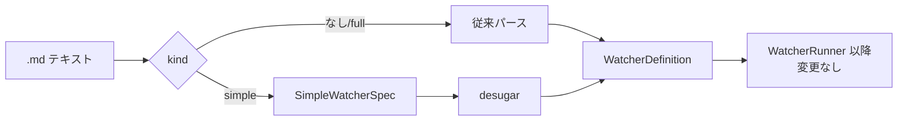

# 34. 簡易 Watcher（Simple Watcher）詳細設計

対象読者: Kikimi 実装者（Claude Code 自身）。実装前に必ず読むこと。

参照元: `kikimi.md` 9章（Watchers 全体仕様）。
依存: `docs/design/05-watcher-runner.md`（Watcher 実行系。本設計はその上の糖衣層）,
`docs/design/17-session-window-redesign.md` §5.4（Watchers タブの管理 UI）。

## 1. 目的とスコープ

### 1.1 動機

現行の Watcher は最初の 1 個を書くために 6 つの概念（独自 YAML 型記法の schema / Mustache view /
derived flags / state_mode / input_scope / trigger）を同時に理解する必要があり、開発者本人ですら
とっつきづらい。一方で「脱線していないか見張る」「今の論点を整理する」「専門用語を解説する」といった
用途は、**プロンプト 1 個 + 対象 + 頻度**だけで表現できる。

### 1.2 方針: 別の仕組みではなく、既存 Watcher に脱糖される薄い皮

簡易 Watcher は既存 Watcher モデルの**退化ケース**として定義する。新しいランタイムは作らない。

| 簡易 Watcher の入力 | フル Watcher への写像 |
|---|---|
| 名前 | `name` |
| 観点プロンプト（自由記述 1 個） | `# System` = 固定前置き + 観点（4章） |
| 対象（直近 N 発言 / サマリのみ / 会議全体） | `input_scope`（`summary_and_recent:<n>` を新設、5章） |
| 実行タイミング | `trigger`（既存 4 種そのまま） |
| — | `schema: { markdown: string }` 固定 |
| — | `view: {{{markdown}}}` 固定 |
| — | `state_mode: snapshot` 固定・`initial_state` なし |

脱糖（desugar）は **parse 時にメモリ上で** `WatcherDefinition` を組み立てる方式にする（テキスト
中間表現を経由しない。理由は 8.2 のエスケープ問題）。`WatcherLibrary` / `WatcherStateMerge` /
`WatcherViewRenderer` / enabled.yaml / fork / promote は**一切変更しない**。`WatcherRunner` への
変更は 5章の input_scope 拡張（simple に依存しない汎用変更）のみで、簡易層そのものは Runner に
一切手を入れない。

### 1.3 スコープ

- `kind: simple` な `.md` ファイル形式の定義とパース（3章）
- 脱糖仕様（4章）
- `input_scope: summary_and_recent:<n>` の追加（5章。フル Watcher にも効く汎用拡張）
- UI: 簡易フォームでの作成・編集、詳細形式への一方通行変換（6・7章）
- kikimi.md 9章への仕様追記（9章）

**スコープ外**: 簡易 Watcher の preset 同梱（既定プリセットの出荷）、stateful な簡易亜種、
簡易フォームからの `state_mode` / schema 指定（欲しくなったら「詳細形式に変換」で対応する）。

## 2. ファイル形式（`kind: simple`）

保存場所・二層モデル（preset / session-local）・ID 規則・enabled.yaml は既存 Watcher と完全に同一。
同じ `.md` ファイルに `kind: simple` を宣言する。

````markdown
---
kind: simple
id: simple-3f2a9c
name: 論点整理
trigger: on_summary_update
input_scope: summary_and_recent:30
---

いま議論している論点を 3 つ以内で整理してください。
各論点について、対立している選択肢があればそれも書いてください。
````

### 2.1 frontmatter フィールド

| フィールド | 必須 | 値 |
|-----------|------|-----|
| `kind` | ✔ | `simple` 固定（`full` またはキー無しは従来パース経路） |
| `id` | ✔ | 既存と同じ規則（ASCII 英数字とハイフン・ファイル名一致） |
| `name` | ✔ | UI 表示名 |
| `trigger` | ✔ | 既存 4 種（`on_summary_update` / `on_session_end` / `on_manual` / `on_interval:<秒>`） |
| `input_scope` | ✔ | `summary` / `summary_and_recent[:<n>]` / `full_refined`（5章） |
| `model` | — | 既存と同じ（省略時 `watchers.default_model`） |

- **`schema` / `view` / `state_mode` / `initial_state` の記述は禁止**（存在したらパースエラー）。
  「simple なのに schema を書いたが黙って無視される」混乱を防ぐため、レニエントにしない
- 本文（frontmatter 以降の全テキストを trim したもの）= **観点プロンプト**。`# System` / `# User`
  見出しは不要（simple の本文はセクション分割しない）。空はパースエラー

## 3. データモデルとパース

### 3.1 `SimpleWatcherSpec`

```swift
/// A `kind: simple` Watcher file's parsed contents -- the user-facing surface the simple form
/// round-trips through. `desugar()` is the only bridge to the execution engine.
struct SimpleWatcherSpec: Sendable, Equatable {
    var id: String
    var name: String
    var model: String?
    var trigger: WatcherTrigger
    var inputScope: WatcherInputScope
    var prompt: String                // 本文全体（trim 済み・非空）
}
```

新規ファイル `Kikimi/Watchers/SimpleWatcher.swift` に置く。責務は 3 つ:

- `SimpleWatcherSpec.desugar() -> WatcherDefinition`（4章）
- `SimpleWatcherSpec.fileText() -> String` — 簡易フォームの保存内容（2章の形式）を生成。
  `name` / `model` は YAML 二重引用符スカラーとしてエスケープするヘルパを通す（`"` `\` に加えて
  改行を `\n` にエスケープする — フォーム外から改行入り name が渡っても二重引用符スカラーの
  行折りで round-trip が壊れないように。Yams の emit は使わない — キー順・体裁を決定論的に保つ）
- `SimpleWatcherSpec.desugaredFullText() -> String` — 「詳細形式に変換」の出力（7章）

### 3.2 パーサ統合

`WatcherDefinitionParser.parse(text:expectedId:)` の frontmatter パース直後に `kind` キーを見る:

- 無し or `full` → 従来経路（変更なし）
- `simple` → simple 用フィールド検証（2.1）→ `SimpleWatcherSpec` 構築 → `spec.desugar()` を返す。
  既存の `idDoesNotMatchExpectedId` 検証（id とファイル名の一致）は **simple 経路でも同様に行う**
- それ以外 → `WatcherParseError.unknownKind(raw)`（新設ケース）

`WatcherDefinition` に脱糖元を保持するフィールドを追加する:

```swift
struct WatcherDefinition: Sendable, Equatable {
    // ... 既存フィールドは変更なし ...
    /// Non-nil iff this definition was desugared from a `kind: simple` file. The UI uses it to
    /// route editing to the simple form; the runner never reads it.
    var simpleSpec: SimpleWatcherSpec?   // 既定 nil
}
```

`WatcherParseError` の追加ケース（すべて日本語メッセージ付き、既存の流儀）:

| ケース | メッセージ |
|---|---|
| `unknownKind(String)` | 不明な kind 値です: "..." |
| `simpleUnsupportedField(String)` | kind: simple では "..." は使用できません。詳細形式に変換してください。 |
| `simpleEmptyPrompt` | プロンプト本文が空です。frontmatter の後に観点を書いてください。 |

## 4. 脱糖仕様

`SimpleWatcherSpec.desugar()` は以下の `WatcherDefinition` をメモリ上で構築する。

| フィールド | 値 |
|---|---|
| `id` / `name` / `model` / `trigger` / `inputScope` | spec の値そのまま |
| `stateMode` | `.snapshot` |
| `schema` | `markdown: string` の 1 フィールド |
| `view` | `{{{markdown}}}`（**トリプル mustache**。GRMustache は `{{x}}` を HTML エスケープするため、`>` や `&` を含む Markdown が壊れる） |
| `initialState` | `nil` |
| `systemPrompt` | 下記の固定前置き + 観点プロンプト |
| `userPromptTemplate` | 下記の固定テンプレート |
| `simpleSpec` | spec 自身 |

### 4.1 System プロンプト（固定前置き + 観点）

```
あなたは会議のリアルタイム書き起こしを観察するアシスタントです。
次の【観点】に従って、与えられた会議内容から分かることを Markdown で簡潔にまとめてください。

【観点】
<spec.prompt>

【出力ルール】
- markdown フィールドに結果の Markdown 本文を入れて返す
- 会議内容から判断できないことは推測で書かない
- 根拠となる発言を参照するときは、その発言の seg ID（例: seg_00042）を本文にそのまま書く
```

- System は既存設計どおり実行間で完全固定（プレースホルダなし）→ prompt キャッシュが効く
- seg ID は `WatcherViewRenderer.linkifySegmentIds` の既存後処理で自動リンク化されるため、
  簡易 Watcher でもトレーサビリティ（クリックで Transcript ジャンプ）が**追加実装ゼロ**で手に入る

### 4.2 User テンプレート（固定）

```
【直近のサマリ】
{{summary}}

【会話】
{{recent_segments}}
```

- `{{state}}` は含めない（snapshot なので常に空文字。含める意味がない）
- `input_scope: summary` のとき `{{recent_segments}}` は既存仕様どおり空文字に展開される
  （テンプレートは分岐しない）

### 4.3 実行フロー上の位置



パース以降（state ロード・LLM 呼び出し・検証・state 保存・レンダ・イベント）は既存実装のまま。
snapshot なので `watchers/<id>.state.json` には `{"markdown": "..."}` が保存され、ワークスペース
再表示時の初期レンダ（LLM なし再表示）も既存機構で動く。

## 5. `input_scope: summary_and_recent:<n>` の追加

ユーザー要件「対象は直近セグメント数とか全体とか指定できるくらい」に対応する。簡易 Watcher 専用に
せず `WatcherInputScope` 自体を拡張する（フル Watcher にもそのまま効く）。

```swift
enum WatcherInputScope: Sendable, Equatable {
    case summary
    case summaryAndRecent(count: Int)    // RawRepresentable をやめる
    case fullRefined
}
```

- 表記: `summary_and_recent`（従来。`count: 30` に解釈）/ `summary_and_recent:<n>`。
  パースは `on_interval:<秒>` と同じ流儀（`:` 分割 + Int パース、不正は
  `WatcherParseError.invalidRecentCount(raw)` 新設）
- クランプ: **1〜200**。範囲外は warning ログ + クランプ（interval の下限クランプと同じ流儀）。
  200 超が欲しい用途は `full_refined` を使う
- 無印の既定値 30 は `WatcherInputScope` の static 定数
  （`WatcherInputScope.defaultRecentCount`）として持つ。既存の `WatcherRunner.recentSegmentWindow`
  （`WatcherRunner.swift:59`）はこれに置き換えて削除する — 無印の解決はパース時に行うため、
  パーサが Runner の定数へ依存する逆向きのレイヤリングを避ける
- `WatcherRunner` のセグメント切り出し（`resolveRecentSegments` 相当の switch）は
  `case .summaryAndRecent(let count): merged.suffix(count)` に変更
- 既存定義ファイル・kikimi.md 9章の正典例は `summary_and_recent` 無印のまま**後方互換**

## 6. UI: 作成・編集

### 6.1 方針: 簡易フォームを既定の入口にする

簡易層を足しても入口がフルエディタのままでは印象が変わらないため、
`WatcherManagementSection` の「新規作成」を**簡易フォームに差し替える**。フル形式の新規作成は
フォーム内の控えめなリンク「詳細形式で作成…」から既存の `NewLocalWatcherSheet` 経路に入る。

### 6.2 `SimpleWatcherFormSheet`（新規 View）

`Kikimi/Views/MeetingWorkspace/SimpleWatcherFormSheet.swift`。作成と編集を兼ねる
（`WatcherEditSheet` と同様に closure 注入で ViewModel 非依存）。

| フォーム項目 | コントロール | 写像 |
|---|---|---|
| 名前 | TextField（必須） | `name` |
| 観点 | 複数行 TextEditor（必須）。placeholder に例を出す | `prompt` |
| 対象 | Picker: サマリのみ / サマリ + 直近の発言（+ 発言数 Stepper 1〜200、既定 30）/ サマリ + 全発言。下に注記「どの選択でもサマリは常に含まれます。」 | `input_scope` |
| 実行タイミング | Picker: サマリ更新ごと（既定）/ 定期（+ 分数 Stepper、秒に換算）/ 手動のみ / 会議終了時 | `trigger` |

- **対象のラベルはすべて「サマリ」で始める**。`WatcherRunner` は `input_scope` に関係なく毎回
  `summary.md` を読んで `{{summary}}` を展開するため（簡易 Watcher の `userPromptTemplate` は
  必ず `{{summary}}` を含む）、この Picker が実際に変えているのは「逐語セグメントを何件足すか」
  だけ。旧ラベル（直近の会話 / サマリのみ / 会議全体）は 3 つの排他的な入力源に見え、
  「この Watcher は会議全体を見たのか直近だけか」が読み取れなかった
- **id はフォームに出さない**。作成時に `simple-` + UUID 先頭 6 hex を自動生成し、衝突があれば
  再生成（ループ）。衝突チェックは session-local だけでなく **preset（`listPresetIds()`）も含める**
  — 過去に promote した simple preset と同 id を引くと、解決順序（session-local 優先）で preset を
  黙って shadow してしまうため。ユーザーが id を意識する必要をなくす
- model 指定はフォームに出さない（既定 model で足りる。変えたければ詳細形式に変換）。ただし
  手書きで `model:` を付けた simple ファイルを編集しても既存値は保持される（6.3 の draft 引き継ぎ）
- 保存 = `SimpleWatcherSpec.fileText()` を `watchers/<id>.md` に書き（新規時は enabled にも追加）、
  `refreshWatcherItems()`。既存の `saveLocalWatcherText` と違い、フォームからの保存は構造上
  必ずパース可能なテキストになるため警告分岐は不要
- 定期の分数 Stepper は 1〜60 分。既存パーサの下限クランプ（10 秒）はそのまま生きる。
  手編集で分に割り切れない秒数（例: `on_interval:45`）になった simple ファイルをフォームで開いた
  場合は**分に切り上げ（最小 1 分）で初期化**し、そのまま保存すれば丸めた値で上書きされることを
  許容する（フォームは分単位が仕様。秒単位を維持したければ詳細形式に変換する）

### 6.3 編集ルーティング

`WatcherPanelItem` に `var isSimple: Bool` を追加（`refreshWatcherItems()` が
`definition.simpleSpec != nil` から設定。`.missing` は `false`）。

| 行の状態 | 「編集」の挙動 |
|---|---|
| simple・session-local | `SimpleWatcherFormSheet`（`simpleSpec` から初期値を復元） |
| simple・preset | `SimpleWatcherFormSheet` を読み取り専用表示（fork すれば編集可。既存 preset 行の流儀と同じ） |
| full | 従来どおり `WatcherEditSheet`（テキストエディタ） |
| simple だが手編集でパース不能になったもの | `.missing` 扱い（既存挙動）。編集ボタンは disabled のまま |

ViewModel 側の追加 API（`MeetingWorkspaceViewModel+Watchers.swift`）:

```swift
// Mutating APIs all throw LocalizedError-conforming errors (see error-reporting policy below).
func createSimpleWatcher(_ spec: SimpleWatcherSpecDraft) async throws  // id 自動生成 + 保存 + enable
func updateSimpleWatcher(id: String, _ spec: SimpleWatcherSpecDraft) async throws
func simpleWatcherSpec(id: String) async -> SimpleWatcherSpec?         // フォーム初期値（resolve + parse）
func convertSimpleWatcherToFull(id: String) async throws               // 7章
```

`SimpleWatcherSpecDraft` = id 抜きのフォーム入力値 + 引き継ぎ値
（`name` / `model` / `prompt` / `trigger` / `inputScope`）。

- **`model` の引き継ぎ（サイレント喪失の防止）**: draft は `model: String?` を持つ。フォーム UI には
  出さない（6.2）が、編集時は `simpleWatcherSpec(id:)` が返した既存 spec の `model` をそのまま
  draft に載せて `fileText()` に反映する。手書きで `model:` を付けた simple ファイル（2.1 で明示的に
  許可）をフォームで編集・保存しても model 指定が消えない。新規作成時は `nil`
- **エラー報告方式の統一**: 新設の変更系 3 API（create / update / convert）はすべて `throws` に
  統一し、投げるエラーは `LocalizedError` 準拠（`errorDescription` は日本語）にする —
  `LocalWatcherCreationError` の既存前例に合わせる。特に `updateSimpleWatcher` を戻り値なし
  `async` にしない: ファイル書き込み失敗を外に出せず、フォームが成功したように閉じてしまうため。
  既存 `saveLocalWatcherText` の `String?` 返却契約は「編集途中のテキストでも保存を止めない」
  ための別仕様なので変更しない
- **フォームでのエラー表示**: `SimpleWatcherFormSheet` は保存/変換の `catch` で
  `(error as? LocalizedError)?.errorDescription ?? "保存に失敗しました。"` を
  `@State var errorMessage: String?` に入れ、フォーム下部に赤字でインライン表示する。
  エラー時はシートを閉じない（`NewLocalWatcherSheet` が `LocalWatcherCreationError` を
  インライン表示するのと同じ流儀）

## 7. 詳細形式への変換（一方通行の eject）

簡易フォームの限界に当たったユーザーの学習経路。session-local の simple 行にのみ
「詳細形式に変換…」ボタンを出す（確認 alert: 「変換すると簡易フォームでは編集できなくなります」）。

- `SimpleWatcherSpec.desugaredFullText()` が 4章の脱糖結果を**フル形式のテキスト**として生成する
  （frontmatter: `id` / `name` / `model?` / `trigger` / `state_mode: snapshot` / `input_scope` /
  `schema` / `view` + `# System` / `# User` セクション）
- **frontmatter の emit 形式**（Yams emit は使わず決定論的に手組み。`fileText()` と同じ方針）:
  - `id` / `trigger` / `state_mode` / `input_scope` — プレーンスカラー。値の文法が ASCII 英数字・
    ハイフン・コロン・アンダースコアに閉じており、YAML 特殊文字を含み得ない
  - `name` / `model` / `view` — **二重引用符スカラー**（`fileText()` と同じエスケープヘルパを通す。
    schema 以外の文字列値は全てこの形式で emit する）。特に `view` の値 `{{{markdown}}}` を
    プレーンスカラーで emit すると `{` が YAML flow mapping の開始と解釈され（Yams）、parse 側で
    `mapping["view"]?.string` が nil → `missingRequiredField("view")` が throw される
    （`WatcherDefinition.swift` の parse 実装で確認済み）。正典例（kikimi.md 9章の `view: |`
    ブロックスカラー）ではなく二重引用符を選ぶのは、ブロックスカラーの chomping（末尾改行の
    有無）が round-trip 一致判定を複雑にするため — 二重引用符なら parse 結果が `desugar()` の
    `view` 値（`{{{markdown}}}`）と文字単位で一致する
  - `schema` — `schema:` + 改行 + `  markdown: string` の固定 2 行（値に特殊文字を含まない）
- 生成テキストを `watchers/<id>.md` に上書き → `refreshWatcherItems()` → テキスト編集シートを開く
- **round-trip 検証**: 書き込み前に生成テキストを `WatcherDefinitionParser.parse` に通す。
  失敗分岐は 2 つあり、どちらもファイルを書き込まない:
  1. **parse が throw** — `SimpleWatcherConversionError.parseFailed(detail:)` を throw。メッセージは
     原因を決め打ちしない汎用形:
     「詳細形式への変換に失敗しました: <parse エラーの errorDescription>」
  2. **parse は成功したが結果が `spec.desugar()` と不一致**（`simpleSpec` を除いて比較）—
     `SimpleWatcherConversionError.roundTripMismatch` を throw。既知の原因は観点プロンプト内の
     `# ` で始まる行によるセクション分割ずれなので、メッセージは
     「プロンプトに "# " で始まる行が含まれているため変換できません。行頭の "#" を減らすか削除してください。」
- `SimpleWatcherConversionError` は `LocalizedError` 準拠の新設 enum（6.3 のエラー統一方針）。
  フォーム/管理画面側は 6.3 の表示流儀でメッセージを出す。**実行系は 4章のメモリ上脱糖を使うため、
  この制約は eject 時のみ**（simple のまま使う分には `# ` 行入りプロンプトも正常動作する）
- 逆変換（full → simple）は提供しない

## 8. 設計上の判断メモ

### 8.1 なぜ同じ `.md` / 同じ置き場か

- fork / promote / enabled.yaml / default_watchers.yaml / セッション間コピー（将来）が
  無改修でそのまま効く
- 「簡易で作って、育ったらプリセット化」という既存の昇格動線に自然に乗る

### 8.2 なぜ脱糖をテキスト経由にしないか

観点プロンプトは自由テキストなので、フル形式テキストに埋め込むと `# System` / `# User` の
セクション区切りと衝突し得る（インジェクション）。実行のたびに通る経路は値ベースの
`desugar()` にして構造的に安全にし、テキスト生成は eject 時だけ round-trip 検証付きで行う。

### 8.3 表示ブレの割り切り

schema + view モデルの存在理由だった「LLM 出力ブレの排除」を、簡易層は意図的に放棄する
（markdown 1 フィールドの素通し）。構造化表示・stateful 追跡（TODO 追跡・事前確認チェッカー等）が
必要な用途はフル Watcher の領分、という役割分担を kikimi.md にも明記する（9章）。

## 9. kikimi.md への反映（実装時に同時更新）

9章「Watchers」に「簡易 Watcher」節を追加する:

- 2 形式の宣言（`kind: simple` / 省略時 full）とファイル例
- 写像表（1.2 の表を簡約したもの）と「snapshot 固定・schema/view/state 不可」の制約
- `input_scope: summary_and_recent:<n>` は「schema の型記法」隣の input_scope 表を更新
- UI: 新規作成の既定が簡易フォームであること、詳細形式への一方通行変換
- `docs/design/05-watcher-runner.md` の冒頭参照リストにも本設計への参照を 1 行追記

## 10. 失敗モード一覧

| 失敗 | 挙動 |
|---|---|
| `kind` が未知の値 | パースエラー（`.missing` バッジ、既存の定義パースエラー経路） |
| `kind: simple` + `schema`/`view`/`state_mode`/`initial_state` あり | パースエラー（`simpleUnsupportedField`） |
| simple の本文（プロンプト）が空 | パースエラー（`simpleEmptyPrompt`） |
| `summary_and_recent:<n>` の n が非数値 | パースエラー（`invalidRecentCount`） |
| n が 1〜200 の範囲外 | warning ログ + クランプ（実行は継続） |
| eject: 生成テキストの parse が throw | 書き込まず `parseFailed` を throw（汎用メッセージ「詳細形式への変換に失敗しました: ...」。ファイル無変更） |
| eject: parse 成功だが round-trip 不一致 | 書き込まず `roundTripMismatch` を throw（`# ` 行の案内メッセージ。ファイル無変更） |
| 簡易フォーム保存（create / update）のファイル書き込み失敗 | throw → フォーム下部にエラー表示・シートは閉じない（6.3） |
| simple ファイルの手編集でパース不能 | 既存どおり `.missing` + error バッジ。フォームは開かない |
| 実行時エラー（LLM 失敗・schema 不合格等） | 既存の失敗モード表（05 §12）がそのまま適用される |

## 11. テスト計画

### 11.1 レイヤ 1（swift-testing）

- `SimpleWatcherSpecTests`（新規）:
  - パース: 必須フィールド・`kind` 未知値・禁止フィールド検出・本文空・本文 trim・
    id とファイル名（expectedId）不一致
  - `fileText()` → parse の round-trip（name に `"` / `\` / 改行 / 日本語を含むケース）
  - `desugar()`: schema / view（`{{{markdown}}}`）/ snapshot / initialState nil / System に観点が
    埋まる / User に `{{state}}` が無い
  - `desugaredFullText()` → parse → `desugar()` 一致（`view` が二重引用符 emit から
    `{{{markdown}}}` へ正しく復元されること）、`# ` 行入りプロンプトで `roundTripMismatch`、
    parse が throw する生成テキストで `parseFailed`（汎用メッセージ）
- `WatcherDefinitionParserTests` 追記: `kind` 分岐（無し / `full` / `simple` / 未知）。
  既存の `.summaryAndRecent` 等値比較は `.summaryAndRecent(count: 30)` へ書き換え
- `WatcherSchemaTests` は変更なし（simple の schema は既存型で表現される）
- input_scope 拡張: パース（無印 30 / `:<n>` / 非数値エラー / クランプ）と
  `WatcherRunnerTests` のセグメント窓（n 指定が `suffix` に効くこと）
- `WatcherViewRendererTests` 追記: `{{{markdown}}}` で `>` `&` を含む Markdown が
  エスケープされないこと
- ViewModel: `createSimpleWatcher` の id 自動生成（衝突時再生成）・enable 追加、
  `refreshWatcherItems` の `isSimple` 設定、`model:` 付き simple ファイルを
  `simpleWatcherSpec(id:)` → draft → `updateSimpleWatcher` で保存しても `model` が保持されること、
  書き込み失敗時に create / update / convert が `LocalizedError` を throw すること

### 11.2 レイヤ 2（kikimi-verify）

- `KIKIMI_STUB_LLM=1` で simple watcher（session-local）を置き、録音 → サマリ更新発火 →
  Watchers タブに markdown が素通し表示されること、`state.json` が
  `{"markdown": "..."}` になること
- 簡易フォームからの作成 → 行が増えて enabled になること（UI 動作確認はユーザーに委譲）

## 12. 実装モジュール一覧

新規:

| ファイル | 内容 |
|---|---|
| `Kikimi/Watchers/SimpleWatcher.swift` | `SimpleWatcherSpec` + parse 補助 + `desugar` + `fileText` + `desugaredFullText`（3・4・7章） |
| `Kikimi/Views/MeetingWorkspace/SimpleWatcherFormSheet.swift` | 簡易フォーム（6.2） |
| `KikimiTests/Watchers/SimpleWatcherSpecTests.swift` | 11.1 |

変更:

| ファイル | 変更 |
|---|---|
| `Kikimi/Watchers/WatcherDefinition.swift` | `kind` 分岐・`simpleSpec` フィールド・`WatcherParseError` 追加ケース・`input_scope` パラメータ化（3.2・5章） |
| `Kikimi/Watchers/WatcherRunner.swift` | `summaryAndRecent(count:)` の窓適用（5章） |
| `Kikimi/ViewModels/MeetingWorkspaceViewModel+Watchers.swift` | `isSimple`・simple CRUD・eject（6.3・7章） |
| `Kikimi/Views/MeetingWorkspace/WatcherManagementSection.swift` | 新規作成の既定を簡易フォームへ・編集ルーティング・変換ボタン（6章） |
| `kikimi.md` | 9章に簡易 Watcher 節（9章） |
| `docs/design/05-watcher-runner.md` | 冒頭に本設計への参照 1 行 |
