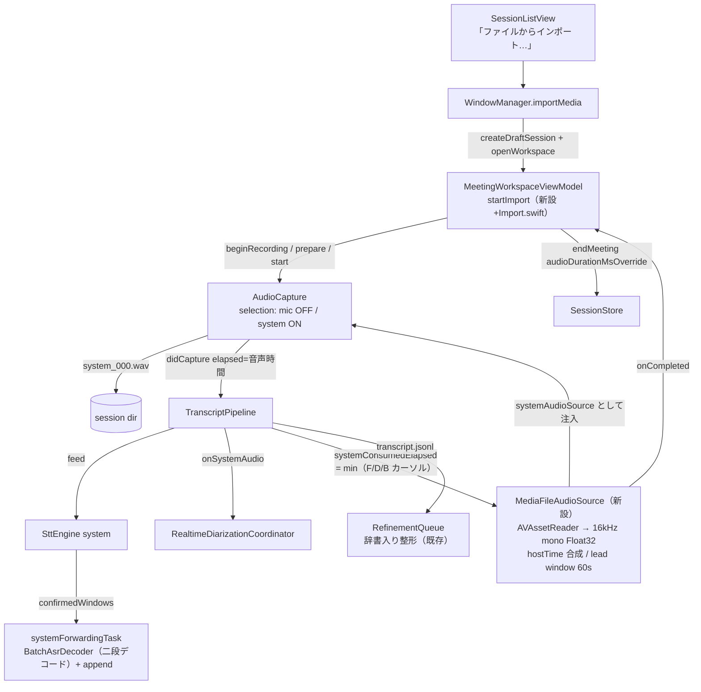

# 36. メディアインポート書き起こし（動画/音声ファイルの取り込み）詳細設計

対象読者: Kikimi 実装者（Claude Code 自身）。実装前に必ず読むこと。

参照元: `kikimi.md` 4-6 章（データモデル・録音パイプライン）, 10 章（Session Window）,
`docs/design/10-audio-input-selection.md`（`AudioInputSelection`・ソース注入）,
`docs/design/11-streaming-stt.md` §3.3-3.4（セグメント確定・タイムスタンプ）,
`docs/design/13-speaker-diarization.md`（話者分離・リネーム）,
`docs/design/03-refinement-batch.md` / `28-glossary.md`（辞書入り LLM 整形）,
`docs/design/04-summary-updater.md`（サマリ更新トリガ）,
`docs/design/33-meeting-two-pass-decode.md`（二段デコード）。

**位置づけ**: 本文書は Go/No-Go 前の詳細設計段階であり、実装はしていない。

**経緯**: ユーザー要件は「任意の動画/音声ファイルをインポートすると、会議書き起こしと同じ UI が
開いてセグメント分割・話者自動分類され、ユーザーが話者を設定できる。登録済みの用語集（辞書）に
基づく LLM 整形も効く」。実現方式として、オフライン専用パイプラインの新設ではなく
**既存のリアルタイム録音パイプラインにファイル音源を高速給餌する方式**（疑似リアルタイム給餌）を
採用する。design 13 が「リアルタイム一本の単層構成」を選んだ理由（WYSIWYG・手動調整の保全・
アーキテクチャの一貫性）と同じ判断軸であり、STT・話者分離・二段デコード・整形・サマリ・Watcher・
Wiki export・閲覧 UI のすべてを無改修または最小改修で流用する。

本設計の要点は以下のとおり。

- **パイプライン中核はすでにサンプルクロック駆動である**（実装調査で確定）: `SttEngine` の
  セグメント確定（idle timeout 含む）とタイムスタンプは `feed()` に渡される
  `elapsedAtBufferStart` のみに依存し `Date()`/`Timer` を一切使わない
  （`SttEngine.swift` / `SttEngine+PureHelpers.swift` に実時間 API のヒットなし）。話者分離
  （`RealtimeDiarizationCoordinator` / LS-EEND backend）もバッファ到着駆動でタイマーを持たない。
  実時間依存は **`AudioCapture` の elapsed 算出（`mach_absolute_time` ベース、
  `AudioCapture.swift:481-483`）だけ**なので、ファイル音源側が hostTime をサンプル位置から合成して
  渡せば、中核は無改修で実時間より速く回る
- **給餌は消費連動ペーシング（lead window）**: 速度倍率の設定は持たない。ファイル音源は
  「配信済み音声時間 − パイプライン消費済み音声時間 ≤ 60 秒」を保って配信する。前提として重要なのは、
  system 側パイプラインが**直列 1 本ではなく 3 つの非同期段**で構成されている点である（初稿の
  「feed ループが STT feed → 二段デコード → 話者分離 forward を直列に await する唯一の消費点」
  という調査記述は誤りだったため本稿で訂正）: (1) system feed ループ
  （`TranscriptPipeline.swift:377-390`）が await するのは `SttEngine.feed()`（無制限 `chunkQueue`
  に積んで即 return、`SttEngine.swift:197-220`）と話者分離 forward だけ、(2) ストリーミングデコード
  は `SttEngine` 内の fire-and-forget な decode 連鎖（`SttEngine.swift:247-269`）が別途進める、
  (3) 二段デコード + JSONL append は別 Task（`systemForwardingTask`、
  `TranscriptPipeline.swift:347-368`）が無制限 AsyncStream `confirmedWindows`（raw samples 同梱、
  `SttEngine.swift:117`）を消費して行う。feed ループ位置だけを消費シグナルにすると (2)(3) の滞留を
  一切抑えられないため、**消費シグナルは 3 段それぞれのカーソルの min** とする（MI4 / §3.2）。
  これにより処理速度は最も遅い段に自動で律速され、各段の滞留が lead window 分で構造的に有界になる
- **注入点は `KIKIMI_TEST_INPUT` と同じ**: `AudioCapture.init` の `systemAudioSource` 注入
  （`AudioCapture.swift:111-148`）に、新設の `MediaFileAudioSource`（AVAssetReader デコード +
  高速配信 + EOF 通知）を渡す。mic 無効・system のみの `AudioInputSelection`（design 10 で正式
  サポート済み）を使う。`AudioCapture` 経由なので **`system_000.wav` が自動で書き出され、
  セグメント再生（design 15）もそのまま動く**
- **EOF で既存の会議終了フローを実行する**: 整形 flush/drain・最終サマリ・タイトル自動命名・
  `on_session_end` Watcher・Wiki export は `endMeeting()` の既存配線をそのまま使う。後処理
  4 コンポーネント（RefinementQueue / SummaryUpdater / WatcherRunner / WikiExporter）はいずれも
  `SessionState` を直接参照しない設計であることを確認済み。ただし既存 `endMeeting()` の
  transient updater 分岐は `updateNow` を呼ばないため、そのまま共有すると最終サマリが生成されない
  （MI9 / §3.3 手順 5 で対処）。また、インポートは `recordingSessionId` を占有するため、メニューバー
  「会議を終了…」・アプリ終了時 `pauseRecording()`・ウィンドウ close という**ワークスペース外からの
  録音制御 3 経路**がインポート中の ViewModel に届く。これらはインポート終了（キャンセル相当）へ
  写像または stow 化する（MI16 / §3.6）
- **辞書（用語集）は無改修で効く**: design 28 で用語集は機能非依存の top-level 設定であり、
  `RefinementQueue` の system prompt に常時注入される。インポートの整形はこの経路をそのまま通る
- **話者分離・話者リネームも無改修**: 会議のシステム音声ストリームはもともと「複数話者が混ざった
  1 本の音声」であり、インポートファイルは同じ性質の入力。LS-EEND（callhome variant）・声紋マッチ・
  スロットリネーム・`segment_overrides`（Ended 後リネームは正式サポート、design 13 §6）が
  そのまま使える
- **`durationMs` は音声時間で確定する**: `SessionStore.closeCurrentSegment` は wall-clock 差分で
  `durationMs` を加算する（`SessionStore.swift:497-504`）ため、高速インポートでそのまま通すと
  実長より短い値が記録され、Ended → `reopenForRecording` 時の `startMsOffset` が音声ファイル長と
  食い違う。インポート確定時はフィード済みサンプル数から算出した音声時間で上書きする
- **サマリの間欠更新はインポート中は行わない**: セグメント数 20 件トリガのままだと 1 時間の
  ファイルで 30 回前後の中間サマリ更新（LLM コスト）が走り、その結果は最終サマリで捨てられる。
  インポートでは完了時の最終更新 1 回だけにする

## 1. 目的とスコープ

**やること**:

- 動画/音声ファイル（AVFoundation が読める形式: mp4 / mov / m4a / mp3 / aac / wav 等）を選択して
  インポートセッションを作成し、高速書き起こしする（STT + 二段デコード + 話者分離 + 辞書入り
  LLM 整形 + 最終サマリ + `on_session_end` Watcher + Wiki export）
- 会議ワークスペース UI（`MeetingWorkspaceView`）をそのまま使う: インポート中は transcript が
  流れ込む進行表示、完了後は通常の Ended セッションとして話者リネーム・セグメント再生・サマリ閲覧
- インポート進捗（%）の表示とキャンセル（キャンセル時は部分結果で Ended 確定）
- `meta.json` へのインポート起源情報（`import_source`）の記録

**やらないこと（§10 も参照）**:

- URL scheme / ドラッグ&ドロップ / 複数ファイル一括インポート（初版はファイル選択パネル 1 本）
- オフライン話者再分離による精度上積み（design 13 §14 の将来救済パスのまま）
- インポートと会議録音の同時実行（`recordingSessionId` 排他をそのまま使う。インポート中は
  録音開始できず、録音中はインポートできない）
- 元メディアファイルのコピー・管理（参照情報だけ `meta.json` に記録。再生は自動生成される
  `system_000.wav` を使うので元ファイルが消えても閲覧・再生は壊れない）
- 字幕・既存書き起こしテキストの取り込み

## 2. 決定事項

| # | 決定 |
|---|------|
| MI1 | **疑似リアルタイム給餌方式**を採用する。オフライン専用パイプライン（`BatchAsrDecoder` で無音分割一括デコード + オフライン話者分離）は退けた: セグメント確定・話者分離・タイムスタンプ採番・保存の制御が二重化し、リアルタイム側と挙動がずれるため。二段デコード（design 33）が既定 ON なので、疑似リアルタイム方式でも確定テキストの品質はバッチ（Parakeet）品質になる |
| MI2 | ファイル音源は **`MediaFileAudioSource`**（新設、`Kikimi/AudioCapture/`）。`AudioSourceCapturing` 準拠で、`AudioCapture.init` の `systemAudioSource` に注入する（`KIKIMI_TEST_INPUT` の `TestFileAudioSource` と同じ注入点）。`TestFileAudioSource` の改造はしない（あれは「実時間ペーシング + ループ再生」という検証専用の意図的な仕様。用途が違うものを 1 クラスに同居させない） |
| MI3 | **hostTime のサンプル位置合成**: `MediaFileAudioSource` は `start()` 時に `mach_absolute_time()` を基点として記録し、各チャンクの `AVAudioTime` を「基点 + 配信済みサンプル数/16000 秒相当の hostTime ticks」で合成する。`AudioCapture.elapsed(from:recordingStartHostTime:)` はこの hostTime と録音開始 hostTime の差分を取るため、`elapsedAtBufferStart` は配信速度と無関係に**音声時間**になる。`SttEngine` の idle timeout（route 2）は「音声上の 2 秒の無音」として実時間投入時と同一に発火し、`startMs`/`endMs` も音声位置に正しく対応する。基点の取得は `AudioCapture.start()` 内の `recordingStartHostTime` 記録より後（`start(bufferHandler:)` 呼び出し時）なので差は定数 1ms 未満であり、チャンク粒度（±1.6 秒、design 11 §3.4）に対して無視できる |
| MI4 | **消費連動ペーシング（lead window 60 秒、消費シグナルは 3 段カーソルの min）**: system 側は「F: feed ループ（STT 受領 + 話者分離 forward）」「D: ストリーミングデコード（`SttEngine` 内の無制限 `chunkQueue` + fire-and-forget decode 連鎖）」「B: 二段デコード + append（`systemForwardingTask` が無制限 `confirmedWindows` を消費）」の 3 つの非同期段からなり、F の位置は「投入済み + 話者分離済み」しか表さない。よって `systemConsumedElapsed` は §3.2 の 3 カーソル `min(feedCursor, decodeCursor, appendCursor)` で算出する（B は未処理窓 0 のとき min から除外 — 除外しないと給餌と窓確定の相互待ちでデッドロックする）。`MediaFileAudioSource` は注入された `consumedElapsedProvider: @Sendable () -> TimeInterval` を参照し、`配信済み音声時間 − consumed > 60 秒` の間は 50ms 間隔で待つ。**最も遅い段への自動律速はこの min によって成立する**（feed ループ位置だけでは D/B の滞留を抑えられず、二段デコードが遅いマシンでは 1 時間ファイルで `chunkQueue` + `confirmedWindows`（raw samples 同梱）に数百 MB 級が滞留し得た）。滞留は各段とも音声 60 秒分以下（16kHz Float32 で約 3.7MB/60 秒、合計 1 桁 MB）で有界。二段デコードの窓 retention 自体はリアルタイム録音でも同量発生する既存特性であり本設計で増えない。速度設定・倍率 config は持たない |
| MI5 | **入力ソース構成は mic 無効・system 有効**の `AudioInputSelection` を固定で使う（design 10 の既存サポート範囲。診断・声紋・話者分離・整形の system 系経路がすべてそのまま適用される）。`state.yaml` の「前回の録音入力」記憶は読みもしないし書き換えもしない（インポートは録音入力の選択ではない） |
| MI6 | **WAV 書き出しは既存のまま**: `AudioCapture` が `system_000.wav` を書く（デコード済み 16kHz PCM）。セグメント再生（design 15）・音声シークは既存実装がそのまま動く。元メディアファイルはコピーしない（MI13） |
| MI7 | **セッションライフサイクルは Draft → Recording → Ended をそのまま通す**: `createDraftSession` → `beginRecording` → （給餌）→ `endMeeting`。`recordingSessionId` 排他もそのまま効かせる（インポートは「録音スロット」を占有する。同時実行は初版ではサポートしない、§10）。録音を経由しない専用状態（`importing` 等）は追加しない — 状態を増やすと View/ViewModel/SessionStore の全分岐に波及するが、得られるのは同時実行だけで初版の要件にない |
| MI8 | **`durationMs` の確定**: `SessionStore.endMeeting(_:)` に optional 引数 `audioDurationMsOverride: Int? = nil` を追加する。非 nil のとき、`closeCurrentSegment` の wall-clock 加算結果を捨ててこの値を `meta.durationMs` にセットする（`recordings[].endedAt` は実時刻のままで良い — 実時刻メタデータとしての意味は保つ）。インポート確定時はフィード済みサンプル数から算出した音声時間を渡す。既存呼び出し（nil）は 1 バイトも挙動が変わらない |
| MI9 | **サマリ間欠更新の抑止**: インポートフローでは `startSummaryUpdaterIfNeeded()` を呼ばない。完了時（EOF/キャンセル）は最終サマリ 1 回 + タイトル自動命名だけを走らせる。**注意（既存コードとの食い違い）**: 既存 `endMeeting()` は `summaryUpdater == nil` のとき transient updater で `generateFinalTitleProposal` のみ呼び `updateNow` を呼ばない（Paused 経由なら pause 時に更新済みという前提の分岐、`MeetingWorkspaceViewModel+Recording.swift:173-187`）。インポートは updater を起動しないため必ずこの nil 分岐に入り、そのまま共有すると**最終サマリが一度も生成されない**。共有後処理に「transient updater でも `updateNow(reason:)` を `generateFinalTitleProposal` より先に呼ぶ」挙動変更フラグを設け、インポート経路だけ有効にする（§3.3 手順 5。既存の Paused 経由 nil 分岐は挙動不変）。整形（`RefinementQueue`）は通常どおり動かす（確定テキストの品質に必須。バッチタイムアウト 5 秒は実時間のままで、実質は件数トリガ（10 件）支配になるが壊れない — 調査で確認済みの許容挙動）。`on_interval` Watcher も開始しない（`startIntervalWatchers` を呼ばない）。`on_manual` / `on_session_end` は既存どおり |
| MI10 | **EOF/エラー/キャンセルの終端処理は 1 本に集約**: `MediaFileAudioSource` は全チャンク配信完了で `onCompleted(.finished)`、デコード失敗で `onCompleted(.failed(Error))` を 1 回だけ呼ぶ。ViewModel はこれを受けて既存の停止列（`AudioCapture.stop()` → `TranscriptPipeline.stopAndDrain()` → diarization `endSegment` → `endMeeting(audioDurationMsOverride:)`）を実行する。キャンセルはユーザー操作から同じ停止列に入る（部分結果で Ended 確定。破棄はしない — セッション削除は既存の一覧操作に委ねる）。失敗時も途中までの transcript を保持して Ended 確定し、エラーバナーを出す。**テキストを失う経路は作らない** |
| MI11 | **進捗 UI**: `WorkspaceBanner` に `.importingMedia(progress: Double, isFinalizing: Bool)` を追加（`.sttModelDownloading` と同型の % 付きバナー）。進捗 = **消費済み音声時間（`systemConsumedElapsed` の min カーソル、§3.2）/ 総時間**（総時間は `AVAsset.load(.duration)` から）。配信済み基準にしない理由: 配信は lead window 分（最大 60 秒）先行して 100% に達し、その後の `stopAndDrain()`（`systemForwardingTask` 完了を await、`TranscriptPipeline.swift:559-581`）が残 backlog + 末尾窓 redecode を処理する間、無進捗の 100% 表示で「完了しない」ように見えるため。EOF 配信完了〜Ended 確定の間は `isFinalizing: true` で「仕上げ中…」表記に切り替える（消費カーソルは drain 中も進むので進捗値は動き続ける。MI4 のペーシングにより drain 残量は最大 60 秒分 + 末尾窓で有界）。インポート中は録音コントロール（一時停止/会議終了ボタン）を出さず、代わりに「キャンセル」ボタンを出す（`MeetingWorkspaceViewModel.isImporting` で出し分け。`RecordingButtonState` に新 case は足さない — あの enum は録音ボタンの状態機械であり、インポートはボタン 1 個 + バナーで足りる。インポート中の値は MI16 で `.recording(elapsedSeconds: 0)` 固定と規定） |
| MI12 | **`meta.json` に `import_source` を追加**: `SessionMeta.importSource: ImportSource?`（`original_file_name: String`, `imported_at: Date`。フルパスは保存しない — セッションフォルダは Wiki export 等で共有され得るためファイル名のみ）。`init` / 防御的 `init(from:)` の両方に追加し、既存セッションのデコードは `nil` フォールバック。`basedOnSession` は複製用フィールドなので流用しない |
| MI13 | **元ファイルは参照もコピーもしない**（`import_source` のファイル名記録のみ）。再生・シークは `system_000.wav`。ディスクは WAV 分だけ増える（1 時間 ≒ 110MB。kikimi.md 14 章の既知課題「音声ファイルサイズ制限」と同じ土俵で扱う） |
| MI14 | **入口 UI はセッション一覧のツールバー「ファイルからインポート…」**（`NSOpenPanel`、`allowedContentTypes: [.audiovisualContent]`）。選択直後に (a) `AVAsset` の音声トラック有無、(b) `recordingSessionId` の空き（他セッションが録音/インポート中でないこと）を検査し、どちらか NG なら**セッションを作らずに**アラートで弾く（`beginRecording` の排他エラーまで進んでから失敗するとゴミ Draft が残るため、作成前に確認する。検査後の TOCTOU 競合は `beginRecording` の排他が最終防衛線）。検査通過後 `WindowManager.importMedia(url:)` → `createDraftSession`（タイトル初期値 = 拡張子抜きファイル名、`titleAutoGenerated` は既存の自動命名に委ねる）→ ワークスペースを開いて即 `startImport(url:)` |
| MI15 | **config 追加なし**: lead window（60 秒）・チャンクサイズ（`micTapBufferSize` と同じ 1024 frames）・ポーリング間隔（50ms）は定数。二段デコードは既存 `stt.two_pass_decode`、話者分離は既存 `diarization.*`、整形・辞書は既存設定にそのまま従う |
| MI16 | **外部の録音制御経路の規定**: インポートは `recordingSessionId` を占有するため、ワークスペース外からの録音制御 3 経路がインポート中の ViewModel に届く。(a) メニューバー「会議を終了…」（`WindowManager.endRecordingMeetingFromMenuBar` → `viewModel.endMeeting()`、`WindowManager.swift:257-288`）、(b) アプリ終了時 `prepareForTermination()` の `pauseRecording()`（`WindowManager.swift:340-344`）、(c) ウィンドウ close（`WindowCloseDecision`）。素通しさせると (a)(b) は `audioDurationMsOverride` なしで wall-clock の `durationMs`（実長より大幅に短い）を確定させ、`isImporting`/進捗バナーも残留する。対応: `endMeeting()` / `pauseRecording()` は冒頭で `isImporting` を判定し、インポート中は `finishImport(reason: .cancelled)`（§3.3 手順 5。停止列 + `audioDurationMsOverride` + `isImporting`/バナー解除込み）へ**写像**する。pause もキャンセル写像にするのは、インポートは配信位置を持ち越せず再開できないため Paused 状態を作らない方針による。(c) はインポート中の `recordingButtonState` を **`.recording(elapsedSeconds: 0)` に固定**する（新 case は足さない — MI11。経過タイマは動かさず、ヘッダの録音コントロールは `isImporting` が隠す）ことで、既存の `WindowCloseDecision.stowInsteadOfClose` が選ばれ close は stow に化ける（インポートは背後で継続、メニューバー/一覧から再表示可。追加実装なし）。`blocksWindowClose == true` になるためアプリ終了確認も既存どおり出る。`finishImport` 実行中は既存遷移と同じく `.ending`、確定後 `.ended` |
| MI17 | **スリープ抑止**: ファイルインポートは純 CPU/ANE 処理で、マイク/SCK 録音のような音声 I/O 由来のスリープ抑止が働かない。長尺インポートがアイドルスリープで止まらないよう、`startImport` で `ProcessInfo.processInfo.beginActivity(options: [.userInitiated, .idleSystemSleepDisabled], reason: "Importing media")` を取得し、`finishImport` で必ず `endActivity` する（失敗・キャンセル・外部経路写像を含む全終端で解放） |

## 3. コンポーネント構成

### 3.1 `MediaFileAudioSource`（`Kikimi/AudioCapture/MediaFileAudioSource.swift`）

`AudioSourceCapturing` 準拠。責務はデコード・チャンク配信・ペーシング・終端通知の 4 つ。

- **デコード**: `AVAssetReader` + `AVAssetReaderAudioMixOutput`。`outputSettings` で
  Linear PCM / Float32 / 16kHz / mono / non-interleaved を指定する（複数音声トラックは
  audio mix output が合成する）。`copyNextSampleBuffer()` で逐次読みし、ファイル全体を
  メモリに載せない（`TestFileAudioSource` の全読みとの決定的な違い）。指定サンプルレートへの
  変換を `AVAssetReaderAudioMixOutput` が直接受けない場合に備えた `AVAudioConverter` 挿入の
  要否はスパイク 2 で確認する（§8）
- **配信ループ**: 専用 `Task` で「デコード → 1024 frames に切り出し → ペーシング待ち →
  `bufferHandler(chunk, 合成 AVAudioTime)`」を繰り返す。`bufferHandler` の先は既存の
  `AudioCapture.handleBuffer`（WAV 書き込み + `didCapture`）
- **hostTime 合成**（MI3）: `start()` で `baseHostTime = mach_absolute_time()` を記録し、
  チャンク n の hostTime を `baseHostTime + hostTicks(deliveredSamples / 16000.0)` とする。
  `mach_timebase_info` 換算は既存流儀に合わせる
- **ペーシング**（MI4）: `deliveredSeconds - consumedElapsedProvider() > 60` の間
  `Task.sleep(50ms)`。`consumedElapsedProvider` は init 注入（`TranscriptPipeline` を直接参照
  しない — `AudioCapture` 層から Stt 層への依存を作らないため。配線は ViewModel が行う）
- **終端**: 全配信完了で `onCompleted(.finished)`、`AVAssetReader` の失敗で
  `onCompleted(.failed(error))`。いずれも 1 回だけ。`stop()`（キャンセル・通常停止）は配信 Task を
  cancel して WAV 途中で止める（以後の終端通知はしない — 停止列は呼び出し側が既に進めている）
- **進捗**: `MediaFileAudioSource` 自身は総時間（`AVAsset.load(.duration)`）と配信済み時間を
  公開するだけで、バナーの進捗値は ViewModel が
  `transcriptPipeline.systemConsumedElapsed / 総時間` で算出する（MI11 — 配信済み基準だと
  lead window 分先行して 100% に張り付くため。1 秒粒度のポーリングで足りる）。
  `AVAsset.load(.duration)` は VBR mp3 等で推定値になり得るため、進捗値は `[0, 1]` にクランプし、
  実デコード総サンプル数が推定と食い違っても終端判定は EOF（`copyNextSampleBuffer` が nil）のみを
  正とする

### 3.2 消費カーソルと lead window 判定（MI4）

system 側パイプラインは次の 3 つの非同期段からなり、段間キューはいずれも**無制限**である
（実装調査の再確認結果。初稿の「直列 1 本」認識はここで訂正済み）:

| 段 | 実体 | 段間キュー |
|---|---|---|
| F: feed ループ | `systemFeedTask`（STT `feed()` 受領 + 話者分離 forward を直列 await、`TranscriptPipeline.swift:377-390`） | `systemBufferStream`（無制限 AsyncStream） |
| D: ストリーミングデコード | `SttEngine` 内の fire-and-forget decode 連鎖（`scheduleNextChunkIfNeeded`、`SttEngine.swift:247-269`。`feed()` は積んで即 return） | `chunkQueue`（無制限配列） |
| B: 二段デコード + append | `systemForwardingTask`（redecode → `appendOrLog`、`TranscriptPipeline.swift:347-368`） | `confirmedWindows`（無制限 AsyncStream、raw samples 同梱） |

消費シグナルは 3 段のカーソルの min とする:

- **feedCursor**（F）: `systemFeedTask` ループの各イテレーション末尾（`onSystemAudio` await の後）で
  `pending.elapsedAtBufferStart + Double(pending.samples.count) / 16000.0` に更新
  （`OSAllocatedUnfairLock<TimeInterval>`）。話者分離が最遅段のときはここが min になる
- **decodeCursor**（D）: `SttEngine` に nonisolated な lock 付きカーソルを追加し、chunk デコード完了
  （`finishChunk`）ごとにその chunk の終端 elapsed へ更新する。chunk 未満の accumulator 残り
  （< 1.6 秒）は lead window 60 秒に対する誤差として無視。`chunkQueue` 滞留はここで抑えられる
- **appendCursor**（B）: `SttEngine` が `confirmedWindows` へ窓を yield するたびに
  「yield 済み窓数 + 最終窓の `endElapsed`」を lock 付きで記録し、`systemForwardingTask` が
  redecode + append 完了ごとに「処理済み窓数 + 処理済み窓の `endElapsed`」を記録する。
  **未処理窓が 0 のときは B を min から除外する** — 窓確定は無音境界・idle timeout に依存し、
  給餌が進まないと発生しない。除外しないと「B が進まない → 給餌停止 → 窓が確定しない →
  B が進まない」の相互待ちでデッドロックする。未処理窓がある間は最後に処理を終えた窓の終端が
  カーソルになるため、Parakeet batch が最遅段のときはここが min になる

`systemConsumedElapsed = min(feedCursor, decodeCursor, appendCursor（未処理窓ありのときのみ）)`。
読み口は `TranscriptPipeline` の `var systemConsumedElapsed: TimeInterval { get }`。
**録音（実時間）経路では誰も読まない**ため、既存挙動への影響はロック更新
（バッファ 26 回/秒 + chunk デコード完了ごと + 窓 yield/処理完了ごと）のみ。
mic 側カーソルは作らない（インポートは system のみ。必要になったときに対称に足す）。

滞留の有界性: `配信済み − min ≤ 60 秒` により、`systemBufferStream` + `chunkQueue` の滞留合計も
`confirmedWindows` の滞留（raw samples 込み）もそれぞれ音声 60 秒分以下に抑えられる
（16kHz Float32 で約 3.7MB/60 秒）。二段デコードの窓 retention（確定前 chunk の保持）は
リアルタイム録音でも同量発生する既存特性であり、本設計で増えない。これはメモリの既知知見
「batch 側は 15 秒超で無音分割が要る = batch 段は軽くない」とも整合する
（batch 段が遅くても滞留が積み上がらない構造にした）。

### 3.3 インポートフロー（`MeetingWorkspaceViewModel+Import.swift` 新設）

`startImport(url:)` は既存 `startRecording()` → `runRecordingSegmentStart` の兄弟実装として書く。
`runRecordingSegmentStart` 自体は改造せず、以下の差分だけ持つ専用列にする
（共通部分の関数抽出はセルフレビューで過剰な抽象化にならない範囲で行う）:

1. `sessionStore.beginRecording(sessionId)`（排他・`RecordingSegment(index: 0)` は既存どおり）
2. `TranscriptPipeline` 生成 + `prepare()`（二段デコード acquire・話者分離 `beginSegment` の配線も
   既存 `runRecordingSegmentStart` と同一。失敗時のロールバックも既存流儀）
3. `MediaFileAudioSource` を生成し（`consumedElapsedProvider` に手順 2 の pipeline の
   `systemConsumedElapsed` を配線）、`AudioCapture` を生成・`start()`。現行の
   `AudioCaptureFactory`（`@MainActor (URL, AudioInputSelection, Int) -> RecordingAudioCapturing`、
   `MeetingWorkspaceViewModel.swift:30`）には注入口がないため、`systemAudioSource:
   (any AudioSourceCapturing)? = nil` を typealias に追加する（既存呼び出し・既存テストの
   フェイク factory はデフォルト引数で無改修。`onCompleted`/`onProgress`/`consumedElapsedProvider`
   は `AudioSourceCapturing` プロトコルには足さず、`SystemAudioSource.onDegraded` と同じ
   具象クラス限定プロパティにする — プロトコルを汚さない）
4. `isImporting = true`・`recordingButtonState = .recording(elapsedSeconds: 0)`（MI16）・
   `WorkspaceBanner.importingMedia(progress: 0, isFinalizing: false)` 表示（進捗は消費カーソル基準、
   MI11）。`startSummaryUpdaterIfNeeded()` と `startIntervalWatchers` は**呼ばない**（MI9）。
   `startElapsedTimer()` も呼ばない（経過表示の代わりに進捗バナー）。
   `ProcessInfo.beginActivity`（MI17）もここで取得する
5. 終端は **`finishImport(reason:)` に一本化**する（reason: EOF `.finished` / `.failed(Error)` /
   `.cancelled`。ユーザーの「キャンセル」も、外部経路からの写像（MI16）も `.cancelled`）。
   停止列: `recordingButtonState = .ending` → バナーを `isFinalizing: true` に →
   `audioCapture.stop()` → `transcriptPipeline.stopAndDrain()`（`systemForwardingTask` 完了まで
   await する。残 backlog は MI4 のペーシングで最大 60 秒分 + 末尾窓に有界で、進捗値は drain 中も
   消費カーソルで動き続ける）→ `diarizationCoordinator.endSegment(...)` →
   `sessionStore.endMeeting(sessionId, audioDurationMsOverride: Int(deliveredSeconds * 1000))` →
   終了後処理（`RefinementQueue.flush()/drain()`・最終サマリ + `generateFinalTitleProposal`・
   `WatcherRunner.run(.onSessionEnd)`・`WikiExporter.export`）→ `isImporting = false`・バナー解除・
   `recordingButtonState = .ended`。終了後処理は既存 `endMeeting()`（ViewModel 側）の後処理
   ブロックを関数抽出して共有するが、**そのまま抽出・共有すると最終サマリが一度も生成されない**
   （MI9）: 既存実装（`MeetingWorkspaceViewModel+Recording.swift:173-187`）は
   `summaryUpdater == nil` のとき transient updater で `generateFinalTitleProposal` のみ呼び
   `updateNow` を呼ばない（Paused 経由なら pause 時に更新済みという前提の分岐）。インポートは
   updater を起動しないため必ずこの nil 分岐に入る。抽出関数にフラグ
   （例: `forceFinalSummaryUpdate: Bool`）を持たせ、インポート経路だけ transient updater でも
   `updateNow(reason:)` → `generateFinalTitleProposal()` の順で呼ぶ。既存の録音経路（nil 分岐 =
   Paused 経由）は `false` のまま挙動不変
6. `.failed(error)` のときも手順 5 を実行した上でエラーバナーを表示（MI10）

### 3.4 `SessionStore` / `SessionMeta` の変更（MI8 / MI12）

- `SessionMeta.importSource: ImportSource?` — `struct ImportSource: Codable, Equatable, Sendable
  { var originalFileName: String; var importedAt: Date }`。`init` と `init(from:)` の両方に追加
  （既存 meta は `nil` デコード）
- `SessionStore.createDraftSession(basedOn:)` はシグネチャを変えず、
  `createDraftSession(basedOn:importSource:)` として optional 引数を足す（既存呼び出し不変）
- `SessionStore.endMeeting(_:audioDurationMsOverride:)` — 非 nil のとき `closeCurrentSegment` 後に
  `meta.durationMs = audioDurationMsOverride` で上書き（MI8）

### 3.5 UI（MI11 / MI14）

- `SessionListView` ツールバーに「ファイルからインポート…」。`NSOpenPanel` →
  音声トラック検査（`AVAsset.loadTracks(withMediaType: .audio)` が空なら alert で終了）→
  `WindowManager.importMedia(url:)`
- `WindowManager.importMedia(url:)` は `createDraftWorkspace` と同型:
  `createDraftSession(importSource:)` → `openWorkspace` → ViewModel へ `startImport(url:)` を指示
- `MeetingWorkspaceView`: `viewModel.isImporting` のとき録音コントロール群を隠し
  「キャンセル」ボタン（confirmationDialog で確認）とバナー `.importingMedia(progress:isFinalizing:)`
  を表示。
  Draft 準備画面はインポートでは経由しない（`startImport` が即 Recording に遷移させるため、
  ユーザーが Draft 画面を見るのは一瞬。context.md を事前に仕込みたいケースは §10 の将来拡張）
- transcript タブ・話者リネーム・再生・サマリ再生成は既存のまま（Ended セッションの閲覧機能は
  すべて状態非依存であることを確認済み）

### 3.6 インポート中の外部録音制御経路（MI16）

MI11 の `isImporting` 出し分けは `MeetingWorkspaceView` 内で完結するが、インポートは
`recordingSessionId` を占有するため、ワークスペース外からの録音制御がインポート中の ViewModel に
届く。経路ごとの挙動を規定する:

| 経路 | 既存の到達点 | インポート中の挙動 |
|---|---|---|
| メニューバー「会議を終了…」 | `WindowManager.endRecordingMeetingFromMenuBar()` → `viewModel.endMeeting()`（`WindowManager.swift:257-288`） | `endMeeting()` 冒頭の `isImporting` 分岐で `finishImport(reason: .cancelled)` へ委譲。部分結果で Ended 確定（`audioDurationMsOverride` 適用・バナー解除込み）。確認アラートの文言（サマリ確定 + Wiki export）はキャンセル時も同じ後処理が走るため意味が通る |
| アプリ終了 `prepareForTermination()` | `viewModel.pauseRecording()`（`WindowManager.swift:340-344`） | `pauseRecording()` 冒頭の `isImporting` 分岐で同じく `finishImport(reason: .cancelled)` へ委譲。pause に写像しないのは、インポートは配信位置を持ち越せず再開不能なので Paused 状態を作らないため。呼び出し側の 5 秒 timeout に収まらず kill された場合は、通常録音と同様に孤児 Recording としてクラッシュ回復扱いに縮退する（`transcript.jsonl`/WAV は追記済みで失われない。`durationMs` override は `sessionStore.endMeeting` まで到達した場合のみ適用される — MI10 の「テキストを失う経路は作らない」は保たれる） |
| ウィンドウ close | `WindowCloseDecision.evaluate`（`MeetingWorkspaceCloseDecision.swift`） | `recordingButtonState == .recording(elapsedSeconds: 0)`（MI16 で固定）により既存の決定表がそのまま `stowInsteadOfClose` を返す。close は stow に化け、インポートは背後で継続（メニューバー/一覧から再表示可）。追加実装なし |

`recordingButtonState` の遷移: `startImport` 開始で `.starting` → 給餌開始で
`.recording(elapsedSeconds: 0)`（経過タイマは動かさない。ヘッダの録音コントロールは `isImporting`
が隠すので値は表示されない）→ `finishImport` 中は `.ending` → 確定後 `.ended`。
`blocksWindowClose` / アプリ終了確認・メニューバーの録音中表示は `.recording` の既存挙動が
そのまま適用される（インポート中の終了操作に確認が出るのは意図どおり）。

## 4. 話者分離・声紋の扱い

無改修（MI5 の system 単独構成に既存設計がそのまま適用される）。確認済みの根拠:

- LS-EEND 給餌はバッファ到着駆動で実時間依存なし（`RealtimeDiarizationCoordinator.feed` /
  `DiarizationBackend` に `Timer`/`Date()` なし。ターン時刻は backend のフレームカーソル +
  `baseOffsetMs`）。高速投入でも結果は投入速度に依存しない**はず**で、これはスパイク 3 で実測確認する
- 声紋マッチ（既知話者の自動命名）・スロットリネーム・`segment_overrides`・Ended 後リネーム時の
  `mergeDiarizationParticipantsIfEnded()` はすべて既存経路
- UI の `unattributedGraceMs`（実時間 3 秒、`SegmentAttribution.swift:78`）は表示専用の猶予であり、
  高速インポート中は「認識中…」表示がほぼ出ないだけ。永続データ（`diarization.jsonl` /
  `speaker_assignments.json`）には影響しない。インポート完了後の閲覧はバックフィル経路なので無関係

## 5. 実時間依存の残置と許容理由

調査で特定した実時間依存のうち、本設計で対処しないものと理由:

| 箇所 | 挙動変化 | 許容理由 |
|---|---|---|
| `RefinementQueue` バッチタイムアウト 5 秒（`Task.sleep`） | 高速投入中は件数トリガ（10 件）支配になる | バッチが最大サイズで切られるだけで、取りこぼしはない（EOF 時に `flush()` が残余を確定する） |
| `SummaryUpdater` 180 秒タイマ | インポートでは updater 自体を起動しない（MI9） | — |
| `RefinementQueue` リトライ待ち 2 秒 | 変化なし（LLM 呼び出しの実時間であり給餌速度と無関係) | — |
| `WavFileWriter` ヘッダ定期フラッシュ | 変化なし（クラッシュ耐性の安全策） | — |
| `SystemAudioSource` の SCK ストール監視 | インポートでは `SystemAudioSource` 自体を使わない | — |

## 6. 失敗モード

| 状況 | 挙動 |
|---|---|
| 選択ファイルに音声トラックなし / `AVAsset` が開けない | セッションを作らず alert（MI14。ゴミ Draft を残さない） |
| STT モデル prepare 失敗 | 既存の録音開始失敗と同じロールバック（`rollbackFailedSegmentStart` 流儀）。セッションは Draft に戻る |
| インポート途中のデコード失敗 | 部分結果で停止列 → Ended 確定 + エラーバナー（MI10）。`.error` ログ |
| ユーザーキャンセル | 部分結果で停止列 → Ended 確定（確認ダイアログあり） |
| インポート中のアプリクラッシュ | 通常録音中クラッシュと同等: `transcript.jsonl` 追記分・書き込み済み WAV は残る。次回起動時の扱いも既存の孤児 Recording セッションの扱いに従う。復旧後にユーザーが「再開」（`resumeRecording`/`reopenForRecording`）を押すと通常録音経路でマイク音声が継ぎ足される点は初版では許容する（`import_source` 付きセッションの再開抑止は将来検討、§10） |
| インポート中に WAV 書き込み給仕不能等で `didDegrade` が発火 | 素通しだと「WAV だけ書けず transcript は進む」等の部分縮退で進捗 100% まで走ってしまう。インポートでは degrade 通知を `finishImport(.failed(error))` に写像し、部分結果で Ended 確定 + エラーバナー（MI10 の流儀） |
| 録音中にインポートを開始 / インポート中に録音開始 | `recordingSessionId` 排他により既存のエラー経路（「他のセッションが録音中」）で弾かれる（MI7） |
| インポート中にメニューバー「会議を終了…」 | `endMeeting()` の `isImporting` 分岐で `finishImport(.cancelled)` に写像（MI16 / §3.6）。部分結果で Ended 確定・`durationMs` は override で音声時間 |
| インポート中にアプリ終了 | `prepareForTermination()` の `pauseRecording()` が `finishImport(.cancelled)` に写像（MI16 / §3.6）。5 秒 timeout 超過で kill された場合は孤児 Recording としてクラッシュ回復扱い |
| インポート中にウィンドウ close | `.recording` 固定（MI16）により既存の `stowInsteadOfClose` — インポートは継続 |
| 二段デコード・話者分離のロード失敗 | 既存どおり機能単位の縮退（ストリーミング確定へフォールバック / 話者なし）。インポート自体は止めない |

## 7. テスト（レイヤ 1）

- `MediaFileAudioSourceTests`: 合成 WAV/m4a fixture で (a) デコード結果のサンプル数・チャンク列、
  (b) hostTime の単調増加とサンプル位置整合（合成式の検証）、(c) lead window ペーシング
  （フェイク `consumedElapsedProvider` を進めない → 配信が 60 秒分で止まる / 進める → 再開）、
  (d) EOF で `onCompleted(.finished)` がちょうど 1 回、(e) `stop()` 後に通知が来ない
- `TranscriptPipeline` / `SttEngine`: `systemConsumedElapsed` が 3 カーソルの min として算出される
  こと（§3.2。既存のパイプラインテストの流儀でフェイク engine/backend 使用）: (a) feedCursor が
  ループ末尾で更新される、(b) decodeCursor が chunk デコード完了まで進まない（デコードを遅延させる
  フェイク backend で `chunkQueue` 滞留時に min が張り付く）、(c) 未処理窓がある間は appendCursor
  が min に効き、redecode + append 完了で進む、(d) 未処理窓 0 のとき appendCursor が min から
  除外される（デッドロック回帰）
- `SessionStore`: `importSource` の encode/decode round-trip と既存 meta（キーなし）の `nil`
  フォールバック、`endMeeting(audioDurationMsOverride:)` の上書きと nil 時の現行同一性
- `MeetingWorkspaceViewModel`: `startImport` 正常完了 / キャンセル / 途中失敗の 3 経路
  （フェイク factory・フェイク source。既存 `+Recording` テストの流儀。LLM は `KIKIMI_STUB_LLM`）。
  加えて (a) インポート完了時に transient updater の `updateNow` が `generateFinalTitleProposal`
  より先に呼ばれること（MI9 の最終サマリ回帰）と、通常録音の Paused → `endMeeting()` では従来どおり
  `updateNow` が呼ばれないこと、(b) インポート中の `endMeeting()` / `pauseRecording()` が
  `finishImport(.cancelled)` へ写像され `durationMs` が音声時間で確定・`isImporting`/バナーが
  解除されること、(c) インポート中の `recordingButtonState` が `.recording(elapsedSeconds: 0)` で
  `WindowCloseDecision` が `stowInsteadOfClose` になること（MI16）
- 統合寄り 1 本: フェイク音源から高速投入し、idle timeout（route 2）が音声時間基準で発火して
  セグメントが実時間投入時と同じ位置で切れること（`SttEngine` 単体では担保済みのため、
  供給経路込みの回帰として）

## 8. 実装スパイク（実装フェーズの最初に行う検証）

1. **スループット実測**: 実会議音声 60 分（`KIKIMI_REPRO_WAV` 系 fixture または手元録音）を
   lead-window 給餌で流し、実効倍率・ピークメモリ・ANE 競合（streaming Nemotron + Parakeet batch +
   LS-EEND 同時）を実測する。3 段のどれが律速か（min カーソルがどの段に張り付くか）と、EOF 後の
   仕上げ時間（`stopAndDrain()` 完了まで — MI4 のペーシングで最大 60 秒分 + 末尾窓に有界のはず）も
   計測する。話者分離 forward が `@MainActor` の ViewModel 経由
   （`MeetingWorkspaceViewModel+Diarization.swift:156-158`）で毎秒十数回のメインスレッドホップに
   なるため、進捗バナー・transcript 差分描画との main actor 競合がスループット上限になっていないかも
   観測する。**目標: 4 倍速以上**。二段デコード ON/OFF 両方。4 倍を大きく割る場合は
   Go/No-Go 判断材料としてユーザーに報告（機能自体は成立するが体験が変わるため）
2. **AVAssetReader の出力フォーマット検証**: mp4 / m4a / mp3 で 16kHz mono Float32 が
   `AVAssetReaderAudioMixOutput` の `outputSettings` 直接指定で得られるか、`AVAudioConverter` の
   挿入が要るかを確認
3. **話者分離の速度不変性**: 同一音声を実時間投入と高速投入で流し、`diarization.jsonl` のターン列が
   一致（許容誤差内）することを確認（§4 の「はず」の裏取り）

## 9. kikimi.md / 既存設計への改訂点（実装確定後）

- kikimi.md 4-5 章: `meta.json` に `import_source`、インポートセッションの位置づけを追記。
  あわせて「実時刻が要る箇所は `recordings[]` から復元する」の前提に注記を追加する —
  インポートセッションでは `recordings[0]` の実時間スパン（処理時間）と `duration_ms`（音声長）が
  乖離するため、セグメント位置 → 実時刻の復元は成立しない（`import_source` の有無で判別）
- kikimi.md 6 章: 入力ソースとしての「ファイルインポート（疑似リアルタイム給餌）」を追記
- kikimi.md 10 章: セッション一覧のインポート導線・インポート中バナーを追記
- `docs/design/10-audio-input-selection.md`: ソース注入点の利用者として本設計を追記（挙動変更なし）

## 10. やらないこと・将来拡張

- **インポートと録音の同時実行**: `recordingSessionId` 排他の緩和 + パイプライン多重化が必要。
  需要が出たら別設計
- **Draft 準備（context.md 仕込み）付きインポート**: 初版は即開始。「インポートだが開始前に
  事前知識を書きたい」ケースは、ファイル選択後に Draft で止めるオプションとして将来追加可能
- **オフライン話者再分離**（design 13 §14）・**複数ファイル一括**・**D&D / URL scheme /
  Raycast 連携**・**元ファイルのセッション内保管**
- **`import_source` 付きセッションの再録音（`reopenForRecording`）抑止**: 現状はインポート結果に
  マイク録音を継ぎ足せてしまう（クラッシュ復旧経由含む、§6）。混在を防ぎたくなったら
  `import_source` の有無で再開ボタンを無効化する
- **等速再生しながらのライブ視聴用途**: 本設計は常に最速処理。実時間で流し「見ながら聞く」用途は
  `TestFileAudioSource` 側の世界であり対象外
