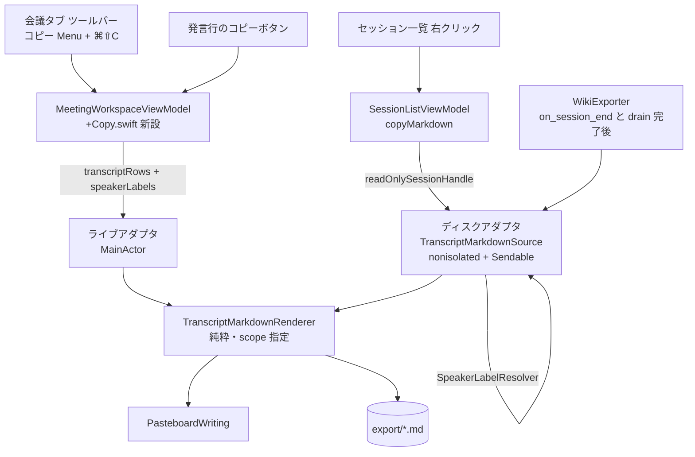

# 37. 会話ログの Markdown コピー詳細設計

対象読者: Kikimi 実装者（Claude Code 自身）。実装前に必ず読むこと。

参照元: `kikimi.md` 10 章（Session Window）, 11 章（LLM Wiki raw export）, 7 章（`refined_text` が
空文字＝意図的削除）, `docs/design/08-wiki-export.md`（`WikiExportRenderer` の出力仕様）,
`docs/design/13-speaker-diarization.md` §5.3/§6.1（話者ラベルの段階表示）,
`docs/design/23-speaker-settings-rename.md` §2.2（現在の登録名が snapshot に優先する規則）,
`docs/design/17-session-window-redesign.md` §5.3（会議タブのツールバー・AX 契約）,
`docs/design/03-refinement-batch.md` §15.2（マージ後の `RefinedSegment`）。

**位置づけ**: 本文書は Go/No-Go 前の詳細設計段階であり、実装はしていない。

**経緯**: ユーザー要件は「会議の会話ログを Markdown でコピーしたい」。貼り先は Obsidian / wiki と
確認済みなので、**既存の Wiki export（kikimi.md 11 章）と同一形式をクリップボードに出す**のを既定と
する。新形式は作らない。

要点は以下のとおり。

- **レンダリングは既存資産の共有化で済む**。`WikiExportRenderer.render`
  （`Kikimi/WikiExport/WikiExportRenderer.swift:41`）が frontmatter・サマリ・書き起こしの出力を
  すでに持っており、コピーはこれを範囲指定付きで呼ぶだけ
- **ただし話者名が出ていない**。現行の書き起こし行は `**HH:MM:SS (mic|system)**`
  （`WikiExportRenderer.swift:79`）で、画面が出している表示名（`selfName` / `Speaker 3` / 実名 /
  `A + B`）を使っていない。会話ログとして貼るには話者名が要る。**この修正は Wiki export の出力にも
  同時に効く**（貼り先が同じ wiki である以上、両者が違う形なのは不整合。意図した共通改善として入れる）
- **話者名の解決器はすでに純粋関数**。`SpeakerLabelResolver`（`Kikimi/ViewModels/SpeakerLabeling.swift:73`）
  は I/O も actor 依存も持たない static 関数群なので、ViewModel の外——セッション一覧からのコピーや
  `WikiExporter` からも同じ解決ができる
- **導線は 4 つ**（会議タブのツールバー / セッション一覧の右クリック / 発言行のホバーボタン /
  キーボード）。ショートカットは **⌘⇧C**。書き起こし行は `textSelection(.enabled)`
  （`TranscriptTabView.swift:307`）なので ⌘C を奪うと「選択して ⌘C」が壊れる
- **config 追加なし**。形式のバリエーション（全体 / 書き起こしのみ / サマリのみ）はメニュー項目で
  表現する
- **`endMeeting()` の Wiki export をもう 1 回走らせる**（TC17 / §5.1）。現行の export は
  `refinementQueue.flush()` / `drain()` より前にあり、末尾の端数バッチが反映されない。未整形行を
  `*(raw)*` 付きで出す TC15 と組み合わせると raw が wiki に恒久的に残るので、drain 完了後に冪等
  上書きで再 export する

## 1. 目的とスコープ

**やること**:

- 会議の会話ログを Wiki export と同一形式の Markdown としてクリップボードへコピーする
- コピー範囲を 3 種（全体 / 書き起こしのみ / サマリのみ）から選べるようにする
- 書き起こし行の話者列を、画面と同じ表示名にする（`WikiExporter` の出力も同時に更新）
- 4 つの導線（会議タブのツールバー / セッション一覧の右クリック / 発言行 / ⌘⇧C）
- コピー成否のフィードバック

**やらないこと（§9 も参照）**:

- 選択範囲だけのコピー（複数行のドラッグ選択は現行 UI が持っていない）
- 複数セッションの一括コピー（frontmatter が複数出ると Obsidian 側で壊れる。単一選択のみ）
- 形式のユーザー設定（config の `copy:` セクションは作らない）
- ファイル書き出し・共有シート・`kikimi://` からのコピー
- Watchers タブの出力のコピー

## 2. 決定事項

| # | 決定 |
|---|------|
| TC1 | **純粋レンダラを `Kikimi/Markdown/TranscriptMarkdownRenderer.swift` に新設**し、`WikiExportRenderer.Input` / `render(_:)` / `displayText(for:)` は**削除する**（薄いラッパも残さない。§3.1 に理由）。`fileName(for:)` / `slug(from:)` / `durationLabel(durationMs:)` は export 固有なので `WikiExportRenderer` に残す。コピー機能のコードを `WikiExport/` に置かない（名前が実態と食い違うため）。CLAUDE.md のコードマップに 1 行追加する |
| TC2 | **出力形式は Wiki export と完全に同一**（frontmatter → `# タイトル` → `## サマリ` → `## 書き起こし`、時刻は wall-clock `HH:MM:SS`）。コピー専用の形式は作らない。UI の相対時刻（`00:12:03`、`TranscriptTabView.swift:404`）は画面内の位置指示のための表示であり、wiki ノートに残す会議ログとしては実時刻の方が有用 |
| TC3 | **書き起こし行の話者列を表示名にする**: `**14:30:05 (mic)**` → `**14:30:05 田中**`。`WikiExporter` の出力も同時に変わる（意図的。§5） |
| TC4 | **話者表記のマッピングは §4.2 の表を正とする**。同時発話マーカー `⚠`（`ResolvedSpeakerLabel.hasOverlapMarker`）は **Markdown には出さない** — あれは「この行の話者判定は当てにならない」という画面上の注意喚起で、貼り先のテキストログでは意味を持たず記号ノイズになる |
| TC5 | **話者名の解決は 2 つのアダプタを持つ**（§3.2）。(a) ライブ: `MeetingWorkspaceViewModel` の `transcriptRows` + `speakerLabels`（解決済みをそのまま使う。画面と 1 対 1）、(b) ディスク: `SessionHandle` から読んで `SpeakerLabelResolver` で解決（一覧右クリックと `WikiExporter` が使う）。レンダラ自身は解決済みの行だけを受け取り、どちらから来たかを知らない |
| TC6 | **コピー範囲は 3 種**: `full`（frontmatter + サマリ + 書き起こし）/ `transcript`（`# タイトル` + `## 書き起こし`）/ `summary`（`# タイトル` + `## サマリ`）。frontmatter が付くのは `full` だけ — 断片を貼るときに frontmatter が混ざると Obsidian のプロパティ欄が壊れる |
| TC7 | **導線は 4 つ**（§3.3）。既定操作はいずれも `full` |
| TC8 | **キーボードショートカットは ⌘⇧C**。⌘C は書き起こし行のテキスト選択コピー（`textSelection(.enabled)`）が使うため奪わない。アプリはメニューバー常駐（`LSUIElement` + `MenuBarExtra`、`KikimiApp.swift:12`）でアプリメニューを持たないので、ツールバーのボタンに `.keyboardShortcut("c", modifiers: [.command, .shift])` を付ける形で実装する（`FloatingPanel` は `canBecomeKey == true`、`FloatingPanel.swift:37`） |
| TC9 | **セッション一覧のコピーは単一選択時のみ有効**（`ids.count == 1`）。既存の「開く」「複製して新規セッション」と同じ扱い。複数セッション連結は frontmatter が複数出て貼り先が壊れるため作らない |
| TC10 | **クリップボードは通常のコピー扱い**にする（`NSPasteboard.general` に `.string` を書くだけ）。ディクテーションが使う `org.nspasteboard.ConcealedType`（`DictationInserter.swift:134`）は付けない — あれは「アプリが裏でクリップボードを経由した」ことをクリップボード履歴ツールに隠すための印であり、ユーザーが明示的に押したコピーに付けると履歴から消えて不便になる |
| TC11 | **フィードバック**: ツールバー / 発言行のボタンはアイコンを 1.5 秒 `checkmark` に差し替える（View 内 `@State`。トーストは `NSPanel` に対して過剰）。セッション一覧は差し替える対象がないので既存の `SessionListToast`（`SessionListViewModel.swift:153`）に成功・失敗のケースを足す |
| TC12 | **含める行の規則は既存 export を踏襲**: `refined_text == ""`（意図的削除、kikimi.md 7 章）は行ごと除外、`refined_text == nil`（整形失敗）は `raw_text` + `*(raw)*` マーカー。加えて**まだ整形されていない行**（録音中の `.raw`/`.refining`）も同じマーカー付きで含める — 「これは生テキスト」と貼り先で判別できれば十分で、録音中のコピーで行が欠けるより良い。未確定の volatile 行（`TranscriptTabView.swift:222`）は含めない |
| TC13 | **`meta` はコピーのたびに `sessionHandle.meta` から読み直す**。`MeetingWorkspaceViewModel.meta`（`MeetingWorkspaceViewModel.swift:72`）はウィンドウを開いた時点のスナップショットで、録音中に `SessionStore` が追記した `recordings[]` を反映していない可能性がある。wall-clock 変換は `recordings[]` に依存する（`WikiExportRenderer.swift:115`）ため、古い値だと時刻がずれる。コピーは低頻度操作なので読み直しのコストは問題にならない |
| TC14 | **空のセクションは見出しごと省略する**: サマリ未生成のセッションで `## サマリ` だけが残ると貼り先で邪魔になる。書き起こしが 0 行のときの `## 書き起こし` も同様。**これは現行 export の挙動変更**（現行は空見出しを出す）だが、export の貼り先も同じ wiki なので揃える |
| TC15 | **ディスクアダプタは refined と raw を統合して読む**: `readRefinedSegments()` に加えて `readTranscriptSegments()` を読み、どの `RefinedSegment.sourceSegIds` にも含まれない生セグメントを `*(raw)*` 付きで補完する。録音中のセッションを一覧からコピーしたときやクラッシュ復旧セッションで末尾が欠けない。**ただしこれを `WikiExporter` にも効かせるには TC17 が必須**（理由は下記） |
| TC17 | **`endMeeting()` の Wiki export を drain 完了後にもう一度走らせる**（§5.1）。現行の export 呼び出し（`MeetingWorkspaceViewModel+Recording.swift:203`）は `refinementQueue.flush()` / `drain()` より **前** にあり、そのコメント自身が「末尾の端数バッチは反映されていないかもしれない」と明記している。つまり TC15 を入れると、ほぼ全ての Ended セッションの export に末尾数セグメントが `*(raw)*` 付きで**恒久的に**残る（数秒後に整形済みテキストが出来ても export は再実行されない）。従来の「末尾が欠ける」から「末尾が raw で残る」への置き換えは改善とは言えないので、drain 完了後に export をもう一度実行して上書きする |
| TC16 | **config 追加なし**。フィードバックの表示時間（1.5 秒）は定数 |

## 3. コンポーネント構成



### 3.1 `TranscriptMarkdownRenderer`（`Kikimi/Markdown/TranscriptMarkdownRenderer.swift` 新設）

副作用なしの純粋レンダラ。`SessionHandle` も `AppConfig` も見ない（`WikiExportRenderer` の設計方針を
そのまま引き継ぐ）。

```swift
enum TranscriptMarkdownRenderer {
    /// 話者名まで解決済みの 1 行。どのアダプタから来たかはここでは分からない。
    struct Line {
        /// ライブ経路は `TranscriptRowViewModel.id`、ディスク経路は `RefinedSegment.id` /
        /// `TranscriptSegment.id`。ソートのタイブレークにだけ使う（出力には現れない）。
        var id: String
        var startMs: Int
        /// §4.2 のマッピング適用後の表示名。空文字にはならない。
        var speakerName: String
        var text: String
        /// `*(raw)*` マーカーを付けるか（整形失敗・整形前）。
        var isRawFallback: Bool
    }

    struct Input {
        var meta: SessionMeta
        var summaryMarkdown: String
        var lines: [Line]   // startMs 昇順でなくてよい（ここでソートする）
    }

    enum Scope { case full, transcript, summary }

    /// frontmatter / 見出し付きのドキュメント全体（§4.1）。
    static func render(_ input: Input, scope: Scope) -> String

    /// 発言 1 行だけ（§4.4）。`meta` は wall-clock 変換（`recordings[]`）にだけ使う。
    static func renderLine(_ line: Line, meta: SessionMeta) -> String
}
```

**`Line.id` を持つ理由**: 現行 `WikiExportRenderer.transcriptLines`（`WikiExportRenderer.swift:71-73`）
と `TranscriptRowList.isOrderedBefore`（`TranscriptRowList.swift:95-100`）はどちらも
「`startMs` 昇順、同値は `id` 昇順」で順序を決定的にしている。Swift の `sorted` は安定ソートではない
ので、`id` を落とすと同一 `startMs` の mic / system 行の順序が実行ごとに揺れ、export ファイルの内容が
毎回変わりうる（既存 `WikiExportRendererTests` の退行）。`speakerName` は表示名なので同名衝突があり
タイブレークに使えない。

**`renderLine` を別入口にする理由**: `Scope` の 3 ケースはどれも `# タイトル` を含む「ドキュメント」で、
行単体コピー（§3.3）はドキュメントではない。`Scope` に `.line(id:)` を足すと `Input.lines` の中から
探す形になり、レンダラが「見つからなかった」失敗を持つことになる。行は呼び出し側がすでに特定できて
いるので、行そのものを渡す 2 つ目の入口にする。

現行 `WikiExportRenderer` から移設するもの: `render` 本体、`wallClockDate(startMs:recordings:fallback:)`、
`referenceDate(for:)`、`rawFallbackMarker`、`durationLabel(durationMs:)`、frontmatter 組み立て、
フォーマッタ 2 種。`WikiExportRenderer` に残すもの: `fileName(for:)` / `slug(from:)`
（`fileName` は移設した `referenceDate`/`frontmatterDateFormatter` を呼ぶ形になるので、両者は
`TranscriptMarkdownRenderer` 側で `static`（`internal`）にしておく）。

**`WikiExportRenderer.Input` / `render(_:)` / `displayText(for:)` は削除する**（薄いラッパも残さない）。
現行 `Input` は `refinedSegments: [RefinedSegment]` しか持たず話者名を運べない（`WikiExportRenderer.swift:15-23, 79`）
ため、TC3 の表示名出力には**必ず**解決済みの `Line` が要る。`Line` を作れるのは §3.2(b) のディスク
アダプタだけなので、`WikiExporter.export` は「アダプタで `Input` を組み立て → `TranscriptMarkdownRenderer
.render(_:scope: .full)` を直接呼ぶ」形にしかならず、`WikiExportRenderer` 側に委譲用のシグネチャを
残しても呼び手がいない。`displayText(for:)`（`WikiExportRenderer.swift:96`）の 3 分岐は**アダプタ側へ
移る** — 行を作る責務はアダプタになり、レンダラは `Line` を並べるだけになる。

既存 `KikimiTests/WikiExport/WikiExportRendererTests.swift` の移設先:

| 既存テスト | 移設先 |
|---|---|
| `displayText(for:)` 3 ケース | `TranscriptMarkdownSourceTests`（分岐がアダプタへ移るため） |
| `wallClockDate` 4 ケース / `durationLabel` / `render(_:)` end-to-end | `TranscriptMarkdownRendererTests`（期待値は §4 に合わせて更新） |
| `slug(from:)` / `fileName(for:)` | `WikiExportRendererTests` に残す |

### 3.2 話者名の解決（2 アダプタ）

**(a) ライブアダプタ**（`MeetingWorkspaceViewModel+Copy.swift` 新設）

`transcriptRows` と `speakerLabels` はすでに画面が使っている解決済みの値なので、そのまま `Line` へ
写す。除外規則は `TranscriptTabView.swift:134` の `ForEach` フィルタと同一にする
（`isDroppedByRefinement` / `isMergedAway` を除外）。**画面に見えているものがそのままコピーされる**
のがこの経路の存在理由であり、ここでディスクを読み直すと録音中に画面とズレる。

`speakerLabels[row.id]` は **`nil` になりうる**（`recomputeSpeakerLabels()` は
`diarization.enabled == false` で早期 return するため、診断オフのセッションでは全行が `nil`。
`MeetingWorkspaceViewModel+Diarization.swift:294-297`）。画面側は `resolvedLabel ?? .systemFallback`
＋ mic の `selfName` 直描画で吸収している（`TranscriptTabView.swift:438-455`）ので、**コピーも同じ
フォールバックを踏む**: `nil` は `ResolvedSpeakerLabel.systemFallback` として扱い、その上で
`mic` → `selfName` / `system` → `system`（§4.2 の表に行を追加済み）。これがないと `Line.speakerName`
が空文字になり §3.1 の保証が破れる。

**(b) ディスクアダプタ**（`Kikimi/Markdown/TranscriptMarkdownSource.swift` 新設）

`SessionHandle` から読んで自前で解決する。一覧右クリックと `WikiExporter` が使う。

```swift
struct TranscriptMarkdownSource: Sendable {
    var diarization: DiarizationConfig       // 値キャプチャ（selfName / enabled）
    var voiceprintStore: VoiceprintStore     // actor

    /// nonisolated。呼び出し元が `@MainActor` でも本体は cooperative pool で走る。
    func load(sessionHandle: SessionHandle) async throws -> TranscriptMarkdownRenderer.Input
}
```

**isolation**: `@MainActor` を付けない（Swift 5.9 tools なのでプレーンな `struct` のメソッドは
nonisolated。`@MainActor` の `SessionListViewModel` / `MeetingWorkspaceViewModel` から `await` で
呼んでも本体は main actor 上で走らない）。理由は `SpeakerLabelResolver.resolve` が内部で
`SegmentAttribution.attribute` を**セグメント数 × turn 数**で回すため。design 13 §5 が
「毎レンダーごとに 1 行 2 回 `attribute` を呼んで CPU をピン留めし UI をフリーズさせた」ことを記録して
おり、数時間の会議 1 本ぶんをまとめて回すこの経路を main actor に載せると同じ症状になる。actor に
する必要はない（状態を持たない値型で、`load` は毎回引数だけから結果を作る）。

**依存注入**: `WikiExporting: Sendable` は `AppConfig` を保持できない（`WikiExporter.swift:25-34` の
doc comment）ので、`ExportConfig` と同じく **`DiarizationConfig`（`Sendable`、
`Kikimi/Config/DiarizationConfig.swift:17`）を値でキャプチャして渡す**。`selfName` は §4.2 の
「`mic` は常に `selfName`」に必須、`enabled` は「診断オフのセッションは全行 `system`」の判定に使う。
キャプチャ点は `defaultWikiExporter()`（`MeetingWorkspaceViewModel+Factories.swift:120-122`）と
`SessionListViewModel.init`（既定引数）。`VoiceprintStore` は actor なのでそのまま持てる。
テストは `TranscriptMarkdownSource` を値ごと差し替える（`DiarizationConfig` は普通の値、
`VoiceprintStore` は既存テストと同じく一時ファイルの実インスタンスを使う）。

| 入力 | 取得元 |
|---|---|
| セグメント | `readRefinedSegments()` + `readTranscriptSegments()`（TC15 の補完） |
| 話者ターン | `readDiarizationTurns()`（`SessionHandle+Diarization.swift:64`） |
| スロット割り当て・行単位 override | `readSpeakerAssignments()`（同 `:114`。`segmentOverrides` を含む） |
| 現在の登録名 | `voiceprintStore.listSpeakers()` → `[globalSpeakerId: name]`（design 23 §2.2） |
| 自分の名前・診断有効フラグ | 注入された `DiarizationConfig` の `selfName` / `enabled` |

`SpeakerLabelResolver.resolve(...)` へ渡す引数のうち、ライブ経路と異なる扱いが要るものは 2 つ:

- **`activeRanges`**: 永続化されていない（design 13 §5、`MeetingWorkspaceViewModel+Diarization.swift:357`
  の `currentActiveRanges()` が同じ問題を扱っている）。ディスク経路には live coordinator がないので
  **turns が 1 つ以上あるときだけ** `[DiarizationActiveRange(startMs: 0, endMs: nil)]` を渡し、全
  セグメントを帰属判定の対象にする（バックフィルと同じ割り切り。診断が動いていなかった区間まで帰属させ
  得るという既知の許容誤差も同じ）。**`turns` が空、または `diarization.enabled == false` のときは
  `activeRanges` を空にする** — `resolve` は「active range 内」かつ「turns なし」を `.unattributed`
  と判定し、下記 `confirmedAt: .distantPast` と組み合わさって必ず `.unknown`（`Speaker ?`）に落ちる
  （`SpeakerLabeling.swift:132-141`）ため、この分岐がないと `diarization.jsonl` を持たない過去
  セッションが**全行 `Speaker ?`** になってしまう。ライブ側の `currentActiveRanges()` が
  `guard !diarizationTurns.isEmpty else { return liveRanges }`（`MeetingWorkspaceViewModel+Diarization.swift:365`）
  で回避しているのと同じ罠。空の `activeRanges` は `.systemFallback` に落ちるので、§4.2 末尾・§6 の
  「診断なし = 全行 `system`」と一致する
- **`confirmedAt`**: 猶予期間（`.recognizing` 表示）の起点。過去セッションに「認識中…」は無意味なので
  `.distantPast` を渡し、未帰属の行は必ず `.unknown`（`Speaker ?`）に落とす

**`SessionHandle` の取得（一覧経路）**: `SessionStore.openSession(_:)` は**使わない**。
`SessionStore+LLMUsage.swift:11-15` が明文化しているとおり、あれはプロセス寿命の間ハンドルを
キャッシュし、`ensureTranscriptAndRefinedLogFilesExist()` で一度も開いていないセッションに空の
`transcript.jsonl` / `refined.jsonl` を作る。**読むだけのコピー操作が Draft セッションのフォルダに
ファイルを新規作成するのは説明のつかない副作用**なので、`SessionStore` に読み取り専用の入口を足す:

```swift
/// 既にキャッシュ済みのハンドルがあればそれを返し（録音中セッションの書き込みと直列化されるため）、
/// なければ meta.json だけ読んで **登録しない・ファイルを作らない** ハンドルを組み立てて返す。
func readOnlySessionHandle(_ sessionId: String) async -> SessionHandle?
```

`sessionDirectoryURLs()`（`SessionStore.swift:466`）の隣に置き、同じ doc comment の方針を共有する。
キャッシュ済みを優先するのは、開いている会議ウィンドウが JSONL に追記している最中に別ハンドルから
読むと末尾行が途中まで書かれた状態で見えうるため（`WikiExporter` は元から会議ウィンドウ自身の
ハンドルを受け取るのでこの問題を持たない）。

`override` は `segmentOverrides[segId]` を引くが、**マージ後の `RefinedSegment` は `id ==
sourceSegIds.first`**（`SessionModels.swift:62`）なので、`sourceSegIds` を先頭から順に引いて最初に
見つかった override を採用する。先頭以外の被覆 id に override が付いている状態は画面上も表示されない
（マージされた行は `.mergedInto` で非表示）ため、ここで拾えなくても画面と食い違わないが、拾える方が
情報として正しい。

`mic` セグメントは診断を通さない（design 13 §4.5）ので、解決を挟まず常に `selfName` にする。

### 3.3 UI 導線

| 導線 | 実装箇所 | 内容 |
|---|---|---|
| 会議タブのツールバー | `MeetingTabView.swift:34` の `toolbar`、`Spacer()` の左 | `Menu { … } primaryAction: { copy(.full) }`。項目は「全体をコピー」「書き起こしをコピー」「サマリをコピー」。`.keyboardShortcut("c", modifiers: [.command, .shift])` をここに付ける（TC8） |
| セッション一覧の右クリック | `SessionListView.swift:227` の `contextMenuItems(for:)` | 「Markdown をコピー」を「複製して新規セッション」の下に追加。`ids.count == 1` のときのみ有効（TC9） |
| 発言行 | `TranscriptTabView.swift:352` の `playbackButton` の左 | `doc.on.doc` アイコン。再生ボタンと同じくホバー時のみ表示・幅は常時確保（行の揺れを防ぐ既存の作法）。コピー内容は `renderLine` の出力＝その 1 行のみ（frontmatter・見出しなし、§4.4） |
| キーボード | 上記ツールバーのボタン | ⌘⇧C = 全体をコピー。会議タブ表示中のみ有効（Draft はタブバー自体を出さない、design 17 §3.1） |

ツールバー / 発言行のボタンには `.help` と `.accessibilityLabel` を同じ文言で付ける
（design 17 §5.3/§6 の AX 契約。`kikimi-verify` の AX 名前指定クリックが依存する）。

**Pasteboard の抽象**:

```swift
protocol PasteboardWriting: Sendable {
    /// `false` = 書き込み失敗（§6）。呼び出し側はこれでフィードバックを分岐する。
    @discardableResult
    func writeString(_ string: String) -> Bool
}
```

本番実装 `SystemPasteboard` は `NSPasteboard.general` に `clearContents()` →
`setString(_:forType: .string)` し、`setString` の戻り値をそのまま返す。両 ViewModel に注入する
（テストでコピー結果を検証するため。`NSPasteboard(name:)` の一時 pasteboard でも実クリップボードは
汚さずに済むが、DI の方が既存 ViewModel テストの流儀に合う）。

**戻り値が必要な理由**: §6 が「`setString` が `false` ならチェックマークを出さない / toast を出す」と
規定しており、`Void` では成否を呼び出し側に返せない。`throws` ではなく `Bool` にするのは、
`NSPasteboard.setString` 自体が `Bool` を返す API で、区別すべきエラー種別が存在しないため。

分岐:

| 呼び出し側 | `true` | `false` |
|---|---|---|
| `MeetingWorkspaceViewModel`（ツールバー / 行） | `copyFeedbackToken` を更新 → View が 1.5 秒 `checkmark` | 何も出さない（アイコンは元のまま）＋ `.error` ログ |
| `SessionListViewModel` | `toast = .markdownCopied` | `toast = .markdownCopyFailed` ＋ `.error` ログ |

公開 API:

- `MeetingWorkspaceViewModel.copyMarkdown(scope: TranscriptMarkdownRenderer.Scope) async`
- `MeetingWorkspaceViewModel.copyRowMarkdown(rowId: String) async` — ライブアダプタが作った `Line`
  から `rowId` 一致のものを取り、`TranscriptMarkdownRenderer.renderLine(_:meta:)` に渡す。一致する
  行がない（＝除外規則で落ちた行）ときは何もしない
- `SessionListViewModel.copyMarkdown(sessionId: String) async`

## 4. 出力仕様

### 4.1 全体（`scope == .full`）

```markdown
---
date: 2026-07-29
duration: 45m
source: kikimi
session_id: 2026-07-29T14-30-00_a1b2c3d4
tags: [meeting, transcript]
---

# 定例MTG

## サマリ

{summary.md の内容をそのまま埋め込み}

## 書き起こし

**14:30:05 自分** 先週のリリース、影響は出ていないですか。

**14:30:08 田中** 特にはありません。ただログの量が増えています。
```

`.transcript` は frontmatter と `## サマリ` を落とし `# タイトル` + `## 書き起こし` だけ、`.summary` は
`# タイトル` + `## サマリ` だけ。空セクションは見出しごと省く（TC14）。

### 4.2 話者表記のマッピング

`ResolvedSpeakerLabel.label`（`SpeakerLabeling.swift:9`）から Markdown の話者名への写像。

| `SpeakerDisplayLabel` | Markdown | 補足 |
|---|---|---|
| `.named(x)` | `x` | リネーム済み・声紋一致・行単位 override |
| `.anonymous(n)` | `Speaker n` | `SpeakerLabelResolver.displayString` と同一 |
| `.mixed(a, b)` | `a + b` | 画面と同じ連結（design 13 §5.3 ルール 2） |
| `.recognizing` / `.unknown` | `Speaker ?` | ディスク経路では `.recognizing` は発生しない（§3.2） |
| `.systemFallback` | `system` | 診断が無効・未稼働の区間。画面表示と揃える |
| ラベルなし（ライブ経路で `speakerLabels[row.id] == nil`） | `mic` は `selfName` / `system` は `system` | 診断オフのセッションは全行がこれ。画面側の `resolvedLabel ?? .systemFallback` と同じ扱い（§3.2(a)） |

`mic` セグメントは上表を通さず常に `selfName`。`hasOverlapMarker` は出さない（TC4）。

診断を無効にしているセッションでは全行が `.systemFallback` になり、`**14:30:08 system**` という
現行 export とほぼ同じ見た目になる（`(system)` の括弧が外れるだけ）。ライブ経路はラベルなし行の
フォールバック、ディスク経路は `activeRanges` を空にする分岐（§3.2(b)）でここに到達する。

### 4.3 行の除外・フォールバック

| セグメントの状態 | 出力 |
|---|---|
| `refined_text` が非空 | 整形済みテキスト |
| `refined_text == nil`（整形失敗） | `raw_text` + ` *(raw)*` |
| 未整形（録音中の `.raw` / `.refining`、ディスク側は refined に未出現） | `raw_text` + ` *(raw)*`（TC12） |
| `refined_text == ""`（意図的削除、kikimi.md 7 章） | 行ごと出さない |
| volatile（未確定） | 出さない |
| マージで畳まれた行（`.mergedInto`） | 出さない（統合先の行に内容が入っている） |

### 4.4 行単体（`renderLine`）

書き起こし本文の 1 行と**まったく同じ書式**。末尾に改行は付けない（貼り先で行末に余分な空行が入るのを
避ける。複数回コピーして並べる使い方は想定しない）。

```
**14:30:08 田中** 特にはありません。ただログの量が増えています。
```

整形前・整形失敗の行は本文と同じく ` *(raw)*` が付く。

**本文テキストだけを出さない理由**: 書き起こし行は `textSelection(.enabled)`
（`TranscriptTabView.swift:307`）なので、「テキストだけ欲しい」はドラッグ選択 + ⌘C ですでに満たせて
いる。ボタンが同じものを出すなら存在価値がない。このボタンの用途は「この発言を会話ログの断片として
wiki / チャットに貼る」であり、時刻と話者名が付いている方が有用。

## 5. 既存 Wiki export への影響

TC3 / TC14 / TC15 により `WikiExporter` の出力が変わる。変更点は 3 つ。

- 書き起こし行の話者列が `(mic)` / `(system)` から表示名になる
- サマリ・書き起こしが空のとき、見出しが出なくなる
- 未整形のまま残ったセグメントが `*(raw)*` 付きで出るようになる（従来は欠落していた）

いずれも「同じ wiki に貼るものが 2 種類の形式で存在するのを避ける」ための意図した変更。

**依存の追加**: `WikiExporter` は `ExportConfig` に加えて **`TranscriptMarkdownSource`**（§3.2(b)）を
持つ。この値が `VoiceprintStore`（現在の登録名の解決）と `DiarizationConfig`（`selfName` / `enabled`）を
運ぶ。`WikiExporting: Sendable` は全ての conformer が `Sendable` であることを要求し、`AppConfig` は
`Sendable` ではない（`WikiExporter.swift:25-34`）ため、`AppConfig` 参照ではなく `ExportConfig` と同じ
「値を 1 回キャプチャする」流儀に揃える:

```swift
nonisolated static func defaultWikiExporter() -> WikiExporting {
    WikiExporter(
        config: AppConfig.shared.data.export,
        source: TranscriptMarkdownSource(
            diarization: AppConfig.shared.data.diarization,
            voiceprintStore: .shared
        )
    )
}
```

`config.yaml` の `diarization:` をセッション中に編集しても反映は次のウィンドウ再オープンから、という
既存の割り切り（`ExportConfig` / `RefinementConfig` と同じ）をそのまま引き継ぐ。テストでは
`WikiExporter(config:source:)` に一時ディレクトリ由来の `VoiceprintStore` と任意の
`DiarizationConfig` を渡して差し替える（`WikiExporting` フェイクを別途作る必要はない）。

既存の `WikiExportRendererTests` は §3.1 の表に従って移設・期待値更新が要る（話者列・空セクション）。

### 5.1 drain 完了後の再 export（TC17）

現行の呼び出し順（`MeetingWorkspaceViewModel+Recording.swift:203`）は
**export → `flush()` → fire-and-forget `drain()`** で、export 側のコメント自身が「末尾の端数バッチは
反映されていないかもしれない」と書いている。TC15 を入れると、この末尾が「欠落」から「`*(raw)*` 付きで
恒久的に残る」に変わる（数秒後に整形済みテキストが揃っても、export は二度と走らない）。

**採る案: (b) drain 完了時に再 export する。** 既存の fire-and-forget `Task` の中で `drain()` の後に
もう一度 `export(sessionHandle:)` を呼ぶ。

```swift
if let queue = refinementQueue {
    await queue.flush()
    let exporter = wikiExporter          // Sendable な値をキャプチャ
    let handle = sessionHandle
    Task {
        await queue.drain()
        try? await exporter.export(sessionHandle: handle)   // best-effort、冪等上書き
    }
}
```

根拠:

- **冪等上書きは既に仕様**。kikimi.md 4 章「`on_session_end` の副作用は冪等（上書き）」で、
  `WikiExporter.export` はファイルを無条件上書きする（`WikiExporter.swift:67-70`）。2 回目を足すのに
  新しい不変条件は要らない
- **1 回目の export を残すのは意味がある**。drain 中にプロセスが落ちても、pre-drain の内容が
  すでにファイルとして存在する（export が一切残らない状態には退行しない）
- **(a)「export を drain の後に移す」は却下**。design 03 §7 が `drain()` を fire-and-forget にしている
  のは「遅い / 詰まった Haiku 呼び出しが `on_session_end` を遅らせないため」（kikimi.md 8.5 章）で、
  export を await するとバックログのぶんだけヘッダの `.ending` 状態が延びる。UI 応答性のための既存の
  設計判断を、export の見た目のために壊す取引は割に合わない
- **(c)「raw 末尾を許容する」は却下**。ユーザーの wiki に恒久的に残る成果物であり、「数秒待てば
  正しいテキストが手に入るのに raw が固定される」のは従来の欠落より悪い場合がある（raw は
  フィラー・言い淀みを含む生の書き起こし）

コスト: セッション終了ごとにレンダリング + ファイル書き込みが 1 回増える。2 回目も best-effort
（`try?` + `.error` ログ）で、失敗しても 1 回目のファイルが残る。ウィンドウが閉じられても
`Task` は unstructured なので走り切る（キャプチャするのは `Sendable` な `WikiExporting` と
`SessionHandle` だけで、ViewModel は捕まえない）。

## 6. 失敗モード

| 状況 | 挙動 |
|---|---|
| セッション読み込みに失敗（一覧経路） | `SessionListToast` にエラーを出し、クリップボードは変更しない。`.error` ログ |
| `summary.md` が読めない | サマリを空として扱い、`## サマリ` を省いてコピーを続行（`WikiExporter.swift:44` の既存の割り切りと同じ） |
| `diarization.jsonl` / `speaker_assignments.json` が読めない・存在しない | 話者解決なしで続行（全行 `system` / `selfName`）。書き起こしは失わない。**`turns` が空なら `activeRanges` も空にする**（§3.2(b)）— これがないと全行が `Speaker ?` になる |
| ライブ経路で `speakerLabels[rowId] == nil`（診断オフ） | `.systemFallback` として扱う（`mic` → `selfName` / `system` → `system`、§3.2(a)）。空の話者名は出さない |
| 一覧経路でセッションフォルダが読み取り専用ハンドルからも開けない | `SessionListToast` にエラー。**副作用としてファイルを作らない**（`openSession(_:)` を使わない理由、§3.2(b)） |
| 書き起こしが 0 行 | `## 書き起こし` を省く。`.full` なら frontmatter + タイトル + サマリだけがコピーされる |
| コピー対象セッションが録音中 | そのままコピーできる（未整形行は `*(raw)*` 付き）。禁止しない |
| Draft セッション | 一覧のメニュー項目は有効のまま。frontmatter + タイトルのみがコピーされる（無害） |
| `NSPasteboard` への書き込み失敗 | `setString` の戻り値 `false` をエラー扱い。ツールバー経路はチェックマークを出さない、一覧経路は toast |

## 7. テスト（レイヤ 1）

- `TranscriptMarkdownRendererTests`（純粋）: scope 3 種の出力、§4.2 のマッピング全ケース、
  `*(raw)*` マーカー、空セクションの省略、wall-clock 変換（既存 `WikiExportRendererTests` から
  §3.1 の表に従って移設 + 拡張）。加えて
  (a) `startMs` 同値の 2 行が `Line.id` 昇順で並ぶこと（入力順を逆にしても出力が同じ＝決定性の固定）、
  (b) `renderLine` の書式（§4.4）と、末尾に改行が付かないこと、`*(raw)*` が付くこと
- `TranscriptMarkdownSourceTests`（ディスクアダプタ）: fixture セッションフォルダから
  (a) refined と raw の統合（refined に無い末尾セグメントが `*(raw)*` で出る）、
  (b) `segmentOverrides` が `sourceSegIds` の先頭以外に付いていても拾える、
  (c) turns があるとき `activeRanges` 全面 opt-in で過去セッションの話者名が解決される、
  (d) 未帰属セグメントが `Speaker ?` になる（`.recognizing` にならない）、
  (e) `VoiceprintStore` 側のリネームが snapshot `displayName` に優先する（design 23 §2.2 の回帰）、
  (f) **`diarization.jsonl` が無い（turns 空）セッションで全行が `system` になる**
  （`Speaker ?` にならないこと。§3.2(b) の分岐の回帰テスト）、
  (g) `diarization.enabled == false` でも同じく全行 `system`、
  (h) `mic` セグメントが注入した `DiarizationConfig.selfName` になる、
  (i) `displayText` 3 分岐（`refined_text` 非空 / `nil` / `""`）の移設テスト
- `MeetingWorkspaceViewModel+Copy` テスト: フェイク `PasteboardWriting` で
  (a) scope 3 種、(b) 行単体コピー（§4.4 の書式・存在しない `rowId` では何も書かない）、
  (c) `isDroppedByRefinement` / `isMergedAway` / volatile が除外される、
  (d) 録音中に `meta` を読み直していること（`recordings[]` 追記後の時刻が正しい）、
  (e) `speakerLabels` が空でも話者名が `selfName` / `system` になること（§3.2(a) のフォールバック）、
  (f) **フェイクが `false` を返したときチェックマーク用の状態を更新しないこと**
- `SessionListViewModel.copyMarkdown` テスト: 成功時のクリップボード内容、読み込み失敗時に
  toast が出てクリップボードが変更されないこと、**フェイクが `false` を返したとき
  `.markdownCopyFailed` toast になること**、Draft セッションをコピーしても
  `transcript.jsonl` / `refined.jsonl` が新規作成されないこと（§3.2(b) の副作用回避の回帰）
- `WikiExporter` テスト: 話者名付きで書き出されること（§5 の挙動変更の固定）、
  同じ `SessionHandle` に対して 2 回 `export` しても内容が同じこと（TC17 の冪等性）

## 8. kikimi.md / 既存設計への改訂点（実装確定後）

- kikimi.md 10 章: 会議タブのコピー導線・セッション一覧のコピー項目・⌘⇧C を追記
- kikimi.md 11 章: 出力例の `**14:30:05 (mic)**` を `**14:30:05 自分**` に更新し、話者列が診断の
  表示名であること・空セクションを省くことを追記
- `docs/design/08-wiki-export.md`: §4.3 のレンダリング仕様を本設計へ委譲する旨、`WikiExporter` が
  `TranscriptMarkdownSource`（`VoiceprintStore` + `DiarizationConfig`）を持つようになったこと、
  §6 の「末尾の端数バッチは反映されないことがある」という既知の制約が TC17 の再 export で解消された
  ことを追記
- `docs/design/03-refinement-batch.md` §7: `drain()` の fire-and-forget `Task` に再 export が
  ぶら下がったことを 1 行追記（`drain()` を await しない方針自体は変えていない）
- `docs/design/17-session-window-redesign.md` §5.3: ツールバーのボタン一覧と AX 名の表に
  コピーボタンを追加
- CLAUDE.md のコードマップに `Kikimi/Markdown/` を追加

## 9. やらないこと・将来拡張

- **複数セッションの一括コピー**: frontmatter の重複問題を解く必要がある（先頭のみ出す、あるいは
  frontmatter なしで連結する）。需要が出たら
- **選択範囲コピー**: 複数行のドラッグ選択が現行 UI にない。行のチェックボックス選択を入れるなら別設計
- **形式のユーザー設定**（時刻の有無・話者名の有無・frontmatter の有無）: メニュー 3 項目で足りている
  うちは作らない。「Slack 用に時刻なしで貼りたい」のような別貼り先の要求が出た時点で、config では
  なくメニュー項目の追加として検討する
- **`kikimi://` からのコピー**（Raycast 連携、design 09）: URL scheme でコピーを起動する導線
- **ファイルへの書き出し・共有シート**: Wiki export が自動で書いているので当面不要
