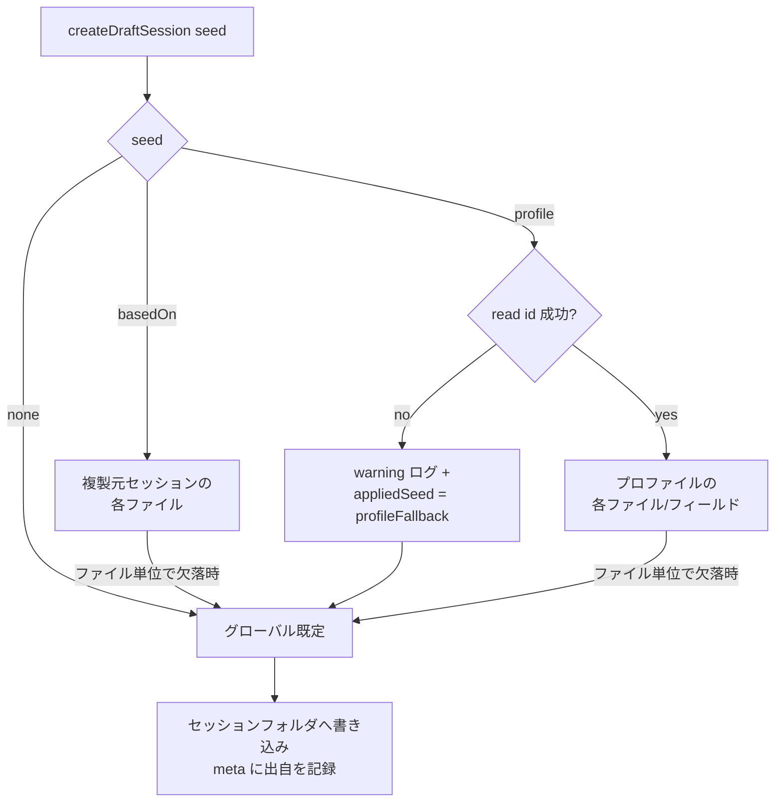

# 41. Meeting Profiles（会議プロファイル）詳細設計

対象読者: Kikimi 実装者（Claude Code 自身）。実装前に必ず読むこと。

参照元: `kikimi.md` 4 章（context.md / summary_template.md のライフサイクル・ディレクトリ構造）,
5 章（meta.json）, 9 章（Watchers の Preset / Session-local 二層モデル・`enabled.yaml`・昇格）,
12 章（config.yaml）, 16 章（設計原則 4「過去セッション複製で繰り返し会議を最短化」）,
`docs/design/07-session-store.md`（`SessionStore` / `SessionHandle`）,
`docs/design/22-participant-hints.md` §1.3（based_on 複製の参加者コピー規則）,
`docs/design/09-raycast-integration.md`（URL scheme）,
`docs/design/26-settings-ui.md` §4.1（Settings タブ構成と binding パターン）。

**実装状況**: 未実装（本書が起草）。

## 0. 結論（要約）

**会議プロファイル = 繰り返し会議の準備一式（context / summary_template / 有効 Watcher / 参加者名簿）に
名前を付けて保存し、新規セッション作成時にワンタップで適用できるプリセット**。

- 保存場所は `~/.config/kikimi/profiles/<profile-id>/`（Watcher preset と同じ「config 配下のディレクトリを
  スキャンする」流儀。config.yaml には `profiles.dir` のパス参照だけ追加）
- 適用は **Draft 作成時の 1 回コピーのみ**。作成後のセッションとプロファイルは完全に独立
  （kikimi.md 4 章のセッションローカル原則を崩さない）
- 既存の `createDraftSession(basedOn:)` を `DraftSeed` enum（`.none` / `.basedOn` / `.profile`）に一般化する。
  フォールバック連鎖（ソース → グローバル既定 → 内蔵既定）は based_on と同一
- 逆方向の導線として、セッションの準備タブから「プロファイルとして保存…」で現在の準備一式を
  プロファイル化できる（Watcher の Session-local → Preset 昇格と同じ操作感）
- `meta.json` に `profile_id`（任意フィールド）を追加して出自を記録する

**kikimi.md からの逸脱**: kikimi.md に本機能の章は無い。16 章 原則 4 は「プリセット登録なしにアドホック
準備が完結。過去セッション複製で繰り返し会議を最短化」と書いており、本機能はその上に**任意の**プリセット層を
足す拡張である（プリセット登録が必須になる変更ではない。「+ 新規」「複製して新規」の既存経路は無変更）。
詳細は §10。

## 1. 目的とスコープ

**やること**:

- 名前付きプロファイルの保存形式とディスクレイアウト（§2）
- `SessionStore` の Draft 作成 API 拡張と初期値解決順序（§3, §4）
- セッション → プロファイルの保存フロー（§5）
- UI 導線: Session List / メニューバー / 準備タブ / Settings（§6）
- URL scheme 拡張 `kikimi://window/new?profile=<id>`（§7）
- 失敗モードとテスト計画（§8, §9）

**やらないこと**（本設計の割り切り）:

- プロファイル内容（context.md 等）の**アプリ内編集 UI**。編集は「プロファイルを適用したセッションで
  編集 → 再保存」または Finder / エディタでの直接編集で行う（Watcher preset の管理 UI を Settings の
  スコープ外とした `docs/design/26-settings-ui.md` §1 と同じ判断）
- 「+ 新規」の既定プロファイル（`defaults.profile` のような自動適用）。導入するかは実戦後に判断（§11）
- glossary のプロファイル化。glossary は config.yaml のグローバル設定であり、セッション単位の
  切り替え機構自体が存在しないため、まずスコープ外（§11）
- カレンダー連携によるプロファイル自動選択（kikimi.md 2 章「将来的に検討し得る」の範囲）

## 2. データモデル

### 2.1 ディスクレイアウト

```
~/.config/kikimi/
├── profiles/                        # 追加（profiles.dir。ディレクトリスキャンで列挙）
│   └── daily-scrum/                 # ディレクトリ名 = profile id
│       ├── profile.yaml             # マニフェスト（必須。無いディレクトリは列挙から除外）
│       ├── context.md               # 任意。無ければグローバル既定へフォールバック
│       └── summary_template.md      # 任意。同上
├── context/common.md                # 既存（グローバル既定 = 事実上の「無名の既定プロファイル」）
├── templates/summary.md             # 既存
├── watchers/*.md                    # 既存（プロファイルは preset を id 参照するだけで、複製しない）
└── default_watchers.yaml            # 既存
```

- **profile id** はディレクトリ名。文字種は session-local Watcher id と同じ
  `[A-Za-z0-9-]+`（`MeetingWorkspaceViewModel+Watchers.swift` の `isValidLocalWatcherId` と同規則）。
  表示名は `profile.yaml` の `name` が担うので、id が ASCII でも日本語の会議名を付けられる
- **Watcher 定義本体はプロファイルに複製しない**。プロファイルが持つのは「有効化する preset id の
  リスト」だけ。定義の実体は従来どおり `~/.config/kikimi/watchers/` が単一の置き場
  （二重管理を作らない。kikimi.md 9 章の二層モデルを三層にしない）

### 2.2 profile.yaml

```yaml
# ~/.config/kikimi/profiles/daily-scrum/profile.yaml
name: デイリースクラム            # 表示名（必須。空なら id で表示）
description: 毎朝のスクラム       # 任意。一覧のサブテキスト
enabled_watchers:                # 任意。キーが無ければ default_watchers.yaml へフォールバック
  - pre-check                    # preset id のみ（session-local id は保存時に除外される。§5）
  - action-items
participant_ids:                 # 任意。声紋 speaker id（docs/design/22 §1.3 と同じ意味論）
  - spk_abc123
```

- `enabled_watchers` は**キーの有無で意味が変わる**: キーが存在すれば空リストでもそれを採用
  （= 何も enable しないプロファイル）。キーが無ければ `default_watchers.yaml` を使う
- `participant_ids` は複製時に `participants.json` の `participant_ids` として書かれる。
  `removed_participant_ids` はプロファイルに持たない（削除記録はセッション内でのみ意味を持つ。
  `docs/design/22-participant-hints.md` §1.3 の規則をそのまま踏襲）

### 2.3 meta.json への追加

```json
{
  "based_on_session": null,
  "profile_id": "daily-scrum"
}
```

- `profile_id: String?` を追加。**出自の記録のみ**に使い、以後の動作には影響しない
  （`based_on_session` と同格）。旧 meta.json にはキーが無いので `decodeIfPresent` で後方互換
- `based_on_session` と `profile_id` は排他（`DraftSeed` が enum なので同時には立たない）
- プロファイルが後から削除・改名されても meta 側は書き換えない。表示時に解決できなければ
  「（削除済みプロファイル）」と出す（§6.3）

### 2.4 config.yaml への追加

```yaml
profiles:
  dir: ~/.config/kikimi/profiles/   # プロファイルライブラリの場所
```

- `watchers.presets_dir` と同じ「パス参照だけ config、実体はディレクトリ」方式
- `ProfilesConfig`（`Kikimi/Config/ProfilesConfig.swift`）は `DefaultsConfig` と同じ
  partial-decode パターン（キー欠落は `.default` で埋める）

## 3. 型と API

### 3.1 DraftSeed（SessionStore の作成ソース一般化）

```swift
/// What seeds a new Draft session's prep files (context / summary template / watchers /
/// participants). Exactly one source applies; the per-file fallback chain below each source is
/// unchanged from the existing basedOn behavior (source -> global default -> built-in).
enum DraftSeed: Equatable, Sendable {
    /// Global defaults only (the existing "+ 新規" path).
    case none
    /// Copy from an existing session (the existing "複製して新規" path).
    case basedOn(sessionId: String)
    /// Copy from a saved meeting profile.
    case profile(id: String)
}
```

```swift
/// What `createDraftSession(seed:)` actually applied. `.profileFallback` is how the soft fallback
/// (section 4 / failure mode #3) travels back to the caller **as data**: `SessionStore` never
/// touches any UI surface; presentation is `WindowManager`'s job (sections 3.3 / 6.5).
enum AppliedDraftSeed: Equatable, Sendable {
    case none
    case basedOn(sessionId: String)
    case profile(id: String)
    /// `.profile(id:)` was requested but could not be resolved (invalid id / directory missing /
    /// broken profile.yaml); global defaults were applied and `meta.profile_id` was not recorded.
    case profileFallback(requestedId: String)
}

/// `createDraftSession(seed:)`'s result: the new session's meta plus what was actually applied.
struct DraftCreationResult: Equatable, Sendable {
    var meta: SessionMeta
    var appliedSeed: AppliedDraftSeed
}
```

```swift
// SessionStore.swift
@discardableResult
func createDraftSession(seed: DraftSeed = .none) async throws -> DraftCreationResult

// 既存 API は薄い互換ラッパとして残す（呼び出し側の一括改修を強制しない）。
// 既存呼び出し元は meta しか見ないので appliedSeed はここで落とす:
@discardableResult
func createDraftSession(basedOn sourceSessionId: String? = nil) async throws -> SessionMeta {
    try await createDraftSession(seed: sourceSessionId.map { .basedOn(sessionId: $0) } ?? .none).meta
}
```

- `SessionStore.init` に `profilesDirectoryURL: URL` を追加（既存の
  `defaultContextFileURL` 等と同じ DI パターン。`static let shared` だけが
  `AppConfig.shared.data.profiles.dir` を解決する）
- `SessionStore+Defaults.swift` の `loadInitialContext` / `loadInitialSummaryTemplate` /
  `loadInitialEnabledWatchers` / `loadInitialParticipantIds` は引数を
  `basedOn sourceSessionId: String?` から `seed: DraftSeed`（+ 解決済み `MeetingProfile?`）に変える

### 3.2 MeetingProfile / MeetingProfileStore

新ディレクトリ `Kikimi/Profiles/` に置く（CLAUDE.md のコードマップに 1 行追加する）。

```swift
/// One saved meeting profile: `profile.yaml` decoded plus which optional prep files exist on disk.
struct MeetingProfile: Identifiable, Equatable, Sendable {
    let id: String                     // directory name, [A-Za-z0-9-]+
    var name: String                   // display name; falls back to `id` when empty
    var description: String?
    var enabledWatchers: [String]?     // nil = key absent = fall back to default_watchers.yaml
    var participantIds: [String]?      // nil = key absent = write no participants.json
    let hasContext: Bool               // context.md exists and is readable
    let hasSummaryTemplate: Bool       // summary_template.md exists and is readable
}

/// Directory-scanning store for `profiles.dir` (same idiom as the Watcher preset library: the
/// filesystem is the single source of truth; no caching, no file watching — every call re-reads).
/// An actor so save/delete/rename are serialized against concurrent Settings + prep-tab use.
actor MeetingProfileStore {
    static let shared = MeetingProfileStore(
        directoryURL: FileManager.expandingTildePath(AppConfig.shared.data.profiles.dir))

    init(directoryURL: URL, fileManager: FileManager = .default)

    /// All valid profiles sorted by `name` (Japanese-aware, `localizedStandardCompare`).
    /// Directories without a decodable `profile.yaml` are skipped with a `.warning` log.
    func list() -> [MeetingProfile]

    /// `nil` when the id is invalid, the directory is missing, or `profile.yaml` fails to decode.
    func read(id: String) -> MeetingProfile?

    func readContext(id: String) -> String?          // nil = file absent/unreadable
    func readSummaryTemplate(id: String) -> String?  // nil = file absent/unreadable

    /// Creates or overwrites a profile from in-memory contents (§5). Writes into a sibling temp
    /// directory then swaps via `replaceItemAt`, so a failed save never leaves a half-written
    /// profile. Throws `MeetingProfileStoreError.invalidId` / `.writeFailed`.
    func save(_ draft: MeetingProfileDraft, overwrite: Bool) throws

    /// Removes the profile directory. Sessions whose `meta.profile_id` references it keep the id
    /// (provenance only, §2.3). Throws `.notFound` / `.deleteFailed`.
    func delete(id: String) throws

    /// Updates `profile.yaml`'s `name` in place (id / directory name never changes after creation).
    func rename(id: String, newName: String) throws
}

/// Input to `save(_:overwrite:)`: everything a profile persists, gathered by the caller.
struct MeetingProfileDraft: Equatable, Sendable {
    var id: String
    var name: String
    var description: String?
    var context: String?               // nil = don't write context.md
    var summaryTemplate: String?       // nil = don't write summary_template.md
    var enabledWatchers: [String]?     // preset ids only (caller filters, §5)
    var participantIds: [String]?
}
```

- `profile.yaml` の読み書きは `Yams` の Codable 直（`EnabledWatchersFile` と同じ流儀）。
  `YAMLStore` は使わない（ファイル監視・自動リロードが不要な単発読み書きのため）
- id 検証は共有ヘルパ `MeetingProfileIdValidation.validate(_:)` に切り出し、`isValidLocalWatcherId`
  と同じ文字種規則を実装する（Watcher 側の private 実装は動かさない）

### 3.3 WindowManager / ViewModel

```swift
// WindowManager.swift — 既存 createDraftWorkspace(basedOn:) を seed 版に一般化。
// createDraftSession の戻り（DraftCreationResult）を検分し、appliedSeed が .profileFallback なら
// openWorkspace 後にその ViewModel の banners へ WorkspaceBanner.profileFallback を積む（§6.5）
func createDraftWorkspace(seed: DraftSeed = .none) async throws -> MeetingWorkspaceWindowController

// WindowManager.swift — メニューバー用プロファイル一覧キャッシュ（§6.2）。
// @Published にしない: メニューバーへの伝搬は既存どおり recomputeMenuBarStatus() →
// MenuBarMenuModel.update の一本道で行う（ビューが WindowManager を直接観測する経路を増やさない）
private(set) var profileMenuItems: [MenuBarMenuContent.ProfileItem]  // WindowManager 自体が @MainActor
func refreshProfileMenu()  // Task 内で await MeetingProfileStore.shared.list() → キャッシュ更新 → recomputeMenuBarStatus()

// MeetingWorkspaceTypes.swift — WorkspaceBanner に 1 case 追加（dismissible。既存の
// 「録音は止めない」非ブロッキング意味論をそのまま使う）
case profileFallback(requestedProfileId: String)
// 文言: 「プロファイル <id> が見つからないため既定で作成しました」

// SessionListViewModel.swift — 追加
func createNew(profileId: String) async throws   // .profile seed で作成し refresh()
```

## 4. Draft 作成時の解決順序（状態遷移）

プロファイルは **Draft 作成の瞬間にだけ**作用する。作成後のセッションの状態遷移
（Draft → Recording → Paused → Ended、kikimi.md 4 章）には一切関与しない。



ファイル別の解決連鎖（`.profile(id:)` の場合）:

| セッションファイル | 第1候補 | 第2候補 | 最終フォールバック |
|---|---|---|---|
| `context.md` | `profiles/<id>/context.md` | `defaults.context_file` | 空文字列 |
| `summary_template.md` | `profiles/<id>/summary_template.md` | `defaults.summary_template_file` | 内蔵テンプレ |
| `watchers/enabled.yaml` | `profile.yaml` の `enabled_watchers`（キーがあれば空でも採用） | `default_watchers.yaml` | 空リスト |
| `participants.json` | `profile.yaml` の `participant_ids` | — | 書かない（名簿なし） |

- 第1候補が読めないときの降格は **`.warning` ログ**（based_on の既存挙動と同一メッセージ粒度）
- **プロファイル自体が解決できない**（id 不正・ディレクトリ消失・profile.yaml 破損）ときは、
  セッション作成を失敗させず**グローバル既定で作成を続行**し、`meta.profile_id` は記録しない。
  based_on の「複製元ファイルが読めなければ既定へ降格」というソフトフォールバック方針に合わせる。
  ただし黙って間違った準備で始まるのを防ぐため、フォールバックの事実は**戻り値のデータとして**
  呼び出し側へ返す: `createDraftSession` は `DraftCreationResult`（§3.1）を返し、
  `appliedSeed = .profileFallback(requestedId:)` がそれを表す。`SessionStore` は UI 表示に一切
  関与しない（`SessionStoreError` も投げない）。表示は `WindowManager.createDraftWorkspace(seed:)`
  が担い、開いた Session Window に `WorkspaceBanner.profileFallback` を積む（§6.5）
- `enabled_watchers` 内の**未解決 id**（preset が後から削除された等）はそのまま `enabled.yaml` に
  書く。未解決 id の扱いは Watcher 側の既存挙動（定義が見つからない id は実行対象にならない）に
  委ね、本設計では検証しない
- `participant_ids` 内の**未知の speaker id**（声紋が後から削除された等）もそのまま書く。
  クローズドセット照合は許可リストに実在しない id が混ざっても単に一致しないだけで無害
  （`docs/design/20-voiceprint-misassignment-mitigation.md` の `findMatchCandidate` 意味論）

## 5. セッション → プロファイル保存（逆方向）

準備タブに「プロファイルとして保存…」を追加する（Watcher の「これをプリセットとして保存」=
Session-local → Preset 昇格、kikimi.md 9 章と同じ操作感）。

シート内容:

- **id**（新規時のみ入力。`[A-Za-z0-9-]+` を即時検証）と**表示名**
- 保存対象のチェックボックス: `context.md` / `summary_template.md` / 有効 Watcher / 参加者名簿
  （既定は全 ON。ただし対象ファイルが空/不在なら該当行を disabled）
- **既存 id と衝突**する場合は上書き確認（「同名 preset があれば上書き確認ダイアログ」と同じ）

保存時の変換規則:

- 有効 Watcher は現在の `enabled.yaml` の id 列を保存するが、**session-local にしか定義が無い id は
  除外**する（プロファイルは preset を参照するだけで定義を持たないため、残しても新セッションで
  解決できない）。除外が発生する場合はシート内に「`risk-check` はこの会議専用のため保存されません。
  プリセットに昇格してから保存してください」と注記を出す（黙って落とさない）
- 参加者名簿は `participants.json` の `participant_ids` のみ（`removed_participant_ids` は保存しない。
  §2.2）
- 書き込みは `MeetingProfileStore.save` の temp ディレクトリ + swap（§3.2）。失敗時は**保存シート内に
  エラーを表示**（シートは閉じない）+ `.error` ログで、既存プロファイルは無傷。toast は使わない
  （Session Window に toast 機構は無く、`SessionListToast` は Session List 専用。§6.5 と同じ理由）
- 保存成功でシートを閉じたら `WindowManager.refreshProfileMenu()` を呼ぶ（§6.2 の定義済み更新
  タイミングの 1 つ）

保存後、そのセッションの `meta.profile_id` は**書き換えない**（出自は「作成時に何を使ったか」の
記録であり、後から作ったプロファイルとの関連付けではない）。

## 6. UI 導線

### 6.1 Session List

- 既存「+ 新規」ボタンをメニュー付きに変える: クリック = 従来どおり既定で新規。
  プルダウンにプロファイル一覧（`name` 順）+「プロファイルなしで新規」を並べる
- 一覧は `SessionListViewModel` がウィンドウ表示時と `refresh()` で
  `await MeetingProfileStore.shared.list()` を読んで `@Published` に持つ（ViewModel は async 文脈を
  持つので §6.2 のようなキャッシュ経由は不要。メニューバーのキャッシュとは独立）
- プロファイルが 1 つも無ければプルダウンを出さず従来のボタンのまま（空状態で UI を複雑にしない）
- 一覧の各行（セッション）の表示は無変更。「複製して新規セッション」も無変更

### 6.2 メニューバー

「新規セッション」をサブメニュー化してプロファイル一覧を出す（先頭は「既定で新規」）。ただし
**メニュー構築時にディスクを読む形にはしない**。既存構造上それは不可能なため:

- `MenuBarStatus` は副作用ゼロの pure struct（`Kikimi/Window/MenuBarStatus.swift` の既存不変条件。
  `derive` は入力からの純粋な導出のみ）。ここに `MeetingProfileStore.list()` を混ぜない。
  `MenuBarStatus` / `MenuBarStatusModel` は本設計で**無変更**
- メニュー本体は `MenuBarExtra(.menu)` + `MenuBarMenuModel` の「値が実際に変わったときだけ
  republish」構造（NSMenu 再構築によるホバーリセット回避、`docs/design/
  18-recording-window-stow-and-compact.md` §4.2 / 失敗モード #15）。`MeetingProfileStore` は actor で
  `list()` は async なので、同期の SwiftUI `body` から呼ぶことはそもそもできない

実装形（キャッシュ + 定義済み更新タイミング）:

- `MenuBarMenuContent` に `profiles: [ProfileItem]` を追加する。`ProfileItem` は
  `struct ProfileItem: Equatable, Identifiable { var id: String; var name: String }`
  （`MenuBarMenuContent` 内に nested）。`derive(from:)` は `derive(from:profiles:)` に一般化する。`MenuBarMenuModel.update`
  の既存 equality guard がそのまま効くため、一覧が変わらない限り republish は起きず、毎秒の
  `recomputeMenuBarStatus()` に対する失敗モード #15 の保護は崩れない
- `WindowManager`（`@MainActor`）がキャッシュ `profileMenuItems` を持つ（§3.3）。
  `refreshProfileMenu()` が `Task` で `await MeetingProfileStore.shared.list()` を読み、キャッシュを
  更新して既存の合流点 `recomputeMenuBarStatus()` を呼ぶ
- 更新タイミングは定義済みの 3 点のみ: **起動時**（`launch()` 内）・**§5 の保存シート完了後**・
  **Settings プロファイルタブでの rename / delete 後**（タブ自身の再読込と同時に呼ぶ、§6.4）
- Finder 等での直接編集はキャッシュに反映されない（メニューは最終 refresh 時点のスナップショット）。
  これは許容する: 古い項目を選んでも Draft 作成側（§4）はディスクを読み直すので、最悪でも
  ソフトフォールバック + バナー（失敗モード #3 / §6.5）に落ちるだけで、古い内容が適用されることはない
- `MenuBarMenuView` は `Menu("新規セッション") { ... }` のサブメニューで「既定で新規」+
  `content.profiles` を並べ、各項目は `WindowManager.shared.createDraftWorkspace(seed: .profile(id:))`
  を呼ぶ。`content.profiles` が空なら従来どおりのフラットな「新規セッション」ボタン（§6.1 と同じ
  空状態方針）

### 6.3 準備タブ（Session Window）

- 「他セッションから複製…」ボタンの並びに「プロファイルとして保存…」を追加（§5）
- ヘッダ付近に出自を表示: `meta.profile_id` があれば「プロファイル: デイリースクラム」。
  解決できなければ「プロファイル: daily-scrum（削除済みプロファイル）」（表示のみ・リンクなし）

### 6.4 Settings「プロファイル」タブ

`docs/design/26-settings-ui.md` §4.1 のタブ群に「プロファイル」を 1 枚追加する。最小の管理のみ:

- 一覧（name / description / id・context / template / watchers / 参加者の有無バッジ）
- 表示名の変更（`rename`）・削除（確認ダイアログ付き `delete`）・「Finder で表示」
- 新規作成ボタンは置かない（作成経路は §5 のセッションからの保存に一本化。空のプロファイルを
  Settings から作れても中身を編集する UI が無いため意味を成さない）
- binding パターンは他タブと同じだが、対象が config.yaml ではなくディレクトリなので
  `@ObservedObject AppConfig` ではなく、タブ表示時に `MeetingProfileStore.list()` を読む
  `@State` + 操作後の再読込で済ませる（導出状態を持たない）
- rename / delete 後はタブ自身の再読込に加えて `WindowManager.refreshProfileMenu()` を呼び、
  メニューバーのキャッシュ（§6.2）を同期する

### 6.5 プロファイルフォールバックの表示面（失敗モード #3）

未知 profile id での作成は、どの起動経路でも最終的に `WindowManager.createDraftWorkspace(seed:)` に
合流して Session Window を必ず開く。そこで表示面は **Session Window ヘッダの `WorkspaceBanner`
1 本に統一**する（`.profileFallback(requestedProfileId:)`、§3.3。dismissible・非ブロッキングの
既存意味論）。

| 起動経路 | 表示面 |
|---|---|
| Session List のプルダウン（§6.1） | 開いた Session Window のバナー。Session List 側の toast は出さない（二重通知を避ける） |
| メニューバーのサブメニュー（§6.2） | 同じく Session Window のバナー |
| `kikimi://window/new?profile=`（§7） | 同じく Session Window のバナー（非対話起動でもウィンドウは前面に開くので必ず目に入る） |

伝達経路はレイヤを跨がない: `SessionStore` は `DraftCreationResult.appliedSeed`（§3.1）を返すだけで
UI を知らず、`WindowManager` がそれを見て `openWorkspace` 済みの `MeetingWorkspaceViewModel.banners`
にバナーを積む。`SessionListToast` は Session List ウィンドウ限定の機構で、主経路（メニューバー・
URL scheme）では Session List が閉じていて届かないため使わない。`WindowManager` レベルの toast
機構も新設しない。

## 7. URL scheme 拡張

`KikimiURLRoute` の `newWindow` を拡張する:

```swift
/// `kikimi://window/new` / `?based_on=<session-id>` / `?profile=<profile-id>`.
case newWindow(seed: DraftSeed)
```

- `?profile=<id>`: `.newWindow(seed: .profile(id:))`。空値は `based_on` と同じ規則で `.none` に正規化
- **`based_on` と `profile` が両方指定されたら malformed として `nil`**（どちらを勝たせても
  意図の取り違えになる。`parseDebugWebView` と同じ「fail loudly」方針。`AppDelegate` が
  既存規約どおり `nil` をログする）
- id の存在検証はしない（既存 `based_on` と同じく下流の `createDraftSession` に委ねる。
  未知 id は §4 のソフトフォールバック + Session Window バナー（§6.5））
- Raycast 側はプロファイル一覧を列挙する手段を持たない（現状 CLI/API なし）。ユーザーが id を
  ハードコードした Quicklink を作る想定。一覧 API は必要になってから（§11）

## 8. 失敗モード一覧

| # | 状況 | 挙動 |
|---|---|---|
| 1 | `profiles.dir` が存在しない（初回） | `list()` は空配列。ログ不要（`listSessions` の初回と同じ扱い） |
| 2 | プロファイルディレクトリに `profile.yaml` が無い / 壊れている | `list()` から除外 + `.warning`。id 指定の `read` は `nil` |
| 3 | 作成時に profile id が解決できない（URL scheme の typo・削除済み） | 既定で作成を続行 + `.warning`。`appliedSeed = .profileFallback` を受けた `WindowManager` が Session Window にバナー表示（§6.5）。`meta.profile_id` は記録しない（§4） |
| 4 | プロファイルの `context.md` / `summary_template.md` が欠落 | ファイル単位でグローバル既定へ降格 + `.warning`（based_on と同一連鎖） |
| 5 | `enabled_watchers` に削除済み preset id | そのまま `enabled.yaml` へ。実行時は Watcher 側の未解決 id 挙動に委ねる |
| 6 | `participant_ids` に削除済み speaker id | そのまま `participants.json` へ。照合で一致しないだけで無害 |
| 7 | 保存時の id 衝突 | 上書き確認ダイアログ。拒否なら何もしない |
| 8 | 保存の書き込み失敗（ディスク・権限） | temp + swap なので既存プロファイルは無傷。保存シート内にエラー表示 + `.error`（§5） |
| 9 | 削除したプロファイルを `meta.profile_id` が参照 | 準備タブで「（削除済みプロファイル）」表示のみ。エラーにしない |
| 10 | `name` が空 | 一覧・出自表示とも id で表示 |
| 11 | 保存対象セッションの `enabled.yaml` が session-local id のみ | `enabled_watchers: []`（キーあり空）で保存 + シートに注記（§5） |

## 9. テスト計画（レイヤ 1: swift-testing）

`KikimiTests/Profiles/` を新設。全テストは一時ディレクトリ DI（`SessionStore` 既存テストと同じ流儀）。

- **MeetingProfileStoreTests**: list のソート・不正ディレクトリ除外（#2）/ read の id 検証 /
  save の新規・上書き・temp+swap（書込み失敗を注入して既存が無傷なこと #8）/ delete / rename /
  `enabled_watchers` キー有無の decode 区別（キーなし=nil、空リスト=[]）
- **SessionStoreDraftSeedTests**: `.profile` seed での 4 ファイルの解決連鎖（§4 の表を行ごとに）/
  未知 profile id で `appliedSeed == .profileFallback(requestedId:)` が返り `profile_id` が
  記録されないこと（#3）/ 解決成功時は `appliedSeed == .profile(id:)` / `.basedOn` `.none` の
  既存挙動が不変であること（回帰）/ 互換ラッパ `createDraftSession(basedOn:)` の委譲（`.meta` 取り出し）
- **MenuBarMenuContent への追加**: `derive(from:profiles:)` の pass-through /
  profiles が不変なら `MenuBarMenuModel.update` の equality guard で republish されないこと
  （§6.2。既存の failure mode #15 系テストと同じ流儀）
- **SessionMetaCodingTests への追加**: `profile_id` の encode / decodeIfPresent 後方互換
  （キー無し旧 meta が decode できる）
- **KikimiURLRouteTests への追加**: `?profile=` の parse / 空値正規化 / `based_on` と `profile`
  同時指定で `nil`（#両方指定）
- **プロファイル保存の変換規則**: session-local id の除外と注記対象の算出（#11）を pure function
  （`ProfileSaveComposer` 的なヘルパ）に切り出してテスト

UI 動作確認（Session List のプルダウン・保存シート・Settings タブ）はユーザーに委ねる
（CLAUDE.local.md の運用どおり）。

## 10. kikimi.md との差分（逸脱の明記）

1. **kikimi.md に meeting-profiles の章が存在しない**。本書が初出の設計。16 章 原則 4
   「セッションローカルな context / summary_template / Watcher でプリセット登録なしにアドホック準備が
   完結。過去セッション複製で繰り返し会議を最短化」に対し、本機能は「複製元セッションを List から
   探す」手間を名前付きプリセットで置き換える**任意の追加層**。アドホック経路（既定で新規・複製で新規）は
   一切変更しない
2. **meta.json に `profile_id` を追加**（kikimi.md 5 章のフィールド一覧に無い）。`based_on_session` と
   同格の出自記録として追加する
3. **config.yaml に `profiles.dir` を追加**（12 章のサンプルに無い）
4. **URL scheme に `?profile=` を追加**（`docs/design/09-raycast-integration.md` の範囲外）
5. **`~/.config/kikimi/profiles/` を新設**（4 章のディレクトリ構造に無い。`plugins/` 予約とは無関係）

実装が安定したら、kikimi.md 4 章・5 章・12 章への反映をユーザーに提案する（kikimi.md は本タスクでは
変更しない）。

## 11. Chirami 参照実装との差分

Chirami はノートアプリであり、**会議セッション・プロファイルに相当する機能を持たない**。
本機能に直接の参照実装は存在しない。流用するのは以下のパターンのみ:

- `Chirami/Config/ConfigModels.swift` の Codable struct + partial-decode パターン →
  `ProfilesConfig` / `profile.yaml` の型定義（`docs/references/chirami-map.md` §4）
- `YAMLStore` は**使わない**（§3.2 の理由）。chirami-map §4 が挙げる「ファイル監視による自動リロード」は
  プロファイルには不要

## 12. Open Questions

- **既定プロファイル**（「+ 新規」に `defaults.profile` を自動適用する）を導入するか。
  毎回同種の会議しか録らないユーザーには有用だが、適用忘れと逆の「解除忘れ」を生む。実戦待ち
- **未知 profile id のソフトフォールバック**（§4 / 失敗モード #3）は妥当か。URL scheme 経由の typo で
  「既定の準備で始まったことに気付かない」リスクと、「Raycast からの起動が黙って失敗する」リスクの
  トレードオフ。Session Window バナー（§6.5）で足りなければ作成失敗（エラー）に倒す
- **glossary のプロファイル化**: 顧客ごとに用語集を切り替えたい需要が出たら、glossary エントリに
  プロファイル参照を足すか、プロファイルに glossary サブセットを持たせるかを再検討
- **Raycast 向けプロファイル一覧 API**（`kikimi://` での列挙 or CLI）: Quicklink 手書き運用で
  不足が出てから

## 13. Claude Code 連携（kikimi-prepare-meeting skill）

本機能の起点となった要望は「会議情報を渡すと、その会議のための context / Watcher / サマリ構成を
外部（Claude Code）から自動で準備できること」。アプリ側は §2〜§7 のファイル形式と URL scheme を
提供するだけで、生成の知能はリポジトリ同梱の skill が担う。

- **場所**: `.claude/skills/kikimi-prepare-meeting/`。仕様の正は本文書（§2 データモデル）で、
  skill は形式に迷ったらここを参照する
- **発動**: Kikimi リポジトリ内ではそのまま使える。日常の作業ディレクトリから使う場合は
  `~/.claude/skills/` へ symlink を張る（手順は README と SKILL.md に記載）
- **生成先**: `profiles/<id>/`（profile.yaml / context.md / summary_template.md）と、会議固有
  Watcher の preset `watchers/<id>-*.md`。プロファイルは Watcher 定義を同梱できない（§2.1）ため、
  **preset の id をプロファイル id で prefix する**のが skill の掃除規約
- **検証**: skill 同梱の `scripts/validate.rb` が profile.yaml の必須キー・id 規則・
  enabled_watchers の解決可能性・Watcher frontmatter（full / simple 両形式）・view の Mustache
  section 整合と schema 変数参照・summary_template の固定 schema 変数を機械検証する。
  アプリ側の読み込み時検証（§8）と二層で、録音開始後に初めて壊れに気付く事故を防ぐ
- **起動**: 検証後に `open "kikimi://window/new?profile=<id>"`（§7）。内容確認と録音開始はユーザーが行う
- スナップショット原則（§4）により、skill がプロファイルを後から更新・削除しても既存セッションには
  影響しない
