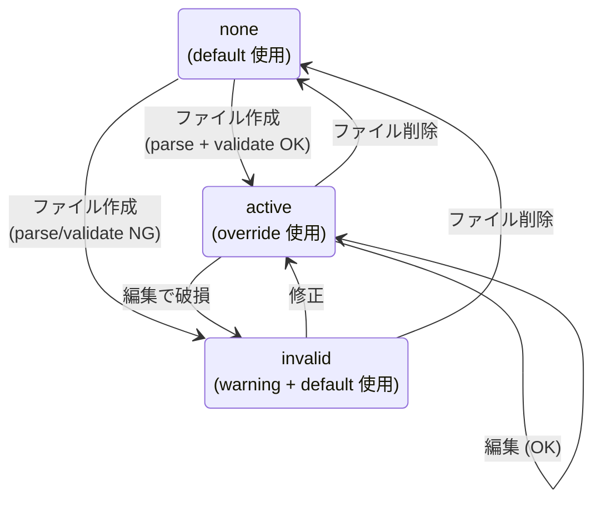

# 42. Prompt Overrides（プロンプト上書き）詳細設計

対象読者: Kikimi 実装者（Claude Code 自身）。実装前に必ず読むこと。

参照元: `kikimi.md` 7 章（整形 system prompt・キャッシュ更新戦略）, 8 章（サマリ system prompt・patch 契約）,
9 章（Watcher ファイル形式・frontmatter）, 12 章（config.yaml）,
`docs/design/03-refinement-batch.md` §4（prompt 組み立て・context キャッシュ）,
`docs/design/04-summary-updater.md` §4.4, `docs/design/25-dictation-mode.md` §14（dictation.context, R12–R17）,
`docs/design/28-glossary.md`（GlossaryRenderer）, `docs/design/34-simple-watchers.md` §4（desugar・system prompt 固定性）,
`docs/design/38-session-chat.md` §3.1, `docs/design/05-watcher-runner.md` §6（placeholder 1 パス置換）,
`docs/references/chirami-map.md` 4 章（YAMLStore / FileWatcher パターン）。

**実装状況**: 未実装（本書が起草）。

## 0. 結論（要約）

**アプリ内に固定で埋め込まれている LLM プロンプトの「方針層」を、`~/.config/kikimi/prompts/` 配下の
frontmatter 付き Markdown ファイルで上書きできるようにする**。ファイルなし = 組み込み default、
ファイルあり = 上書き。JSON schema・出力形式指示・patch 操作契約などの「契約層」はアプリが自動付与し、
ファイルからは触れない。

- 対象は 7 プロンプト + per-app dictation 文脈（§2 の一覧）。Watcher full 形式と LLM ヘルスチェック probe は対象外
- 各ファイルは YAML frontmatter（対象 ID・placeholder 仕様・反映タイミング・`based_on` ハッシュ）+ 本文。
  coding agent がファイル単体を読んで安全に編集できる自己記述性を最重視する
- ヘッドレス CLI を新設: `--eject-prompt <id>`（default を override ファイルとして書き出す）、
  `--validate-prompts`（必須 placeholder 欠落・frontmatter 不正・staleness を exit code 付きで報告）、
  `--render-prompt <id>`（サンプルデータで最終プロンプトを stdout 出力）、`--list-prompts`
- 不正な override は **warning ログ + 組み込み default へフォールバック**。録音・整形は止めない
- 反映は prompts/ の watch による即時反映が基本。ただし会議整形 system prompt と Simple Watcher の
  system prompt テンプレートは prompt cache のため**セッション開始時スナップショットで固定**
- `dictation.context.global` / `dictation.context.apps[]` は config.yaml から
  `prompts/dictation.md` / `prompts/dictation/apps/<bundle-id>.md` へ**非互換移行**する
  （初回起動時に 1 回だけ自動移行。既存キーが config.yaml に残っていてもエラーにしない）
- placeholder 展開は `WatcherPromptBuilder.buildUserPrompt` の 1 パス単純置換を `PromptPlaceholder`
  として共通ヘルパ化し、全プロンプトで再利用する（Mustache 不使用）
- override ファイル一覧と placeholder 仕様はユーザー/agent 向けに `docs/prompts.md` として文書化する
  （アプリが README を生成する方式は不採用）

**kikimi.md からの逸脱**: 7 章の「system prompt 完全固定」を「セッション中固定（方針層は編集可）」に
緩和する等。詳細は §10。

## 1. 目的とスコープ

モデルによって最適なプロンプトが変わるため、固定プロンプトをユーザー（および外部 coding agent）が
編集できるようにする。default をディスクに実体化する方式（初回起動で全ファイル書き出し）は不採用:
アプリ更新に伴う default 改善へ追従できなくなり、chezmoi 等の dotfiles 管理とも衝突するため。

**やること**:

- 対象プロンプトの方針層/契約層への分解と ID 体系（§2）
- override ファイル形式・ディスクレイアウト・`based_on` ハッシュ（§3）
- `PromptStore` ほか新規コンポーネントと既存 builder の API 変更（§4）
- 反映タイミング（watch / セッション開始スナップショット）と状態遷移（§5）
- ヘッドレス CLI（eject / validate / render / list）とアプリ起動経路の変更（§6）
- `dictation.context` の config.yaml からの移設と Settings UI（`DictationAppContextSection`）の
  つなぎ替え（§7）
- 失敗モード（§8）、テスト計画と既存テストの影響範囲（§9）

**やらないこと**（本設計の割り切り）:

- Watcher full 形式（`watchers/<id>.md`）の変更。既に完全ユーザー定義であり本機能の対象外
- `LLMClient` のヘルスチェック probe プロンプトの外部化
- サマリ state schema（`SummaryState`）自体のカスタマイズ。patch 操作契約とともに契約層に隔離し、
  schema 変更は本機能のスコープ外（kikimi.md 8 章「MVP ではアプリ内蔵の固定 schema」のまま）
- user prompt テンプレート（整形の【直前の文脈】/【今回整形する対象】等）の外部化。構造が
  バリデーション・マージ処理と密結合しており、壊すと機能ごと死ぬ契約層に該当する
- プロンプト編集用のアプリ内 UI（Settings に汎用エディタを足す等）。編集はファイル直接編集 +
  eject/validate CLI で行う。例外はディクテーションの既存 UI のつなぎ替えのみ（§7.3）
- override ファイルの多言語化・モデル別の複数バリアント管理

## 2. 対象プロンプトと ID 体系

### 2.1 一覧

| id | 現在の所在 | 方針層（ファイルで編集可） | 契約層（アプリが自動付与・編集不可） | placeholder | reload |
|---|---|---|---|---|---|
| `refinement` | `RefinementPromptBuilder.buildSystemPrompt` | 役割宣言 +【整形ルール】本文 | 【事前知識】（context + 用語集ブロック）+【出力形式】（segments 配列 / joins_next） | 任意: `{{leak_dedup_rule}}` | session-start |
| `summary` | `SummaryPromptBuilder.systemPrompt` | 役割宣言 + 編集方針（title 提案・overview の書き方） | 【patch 契約】（participants_add / decisions 追加のみ / action_items add・modify・complete / 無変更 null） | なし | immediate |
| `final-title` | `SummaryUpdater+FinalTitle.swift` の `finalTitleSystemPrompt` | 全文 | なし（出力形式は structured output schema が強制） | なし | immediate |
| `chat` | `ChatPromptBuilder.buildSystem()` | 全文（役割・書き起こしの性質・回答形式） | なし（answer schema が強制） | なし | immediate |
| `simple-watcher` | `SimpleWatcherSpec.systemPrompt(forViewpoint:)` | 全文（前置き +【観点】+【出力ルール】） | なし（markdown フィールドは schema が強制） | 必須: `{{viewpoint}}` | session-start |
| `glossary-header` | `GlossaryRenderer.header` | ヘッダ全文（置換ルールの説明） | 用語 bullet の描画（`A → B` 行・カテゴリ見出し）はコードが生成 | なし | immediate（※refinement 経由はセッション開始時。§5.2） |
| `dictation` | `DictationContextConfig.default.global`（config.yaml） | 整形ルール本文（現 `dictation.context.global`） | `DictationRefiner.preamble` +【出力形式】suffix（現状のまま Swift 定数） | なし | immediate |
| `dictation/apps/<bundle-id>` | `dictation.context.apps[]`（config.yaml） | そのアプリ向け追加指示の本文 | `DictationContextResolver.appContextHeader` ラベル | なし | immediate |

- id はファイルパスと 1:1（§3.1）。`dictation/apps/<bundle-id>` だけが可変 id で、bundle id は
  `[A-Za-z0-9._-]+` に制限する（それ以外は warning + 無視）
- `{{leak_dedup_rule}}`: `refinement.dedup_system_leak_segments` config が true のとき
  24-system-audio-leak-mitigation.md §4.2 のマイク回り込み除去ルール 1 行に展開され、false のとき
  空文字に展開される。default 本文はこの placeholder を現在の条件付き挿入位置に置くので、
  **override なしの最終プロンプトは現行実装とバイト同一**（§9.1 でテスト固定する）

### 2.2 方針層/契約層の境界（各プロンプトの分解）

**refinement**。最終 system prompt の組み立ては次の固定構造。方針層は先頭ブロックのみ:

```text
<方針層本文（{{leak_dedup_rule}} 展開後）>

【事前知識】
<context.md（32KB clamp）><用語集ブロック（あれば）>

【出力形式】
schema の "segments" 配列で、対象セグメント数分の整形結果を返す。
segments の各要素: {"id": "seg_XXXXX", "refined_text": "...", "joins_next": false}
意味のある内容がないセグメントは refined_text を空文字（{"id": "seg_XXXXX", "refined_text": ""}）にする。
文が不自然に途切れて次のセグメントに続いている場合は joins_next を true にする。意味的に独立していれば false にする。
```

default 方針層本文 = 現在の「あなたは会議書き起こしを整形する専門家です。〜」+【整形ルール】bullet 群
（leak-dedup 行の位置に `{{leak_dedup_rule}}`）。

**summary**。現在の `systemPrompt` 定数を 2 ブロックに再構成する:

```text
<方針層本文>

【patch 契約】
- 出力は変更差分（patch）の JSON
- participants は新たに登場した発言者・出席者だけを participants_add に追加する（既出の参加者は含めない）
- decisions は新規追加分のみ返す（既存には触らない）
- action_items は add / modify / complete のいずれかの操作を返す
- 何も変更がなければ全フィールド null で良い
```

default 方針層本文 = 役割宣言（「あなたは会議サマリを更新するエディタです。〜」）+ 編集方針
（title の提案方針・overview の書き直し方針）。既存の【ルール】bullet のうち patch の構造不変条件に
関わるものは契約層へ、文体・判断基準に関わるものは方針層へ振り分ける。**default 全体の文言は現行から
変わる**（非互換変更を許容する合意方針に基づく。§10）。

**final-title / chat / simple-watcher**。全文が方針層。出力形式は structured output の JSON schema が
機械的に強制するため、契約層として付与するテキストはない。ただし simple-watcher は
`{{viewpoint}}`（ユーザーが簡易フォームに書いた観点本文）が必須 placeholder であり、欠落したら
Watcher 実行が意味を失うので必須違反 = invalid とする。また「根拠となる発言の seg ID を本文にそのまま
書く」ルールを消すと Watcher 出力から該当発言へジャンプする UI 機能が退化する旨を、eject 時の
frontmatter コメントで警告する（§3.2）。

**glossary-header**。`GlossaryRenderer.header`（置換ルールの説明文）だけが方針層。用語 bullet・
カテゴリ見出し・カテゴリ instruction の描画はコード（`GlossaryRenderer.render`）が担い、編集不可。
2026-07 実戦チューニング（`A → B` 矢印形式・左側出力禁止など）が default に蓄積されているため、
白紙生成ではなく eject 起点で編集させる。

**dictation**。契約層（`preamble` / `outputFormatSuffix`）は既に Swift 定数として分離済み
（design 25 §14.4）。方針層 = 現 `DictationContextConfig.default.global` の本文をそのまま
`PromptSpec.defaultBody` へ移す。per-app 文脈は「追加指示」であり default を持たない
（eject はコメント入りスケルトンを出す。§6.2）。

## 3. データモデルとファイル形式

### 3.1 ディスクレイアウト

```text
~/.config/kikimi/
├── prompts/                          # 追加。PromptStore が起動時に dictation/apps/ まで 3 階層とも
│   │                                 #   mkdir -p（§5.1。空ディレクトリの作成は「default の実体化」に
│   │                                 #   当たらない。watch 対象を最初から確保するため）
│   ├── refinement.md                 # あるものだけが override。無ければ組み込み default
│   ├── summary.md
│   ├── final-title.md
│   ├── chat.md
│   ├── simple-watcher.md
│   ├── glossary-header.md
│   ├── dictation.md
│   └── dictation/
│       └── apps/
│           └── <bundle-id>.md        # 例: com.microsoft.VSCode.md
├── context/common.md                 # 既存（変更なし。context.md は「知識」であり本機能の対象外）
├── templates/summary.md              # 既存（変更なし。view template は schema+view 分離の view 側）
└── watchers/*.md                     # 既存（変更なし）
```

- id → パスの写像は `prompts/<id>.md`。config.yaml に `prompts.dir` のようなパス設定は**追加しない**
  （XDG ライク規則に固定。テスト・CLI だけ `--prompts-dir` / イニシャライザ引数で差し替え可能にする）
- `.md` 以外・上記一覧に無いファイル名は無視して debug ログ（誤配置の発見は `--validate-prompts` が担う）

### 3.2 ファイル形式（frontmatter + 本文）

Watcher `.md` と同じ「`---` 区切りの YAML frontmatter + 本文」。`--eject-prompt simple-watcher` の
出力例:

```markdown
---
# Kikimi のプロンプト override ファイル。削除するとアプリ内蔵の既定プロンプトに戻ります。
# 編集の作法: このファイルは `--eject-prompt` で生成し、編集後に `--validate-prompts` で検証すること。
prompt: simple-watcher
based_on: 4f8a2c19d3e0        # eject 元 default 本文の SHA-256 先頭 12 桁（staleness 検出用）
reload: session-start          # このプロンプトの反映タイミング（アプリ側仕様の写し。参考情報）
placeholders:
  required: ["{{viewpoint}}"]  # 本文に必ず残すこと。欠けると override 全体が無効になり default に戻る
  optional: []
# 注意: 「根拠となる発言の seg ID（例: seg_00042）を本文にそのまま書く」のルールを消すと、
# Watcher 出力から該当発言へジャンプする UI 機能が退化します。
---

あなたは会議のリアルタイム書き起こしを観察するアシスタントです。
次の【観点】に従って、与えられた会議内容から分かることを Markdown で簡潔にまとめてください。

【観点】
{{viewpoint}}

【出力ルール】
- markdown フィールドに結果の Markdown 本文を入れて返す
- 会議内容から判断できないことは推測で書かない
- 根拠となる発言を参照するときは、その発言の seg ID（例: seg_00042）を本文にそのまま書く
```

frontmatter フィールドの扱い:

| フィールド | 必須 | 権威 | 意味 |
|---|---|---|---|
| `prompt` | 必須 | ファイル | 対象 ID。パスから導出した ID と一致しなければ invalid（コピペ事故・誤リネームの検出） |
| `based_on` | eject が付与 | ファイル | eject 時点の default 本文ハッシュ。欠落は warning（staleness 検出不能になるだけ） |
| `reload` | eject が付与 | **アプリ** | 参考情報。アプリ側 `PromptSpec` の値と食い違ったら warning（ファイルは無効化しない） |
| `placeholders` | eject が付与 | **アプリ** | 参考情報。同上。検証の真の基準は常に `PromptSpec` |

自己記述性（agent がファイル単体で編集判断できること）のために `reload` / `placeholders` を
frontmatter に書くが、**権威はアプリ内の `PromptSpec` 一覧**とし、写しのドリフトは validate が
warning で報告する。二重管理を「validate が検出できるドリフト」に閉じ込めるための整理。

本文の規則:

- 先頭・末尾の空白改行は trim して使う
- **32KB（UTF-8 バイト）を超えたら warning + clamp して使う**（context.md と同じ規則。
  `RefinementPromptBuilder.clampToByteLimit` を流用）
- trim 後に空: 原則 invalid（空の方針層は静かな劣化になるため）。例外は **`dictation` と
  `dictation/apps/<bundle-id>`** で、空本文を valid な active override として扱う。
  `dictation` の空 = 「文脈を一切注入しない」（design 25 R17 のエスケープハッチを維持する。
  空の `policyBody` は `DictationContextResolver.resolve` で trim 落ちし、
  `DictationRefiner.buildSystemPrompt(resolvedContext: nil)` の素通し経路に入る現行保証をそのまま使う）。
  per-app の空 = 「追加指示なし」
- `{{...}}` 形状のうち `PromptSpec` が知らないものは**そのまま文字として残す**（Watcher §6 と同じ
  1 パス置換の性質）。validate は warning で報告する

### 3.3 `based_on` ハッシュ

`SHA-256(PromptSpec.defaultBody の UTF-8 バイト列)` の hex 先頭 12 桁。default 本文は placeholder
未展開のテンプレートテキストそのもの（`{{leak_dedup_rule}}` を含む）。アプリ更新で default 本文が
変わるとハッシュが変わり、`--validate-prompts` が「based_on と現行 default の乖離（stale）」を
報告する。**diff の取り込み判断は agent/人間に任せ、アプリは自動追従しない**（合意方針）。
agent の取り込み手順は「`--eject-prompt <id> --force` を一時パスへ → 旧 based_on 時点との diff を
確認 → 手元の override に反映 → `based_on` を新ハッシュに更新」で、`docs/prompts.md` に成文化する。

## 4. アーキテクチャと API

### 4.1 新規コンポーネント（`Kikimi/Prompts/`）

```swift
/// 対象プロンプトの静的な仕様（権威）。default 本文・placeholder・反映タイミング・eject 時コメント。
struct PromptSpec: Sendable {
    var id: PromptID
    var reload: PromptReload                 // .immediate / .sessionStart
    var requiredPlaceholders: [String]       // 例: ["{{viewpoint}}"]
    var optionalPlaceholders: [String]       // 例: ["{{leak_dedup_rule}}"]
    var defaultBody: String
    var ejectComments: [String]              // frontmatter に書き出す注意コメント（seg ID 警告など）
    static func spec(for id: PromptID) -> PromptSpec
    static var defaultBodyHash: (PromptID) -> String   // §3.3 のハッシュ
}

enum PromptID: String, CaseIterable, Sendable {
    case refinement, summary, chat, dictation
    case finalTitle = "final-title"
    case simpleWatcher = "simple-watcher"
    case glossaryHeader = "glossary-header"
}

/// per-app dictation を含む参照単位。ファイルパスとの写像もここが持つ。
enum PromptRef: Hashable, Sendable {
    case builtin(PromptID)
    case dictationApp(bundleID: String)      // bundle id は [A-Za-z0-9._-]+ に検証済みであること
}

enum PromptOverrideState: Equatable, Sendable {
    case none                                // ファイル無し → default 使用（正常系）
    case active(body: String, basedOn: String?)
    case invalid(PromptFileError)            // warning ログ済み → default 使用
}
```

```swift
/// prompts/ の読み込み・監視・書き込み。読み取りは nonisolated（OSAllocatedUnfairLock で保護した
/// 不変スナップショットを返す）ので、RefinementQueue / SummaryUpdater 等の actor からも直接呼べる。
/// 変更（ファイル書き込み・watch イベントによる再読込・objectWillChange 発行）は MainActor に閉じる。
final class PromptStore: ObservableObject, @unchecked Sendable {
    static let shared = PromptStore()
    init(directory: URL = defaultPromptsDirectory)   // テスト・CLI 用に差し替え可能

    /// 現在有効な方針層本文。override が active ならその本文（trim・clamp 済み）、
    /// none / invalid なら PromptSpec.defaultBody（dictationApp は空文字）。
    nonisolated func policyBody(for ref: PromptRef) -> String
    nonisolated func overrideState(for ref: PromptRef) -> PromptOverrideState
    /// prompts/dictation/apps/*.md のファイル名から列挙（ソート済み）。
    nonisolated func dictationAppBundleIDs() -> [String]

    /// Settings UI（§7.3）の書き込み口。frontmatter は PromptStore が生成・保持し、body だけ差し替える。
    /// 空本文は dictation 系 ref のみ許可（§3.2/§7.3）。それ以外は PromptFileError を throw。
    @MainActor func writeOverride(_ ref: PromptRef, body: String) throws
    @MainActor func removeOverride(_ ref: PromptRef) throws

    /// session-start スナップショット直前の安全網（§5.1）。前回走査時の (存在, mtime, size) 指紋と
    /// stat を照合し、乖離があるときだけ同期的に再走査する。
    @MainActor func refreshIfStale()

    /// 変更した ref の通知（immediate 反映の購読者向け。objectWillChange は SwiftUI 向け）。
    nonisolated var changes: AsyncStream<PromptRef> { get }
}
```

```swift
/// ファイルの parse / serialize（純粋関数。I/O なし）。
enum PromptFile {
    static func parse(text: String, expectedID: String, spec: PromptSpec?) -> Result<Parsed, PromptFileError>
    static func render(id: String, spec: PromptSpec, body: String) -> String   // eject / writeOverride が使用
}

/// validate の検出結果（CLI とランタイム読み込みが同じ判定を共有する）。
enum PromptValidator {
    enum Level { case error, warning, stale }
    struct Finding { var level: Level; var path: String; var message: String }
    static func validate(fileText: String, ref: PromptRef) -> [Finding]
    static func validateAll(directory: URL) -> [Finding]                        // ディレクトリ走査込み
}

/// WatcherPromptBuilder.buildUserPrompt の 1 パス置換ロジックを共通化したもの（§5 の合意方針）。
/// 元テンプレートを 1 度だけ走査し、置換結果内のトークンは再展開しない。
enum PromptPlaceholder {
    static func expand(template: String, replacements: [(token: String, replacement: String)]) -> String
}
```

`WatcherPromptBuilder.buildUserPrompt` は内部実装を `PromptPlaceholder.expand` への委譲に置き換える
（挙動は不変。既存テストはそのまま通ることが検収条件）。

### 4.2 既存 builder のシグネチャ変更

builder は純粋関数のまま維持し、`PromptStore` を読むのは呼び出し側（既存の DI 流儀を踏襲）。

```swift
// RefinementPromptBuilder（Kikimi/Refinement/）
static func buildSystemPrompt(
    ruleBody: String,                       // 方針層（{{leak_dedup_rule}} 未展開）。呼び出し側が
                                            //   PromptStore.policyBody(for: .builtin(.refinement)) を渡す
    context: String,
    glossaryBlock: String? = nil,
    dedupSystemLeakSegments: Bool = true    // {{leak_dedup_rule}} の展開値を決める（従来と同じ config 由来）
) -> (prompt: String, wasClamped: Bool)

// SummaryPromptBuilder（Kikimi/Summary/）
static let patchContract: String            // 契約層（固定）
static func systemPrompt(policyBody: String) -> String   // = policyBody + "\n\n【patch 契約】\n" + patchContract

// SimpleWatcherSpec（Kikimi/Watchers/）
static func systemPrompt(template: String, viewpoint: String) -> String
    // PromptPlaceholder.expand(template, [("{{viewpoint}}", viewpoint)])
func desugar(promptTemplate: String) -> WatcherDefinition
func desugaredFullText(promptTemplate: String) -> String
    // 「詳細形式に変換」はその時点のテンプレートで固定化される（変換後は full Watcher の完全ユーザー定義）

// WatcherDefinitionParser（Kikimi/Watchers/WatcherDefinition.swift）
static func parse(text: String, expectedId: String, simpleWatcherTemplate: String) throws -> WatcherDefinition
    // desugar() は parseSimpleDefinition の内部で呼ばれる（WatcherDefinition.swift）ため、
    // テンプレートは parse の引数として貫通させる。kind: full の解析経路では未使用。
    // 全呼び出し側（WatcherRunner 3 箇所・MeetingWorkspaceViewModel+Watchers 5 箇所・
    // WatcherDefinitionParserTests）がコンパイル追従の対象（§4.3/§9.2）

// GlossaryRenderer（Kikimi/Glossary/）
static let defaultHeader: String            // 現 `header` を改名（default であることを明示）
static func render(entries:categories:header: String = GlossaryRenderer.defaultHeader) -> String?

// DictationContextResolver（Kikimi/Dictation/）
static func resolve(
    globalBody: String,                     // PromptStore.policyBody(for: .builtin(.dictation))
    appBody: String?,                       // PromptStore.policyBody(for: .dictationApp(bundleID:))。
                                            //   bundle id → ファイルの解決は呼び出し側（DictationController）
    glossary: [GlossaryEntry] = [],
    glossaryCategories: [GlossaryCategory] = [],
    glossaryHeader: String = GlossaryRenderer.defaultHeader
) -> String?

// ChatPromptBuilder（Kikimi/Chat/）
// buildSystem() は削除。default 本文は PromptSpec(.chat).defaultBody へ移し、
// ChatRunner が LLMRequest.system に PromptStore.policyBody(for: .builtin(.chat)) を渡す。
```

### 4.3 呼び出し側の変更（値の受け渡し）

| 呼び出し側 | 変更 | reload 実現方法 |
|---|---|---|
| `RefinementQueue` | `ruleBodyProvider: @Sendable () -> String` と `glossaryHeaderProvider: @Sendable () -> String` を追加（既存 `glossaryProvider` と同形の DI）。default は組み込み値を返す固定 closure | `defaultRefinementQueueFactory`（`MeetingWorkspaceViewModel+Factories.swift`）が**キュー生成時に main actor 上で 1 回スナップショット**した値を `{ snapshot }` で渡す。これが「セッション開始時固定」の実体（`context_refresh_batches` の再読込でも変わらない） |
| `WatcherRunner` | init に `simpleWatcherTemplate: String` を追加。`defaultWatcherRunnerFactory`（`MeetingWorkspaceViewModel+Factories.swift`。main actor・セッション開始時）が `PromptStore` から 1 回スナップショットして渡す。runner 内の全 parse 呼び出し（`runManually` / `runIfMatchingTrigger` / `resolveAndParse`）へ貫通。**セッション開始時スナップショットの保持者は runner 自身**（`WatcherLibrary` はテキスト解決のみで parse を呼ばないため変更なし） | session-start。Watcher は発火ごとに `.md` を再パースする（kikimi.md 9 章「Recording 中の `.md` 編集は次回発火から即反映」）が、そこへ渡すテンプレートは runner 保持のスナップショットなので、viewpoint・trigger 等の `.md` 編集は即反映のまま「System テンプレートは実行間で完全固定」（34 §4.1）が保たれ、§5.2 の「セッション中固定」は破れない |
| `MeetingWorkspaceViewModel+Watchers`（一覧・simple フォーム・変換） | parse / `desugar` / `desugaredFullText` 呼び出しに、main actor でその時点の `PromptStore` 値を渡す。`convertSimpleWatcherToFull` のラウンドトリップ検証（`desugaredFullText` → parse → `desugar` 比較）は**同一のテンプレート値**で行う（冒頭で 1 回読んでローカルに固定。値が食い違うと検証が偽陽性で失敗する）。`WatcherPanelTypes` は doc comment の追従のみ | 変換はその時点のテンプレートで固定化（変換後は full 形式 = 完全ユーザー定義）。一覧・フォームの parse は表示用でセッション実行に影響しない |
| `SummaryUpdater` | `promptBodyProvider: @Sendable (PromptID) -> String` を追加。production は `{ PromptStore.shared.policyBody(for: .builtin($0)) }`（nonisolated 読み取りなので actor から直接呼べる）。`systemPrompt` 定数参照と `finalTitleSystemPrompt` 定数を provider 経由に置換 | immediate（毎回の更新呼び出しで読む） |
| `ChatRunner` | 同上の provider を追加し `LLMRequest.system` に注入 | immediate（送信ごと） |
| `DictationController` | `DictationContextResolver.resolve` の新シグネチャへ移行。global / per-app / glossary header を `PromptStore` から解決 | immediate（発話ごと） |

`PromptStore` の読み取りが nonisolated なので、`glossaryProvider` で必要だった「main actor で
スナップショットして値 closure を渡す」制約は immediate 系では不要になる。session-start 系だけが
意図的にスナップショットする。

## 5. 反映タイミングと状態遷移

### 5.1 ファイルの状態遷移

`PromptStore` は起動時に `prompts/`・`prompts/dictation/`・`prompts/dictation/apps/` の 3 階層を
mkdir -p で掘り（§3.1 の mkdir はこの 3 つすべて。watch 対象を最初から確保するため）、全走査して
メモリに載せる。以後の監視は **2 層構成**にする。DispatchSource（kqueue vnode）のディレクトリ fd は
エントリの作成・削除・rename でしか発火せず、**配下ファイルの in-place 上書き（VSCode の既定保存や
coding agent の Write/Edit = truncate+write）では発火しない**ため、ディレクトリ監視単独では
immediate 反映の主経路が成立しないことが前提:

- **ディレクトリ watcher（上記 3 ディレクトリに各 1 本）**: 担当は「ファイル集合の変化」のみ
  （新規 override の作成・削除・atomic write の rename）。3 階層を起動時に掘るので
  「サブディレクトリが後から現れて watch が張れていない」状態は起きない（万一 `dictation/apps/` が
  手で消されたら、親ディレクトリのイベント → 再走査で mkdir + watcher を再アームする）
- **per-file watcher（現に存在する override ファイルごとに 1 本）**: 既存 `FileWatcher`
  （`YAMLStore.swift` の DispatchSource ベース実装。atomic write（delete+rename）時の fd 張り直し
  対応済み。chirami-map 4 章のパターン）を、走査で見つかった各ファイルに個別に張る。in-place 上書きは
  こちらが `.write` イベントで検出する。対象は高々 8 ファイル + `dictation/apps/*` で fd 数の懸念はない

どちらのイベントでも debounce 500ms 後に**全再走査**し、per-file watcher の集合を「現に存在する
ファイル」に張り直す（消えたファイルの watcher は破棄する。存在しないファイルはディレクトリ watcher が
作成を検出するので、`FileWatcher` 内蔵の「ファイル不在時 0.5 秒 retry ループ」には入らせない）。
`FileWatcher` は現在 `YAMLStore.swift` に private で埋め込まれているため、
`Kikimi/Config/FileWatcher.swift` へ internal として切り出す（挙動は不変。`YAMLStore` は従来どおり使う）。
FSEventStream への置き換えは不採用（既存実装の転用で足り、対象ファイル集合が既知・少数のため）。

**セッション開始時の安全網**: session-start スナップショットを取る factory
（`defaultRefinementQueueFactory` / `defaultWatcherRunnerFactory`。§4.3）は、スナップショット直前に
`PromptStore.refreshIfStale()` を呼ぶ。前回走査時に記録した各ファイルの (存在, mtime, size) 指紋を
stat で照合し、乖離があれば同期的に再走査する（高々 10 数回の stat）。watch が万一取りこぼしても
（kqueue の限界・mkdir 失敗で watch 不能など。§8 #1/#12）、セッション開始時点の本文は必ず最新になる。



- invalid への遷移時に 1 回だけ warning ログを出す（同一内容での再ログはしない。ログ洪水防止）
- invalid の間もアプリは default で動き続ける（録音・整形を止めない。既存の「warning + 既定値」流儀）

### 5.2 反映タイミング（機能側から見た遷移）

| id | 反映 | 根拠 |
|---|---|---|
| `refinement` | 次のセッション開始時（Recording 開始で生成される `RefinementQueue` から） | prompt cache。kikimi.md 7 章のキャッシュヒット戦略をセッション単位で維持 |
| `simple-watcher` | 次のセッション開始時（`WatcherRunner` 生成時にスナップショットし、発火ごとの `.md` 再パースへはそれを渡す。§4.3） | 34-simple-watchers §4.1「System は実行間で完全固定」。`.md` 側（viewpoint 等）の編集が次回発火から即反映される性質（kikimi.md 9 章）は従来どおり |
| `summary` / `final-title` | 次回サマリ更新 / 次回セッション終了処理から即時 | summary はキャッシュ非依存（04 §4.4） |
| `chat` | 次の質問送信から即時 | 送信単位で system が変わっても実害なし |
| `glossary-header` | dictation は次の発話から即時。**会議整形はセッション開始時スナップショット**（refinement system prompt の一部として固定されるため） | glossary エントリ自体も既にキュー生成時スナップショット（`glossaryProvider` の既存契約）であり、それに揃える |
| `dictation` / `dictation/apps/*` | 次の発話から即時 | ステートレスな道具。キャッシュ非依存 |

録音中の `refreshContextNow()`（「今すぐ反映」ボタン）は **context.md / 参加者ブロックのみ**を
再読込し、`ruleBody` / `glossaryHeader` のスナップショットは更新しない（セッション中固定を厳守。
frontmatter の `reload: session-start` 表記と挙動を一致させる）。

## 6. ヘッドレス CLI

### 6.1 起動経路の変更

現在 `KikimiApp`（SwiftUI `App`）が `@main`。ヘッドレスパスで AppKit / TCC / メニューバーを一切
起動しないため、エントリポイントを差し替える:

```swift
// Kikimi/KikimiMain.swift（新規）
@main
enum KikimiMain {
    static func main() {
        if let code = PromptCLI.runIfRequested(arguments: Array(CommandLine.arguments.dropFirst())) {
            exit(code)
        }
        KikimiApp.main()   // 従来どおりの GUI 起動（KikimiApp から @main を外す）
    }
}
```

- `PromptCLI` は自分の知らないフラグ（`-NS...` など macOS が付ける引数を含む）には反応せず `nil` を
  返す → GUI 起動にフォールスルー。プロンプト系フラグを 1 つでも見つけたらヘッドレスで完結する
- ヘッドレスパスは `AppConfig` / `AppState` / `WindowManager` に触れない（`PromptStore` を
  `--prompts-dir`（default `~/.config/kikimi/prompts/`）で直接生成する）。ログは stdout/stderr
- 実行例: `~/Applications/Kikimi.app/Contents/MacOS/Kikimi --eject-prompt refinement`
- アプリ本体が起動中でも安全: eject の書き込みは起動中プロセスの watch が拾う（§5.1）

### 6.2 サブコマンド仕様

**`--eject-prompt <id> [--force] [--out <path>]`** — 現行の組み込み default を frontmatter 付き
override ファイルとして書き出す。

- 出力先は既定で `prompts/<id>.md`。`--out` で任意パスへ（agent の diff 用途）
- 既存ファイルがあれば書かずに exit 2（`--force` で上書き）。書いたパスを stdout に出す
- `dictation/apps/<bundle-id>` は default を持たないため、注意コメント + 空本文のスケルトンを出す
- exit code: 0 = 書き出し成功 / 1 = unknown id・I/O エラー / 2 = 既存ファイルあり（--force なし）

**`--validate-prompts [<id> ...]`** — 引数なしなら prompts/ 全走査（`dictation/apps/*` 含む）。
`PromptValidator` の判定はランタイム読み込みと同一実装を共有する。

- 出力（1 件 1 行・安定した接頭辞）:
  - `ERROR <path>: <message>` — フォールバックが起きる不備（frontmatter 不正・`prompt` 不一致・
    必須 placeholder 欠落・本文空）
  - `WARN <path>: <message>` — 未知 placeholder・`reload`/`placeholders` 写しのドリフト・
    `based_on` 欠落・32KB 超過・無視される謎ファイル
  - `STALE <path>: based_on <hash> != current <hash>` — default 乖離
- exit code: 0 = 問題なし / 1 = ERROR あり / 2 = WARN・STALE のみ

**`--render-prompt <id>`** — override（あれば）+ 契約層 + 内蔵サンプルデータで最終 system prompt を
組み立てて stdout に出す。ランタイムと同じ組み立て関数（§4.2 の builder）を通す。

- サンプルデータは決定論的な内蔵固定値（context 例・用語集 2〜3 エントリ・viewpoint 例・summary state 例）。
  `AppConfig` は読まない。実セッションデータの利用はスコープ外（§12）
- override が invalid のときはランタイムと同じく default で組み立て、stderr に WARN、exit 2
- exit code: 0 = override（または default）で正常出力 / 1 = unknown id / 2 = フォールバック発生
- user prompt のレンダリングは対象外（設計段階のスコープ調整。system prompt だけで編集ループは回る）

**`--list-prompts`** — 発見性のための一覧。`<id>\t<override|default|invalid>\t<current|stale|->`
をタブ区切りで出す。exit 0。

## 7. dictation.context の移設

### 7.1 非互換移行（1 回だけの自動移行）

初回起動時（GUI 起動の `PromptStore` 初期化時）に 1 回だけ実行し、完了を
`state.yaml` の `dictation_prompts_migrated: true` に記録する（ファイル存在で判定すると
「override を消して default に戻す」操作のたびに再移行してしまうため、マーカーは必須）。

移行規則（対象ファイルが既に存在する id は常に skip）:

- **比較の基準は移設後の旧 default 本文 = `PromptSpec(.dictation).defaultBody` とする**。
  `DictationContextConfig.default.global` とは比較しない: §7.2 でそちらは本文を持たなくなるため、
  比較先を誤ると移行条件が「非空なら移行」に退化する。Settings を一度でも保存した config.yaml には
  未編集の default 本文が実体として書かれている（`AppConfig` は YAMLStore 経由で config 全体を
  シリアライズして書き戻す）ので、この比較を誤ると未カスタマイズの全ユーザーで旧 default が
  override として凍結され、§1 が避けた「default 改善へ追従不能」状態を移行経路が起こしてしまう
- `dictation.context.global` のキーが**不在**（decode 結果 `nil`。§7.2 の Optional 化）→ 移行しない
- global（trim 後）が `PromptSpec(.dictation).defaultBody`（trim 後）と一致 → 移行しない
  （実体化されただけの未カスタマイズ default）
- global（trim 後）が**空**（キーは在るが空文字 = design 25 R17 のエスケープハッチ）→
  **空本文の override**（`prompts/dictation.md`）を書き出す（§3.2: dictation の空本文 =
  文脈を一切注入しない）。移行しないと default 整形ルールが無警告で復活する非互換になるため
- 上記以外（カスタマイズされた非空 global）→ 本文をそのまま override として書き出す
  （`based_on` は移行時点の default ハッシュ。本文が default 由来でない旨をコメントで付記）。info ログ
- `dictation.context.apps[]` の各エントリ（context が trim 後非空）→
  `prompts/dictation/apps/<bundle-id>.md` が無ければ書き出す。bundle id が `[A-Za-z0-9._-]+` に
  合わない場合は warning + skip
- config.yaml の既存キーは**削除も書き換えもしない**（chezmoi 管理の config を勝手に触らない）。
  以後は読み飛ばす。キーが残っていてもエラーにしない（合意方針）
- 移行後に config.yaml 側だけを編集しても反映されない。`dictation.context` キーの存在を検出したら
  起動時に 1 回 debug ログで「prompts/ へ移行済み・このキーは無視される」と出す

### 7.2 コード面の変更

- `DictationContextConfig` は型として残す（古い config.yaml の decode を通すため）が、
  `global` / `apps` は移行（§7.1）以外では**読み捨て**になる。`global` は `String?` に変え、decode を
  `decodeIfPresent` のみにする（キー不在 = `nil`。現行の `?? Self.default.global` フォールバックは
  廃止）。これで移行時に「キー不在」と「意図的な空文字（R17 エスケープハッチ）」を区別できる
- 旧 default 本文は `PromptSpec(.dictation).defaultBody` へ移設する（本文の二重管理を作らない）。
  `DictationContextConfig.default` の `global` は `nil` になる。**移行判定はこの型の default とは
  比較せず**、常に `PromptSpec(.dictation).defaultBody` と比較する（§7.1）
- `DictationController` は `DictationContextResolver.resolve(globalBody:appBody:...)` 新シグネチャへ
  移行（§4.2/§4.3）。frontmost bundle id → `PromptStore.dictationAppBundleIDs()` の照合
  （完全一致のみ。R14 のまま）は controller 側で行う

### 7.3 Settings UI（`DictationAppContextSection`）への影響

「アプリ別コンテキスト」セクションの UX（R16/R17: グローバル本文エディタ・実行中アプリからの
bundle id 選択・per-app 編集シート）は価値が高いので**廃止せず、バインド先を config → PromptStore に
つなぎ替える**:

- グローバル `TextEditor` → `PromptStore.policyBody(for: .builtin(.dictation))` を表示し、編集は
  `writeOverride(.builtin(.dictation), body:)` で write-through（frontmatter は PromptStore が生成・維持）
- 「既定に戻す」→ `removeOverride(.builtin(.dictation))`（ファイル削除 = default 復帰。§5.1 の遷移そのもの）
- per-app 一覧 → `dictationAppBundleIDs()` から列挙。追加シートは空本文ファイルを作成、編集シートは
  body を書き換え、削除はファイル削除
- 外部（エディタ・agent）でのファイル編集は watch → `objectWillChange` で UI に反映される
- R17 の「送っている内容が常に見える」性質は維持される（エディタには default か override の
  現在有効な本文が出る）
- **空本文の扱い（§3.2 と対応）**: グローバルエディタを空にして保存すると
  `writeOverride(.builtin(.dictation), body: "")` が**空本文の override ファイルを書く**
  （= 文脈を一切注入しない。R17 のエスケープハッチ）。`removeOverride` へは写像しない（それは
  default 復帰であり意味が逆になる）。default 復帰は「既定に戻す」ボタン = `removeOverride` だけが
  行う。per-app の空本文も同様に空ファイルとして書く（「追加指示なし」）。dictation 系以外の
  組み込み id への `writeOverride(body: 空)` は `PromptFileError` を throw する（invalid ファイルを
  UI 経由で作らせない防御的規定。現状 dictation 系以外に UI の書き込み口はない）

Settings の他タブ（`ModelSettingsTab` 等）への影響はない。プロンプト全般の編集 UI は追加しない
（§1 のやらないこと）。

## 8. 失敗モード

| # | 状況 | 挙動 |
|---|---|---|
| 1 | prompts/ ディレクトリ不在 | 起動時に 3 階層とも mkdir（§5.1）。作成失敗（権限等）は warning + 全 default で継続（watch は諦めるが、`refreshIfStale()` のセッション開始時再読込は機能する） |
| 2 | ファイルが UTF-8 として読めない | invalid → warning + default |
| 3 | frontmatter 欠落 / YAML として不正 / mapping でない | invalid → warning + default（frontmatter 必須。自己記述性の保証） |
| 4 | `prompt` フィールド欠落・パス由来 id と不一致 | invalid → warning + default |
| 5 | 必須 placeholder（`{{viewpoint}}`）が本文に無い | invalid → warning + default（Watcher 実行を壊さない） |
| 6 | 本文が空 | `dictation` / `dictation/apps/*` は valid な active override（空 = 文脈を注入しない。R17 エスケープハッチ。§3.2）。その他の組み込み id は invalid → warning + default |
| 7 | 本文 32KB 超過 | warning + clamp して使用（invalid にはしない。context.md と同じ） |
| 8 | 未知の `{{...}}` トークン | そのまま文字として送る + validate で WARN（ランタイムはログしない。正当な用例があり得るため） |
| 9 | `based_on` が現行 default と乖離（stale） | ランタイム挙動への影響なし。validate / list が報告するのみ（自動追従しない） |
| 10 | `reload` / `placeholders` の写しがアプリ仕様とドリフト | validate で WARN。ランタイムは常に `PromptSpec` に従う |
| 11 | 録音中に `refinement` / `simple-watcher` の override を編集 | 進行中セッションは開始時スナップショットのまま。次セッションから反映（§5.2） |
| 12 | 既存ファイルの in-place 上書き（VSCode 既定保存・agent の Write/Edit）はディレクトリ fd にイベントを発火しない | per-file watcher が `.write` で検出する（§5.1 の 2 層監視。ディレクトリ監視単独では検出不能なことが 2 層化の理由）。atomic write は per-file 側の fd 張り直しとディレクトリ側 rename イベントの両方で拾う。両方取りこぼしても `refreshIfStale()`（§5.1）がセッション開始時に収束させる |
| 13 | CLI とアプリの同時実行 | eject は新規ファイル作成（または --force 上書き）のみ。アプリ側は watch で拾う。ロック不要（最悪 1 イベント分の遅延） |
| 14 | 移行（§7.1）中の書き込み失敗 | warning + マーカーを立てず継続（次回起動で再試行）。config 値は失われない（読み捨てるだけで消さない） |
| 15 | invalid → 修正 → invalid の編集往復 | 状態が変わるたびに warning は 1 回だけ（§5.1）。default フォールバックで動作は常に継続 |

## 9. テスト計画

### 9.1 新規テスト（`KikimiTests/Prompts/`）

- `PromptFileTests` — parse/render の往復、frontmatter 各不備（§8 #3–#6）、clamp、コメント付き eject 出力の形
- `PromptValidatorTests` — ERROR/WARN/STALE の各判定、`prompt` 不一致、必須 placeholder 欠落、
  未知 placeholder、写しドリフト、based_on 乖離
- `PromptStoreTests` — 一時ディレクトリで none/active/invalid の解決、writeOverride/removeOverride の
  往復（dictation の空本文 = 空 override / 非 dictation の空本文 = throw を含む）、
  dictationAppBundleIDs 列挙、`refreshIfStale()` の指紋比較（in-place 上書き後の再読込）、
  （可能なら）watch による再読込を **in-place 上書き（truncate+write）と atomic write（rename）の両方**で
- `PromptPlaceholderTests` — 1 パス置換（置換結果内のトークンを再展開しない、複数トークンの左→右順）
- `PromptCLITests` — 引数パース（未知フラグで nil / GUI フォールスルー）、eject の exit code 0/1/2、
  validate の exit code 0/1/2、render の default 同値性（下記）
- `PromptMigrationTests` — §7.1 の移行規則: 比較先が `PromptSpec(.dictation).defaultBody` であること
  （**config.yaml に旧 default 本文がそのまま実体化されているケースが移行されない**ことを明示的に固定）、
  キー不在（`nil`）は移行しない、キー在り空文字（R17）は空本文 override へ移行される、
  カスタマイズ本文の移行、マーカーによる再実行抑止、不正 bundle id の skip
- **default 同値性テスト（回帰の要）**: override なしで組み立てた `refinement` の最終 system prompt が
  リファクタ前の出力とバイト同一であること（`dedupSystemLeakSegments` true/false 両方）。
  `simple-watcher` / `glossary-header` / `dictation` も同様に default 出力を固定する

### 9.2 壊れる（更新が必要な）既存テスト

| テスト | 影響 |
|---|---|
| `KikimiTests/Refinement/RefinementPromptBuilderTests.swift` | `buildSystemPrompt` に `ruleBody` が増える。default 本文を渡す形へ書き換え（期待出力は不変） |
| `KikimiTests/Refinement/RefinementQueueTests.swift` | 新 provider（`ruleBodyProvider`/`glossaryHeaderProvider`）は default 引数で吸収し、原則無変更。スナップショット挙動の新規ケースを追加 |
| `KikimiTests/Summary/SummaryPromptBuilderTests.swift` | `systemPrompt` 定数 → 関数化 + 本文再構成（§2.2）で**期待文字列が変わる** |
| `KikimiTests/Summary/SummaryUpdaterTests.swift` | provider 注入のコンパイル修正。stub LLM はプロンプト内容非依存なので判定はほぼ不変。final title の system prompt 参照先変更 |
| `KikimiTests/Dictation/DictationContextResolverTests.swift` | `resolve` シグネチャ全面変更（config 型 → 解決済み本文）で書き直し |
| `KikimiTests/Config/AppConfigTests.swift` | `DictationContextConfig.global` の Optional 化（§7.2: キー不在 = `nil`・default フォールバック廃止）に伴う decode 期待値の更新 |
| `KikimiTests/Dictation/DictationRefinerTests.swift` | `buildSystemPrompt(resolvedContext:)` は不変のため原則無変更 |
| `KikimiTests/Glossary/GlossaryRendererTests.swift` | `header` → `defaultHeader` 改名の追従のみ（default 引数で挙動不変）。カスタムヘッダのケースを追加 |
| `KikimiTests/Watchers/SimpleWatcherSpecTests.swift` | `systemPrompt`/`desugar`/`desugaredFullText` のシグネチャ変更。default テンプレートでの期待出力は不変 |
| `KikimiTests/Watchers/WatcherDefinitionParserTests.swift` | `parse` の `simpleWatcherTemplate` 引数追加に伴うコンパイル修正（default テンプレートを渡せば期待出力不変）。非 default テンプレートが desugar 結果の systemPrompt に反映されるケースを追加 |
| `KikimiTests/Watchers/WatcherRunnerTests.swift` | init の `simpleWatcherTemplate` 追加に伴うコンパイル修正。「録音中に simple `.md` の viewpoint を編集 → 次回発火で新 viewpoint が反映され、テンプレートは runner 生成時スナップショットのまま」のケースを追加 |
| `KikimiTests/Watchers/WatcherPromptBuilderTests.swift` | 実装の委譲のみで挙動不変。無変更が検収条件 |
| `KikimiTests/ViewModels/MeetingWorkspaceViewModelTests.swift` | desugar 呼び出し（simple → full 変換含む）の引数追加に伴うコンパイル修正 |
| `KikimiTests/Chat/`（ChatRunner 系） | `ChatPromptBuilder.buildSystem()` 削除に伴い、system 本文の注入経路を provider に変更 |

## 10. kikimi.md からの逸脱

1. **7 章「System prompt（キャッシュヒット狙い・完全固定）」**: 「完全固定」を「セッション中固定
   （方針層はセッション間でユーザー編集可）」に緩和する。プロンプトキャッシュが効く単位
   （1 セッション内の全バッチ）は維持されるため、7 章のコスト戦略は壊れない。ユーザー合意済み
2. **8 章のサマリ system prompt 例文**: 方針層 +【patch 契約】の 2 ブロック構造に再構成し、default の
   文言が kikimi.md の例文（および現行実装の文言）から変わる。patch 操作の不変条件（decisions
   追加のみ・action_items add/modify/complete）は契約層としてアプリが常に付与するので、8 章の
   patch モデル自体は不変。非互換変更を許容する合意方針に基づく
3. **4 章 保存場所**: `~/.config/kikimi/prompts/` を新設する（kikimi.md 未記載のディレクトリ）。
   config.yaml（12 章）へのキー追加はしない
4. **design 25 §14（kikimi.md 本体ではなく設計文書）**: R12/R17 の「dictation.context を config.yaml で
   保持・Settings で編集」を廃止し prompts/ へ非互換移行する（§7）。Settings UI の UX 自体は
   バインド先変更で維持。合意済み

## 11. Chirami 参照実装との差分

プロンプト override 機構そのものは Chirami に存在しない（Chirami のプロンプトはハードコード）。
本機能で Chirami から流用するのは以下のパターンのみ:

- `YAMLStore.swift` の `FileWatcher`（DispatchSource + atomic write 時の fd 張り直し。
  chirami-map 4 章）→ **per-file watcher** として転用（`Kikimi/Config/FileWatcher.swift` へ
  internal 切り出し。§5.1）。Chirami には `Chirami/Services/DirectoryWatcher.swift` も実在する
  （chirami-map 未掲載）が、非再帰かつ配下ファイルの in-place 書き込みを検出しないため、単独では
  §5.1 の要件を満たさない。「ディレクトリ + per-file の 2 層監視」の組み合わせ自体は Kikimi 新規実装
- frontmatter + 本文のファイル形式は Kikimi 自身の Watcher `.md`（kikimi.md 9 章）の踏襲であり、
  Chirami 由来ではない
- ヘッドレス CLI フラグでの起動分岐は Chirami に前例がなく新規（`ChiramiApp.swift` は GUI 起動のみ）

## 12. Open Questions（実装中に判断し、Phase 完了時に報告する）

1. `--render-prompt` に実セッションの context/state を食わせる `--session <id>` オプションは今回
   見送った（内蔵サンプル固定）。編集ループ上の必要が出たら追補する
2. 録音中の「今すぐ反映」で `ruleBody` も再スナップショットするか。本設計は「しない」
   （`reload: session-start` の表記と挙動の一致を優先）。実戦で不便なら再検討
3. `glossary-header` の reload が経路によって非対称（dictation 即時 / 会議整形はセッション開始時）で、
   frontmatter の単一 `reload` 欄では表現しきれない。当面はコメントで補足するが、複数値
   （`reload: {dictation: immediate, refinement: session-start}`）が要るかは validate の使われ方を見て判断
4. summary の方針/契約分割で default 全文の文言が現行から変わるため、サマリ品質の回帰は Phase 実戦
   （リアル会議）で確認する。単体テストでは文言変更の妥当性を判定できない
