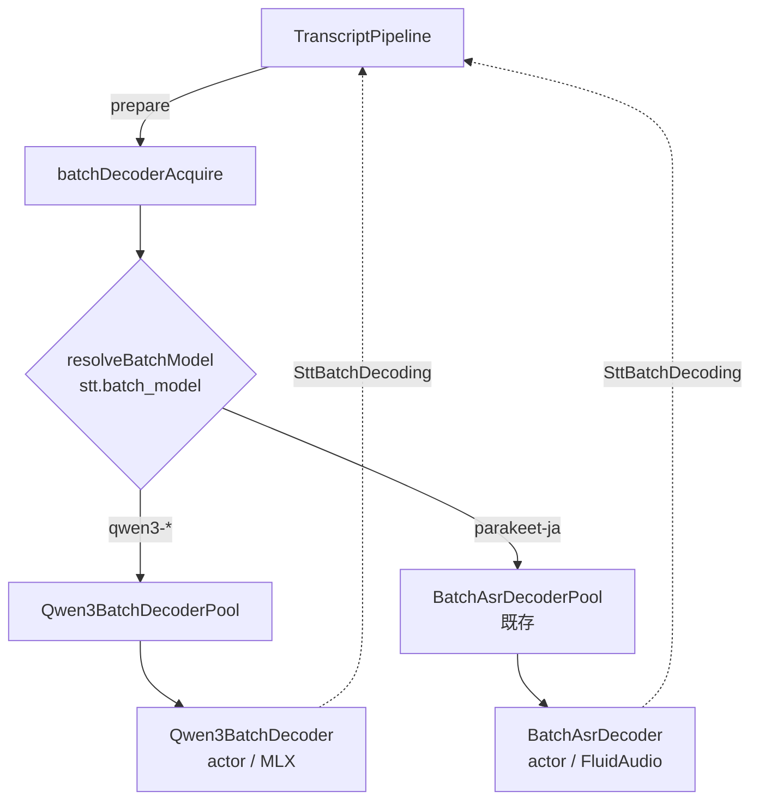

# 45. 二段目バッチデコードの Qwen3-ASR 化 詳細設計

会議の確定セグメントを作る 2 段目（design 33 の窓再デコード）のモデルを、Parakeet TDT Japanese
(`parakeet-0.6b-ja`) から **Qwen3-ASR (MLX)** に差し替える。design 33 の構造 — 窓のタイル化、
`SttBatchDecoding` 越しの差し替え、失敗時のストリーミングへのフォールバック — は一切変えない。
変わるのは `BatchAsrDecoder` の中身と、そこに至るモデル選択だけ。

**位置づけ**: 実装済み（`8f05dc2`）。ビルド基盤（xcodebuild 移行と MLX の同梱）は先行して入れた
（`c74ab9d` / `7050cf7`）。

## 1. 動機

design 31/33 が潰そうとした「ポーズ明けの語の欠落」は、二段デコードを入れた**今も残っている**。
実会議音声 23 本（550 秒、`tools/asr-eval/`）で測った結果が根拠。

| モデル | RTF | 25 秒窓の処理 | 総文字数 |
|---|---|---|---|
| tdtJa（現行） | 0.0081 | 0.20 秒 | 2711 |
| Qwen3-ASR 0.6B/4bit | 0.0185 | 0.46 秒 | 3261 |
| Qwen3-ASR 1.7B/8bit | 0.0461 | 1.15 秒 | 3270 |
| Whisper large-v3-turbo (WhisperKit) | 0.6463 | 16.2 秒 | 2931 |

文字数は句読点・空白を除いた実文字数で、**欠落の量をそのまま反映する**。tdtJa は Qwen3 より
17% 短く、23 本中 6 本で 15% 以上短い。実例（clip_09、system 音声 15.7 秒）:

- tdtJa: `まだ受講されてない方、期限もうすぐですので、ご受講のほう、よろしくお願いいたします。問い合わせの方を切り替えていきたい。`
- Qwen3: 同じ前半のあと `以上です。はい、ありがとうございます。では…おはようございます。あれ、声届いてるかな。大丈夫かな。…` と続く

tdtJa は中間の約 10 秒を丸ごと落としている。**LLM 整形では復元できない**（design 31 §1 と同じ理由）。

技術用語も壊れる。会議の内容がそのまま失われる種類の誤りで、CER にはほとんど乗らない。

| 実際 | tdtJa | Qwen3 1.7B/8bit |
|---|---|---|
| AWS | マルダル / エダピス / エアウィーヴ | AWS |
| Airflow | エアフォーフロー | Airflow（4bit ではカタカナ） |
| 東さん / 小池さん | — | 東さん / 小池さん |

**Whisper 系は不採用**。品質は tdtJa より上だが RTF 0.65 は会議に乗らない。確定のたびに再デコード
し、mic と system が同じ ANE を共有する（design 33 MT5）ので実効 1.3 相当になり、確定テキストが
16 秒遅れる。small まで落とすと速度は足りるが、語の欠落も用語崩れも tdtJa と同水準に戻る
（文字数 2820 対 2711、`AWS` → `IWC`）ので替える意味がない。

**CoreML 変換版も不採用**。同じ Qwen3 でも変換で精度が落ちる。FluidAudio の 0.6B CoreML は
`固态`（簡体字）や `AWS` → 消失、soniqo の CoreML は `AWS` → `ダブルス` を出し、しかも MLX より
5〜8 倍遅い（0.1251 / 0.1446 対 0.0185）。FluidAudio が同じ変換を捨てた判断（PR #676、v0.15.3）
と一致する。

## 2. 決定事項

| # | 決定 |
|---|------|
| Q1 | バッチモデルを `soniqo/speech-swift` の `Qwen3ASRModel`（MLX）に差し替える。既定は **1.7B/8bit**（`aufklarer/Qwen3-ASR-1.7B-MLX-8bit`）。0.6B/4bit は文字数こそ同等だが固有名詞と技術用語の劣化が実測で見えた（`東さん` → `日向さん`、`AWS` 消失、ハングル混入）。RTF 0.046 は 25 秒窓で 1.15 秒であり、確定の体感を損なわない |
| Q2 | 接続点は `SttBatchDecoding`（`transcribe(samples:) -> String`）のまま。`TranscriptPipeline` も `SttEngine` も窓のタイル化（MT2）も無変更。**design 33 の構造には一切触らない** |
| Q3 | 窓長の上限は **30 秒**。Qwen3 の音声エンコーダは 30 秒（3000 mel frames）固定で、超えると CoreML 側は例外、MLX 側も精度が保証されない。現行 `BatchAsrDecoder` の 15 秒分割（FluidAudio の ChunkProcessor 回避）と同じ機構を 30 秒閾値で再利用する（§3.2） |
| Q4 | モデルは `stt.batch_model` で選ぶ。`"qwen3-1.7b"`（既定） / `"qwen3-0.6b"` / `"parakeet-ja"`。未知の値は `.warning` ログの上で既定にフォールバック（`SttConfig` の他フィールドと同じ流儀）。**`parakeet-ja` を残すのは退路**: MLX が使えない環境（後述）や、Qwen3 が特定の音声で崩れたときに設定 1 行で戻せる |
| Q5 | ロード失敗・未完了は機能を止めない。design 33 MT8 のまま: `prepare()` の acquire は並行 `Task`、失敗したら `.error` ログ 1 回とストリーミング確定へのフォールバック、`stopAndDrain()` で cancel → await → 取得できていた場合のみ release |
| Q6 | **`#if canImport(Qwen3ASR)` で全体をガードする**。MLX は `project.yml`（xcodebuild）にしかなく、`Package.swift`（`swift test`）には無い（§4）。ガードが false の側では `resolveBatchModel` が常に `parakeet-ja` を返し、現行と 1 バイトも変わらない挙動になる |
| Q7 | モデルの重みは HuggingFace からダウンロードする（`~/Library/Caches/qwen3-speech/`、1.7B/8bit で約 2.3GB）。`.app` には同梱しない — tdtJa（600MB）も同じ扱いで、バンドルサイズを 2GB 増やす利点がない。**取得は Settings から事前に行えるようにし、進捗を出す**（§5.1）。録音中に始まってしまった場合は Q5 のフォールバックに乗るが、それは最後の砦であって既定の体験ではない |
| Q8 | `stt_source` の値は `"batch"` のまま変えない。どのモデルが書いたかは `meta.json` にも `transcript.jsonl` にも残さない。セグメント単位で混在しうるのは「バッチかフォールバックか」だけで、モデルは録音開始時スナップショットで固定される（design 33 MT10 と同じ）ため、行ごとに持つ意味がない |

## 3. コンポーネント構成



### 3.1 `Qwen3BatchDecoder`（新設・`Kikimi/Stt/`）

`BatchAsrDecoder` と同じ形の actor。`SttBatchDecoding` に適合し、`transcribe(samples:)` だけを持つ。

```swift
#if canImport(Qwen3ASR)
actor Qwen3BatchDecoder: SttBatchDecoding {
    static func make(variant: Qwen3Variant) async throws -> Qwen3BatchDecoder
    func transcribe(samples: [Float]) async throws -> String
}
#endif
```

**この経路では `progressHandler` を渡さない。** 録音開始時のロードはキャッシュ済みが前提で、
進捗を出す相手もいない。取得そのものは Settings から先に済ませる（§5.1）。渡す場合の隔離の罠も
§5.1 に書いた。

### 3.2 窓の分割

`BatchAsrDecoder.splitForSingleWindowDecode` を閾値だけ変えて再利用する。分割規則（低エネルギー点で
切る・境界は無音側に寄せる）も、CJK を考慮した `joinPieceTexts` もそのまま使えるため、**新しい分割
実装は作らない**。`maxWindowSamples` と探索窓は既にテストシームとして引数化されていたので、
呼び出し側で 30 秒と `[20s, 29s]` を渡すだけで済んだ。

- tdtJa: 15 秒（`ASRConstants.maxModelSamples`、FluidAudio の seam merge が日本語でトークンを落とすため）
- Qwen3: 30 秒（音声エンコーダの固定入力長）

design 33 MT6 の保持上限は 120 秒/ソースのままでよい。120 秒の窓は 30 秒 × 4 に分割される。

### 3.3 プール

`BatchAsrDecoderPool` と同じ refcount + single-flight。`AsrModelVersion` ではなくバリアント
（`.qwen3_1_7b` / `.qwen3_0_6b`）をキーにする。ディクテーション（design 31）と会議が同じモデルを
指していれば 1 インスタンスを共有する点も同じ。

**メモリ**: 1.7B/8bit で約 2GB 常駐。tdtJa（600MB）より 1.4GB 増える。会議とディクテーションが
同じモデルなら合計は 2GB のまま。異なるモデルを指す構成では両方が並存する（design 33 MT7 が
`.tdtJa` と `.v3` の並存を許容しているのと同じ割り切り）。

## 4. ビルド上の制約

**`swift build` では動かない。** SwiftPM のコマンドラインは Metal シェーダをコンパイルしないため、
mlx-swift が `default.metallib` を持たないまま生成され、最初の MLX 呼び出しで
`Failed to load the default metallib` を出して落ちる。ビルドは成功するので**気づけない**。
mlx-swift の README も "the ultimate build has to be done via Xcode" と明記している。

したがって:

| 経路 | MLX | 用途 |
|---|---|---|
| `mise run build`（xcodebuild + `project.yml`） | あり | 実ビルド。`.app` に metallib が入り `codesign` も通る |
| `swift test`（`Package.swift`） | なし | 単体テスト。`canImport(Qwen3ASR)` が false になる |

`Package.swift` に MLX を入れられない理由は依存衝突ではなく **tools-version**。MLX は macOS 15 を
要求し、`platforms: [.macOS(.v15)]` は tools-version 6.0 を要求し、6.0 は Optional の `Encodable`
合成を変え、`dictation.context.global` が明示的な null として出力されなくなって `AppConfigTests` が
落ちる。`swiftLanguageMode(.v5)` では戻らない。Swift 6 への移行はそれ自体を独立した作業として扱う。

**Qwen3 を実際に叩く評価は独立パッケージで走らせる**（`tools/asr-eval/qwen3-probe/`）。
KikimiTests には置けない: speech-swift の `yyjson` 依存がテストバンドルへのリンクに失敗する
（Debug/Release とも。アプリターゲットへは問題なく入る）。

## 5. config

```yaml
stt:
  batch_model: qwen3-1.7b   # qwen3-1.7b | qwen3-0.6b | parakeet-ja
```

`stt.two_pass_decode: false` のときは `batch_model` を読まない（2 段目自体が走らない）。
録音開始時スナップショットで固定する点も design 33 MT10 のまま。

`stt.language` によるモデル分岐（`BatchAsrDecoder.resolveModelVersion` の BCP-47 規則）は
`parakeet-ja` を選んだときだけ残る。Qwen3 は多言語モデルなので `language` は
`transcribe(language:)` のヒントとして渡すだけで、モデル自体は切り替わらない。

### 5.1 Settings と事前ダウンロード

Q7 の「初回ダウンロードはフォールバックで吸収する」だけでは不十分だった。録音は止まらないものの、
**会議の最初の数分が黙って旧品質になり、画面には何も出ない**。しかも 2GB の取得が終わるまでそれが
続く。ユーザーには「二段デコードが効いていない」ことすら分からない。

そこで一般タブの「音声認識 (STT)」→ 詳細に 2 行足す（`BatchModelSection`）。

| 行 | 内容 |
|---|---|
| 再認識モデル | `Qwen3-ASR 1.7B（高精度・推奨）` / `Qwen3-ASR 0.6B（軽量）` / `Parakeet 日本語（旧既定）` |
| モデル | 未ダウンロード（+ ダウンロードボタン） / 進捗バー + % / ダウンロード済み（サイズ） / 失敗（+ 再試行） |
| ダウンロード済みモデル | 折りたたみ。ディスク上の各モデルとサイズ、合計、削除ボタン |

二段デコードが OFF のときは隠す（設定できても意味がない）。

**Parakeet も同じ扱いにする。** Qwen3 だけを対象にすると、Parakeet 選択時は何も出ないまま
録音開始時に約 590MB の取得が走る。驚きの場所が変わるだけで、消えていない。

**削除は一覧側に置き、選択中の行には置かない。** 空けたくなるのは「切り替えた後、選ばれなくなった
方」であり、選択中モデルしか操作できない UI では原理的に手が届かない。

**削除できない条件を明示する。** 会議で選択中（`使用中`）に加え、**ディクテーションが二段デコードを
使う場合の Parakeet**（`ディクテーションで使用中`）。design 45 §6 のとおりディクテーションはまだ
Parakeet のままなので、会議を Qwen3 にしても Parakeet は現役であり、消せば次のキー押下で静かに
再ダウンロードが始まる。削除は確認ダイアログを挟む — 元に戻せるとはいえ、戻すのに数分と最大 2.3GB
かかる。

削除は解決済みのモデルディレクトリだけを消す。FluidAudio は話者分離やストリーミング用モデルも同じ
ルート下に置くため、ルートごと消すと巻き添えになる。

**進捗コールバックの隔離に注意。** `fromPretrained` の `progressHandler` は非 `Sendable` な素の
クロージャで、main actor の外から呼ばれる。`@MainActor` の文脈で書いたクロージャを渡すと隔離を
継承して `dispatch_assert_queue` が失敗し、**メッセージなしの SIGTRAP でプロセスごと落ちる**。
そのため `Qwen3ModelDownload` は actor でも `@MainActor` でもない素の `enum` にし、main actor への
ホップは `BatchModelDownloadViewModel` 側の 1 箇所だけに閉じる。

**ダウンロード済み判定は重みファイルの実在とサイズで行う**（`model.safetensors` が 100MB 超）。
ディレクトリの有無では、中断したダウンロードが残した空の器を「準備済み」と誤って報告してしまう。

ダウンロードは「取得して読み込み、即座に捨てる」。speech-swift に取得だけの API がないため。
読み込んだモデルを保持し続けるのは避けた — 会議をしない設定操作で 2GB を常駐させるより、録音開始時に
（キャッシュ済みなので速い）読み込みをやり直す方が良い。

## 6. やらないこと

- **ストリーミング側（Nemotron）の置き換え**。Qwen3ASR にはストリーミング API があるが、design 11
  の chunk/確定ロジック全体に影響するため別設計にする
- **ストリーミング側の置き換え**（上記のとおり別設計）
- **話者分離・整形・サマリ・export の変更**。`transcript.jsonl` の `text` が良くなるだけで、
  インターフェイスは全て不変（design 33 §1 と同じ）
- **精度の CER 測定**。reference の人手確定を伴うため実施していない。判断の根拠は文字数（欠落量）
  と固有名詞・技術用語の質的比較で、いずれも CER では過小評価される種類の差である（`tools/asr-eval/README.md`）

### 6.1 ディクテーション（後から追加）

当初は「会議で実運用してから判断する」として外していたが、要望を受けて同じ枠で入れた。

**設定は会議と分ける**（`dictation.batch_model`、既定 `parakeet-ja`）。共有しなかったのは
レイテンシの意味が違うため: 会議は確定窓ごとに 1 秒増えても後段の整形で吸収されるが、ディクテーションは
**キーを離してから文字が入るまでの待ち時間**に直結する。10 秒の発話で 0.1〜0.5 秒ほど延びる。
既定を Parakeet のままにしたのも同じ理由で、既存の設定が黙って遅くならないようにしている。

実装は `DictationBatchTranscriber` が `BatchAsrDecoderLease` を直接持つのをやめ、
`(decoder, release)` の組（`TranscriptPipeline.AcquiredBatchDecoder` と同じ形）にしただけ。
モデル解決は `defaultBatchDecoderAcquire` と同じ規則なので、会議とディクテーションが同じモデルを
指していれば warm インスタンスは 1 つで共有される（design 33 MT7）。

削除ガード（§5.1）もこれに追随する。会議 Qwen3 / ディクテーション Parakeet という組み合わせでは
Parakeet が現役なので、`ディクテーションで使用中` として削除を止める。

## 7. 移行とリスク

| リスク | 対処 |
|---|---|
| Qwen3 が特定の会議で崩れる | `stt.batch_model: parakeet-ja` で即座に戻せる（Q4）。現行実装は削除しない |
| macOS 14 / Intel Mac が動かなくなる | 受け入れる。MLX は Apple Silicon 専用、macOS 15 必須。OSS 公開時の要件に明記する |
| 初回 2.3GB のダウンロード | Settings で事前取得（§5.1）。取り損ねても完了までフォールバック（Q5）で録音は始められる |
| メモリ +1.4GB | 受け入れる。会議中のみ常駐（design 33 MT7、refcount 0 で即解放） |
| Xcode が必須になる | 済んだ変更（`c74ab9d`）。CI は `macos-15` runner に Xcode があるため追加作業なし |

## 8. 実装順序

1. `Qwen3BatchDecoder` + プール（§3.1、§3.3）
2. `splitForSingleWindowDecode` の閾値引数化（§3.2）
3. `SttConfig.batchModel` と `resolveBatchModel`（§5、Q4/Q6）
4. `TranscriptPipeline.defaultBatchDecoderAcquire` の分岐（Q2 — ここ以外は触らない）
5. 評価ハーネスに Qwen3 arm を追加し、`tools/asr-eval/` の比較表を実機の Kikimi 経路で取り直す
6. Settings にモデル選択と事前ダウンロードを追加（§5.1）
