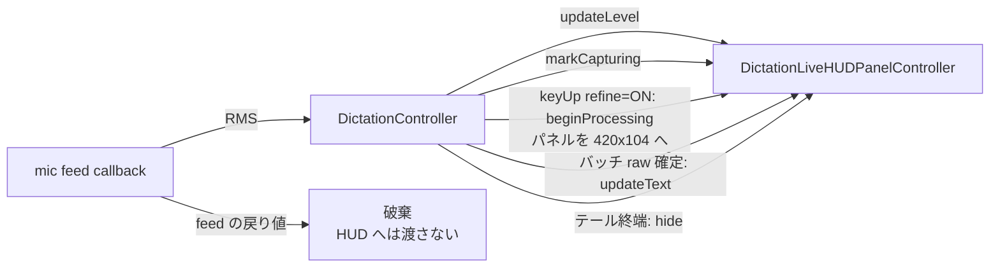

# 49. ディクテーション HUD のスリム化（capturing 中のライブテキスト廃止）

`docs/design/25-dictation-mode.md` §13 の H4（上段に書き起こし中のテキストを出す）と、その前提で
決まっているパネルサイズを改定する。`docs/design/32-dictation-hud-refining-visibility.md` が足した
key-up 後の「整形中…」フェーズはそのまま残す。

結論を先に書くと、**喋っている最中のテキスト表示をやめ、待たされている最中のテキスト表示だけを残す**。

## 1. 経緯・動機

現行 HUD は capturing 中に 1 段目（Nemotron streaming）の累積テキストを出しているが、これを見せる
価値が Kikimi の構成では低い。

- **見せているものが最終結果ではない**。実際に挿入されるのは 2 段目のバッチ再デコード
  （`docs/design/31-dictation-two-pass-decode.md`）と LLM refine を通った別のテキスト。ユーザーは
  1 段目の誤認識を読んで不安になるが、その多くは挿入前に直る。行動を変えられない情報を出している
- **1 段目の語抜けがそのまま見える**。Nemotron のコンテキスト依存の取りこぼしは 2 段目で埋まる
  ことがあるので、capturing 中に欠落を見せてもユーザーにできることがない
- **喋りながら自分の言葉を読むと発話が乱れる**。画面下部中央に 420pt 幅・18pt のテキストが出るため
  視線を引く。ディクテーションは「画面を見ずに喋る」ための機能なのに、画面を見る理由を作っている
- **波形が嘘をついている**。`DictationWaveformView` は音声レベルと無関係に常時アニメーションする
  装飾（design 25 H4 が明示的にそう決めた）。ライブテキストを外すとマイク稼働のフィードバックが
  ここに集約されるので、装飾のままでは「マイクがミュートでも元気に踊る」状態が残ってしまう

一方、key-up 後（`.processing` フェーズ）のテキスト表示は残す価値がある。design 32 §1 のとおり
refine 有効時のテールは 1〜3 秒あり、この間に確定 raw を読ませることが `FrontmostGuard` の abort
発生率を下げる。ここで出しているのはバッチ再デコード後の確定テキストで、最終結果との乖離も小さい。

## 2. 決定事項

| # | 決定 |
|---|------|
| HS1 | **`.preparing` / `.capturing` フェーズではテキストを表示しない**。`DictationLiveHUDPresenting.updateText(_:)` は `.processing` フェーズ専用にする。mic フィードコールバックからの `updateText` 呼び出しを削除し、design 25 H4 の「上段に書き起こし中のテキスト」を廃止する |
| HS2 | **HUD はフェーズで 2 つのサイズを持つ**。`.preparing` / `.capturing` は小型ピル（240×48pt、角丸 24）、`.processing` は現行サイズ（420×104pt、角丸 24）。遷移は `beginProcessing()` の 1 回だけで、アニメーションは付けない（`setFrame(_:display:animate:)` の `animate: false`）。待ち時間を演出で伸ばさない |
| HS3 | **`.preparing` → `.capturing` の遷移表示は維持する**。word-drop fix 3b で入った「マイク準備中…」→ 録音ドットの切り替えは、押した直後に喋ると頭が落ちる問題への唯一の視覚的な手当てであり、経過時間より重要度が高い。小型ピルでも `.preparing` はスピナーとラベルを出す |
| HS4 | **波形を実マイクレベルに接続する**。装飾アニメーション（design 25 H4）をやめ、mic バッファの RMS から算出した 0〜1 のレベルで 5 本のバーの高さを動かす。無音時はバーが静止するので、「マイクが拾えていない」がその場で分かる |
| HS5 | **config は追加しない**。「ライブテキストを見たい」という opt-in は持たない（design 32 HR7 と同じ判断）。1 段目の出力を読みたい開発時の用途は `dictation.history`（design 29）の `entry.json` が既に満たしている |
| HS6 | **`DictationTranscriber.feed(samples:)` の戻り値は残す**。design 25 §13.2 で公開した `-> String?` は `DictationRawSelection.select` に渡す streaming テキストの供給元でもある。HUD へ転送しなくなるだけで、シグネチャは変えない |

## 3. コンポーネント変更

### 3.1 `DictationAudioLevelMeter`（新設）

`Kikimi/Dictation/DictationAudioLevelMeter.swift`。状態を持たない `enum` + 平滑化用の値型で、
AppKit/SwiftUI に依存させずレイヤ 1 で検証する（`DictationElapsedTimeFormatter` と同じ流儀）。

- `static func rms(_ samples: [Float]) -> Float` — 二乗平均平方根。空配列は 0
- `static func normalize(rms: Float) -> Float` — dBFS に変換し、`-50dB`〜`0dB` を 0〜1 に線形マップ
  してクランプする。しきい値 `-50dB` は「静かな室内のノイズフロアではバーが動かない」ことを狙った値で、
  実機確認で調整してよい定数として一箇所に置く。`rms == 0`（無音・ミュート）は 0 を返す
- `struct Smoother` — アタック 0.3 / リリース 0.08 の指数移動平均（`value += (target - value) * coef`、
  上昇時と下降時で係数を変える）。立ち上がりは速く、減衰はゆっくりにして、バッファ到来間隔
  （数十 ms）のちらつきを抑える。`mutating func update(_ target: Float) -> Float`

RMS の計算は **mic のタップコールバックスレッドで行う**。`DictationController+Gesture.swift:70` の
`samplesHandler` クロージャ本体（`Task { @MainActor ... }` の外側）で `rms(_:)` まで済ませ、
`Float` 1 個だけを MainActor へ渡す。サンプル配列の走査を MainActor に乗せない
（word-drop fix 3a/3b が MainActor 経路の遅延を削ってきた経緯と整合させる）。平滑化と正規化は
HUD 側（MainActor）で行う。

### 3.2 `DictationLiveHUDPanel.swift`

- `DictationLiveHUDPresenting` に `func updateLevel(_ rms: Float)` を追加する。spy 実装が増える
  だけなので既存テストへの影響は限定的
- `DictationLiveHUDState` に `@Published var level: Float`（正規化・平滑化済みの 0〜1）を追加。
  `Smoother` は controller が持つ（view は表示だけ）
- `DictationLiveHUDLayout` のサイズ定数を 2 つに分ける（`compactSize = 240×48`、
  `expandedSize = 420×104`）。`positionAtBottomCenter()` はフェーズに応じたサイズを引数に取り、
  下端中央を保ったまま x を再計算する
- `DictationLiveHUDView`: 上段のテキストは `.processing` のときだけ描く。`.preparing` /
  `.capturing` は 1 行のみのレイアウトにする

  | フェーズ | 表示 |
  |---|---|
  | `.preparing` | スピナー + 「マイク準備中…」 |
  | `.capturing` | 録音ドット + レベル連動バー + 経過時間（`m:ss`） |
  | `.processing` | 上段に確定 raw（最大 2 行・`.head` 切り詰め）、下段にスピナー + 「整形中…」 |

- `DictationWaveformView` を `DictationLevelBarsView` に置き換える。5 本のバー（幅 3pt・角丸）を
  `state.level` に応じて高さ 3〜18pt で伸縮させる。バーごとに係数を変えて（中央ほど高く）動かし、
  `.animation(.linear(duration: 0.08), value: level)` で繋ぐ。ランダム要素は入れない
  ——同じ音に対して同じ形になることが「本物のレベル計」の信頼につながる
- `beginProcessing()`: ticker 停止と phase 遷移に加えて、パネルを `expandedSize` へリサイズし
  下端中央へ再配置する。`show()` は `compactSize` にリセットする

### 3.3 `DictationController+Gesture.swift`

- mic フィードコールバックの中身を `handleCapturedSamples(_:level:)` として切り出す（`internal`。
  レイヤ 1 から実マイク無しで駆動するため。§5）。コールバック側に残るのは
  `DictationAudioLevelMeter.rms(samples)` の計算と `Task { @MainActor }` への受け渡しだけにする
- `handleCapturedSamples(_:level:)` の中身:
  - `guard state == .capturing, let transcriber` は従来どおり（key-up 後に遅れて届いたバッファを捨てる）
  - `markCapturing()` → `updateLevel(level)` → `feed(samples:)` の順で呼ぶ
  - `liveHUDPanel?.updateText(cumulativeText)` は削除する（HS1）。`feed(samples:)` の呼び出し自体は
    残し、戻り値だけ捨てる（HS6。streaming デコードを進めるのは `DictationRawSelection.select` の
    フォールバック元として必要）
- `handleHotkeyUp()` 以降のテール（`beginProcessing()` / raw 確定後の `updateText(trimmedRaw)` /
  各終了経路の `hide()`）は design 32 のまま変更しない
- コード内 doc コメントのうち「書き起こし中のテキストをリアルタイム表示する」旨を書いている箇所
  （`DictationLiveHUDPanelController` のクラス doc・`liveHUDPanel` プロパティ doc・
  `DictationLiveHUDView` の doc）を本設計の挙動に改める

### 3.4 既存設計文書への追補

- design 25 §13.1 H4 と §13.3 の mic フィード転送の記述に「本ドキュメントにより改定
  （`docs/design/49-dictation-hud-slim.md`）」の追補注記を付ける（design 32 が H1 に付けたのと同じ流儀）
- design 32 HR2 の「上段のテキストはそのまま残す」に、本設計で上段が `.processing` 専用になった
  旨の追補注記を付ける。HR2 の意図（確定 raw を読みながら待たせる）自体は不変

## 4. 代替案と却下理由

- **config で opt-in にして残す**: HS5 のとおり。1 段目の出力を読む用途は history が満たしている
- **常に小型ピルのままにし、`.processing` でもテキストを出さない**: パネルのリサイズが不要になり
  実装は軽い。しかし design 32 §1 の狙いのうち「確定 raw を読みながら待てる」部分が失われる。
  スピナーだけでも abort 抑止は効くが、テールが 3 秒に達したときの体感が「無言で待たされる」に戻る。却下
- **capturing 中も出すが、フォントを小さくして 1 行にする**: 視線を引く度合いは減るが、
  「読める以上は読んでしまう」ので発話への干渉は残る。中途半端。却下
- **波形を装飾のまま残す**: ライブテキストを外すとマイク稼働の唯一の指標になるため、
  嘘をつくインジケータを残すのは筋が悪い。却下
- **実レベル表示を別 PR に切る**: HS4 だけを後回しにすると、その間 HUD は「装飾波形と経過時間だけ」に
  なり、マイクが死んでいても気づけない期間が生まれる。HS1 と同時に入れる

## 5. テスト方針（レイヤ 1）

`KikimiTests/Dictation/` に追加・改修する。

1. `DictationAudioLevelMeter.rms(_:)`: 空配列 → 0、無音 → 0、フルスケール矩形波 → 1、振幅 0.5 → 0.5
2. `DictationAudioLevelMeter.normalize(rms:)`: `rms == 0` → 0、フルスケール → 1、フルスケール超は
   1 にクランプ、`-50dB` ちょうどと以下 → 0、`-25dB` → 0.5、単調非減少であること
3. `DictationAudioLevelMeter.Smoother`: 1 ステップの追従量が上昇時 > 下降時であること、
   同じ目標値を与え続けると収束すること、`reset()` で 0 に戻ること
4. spy HUD（`DictationLiveHUDPresenting`）を注入し、`simulateCapturing(...)` の後に
   `handleCapturedSamples(_:level:)` を直接呼ぶ:
   - **`updateText` が 1 回も呼ばれないこと**（HS1 の回帰防止）と、`updateLevel` に渡した値が
     順に届くこと・`markCapturing()` がバッファごとに呼ばれること
   - key-up 後に遅れて届いたバッファは `guard state == .capturing` で捨てられ、
     `updateLevel` も `markCapturing` も呼ばれないこと
5. design 32 §5 のテスト 5（raw 確定後に `updateText(選択 raw)`）は**そのまま維持**する
   ——`.processing` でのテキスト表示は本設計でも残るため

パネルサイズの切り替え・バーの描画は表示のみで純ロジックを持たないため、レイヤ 1 の対象外
（design 25 §13.4 / design 32 §5 と同じ判断）。見た目と実マイクでのレベル追従はユーザーの動作確認に委ねる。
