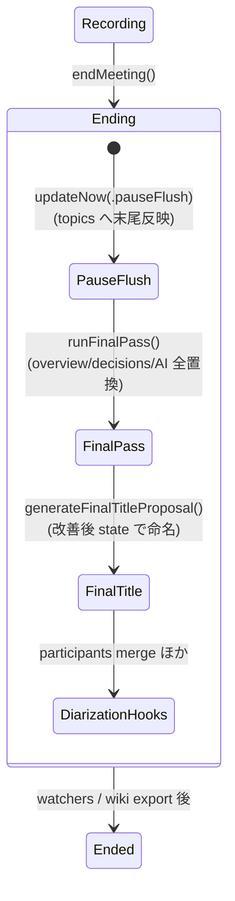

# summary-quality-topics-and-final-pass 詳細設計

対象読者: Kikimi 実装者（Claude Code 自身）。実装前に必ず読むこと。

参照元: `kikimi.md` 8 章（サマリ更新戦略 / patch / 全文再生成）、5 章（`summary.state.json`）、
16 章 7 項（議事詳細は MVP スコープ外、の但し書き）。
依存: `docs/design/04-summary-updater.md`（SummaryUpdater 全体。本ドキュメントはその差分設計）、
`docs/design/42-prompt-overrides.md`（policy/contract 分離・STALE 検知）、
`docs/design/12-llm-client.md`（`LLMCompleting` / JSON Schema / スタブ）、
`docs/design/07-session-store.md`（`summary.state.json` の読み書き）、
`docs/design/13-speaker-diarization.md` 6.2 章（participants merge）。

**結論（変更の全体像）**: 増分 patch 方式の構造問題（decisions の append-only 膨張・overview の
直近話題への偏り・raw 由来誤変換の固定化・時系列詳細の保持場所なし）を、次の 4 点で解消する。

1. **議事詳細（topics）**: `SummaryState` に `topics` 配列を追加し、patch に `topics_add` /
   `topics_update` を追加。view template に「## 議事詳細」を追加して時系列トピックを描画する
2. **セッション終了時の最終整形パス**: Ended 遷移時に全 refined（無ければ raw）+ 現在の state を
   入力とする 1 回の LLM 呼び出しで overview / decisions / action_items を作り直す
3. **decisions の patch 操作拡張**: `decisions_modify` / `decisions_remove` を追加し、`Decision` に
   `id` を導入。プロンプトの編集方針に「認識共有・現状理解・可能性の言及は decision に入れない」等を追加
4. **participants の system 話者除外**: チャネルラベル（`mic` / `system`）が参加者名として state に
   入るのをコード側フィルタで防ぎ、既存の汚染 state も読み込み時に浄化する

根拠データ: セッション `2026-07-31T03-51-26_d7deac6b` と人手議事録の比較。decisions 23 件
（大半が決定ではない）、participants に `system` が混入、overview は直近話題に偏り、
時系列の議事詳細は保持場所が無かった。

## 1. スコープと非スコープ

**スコープ**（変更するモジュール）:

| ファイル | 変更 |
|---|---|
| `Kikimi/Summary/SummaryState.swift` | `Topic` 型・`topics` フィールド・`Decision.id`・後方互換 decode |
| `Kikimi/Summary/SummaryPatch.swift` | `topicsAdd`/`topicsUpdate`/`decisionsModify`/`decisionsRemove`・schema 更新・`SummaryFinalRevision` 型追加 |
| `Kikimi/Summary/SummaryPatchApplier.swift` | 新 patch 操作の適用・participants フィルタ・state 浄化関数 |
| `Kikimi/Summary/SummaryRenderer.swift` | 既定 template に議事詳細追加・topics のレンダリングコンテキスト |
| `Kikimi/Summary/SummaryPromptBuilder.swift` | `patchContract` に topics / decisions 拡張の構造ルール追加 |
| `Kikimi/Summary/SummaryUpdater.swift` ほか | `RequestKind.finalPass` と直列化配線・state 読み込みの浄化フック |
| `Kikimi/Summary/SummaryUpdater+FinalPass.swift`（新規） | 最終整形パス本体 |
| `Kikimi/Prompts/PromptSpec.swift` | `summaryDefaultBody` の編集方針追記・`PromptID.summaryFinal` 新設 |
| `Kikimi/SessionStore/SessionHandle+Prep.swift` | `defaultSummaryTemplate` に議事詳細セクション追加 |
| `Kikimi/ViewModels/MeetingWorkspaceViewModel+Recording.swift` | `endMeeting()` に最終整形パスの呼び出し追加 |

**非スコープ**:

- リアルタイムのトピック境界検出アルゴリズム（トピック分割は LLM の patch 判断に委ねる）
- 最終整形パスの手動再実行 UI・モデル選択 UI（将来。壊さない形は 7.5 節で担保）
- topics を最終整形パスで書き直すこと（7.2 節の理由により対象外）
- Watcher / Wiki export / チャットのプロンプト変更
- `config.yaml` の新キー追加（モデルは既存 `summary.model` を使う）

## 2. データモデル変更（`SummaryState`）

### 2.1 追加 schema

```yaml
title: string
participants: [string]
overview: string
topics:                      # 追加（時系列。配列順 = 発生順）
  - id: string               # "tp_001" 形式。採番規則は action_items の "ai_00N" と同じ
    heading: string          # 短いトピック見出し（例: "検索基盤の移行方針"）
    body: string             # Markdown（要点の箇条書き想定）。topic 内スナップショット
    source_seg_ids: [string]
decisions:
  - id: string               # 追加（"dc_001" 形式）。modify/remove の参照キー
    text: string
    source_seg_ids: [string]
action_items: （変更なし）
```

```swift
struct SummaryState {
    // 既存フィールドに加えて
    var topics: [Topic]

    struct Topic: Codable, Sendable, Equatable {
        var id: String            // "tp_001"
        var heading: String
        var body: String
        var sourceSegIds: [String]
    }

    struct Decision: Codable, Sendable, Equatable {
        var id: String            // 追加。"dc_001"
        var text: String
        var sourceSegIds: [String]
    }
}
```

### 2.2 後方互換 decode（既存 `summary.state.json` の読み込み）

既存セッションの state には `topics` キーも `decisions[].id` も無い。synthesized `Codable` は
キー欠落で throw するため、`SummaryState` と `Decision` に**カスタム `init(from:)`** を追加する。

- `topics = try container.decodeIfPresent([Topic].self, forKey: .topics) ?? []`
- `Decision.id = try container.decodeIfPresent(String.self, forKey: .id) ?? ""`（空文字 = 未採番。
  2.3 の浄化で採番される）
- **`CodingKeys` は camelCase の case 名のまま（raw 値を書かない）**。snake↔camel は
  `SessionJSONCoding` / `LLMClient` 両経路の `.convertFromSnakeCase` に任せる、という
  04-summary-updater.md 2.1 章のキー戦略を維持する（明示 snake_case キーは二重変換で衝突する）
- encode 側は synthesized のままで良い（全フィールドを常に書く）

### 2.3 state 浄化（`SummaryStateSanitizer`）

読み込んだ state を LLM や patch 適用に渡す前に正規化する pure function を
`SummaryPatchApplier.swift` に置く。

```swift
/// In-place normalization of a freshly-loaded SummaryState. Pure, deterministic.
func sanitizeState(_ state: inout SummaryState)
```

処理内容:

1. **decisions の未採番 id 補完**: `id` が空の decision に `dc_00N` を若番から採番（既存 id と
   衝突しない次番号。`nextAvailableActionItemId` と同じ走査方式）
2. **topics の未採番 id 補完**: 同様に `tp_00N`（通常発生しないが LLM 出力の乱れ・手編集への防御）
3. **participants の予約名除去**: 8 章のフィルタ規則で `mic` / `system` に一致する要素を除去

呼び出し箇所は `SummaryUpdater` 内の **state 読み込みを 1 箇所に集約したヘルパ**にする:

```swift
// SummaryUpdater 内。readJSON(.summaryState) の唯一の呼び出し口にする
func readSanitizedSummaryState() async throws -> SummaryState
```

`loadPendingInput()` / `performFinalTitleProposal()` / `performParticipantsMerge(_:)` /
`performFinalPass()` のすべてがこれを使う。これにより**既存セッションの `participants: ["system"]`
汚染も、次に SummaryUpdater が state を書く操作をした時点で自然に直る**。

## 3. patch 拡張（`SummaryPatch`）

### 3.1 追加フィールド

```swift
struct SummaryPatch {
    // 既存フィールドに加えて
    var topicsAdd: [SummaryState.Topic]?          // topics_add: 新トピック開始
    var topicsUpdate: [TopicUpdate]?              // topics_update: 既存トピックの更新
    var decisionsModify: [DecisionModify]?        // decisions_modify: 既存 decision の修正
    var decisionsRemove: [String]?                // decisions_remove: 削除する decision の id 群

    struct TopicUpdate: Codable, Sendable, Equatable {
        var id: String
        var heading: String?                      // 非 nil なら見出しを置換
        var body: String?                         // 非 nil なら本文を全文置換（追記も LLM が全文で返す）
        var sourceSegIds: [String]?               // 追記分。既存に append（重複排除）
    }

    struct DecisionModify: Codable, Sendable, Equatable {
        var id: String
        var text: String?                         // 非 nil なら置換
        var sourceSegIds: [String]?               // 追記分。既存に append（重複排除）
    }
}
```

`topics_update.body` を**差分追記ではなく全文置換**にするのは、overview の snapshot と同じ理由:
1 トピックは有界サイズであり、追記方式は「LLM が既存本文と重複した内容を返す」事故に対する
重複排除をアプリ側に要求してしまう。トピック単位 snapshot なら適用が決定論的に単純になる。

### 3.2 適用ルール（`applyPatch` への追加。すべて pure・決定論的）

適用順序: 既存の title → participants → overview → decisions（add → modify → remove）→
**topics（add → update）** → action_items。同一 patch 内で「add したトピックを update する」
「add した decision を modify する」を許すため、add を先に適用する。

| 操作 | 適用 |
|---|---|
| `topicsAdd` | 末尾に append（時系列順を配列順で表現）。id 衝突時は `tp_00N` を採り直してリネーム（warn ログ。action_items の add と同じ方式） |
| `topicsUpdate` | 一致する `id` の topic の `heading`/`body` を非 nil のフィールドだけ置換。`sourceSegIds` は既存に無いものだけ append。該当 id 不在なら無視（warn ログ） |
| `decisionsAdd` | 従来どおり末尾 append + 正規化 text の重複排除。id 衝突時は `dc_00N` にリネーム |
| `decisionsModify` | 一致する `id` の `text` を置換（`sourceSegIds` は append・重複排除）。**置換後 text が他の既存 decision と正規化一致しても削除はしない**（modify は「言い直し」であり重複判定は add 時のみ）。id 不在なら無視（warn ログ） |
| `decisionsRemove` | 一致する `id` の decision を配列から除去。id 不在なら無視（warn ログ） |

同一 patch に同じ id への modify と remove が両方あるケースは、適用順（modify → remove）により
remove が勝つ。LLM の乱れとして許容する（壊れない）。

### 3.3 JSON Schema（`patchSchemaJSON`）の更新

`SummaryJSONSchema.patchSchemaJSON` に以下を追加する（全体は従来どおり `required: []`・
`additionalProperties: false`。ワイヤは snake_case）:

```json
"topics_add": {
  "type": ["array", "null"],
  "items": {
    "type": "object",
    "properties": {
      "id": { "type": "string" },
      "heading": { "type": "string" },
      "body": { "type": "string" },
      "source_seg_ids": { "type": "array", "items": { "type": "string" } }
    },
    "required": ["id", "heading", "body", "source_seg_ids"],
    "additionalProperties": false
  }
},
"topics_update": {
  "type": ["array", "null"],
  "items": {
    "type": "object",
    "properties": {
      "id": { "type": "string" },
      "heading": { "type": ["string", "null"] },
      "body": { "type": ["string", "null"] },
      "source_seg_ids": { "type": ["array", "null"], "items": { "type": "string" } }
    },
    "required": ["id"],
    "additionalProperties": false
  }
},
"decisions_modify": {
  "type": ["array", "null"],
  "items": {
    "type": "object",
    "properties": {
      "id": { "type": "string" },
      "text": { "type": ["string", "null"] },
      "source_seg_ids": { "type": ["array", "null"], "items": { "type": "string" } }
    },
    "required": ["id"],
    "additionalProperties": false
  }
},
"decisions_remove": { "type": ["array", "null"], "items": { "type": "string" } }
```

あわせて `decisions_add.items` に `"id": { "type": "string" }` を追加し `required` に含める
（LLM が採番、アプリが一意性担保。action_items と同じ契約）。

## 4. view template とレンダリング

### 4.1 既定 template への追加

`SummaryRenderer.defaultTemplate` と `SessionHandle.defaultSummaryTemplate`（**2 定数とも**。
現状重複定義されているので、この機会に `SummaryRenderer.defaultTemplate` を正とし
`SessionHandle` 側はそれを参照する形に一本化してよい）へ、末尾に追加:

```markdown
## 議事詳細

{{#topics}}### {{heading}}

{{body}}

{{/topics}}
```

- 配置は**アクションアイテムの後（末尾）**。軽量セクション（概要・決定・AI）を先頭に保ち、
  長くなる時系列詳細を最後に置く（人手議事録の一般的な構成に一致）
- 開始タグ `{{#topics}}` は kikimi.md 8 章のルールどおり繰り返し行の直前に詰めて書く
  （standalone-line 折りたたみ対策）
- topics が空でも「## 議事詳細」見出しは出る。決定事項が 0 件でも見出しが出る既存挙動と同じで許容

### 4.2 レンダリングコンテキスト

`renderingContext(for:)` に追加:

```swift
"topics": state.topics.map { ["heading": $0.heading, "body": $0.body] }
```

`id` / `source_seg_ids` は template に露出しない（kikimi.md 8 章「template が参照できる変数は
schema で定義された field のみ」の精神は保つが、内部管理キーは view の関心でないため）。

**HTML エスケープ対策（text モード固定）**: GRMustache の既定 `contentType` は HTML で、`{{...}}` は
`& < >` 等をエスケープする。`body` は Markdown 複数行なので、エスケープされると引用 `>` や `&` が
壊れる。対策は **`{{% CONTENT_TYPE:TEXT }}` プラグマを、パース前に template 文字列の先頭へ
プリペンドする**方式を正とする（内蔵 default template とユーザー template の両方に適用。
`Template(string:)` へ渡す直前にレンダラが機械的に付ける）。

- `Template.contentType = .text` という代入 API は **GRMustache に存在しない**
  （`Template.contentType` は get-only の computed property —
  `.build/checkouts/GRMustache.swift/Sources/Template.swift:169`）。設計・実装で使わないこと
- `Mustache.DefaultConfiguration.contentType = .text` でも切り替えられるが、グローバル可変状態で
  あり Swift 6 strict concurrency 下ではデータ競合警告・他レンダリング箇所への波及を招くため
  **採用しない**
- プリペンドは**改行を挟まず** `"{{% CONTENT_TYPE:TEXT }}" + templateString` と連結する。
  プラグマタグはレンダリング出力を生成しないため出力は不変（改行を挟むと、GRMustache.swift は
  standalone-line 折りたたみをしないので先頭に空行が出る。4.1 の `{{#topics}}` 詰め書きと同じ理由）。
  ユーザー template が自分でプラグマを書いていても、同一値の重複指定は無害

これは既存の `{{overview}}` / `{{text}}` にも同種の潜在問題があるため、レンダラ全体に適用し、
Markdown 特殊文字が素通りする単体テストを追加する。

### 4.3 既存セッション・ユーザー template との互換

- template はセッション作成時に `defaults.summary_template_file` からコピーされるため、
  **既存セッション / ユーザーのカスタム既定 template には議事詳細セクションが自動では入らない**。
  その場合 state の `topics` は蓄積されるが描画されないだけで、壊れない（前方互換）
- 対応: 実装 Phase の完了報告で「`~/.config/kikimi/templates/summary.md` を使っている場合は
  `## 議事詳細` セクションの追記が必要」と告知する。自動マイグレーションはしない
  （ユーザー編集ファイルへの書き込みは事故のもと）

## 5. プロンプト変更（増分サマリ）

### 5.1 patch 契約（contract 層。`SummaryPromptBuilder.patchContract`）

以下を追記する（構造ルールなので override 不可の contract 層）:

```
- topics は「議事詳細」の時系列トピック列。新しい話題が始まったときだけ topics_add で追加し、
  進行中の話題への追記・修正は topics_update で該当 id の body を全文書き直して返す
- topics の id は "tp_001" 形式、decisions の id は "dc_001" 形式で採番する
- decisions は decisions_add（新規）/ decisions_modify（既存の text 修正）/
  decisions_remove（撤回・誤登録の削除）の 3 操作
- (mic) / (system) は音声チャネルのラベルであり発言者名ではない。participants_add に入れない
```

### 5.2 編集方針（policy 層。`PromptSpec.summaryDefaultBody`）

既存の【編集方針】に以下の趣旨の箇条を追加する（文言は実装時に調整可。構造キーワードは
contract 層にあるので、ここは内容判断のみ）:

```
- decisions は「これをやる / やらない / この方針で進める」と明確に合意された事項だけにする。
  認識共有・現状理解の確認・可能性やアイデアの言及・単なる進捗報告は decision に入れない
- 一度追加した decision が後の会話で覆された・条件付きに変わった・誤りと分かった場合は、
  decisions_modify で書き直すか decisions_remove で取り下げる
- topics は会議の話題のまとまりごとに時系列で作る。見出しは内容が特定できる短い名詞句にする。
  body は要点の箇条書きで、結論・数値・固有名詞・対立した意見の両論を残す。発言の逐語再現はしない
- 直近の会話が既存トピックの続きなら新トピックを作らず topics_update で該当トピックに統合する
```

### 5.3 override への影響（42-prompt-overrides.md）

`summaryDefaultBody` の変更で `defaultBodyHash(.summary)` が変わるため、既存の
`~/.config/kikimi/prompts/summary.md` override は **STALE 判定**になる。これは 42 の設計どおりの
挙動（`kikimi` skill の STALE 取り込みフローで解消する）。実装 Phase の完了報告に明記する。

## 6. participants の system 話者除外

### 6.1 問題

サマリプロンプトのセグメント行は `seg_00350 (system): ...` 形式のため、LLM が `system` を
発言者名と誤解して `participants_add` に載せる（実例: `2026-07-31T03-51-26_d7deac6b` の
`participants: ["furu", "system"]`）。

### 6.2 フィルタ規則（コード側・二重）

- **予約名集合**: `AudioSourceKind.allCases.map(\.rawValue)` = `{"mic", "system"}`。
  判定は「trim + 小文字化した完全一致」（`"System"` / `" system "` も弾く。`"systema"` 等の
  部分一致は弾かない）
- **適用点 1（入口）**: `applyParticipants` で、予約名に一致する追加候補を debug ログ付きで
  skip する。`mergeParticipants(_:)`（diarization 由来）も同じ `applyPatch` を通るので自動的に
  カバーされる。ユーザーが話者スロットを手動で `system` と命名した場合も弾かれるが、
  チャネルラベルと同名の参加者表記はどのみち紛らわしいため仕様として許容する
- **適用点 2（既存汚染の浄化）**: 2.3 の `sanitizeState` が読み込み時に既存の予約名要素を除去する
- プロンプトの contract 層にも 5.1 の 1 行を追加する（プロンプトは補助、コードフィルタが正）

## 7. セッション終了時の最終整形パス

### 7.1 目的

増分 patch は「そのとき見えていた直近 20 セグメント」への局所最適を積むため、
overview の偏り・decisions の粒度不揃い・raw 由来誤変換の固定化が構造的に残る。
Ended 時に**会議全体を一望した 1 回の LLM 呼び出し**で overview / decisions / action_items を
最終版に書き直す。

### 7.2 入出力

**入力**:

- 全セグメント（refined 優先・無ければ raw。`+Regeneration.swift` の
  `loadAllSegmentsSortedForRegeneration()` を共有ヘルパ `loadAllSegmentsSorted()` に改名して共用）
- 現在の `summary.state.json`（浄化済み）。増分更新が積んだ判断（特に action_items の
  `status: done` と topics の構造）を参照材料として渡す
- `loadComposedContext()`（事前知識 + 参加者ブロック。増分更新と同じ）

**出力**（新型 `SummaryFinalRevision`。`SummaryPatch.swift` に併置）:

```swift
struct SummaryFinalRevision: Codable, Sendable, Equatable {
    var overview: String
    var decisions: [RevisedDecision]
    var actionItems: [RevisedActionItem]

    struct RevisedDecision: Codable, Sendable, Equatable {
        var text: String
        var sourceSegIds: [String]
    }

    struct RevisedActionItem: Codable, Sendable, Equatable {
        var task: String
        var assignee: String
        var due: String?
        var status: SummaryState.ActionItem.Status   // 既存 done の維持は contract で指示
        var sourceSegIds: [String]
    }
}
```

- **id は LLM に返させない**。適用時にアプリが `dc_001…` / `ai_001…` を先頭から採番し直す
  （全置換なので衝突管理が不要になる）
- **topics は書き直さない**。理由: (a) 全 topics の再生成は出力トークンが会議時間に比例して
  膨らみ、1 呼び出しの失敗半径が大きい、(b) topics は増分で時系列に積むこと自体に価値があり、
  全体俯瞰による再編の効果が薄い、(c) 劣化時は既存の全文再生成（救済パス）で作り直せる
- **title / participants も対象外**（title は既存の final title proposal、participants は
  diarization merge がそれぞれ担う）

**対応する JSON Schema** `SummaryJSONSchema.finalRevisionSchemaJSON` を新設する。
`overview` / `decisions` / `action_items` すべて `required`・`additionalProperties: false`。

### 7.3 適用（pure function）

```swift
/// Replaces overview/decisions/actionItems wholesale; title/participants/topics/
/// lastSummarizedStartMs are untouched. Renumbers dc_/ai_ ids from 001.
func applyFinalRevision(_ revision: SummaryFinalRevision, to state: inout SummaryState)
```

**破壊防止ガード**: `revision` の overview が空 かつ decisions / actionItems が空で、
かつ適用前 state に非空の内容がある場合は**適用せず warn で skip**する
（LLM が実質空応答を返して積み上げを消す事故の防御）。

### 7.4 プロンプト

- **PromptID 追加**: `case summaryFinal = "summary-final"`（`reload: .immediate`、
  `requiredPlaceholders: []`、eject コメントなし）。override ファイルは
  `~/.config/kikimi/prompts/summary-final.md`
- **policy 層 default body（`summaryFinalDefaultBody`）の趣旨**:

```
あなたは会議の議事録を仕上げる編集者です。会議全体の書き起こしと、会議中に自動生成された
サマリ state を受け取り、overview / decisions / action_items を最終版に書き直してください。

【編集方針】
- overview は会議全体を俯瞰した要約にする。冒頭の議題から結論までの流れが掴めるようにし、
  終盤の話題に偏らせない
- decisions は会議終了時点で有効な決定だけを残す。途中で覆された決定・認識共有・現状理解・
  可能性の言及は含めない。同じ決定の重複や言い換えは 1 件に統合する
- action_items は重複を統合し、担当・期限は発言から読み取れる場合のみ埋める（推測で埋めない）
- 既存 state で status が done の action item は、最終版でも done を維持する
- 書き起こしには誤変換があり得る。文脈から明らかな誤変換は正しい表記で書く
```

- **contract 層**（アプリが自動付与）: 出力は overview / decisions / action_items を全て含む
  JSON であること、id は返さないこと、の構造ルール
- **user prompt**: 【事前知識】+【現在の state】（浄化済み state の JSON。topics も含めて渡す —
  増分の文脈を最終判断の参考にさせる）+【会議全体の書き起こし】（`seg_XXXXX (mic): ...` 形式、
  startMs 昇順）+ 指示文。ビルダは `SummaryPromptBuilder.buildFinalRevisionUserPrompt(...)`
  として追加（pure、既存 `formatLine` を共用）
- **入力サイズ**: チャンク分割しない（分割すると「全体を一望する」目的が壊れる）。1 時間会議で
  概ね数万〜十数万文字であり、下記バジェット内に収まる。防御として文字数バジェット
  （定数 `finalPassMaxTranscriptChars = 150_000`）を置き、超過時は**古い側から超過分を切り捨てて
  warn**（state は必ず全量渡す）
- **バジェット値の根拠**: 既定モデル claude-haiku-4-5 のコンテキストは 200K トークン。日本語は
  概ね 1 文字 ≒ 1 トークンとして保守的に見積もり、書き起こし部分の上限を
  「コンテキスト長 − ヘッドルーム」で決める。ヘッドルームとして
  state JSON（topics 込みで最大数万文字）・事前知識/参加者ブロック・固定プロンプト（policy +
  contract）・構造化 JSON 出力（max_tokens 分）を合わせて約 50K トークンを確保し、
  `150_000` 文字とする。これを超える会議（連続 5〜6 時間超相当）では古い発言から切り捨てるが、
  final pass 自体は必ず実行される。**600K 文字のような値は 200K トークンを大幅に超過し、
  バジェットが発動する前に LLM 呼び出しがコンテキスト超過で失敗する（= 長時間会議ほど final pass
  が黙って skip される）ため不可**。将来モデルのコンテキスト長を config で持つようになったら、
  そこから算出する方式（トークン見積もりベース）に置き換えてよい

### 7.5 `SummaryUpdater` API と直列化

```swift
// SummaryUpdater+FinalPass.swift（新規）
extension SummaryUpdater {
    /// Session-end final refinement pass. Awaitable. `modelOverride` は将来の手動再実行 UI 用の
    /// 口（現状の呼び出し元は常に nil = config.summary.model）。
    func runFinalPass(modelOverride: String? = nil) async
}
```

- `RequestKind` に `.finalPass(modelOverride: String?)` を追加。coalescing は
  `pendingFinalPass: (requested: Bool, modelOverride: String?)` 相当のフラグ 1 つ
  （後勝ちで modelOverride を上書き）
- `takePendingRequest()` の優先順位: regeneration → **finalPass** → finalTitleProposal →
  incrementalUpdate → participantsMerge。**finalPass を finalTitleProposal より先**にするのは、
  最終タイトル案が state の overview / decisions を材料にするため（改善後の state で命名させる）
- `stubKey: "summary_final"`（`KIKIMI_STUB_LLM_FILE` で供給。builtin default は持たない —
  `summary_patch` / `final_title` と同じ扱い。`kikimi-verify` のスタブファイルに追加する）
- **LLM タイムアウト**: `LLMRequest.timeout` の既定は 60 秒（`Kikimi/LLM/LLMTypes.swift:51`）で、
  全量書き起こし（7.4 のバジェット上限で最大 150K 文字）+ 構造化 JSON 生成には不足する。
  final pass は **`LLMRequest` に明示タイムアウト（定数 `finalPassTimeout: Duration =
  .seconds(300)`）を渡す**。ChatRunner が `config.timeoutSeconds`（既定 180 秒）を明示指定するのと
  同じ流儀（`Kikimi/Chat/ChatRunner.swift:78`）。300 秒の根拠: 入力上限 150K 文字は Chat の
  `maxContextChars` より大きく、出力もサマリ全置換 JSON で Chat 応答より重いため、Chat の
  180 秒より余裕を持たせる。この定数は 7.4 の `finalPassMaxTranscriptChars` と**対で管理**する
  （入力上限を上げるならタイムアウトも見直す。両定数は同じファイルに隣接して定義しコメントで
  相互参照する）。タイムアウト超過は `LLMClientError.timedOut` として 4 の失敗パスに合流する
- 実行フロー（`performFinalPass`）:

```
1. readSanitizedSummaryState()。読めなければ .empty
2. loadAllSegmentsSorted()。空なら skip（LLM を叩かない。要約対象が無い）
3. プロンプト構築 → llm.complete(schema: finalRevisionSchemaJSON, model: modelOverride ?? config.model,
   timeout: finalPassTimeout /* 300s。既定 60s では全量入力に不足 */)
4. 失敗（LLMClientError）→ warn して skip。増分で積んだ state/summary.md がそのまま残る
5. applyFinalRevision（7.3 の空応答ガード込み）
6. writeJSON(.summaryState) → render → writeText(.summaryMarkdown)（既存更新フローと同じ
   フォールバック: render 失敗時は前回 summary.md 保持）
7. events に SummaryUpdateEvent(summaryMarkdown: rendered, metaChanged: false) を yield
```

- `lastSummarizedStartMs` は**変更しない**（最終パスは新規セグメントを消費しない。reopen 後の
  増分更新のカーソルを壊さない）

### 7.6 `endMeeting()` への配線

`MeetingWorkspaceViewModel+Recording.swift` の既存 2 分岐をそれぞれ拡張する:

```swift
if let updater = summaryUpdater {                      // Recording から直接 Ended
    await updater.updateNow(reason: .pauseFlush)       // 末尾セグメントを topics に取り込む
    await updater.runFinalPass()                       // 追加（final title より前）
    await updater.generateFinalTitleProposal()
    await applyDiarizationEndedHooks(updater: updater)
    stopSummaryUpdater()
} else {                                               // Paused から Ended（transient updater）
    let transientUpdater = summaryUpdaterFactory(sessionHandle)
    await transientUpdater.runFinalPass()              // 追加
    await transientUpdater.generateFinalTitleProposal()
    await applyDiarizationEndedHooks(updater: transientUpdater)
}
```

- `pauseFlush` を final pass の前に残すのは topics のため（final pass は topics を書き直さない
  ので、末尾セグメントの議事詳細反映は増分更新が担う）
- final pass は wiki export（`endMeeting()` 後段）より前に完了するので、**export される
  `summary.md` は最終整形後の内容**になる
- `.ending` 表示時間が LLM 1 呼び出し分（全文入力）延びる。既存の final title / on_session_end
  Watcher と同じ扱いで、失敗しても `endMeeting()` の完了は妨げない
- **reopen（Ended → Recording → Ended）**: 2 回目の `endMeeting()` で final pass も再実行される。
  全量入力からの全置換なので冪等に近く、追加録音分も反映される（望ましい挙動）

### 7.7 状態遷移まとめ



## 8. 失敗モード一覧

| 事象 | 振る舞い |
|---|---|
| 旧 `summary.state.json`（`topics` / `decisions[].id` なし）の読み込み | カスタム decode が `[]` / `""` で補完 → `sanitizeState` が id 採番・予約名除去。throw しない |
| `topics_update` / `decisions_modify` / `decisions_remove` が未知 id を参照 | 無視 + warn ログ（既存 action_items と同じ堅牢性方針） |
| `topics_add` / `decisions_add` の id 衝突 | `tp_00N` / `dc_00N` を採り直してリネーム + warn |
| 同一 patch 内で同じ decision に modify と remove | modify → remove の適用順により remove が勝つ。壊れない |
| LLM が participants_add に `system` / `mic` を返す | `applyParticipants` が skip（debug ログ）。既存汚染は読み込み時浄化 |
| 最終整形パスの LLM 失敗（CLI 不在・認証・タイムアウト・JSON 破損） | warn して skip。増分 state / summary.md が最終成果物になる。`endMeeting()` は継続 |
| 最終整形パスが実質空の revision を返す（既存 state は非空） | 適用せず warn で skip（7.3 の破壊防止ガード） |
| 最終整形パスの書き起こしが文字数バジェット（150K 文字）超過 | 古い側から切り捨てて warn（state は全量渡す）。バジェットはモデルコンテキスト内に収まる値なので、切り捨て後の呼び出しはコンテキスト超過で失敗しない |
| セグメント 0 件で final pass 起動 | LLM を叩かず skip |
| 議事詳細セクションの無い既存 template | topics は state に蓄積されるが描画されないだけ。壊れない（4.3） |
| Mustache render 失敗 | 既存どおり内蔵 default 再試行 → なお失敗なら前回 summary.md 保持 |
| `summary.md` の render で Markdown 特殊文字が HTML エスケープされる | 4.2 の text モード固定で防止（単体テストで担保） |

## 9. kikimi.md からの逸脱と理由

kikimi.md は今回読み取り専用のため、以下は**本ドキュメントを根拠に、実装 Phase 完了時に
kikimi.md 8 章・16 章の改訂を提案する**（すべてユーザー合意済みスコープ）。

1. **議事詳細（topics）の追加** — kikimi.md 8 章「議事詳細は MVP では作らない」・16 章 7 項
   「実戦で必要性を確認してから追加検討」からの逸脱。逸脱理由: その但し書きの条件（実戦での
   必要性確認）が `2026-07-31T03-51-26_d7deac6b` と人手議事録の比較で満たされた。懸念だった
   「トピック境界のリアルタイム判定精度」は、単語単位の即時判定ではなくバッチ patch
   （20 セグメント / 3 分粒度）での判定 + `topics_update` による後追い統合で緩和する
2. **template 変数集合の拡張** — 8 章の「参照できる変数は `{{title}}` `{{overview}}`
   `{{decisions}}` `{{action_items}}` `{{participants}}` のみ」に `{{topics}}` が加わる
3. **decisions の patch 戦略変更** — 8 章の表では decisions は append_only。本設計で
   add / modify / remove の 3 操作に拡張（append-only が 23 件膨張の直接原因）
4. **`on_session_end` への最終整形パス追加** — 8 章の session-end 処理は最終タイトル案のみ。
   サマリ本体の作り直しを追加
5. **participants のコード側フィルタ** — 8 章では participants は LLM の append_only 提案のみ。
   予約チャネル名のアプリ側フィルタを追加（LLM 出力の乱れをアプリが吸収する 8.5 章の思想の延長）

## 10. Chirami 参照実装との差分

`docs/references/chirami-map.md` を確認した。**Chirami にはサマリ生成・patch 適用・LLM 整形
パイプラインに相当する実装が存在しない**（参照マップの対象は音声取込・sherpa-onnx・NSPanel・
Yams config・xcodegen/mise・verify skill のみ）。本機能は Kikimi 固有であり、参照すべき差分はない。

## 11. テスト（docs/development-process.md 2.9 レイヤ 1）

pure function 中心。既存 `KikimiTests/Summary/` に追加する。

- **`applyPatch` 追加分岐**: topics_add（append・id 衝突リネーム）、topics_update（body 全文置換・
  heading 単独更新・sourceSegIds 追記重複排除・未知 id 無視）、decisions_modify（text 置換・
  未知 id 無視・置換後の正規化重複を消さないこと）、decisions_remove（除去・未知 id 無視）、
  同一 patch 内 add → update / modify → remove の順序性
- **後方互換 decode**: `topics` / `decisions[].id` 無しの実 JSON（旧セッション形式）が decode でき、
  `sanitizeState` 後に id が採番され `system` が participants から消えること
- **`applyParticipants` フィルタ**: `system` / `System` / `" mic "` を弾き、`systema` や通常名は通すこと
- **`applyFinalRevision`**: 全置換・id 再採番・title / topics / participants / cursor 不変・
  空 revision ガード（既存非空 state を消さない）
- **`SummaryRenderer`**: topics 入り state → 議事詳細セクションの期待 Markdown（空 topics 含む）。
  text モード固定により `& < >` を含む overview / body が素通りすること
- **JSON Schema 定数 ↔ 型**: 拡張後 `patchSchemaJSON` / 新設 `finalRevisionSchemaJSON` が有効
  JSON で、代表 JSON が `SummaryPatch` / `SummaryFinalRevision` にデコードできること
- **`SummaryPromptBuilder`**: `buildFinalRevisionUserPrompt` の期待文字列（state JSON に topics が
  含まれる・seg 行形式・バジェット超過時の先頭切り捨て）
- **`SummaryUpdater` フロー（フェイク LLM 注入）**: `runFinalPass` の成功パス（state 全置換 +
  summary.md 更新 + event yield）・LLM 失敗 skip・空セグメント skip・
  final pass 実行中に増分要求が coalesce されること・優先順位（finalPass が finalTitle より先）・
  発行される `LLMRequest` の timeout が `finalPassTimeout`（300 秒）であること
- **`PromptSpec`**: `.summaryFinal` の spec が引ける・`defaultBodyHash` が全 PromptID で算出できる
  （既存テストパターンの拡張）

レイヤ 2（`kikimi-verify`）は本設計のスコープ外とし、実装 Phase で
`KIKIMI_STUB_LLM_FILE` に `summary_final` キーを足したシナリオを追加する。

## 12. Open Questions

1. **final pass と refinement drain の順序**: `endMeeting()` 時点では末尾バッチの refinement が
   未完了のことがあり、final pass の入力に raw フォールバックが混ざる（Wiki export が post-drain で
   再 export されるのと同じギャップ）。MVP は許容（整形済みが大半で、final pass 自体が誤変換耐性の
   指示を持つ）。実戦で品質差が見えたら post-drain hook での final pass 再実行を検討
2. **topics による state 肥大**: 増分更新は毎回全 state を LLM に渡すため、長時間会議では
   topics の body がプロンプトコストを押し上げる。将来案: 直近 N トピックのみ body 全文、
   それ以前は heading のみ渡す。MVP では計測のみ（`llm_usage.jsonl` で確認できる）
3. **手動再実行 UI**: `runFinalPass(modelOverride:)` の口は用意するが、UI（モデル選択・
   Ended 後の再実行ボタン）をどの Phase で作るか
4. **ドキュメント番号**: 既存 `docs/design/` は番号プレフィックス（01–42）だが、本ドキュメントは
   指示されたパス名（番号なし）で起草した。リネーム（`43-...`）するかは Phase 完了時に判断
